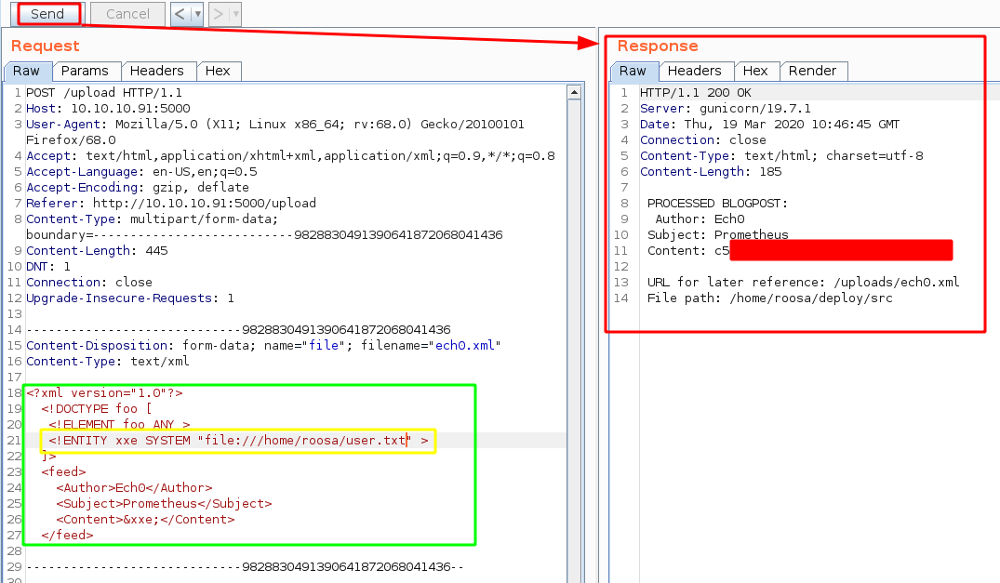
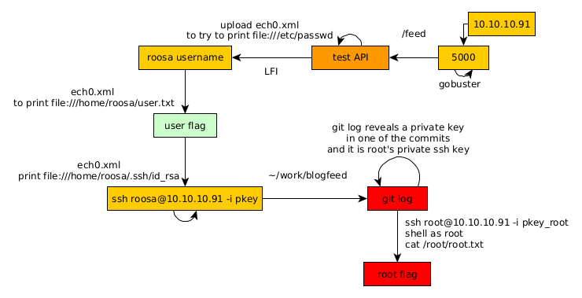

---
search:
  exclude: true
---
# DevOops Writeup

## Introduction :

DevOops is a Medium linux box released back in June 2018.

## **Part 1 : Initial Enumeration**

As always we begin our Enumeration using **Nmap** to enumerate opened ports. We will be using the flags **-sC** for default scripts and **-sV** to enumerate versions.
    
    
      λ nihilist [ 10.10.14.11/23 ] [~]
      → nmap -F 10.10.10.91 --top-ports 10000
      Starting Nmap 7.80 ( https://nmap.org ) at 2020-03-19 09:57 GMT
      Nmap scan report for 10.10.10.91
      Host is up (0.050s latency).
      Not shown: 8318 closed ports
      PORT     STATE SERVICE
      22/tcp   open  ssh
      5000/tcp open  upnp
    
      Nmap done: 1 IP address (1 host up) scanned in 5.09 seconds
    
      λ nihilist [ 10.10.14.11/23 ] [~]
      → nmap -sCV -p22,5000 10.10.10.91
      Starting Nmap 7.80 ( https://nmap.org ) at 2020-03-19 09:57 GMT
      Nmap scan report for 10.10.10.91
      Host is up (0.039s latency).
    
      PORT     STATE SERVICE VERSION
      22/tcp   open  ssh     OpenSSH 7.2p2 Ubuntu 4ubuntu2.4 (Ubuntu Linux; protocol 2.0)
      | ssh-hostkey:
      |   2048 42:90:e3:35:31:8d:8b:86:17:2a:fb:38:90:da:c4:95 (RSA)
      |   256 b7:b6:dc:c4:4c:87:9b:75:2a:00:89:83:ed:b2:80:31 (ECDSA)
      |_  256 d5:2f:19:53:b2:8e:3a:4b:b3:dd:3c:1f:c0:37:0d:00 (ED25519)
      5000/tcp open  http    Gunicorn 19.7.1
      |_http-server-header: gunicorn/19.7.1
      |_http-title: Site doesn't have a title (text/html; charset=utf-8).
      Service Info: OS: Linux; CPE: cpe:/o:linux:linux_kernel
    
      Service detection performed. Please report any incorrect results at https://nmap.org/submit/ .
      Nmap done: 1 IP address (1 host up) scanned in 11.01 seconds
    

## **Part 2 : Getting User Access**

Our nmap scan picked up port 5000 running http Gunicorn 19 so let's investigate it with dirsearch:
    
    
      λ nihilist [ 10.10.14.11/23 ] [~]
      → dirsearch -u http://10.10.10.91:5000/ -e txt,php,html,xml -x 403 -t 100
    

` 

Looks like we have a website in construction so let's check out /upload which is a webpage onto which we can upload xml files So just like for [Aragorg](19.md), we will try to do some XXE exploitation, by first trying to print out the /etc/passwd file: 

What we just did was creating an infected xml file, uploaded it, and intercepted the request with burpsuite, so that we can send it to the repeater (CTRL+R) and then modify it and send it repeatedly: 

And we get code execution ! we have been able to find the user "roosa" so let's try to print out her flag : 

And that's it ! we have been able to print out the user flag.

## **Part 3 : Getting Root Access**

Now that we know we can print out roosa's files, let's print out her private ssh key (/home/roosa/.ssh/id_rsa):

Then we basically save it locally, change it's permissions correctly, and log into the box as the user roosa via the ssh port that our nmap scan picked up earlier. 
    
    
      λ nihilist [ 10.10.14.11/23 ] [~/_HTB/DevOops]
      → nano pkey
    
      λ nihilist [ 10.10.14.11/23 ] [~/_HTB/DevOops]
      → chmod 600 pkey
    
      λ nihilist [ 10.10.14.11/23 ] [~/_HTB/DevOops]
      → ssh -i pkey roosa@10.10.10.91
      The authenticity of host '10.10.10.91 (10.10.10.91)' can't be established.
      ECDSA key fingerprint is SHA256:hbD2D4PdnIVpAFHV8sSAbtM0IlTAIpYZ/nwspIdp4Vg.
      Are you sure you want to continue connecting (yes/no/[fingerprint])? yes
      Warning: Permanently added '10.10.10.91' (ECDSA) to the list of known hosts.
      Welcome to Ubuntu 16.04.4 LTS (GNU/Linux 4.13.0-37-generic i686)
    
       * Documentation:  https://help.ubuntu.com
       * Management:     https://landscape.canonical.com
       * Support:        https://ubuntu.com/advantage
    
      135 packages can be updated.
      60 updates are security updates.
    
    
      The programs included with the Ubuntu system are free software;
      the exact distribution terms for each program are described in the
      individual files in /usr/share/doc/*/copyright.
    
      Ubuntu comes with ABSOLUTELY NO WARRANTY, to the extent permitted by
      applicable law.
    
      roosa@gitter:~$ uname -a
      Linux gitter 4.13.0-37-generic #42~16.04.1-Ubuntu SMP Wed Mar 7 16:02:25 UTC 2018 i686 athlon i686 GNU/Linux
    

From there we navigate around and we stumble upon an interesting directory /home/roosa/work/blogfeed which contains a .git folder for us to enumerate: 
    
    
      roosa@gitter:~$ ls
      deploy     Downloads         Pictures         service.sh   user.txt
      Desktop    examples.desktop  Public           service.sh~  Videos
      Documents  Music             run-blogfeed.sh  Templates    work
      roosa@gitter:~$ cd work
      roosa@gitter:~/work$ ls
      blogfeed
      roosa@gitter:~/work$ cd blogfeed
      roosa@gitter:~/work/blogfeed$ ls
      README.md  resources  run-gunicorn.sh  src
      roosa@gitter:~/work/blogfeed$ ls -lash
      total 28K
      4.0K drwxrwx--- 5 roosa roosa 4.0K Mar 21  2018 .
      4.0K drwxrwxr-x 3 roosa roosa 4.0K Mar 21  2018 ..
      4.0K drwxrwx--- 8 roosa roosa 4.0K Mar 26  2018 .git
      4.0K -rw-rw---- 1 roosa roosa  104 Mar 19  2018 README.md
      4.0K drwxrwx--- 3 roosa roosa 4.0K Mar 19  2018 resources
      4.0K -rwxrw-r-- 1 roosa roosa  180 Mar 21  2018 run-gunicorn.sh
      4.0K drwxrwx--- 2 roosa roosa 4.0K Mar 26  2018 src
    

Now let's get into the .git directory and see if we can print out the previous git commits just like on the [Canape box](25.md) but this time we specify the -p flag in order to list the changes under each commit: 
    
    
      roosa@gitter:~/work/blogfeed$ git log -p
    

And right under commit **d387abf63e05c9628a59195cec9311751bdb283f** we see another private key for us to use : 

So we save the key locally , give it the proper permissions and use it to login as root via ssh onto the box : 
    
    
      λ nihilist [ 10.10.14.24/23 ] [~/_HTB/DevOops]
      → nano pkey_root
    
      λ nihilist [ 10.10.14.24/23 ] [~/_HTB/DevOops]
      → chmod 600 pkey_root
    
      λ nihilist [ 10.10.14.24/23 ] [~/_HTB/DevOops]
      → ssh -i pkey_root root@10.10.10.91
      Welcome to Ubuntu 16.04.4 LTS (GNU/Linux 4.13.0-37-generic i686)
    
       * Documentation:  https://help.ubuntu.com
       * Management:     https://landscape.canonical.com
       * Support:        https://ubuntu.com/advantage
    
      135 packages can be updated.
      60 updates are security updates.
    
      Last login: Mon Mar 26 06:23:48 2018 from 192.168.57.1
      root@gitter:~# whoami
      root
      root@gitter:~# cat /root/root.txt
      d4XXXXXXXXXXXXXXXXXXXXXXXXXXXXXX
    

And that's it ! we have been able to print out the root flag on the box. 

## **Conclusion**

Here we can see the progress graph :

